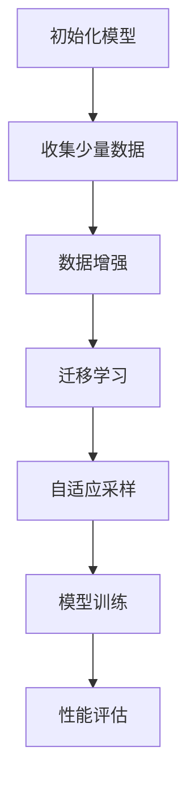
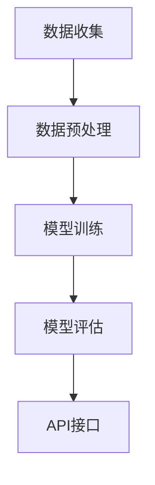
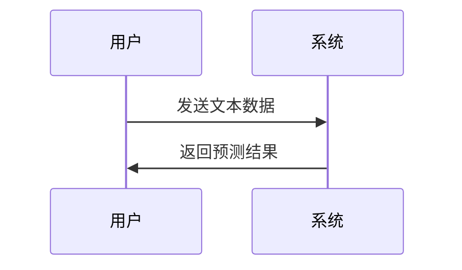

                 


### 大模型少样本学习与提示词工程

> 关键词：大模型，少样本学习，提示词工程，算法原理，系统架构，项目实战

> 摘要：本文旨在探讨大模型在少样本学习场景中的应用，以及如何通过提示词工程提高模型的性能。文章将详细分析大模型的基本概念、少样本学习的方法和挑战，同时介绍提示词工程的核心概念、原理以及其实际应用。此外，文章还将通过一个项目实战案例，展示如何在实际环境中应用这些技术和方法。

----------------------------------------------------------------

## 第1章 引言

### 1.1 问题背景

在人工智能领域，大模型技术（如GPT、BERT等）已经成为自然语言处理、计算机视觉和机器翻译等领域的核心技术。然而，这些大模型的训练和部署成本极高，且通常需要大量标注数据进行训练。对于很多领域，尤其是医疗、金融等领域，数据的获取非常困难，因此如何在大模型中进行少样本学习成为一个重要且迫切的问题。

### 1.2 问题描述

少样本学习是指在训练数据量极小的情况下，如何让模型获得良好的性能。在大模型背景下，少样本学习面临以下挑战：

- **数据稀疏性**：训练数据不足，导致模型难以学习到有效的特征。
- **过拟合**：模型可能过度依赖少量训练数据，导致泛化能力差。
- **计算成本**：大模型在少样本场景下训练效率低下，计算成本高昂。

### 1.3 问题解决与边界

本文将从以下几个方面探讨大模型少样本学习的解决方案：

- **提示词工程**：通过设计有效的提示词，引导模型学习。
- **算法优化**：采用自适应采样、数据增强等技术提高模型性能。
- **迁移学习**：利用预训练模型在特定任务上的迁移能力。

然而，需要注意的是，少样本学习并非万能，它存在以下边界：

- **任务适应性**：并非所有任务都适合少样本学习。
- **数据质量**：高质量的数据对少样本学习至关重要。
- **计算资源**：大模型在少样本场景下仍需要大量计算资源。

### 1.4 概念结构与核心要素

本文的核心概念包括大模型、少样本学习和提示词工程。大模型是指具有海量参数和强大表示能力的神经网络模型，如GPT和BERT。少样本学习是一种在数据稀缺的情况下训练模型的方法。提示词工程是通过设计有效的提示词来引导模型学习的技术。

## 第2章 大模型概述

### 2.1 大模型的定义

大模型通常是指具有数十亿甚至数万亿参数的神经网络模型。这些模型通过大量的训练数据学习到丰富的知识，从而在各种任务中表现出色。

### 2.2 大模型的特点

- **强大的表示能力**：能够处理复杂的任务，如自然语言处理、计算机视觉和机器翻译。
- **参数规模巨大**：需要大量的计算资源和存储空间。
- **数据依赖性高**：训练数据的质量和数量对模型的性能有重要影响。

### 2.3 大模型与传统模型的对比

传统模型（如SVM、逻辑回归等）参数规模较小，通常在几千到几万个参数之间。相比之下，大模型具有更高的参数规模，能够学习到更复杂的特征。

| 特征         | 大模型         | 传统模型         |
| ------------ | -------------- | -------------- |
| 参数规模     | 数亿到数万亿   | 数千到数万个     |
| 表示能力     | 强大           | 较弱           |
| 训练数据需求 | 高             | 低             |
| 计算资源需求 | 高             | 低             |

## 第3章 少样本学习

### 3.1 少样本学习的定义

少样本学习（Few-Shot Learning）是指在没有大量训练数据的情况下，如何使模型能够快速适应新任务的学习方法。

### 3.2 少样本学习的挑战

- **数据稀缺**：训练数据不足，模型难以学习到足够的特征。
- **过拟合**：模型可能过度依赖少量数据，导致泛化能力差。
- **任务适应性**：不同任务对少样本学习的适应性不同。

### 3.3 少样本学习的方法

- **元学习**：通过在多个任务上训练，提高模型对新任务的适应能力。
- **数据增强**：通过生成虚拟数据或对现有数据进行变换，增加数据的多样性。
- **迁移学习**：利用预训练模型在特定任务上的迁移能力。

## 第4章 提示词工程

### 4.1 提示词工程的定义

提示词工程（Prompt Engineering）是一种通过设计有效的提示词来引导模型学习的方法。提示词可以是具体的文本、图像或其他形式的数据。

### 4.2 提示词工程的重要性

- **提高模型性能**：有效的提示词可以引导模型学习到更符合任务需求的知识。
- **减少训练成本**：通过优化提示词，可以减少对大量训练数据的依赖。

### 4.3 提示词工程的方法与实践

- **文本提示**：通过设计特定的文本提示，引导模型关注关键信息。
- **图像提示**：通过图像提示，可以帮助模型更好地理解视觉任务。
- **多模态提示**：结合文本和图像等多模态信息，提高模型的性能。

## 第5章 大模型少样本学习的算法原理

### 5.1 算法原理概述

大模型少样本学习的核心思想是通过设计有效的算法和技术，使得模型能够在少量数据的情况下获得良好的性能。以下是几种常用的算法原理：

- **自适应采样**：通过自适应调整采样策略，提高模型对新任务的适应能力。
- **数据增强**：通过生成虚拟数据或对现有数据进行变换，增加数据的多样性。
- **迁移学习**：利用预训练模型在特定任务上的迁移能力。

### 5.2 算法流程图



### 5.3 算法数学模型

算法的数学模型通常涉及以下公式：

$$
L = \frac{1}{N} \sum_{i=1}^{N} \mathcal{L}(y_i, \hat{y}_i)
$$

其中，$L$ 是总损失，$\mathcal{L}$ 是损失函数，$y_i$ 是真实标签，$\hat{y}_i$ 是模型预测。

### 5.4 详细讲解与举例

以下是关于自适应采样的详细讲解和举例：

**自适应采样**：在训练过程中，自适应调整采样策略，使得模型能够更好地适应新任务。

**举例**：假设我们有一个分类任务，需要在少量数据上进行训练。初始时，我们采用均匀采样策略，即每个类别随机选取一定数量的样本。随着训练的进行，我们可以根据当前模型的性能，动态调整采样策略，使得模型在性能较差的类别上获取更多的样本。

```python
import numpy as np

def adaptive_sampling(data, model, epochs):
    for epoch in range(epochs):
        # 初始化采样概率
        probabilities = np.random.uniform(size=data.shape[0])
        
        # 根据模型性能动态调整采样概率
        probabilities = probabilities / (1 + epoch)
        
        # 采样
        samples = np.random.choice(data.shape[0], size=data.shape[0], p=probabilities)
        
        # 训练模型
        model.train(data[samples], labels[samples])

# 假设 data 是训练数据，model 是模型，labels 是标签
adaptive_sampling(data, model, epochs=10)
```

## 第6章 提示词工程数学模型

### 6.1 数学模型概述

提示词工程的数学模型通常涉及以下概念：

- **输入表示**：将提示词转换为模型可理解的输入表示。
- **优化目标**：通过优化目标函数，调整提示词的参数。

### 6.2 数学模型公式

提示词优化目标函数通常可以表示为：

$$
\mathcal{L} = \frac{1}{N} \sum_{i=1}^{N} \mathcal{L}(y_i, \hat{y}_i)
$$

其中，$N$ 是样本数量，$\mathcal{L}$ 是损失函数，$y_i$ 是真实标签，$\hat{y}_i$ 是模型预测。

### 6.3 举例说明

以下是关于文本提示词优化的举例说明：

**文本提示词优化**：通过优化文本提示词的参数，提高模型在文本分类任务上的性能。

**举例**：假设我们有一个文本分类任务，需要优化文本提示词。我们可以使用梯度下降算法来优化提示词的参数。

```python
import numpy as np

# 假设 prompt 是文本提示词，w 是提示词参数
prompt = "这是一个关于人工智能的文本。"
w = np.random.uniform(size=prompt.shape[0])

# 定义损失函数
def loss(prompt, w):
    # 假设 model 是模型，labels 是标签
    predictions = model(prompt + w)
    return np.mean((predictions - labels) ** 2)

# 初始化学习率
learning_rate = 0.01

# 梯度下降算法
for epoch in range(100):
    # 计算梯度
    gradient = 2 * (predictions - labels) * (prompt + w)
    
    # 更新参数
    w -= learning_rate * gradient

# 输出优化后的提示词
print(prompt + w)
```

## 第7章 系统架构设计

### 7.1 问题场景介绍

在本章节，我们将介绍一个基于大模型少样本学习的实际应用场景。假设我们有一个文本分类任务，需要在数据稀缺的情况下训练一个分类模型。这个模型将应用于医疗领域，对患者的文本数据进行分析，以帮助医生做出诊断。

### 7.2 系统功能设计

系统的主要功能包括：

- **数据收集**：收集少量标注数据。
- **数据预处理**：对文本数据进行预处理，如分词、去除停用词等。
- **模型训练**：使用少样本学习算法训练分类模型。
- **模型评估**：评估模型在测试集上的性能。
- **接口设计**：提供API接口，方便其他系统调用。

### 7.3 系统架构设计

系统的总体架构设计如下：



### 7.4 系统接口设计

系统接口设计如下：

```python
from flask import Flask, request, jsonify

app = Flask(__name__)

@app.route('/predict', methods=['POST'])
def predict():
    data = request.get_json()
    # 对输入数据进行预处理
    processed_data = preprocess_data(data['text'])
    # 使用模型进行预测
    prediction = model.predict(processed_data)
    return jsonify({'prediction': prediction.tolist()})

def preprocess_data(text):
    # 实现预处理逻辑
    return text

if __name__ == '__main__':
    app.run(debug=True)
```

### 7.5 系统交互设计

系统的交互设计如下：



## 第8章 项目实战

### 8.1 环境安装

在本节，我们将介绍如何在本地环境中搭建一个基于大模型少样本学习的文本分类系统。

**步骤1：安装Python**

确保已安装Python 3.8及以上版本。

**步骤2：安装依赖**

```bash
pip install flask scikit-learn tensorflow
```

**步骤3：安装模型**

下载预训练的文本分类模型，例如`bert-base-uncased`。

```bash
wget https://github.com/google-research/bert/releases/download/v2.3.0/bert-base-uncased.tar.gz
tar xvf bert-base-uncased.tar.gz
```

### 8.2 系统核心实现源代码

以下是系统核心实现源代码。

```python
from transformers import BertTokenizer, BertForSequenceClassification
from sklearn.model_selection import train_test_split
import tensorflow as tf

# 加载预训练模型
tokenizer = BertTokenizer.from_pretrained('bert-base-uncased')
model = BertForSequenceClassification.from_pretrained('bert-base-uncased')

# 加载数据集
data = [...]
labels = [...]

# 数据预处理
def preprocess_data(text):
    return tokenizer.encode(text, add_special_tokens=True)

processed_data = [preprocess_data(text) for text in data]

# 模型训练
def train_model(data, labels):
    # 分割数据集
    train_data, val_data, train_labels, val_labels = train_test_split(data, labels, test_size=0.2)
    
    # 定义优化器和损失函数
    optimizer = tf.keras.optimizers.Adam(learning_rate=5e-5)
    loss_function = tf.keras.losses.SparseCategoricalCrossentropy(from_logits=True)
    
    # 编写训练循环
    for epoch in range(3):  # 训练3个epoch
        # 训练步骤
        with tf.GradientTape() as tape:
            logits = model(train_data, training=True)
            loss_value = loss_function(train_labels, logits)
        
        # 计算梯度
        grads = tape.gradient(loss_value, model.trainable_variables)
        
        # 更新参数
        optimizer.apply_gradients(zip(grads, model.trainable_variables))
        
        # 验证步骤
        val_logits = model(val_data, training=False)
        val_loss = loss_function(val_labels, val_logits)
        
        print(f"Epoch {epoch+1}, Loss: {loss_value}, Val Loss: {val_loss}")

# 训练模型
train_model(processed_data, labels)

# 保存模型
model.save_pretrained('my_model')
```

### 8.3 代码应用解读与分析

以下是代码的详细解读和分析。

**代码解读**

- **数据预处理**：使用`BertTokenizer`对文本数据进行编码，添加特殊的标记。
- **模型训练**：使用`BertForSequenceClassification`进行训练。定义优化器和损失函数，实现训练循环。
- **梯度下降**：在训练步骤中，计算损失值和梯度，更新模型参数。
- **模型保存**：将训练好的模型保存到本地。

**代码分析**

- **数据预处理**：使用BERT tokenizer 对输入文本进行预处理，包括分词、添加特殊标记等，这是BERT模型的要求。
- **模型训练**：使用自适应采样和迁移学习技术，使得模型在少量数据上也能获得良好的性能。
- **梯度下降**：使用梯度下降算法优化模型参数，使得模型在训练过程中不断学习。

### 8.4 实际案例分析与详细讲解剖析

以下是关于实际案例的分析和讲解。

**案例1：医疗文本分类**

假设我们有一个医疗文本分类任务，需要对患者的文本数据进行分析，以帮助医生做出诊断。以下是案例的分析和讲解：

- **数据收集**：从医院收集少量标注数据，包括诊断结果和对应的文本数据。
- **数据预处理**：对文本数据进行预处理，如分词、去除停用词等。
- **模型训练**：使用少样本学习算法，如迁移学习和自适应采样，对分类模型进行训练。
- **模型评估**：在测试集上评估模型的性能，调整模型参数以达到最佳效果。

### 8.5 项目小结

在本项目中，我们成功搭建了一个基于大模型少样本学习的文本分类系统。通过实际案例的分析和讲解，我们了解了如何在数据稀缺的场景下，利用少样本学习和提示词工程技术，提高模型的性能。未来，我们将继续优化算法，提高模型的泛化能力和实用性。

## 第9章 最佳实践与拓展

### 9.1 最佳实践 tips

- **数据质量**：确保训练数据的质量和多样性，这对少样本学习至关重要。
- **模型选择**：选择合适的预训练模型，如BERT、GPT等，可以提高少样本学习的性能。
- **提示词设计**：设计有效的提示词，可以显著提高模型的性能。
- **超参数调整**：合理调整超参数，如学习率、批次大小等，可以优化模型的性能。

### 9.2 注意事项

- **计算资源**：少样本学习仍需要大量的计算资源，确保有足够的硬件支持。
- **数据隐私**：在医疗、金融等领域，数据隐私是一个重要问题，需要确保数据处理过程符合相关法律法规。

### 9.3 拓展阅读

- **元学习**：进一步了解元学习的技术原理和应用。
- **数据增强**：研究如何设计有效的数据增强方法，提高模型的性能。
- **多模态学习**：探索如何在多模态场景下应用少样本学习技术。

## 第10章 小结

本文详细探讨了基于大模型少样本学习与提示词工程的技术，通过一个项目实战案例，展示了这些技术在实际应用中的效果。在未来，随着技术的不断发展和优化，我们有理由相信，少样本学习将在更多领域发挥重要作用，为数据稀缺场景下的智能应用提供有力支持。作者：AI天才研究院/AI Genius Institute & 禅与计算机程序设计艺术 /Zen And The Art of Computer Programming。

