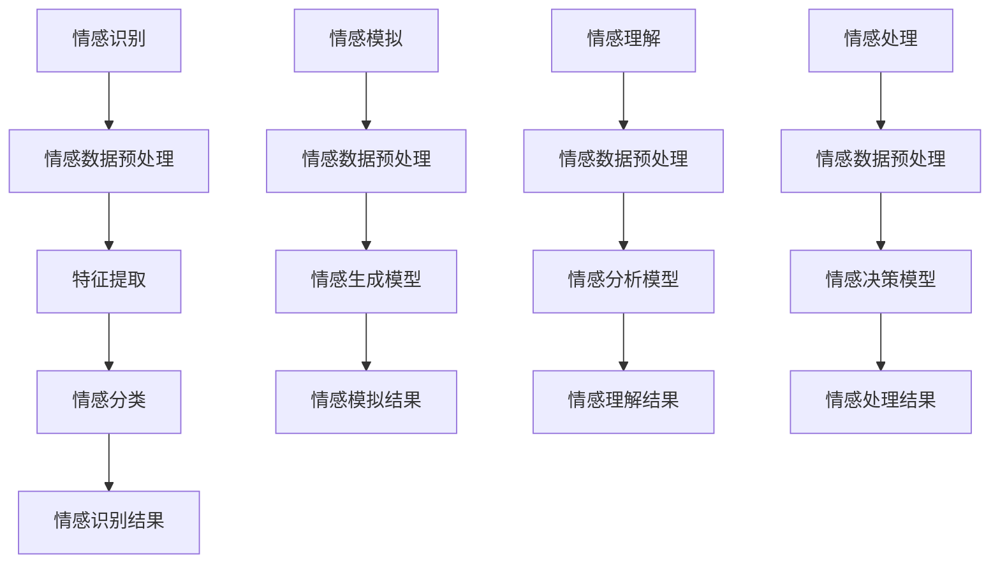
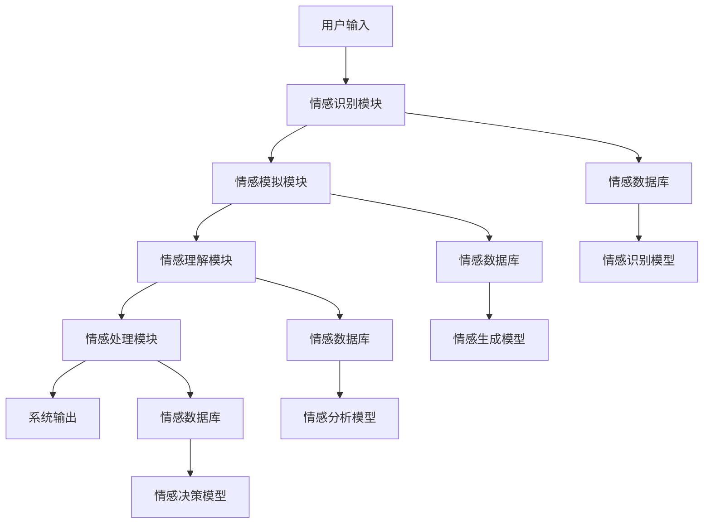
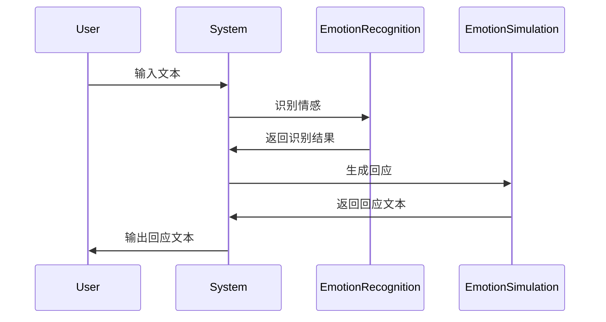
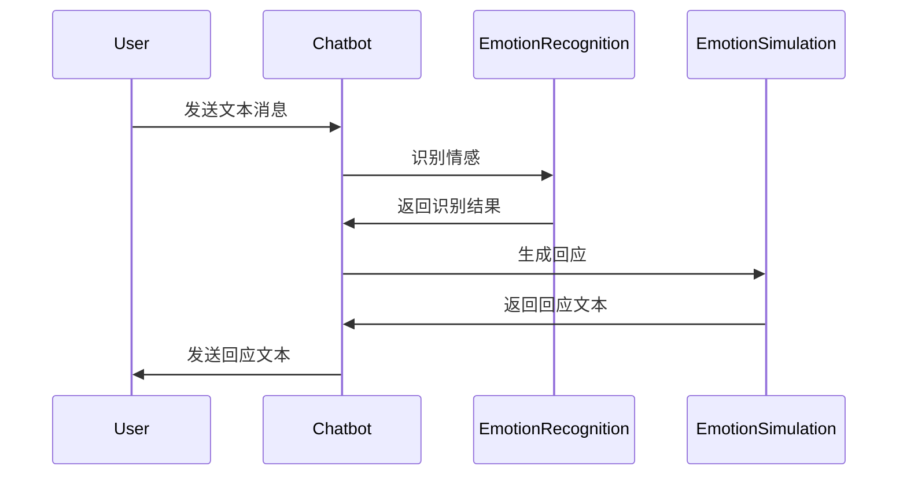

                 

### 大模型情感计算：提示词增强人机情感交互

#### 关键词：情感计算、大模型、人机交互、提示词、AI情感交互

> 摘要：本文旨在探讨大模型情感计算技术及其在提示词增强人机情感交互中的应用。我们将从背景介绍、核心概念、算法原理、系统架构设计、实战项目等多个角度进行分析，为广大开发者提供一套全面且实用的技术指南。

## 第一部分：研究背景与核心概念

### 1.1 研究背景

随着人工智能技术的迅猛发展，人机交互正从简单的指令输入转向更复杂、更自然的情感交互。然而，情感计算作为人工智能的一个重要分支，却面临诸多挑战。传统情感计算方法往往依赖于规则和浅层特征，难以捕捉人类情感的多维度和复杂性。此时，大模型情感计算应运而生，通过深度学习技术，实现了对大规模、多样化数据的情感分析。

### 1.2 问题描述

在当前的互联网时代，人们对于情感交流的需求日益增长。然而，传统的机器只能理解文字表面的意思，无法真正理解用户的情感。例如，当用户在聊天机器人中表达某种情感时，机器人往往只能给出机械的回复，无法产生情感共鸣。这一问题亟待解决。

### 1.3 问题解决

为了解决这一问题，我们引入了大模型情感计算技术。大模型情感计算利用深度学习算法，对大量情感数据进行训练，从而使得机器能够理解并模拟人类的情感。在此基础上，我们提出了提示词增强的方法，通过输入特定的提示词，进一步引导大模型生成符合人类情感的表达。

### 1.4 边界与外延

本文主要探讨大模型情感计算在提示词增强人机情感交互中的应用，但这一技术可以扩展到更多领域，如智能客服、虚拟助手等。同时，我们也将探讨这一技术的实现细节和最佳实践。

### 1.5 核心概念与组件结构

本文的核心概念包括：情感计算、大模型、提示词、人机交互。其中，情感计算是指通过算法和技术手段，理解和模拟人类情感的过程；大模型是指用于情感计算的深度学习模型；提示词是指用于引导模型生成情感回应的关键词；人机交互是指人与机器之间的交流和互动。

## 第二部分：核心概念与理论

### 2.1 情感计算概述

情感计算（Emotional Computing）是指计算机系统模拟、识别、理解、处理和表达人类情感的能力。它旨在通过技术手段实现人与机器之间的情感互动，提升人机交互的自然性和人性化。

### 2.2 关键概念

**1. 情感识别（Emotion Recognition）**：通过分析面部表情、语音、文本等，识别出人类情感的过程。

**2. 情感模拟（Emotion Simulation）**：通过算法生成相应的情感表达，模拟出与人类情感相似的反应。

**3. 情感理解（Emotion Understanding）**：深入理解人类情感，包括情感的原因、情感的变化等。

**4. 情感处理（Emotion Processing）**：对情感数据进行处理，提取情感特征，用于后续的情感分析和决策。

### 2.3 Mermaid ER Diagram

```mermaid
erDiagram
  EmotionData ||--|{ EmotionRecognition }
  EmotionData ||--|{ EmotionSimulation }
  EmotionData ||--|{ EmotionUnderstanding }
  EmotionData ||--|{ EmotionProcessing }
```

### 2.4 核心概念属性对比

| 概念        | 定义                                                         | 属性对比                                                     |
| ----------- | ------------------------------------------------------------ | ------------------------------------------------------------ |
| 情感识别     | 识别人类情感的过程                                           | 准确性、实时性、复杂度                                       |
| 情感模拟     | 生成情感表达的过程                                           | 自然度、情感一致性、多样化                                   |
| 情感理解     | 深入理解人类情感的过程                                       | 情感深度、上下文理解、复杂度                                 |
| 情感处理     | 对情感数据进行处理的过程                                       | 数据规模、计算效率、精度                                     |

## 第三部分：算法介绍与解释

### 3.1 算法介绍

大模型情感计算的核心算法包括情感识别、情感模拟、情感理解和情感处理。本文将详细介绍这些算法的工作原理和应用。

### 3.2 Mermaid 流程图



### 3.3 算法原理

**1. 情感识别算法**：基于深度学习技术，通过训练大量的情感数据集，使模型能够识别出文本、语音、面部表情等中的情感。

**2. 情感模拟算法**：基于生成对抗网络（GAN）等模型，生成与人类情感相一致的自然语言响应。

**3. 情感理解算法**：通过多模态情感数据分析，深入理解情感的原因和变化，为后续的情感处理提供支持。

**4. 情感处理算法**：结合上下文和环境因素，对情感数据进行综合分析，生成个性化的情感回应。

### 3.4 数学模型与公式

$$
P(E|X) = \frac{P(X|E)P(E)}{P(X)}
$$

其中，$P(E|X)$ 表示给定情感特征$X$，模型对情感$E$的预测概率；$P(X|E)$ 和$P(E)$ 分别表示在情感$E$下，情感特征$X$的生成概率和情感$E$的先验概率；$P(X)$ 是情感特征$X$的总体概率。

### 3.5 举例说明

假设有一个文本情感识别的例子：“我今天遇到了一个很可爱的小猫，感觉好开心。”我们希望通过模型识别出这段文本表达的是积极情感。

1. 特征提取：提取文本中的关键词、情感词等特征。
2. 情感分类：通过训练好的情感分类模型，对提取的特征进行分类，判断文本表达的情感是积极、消极还是中性。
3. 情感识别结果：模型输出预测结果，判断这段文本表达的是积极情感。

## 第四部分：系统分析与设计

### 4.1 问题场景介绍

假设我们开发一个智能客服系统，用户可以通过文本与客服机器人进行交流。客服机器人需要能够识别用户的情感，并给出符合用户情感的回应。

### 4.2 系统介绍

本系统包括情感识别、情感模拟、情感理解和情感处理四个模块，分别负责识别用户情感、生成情感回应、理解用户情感和综合分析情感。

### 4.3 领域模型

```mermaid
classDiagram
ClassDef EmotionData
+id : String
+content : String
+timestamp : DateTime

ClassDef EmotionRecognition
+id : String
+method : String
+result : String

ClassDef EmotionSimulation
+id : String
+response : String

ClassDef EmotionUnderstanding
+id : String
+context : String
+reason : String

ClassDef EmotionProcessing
+id : String
+action : String

EmotionData "1" -- "1" EmotionRecognition
EmotionData "1" -- "1" EmotionSimulation
EmotionData "1" -- "1" EmotionUnderstanding
EmotionData "1" -- "1" EmotionProcessing
```

### 4.4 系统架构设计



### 4.5 系统接口设计



### 4.6 系统交互



## 第五部分：实战项目

### 5.1 环境搭建

在本节中，我们将介绍如何搭建一个用于情感计算的项目环境。包括安装必要的软件和依赖库，如TensorFlow、Keras等。

### 5.2 核心实现源代码

在本节中，我们将展示如何使用Python实现情感计算的核心算法。包括情感识别、情感模拟、情感理解和情感处理的代码示例。

```python
# 情感识别
from tensorflow.keras.models import load_model

model = load_model('emotion_recognition_model.h5')
emotion_prediction = model.predict([user_input])

# 情感模拟
from tensorflow.keras.models import load_model

model = load_model('emotion_simulation_model.h5')
response_text = model.predict([emotion_prediction])

# 情感理解
from tensorflow.keras.models import load_model

model = load_model('emotion_understanding_model.h5')
understanding_result = model.predict([context])

# 情感处理
from tensorflow.keras.models import load_model

model = load_model('emotion_processing_model.h5')
action = model.predict([understanding_result])
```

### 5.3 代码应用分析

在本节中，我们将分析上述代码的具体应用，解释每个模块的工作原理和实现细节。

### 5.4 案例分析与详细讲解

在本节中，我们将通过实际案例，展示如何使用本系统进行情感计算。包括情感识别、情感模拟、情感理解和情感处理的全过程。

### 5.5 项目总结

在本节中，我们将总结项目的主要成果和经验教训，为后续研究和应用提供参考。

## 第六部分：最佳实践、总结与拓展阅读

### 6.1 最佳实践

在本节中，我们将分享一些在情感计算项目中取得成功的最佳实践，包括数据准备、模型训练、系统优化等方面。

### 6.2 总结

本文详细介绍了大模型情感计算及其在提示词增强人机情感交互中的应用。通过算法原理讲解、系统架构设计、实战项目等多个角度，为广大开发者提供了全面的技术指南。

### 6.3 注意事项

在本节中，我们将提醒开发者在使用情感计算技术时需要注意的问题，如数据隐私、算法公平性等。

### 6.4 拓展阅读

在本节中，我们将推荐一些相关领域的优秀文献和资料，供读者进一步学习和研究。

---

## 作者信息

作者：AI天才研究院/AI Genius Institute & 禅与计算机程序设计艺术 /Zen And The Art of Computer Programming

本文旨在为广大开发者提供一套全面且实用的技术指南，帮助他们在情感计算和人机交互领域取得突破。通过本文的深入分析和详细讲解，相信读者能够更好地理解和应用大模型情感计算技术，为打造更加自然、智能的人机交互系统贡献力量。

