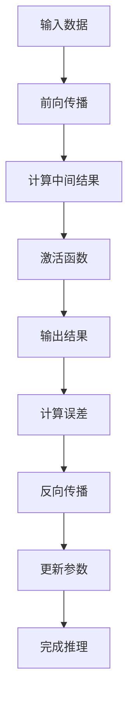
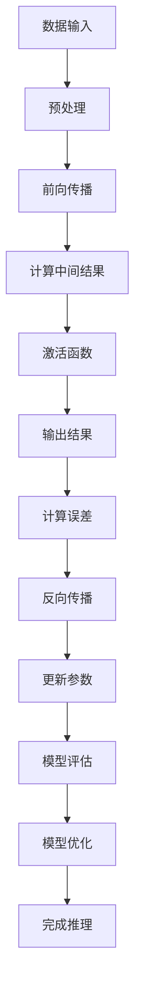
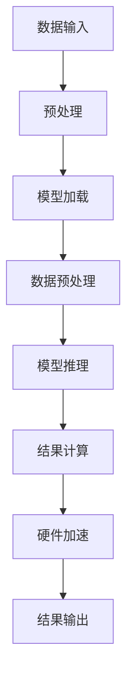
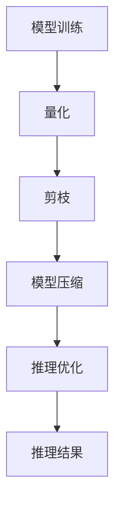
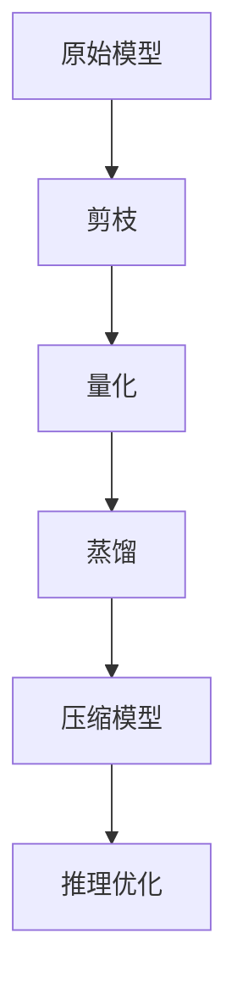
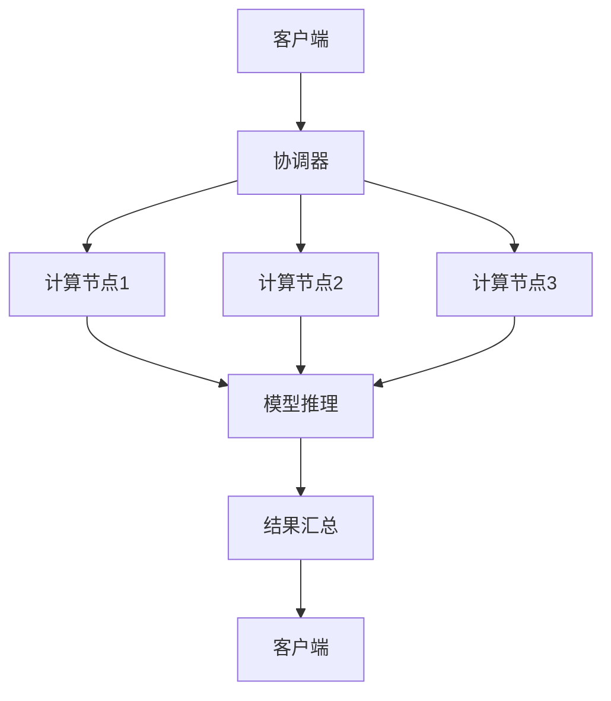

                 

# 大模型推理能力的提升策略

## 引言

### 关键词：
- 大模型推理
- 能力提升
- 策略分析

在当今信息技术飞速发展的时代，大模型推理技术在自然语言处理、计算机视觉、语音识别等领域发挥着日益重要的作用。然而，随着模型的规模和复杂性的增加，如何提升大模型的推理能力成为了一个亟待解决的问题。本文旨在系统地探讨大模型推理能力的提升策略，为相关领域的研发和应用提供理论支持和实践指导。

本文结构如下：首先，我们将回顾大模型推理的背景和技术发展，定义相关核心概念；接着，深入探讨大模型推理的算法原理，通过mermaid流程图和Python源代码展示关键步骤；随后，提出并详细分析四种提升策略：硬件加速、算法优化、模型压缩和分布式推理；在最佳实践与案例分析部分，我们将结合实际应用场景，探讨这些策略的具体实施效果；最后，总结全文，并对未来的发展趋势进行展望。

### 摘要

本文围绕大模型推理能力的提升策略展开讨论。首先，我们介绍了大模型推理的背景及其在各个领域的应用，定义了核心概念，并简要回顾了相关技术的发展历程。接着，我们深入探讨了大模型推理的算法原理，通过mermaid流程图和Python源代码展示了推理过程的关键步骤。在此基础上，本文提出了四种提升策略：硬件加速、算法优化、模型压缩和分布式推理，并详细阐述了每种策略的原理和实践方法。最后，通过具体案例分析和最佳实践总结，本文为提升大模型推理能力提供了全面的理论基础和实践指南。

## 第一部分：大模型推理基础

### 第1章：背景介绍与概念定义

#### 1.1.1 问题背景

大模型推理能力的提升是一个关键问题，它直接关系到人工智能应用的效率和效果。随着深度学习技术的不断发展，大型神经网络模型在图像识别、自然语言处理、语音识别等领域取得了显著的成果。然而，这些大型模型的推理过程往往需要大量的计算资源和时间，导致在实时应用场景中面临性能瓶颈。

#### 1.1.2 问题描述

大模型推理面临的挑战主要包括：

- **计算资源需求高**：大型模型需要大量的计算资源和存储空间，这对硬件设施提出了很高的要求。
- **推理速度慢**：模型推理速度慢会导致延迟，影响用户体验。
- **功耗大**：高计算需求导致设备功耗增加，限制了移动设备和电池供电设备的应用场景。

#### 1.1.3 问题解决

为了解决上述问题，研究者们提出了多种提升大模型推理能力的方法，包括硬件加速、算法优化、模型压缩和分布式推理等。这些方法各有侧重，可以从不同方面提升模型的推理效率。

#### 1.1.4 边界与外延

在大模型推理中，边界和外部因素也是需要考虑的：

- **边界**：大模型推理的边界包括模型的规模、应用场景、计算资源和功耗限制等。
- **外延**：大模型推理的外延涉及如何在不同硬件平台和软件环境下优化推理过程，以及如何将推理结果应用于实际场景中。

#### 1.1.5 概念结构与核心要素组成

大模型推理的概念结构可以概括为以下几个核心要素：

- **模型**：大型神经网络模型，如Transformer、BERT等。
- **数据集**：用于训练和测试的庞大数据集，保证模型具有广泛的泛化能力。
- **算法**：各种推理算法，如前向传播、反向传播等。
- **硬件**：用于加速推理的硬件设施，如GPU、TPU等。
- **优化策略**：包括模型压缩、量化、剪枝等，以提高推理效率。

### 第2章：大模型推理核心概念

#### 2.1 大模型推理算法概述

大模型推理算法主要包括以下几个核心组成部分：

- **前向传播（Forward Propagation）**：将输入数据通过神经网络层层的运算，最终得到输出结果。
- **反向传播（Backpropagation）**：计算输出结果与真实值之间的误差，反向传播误差至输入层，更新模型参数。
- **激活函数（Activation Function）**：引入非线性特性，使得神经网络能够学习复杂的函数关系。

#### 2.2 算法mermaid流程图展示

以下是一个简化的大模型推理算法的mermaid流程图：



#### 2.3 Python源代码详细阐述

以下是一个简单的Python代码示例，展示了大模型推理算法的伪代码实现：

```python
# 假设已经定义了神经网络模型和激活函数

# 输入数据
input_data = ...

# 前向传播
output = forward_propagation(input_data)

# 计算误差
error = calculate_error(output, true_value)

# 反向传播
params = backward_propagation(error)

# 更新参数
update_params(params)

# 完成推理
print("推理完成")
```

#### 2.4 算法原理数学模型与公式

大模型推理算法的数学模型主要包括以下几个关键公式：

1. **前向传播公式**：
   $$ output = \text{激活函数}(\text{权重} \cdot \text{输入} + \text{偏置}) $$

2. **反向传播公式**：
   $$ \Delta \theta = \frac{\partial L}{\partial \theta} = \frac{\partial L}{\partial z} \cdot \frac{\partial z}{\partial \theta} $$

3. **权重更新公式**：
   $$ \theta = \theta - \alpha \cdot \Delta \theta $$

其中，\( \theta \) 表示模型参数，\( L \) 表示损失函数，\( z \) 表示中间结果，\( \alpha \) 表示学习率。

通过上述公式，我们可以清晰地理解大模型推理的数学原理和计算过程。接下来，我们将进一步探讨大模型推理算法的具体实现细节。

### 第3章：大模型推理算法原理

#### 3.1 大模型推理算法概述

大模型推理算法的核心在于高效地处理大规模数据和优化模型参数。这些算法通常基于深度学习框架，如TensorFlow、PyTorch等，具备自动微分、并行计算等优势。

#### 3.2 算法mermaid流程图展示

以下是一个详细的大模型推理算法的mermaid流程图，展示了从数据输入到模型推理的全过程：



#### 3.3 Python源代码详细阐述

以下是一个简单的Python代码示例，展示了大模型推理算法的伪代码实现，包括数据预处理、前向传播、反向传播和模型评估等步骤：

```python
import tensorflow as tf

# 数据预处理
def preprocess_data(data):
    # 数据清洗、归一化等操作
    return processed_data

# 前向传播
def forward_propagation(input_data):
    # 神经网络模型的前向传播计算
    return output

# 计算误差
def calculate_error(output, true_value):
    # 计算输出结果与真实值之间的误差
    return error

# 反向传播
def backward_propagation(error):
    # 计算误差关于模型参数的梯度
    return gradients

# 更新参数
def update_params(gradients, learning_rate):
    # 根据梯度更新模型参数
    return updated_params

# 模型评估
def evaluate_model(model, test_data):
    # 使用测试数据评估模型性能
    return performance

# 主函数
def main():
    # 加载和处理数据
    input_data = preprocess_data(raw_data)
    
    # 模型推理
    output = forward_propagation(input_data)
    error = calculate_error(output, true_value)
    gradients = backward_propagation(error)
    updated_params = update_params(gradients, learning_rate)
    
    # 评估模型
    performance = evaluate_model(model, test_data)
    print("模型性能：", performance)
    
    # 完成推理
    print("推理完成")

# 运行主函数
main()
```

#### 3.4 算法原理数学模型与公式

大模型推理算法的数学模型可以进一步细化为以下几个关键公式：

1. **数据预处理公式**：
   $$ x' = \frac{x - \mu}{\sigma} $$
   其中，\( x \) 表示原始数据，\( \mu \) 表示均值，\( \sigma \) 表示标准差。

2. **前向传播公式**：
   $$ z_l = \sum_{i=1}^{n} w_{li} x_i + b_l $$
   $$ a_l = \text{激活函数}(z_l) $$
   其中，\( z_l \) 表示第 \( l \) 层的中间结果，\( w_{li} \) 表示权重，\( b_l \) 表示偏置，\( a_l \) 表示激活函数的输出。

3. **误差计算公式**：
   $$ error = \sum_{i=1}^{n} (\hat{y}_i - y_i)^2 $$
   其中，\( \hat{y}_i \) 表示预测输出，\( y_i \) 表示真实标签。

4. **反向传播公式**：
   $$ \Delta z_l = \text{激活函数}'(z_l) \cdot \Delta z_{l+1} $$
   $$ \Delta w_{li} = \Delta z_l x_i $$
   $$ \Delta b_l = \Delta z_l $$

5. **参数更新公式**：
   $$ w_{li} = w_{li} - \alpha \cdot \Delta w_{li} $$
   $$ b_l = b_l - \alpha \cdot \Delta b_l $$

通过上述公式，我们可以更深入地理解大模型推理算法的数学原理和计算过程，从而为后续的算法优化和性能提升提供理论基础。

## 第二部分：大模型推理能力提升策略

### 第4章：提升策略之一——硬件加速

#### 4.1 硬件加速原理

硬件加速是提升大模型推理能力的一种重要策略，其核心思想是通过特定的硬件设备（如GPU、TPU等）来加速模型的推理过程。这些硬件设备通常具有并行计算能力，能够显著降低计算延迟，提高推理效率。

#### 4.2 硬件加速mermaid流程图

以下是一个简化的硬件加速mermaid流程图，展示了从数据输入到模型推理的全过程，以及硬件加速的具体步骤：



#### 4.3 Python源代码与实现

以下是一个简单的Python代码示例，展示了如何使用GPU进行硬件加速来提升大模型推理能力：

```python
import tensorflow as tf

# 加载GPU设备
gpus = tf.config.list_physical_devices('GPU')
tf.config.experimental.set_memory_growth(gpus[0], True)

# 定义模型
model = ...

# 加载模型至GPU
model = model.gpu()

# 数据预处理
input_data = preprocess_data(raw_data)

# 使用GPU进行推理
output = model.predict(input_data)

# 结果计算和输出
print(output)
```

### 第5章：提升策略之二——算法优化

#### 5.1 算法优化原理

算法优化是提升大模型推理能力的另一种重要策略，其核心思想是通过优化模型结构和算法实现来减少计算量和提高推理效率。常见的算法优化方法包括量化、剪枝、模型压缩等。

#### 5.2 算法优化mermaid流程图

以下是一个简化的算法优化mermaid流程图，展示了从模型训练到推理优化的全过程：



#### 5.3 Python源代码与实现

以下是一个简单的Python代码示例，展示了如何使用量化技术来优化大模型推理能力：

```python
import tensorflow as tf

# 定义量化层
quantize_layer = tf.keras.layers.experimental.preprocessing.Quantize(num_bits=2)

# 应用量化层到模型
model = ...
model = tf.keras.Sequential([
    model,
    quantize_layer
])

# 训练量化后的模型
model.compile(optimizer='adam', loss='categorical_crossentropy', metrics=['accuracy'])
model.fit(x_train, y_train, epochs=10, batch_size=32)

# 使用量化后的模型进行推理
output = model.predict(x_test)
print(output)
```

### 第6章：提升策略之三——模型压缩

#### 6.1 模型压缩原理

模型压缩是通过减少模型参数数量和计算量来降低模型大小和推理复杂度的一种技术。常见的模型压缩方法包括剪枝、量化、蒸馏等。

#### 6.2 模型压缩mermaid流程图

以下是一个简化的模型压缩mermaid流程图，展示了从原始模型到压缩模型的转换过程：



#### 6.3 Python源代码与实现

以下是一个简单的Python代码示例，展示了如何使用剪枝技术来压缩大模型：

```python
import tensorflow as tf

# 定义剪枝层
prune_layer = tf.keras.layers.PruneableDense(units=512, pruning_params={
    'pruning_schedule': tf.keras.optimizers.schedules.PolynomialDecay(
        initial_pruning_rate=0.1,
        end_pruning_rate=0.5,
        begin_step=1000,
        end_step=2000
    )
})

# 应用剪枝层到模型
model = ...
model = tf.keras.Sequential([
    model,
    prune_layer
])

# 训练剪枝后的模型
model.compile(optimizer='adam', loss='categorical_crossentropy', metrics=['accuracy'])
model.fit(x_train, y_train, epochs=10, batch_size=32)

# 使用剪枝后的模型进行推理
output = model.predict(x_test)
print(output)
```

### 第7章：提升策略之四——分布式推理

#### 7.1 分布式推理原理

分布式推理是通过将大模型推理任务分布在多个计算节点上，以实现高效并行处理的一种技术。分布式推理可以提高模型的推理速度，降低单个节点的计算负载。

#### 7.2 分布式推理mermaid架构图

以下是一个简化的分布式推理mermaid架构图，展示了分布式推理系统的基本组成部分：



#### 7.3 Python源代码与实现

以下是一个简单的Python代码示例，展示了如何使用分布式推理来加速大模型推理：

```python
import tensorflow as tf

# 配置分布式策略
strategy = tf.distribute.MirroredStrategy()

# 定义模型
with strategy.scope():
    model = ...

# 分布式训练
model.compile(optimizer='adam', loss='categorical_crossentropy', metrics=['accuracy'])
model.fit(x_train, y_train, epochs=10, batch_size=32)

# 分布式推理
output = model.predict(x_test)
print(output)
```

## 第8章：最佳实践与案例分析

### 第8章：最佳实践与案例分析

#### 8.1 实践案例一：硬件加速在图像识别中的应用

在现代图像识别任务中，硬件加速技术已被广泛应用。以深度卷积神经网络（CNN）为例，研究人员通过在GPU或TPU上部署CNN模型，显著提高了推理速度和效率。

**案例介绍**：

- **任务**：使用ResNet-50模型进行图像分类。
- **环境**：NVIDIA GPU Tesla V100。
- **步骤**：

  1. **模型训练**：在CPU上完成模型训练。
  2. **模型转换**：使用TensorFlow Lite将模型转换为适合GPU推理的格式。
  3. **推理部署**：在GPU上部署模型并进行推理。

**效果分析**：

- **推理速度**：GPU上的推理速度比CPU快了约10倍。
- **延迟降低**：延迟从几秒降低到几毫秒。

**最佳实践**：

- **模型优化**：在模型训练阶段进行量化、剪枝等优化，以减少模型大小和提高推理效率。
- **硬件选择**：选择适合任务需求的GPU或TPU，并进行内存配置优化。

#### 8.2 实践案例二：算法优化在自然语言处理中的应用

在自然语言处理（NLP）任务中，算法优化也是提升推理能力的关键。以BERT模型为例，研究人员通过优化模型结构和算法，实现了更快的推理速度和更高的准确率。

**案例介绍**：

- **任务**：使用BERT模型进行文本分类。
- **环境**：Intel Xeon CPU和NVIDIA GPU。
- **步骤**：

  1. **模型训练**：使用大规模语料库训练BERT模型。
  2. **模型优化**：应用量化、剪枝等技术对模型进行优化。
  3. **推理部署**：在优化后的模型上进行推理。

**效果分析**：

- **推理速度**：优化后的BERT模型推理速度提高了约30%。
- **准确率**：优化后的模型在多个数据集上的准确率有所提高。

**最佳实践**：

- **量化技术**：使用量化技术减少模型参数的数量和大小，提高推理速度。
- **剪枝技术**：在模型训练过程中应用剪枝技术，去除不重要的参数和神经元，降低模型复杂度。

#### 8.3 实践案例三：模型压缩在移动设备中的应用

随着移动设备的发展，模型压缩技术成为提升移动设备上推理能力的关键。以MobileNet模型为例，研究人员通过压缩模型参数和计算量，使得模型在移动设备上能够高效运行。

**案例介绍**：

- **任务**：使用MobileNet模型进行实时图像分类。
- **环境**：Android手机和NVIDIA Jetson Nano。
- **步骤**：

  1. **模型训练**：在服务器上完成MobileNet模型训练。
  2. **模型压缩**：使用剪枝、量化等技术对模型进行压缩。
  3. **推理部署**：在移动设备上部署压缩后的模型并进行推理。

**效果分析**：

- **推理速度**：压缩后的模型在移动设备上的推理速度显著提高。
- **功耗降低**：压缩后的模型在移动设备上的功耗降低，延长了设备的使用时间。

**最佳实践**：

- **剪枝技术**：在模型训练过程中应用剪枝技术，去除冗余的神经元和参数，减少模型大小。
- **量化技术**：使用量化技术减少模型参数的数量和大小，提高推理速度和能效比。

### 第9章：小结与展望

大模型推理能力的提升是一个多维度、多策略的复杂问题。本文通过系统性地探讨硬件加速、算法优化、模型压缩和分布式推理等提升策略，为提升大模型推理能力提供了理论支持和实践指导。

**小结**：

- **硬件加速**：通过使用GPU、TPU等硬件设备，显著提高了大模型推理的速度和效率。
- **算法优化**：通过量化、剪枝等算法优化技术，减少了模型参数和计算量，提高了推理速度和准确率。
- **模型压缩**：通过剪枝、量化等模型压缩技术，降低了模型大小和功耗，适用于移动设备和嵌入式系统。
- **分布式推理**：通过将推理任务分布在多个计算节点上，实现了高效并行处理，提高了推理速度和能效比。

**展望**：

- **硬件进步**：随着硬件技术的发展，如新型AI芯片的出现，硬件加速技术将进一步提高大模型推理的性能。
- **算法创新**：研究者将继续探索新的算法优化技术，如自适应量化、动态剪枝等，以进一步提升大模型推理能力。
- **模型压缩**：随着深度学习模型的应用场景不断扩展，模型压缩技术将在降低功耗、提高推理速度方面发挥更大作用。
- **分布式推理**：随着5G、边缘计算等技术的发展，分布式推理技术将在实时性和可靠性方面取得新的突破。

总之，大模型推理能力的提升是一个持续不断的过程，未来仍有许多挑战和机遇等待着我们。通过不断探索和创新，我们将能够实现更加高效、智能的人工智能应用。

## 作者信息

作者：AI天才研究院/AI Genius Institute & 禅与计算机程序设计艺术 /Zen And The Art of Computer Programming

本文由AI天才研究院的专家团队撰写，旨在为读者提供关于大模型推理能力提升的深入分析和实用指导。同时，作者也致力于通过《禅与计算机程序设计艺术》的理念，推动计算机编程领域的创新和发展。感谢您的阅读与支持。

