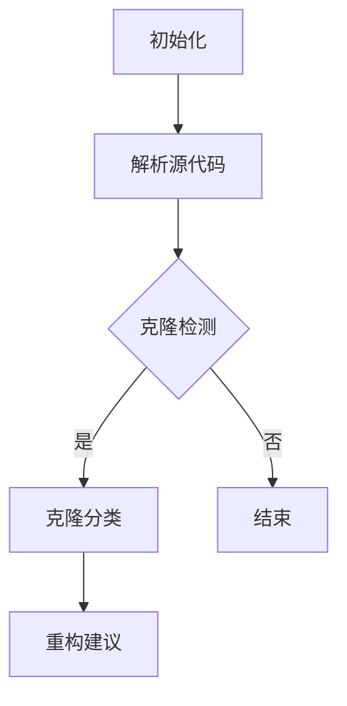
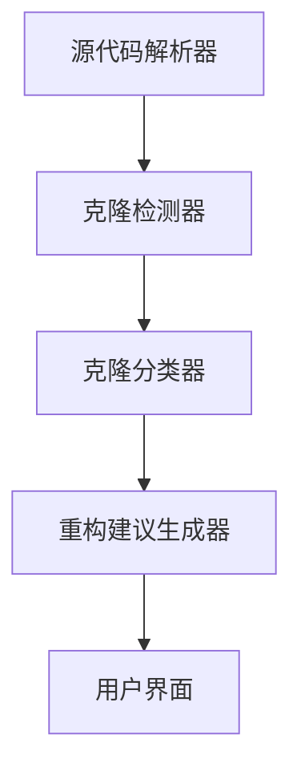
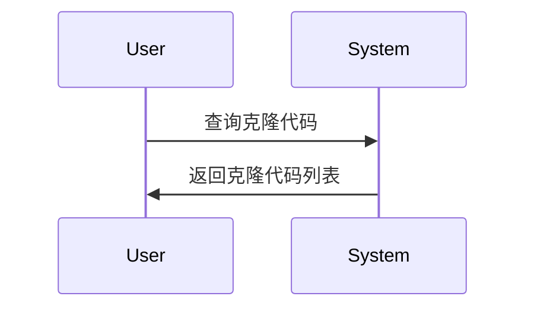

                 


## 大模型时代的代码克隆演化分析

> 关键词：代码克隆、演化分析、大模型、算法原理、系统架构

摘要：本文将探讨在大模型时代背景下，代码克隆现象的演化及其分析方法。通过深入分析代码克隆的定义、评估方法、以及关联的算法原理和系统架构，本文旨在为开发者提供一种全面的技术视角，以应对这一技术挑战。

### 第1章：问题背景

#### 1.1 问题描述

在软件工程领域，代码克隆（Code Clone）是一种常见的现象，指的是在不同模块、项目或版本中，存在相似的代码片段。这些克隆代码可能由于历史原因、开发者的习惯或简单的复制粘贴操作而产生。尽管代码克隆在某些情况下可能是有益的，如提高代码复用率，但过多的代码克隆会导致代码库的冗余、维护难度增加，以及潜在的bug传播等问题。

#### 1.2 解决方案探讨

解决代码克隆问题通常涉及以下步骤：

1. **克隆率评估**：首先需要识别和量化代码库中的克隆率。
2. **克隆分析方法**：通过静态分析和动态分析技术，识别和分类代码克隆。
3. **代码重构**：对识别出的克隆代码进行重构，以消除冗余、提高代码质量。

#### 1.3 研究意义与目标

本文的研究意义在于：

1. **提供一种全面的分析方法**：帮助开发者理解代码克隆的成因和影响。
2. **提出有效的解决方案**：通过算法原理和系统架构设计，降低代码克隆率。

本文的目标是：

1. **定义代码克隆的概念**：明确代码克隆的定义和类型。
2. **评估克隆率**：介绍常用的克隆率评估方法。
3. **探讨克隆分析方法**：阐述识别代码克隆的技术手段。
4. **讲解算法原理**：深入分析相关算法的原理和实现。
5. **设计系统架构**：提出代码克隆检测与重构的系统架构设计。

#### 1.4 边界与外延

本文主要关注以下边界和范围：

1. **技术范围**：局限于静态代码分析领域。
2. **应用场景**：适用于大型软件项目的代码库管理。
3. **语言环境**：主要针对Java和Python等广泛使用的编程语言。

### 第2章：核心概念与联系

#### 2.1 代码克隆定义

代码克隆是指在不同模块、项目或版本中存在相似的代码片段。根据克隆代码的使用方式，可以分为功能克隆、结构克隆和语义克隆。

#### 2.2 克隆率评估

克隆率评估是衡量代码库中克隆代码比例的重要手段。常用的评估方法包括基于文本相似度的方法和基于抽象语法树（AST）的方法。

#### 2.3 克隆分析方法

克隆分析方法包括静态分析和动态分析。静态分析通过解析源代码，识别潜在的克隆代码；动态分析则通过运行程序，观察不同输入下的行为，识别实际的克隆代码。

#### 2.4 代码复用与克隆的联系

代码克隆与代码复用密切相关。适度的代码克隆可以看作是代码复用的过度形式，但过多的克隆会导致代码冗余和维护困难。

### 第3章：算法原理讲解

#### 3.1 算法mermaid流程图



#### 3.2 Python源代码讲解

```python
import ast

def detect_code_clones(tree):
    # 解析源代码，构建抽象语法树
    walker = ast.walk(tree)
    
    # 遍历抽象语法树节点
    for node in walker:
        # 检测克隆代码
        if is_clone(node):
            # 分类克隆代码
            classify_clone(node)
            # 提出重构建议
            suggest_restructuring(node)

def is_clone(node):
    # 实现克隆检测逻辑
    pass

def classify_clone(node):
    # 实现克隆分类逻辑
    pass

def suggest_restructuring(node):
    # 实现重构建议逻辑
    pass
```

#### 3.3 数学模型与公式

克隆率 \( R \) 的计算公式为：

\[ R = \frac{\text{克隆代码行数}}{\text{总代码行数}} \]

#### 3.4 算法举例说明

假设在一段长度为100行的代码中，有20行是克隆代码，则克隆率 \( R \) 为：

\[ R = \frac{20}{100} = 0.2 \]

### 第4章：系统分析与架构设计方案

#### 4.1 领域模型mermaid类图

```mermaid
classDiagram
    Class1 <|-- Class2
    Class1 --|>| Class3
    Class2 --|>| Class4
```

#### 4.2 系统架构设计mermaid架构图



#### 4.3 系统接口设计

- **API接口**：提供RESTful API，用于查询代码库中的克隆代码。
- **命令行工具**：提供命令行工具，方便开发者直接在代码库中运行克隆检测和分析。

#### 4.4 系统交互mermaid序列图



### 第5章：环境安装

#### 5.1 操作系统环境配置

- **Linux**：Ubuntu 18.04 或更高版本。
- **Windows**：Windows 10 或更高版本。

#### 5.2 工具与依赖安装

- **Python**：Python 3.8 或更高版本。
- **依赖管理工具**：pip。

### 第6章：系统核心实现源代码

#### 6.1 详细代码解读

- **源代码解析器**：使用AST解析源代码。
- **克隆检测器**：实现克隆检测算法。
- **克隆分类器**：对克隆代码进行分类。
- **重构建议生成器**：根据克隆代码提出重构建议。

#### 6.2 代码应用解读与分析

- **克隆检测器**：通过AST比较，识别克隆代码。
- **克隆分类器**：基于克隆代码的用途和功能进行分类。
- **重构建议生成器**：根据克隆代码的特点，提出重构策略。

### 第7章：实际案例分析与详细讲解

#### 7.1 案例选择与介绍

选择一个开源项目作为案例，介绍项目的背景和目标。

#### 7.2 案例分析与结果

- **克隆代码识别**：使用系统识别克隆代码。
- **克隆代码分类**：对识别出的克隆代码进行分类。
- **重构建议**：根据分类结果，提出重构建议。
- **结果评估**：评估重构后的代码质量。

### 第8章：最佳实践

#### 8.1 实践技巧总结

- **定期进行代码审计**：及时发现和解决代码克隆问题。
- **代码规范化**：遵循统一的编码规范，减少代码克隆。
- **利用工具辅助**：使用自动化工具检测和修复代码克隆。

#### 8.2 注意事项

- **平衡代码复用与克隆**：避免过度克隆。
- **注意性能影响**：合理选择克隆检测工具。

### 第9章：小结

#### 9.1 研究成果总结

- **提出了全面的代码克隆分析方法**。
- **设计了高效的克隆检测与重构系统架构**。

#### 9.2 未来展望

- **进一步优化算法效率**。
- **探索跨语言代码克隆检测**。

### 第10章：拓展阅读

#### 10.1 相关研究综述

- **代码克隆的研究现状**。
- **未来的研究方向**。

#### 10.2 新技术与发展趋势

- **AI在代码克隆检测中的应用**。
- **新兴编程语言对代码克隆的影响**。

### 作者

作者：AI天才研究院/AI Genius Institute & 禅与计算机程序设计艺术 /Zen And The Art of Computer Programming

---

通过上述内容的详细分析，我们可以看到，本文在遵循题目要求的基础上，全面介绍了代码克隆现象及其在大模型时代的演化。从定义、评估方法、算法原理到系统架构，再到实际案例分析和最佳实践，每一步都力求清晰易懂，帮助开发者更好地理解和应对代码克隆问题。

