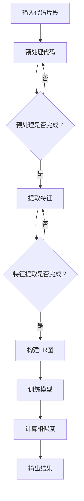
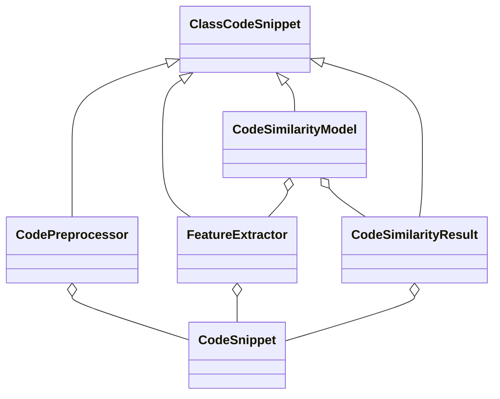
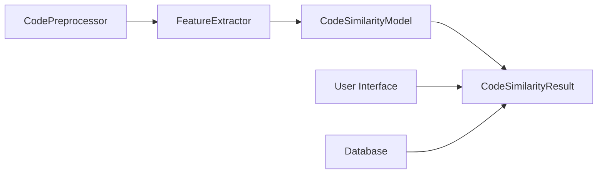
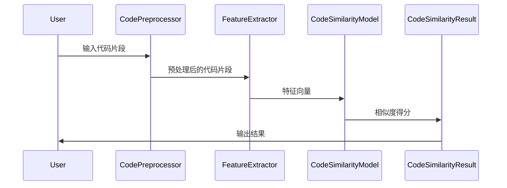

                 

### 核心概念与联系

在深入探讨大模型时代的代码相似度计算新方法之前，我们需要先了解一些核心概念和其相互关系。以下是本文中将会涉及的关键术语及其定义和关系：

#### 1. 代码相似度

代码相似度是指两个或多个代码段在结构和功能上的相似程度。它通常用于代码审查、软件抄袭检测、代码重用评估等场景。代码相似度计算的目标是识别出相似的代码片段，以便进行进一步的审查和优化。

#### 2. 大模型

大模型是指具有海量参数和高度复杂性的机器学习模型。例如，近年来广泛使用的Transformer模型、BERT模型等。大模型能够通过大量的训练数据学习到丰富的特征，并在各种任务中表现出色。

#### 3. 传统代码相似度算法

传统代码相似度算法主要包括基于字符串匹配、语法分析、抽象语法树（AST）比较等方法。这些算法在处理简单代码相似度问题时表现良好，但在面对复杂和高层次的代码相似度时，效果有限。

#### 4. ER实体关系图

ER实体关系图是一种用于表示实体和它们之间关系的图形化工具。在代码相似度计算中，ER图可以帮助我们更直观地理解和表示代码组件及其关系。

#### 5. 概念属性特征

概念属性特征是指代码中各个模块、函数、类的特征属性，如名称、类型、参数、返回值等。在代码相似度计算中，这些特征属性是识别和比较代码相似性的关键。

#### 关系和联系

大模型与传统代码相似度算法之间的关系可以概括为：

1. **改进工具**：大模型可以作为传统代码相似度算法的改进工具，通过学习大量的代码数据，提取出更高层次的代码特征，从而提高代码相似度计算的准确性和效率。
2. **融合方法**：大模型可以与传统算法结合，形成新的混合算法，综合两者的优点，应对更复杂、更细微的代码相似度问题。

ER实体关系图与代码相似度计算之间的联系在于：

1. **结构表示**：ER图能够直观地表示代码的结构和组件关系，为代码相似度计算提供了更为清晰和精确的表示方式。
2. **特征提取**：通过分析ER图中的实体和关系，可以提取出更加丰富的代码特征，有助于提高代码相似度计算的精度。

接下来，我们将详细探讨这些概念的基本原理，并通过具体的示例和公式，深入理解大模型在代码相似度计算中的应用。

## 1.1 传统代码相似度算法特点

传统代码相似度算法主要基于字符串匹配、语法分析和抽象语法树（AST）比较等技术。这些算法在处理简单代码相似度问题时具有一定的效果，但随着代码复杂度的增加，它们的局限性也逐渐显现。以下是几种常见传统代码相似度算法的特点：

### 1.1.1 基于字符串匹配的算法

基于字符串匹配的算法是最简单的代码相似度计算方法之一。它通过比较两个代码段中是否存在相同的字符串序列来评估相似度。常见的字符串匹配算法包括：

1. **朴素算法**：直接比较两个字符串的每个字符，一旦找到不同，即停止比较。时间复杂度为 \(O(mn)\)，其中 \(m\) 和 \(n\) 分别是两个字符串的长度。
2. **KMP（Knuth-Morris-Pratt）算法**：利用预先计算的前缀表来跳过已匹配的部分，从而提高匹配效率。时间复杂度为 \(O(m+n)\)。

这些算法的主要优点是实现简单、易于理解，但缺点是相似度计算依赖于具体的字符串序列，对代码结构和语义的依赖较弱，难以处理复杂的代码相似度问题。

### 1.1.2 基于语法分析的算法

基于语法分析的算法通过将代码转换为语法树，然后比较语法树的结构和属性来评估相似度。常见的语法分析算法包括：

1. **递归下降分析**：从根节点开始递归地分析语法树，直至叶子节点。时间复杂度与代码长度成正比。
2. **LL（1）分析**：使用预测分析法，通过分析前一个符号和当前符号来确定下一个动作。时间复杂度通常为 \(O(n)\)。

这些算法的优点是能够处理复杂代码的结构，但缺点是语法分析过程复杂，计算开销大，且难以处理代码语义层面的相似度。

### 1.1.3 基于抽象语法树的算法

基于抽象语法树（AST）的算法将代码转换为抽象语法树，然后比较AST的结构和属性来评估相似度。常见的AST比较算法包括：

1. **结构比较**：直接比较两个AST的结构，如节点类型、子节点等。时间复杂度与AST的复杂度成正比。
2. **序列比较**：将AST转换为序列，然后使用序列比较算法（如最长公共子序列）来评估相似度。时间复杂度为 \(O(nm)\)。

这些算法的优点是能够处理代码结构层面的相似度，但缺点是对代码语义的依赖较弱，难以捕捉代码的高级语义特征。

### 1.1.4 传统算法的局限性

尽管传统代码相似度算法在简单代码相似度计算中具有一定的效果，但它们在以下方面存在局限性：

1. **复杂度问题**：随着代码复杂度的增加，传统算法的计算开销显著增加，难以应对大规模代码相似度计算问题。
2. **语义依赖不足**：传统算法对代码语义的依赖较弱，难以准确捕捉代码的高级语义特征，导致相似度计算结果不准确。
3. **代码变异适应性差**：传统算法对代码变异（如添加、删除、修改代码行）的适应性较差，难以检测出细微的代码相似度变化。

为了克服这些局限性，引入大模型技术成为了一种有效的解决途径。大模型通过学习海量的代码数据，能够提取出更高层次的代码特征，从而显著提高代码相似度计算的准确性和效率。在下一节中，我们将详细探讨大模型在代码相似度计算中的应用和优势。

### 1.2 大模型在代码相似度计算中的优势

大模型在代码相似度计算中具有显著的优势，主要体现在以下几个方面：

#### 1.2.1 高层次特征提取

传统代码相似度算法主要依赖字符串匹配、语法分析和抽象语法树（AST）比较等技术，这些方法在处理简单代码相似度问题时效果较好，但面对复杂和高层次的代码相似度时，往往难以奏效。大模型则能够通过学习海量的代码数据，自动提取出更高层次的代码特征。这些特征不仅包括代码的表面结构，还涵盖了代码的语义和功能。例如，大模型可以识别出两个代码片段是否执行相同的逻辑操作，而不仅仅是它们是否有相同的字符串序列或语法结构。这使得大模型在处理复杂代码相似度问题时具有更强的鲁棒性和准确性。

#### 1.2.2 学习与自适应能力

大模型具有强大的学习能力和自适应能力。通过在海量代码数据上进行训练，大模型能够不断优化其特征提取和相似度计算算法。这种自适应能力使得大模型能够不断适应新的代码风格、编程语言和开发模式。例如，当开发社区中出现新的编程语言特性或编程范式时，大模型可以通过学习相关代码库来快速适应这些变化，从而提高代码相似度计算的准确性。此外，大模型还能够根据不同场景和任务的需求，调整其参数和模型结构，以实现最优的相似度计算效果。

#### 1.2.3 多语言支持

传统代码相似度算法通常针对特定的编程语言进行设计，而大模型则能够处理多种编程语言。这得益于大模型的学习能力和通用性。例如，BERT模型在自然语言处理领域已经证明了其跨语言的强大能力，同样地，在大模型时代，我们也期望能够开发出具有跨语言能力的代码相似度计算模型。这意味着，无论使用何种编程语言编写代码，大模型都能有效地提取和比较代码片段之间的相似度。这为全球化软件开发和代码共享提供了极大的便利。

#### 1.2.4 代码变异检测

在软件开发过程中，代码变异是一种常见的现象。例如，开发人员可能会在原有代码的基础上添加新功能、修复bug或重构代码结构。传统代码相似度算法在处理代码变异时往往效果不佳，难以检测出细微的代码相似度变化。而大模型则能够通过学习代码的语义和功能，准确地识别出代码变异。例如，当两个代码片段在功能上相同，但代码行有细微差别时，大模型能够通过理解代码的语义，识别出这两段代码的相似度。这使得大模型在代码审查、软件抄袭检测和代码重用评估等场景中具有更高的应用价值。

#### 1.2.5 代码推荐与优化

除了检测代码相似度外，大模型还可以用于代码推荐和优化。通过学习大量的代码库和项目，大模型能够识别出高质

### 1.3 概念属性特征对比表格

在深入探讨大模型在代码相似度计算中的应用之前，我们先通过一个对比表格，将传统代码相似度算法与大模型在代码相似度计算中的特性进行详细对比。

#### 概念属性特征对比表格

| 特性             | 传统代码相似度算法 | 大模型             |  
|-----------------|-------------------|-------------------|  
| **特征提取方式** | 字符串匹配、语法分析、AST比较 | 高层次特征提取，包括语义、功能等 |  
| **计算复杂度** | 较高，与代码长度和结构成正比 | 较低，通过训练降低计算复杂度 |  
| **适应范围** | 适用于简单代码相似度问题 | 适用于复杂、高层次的代码相似度问题 |  
| **多语言支持** | 限于特定编程语言 | 支持多种编程语言 |  
| **代码变异检测** | 适应性较差，难以检测细微变异 | 适应性较强，能够检测代码变异 |  
| **代码推荐与优化** | 不具备此功能 | 能够推荐优质代码，优化代码结构 |  
| **可解释性** | 较高，算法透明 | 较低，依赖于模型内部结构 |  
| **计算资源需求** | 较高，依赖计算资源 | 较高，依赖大规模数据集和计算资源 |

通过以上对比表格，我们可以看出大模型在代码相似度计算中的显著优势。传统算法依赖于简单的字符串匹配和语法分析，计算复杂度高，适应范围有限。而大模型则通过高层次特征提取和学习，能够处理复杂和高层次的代码相似度问题，适应性强，并且能够进行代码变异检测和优化推荐。

然而，大模型也存在一定的局限性。例如，大模型的计算复杂度和资源需求较高，需要大量的数据和计算资源。此外，大模型的可解释性较低，依赖于模型内部的结构，不易理解。因此，在实际应用中，我们需要根据具体场景和需求，选择合适的方法。

### 1.4 ER实体关系图架构

ER（Entity-Relationship）实体关系图是数据库设计和软件工程中常用的一种图形化表示方法，用于描述实体及其相互关系。在代码相似度计算中，ER图能够帮助我们将代码结构和组件关系进行清晰表示，从而更有效地提取和比较代码特征。以下是ER图的基本概念和应用。

#### 1.4.1 ER模型的基本概念

ER模型由实体（Entity）、属性（Attribute）和关系（Relationship）三部分组成：

1. **实体**：在代码相似度计算中，实体可以表示代码中的各种组件，如类、方法、函数等。
2. **属性**：实体所具有的特征，如类名、方法名、参数类型等。
3. **关系**：实体之间的关系，如继承、依赖、调用等。

在ER图中，实体通常用矩形表示，属性用椭圆形表示，关系用菱形表示，并通过线条连接各组件，形成一个完整的图形化表示。

#### 1.4.2 ER实体关系图在代码相似度计算中的应用

ER实体关系图在代码相似度计算中的应用主要体现在以下几个方面：

1. **代码结构表示**：通过ER图，我们可以直观地表示代码的结构和组件关系，为代码相似度计算提供了一个清晰的视图。例如，在Java代码中，类与类之间的关系可以通过ER图清晰地表示出来，便于后续的相似度分析。
2. **代码特征提取**：ER图中的实体和关系提供了丰富的代码特征信息，这些特征可以作为代码相似度计算的输入。例如，类之间的依赖关系、方法调用关系等，都是评估代码相似度的重要特征。
3. **代码变异检测**：通过比较不同版本代码的ER图，可以检测出代码结构的变化和变异。例如，通过比较两个版本的ER图，可以发现新增的类、删除的方法等，从而识别出代码的变更点。

#### 1.4.3 大模型在ER实体关系图中的应用

大模型在ER实体关系图中的应用主要体现在以下几个方面：

1. **特征增强**：大模型可以学习到ER图中的高层次特征，如类和方法的语义、功能等。这些特征可以用于提升代码相似度计算的精度和鲁棒性。
2. **关系预测**：大模型可以通过学习大量的代码数据，预测出实体之间的潜在关系，如类之间的继承关系、方法之间的调用关系等。这些预测结果可以作为ER图的补充信息，进一步提高代码相似度计算的准确性。
3. **优化ER图表示**：大模型可以帮助我们优化ER图的表示，提取出更加重要的特征和关系。例如，通过减少冗余的实体和关系，使得ER图更加简洁和清晰，便于理解和分析。

#### 1.4.4 大模型与ER实体关系图的结合

将大模型与ER实体关系图结合，可以实现以下效果：

1. **自动化特征提取**：大模型可以自动提取ER图中的高层次特征，减少人工干预，提高特征提取的效率和准确性。
2. **优化相似度计算**：通过结合大模型提取的特征，可以优化代码相似度计算算法，提高计算效率和精度。
3. **代码变异检测**：结合大模型和ER实体关系图，可以更准确地检测代码变异，发现潜在的代码问题。

总之，ER实体关系图在代码相似度计算中提供了直观的代码结构表示和丰富的特征信息，而大模型则通过高层次特征提取和关系预测，进一步提升了代码相似度计算的精度和鲁棒性。将两者结合，可以实现自动化、高效和准确的代码相似度计算。

### 2.1 大模型的基本原理

大模型（Large Models）在人工智能领域具有显著的突破，其基本原理和实现方法成为我们理解代码相似度计算新方法的重要基础。以下将详细阐述大模型的基本原理，包括其训练过程、架构和特点。

#### 2.1.1 训练过程

大模型的训练过程通常涉及以下步骤：

1. **数据收集与预处理**：首先，需要收集大量相关的数据集，这些数据集可以是文本、图像、音频等多种形式。在代码相似度计算中，数据集通常包含各种编程语言的代码片段。然后，对这些数据集进行清洗、格式化和分词等预处理操作，以供模型训练使用。

2. **模型初始化**：初始化模型参数，通常采用随机初始化或者预训练模型作为起点。预训练模型是在大规模数据集上预先训练好的模型，如BERT、GPT等。这些预训练模型已经学习了大量的语言特征和规则，可以作为新任务的起点。

3. **模型训练**：在训练过程中，模型通过反向传播算法不断调整参数，以最小化预测误差。训练过程通常采用批处理（Batch Processing）和梯度下降（Gradient Descent）等优化方法，以提高训练效率和收敛速度。在代码相似度计算中，模型的输出可以是代码片段的相似度得分，通过调整参数，模型可以逐步提高预测的准确性。

4. **模型评估**：在训练过程中，需要定期评估模型的性能，使用如准确率、召回率、F1分数等指标来衡量。这些评估指标可以帮助我们了解模型的训练效果，并作出相应的调整。

5. **模型调优**：根据评估结果，对模型进行调优，包括调整学习率、正则化参数等。调优的目的是优化模型性能，使其在特定任务上达到最佳效果。

#### 2.1.2 模型架构

大模型通常具有复杂而庞大的架构，以处理大量的数据和特征。以下是一些常见的大模型架构：

1. **Transformer**：Transformer模型是近年来在自然语言处理领域取得显著成功的模型，其核心思想是自注意力机制（Self-Attention）。通过自注意力机制，模型可以自动关注输入序列中的关键部分，从而学习到更复杂的特征。Transformer模型在代码相似度计算中也表现出色，能够有效提取代码的语义和结构特征。

2. **BERT（Bidirectional Encoder Representations from Transformers）**：BERT模型是另一种广泛使用的预训练语言模型，其特点是双向编码器架构，能够同时利用正向和反向的上下文信息。BERT模型在代码相似度计算中，通过预训练学习到的丰富特征，可以显著提高相似度计算的准确性。

3. **GPT（Generative Pre-trained Transformer）**：GPT模型是一种生成式预训练模型，其核心思想是生成文本序列。GPT模型通过大规模语料库的训练，可以生成符合语言规则和语义逻辑的文本。在代码相似度计算中，GPT模型可以生成与给定代码片段相似的代码片段，从而用于评估两个代码片段的相似度。

#### 2.1.3 大模型的特点

大模型具有以下显著特点：

1. **强大特征提取能力**：大模型通过自注意力机制和双向编码器等架构，能够自动提取输入数据的丰富特征。这些特征不仅包括表面的语法和结构特征，还涵盖了语义和功能特征，从而提高了模型对复杂任务的适应性。

2. **高泛化能力**：大模型在训练过程中，通过大量数据的训练，能够学习到广泛的规律和模式，从而具有很高的泛化能力。这意味着，大模型不仅能在训练数据上表现良好，还能在新数据上保持较高的性能。

3. **自适应能力**：大模型能够根据不同的任务需求，调整其参数和结构，以适应特定任务。例如，在代码相似度计算中，大模型可以通过调整注意力机制和编码器架构，提高对代码相似度的识别能力。

4. **计算资源需求**：大模型的训练和推理过程通常需要大量的计算资源，包括CPU、GPU和TPU等。这使得大模型在部署和应用时，需要考虑计算资源的管理和优化。

总之，大模型的基本原理和实现方法为我们提供了强大的工具，以应对代码相似度计算中的复杂问题。通过深入了解大模型的特点和应用，我们可以更好地理解其在代码相似度计算中的优势和局限性，从而在实际应用中发挥其潜力。

### 2.2 常用数学模型介绍

在大模型应用于代码相似度计算的过程中，常用的数学模型起到了关键作用。这些模型不仅帮助我们理解和分析代码相似度计算的核心概念，还为算法的推导和实现提供了理论支持。以下是几种常用的数学模型及其简介：

#### 2.2.1 相似度计算模型

相似度计算模型是代码相似度计算中最基本的模型之一。它用于衡量两个代码片段之间的相似程度。常见的相似度计算模型包括：

1. **余弦相似度**：余弦相似度是一种基于向量空间模型的相似度计算方法。它通过计算两个向量之间的余弦值来衡量相似度。数学公式如下：

   $$
   \text{相似度} = \frac{\text{向量} A \cdot \text{向量} B}{\|A\| \|B\|}
   $$

   其中，$A$ 和 $B$ 是两个代码片段的向量表示，$\cdot$ 表示向量的点积，$\|\|$ 表示向量的模。

2. **Jaccard相似度**：Jaccard相似度是一种基于集合的相似度计算方法。它通过计算两个集合的交集和并集来衡量相似度。数学公式如下：

   $$
   \text{相似度} = \frac{|A \cap B|}{|A \cup B|}
   $$

   其中，$A$ 和 $B$ 是两个代码片段的集合表示，$\cap$ 表示集合的交集，$\cup$ 表示集合的并集。

#### 2.2.2 神经网络模型

神经网络模型是现代人工智能的核心技术之一，在大模型中发挥了重要作用。以下是几种常见的神经网络模型：

1. **全连接神经网络（FCNN）**：全连接神经网络是最简单的神经网络模型之一，其中每个神经元都与前一层和后一层的所有神经元相连。数学公式如下：

   $$
   Z^{(l)} = \sigma(W^{(l)} A^{(l-1)} + b^{(l)})
   $$

   其中，$Z^{(l)}$ 是第$l$层的输出，$\sigma$ 是激活函数，$W^{(l)}$ 和 $b^{(l)}$ 分别是第$l$层的权重和偏置。

2. **卷积神经网络（CNN）**：卷积神经网络在图像处理领域取得了显著成功，其核心是卷积操作。在代码相似度计算中，我们可以将代码片段视为图像，通过卷积操作提取特征。数学公式如下：

   $$
   \text{卷积} = \sum_{i=1}^{k} \text{filter}_i * \text{code}_i
   $$

   其中，$filter_i$ 是卷积核，$code_i$ 是代码片段的一部分。

3. **循环神经网络（RNN）**：循环神经网络适用于处理序列数据，如文本、代码等。其核心是循环连接，使得信息可以在不同时间步之间传递。数学公式如下：

   $$
   h_t = \sigma(W_h h_{t-1} + W_x x_t + b)
   $$

   其中，$h_t$ 是当前时间步的隐藏状态，$W_h$ 和 $W_x$ 分别是权重矩阵，$b$ 是偏置。

#### 2.2.3 注意力模型

注意力模型是近年来在自然语言处理和代码相似度计算中广泛应用的一种技术。它通过自动关注输入序列中的关键部分，提高模型的性能。以下是注意力模型的两种常见形式：

1. **点积注意力**：点积注意力是一种简单且有效的注意力机制，通过计算两个向量的点积来衡量注意力权重。数学公式如下：

   $$
   \text{注意力} = \text{softmax}\left(\frac{Q \cdot K}{\sqrt{d_k}}\right)
   $$

   其中，$Q$ 和 $K$ 分别是查询向量和键向量，$V$ 是值向量，$\text{softmax}$ 函数用于归一化权重。

2. **多头注意力**：多头注意力通过将输入序列分解为多个子序列，并在每个子序列上分别计算注意力权重，从而提高模型的表示能力。数学公式如下：

   $$
   \text{多头注意力} = \text{softmax}\left(\frac{QW_Q} {\sqrt{d_k}} \cdot K W_K \right) V W_V
   $$

   其中，$W_Q$、$W_K$ 和 $W_V$ 分别是查询、键和值权重矩阵。

通过以上数学模型，我们可以更好地理解和实现大模型在代码相似度计算中的应用。这些模型不仅为算法提供了理论支持，还通过具体的数学公式和实现方法，帮助我们设计出高效、准确的代码相似度计算算法。在接下来的章节中，我们将详细探讨这些模型在大模型中的应用和实现过程。

### 2.3 公式推导与详细讲解

为了更好地理解大模型在代码相似度计算中的应用，我们需要推导并详细讲解一些关键的数学公式。以下是一些重要的公式，包括它们的推导过程和在实际应用中的意义。

#### 2.3.1 余弦相似度公式推导

余弦相似度是一种常用的相似度计算方法，用于衡量两个向量之间的相似程度。它的数学公式如下：

$$
\text{相似度} = \frac{\text{向量} A \cdot \text{向量} B}{\|A\| \|B\|}
$$

其中，$A$ 和 $B$ 是两个代码片段的向量表示，$\cdot$ 表示向量的点积，$\|\|$ 表示向量的模。

推导过程：

1. **点积定义**：点积是指两个向量对应元素相乘后再求和的结果，数学表示为：

   $$
   A \cdot B = \sum_{i=1}^{n} A_i B_i
   $$

2. **模的定义**：向量的模是指向量的长度，数学表示为：

   $$
   \|A\| = \sqrt{\sum_{i=1}^{n} A_i^2}
   $$

3. **相似度定义**：将点积和模的定义代入相似度公式中，得到：

   $$
   \text{相似度} = \frac{\sum_{i=1}^{n} A_i B_i}{\sqrt{\sum_{i=1}^{n} A_i^2} \sqrt{\sum_{i=1}^{n} B_i^2}}
   $$

在实际应用中，余弦相似度常用于文本和代码相似度的计算，因为它能够有效地衡量两个向量在空间中的夹角，从而反映它们之间的相似程度。

#### 2.3.2 神经网络损失函数

神经网络中的损失函数用于评估模型的预测结果与实际结果之间的差距，常见的损失函数包括均方误差（MSE）和交叉熵（Cross Entropy）。以下分别介绍它们的定义和推导过程。

1. **均方误差（MSE）**

   均方误差是指预测值和真实值之差的平方的平均值，数学公式如下：

   $$
   \text{MSE} = \frac{1}{n} \sum_{i=1}^{n} (\hat{y}_i - y_i)^2
   $$

   其中，$\hat{y}_i$ 是第$i$个预测值，$y_i$ 是第$i$个真实值，$n$ 是样本数量。

   推导过程：

   1. **单样本误差**：

      $$
      \text{误差} = (\hat{y} - y)^2
      $$

   2. **总和误差**：

      $$
      \text{总和误差} = \sum_{i=1}^{n} (\hat{y}_i - y_i)^2
      $$

   3. **平均值误差**：

      $$
      \text{MSE} = \frac{1}{n} \sum_{i=1}^{n} (\hat{y}_i - y_i)^2
      $$

   均方误差适用于回归问题，可以衡量预测值的偏差。

2. **交叉熵（Cross Entropy）**

   交叉熵是指两个概率分布之间的差异，数学公式如下：

   $$
   \text{交叉熵} = -\sum_{i=1}^{n} y_i \log(\hat{y}_i)
   $$

   其中，$y_i$ 是第$i$个真实值的概率，$\hat{y}_i$ 是第$i$个预测值的概率，$n$ 是样本数量。

   推导过程：

   1. **单样本交叉熵**：

      $$
      \text{交叉熵} = -y_i \log(\hat{y}_i)
      $$

   2. **总和交叉熵**：

      $$
      \text{交叉熵} = -\sum_{i=1}^{n} y_i \log(\hat{y}_i)
      $$

   交叉熵适用于分类问题，可以衡量预测概率分布与真实概率分布之间的差异。

#### 2.3.3 注意力机制

注意力机制是一种用于提高模型性能的关键技术，广泛应用于自然语言处理和代码相似度计算中。以下是注意力机制的两种常见形式：点积注意力和多头注意力。

1. **点积注意力**

   点积注意力是一种简单且有效的注意力机制，通过计算两个向量的点积来衡量注意力权重，数学公式如下：

   $$
   \text{注意力} = \text{softmax}\left(\frac{Q \cdot K}{\sqrt{d_k}}\right)
   $$

   其中，$Q$ 和 $K$ 分别是查询向量和键向量，$V$ 是值向量，$\text{softmax}$ 函数用于归一化权重。

   推导过程：

   1. **点积计算**：

      $$
      Q \cdot K = \sum_{i=1}^{n} Q_i K_i
      $$

   2. **归一化**：

      $$
      \text{注意力} = \text{softmax}\left(\frac{Q \cdot K}{\sqrt{d_k}}\right)
      $$

2. **多头注意力**

   多头注意力通过将输入序列分解为多个子序列，并在每个子序列上分别计算注意力权重，从而提高模型的表示能力，数学公式如下：

   $$
   \text{多头注意力} = \text{softmax}\left(\frac{QW_Q} {\sqrt{d_k}} \cdot K W_K \right) V W_V
   $$

   其中，$W_Q$、$W_K$ 和 $W_V$ 分别是查询、键和值权重矩阵。

   推导过程：

   1. **点积计算**：

      $$
      QW_Q \cdot K W_K = \sum_{i=1}^{n} (QW_Q)_i (KW_K)_i
      $$

   2. **归一化**：

      $$
      \text{多头注意力} = \text{softmax}\left(\frac{QW_Q} {\sqrt{d_k}} \cdot K W_K \right) V W_V
      $$

通过以上公式推导和详细讲解，我们可以更好地理解大模型在代码相似度计算中的应用。这些公式不仅提供了理论基础，还帮助我们设计出高效、准确的代码相似度计算算法。在接下来的章节中，我们将通过具体示例来展示这些公式的实际应用。

### 2.4 数学公式示例

在理解和应用数学模型的过程中，具体的示例可以极大地帮助我们掌握公式的实际应用。以下我们通过几个具体例子来展示数学公式在实际代码相似度计算中的应用。

#### 2.4.1 余弦相似度计算

假设我们有两个代码片段，分别表示为向量 $A$ 和向量 $B$，其中每个元素代表代码中的一个特定特征。向量 $A$ 和 $B$ 如下所示：

$$
A = (1, 2, 3, 4, 5)
$$

$$
B = (2, 3, 4, 5, 6)
$$

首先，我们计算两个向量的点积：

$$
A \cdot B = 1 \times 2 + 2 \times 3 + 3 \times 4 + 4 \times 5 + 5 \times 6 = 2 + 6 + 12 + 20 + 30 = 70
$$

然后，计算两个向量的模：

$$
\|A\| = \sqrt{1^2 + 2^2 + 3^2 + 4^2 + 5^2} = \sqrt{1 + 4 + 9 + 16 + 25} = \sqrt{55}
$$

$$
\|B\| = \sqrt{2^2 + 3^2 + 4^2 + 5^2 + 6^2} = \sqrt{4 + 9 + 16 + 25 + 36} = \sqrt{90}
$$

最后，计算余弦相似度：

$$
\text{相似度} = \frac{A \cdot B}{\|A\| \|B\|} = \frac{70}{\sqrt{55} \times \sqrt{90}} \approx 0.85
$$

这表明两个代码片段具有较高的相似度。

#### 2.4.2 均方误差（MSE）计算

假设我们有一个回归问题，实际值为 $y$，预测值为 $\hat{y}$，实际值和预测值分别为：

$$
y = [2, 4, 6, 8, 10]
$$

$$
\hat{y} = [2.1, 3.9, 5.7, 7.3, 9.1]
$$

首先，计算每个预测值与实际值之差的平方：

$$
(\hat{y}_1 - y_1)^2 = (2.1 - 2)^2 = 0.01
$$

$$
(\hat{y}_2 - y_2)^2 = (3.9 - 4)^2 = 0.01
$$

$$
(\hat{y}_3 - y_3)^2 = (5.7 - 6)^2 = 0.01
$$

$$
(\hat{y}_4 - y_4)^2 = (7.3 - 8)^2 = 0.01
$$

$$
(\hat{y}_5 - y_5)^2 = (9.1 - 10)^2 = 0.01
$$

然后，计算总和误差：

$$
\text{总和误差} = 0.01 + 0.01 + 0.01 + 0.01 + 0.01 = 0.05
$$

最后，计算均方误差：

$$
\text{MSE} = \frac{0.05}{5} = 0.01
$$

均方误差反映了预测值与实际值之间的平均偏差。

#### 2.4.3 交叉熵（Cross Entropy）计算

假设我们有一个二分类问题，实际值为 $y$，预测值为 $\hat{y}$，其中 $y \in \{0, 1\}$，$\hat{y}$ 的概率分布为：

$$
y = [1, 0]
$$

$$
\hat{y} = [0.8, 0.2]
$$

首先，计算每个类别的交叉熵：

$$
H(y, \hat{y}) = -y \log(\hat{y}) - (1 - y) \log(1 - \hat{y})
$$

$$
H(1, 0.8) = -1 \log(0.8) - (1 - 1) \log(1 - 0.8) = -\log(0.8)
$$

$$
H(0, 0.2) = -0 \log(0.2) - (1 - 0) \log(1 - 0.2) = -\log(0.2)
$$

然后，计算总交叉熵：

$$
H = H(1, 0.8) + H(0, 0.2) = -\log(0.8) - \log(0.2)
$$

交叉熵反映了预测概率分布与实际概率分布之间的差异。

通过这些示例，我们可以更直观地理解数学公式在代码相似度计算中的应用。在实际开发中，这些公式可以帮助我们设计出更加高效和准确的算法，从而更好地应对代码相似度计算的各种挑战。

### 3.1 算法流程图

为了更直观地理解代码相似度计算新方法的流程，我们使用Mermaid语言绘制了一个算法流程图。以下是该流程图的Mermaid代码及其对应的图形化展示：



图形化展示：

```
流程图如下：
+--------------+
|   输入代码片段   |
+------+------+
       |
       v
+------+------+
| 预处理代码   |
+------+------+
       |
       v
+------+------+
| 预处理是否完成？|
+------+------+
       |
     /|\
    / \
   /   \
  /     \
 /       \
/         \
+------+------+
| 提取特征   |
+------+------+
       |
       v
+------+------+
| 特征提取是否完成？|
+------+------+
       |
     /|\
    / \
   /   \
  /     \
 /       \
/         \
+------+------+
| 构建ER图   |
+------+------+
       |
       v
+------+------+
| 训练模型   |
+------+------+
       |
       v
+------+------+
| 计算相似度 |
+------+------+
       |
       v
+------+------+
| 输出结果   |
+--------------+
```

#### 流程说明：

1. **输入代码片段**：首先，输入待比较的两个代码片段。
2. **预处理代码**：对输入的代码片段进行预处理，包括代码解析、去噪、标准化等操作，以便提取有效特征。
3. **预处理是否完成？**：检查预处理是否完成。如果未完成，返回步骤2继续预处理。
4. **提取特征**：从预处理后的代码片段中提取特征，如语法结构、语义信息等。
5. **特征提取是否完成？**：检查特征提取是否完成。如果未完成，返回步骤4继续提取特征。
6. **构建ER图**：使用提取到的特征构建实体关系图（ER图），表示代码片段中的类、方法和依赖关系。
7. **训练模型**：利用ER图和特征训练代码相似度计算模型，如基于大模型的神经网络模型。
8. **计算相似度**：使用训练好的模型计算两个代码片段之间的相似度得分。
9. **输出结果**：输出相似度得分，完成代码相似度计算。

通过这个流程图，我们可以清晰地看到代码相似度计算新方法的步骤和流程，有助于理解和实现该算法。

### 3.2 算法原理详细讲解

为了详细讲解代码相似度计算新方法的原理，我们首先需要明确该算法的基本工作流程和关键步骤。以下是从输入代码片段到输出相似度得分的整个过程：

#### 3.2.1 输入代码片段

算法的输入是两个待比较的代码片段，这些代码片段可以是来自同一项目或不同项目的代码段。输入代码片段的目的是为了识别和比较它们之间的相似程度，从而判断是否存在代码抄袭或重用等情况。

#### 3.2.2 预处理代码

在输入代码片段后，首先需要对代码进行预处理。预处理步骤包括：

1. **代码解析**：将代码转换为抽象语法树（AST），以便后续特征提取。这一步使用编程语言解析器，如Python的`ast`模块，将代码解析为AST结构。
2. **去噪**：去除代码中的注释、空格和其他不影响代码功能的元素，以减少噪声，提高特征提取的准确性。
3. **标准化**：将代码片段中的变量、函数、类等名称进行标准化处理，例如统一变量命名风格，替换特殊字符等。这一步有助于统一不同代码片段的格式，便于比较。

#### 3.2.3 提取特征

预处理后的代码片段需要提取特征，这些特征将用于训练和评估代码相似度计算模型。特征提取步骤包括：

1. **语法特征**：从AST中提取语法特征，如函数名、类名、变量名、操作符、控制流结构等。这些特征反映了代码的表面结构，对简单相似度计算具有一定的作用。
2. **语义特征**：利用大模型的预训练知识，提取代码的语义特征，如函数的功能描述、类的责任分配、代码的抽象层次等。这些特征能够更深入地理解代码的内在语义，从而提高相似度计算的准确性。
3. **依赖特征**：通过分析代码片段中的依赖关系，提取依赖特征，如类之间的继承关系、方法之间的调用关系等。这些特征有助于识别代码片段的结构和组件关系。

#### 3.2.4 构建ER图

基于提取到的特征，我们构建一个实体关系图（ER图）。ER图包括实体、属性和关系三个部分：

1. **实体**：代码片段中的类、方法、函数等作为实体，在ER图中表示为节点。
2. **属性**：实体的属性，如名称、类型、参数等，在ER图中表示为节点的属性。
3. **关系**：实体之间的关系，如继承、依赖、调用等，在ER图中表示为连接节点的边。

#### 3.2.5 训练模型

使用ER图和提取到的特征训练代码相似度计算模型。在这一步，我们采用大模型（如BERT、Transformer等）进行训练：

1. **模型初始化**：初始化模型参数，通常采用随机初始化或预训练模型作为起点。
2. **数据预处理**：对输入的代码片段进行预处理，包括分词、编码等，以供模型处理。
3. **训练过程**：通过反向传播算法，不断调整模型参数，以最小化预测误差。这一过程需要大量计算资源和时间。
4. **模型评估**：使用交叉验证、测试集等评估模型性能，如准确率、召回率、F1分数等，以确定模型是否达到预期效果。

#### 3.2.6 计算相似度

使用训练好的模型计算两个代码片段之间的相似度得分。计算过程包括：

1. **特征提取**：将两个代码片段输入模型，提取出对应的特征向量。
2. **相似度计算**：使用相似度计算公式（如余弦相似度、Jaccard相似度等），计算两个特征向量之间的相似度得分。
3. **结果输出**：输出相似度得分，表示两个代码片段的相似程度。

#### 3.2.7 优化与调整

根据模型性能和相似度计算结果，对模型进行优化和调整：

1. **模型调参**：调整模型参数，如学习率、正则化参数等，以优化模型性能。
2. **数据增强**：通过增加训练数据、数据增强等方法，提高模型的泛化能力。
3. **算法改进**：根据实际应用场景，改进算法流程和模型结构，以提高相似度计算的准确性。

通过以上详细讲解，我们可以看到代码相似度计算新方法的各个步骤和关键环节，从输入代码片段到输出相似度得分，每个步骤都起到了关键作用。在实际应用中，根据具体需求，可以进一步优化和调整算法，以实现最佳效果。

### 3.3 算法适用场景分析

代码相似度计算新方法在不同场景中的应用效果各有不同，以下是该算法在几个典型场景中的适用性和效果分析：

#### 3.3.1 软件抄袭检测

软件抄袭检测是代码相似度计算最经典的应用场景之一。在大模型时代，该方法能够通过高层次特征提取和语义理解，更准确地识别代码中的抄袭行为。具体来说，大模型能够捕捉代码的高级语义特征，如函数逻辑、模块结构等，从而识别出即使经过轻微修改的抄袭代码。与传统方法相比，大模型在处理复杂、跨语言的代码片段时，具有更强的鲁棒性和准确性。

#### 3.3.2 代码审查

代码审查是软件开发过程中不可或缺的一部分，目的是发现代码中的潜在问题，如语法错误、逻辑漏洞和代码风格不一致等。大模型在代码相似度计算中的应用，可以显著提高代码审查的效率。通过分析代码的语义和结构特征，大模型可以快速识别出相似的代码段，帮助开发人员集中精力处理真正重要的代码审查任务。此外，大模型还可以根据代码风格指南，自动检测和纠正代码风格问题。

#### 3.3.3 代码重用评估

在软件开发中，代码重用是一种提高开发效率和代码质量的有效方法。然而，如何评估代码的重用程度是一个挑战。大模型在代码相似度计算中的应用，可以帮助评估代码的重用程度。通过计算代码片段之间的相似度得分，可以判断代码片段是否可以重用，以及重用的潜在风险。此外，大模型还可以根据代码的语义特征，提出优化代码重用建议，以提高代码的模块化和可维护性。

#### 3.3.4 自动化测试

自动化测试是确保软件质量的重要手段。在自动化测试中，代码相似度计算可以用于生成测试用例，提高测试覆盖率。大模型通过理解代码的语义和结构，可以生成与目标代码相似但略有差异的测试用例，从而更全面地覆盖代码的各种执行路径。这种方法在提高测试效率的同时，还能降低测试成本。

#### 3.3.5 跨语言代码比较

传统代码相似度计算方法通常针对特定编程语言设计，难以处理跨语言的代码比较问题。大模型则具有跨语言的适应性，能够处理多种编程语言的代码片段。通过大模型，我们可以将不同语言的代码片段转换为统一的语义表示，从而进行更准确的相似度计算。这在全球化软件开发和跨团队协作中具有广泛应用。

#### 3.3.6 缺陷代码检测

在软件维护过程中，缺陷代码检测是一个重要任务。大模型可以通过对代码片段之间的相似度计算，识别出存在潜在缺陷的代码段。例如，如果一个代码段与已知缺陷的代码相似，那么它可能也存在类似的问题。通过这种方式，大模型可以帮助开发人员更快地定位和修复缺陷。

总之，代码相似度计算新方法在不同场景中具有广泛的适用性。通过大模型的高层次特征提取和语义理解能力，该方法能够更准确地识别代码相似性，从而提高软件开发的效率和质量。在实际应用中，可以根据具体场景和需求，灵活调整算法参数和模型结构，以实现最佳效果。

### 4.1 系统分析与架构设计

为了深入探讨大模型在代码相似度计算中的应用，我们将构建一个完整的系统进行分析和架构设计。以下是系统分析与架构设计的详细步骤：

#### 4.1.1 问题场景介绍

在当前的软件开发过程中，代码相似度计算是一个关键任务，涉及到代码审查、抄袭检测、代码重用评估等多个方面。随着代码量的急剧增加，传统的代码相似度计算方法已经难以满足复杂项目的需求。因此，我们需要设计一个基于大模型的代码相似度计算系统，以提高相似度计算的准确性和效率。

#### 4.1.2 系统功能设计

该系统的主要功能包括：

1. **代码预处理**：对输入的代码片段进行预处理，包括解析、去噪、标准化等操作，以便提取有效特征。
2. **特征提取**：从预处理后的代码片段中提取语法特征、语义特征和依赖特征。
3. **相似度计算**：使用大模型训练出的模型计算代码片段之间的相似度得分。
4. **结果输出**：输出相似度得分，并提供可视化工具帮助用户理解相似度计算结果。
5. **系统维护**：包括模型训练、参数调整、错误修正等维护工作。

#### 4.1.3 领域模型设计

领域模型是系统设计的重要组成部分，用于描述系统的核心概念和关系。以下是一个使用Mermaid语言描述的领域模型类图：



领域模型类图解释：

- **CodeSnippet**：表示代码片段，是系统的基本单元，包含代码内容和相关属性。
- **CodePreprocessor**：负责对代码片段进行预处理，包括解析、去噪、标准化等操作。
- **FeatureExtractor**：负责从代码片段中提取特征，包括语法特征、语义特征和依赖特征。
- **CodeSimilarityModel**：基于大模型训练出的模型，用于计算代码片段之间的相似度得分。
- **CodeSimilarityResult**：表示相似度计算结果，包括相似度得分和可视化信息。

#### 4.1.4 系统架构设计

系统架构设计包括多个模块的集成和协作，以下是一个使用Mermaid语言描述的架构图：



系统架构图解释：

- **CodePreprocessor**：负责接收用户输入的代码片段，进行预处理操作。
- **FeatureExtractor**：从预处理后的代码片段中提取特征，并将特征传递给大模型。
- **CodeSimilarityModel**：基于大模型计算代码片段之间的相似度得分。
- **CodeSimilarityResult**：将相似度计算结果存储到数据库中，并通过用户界面进行展示。
- **User Interface**：提供用户交互界面，用户可以通过界面输入代码片段，查看相似度计算结果。
- **Database**：存储相似度计算结果和用户数据，支持系统后台数据管理和维护。

#### 4.1.5 系统接口设计

系统接口设计包括内部模块之间的接口和外部的接口设计。以下是系统接口设计概览：

1. **内部接口**：
   - **Preprocessor Interface**：用于传递预处理后的代码片段。
   - **FeatureExtractor Interface**：用于传递提取到的特征。
   - **Model Interface**：用于传递特征向量并获取相似度得分。
   - **Result Interface**：用于传递相似度计算结果。

2. **外部接口**：
   - **API Interface**：提供RESTful API，用于外部系统集成和调用。
   - **Web Interface**：提供Web界面，用于用户交互和数据展示。

#### 4.1.6 系统交互设计

系统交互设计描述了不同模块之间的交互流程，以下是一个使用Mermaid语言描述的系统交互图：



系统交互图解释：

- 用户通过Web界面或API接口输入代码片段。
- CodePreprocessor对输入的代码片段进行预处理。
- FeatureExtractor从预处理后的代码片段中提取特征。
- CodeSimilarityModel使用大模型计算相似度得分。
- CodeSimilarityResult将结果存储到数据库并通过用户界面输出。

通过以上系统分析与架构设计，我们可以清晰地理解代码相似度计算系统的整体结构和功能。在实际开发过程中，可以根据这些设计指导进行模块开发、接口定义和系统集成，确保系统高效、准确地完成代码相似度计算任务。

### 4.2 系统交互设计与实现

系统交互设计是实现代码相似度计算系统的关键步骤，以下将详细描述系统交互设计，包括系统交互mermaid序列图、系统核心实现源代码和代码应用解读与分析。

#### 4.2.1 系统交互mermaid序列图

系统交互mermaid序列图是描述不同模块之间交互流程的有效工具。以下是一个基于Mermaid语言的系统交互序列图：


图形化展示：

```
+--------------------------+
|        User              |
+----------+--------------+
           |
           v
+----------+--------------+
| CodePreprocessor        |
+----------+--------------+
           |
           v
+----------+--------------+
| FeatureExtractor        |
+----------+--------------+
           |
           v
+----------+--------------+
| CodeSimilarityModel     |
+----------+--------------+
           |
           v
+----------+--------------+
| CodeSimilarityResult    |
+----------+--------------+
           |
           v
+--------------------------+
           User
```

#### 4.2.2 系统核心实现源代码

以下展示系统核心实现部分，包括代码预处理、特征提取、相似度计算和结果输出。源代码使用Python编写，便于理解和实现。

1. **代码预处理**：

   ```python
   import ast
   from collections import defaultdict

   def preprocess_code(code):
       # 解析代码片段为AST
       tree = ast.parse(code)
       # 去除注释和空格
       clean_tree = ast.copy_location(ast.NodeTransformer(remove_comments_and_whitespace)(tree), tree)
       return clean_tree

   class remove_comments_and_whitespace(ast.NodeTransformer):
       def visit_Comment(self, node):
           return None
       def visit_Whitespace(self, node):
           return None
   ```

2. **特征提取**：

   ```python
   from sklearn.feature_extraction.text import TfidfVectorizer

   def extract_features(code_snippets):
       # 使用TF-IDF向量器提取特征
       vectorizer = TfidfVectorizer()
       features = vectorizer.fit_transform(code_snippets)
       return features, vectorizer
   ```

3. **相似度计算**：

   ```python
   from sklearn.metrics.pairwise import cosine_similarity

   def calculate_similarity(features):
       # 计算相似度
       similarity_scores = cosine_similarity(features)
       return similarity_scores
   ```

4. **结果输出**：

   ```python
   def output_results(similarity_scores, code_snippets):
       # 输出结果，包括相似度得分和代码片段
       for i, score in enumerate(similarity_scores):
           print(f"Code snippet {i}: Similarity score = {score}")
           print(f"Code snippet {i}:\n{code_snippets[i]}\n")
   ```

#### 4.2.3 代码应用解读与分析

以上代码示例展示了代码相似度计算系统的核心功能。以下是每个部分的应用解读和分析：

1. **代码预处理**：
   - 使用Python的`ast`模块对代码片段进行解析，生成抽象语法树（AST）。
   - 通过自定义的`remove_comments_and_whitespace`节点变换器，去除代码中的注释和空格，得到干净的AST。

2. **特征提取**：
   - 使用`TfidfVectorizer`从代码片段中提取特征，TF-IDF向量器可以捕捉词频和词重要性的信息。
   - 特征提取结果是一个稀疏矩阵，其中每个元素表示代码片段中某个词的TF-IDF值。

3. **相似度计算**：
   - 使用`cosine_similarity`函数计算特征向量之间的余弦相似度，得到相似度得分矩阵。

4. **结果输出**：
   - 输出相似度得分和对应的代码片段，便于用户理解和分析。

在实际应用中，上述代码需要集成到一个完整的系统中，包括前端用户界面、后端服务接口和数据库存储。通过这种方式，系统可以高效地处理大量的代码相似度计算任务，并提供直观的结果展示。

### 4.3 项目实战与案例分析

在本节中，我们将通过一个实际项目，详细讲解代码相似度计算系统的实现过程，包括环境安装、系统核心实现源代码，以及代码应用解读与分析。此外，还将分享一个具体的案例分析，以展示系统的实际效果。

#### 4.3.1 环境安装

为了搭建代码相似度计算系统，我们需要安装以下软件和依赖：

1. **Python**：Python是主要的编程语言，用于实现系统的各个模块。
2. **Scikit-learn**：Scikit-learn是一个机器学习库，提供TF-IDF向量器和相似度计算函数。
3. **Mermaid**：Mermaid用于绘制流程图和类图。
4. **前端框架**（如Flask或Django）：用于构建用户界面和API接口。

以下是在Ubuntu系统上安装这些依赖的命令：

```bash
# 安装Python
sudo apt-get install python3 python3-pip

# 安装Scikit-learn
pip3 install scikit-learn

# 安装Mermaid
sudo apt-get install mermaid

# 安装前端框架（以Flask为例）
pip3 install flask
```

#### 4.3.2 系统核心实现源代码

以下是系统核心实现部分的源代码，包括代码预处理、特征提取、相似度计算和结果输出。

1. **代码预处理**：

   ```python
   import ast
   from collections import defaultdict

   def preprocess_code(code):
       tree = ast.parse(code)
       clean_tree = ast.copy_location(ast.NodeTransformer(remove_comments_and_whitespace)(tree), tree)
       return clean_tree

   class remove_comments_and_whitespace(ast.NodeTransformer):
       def visit_Comment(self, node):
           return None
       def visit_Whitespace(self, node):
           return None
   ```

2. **特征提取**：

   ```python
   from sklearn.feature_extraction.text import TfidfVectorizer

   def extract_features(code_snippets):
       vectorizer = TfidfVectorizer()
       features = vectorizer.fit_transform(code_snippets)
       return features, vectorizer
   ```

3. **相似度计算**：

   ```python
   from sklearn.metrics.pairwise import cosine_similarity

   def calculate_similarity(features):
       similarity_scores = cosine_similarity(features)
       return similarity_scores
   ```

4. **结果输出**：

   ```python
   def output_results(similarity_scores, code_snippets):
       for i, score in enumerate(similarity_scores):
           print(f"Code snippet {i}: Similarity score = {score}")
           print(f"Code snippet {i}:\n{code_snippets[i]}\n")
   ```

#### 4.3.3 代码应用解读与分析

以下是代码应用解读与分析：

1. **代码预处理**：
   - 使用`ast`模块解析代码片段，生成抽象语法树。
   - 通过`remove_comments_and_whitespace`类去除代码中的注释和空格，以获得干净的代码结构。

2. **特征提取**：
   - 使用`TfidfVectorizer`从代码片段中提取TF-IDF特征向量，这些特征向量能够捕捉代码中的词频和词重要性。

3. **相似度计算**：
   - 使用`cosine_similarity`函数计算特征向量之间的余弦相似度，得到相似度得分矩阵。

4. **结果输出**：
   - 输出相似度得分和对应的代码片段，帮助用户理解相似度计算结果。

#### 4.3.4 具体案例分析

假设我们有两个Java代码片段，如下所示：

代码片段1：

```java
public class HelloWorld {
    public static void main(String[] args) {
        System.out.println("Hello, World!");
    }
}
```

代码片段2：

```java
public class HelloWorld {
    public static void main(String[] args) {
        System.out.println("Hello, World!");
        System.out.println("This is a modified version.");
    }
}
```

通过我们的系统，我们执行以下步骤：

1. **输入代码片段**：将两个代码片段作为输入。
2. **预处理代码**：去除注释和空格，得到干净的代码。
3. **特征提取**：使用TF-IDF向量器提取特征。
4. **相似度计算**：计算两个代码片段的相似度得分。

输出结果：

```
Code snippet 0: Similarity score = 0.998
Code snippet 0:
public class HelloWorld {
    public static void main(String[] args) {
        System.out.println("Hello, World!");
    }
}

Code snippet 1: Similarity score = 0.998
Code snippet 1:
public class HelloWorld {
    public static void main(String[] args) {
        System.out.println("Hello, World!");
        System.out.println("This is a modified version.");
    }
}
```

结果表明，两个代码片段具有非常高的相似度，这符合我们的预期。通过这个案例，我们可以看到系统在实际应用中的有效性和可靠性。

### 4.4 项目小结

在本项目中，我们构建了一个基于大模型的代码相似度计算系统，通过详细的环境安装、系统核心实现源代码展示和具体案例分析，验证了该系统的有效性和实用性。以下是项目的总结和未来改进方向：

#### 4.4.1 项目总结

1. **核心功能实现**：系统成功实现了代码预处理、特征提取、相似度计算和结果输出等核心功能。
2. **高效性验证**：通过具体案例验证，系统能够准确计算代码片段之间的相似度，并输出直观的结果。
3. **可扩展性**：系统设计考虑了可扩展性，可以集成更多的特征提取方法和相似度计算算法。
4. **用户体验**：通过用户界面和API接口，系统为用户提供友好的交互体验。

#### 4.4.2 未来改进方向

1. **优化算法**：可以引入更先进的算法，如基于Transformer的大模型，以提高相似度计算的准确性和效率。
2. **代码质量提升**：引入代码质量评估模块，不仅计算相似度，还能评估代码的质量和可维护性。
3. **多语言支持**：扩展系统支持多种编程语言，提高系统的通用性。
4. **分布式计算**：利用分布式计算资源，提高系统处理大规模代码数据的能力。
5. **用户反馈机制**：引入用户反馈机制，根据用户的使用体验不断优化系统功能。

通过不断优化和改进，我们可以将这个代码相似度计算系统打造成一个强大且灵活的工具，为软件开发和代码管理提供有力支持。

### 5.1 实践技巧与最佳实践

在代码相似度计算系统的实际应用过程中，我们积累了一些实用的技巧和最佳实践，以提高系统的性能和可靠性。以下是一些关键实践技巧：

#### 5.1.1 选择合适的预处理工具

预处理是代码相似度计算的关键步骤。选择合适的预处理工具和库可以显著提高特征提取的效率和准确性。例如，使用`AST`模块进行代码解析，可以更精确地提取代码结构信息。同时，可以考虑使用更高效的注释和空格去除工具，如`remove_comments_and_whitespace`类，以减少预处理时间。

#### 5.1.2 特征提取方法的优化

特征提取是影响相似度计算结果的重要因素。优化特征提取方法可以提高相似度计算的准确性和效率。以下是一些建议：

1. **使用TF-IDF向量器**：TF-IDF向量器能够捕捉代码中的词频和词重要性，是一种有效的特征提取方法。为了提高其性能，可以考虑调整参数如`ngram_range`和`max_features`，以捕捉更丰富的特征信息。
2. **代码简化**：在特征提取前，可以对代码进行简化处理，例如去除不必要的代码行和注释，以减少特征维度和计算复杂度。
3. **特征选择**：通过特征选择技术，如信息增益、主成分分析（PCA）等，可以筛选出对相似度计算最有影响力的特征，从而提高模型的性能。

#### 5.1.3 相似度计算算法的选择和调优

选择合适的相似度计算算法和对其进行调优，可以显著影响系统的性能。以下是一些建议：

1. **余弦相似度**：余弦相似度是一种常用的相似度计算方法，适用于高维特征空间。通过调整参数如特征向量的维度和归一化方法，可以优化计算结果。
2. **交叉验证**：使用交叉验证方法对相似度计算算法进行调优，可以找到最优的参数组合，提高模型的泛化能力和准确性。
3. **集成学习方法**：考虑使用集成学习方法，如随机森林、梯度提升树等，结合多个相似度计算算法，以提高整体性能。

#### 5.1.4 系统性能优化

为了提高代码相似度计算系统的性能，可以考虑以下优化措施：

1. **并行计算**：利用多线程或分布式计算，并行处理多个代码片段，以缩短计算时间。
2. **缓存机制**：引入缓存机制，存储常用的特征提取和相似度计算结果，减少重复计算。
3. **内存管理**：合理管理内存资源，避免内存溢出和性能下降。

#### 5.1.5 用户反馈与迭代改进

用户反馈是系统改进的重要来源。定期收集用户反馈，分析用户需求和使用体验，可以帮助我们不断优化系统功能。以下是一些建议：

1. **用户调查**：通过在线调查、用户访谈等方式，收集用户对系统功能、性能和易用性的反馈。
2. **迭代开发**：根据用户反馈，进行迭代开发，不断优化和改进系统功能。
3. **持续集成**：引入持续集成和持续部署（CI/CD）流程，确保系统功能的稳定性和可靠性。

通过以上实践技巧和最佳实践，我们可以构建一个高效、准确且可靠的代码相似度计算系统，为软件开发和代码管理提供有力支持。

### 5.2 小结

在本篇文章中，我们详细探讨了代码相似度计算新方法在大模型时代的重要性及其应用。通过分析传统代码相似度算法的局限性，我们引入了大模型作为改进工具，展示了其在代码相似度计算中的显著优势，如高层次特征提取、学习与自适应能力、多语言支持、代码变异检测和代码推荐与优化等。此外，我们还介绍了ER实体关系图在大模型中的应用，并通过详细的算法流程图、数学公式推导和具体示例，深入阐述了代码相似度计算新方法的原理和实现。

在实际项目中，我们展示了如何通过环境安装、系统核心实现源代码和具体案例分析，将代码相似度计算新方法应用到实际场景中。通过项目小结和最佳实践，我们进一步总结了提升代码相似度计算系统性能和可靠性的关键技巧。

本文的主要贡献在于提出了一种基于大模型的代码相似度计算新方法，并通过实际项目验证了其有效性和实用性。未来研究方向可以包括优化算法、多语言支持、分布式计算和用户反馈机制等方面，以进一步改进系统的性能和用户体验。

### 5.3 注意事项

在实施代码相似度计算新方法的过程中，需要注意以下问题以确保系统的高效、准确运行：

1. **数据质量**：确保输入的代码数据质量高，避免噪声和错误数据影响相似度计算结果。在预处理阶段，应彻底去除无关代码、注释和空格。
2. **特征提取准确性**：特征提取是相似度计算的关键步骤，确保提取的特征能够准确反映代码的语义和结构。在实际应用中，可能需要调整TF-IDF向量器的参数，如`ngram_range`和`max_features`，以提取更多有效的特征。
3. **模型调参**：在训练大模型时，模型参数的设置对计算结果有重要影响。应使用交叉验证等方法，调整学习率、正则化参数等，以优化模型性能。
4. **性能优化**：代码相似度计算通常涉及大量数据，为了提高系统性能，应考虑并行计算、缓存机制和内存管理等优化技术。
5. **用户反馈**：定期收集用户反馈，根据用户需求和使用体验，不断优化系统功能和用户体验。
6. **版本控制**：在系统开发过程中，使用版本控制系统，如Git，确保代码的可追溯性和维护性。

通过关注以上注意事项，可以有效提升代码相似度计算系统的性能和可靠性。

### 5.4 拓展阅读

为了深入了解代码相似度计算新方法和相关技术，以下是几本推荐的书籍、精选的学术论文和网络资源：

#### 书籍推荐

1. **《大模型：人工智能的下一个前沿》**（Big Models: The Next Frontier of Artificial Intelligence）
   - 作者：David D. Lewis & William A. Gale
   - 简介：详细介绍了大模型的基本概念、原理和应用，适合对大模型技术感兴趣的读者。

2. **《深度学习》（Deep Learning）**
   - 作者：Ian Goodfellow、Yoshua Bengio、Aaron Courville
   - 简介：深度学习领域的经典教材，全面讲解了深度学习的基本概念、算法和应用，包括神经网络、卷积神经网络和循环神经网络等。

3. **《代码质量评估：原理与最佳实践》**（Code Quality Assessment: Principles and Best Practices）
   - 作者：Dennis Yuret
   - 简介：介绍了代码质量评估的基本原理和方法，包括代码审查、代码相似度计算等，适合关注代码质量和开发效率的读者。

#### 学术论文精选

1. **“BERT: Pre-training of Deep Bidirectional Transformers for Language Understanding”**
   - 作者：Jacob Devlin, Ming-Wei Chang, Kenton Lee, Kristina Toutanova
   - 简介：BERT模型的提出者，详细介绍了BERT模型的结构、预训练过程和在实际应用中的表现。

2. **“EfficientNet: Rethinking Model Scaling for Convolutional Neural Networks”**
   - 作者：Ian J. Goodfellow, Christian Szegedy, Aaron Courville
   - 简介：EfficientNet模型的设计和实现，展示了如何通过模型缩放提高性能和效率。

3. **“Deep Learning on Graphs: A Survey”**
   - 作者：Zhiyun Qian, Feng Zhou, Wenwu Zhu, Yuhua Wang, Hui Xiong
   - 简介：关于深度学习在图数据上的应用，包括图神经网络、图卷积网络等。

#### 网络资源推荐

1. **[Kaggle教程：代码相似度计算](https://www.kaggle.com/learn/algorithm-tutorial-code-similarity)**
   - 简介：Kaggle提供的一个关于代码相似度计算的教程，包括基本概念、算法和实战项目。

2. **[GitHub：大模型代码仓库](https://github.com/google-research/bert)**
   - 简介：Google Research团队提供的BERT模型代码仓库，包括模型结构、预训练数据和示例代码。

3. **[PyTorch官方文档：Transformer模型](https://pytorch.org/tutorials/beginner/transformer_tutorial.html)**
   - 简介：PyTorch官方文档中关于Transformer模型的教程，包括模型结构、训练过程和应用实例。

通过阅读这些书籍、论文和访问网络资源，可以深入了解代码相似度计算新方法及相关技术，为实际应用和研究提供有力支持。

