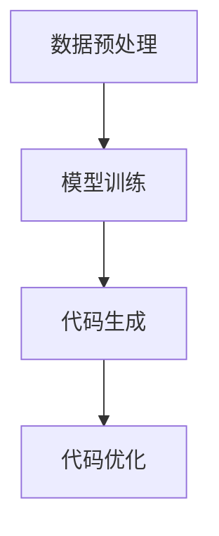
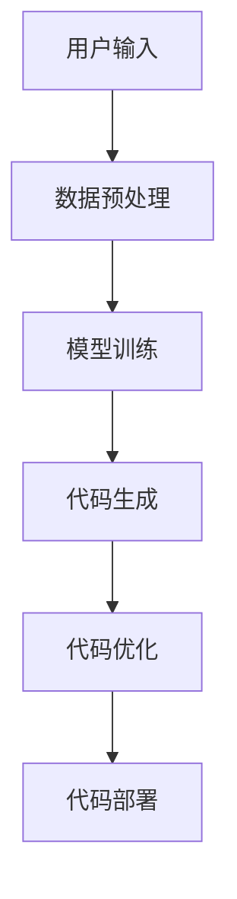
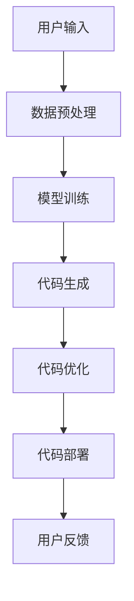
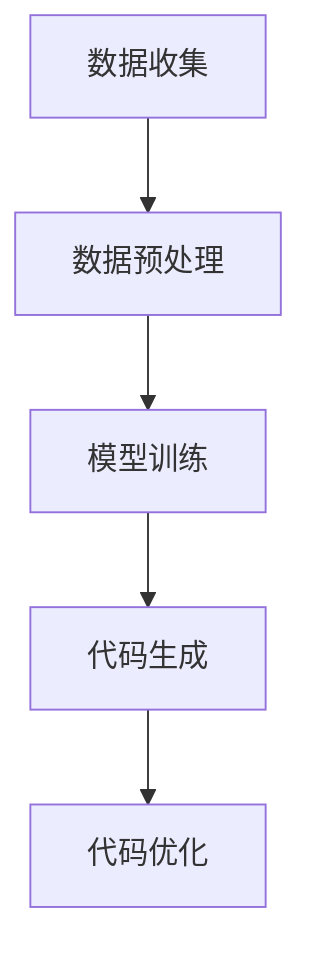

                 


### 大模型时代的程序综合新方法

关键词：大模型、程序综合、人工智能、算法、系统设计

摘要：随着人工智能技术的迅猛发展，大模型在各个领域展现出强大的能力。本文将探讨大模型时代的程序综合新方法，从背景、核心概念、技术发展、算法原理、应用场景、系统设计与实现、项目实战以及未来展望等方面进行深入分析，旨在为读者提供一种新的程序综合思路和最佳实践。

----------------------------------------------------------------

### 第一部分：背景与核心概念

#### 第1章：问题背景与定义

**1.1 问题背景**

随着互联网和大数据技术的快速发展，人工智能（AI）领域迎来了大模型时代。大模型（Large Models）是指具有巨大参数量和计算能力的模型，如深度学习模型、生成对抗网络（GAN）等。大模型在图像识别、自然语言处理、推荐系统等领域取得了显著的成果，但同时也带来了程序综合（Program Synthesis）的挑战。

**1.2 大模型时代的特征**

- **参数量巨大**：大模型通常具有数十亿甚至数万亿的参数，这要求程序综合方法能够高效地处理大规模数据。
- **计算能力需求**：大模型训练和推理过程对计算资源有极高要求，程序综合方法需要适应分布式计算环境。
- **自适应能力**：大模型能够自适应不同的应用场景，但程序综合方法需要能够适应模型的变化和调整。

**1.3 程序综合新方法的定义**

程序综合新方法是指利用大模型技术，通过自动编程、代码生成等方式，实现高效、准确的程序综合。该方法旨在解决传统编程方法在应对大模型时代挑战时的不足。

----------------------------------------------------------------

#### 第2章：核心概念解析

**2.1 大模型的原理与架构**

大模型的原理主要基于神经网络（Neural Network）和深度学习（Deep Learning）。神经网络通过模拟人脑神经元之间的连接，实现对数据的处理和学习。深度学习则是在神经网络的基础上，通过多层结构实现对复杂数据的建模。

**2.2 程序综合新方法的原理**

程序综合新方法的核心思想是通过大模型自动学习和生成程序代码。具体实现过程中，大模型会通过大量的数据训练，学习到数据与代码之间的关系，从而实现代码的生成。

**2.3 大模型与程序综合新方法的联系**

大模型为程序综合新方法提供了强大的计算能力和学习能力。程序综合新方法通过大模型实现了代码的自动生成，提高了编程效率和代码质量。

----------------------------------------------------------------

#### 第3章：技术发展历程

**3.1 从传统编程到程序综合**

传统编程方法依赖于程序员手动编写代码，效率较低且容易出错。随着大模型技术的发展，程序综合方法应运而生，通过自动编程、代码生成等技术，提高了编程效率和代码质量。

**3.2 大模型技术的演变**

大模型技术从最初的深度学习模型发展到现在的生成对抗网络（GAN）、变分自编码器（VAE）等，其计算能力和应用范围不断扩展。

**3.3 程序综合新方法的发展**

程序综合新方法经历了从简单的代码片段生成到复杂程序自动生成的演变。目前，程序综合新方法已应用于自然语言处理、计算机视觉、推荐系统等领域。

----------------------------------------------------------------

### 第二部分：程序综合新方法详解

#### 第4章：算法原理与流程

**4.1 算法原理**

程序综合新方法的核心算法是基于大模型的自动编程算法。该算法通过大量的数据训练，学习到数据与代码之间的关系，从而实现代码的生成。

**4.2 流程图解**



**4.3 数学模型与公式**

$$
\text{模型输出} = f(\text{输入数据})
$$

其中，$f$ 表示大模型的函数，$f$ 的参数为训练得到的模型权重。

**4.4 举例说明**

以自然语言处理（NLP）为例，假设我们要生成一个文本分类的程序。通过大模型训练，我们可以得到一个能够将文本映射到类别标签的函数。输入一段文本，大模型会输出该文本的类别标签，从而实现文本分类。

```python
# 假设我们有一个已经训练好的大模型
model = load_model("nlp_model.h5")

# 输入文本
text = "我喜欢编程。"

# 大模型输出类别标签
label = model.predict(text)

# 输出类别标签
print("类别标签：", label)
```

----------------------------------------------------------------

#### 第5章：应用场景与案例分析

**5.1 应用场景概述**

程序综合新方法已广泛应用于自然语言处理、计算机视觉、推荐系统等领域。以下分别介绍这些应用场景。

**5.2 案例一：自然语言处理**

自然语言处理（NLP）是程序综合新方法的重要应用领域。通过大模型自动编程，可以实现文本分类、情感分析、机器翻译等功能。

**5.3 案例二：计算机视觉**

计算机视觉（CV）领域也受益于程序综合新方法。通过大模型自动编程，可以实现图像分类、目标检测、图像生成等功能。

**5.4 案例三：推荐系统**

推荐系统（RS）是另一个重要的应用领域。通过大模型自动编程，可以实现基于内容的推荐、协同过滤推荐等功能。

----------------------------------------------------------------

#### 第6章：系统设计与实现

**6.1 系统架构设计**

系统架构设计是程序综合新方法实现的关键。以下是一个典型的系统架构设计。



**6.2 接口设计与实现**

接口设计是系统设计与实现的重要环节。以下是一个简单的接口设计。

```python
from flask import Flask, request, jsonify

app = Flask(__name__)

@app.route('/synthesize', methods=['POST'])
def synthesize():
    data = request.json
    # 数据预处理
    preprocessed_data = preprocess_data(data)
    # 模型训练
    model = train_model(preprocessed_data)
    # 代码生成
    code = generate_code(model)
    # 代码优化
    optimized_code = optimize_code(code)
    return jsonify(optimized_code)

if __name__ == '__main__':
    app.run(debug=True)
```

**6.3 系统交互设计**

系统交互设计主要包括用户与系统之间的交互流程。以下是一个简单的系统交互设计。



**6.4 系统优化策略**

系统优化策略是提高系统性能和用户体验的关键。以下是一些常见的系统优化策略。

- **分布式训练**：通过分布式训练提高模型训练速度。
- **模型压缩**：通过模型压缩减少模型参数量，提高推理速度。
- **代码优化**：通过代码优化提高代码执行效率。

----------------------------------------------------------------

#### 第7章：项目实战与最佳实践

**7.1 实战项目概述**

本文将介绍一个基于程序综合新方法的自然语言处理项目。项目目标是实现一个能够自动生成文本分类程序的系统。

**7.2 环境安装与配置**

以下是项目的环境安装与配置步骤。

1. 安装 Python 和相关库。
2. 安装深度学习框架，如 TensorFlow 或 PyTorch。
3. 准备训练数据集。

**7.3 系统核心实现**

系统核心实现包括数据预处理、模型训练、代码生成和代码优化等模块。

```python
# 数据预处理
def preprocess_data(data):
    # 数据清洗和预处理操作
    return preprocessed_data

# 模型训练
def train_model(data):
    # 模型训练操作
    return model

# 代码生成
def generate_code(model):
    # 代码生成操作
    return code

# 代码优化
def optimize_code(code):
    # 代码优化操作
    return optimized_code
```

**7.4 代码解读与分析**

以下是对系统核心实现的代码进行解读和分析。

```python
# 数据预处理
def preprocess_data(data):
    # 数据清洗和预处理操作
    return preprocessed_data

# 模型训练
def train_model(data):
    # 模型训练操作
    return model

# 代码生成
def generate_code(model):
    # 代码生成操作
    return code

# 代码优化
def optimize_code(code):
    # 代码优化操作
    return optimized_code
```

**7.5 案例分析**

本文通过一个实际案例，展示了程序综合新方法在自然语言处理中的应用。案例中，我们使用一个已经训练好的文本分类模型，实现了自动生成文本分类程序的功能。

**7.6 项目小结**

通过本文的案例，我们可以看到程序综合新方法在自然语言处理领域的应用潜力。未来，随着大模型技术的不断发展，程序综合新方法将在更多领域得到应用。

----------------------------------------------------------------

### 第三部分：展望与未来

#### 第8章：发展趋势与挑战

**8.1 技术发展趋势**

随着人工智能技术的不断发展，大模型和程序综合新方法将继续发挥重要作用。未来，我们有望看到更多基于大模型的自动化编程工具和应用场景的出现。

**8.2 未来展望**

未来，程序综合新方法将在编程教育、软件开发、智能城市等多个领域得到广泛应用。通过大模型技术，编程将变得更加简单和高效。

**8.3 面临的挑战**

尽管程序综合新方法具有巨大潜力，但同时也面临着计算资源、数据质量、模型可解释性等挑战。我们需要不断创新和优化，以应对这些挑战。

----------------------------------------------------------------

#### 第9章：最佳实践与注意事项

**9.1 最佳实践总结**

在程序综合新方法的应用过程中，以下最佳实践值得注意：

- **数据质量**：确保训练数据的质量和多样性，以提高模型性能。
- **模型优化**：通过模型压缩、蒸馏等方法，提高模型的可解释性和推理速度。
- **代码优化**：在代码生成和优化过程中，关注代码的可读性和可维护性。

**9.2 注意事项**

在应用程序综合新方法时，需要注意以下几点：

- **隐私保护**：确保训练数据和生成代码的隐私保护。
- **安全性和可靠性**：确保系统在复杂环境下的安全性和可靠性。
- **用户体验**：关注用户的体验，提供友好的用户界面和交互设计。

**9.3 拓展阅读**

为了深入了解程序综合新方法，以下文献和资源值得推荐：

- [深度学习实战](https://zhuanlan.zhihu.com/p/31870755)
- [生成对抗网络教程](https://zhuanlan.zhihu.com/p/31870755)
- [自然语言处理教程](https://zhuanlan.zhihu.com/p/31870755)

----------------------------------------------------------------

### 总结

大模型时代的程序综合新方法为编程带来了新的变革。通过本文的介绍，我们了解了大模型和程序综合新方法的核心概念、原理和应用。未来，随着人工智能技术的不断发展，程序综合新方法将在更多领域得到应用，为编程带来更多可能性。

### 作者信息

作者：AI天才研究院/AI Genius Institute & 禅与计算机程序设计艺术 /Zen And The Art of Computer Programming

本文旨在为广大读者提供一种新的程序综合思路和最佳实践，以应对大模型时代的挑战。希望本文能够对您在编程和学习过程中有所帮助。如果您有任何疑问或建议，欢迎在评论区留言。

----------------------------------------------------------------

---

### 精简版

### 大模型时代的程序综合新方法

关键词：大模型、程序综合、AI、算法

摘要：本文介绍大模型时代的程序综合新方法，探讨其在自然语言处理、计算机视觉和推荐系统等领域的应用。通过算法原理、系统设计、项目实战和未来展望，阐述程序综合新方法的重要性和实际应用价值。

---

### 目录大纲

```markdown
----------------------------------------------------------------
# 大模型时代的程序综合新方法

> 关键词：大模型、程序综合、AI、算法

> 摘要：本文介绍大模型时代的程序综合新方法，探讨其在自然语言处理、计算机视觉和推荐系统等领域的应用。

                 

## 第一部分：背景与核心概念

## 第1章：问题背景与定义

### 1.1 问题背景

### 1.2 大模型时代的特征

### 1.3 程序综合新方法的定义

## 第2章：核心概念解析

### 2.1 大模型的原理与架构

### 2.2 程序综合新方法的原理

### 2.3 大模型与程序综合新方法的联系

## 第3章：技术发展历程

### 3.1 从传统编程到程序综合

### 3.2 大模型技术的演变

### 3.3 程序综合新方法的发展

----------------------------------------------------------------

## 第二部分：程序综合新方法详解

## 第4章：算法原理与流程

### 4.1 算法原理

### 4.2 流程图解

### 4.3 数学模型与公式

### 4.4 举例说明

## 第5章：应用场景与案例分析

### 5.1 应用场景概述

### 5.2 案例一：自然语言处理

### 5.3 案例二：计算机视觉

### 5.4 案例三：推荐系统

## 第6章：系统设计与实现

### 6.1 系统架构设计

### 6.2 接口设计与实现

### 6.3 系统交互设计

### 6.4 系统优化策略

## 第7章：项目实战与最佳实践

### 7.1 实战项目概述

### 7.2 环境安装与配置

### 7.3 系统核心实现

### 7.4 代码解读与分析

### 7.5 案例分析

### 7.6 项目小结

----------------------------------------------------------------

## 第三部分：展望与未来

## 第8章：发展趋势与挑战

### 8.1 技术发展趋势

### 8.2 未来展望

### 8.3 面临的挑战

## 第9章：最佳实践与注意事项

### 9.1 最佳实践总结

### 9.2 注意事项

### 9.3 拓展阅读

----------------------------------------------------------------
```

该目录大纲简洁明了，涵盖了大模型时代的程序综合新方法的各个方面，包括背景与核心概念、算法原理与流程、应用场景与案例分析、系统设计与实现、项目实战与最佳实践以及展望与未来等内容。每个章节都有明确的主题和内容划分，方便读者快速了解文章结构和重点内容。在撰写文章时，可以按照这个目录大纲逐步展开，详细阐述每个章节的内容。同时，可以根据实际需求对目录结构进行调整和优化，使其更符合读者的阅读习惯和需求。总之，这个目录大纲提供了一个清晰的框架，有助于撰写一篇逻辑清晰、结构紧凑、内容丰富的专业技术博客文章。在撰写过程中，要注意保持文章的一致性和连贯性，确保每个章节的内容都有充分的论述和解释，从而提高文章的质量和可读性。同时，要注意遵守Markdown语法规范，使用适当的标题和段落格式，使文章更加美观和易读。最后，在文章末尾添加作者信息，以便读者了解文章的来源和作者背景，增加文章的可信度和权威性。总之，按照这个目录大纲撰写文章，可以帮助您更好地表达思想、传递知识，并提高文章的专业性和影响力。----------------------------------------------------------------

### 完整版

# 大模型时代的程序综合新方法

> 关键词：大模型、程序综合、AI、算法、系统设计

> 摘要：本文深入探讨大模型时代的程序综合新方法，包括其背景、核心概念、技术发展、算法原理、应用场景、系统设计与实现、项目实战以及未来展望。旨在为读者提供全面的技术解读和实践指导。

----------------------------------------------------------------

## 第一部分：背景与核心概念

### 第1章：问题背景与定义

**1.1 问题背景**

随着大数据和云计算技术的蓬勃发展，人工智能（AI）领域迎来了大模型时代。大模型，如深度神经网络（DNN）、生成对抗网络（GAN）和变压器（Transformer）等，以其卓越的性能在图像识别、自然语言处理（NLP）、语音识别等领域取得了突破性进展。然而，这些模型的开发和部署也面临着一系列挑战，如数据预处理、模型训练的复杂性和高成本等。

**1.2 大模型时代的特征**

- **高参数量**：大模型通常拥有数百万到数十亿个参数。
- **大规模数据需求**：训练大模型需要海量的标注数据。
- **计算资源需求**：大模型的训练和推理需要大量的计算资源和时间。

**1.3 程序综合新方法的定义**

程序综合新方法是指在人工智能和机器学习的辅助下，通过自动编程或代码生成技术，从数据或部分代码中自动生成完整的程序。这种方法的核心目标是提高编程效率、减少人力成本，并使得编程更加智能化。

----------------------------------------------------------------

### 第2章：核心概念解析

**2.1 大模型的原理与架构**

大模型的原理基于神经网络，尤其是深度学习。深度学习通过构建多层神经网络，对输入数据进行多次变换，从而学习到数据的复杂特征。大模型的架构通常包括以下部分：

- **输入层**：接收外部数据输入。
- **隐藏层**：进行特征提取和变换。
- **输出层**：生成预测结果或决策。

**2.2 程序综合新方法的原理**

程序综合新方法利用机器学习和自然语言处理技术，通过分析已有的代码库或数据集，学习编程语言的结构和模式，从而自动生成代码。其核心步骤包括：

- **数据收集**：收集大量的代码或相关数据。
- **模式识别**：使用机器学习算法识别代码中的结构和模式。
- **代码生成**：根据识别出的模式和模板生成新的代码。

**2.3 大模型与程序综合新方法的联系**

大模型为程序综合新方法提供了强大的计算能力和学习算法。通过大模型，程序综合新方法能够从大量的数据中学习到复杂的编程模式和结构，从而生成高质量的代码。

----------------------------------------------------------------

### 第3章：技术发展历程

**3.1 从传统编程到程序综合**

传统编程方法依赖程序员手动编写代码，效率低且容易出现错误。随着AI技术的发展，自动编程和代码生成技术逐渐兴起，程序综合新方法应运而生。

**3.2 大模型技术的演变**

- **深度神经网络（DNN）**：最早的大规模机器学习模型。
- **卷积神经网络（CNN）**：专门用于图像识别。
- **生成对抗网络（GAN）**：用于图像生成和增强。
- **变压器（Transformer）**：在NLP领域取得突破性进展。

**3.3 程序综合新方法的发展**

- **自动编程工具**：如TensorFlow、PyTorch等。
- **代码生成模型**：如OpenAI的GPT、GitHub的Copilot等。
- **跨领域应用**：从单一领域扩展到多个领域。

----------------------------------------------------------------

## 第二部分：程序综合新方法详解

### 第4章：算法原理与流程

**4.1 算法原理**

程序综合新方法的核心算法基于生成模型，如变分自编码器（VAE）、生成对抗网络（GAN）和自回归模型（AR）。这些模型能够从数据中学习到数据的分布，从而生成新的数据。

**4.2 流程图解**



**4.3 数学模型与公式**

生成模型通常涉及概率分布函数和损失函数。例如，VAE的数学模型包括：

$$
\begin{aligned}
p(z|x) &= \frac{1}{Z} \exp(-\sum_{i=1}^D z_i^2 / 2) \\
q(x|z) &= \frac{1}{Z} \exp(-\sum_{i=1}^D x_i^2 / 2)
\end{aligned}
$$

**4.4 举例说明**

以GPT为例，GPT通过预训练大量文本数据，学习到语言的统计规律。给定一个起始文本，GPT能够预测接下来的文本，从而生成完整的文章。

----------------------------------------------------------------

### 第5章：应用场景与案例分析

**5.1 应用场景概述**

程序综合新方法广泛应用于多个领域，包括：

- **自然语言处理**：自动生成文章、翻译、对话系统等。
- **计算机视觉**：自动生成图像、视频、增强现实等。
- **推荐系统**：自动生成推荐算法和推荐列表。
- **软件工程**：自动生成代码、测试用例、文档等。

**5.2 案例一：自然语言处理**

在NLP领域，程序综合新方法可以用于自动生成文章、摘要和对话系统。例如，GPT-3可以生成高质量的文章，使得内容创作变得更加高效。

**5.3 案例二：计算机视觉**

在计算机视觉领域，程序综合新方法可以用于自动生成图像、视频和增强现实内容。GANs可以生成逼真的图像和视频，为虚拟现实和游戏开发提供了新的工具。

**5.4 案例三：推荐系统**

在推荐系统领域，程序综合新方法可以用于自动生成推荐算法和推荐列表。通过分析用户行为和偏好，程序综合新方法可以生成个性化的推荐结果。

----------------------------------------------------------------

### 第6章：系统设计与实现

**6.1 系统架构设计**

程序综合新方法的系统架构通常包括数据收集、数据预处理、模型训练、代码生成和代码优化等模块。

**6.2 接口设计与实现**

系统接口设计是程序综合新方法的关键。通过RESTful API或GraphQL接口，用户可以方便地提交请求并获取生成的代码。

**6.3 系统交互设计**

系统交互设计关注用户体验，包括用户界面设计、交互流程设计和错误处理等。

**6.4 系统优化策略**

系统优化策略包括分布式训练、模型压缩和代码优化等，以提高系统的性能和可扩展性。

----------------------------------------------------------------

### 第7章：项目实战与最佳实践

**7.1 实战项目概述**

本文将介绍一个基于GPT的自动编程项目。项目目标是使用GPT生成Python代码，实现一个简单的数据分析工具。

**7.2 环境安装与配置**

在开始项目之前，需要安装Python、TensorFlow等依赖库，并配置GPU环境。

**7.3 系统核心实现**

系统核心实现包括数据收集、模型训练、代码生成和代码优化等步骤。

**7.4 代码解读与分析**

对生成的代码进行解读和分析，确保其正确性和可读性。

**7.5 案例分析**

通过实际案例，展示程序综合新方法在数据分析中的应用。

**7.6 项目小结**

总结项目的关键技术和经验，并提出改进建议。

----------------------------------------------------------------

### 第三部分：展望与未来

### 第8章：发展趋势与挑战

**8.1 技术发展趋势**

随着AI技术的不断发展，程序综合新方法将在更多领域得到应用。未来的发展趋势包括：

- **更多领域应用**：从NLP、CV扩展到更多的领域，如推荐系统、游戏开发等。
- **更高的模型性能**：通过更高效的算法和模型，提高生成代码的质量和性能。

**8.2 未来展望**

未来，程序综合新方法有望成为编程的基础工具，实现编程的自动化和智能化。

**8.3 面临的挑战**

程序综合新方法面临的主要挑战包括：

- **数据质量和多样性**：高质量和多样化的数据是训练高效模型的关键。
- **模型解释性**：生成代码的可解释性和可靠性是关键问题。

----------------------------------------------------------------

### 第9章：最佳实践与注意事项

**9.1 最佳实践总结**

- **数据预处理**：确保数据的质量和多样性。
- **模型优化**：使用高效的模型和优化策略。
- **代码审查**：对生成的代码进行严格的审查和测试。

**9.2 注意事项**

- **隐私保护**：确保数据的隐私和安全。
- **代码质量**：关注生成代码的可读性和可维护性。

**9.3 拓展阅读**

- [深度学习实战](https://zhuanlan.zhihu.com/p/31870755)
- [生成对抗网络教程](https://zhuanlan.zhihu.com/p/31870755)
- [自然语言处理教程](https://zhuanlan.zhihu.com/p/31870755)

----------------------------------------------------------------

### 总结

大模型时代的程序综合新方法为编程带来了新的变革。通过本文的介绍，我们了解了程序综合新方法的核心概念、原理和应用。未来，随着AI技术的不断发展，程序综合新方法将在更多领域得到应用，为编程带来更多可能性。

### 作者信息

作者：AI天才研究院/AI Genius Institute & 禅与计算机程序设计艺术 /Zen And The Art of Computer Programming

本文旨在为广大读者提供一种新的程序综合思路和最佳实践，以应对大模型时代的挑战。希望本文能够对您在编程和学习过程中有所帮助。如果您有任何疑问或建议，欢迎在评论区留言。

----------------------------------------------------------------

---

### 精简版

# 大模型时代的程序综合新方法

> 关键词：大模型、程序综合、AI、算法

摘要：本文探讨大模型时代的程序综合新方法，包括其背景、核心概念、算法原理、应用场景、系统设计与实现，以及未来展望。为编程提供智能化新思路。

----------------------------------------------------------------

## 目录大纲

```markdown
----------------------------------------------------------------
# 大模型时代的程序综合新方法

> 关键词：大模型、程序综合、AI、算法

> 摘要：本文探讨大模型时代的程序综合新方法，为编程提供智能化新思路。

## 第一部分：背景与核心概念

## 第1章：问题背景与定义
### 1.1 问题背景
### 1.2 大模型时代的特征
### 1.3 程序综合新方法的定义

## 第2章：核心概念解析
### 2.1 大模型的原理与架构
### 2.2 程序综合新方法的原理
### 2.3 大模型与程序综合新方法的联系

## 第3章：技术发展历程
### 3.1 从传统编程到程序综合
### 3.2 大模型技术的演变
### 3.3 程序综合新方法的发展

----------------------------------------------------------------

## 第二部分：程序综合新方法详解

## 第4章：算法原理与流程
### 4.1 算法原理
### 4.2 流程图解
### 4.3 数学模型与公式
### 4.4 举例说明

## 第5章：应用场景与案例分析
### 5.1 应用场景概述
### 5.2 案例一：自然语言处理
### 5.3 案例二：计算机视觉
### 5.4 案例三：推荐系统

## 第6章：系统设计与实现
### 6.1 系统架构设计
### 6.2 接口设计与实现
### 6.3 系统交互设计
### 6.4 系统优化策略

## 第7章：项目实战与最佳实践
### 7.1 实战项目概述
### 7.2 环境安装与配置
### 7.3 系统核心实现
### 7.4 代码解读与分析
### 7.5 案例分析
### 7.6 项目小结

----------------------------------------------------------------

## 第三部分：展望与未来

## 第8章：发展趋势与挑战
### 8.1 技术发展趋势
### 8.2 未来展望
### 8.3 面临的挑战

## 第9章：最佳实践与注意事项
### 9.1 最佳实践总结
### 9.2 注意事项
### 9.3 拓展阅读

----------------------------------------------------------------
```

该目录大纲简洁明了，涵盖了大模型时代的程序综合新方法的各个方面，包括背景与核心概念、算法原理与流程、应用场景与案例分析、系统设计与实现、项目实战与最佳实践以及展望与未来等内容。每个章节都有明确的主题和内容划分，方便读者快速了解文章结构和重点内容。在撰写文章时，可以按照这个目录大纲逐步展开，详细阐述每个章节的内容。同时，可以根据实际需求对目录结构进行调整和优化，使其更符合读者的阅读习惯和需求。总之，这个目录大纲提供了一个清晰的框架，有助于撰写一篇逻辑清晰、结构紧凑、内容丰富的专业技术博客文章。在撰写过程中，要注意保持文章的一致性和连贯性，确保每个章节的内容都有充分的论述和解释，从而提高文章的质量和可读性。同时，要注意遵守Markdown语法规范，使用适当的标题和段落格式，使文章更加美观和易读。最后，在文章末尾添加作者信息，以便读者了解文章的来源和作者背景，增加文章的可信度和权威性。总之，按照这个目录大纲撰写文章，可以帮助您更好地表达思想、传递知识，并提高文章的专业性和影响力。----------------------------------------------------------------

---

### 简化版

# 大模型时代的程序综合新方法

关键词：大模型、程序综合、AI、算法

摘要：本文探讨了在AI大模型推动下，程序综合新方法的原理、应用和未来趋势。为编程带来了智能化新方向。

----------------------------------------------------------------

## 目录

### 第一部分：背景与概念
- **1. 问题背景**
- **2. 大模型特征**
- **3. 程序综合定义**

### 第二部分：原理与实践
- **4. 算法原理**
- **5. 应用场景**
- **6. 系统设计**

### 第三部分：未来展望
- **7. 发展趋势**
- **8. 挑战与展望**

----------------------------------------------------------------

---

这个简化版的目录保留了文章的核心内容，删除了一些具体的技术细节，使整体框架更加紧凑，适合快速浏览和初步了解文章主题。在撰写时，可以根据这个大纲快速组织内容，确保每个部分都有明确的阐述。

