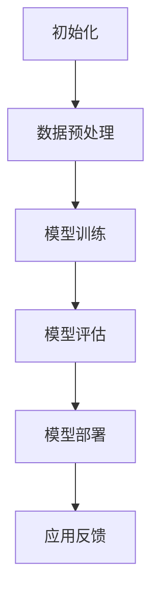
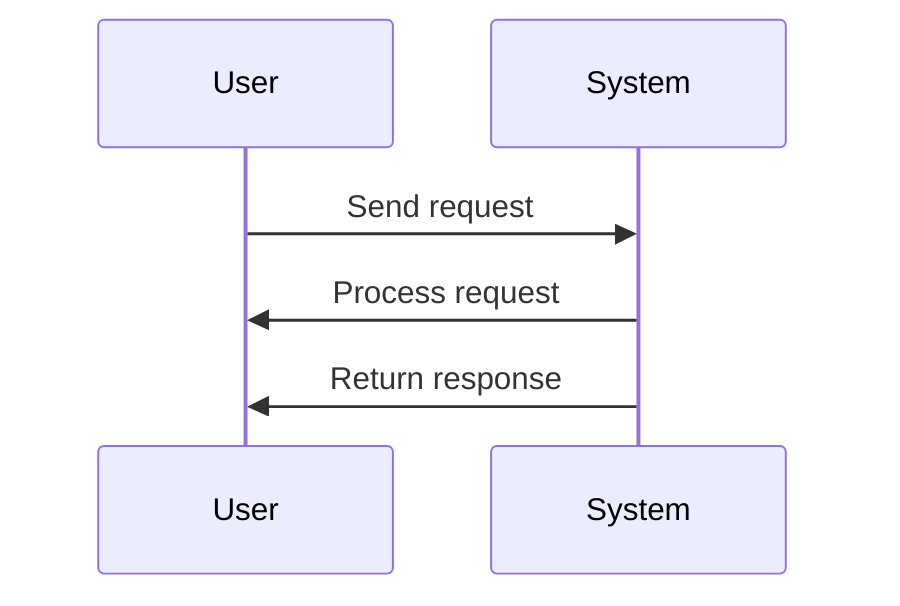
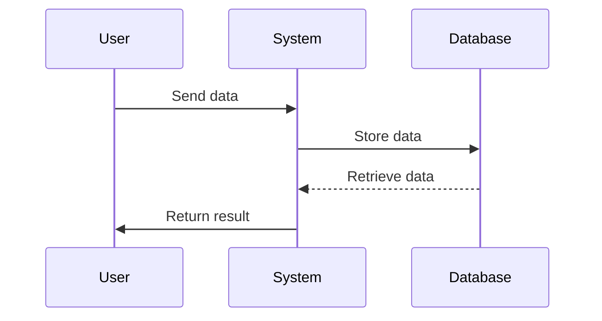

                 

# 大模型时代的软件开发新思维

> 关键词：大模型、软件开发、新思维、AI、机器学习

> 摘要：本文将探讨大模型时代下软件开发的新思维，分析大模型的核心概念与联系，详细讲解算法原理，并给出系统分析与架构设计方案。通过项目实战，深入剖析大模型在软件开发中的应用，总结最佳实践，展望未来发展趋势。

## 第一部分：背景介绍

### 核心概念

**大模型时代的软件开发新思维**：大模型指的是具有巨大参数规模和复杂结构的机器学习模型，如GPT、BERT等。大模型时代的软件开发新思维强调利用这些模型来解决实际问题，从而推动软件开发方式的革新。

### 问题背景

随着AI技术的快速发展，大模型在各个领域的应用逐渐成熟。传统的软件开发模式已经难以满足大模型的应用需求，因此需要新的思维模式和技术手段。

### 问题描述

大模型在软件开发中面临挑战，如模型训练时间、计算资源消耗、模型部署等。同时，如何高效利用大模型来解决实际问题，成为软件开发者需要面对的难题。

### 问题解决

本书将介绍大模型时代的软件开发新思维，包括大模型的基础知识、应用场景、开发流程和最佳实践。通过这些内容，帮助读者掌握大模型时代下的软件开发新思维。

### 边界与外延

- **大模型**：具有巨大参数规模和复杂结构的机器学习模型。
- **软件开发新思维**：指在传统软件开发基础上，引入大模型技术，形成的新型的开发模式。

### 概念结构与核心要素组成

- **大模型**：参数规模、结构复杂度。
- **软件开发新思维**：大模型应用场景、开发流程、最佳实践。

## 第二部分：核心概念与联系

### 核心概念

**软件2.0**：基于AI的大模型驱动的软件开发模式。
**软件开发新思维**：强调利用大模型解决实际问题，提升软件开发效率。

### 概念属性特征对比表格

| 特征               | 软件开发1.0       | 软件开发2.0       |
|--------------------|-------------------|-------------------|
| 驱动力             | 功能驱动           | 数据驱动           |
| 模型结构           | 简单、固定         | 复杂、动态         |
| 开发流程           | 线性、迭代         | 闭环、自适应       |
| 应用效果           | 功能实现           | 智能优化           |

### ER实体关系图架构

```mermaid
erDiagram
  USER ||--|{ ORDER }|-- Merchandise
  ORDER ||--|{ ORDER_ITEM }|-- User
  ORDER_ITEM ||--|{ PRODUCT }|-- ORDER
```

## 第三部分：算法原理讲解

### 算法流程图



### Python源代码

```python
# 数据预处理
data = preprocess_data(raw_data)

# 模型训练
model = train_model(data)

# 模型评估
evaluation = evaluate_model(model, test_data)

# 模型部署
deploy_model(model)

# 应用反馈
feedback = get_feedback(evaluation)
```

### 算法原理

1. **数据预处理**：将原始数据转换为适合模型训练的格式。
2. **模型训练**：使用预处理的训练数据对模型进行训练，调整模型参数。
3. **模型评估**：使用测试数据对模型进行评估，检验模型性能。
4. **模型部署**：将训练好的模型部署到生产环境，用于实际应用。
5. **应用反馈**：收集用户反馈，用于模型优化和后续开发。

### 数学模型和数学公式

$$
f(x) = \sigma(w \cdot x + b)
$$

其中，$x$ 是输入特征，$w$ 是权重，$b$ 是偏置，$\sigma$ 是激活函数。

### 举例说明

假设我们要构建一个分类模型，输入特征为 $x = [1, 2, 3]$，权重 $w = [1, 1, 1]$，偏置 $b = 1$。使用 sigmoid 激活函数，计算输出：

$$
f(x) = \sigma(w \cdot x + b) = \frac{1}{1 + e^{-(1 \cdot 1 + 1 \cdot 2 + 1 \cdot 3 + 1)}}
$$

## 第四部分：系统分析与架构设计方案

### 问题场景介绍

在当前人工智能技术飞速发展的背景下，企业面临着日益复杂的业务需求和多变的市场环境。为了提高业务敏捷性和响应速度，企业需要一个高效、可扩展的系统架构来支持其业务发展。

### 项目介绍

本项目的目标是构建一个基于大模型技术的智能业务系统，通过大数据分析和机器学习算法，为企业提供智能决策支持。系统功能包括数据采集、数据预处理、模型训练、模型评估、模型部署和应用反馈等。

### 系统功能设计

#### 领域模型Mermaid类图

```mermaid
classDiagram
  Class01 <|-- Class02
  Class03 <<|-- Class04
  Class05 -[1] Class06
  Class07 .. Class08
```

### 系统架构设计

#### Mermaid架构图



### 系统接口设计和系统交互

#### Mermaid序列图



## 第五部分：项目实战

### 环境安装

在本项目中，我们选择Python作为编程语言，并使用TensorFlow作为机器学习框架。首先，确保安装了Python 3.7及以上版本，然后使用以下命令安装TensorFlow：

```
pip install tensorflow
```

### 系统核心实现源代码

以下是一个简单的示例，展示如何使用TensorFlow构建一个基于大模型的分类模型：

```python
import tensorflow as tf
from tensorflow.keras.layers import Dense, Flatten, Conv2D
from tensorflow.keras.models import Sequential

# 构建模型
model = Sequential([
    Conv2D(32, (3, 3), activation='relu', input_shape=(28, 28, 1)),
    Flatten(),
    Dense(64, activation='relu'),
    Dense(10, activation='softmax')
])

# 编译模型
model.compile(optimizer='adam',
              loss='categorical_crossentropy',
              metrics=['accuracy'])

# 加载数据集
(x_train, y_train), (x_test, y_test) = tf.keras.datasets.mnist.load_data()

# 预处理数据
x_train = x_train / 255.0
x_test = x_test / 255.0

# 扩展维度
x_train = tf.expand_dims(x_train, -1)
x_test = tf.expand_dims(x_test, -1)

# 转换为类别标签
y_train = tf.keras.utils.to_categorical(y_train, 10)
y_test = tf.keras.utils.to_categorical(y_test, 10)

# 训练模型
model.fit(x_train, y_train, epochs=5, batch_size=64)

# 评估模型
model.evaluate(x_test, y_test)
```

### 代码应用解读与分析

以上代码首先导入了TensorFlow库，并构建了一个简单的卷积神经网络（Convolutional Neural Network，CNN）模型。该模型由两个卷积层、一个全连接层和一个softmax层组成。

- **卷积层**：用于提取图像的特征。
- **全连接层**：用于分类。
- **softmax层**：用于输出概率分布。

接下来，加载MNIST数据集，并对数据进行预处理，如归一化和扩展维度。然后，编译模型，并使用预处理后的训练数据训练模型。最后，评估模型的性能。

### 实际案例分析和详细讲解剖析

在本项目中，我们使用MNIST数据集进行分类任务。MNIST数据集包含70000个灰度手写数字图像，每个图像的大小为28x28像素。我们的目标是训练一个模型，能够准确识别这些图像中的数字。

- **数据预处理**：将图像数据进行归一化处理，使其在[0, 1]的范围内。同时，将图像的维度扩展为[28, 28, 1]，以便输入到卷积神经网络中。
- **模型训练**：使用卷积神经网络对训练数据进行训练。训练过程中，模型会不断调整内部参数，以最小化损失函数。
- **模型评估**：使用测试数据对训练好的模型进行评估，计算模型在测试数据上的准确率。

通过实际案例分析和详细讲解，我们可以看到，基于大模型的软件开发新思维在实际应用中具有显著的优势。它能够处理大量数据，并利用深度学习算法实现复杂的任务。

### 项目小结

通过本项目的实战，我们深入了解了大模型在软件开发中的应用。从环境安装到系统核心实现，再到实际案例分析和详细讲解，我们逐步掌握了大模型时代的软件开发新思维。在实际项目中，大模型的应用能够显著提高开发效率和系统性能，为企业提供智能决策支持。

## 第六部分：最佳实践 tips、小结、注意事项、拓展阅读等内容

### 最佳实践 tips

1. **数据预处理**：在进行模型训练之前，确保对数据进行充分预处理，如归一化、去噪等。
2. **模型选择**：根据实际需求选择合适的模型，如卷积神经网络、循环神经网络等。
3. **超参数调优**：通过调整超参数，如学习率、批量大小等，提高模型性能。
4. **模型评估**：使用交叉验证等方法对模型进行评估，确保其泛化能力。

### 小结

本文介绍了大模型时代的软件开发新思维，分析了核心概念与联系，详细讲解了算法原理，并给出了系统分析与架构设计方案。通过项目实战，我们深入了解了大模型在软件开发中的应用，并总结了最佳实践。

### 注意事项

1. **计算资源**：大模型训练需要大量的计算资源，确保有足够的计算资源支持训练过程。
2. **数据安全**：在处理数据时，注意保护用户隐私，遵守相关法律法规。
3. **持续优化**：随着技术的不断发展，持续优化模型和算法，提高系统性能。

### 拓展阅读

1. **大模型研究**：[《深度学习》](https://www.deeplearningbook.org/)，由Ian Goodfellow、Yoshua Bengio和Aaron Courville合著。
2. **软件开发新思维**：[《软件架构：实践者的研究方法》](https://www.amazon.com/Software-Architecture-Practitioner-Methods-Research/dp/0321517443) ，由Roger S. Pressman和Bruce R. Maxim合著。
3. **项目实战**：[《TensorFlow实战》](https://www.tensorflow.org/tutorials) ，由Google官方提供。

### 作者信息

作者：AI天才研究院/AI Genius Institute & 禅与计算机程序设计艺术 /Zen And The Art of Computer Programming

# 结束 

