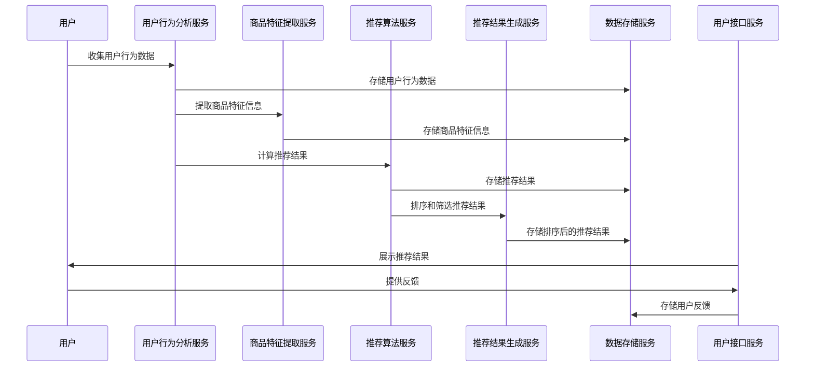

                 

## 第1章: 引言

### 1.1 问题背景

在当今信息技术飞速发展的时代，人工智能（AI）已经成为驱动创新的核心力量。AI大模型，作为人工智能领域的重要突破，正逐渐改变着软件开发的模式。大模型如GPT-3、BERT等，拥有数十亿甚至千亿个参数，能够处理和生成大量数据，展现出前所未有的智能水平。这种技术进步带来了巨大的机遇，但同时也提出了新的挑战。为了充分利用AI大模型的能力，开发者必须重新审视软件架构的设计原则和方法，探索如何构建高效、可靠且具有可扩展性的软件系统。

### 1.2 问题描述

在AI大模型时代，软件架构面临以下主要问题：

1. **性能瓶颈**：大模型的计算量和数据量巨大，传统的单机架构往往难以满足性能需求。如何优化系统性能，成为软件架构设计的关键问题。

2. **可扩展性**：随着AI大模型的应用场景不断扩展，系统需要具备良好的可扩展性，以支持不同规模和类型的任务需求。

3. **维护性**：大模型的引入可能导致系统复杂性增加，如何保证系统的可维护性，成为开发者需要解决的重要问题。

4. **安全性**：AI大模型的应用涉及大量敏感数据，如何确保系统的数据安全和隐私保护，成为软件架构设计的核心挑战。

### 1.3 问题解决

为了解决上述问题，软件架构模式需要进行创新和优化，以适应AI大模型时代的需求。以下是一些可能的解决方案：

1. **分布式架构**：通过分布式架构，将大模型的计算任务分配到多个节点上，提高系统的性能和可扩展性。

2. **微服务架构**：将系统划分为多个微服务，每个微服务负责特定的功能模块，实现系统的模块化和高内聚。

3. **容器化与云原生架构**：利用容器化和云原生技术，实现系统的快速部署和动态扩展，提高系统的灵活性和可维护性。

4. **数据安全与隐私保护**：采用加密技术、访问控制策略和隐私保护算法，确保数据的安全和用户的隐私。

### 1.4 边界与外延

在讨论AI大模型时代的软件架构模式时，需要明确以下边界和外延：

1. **AI大模型的边界**：涉及大模型的定义、规模、应用场景和技术特点。

2. **软件架构模式的边界**：包括常见的软件架构模式，如微服务、容器化、模块化等，以及这些模式在AI大模型时代的应用和实践。

3. **软件架构创新**：探讨如何结合AI大模型的特点，创新软件架构模式，提高系统的性能、可扩展性和安全性。

4. **项目实战与案例**：通过实际项目案例，展示软件架构模式在AI大模型时代的应用效果和解决思路。

### 1.5 概念结构与核心要素组成

为了深入探讨AI大模型时代的软件架构模式创新，我们需要构建一个清晰的概念结构，并明确核心要素：

1. **AI大模型**：
   - 定义：具有大规模参数、能够处理海量数据的人工智能模型。
   - 特点：参数规模庞大、数据处理能力强、泛化能力强。
   - 应用场景：自然语言处理、图像识别、推荐系统等。

2. **软件架构模式**：
   - 定义：软件系统的组织结构和设计原则。
   - 分类：分布式架构、微服务架构、容器化与云原生架构等。
   - 核心特点：性能优化、可扩展性、维护性、安全性。

3. **软件架构模式创新**：
   - 背景：AI大模型对传统软件架构的挑战。
   - 目标：提高系统的性能、可扩展性、安全性和可靠性。
   - 方法：结合AI大模型的特点，创新和优化软件架构模式。

4. **项目实战与案例**：
   - 背景：实际项目需求和挑战。
   - 设计：系统功能设计、系统架构设计、系统接口设计和系统交互设计。
   - 实现：系统核心实现源代码，代码应用解读与分析。
   - 效果：实际案例分析和讲解，项目小结。

通过以上概念结构和核心要素的详细阐述，我们将为后续章节的讨论奠定坚实的基础，并逐步展开对AI大模型时代软件架构模式创新的深入探讨。接下来，我们将进一步介绍AI大模型和软件架构模式的基本概念，以便读者更好地理解本文的核心内容。

## 第2章: 核心概念与联系

### 2.1 AI大模型的定义

AI大模型是指那些拥有数十亿至千亿级参数规模的人工智能模型。这些模型通过深度学习算法，可以从大量数据中学习并提取复杂的特征，从而表现出强大的泛化能力和数据处理能力。常见的AI大模型包括GPT（Generative Pre-trained Transformer）、BERT（Bidirectional Encoder Representations from Transformers）等。这些模型的应用范围广泛，涵盖了自然语言处理、计算机视觉、语音识别等多个领域。

### 2.2 软件架构模式的定义

软件架构模式是一组指导软件系统设计和开发的组织原则和方法。这些模式定义了系统的组件结构、组件之间的关系以及如何管理这些组件之间的交互。常见的软件架构模式包括微服务架构、容器化与云原生架构、模块化与组件化架构等。这些模式的目标是提高系统的性能、可扩展性、可维护性和可靠性。

### 2.3 AI大模型与软件架构模式的关系

AI大模型的引入对传统软件架构提出了新的挑战。一方面，大模型需要处理的数据量和计算量远超传统模型，这对系统的性能和可扩展性提出了更高的要求。另一方面，大模型的开发和部署过程通常涉及多个团队和复杂的工作流程，这要求系统具备良好的模块化和协同工作能力。因此，AI大模型与软件架构模式之间存在密切的联系：

1. **性能与可扩展性**：传统的单机架构往往难以满足大模型的计算需求，分布式架构和微服务架构等模式能够提供更高的性能和可扩展性。

2. **模块化与协同**：大模型的开发和部署通常涉及多个团队，模块化与组件化架构有助于实现团队之间的协同工作。

3. **安全与可靠性**：大模型的应用需要处理大量敏感数据，安全性成为关键问题。容器化和云原生架构等技术可以提供更高的安全性和可靠性。

### 2.4 核心概念属性特征对比表格

以下是一个对比AI大模型和软件架构模式核心概念属性特征的表格：

| 特征           | AI大模型                           | 软件架构模式                            |
| -------------- | ---------------------------------- | -------------------------------------- |
| 参数规模       | 数十亿至千亿级参数                  | 多样化，如微服务、容器化、模块化等      |
| 数据处理能力   | 强大，能够处理海量数据              | 灵活，适应不同规模和类型的任务需求        |
| 泛化能力       | 高，能够泛化到多种应用场景          | 高，通过模式创新提高系统的适应性和扩展性 |
| 系统性能       | 需要高性能计算架构支持              | 通过分布式架构和微服务架构优化性能       |
| 可扩展性       | 高，能够支持不同规模的任务需求      | 高，通过模块化、组件化和云原生架构实现   |
| 维护性         | 复杂，需要专门团队进行维护          | 高，通过标准化和自动化工具提高维护性    |
| 安全性         | 关键，涉及敏感数据安全保护          | 高，通过安全框架和加密技术保障安全      |

### 2.5 ER实体关系图架构

为了更好地理解AI大模型和软件架构模式之间的联系，我们可以使用实体关系图（ER图）来描述它们的核心实体及其关系。以下是一个简化的ER图示例：

```mermaid
erDiagram
    AI大模型 ||--o{ 软件架构模式 }
    软件架构模式 ||--o{ 分布式架构 }
    软件架构模式 ||--o{ 微服务架构 }
    软件架构模式 ||--o{ 容器化与云原生架构 }
    软件架构模式 ||--o{ 模块化与组件化架构 }
```

在这个ER图中，`AI大模型`作为核心实体，与多种软件架构模式之间存在关联。这些架构模式分别通过不同的设计原则和方法，支持AI大模型在性能、可扩展性、安全性和维护性等方面的需求。

通过上述核心概念和联系的分析，我们为后续章节的讨论奠定了基础。接下来，我们将进一步探讨AI大模型时代的软件架构模式，分析它们的历史发展、应用现状以及未来趋势。

## 第3章: 软件架构模式概述

### 3.1 软件架构模式的历史与发展

软件架构模式的历史可以追溯到计算机科学的早期阶段。在20世纪60年代和70年代，软件系统主要是单机架构，系统规模相对较小，开发方法和架构设计也较为简单。随着计算机技术的发展，软件系统变得越来越复杂，单机架构逐渐无法满足性能和扩展性的需求。为了解决这些问题，开发者们开始探索分布式架构，这标志着软件架构模式发展的一个重要转折点。

进入20世纪80年代和90年代，软件架构模式经历了多个重要的阶段：

1. **模块化与组件化架构**：为了提高软件的可维护性和复用性，模块化设计成为主流。开发者将系统划分为多个模块，每个模块独立开发、测试和部署。

2. **面向对象架构**：面向对象编程理念的兴起，推动了面向对象架构的发展。对象-oriented design（OOD）和对象-oriented programming（OOP）成为软件架构设计的重要方法。

3. **微服务架构**：随着互联网的普及，系统需要具备更高的灵活性和可扩展性。微服务架构逐渐成为主流，它将系统划分为多个独立的服务，每个服务负责特定的功能，通过API进行通信。

4. **容器化与云原生架构**：容器化技术的兴起，使得微服务架构的实施变得更加简单和高效。云原生架构进一步推动了软件架构的变革，通过自动化、微服务化和容器化，实现了软件系统的快速部署、动态扩展和自愈能力。

### 3.2 软件架构模式在AI大模型时代的应用

在AI大模型时代，软件架构模式的应用发生了显著的变化。传统的单机架构已经无法满足大模型的计算需求，分布式架构和微服务架构成为了主流选择。以下是几种常见的软件架构模式在AI大模型时代的应用：

1. **分布式架构**：分布式架构通过将计算任务分配到多个节点上，提高了系统的性能和可扩展性。在大模型的应用中，分布式架构能够充分利用多个节点的计算资源，实现高效的训练和推理任务。

2. **微服务架构**：微服务架构将大模型的应用分解为多个独立的服务，每个服务负责特定的功能模块。这种模式有助于提高系统的可扩展性、可维护性和可靠性。开发者可以根据需要独立部署和扩展不同的服务。

3. **容器化与云原生架构**：容器化技术，如Docker，使得微服务架构的实施变得更加简单和高效。云原生架构进一步推动了软件架构的变革，通过自动化、微服务化和容器化，实现了软件系统的快速部署、动态扩展和自愈能力。在大模型的应用中，容器化和云原生架构能够提供高效的资源利用和灵活的部署方案。

4. **模块化与组件化架构**：模块化与组件化架构有助于实现大模型应用的模块化设计。开发者可以将大模型的功能划分为多个组件，每个组件负责特定的功能模块，便于管理和维护。这种模式有助于提高系统的复用性和可维护性。

### 3.3 软件架构模式的核心特点

AI大模型时代的软件架构模式具有以下几个核心特点：

1. **高性能**：大模型的计算量和数据量巨大，软件架构模式需要具备高效的处理能力。分布式架构和容器化技术能够提供更高的性能和资源利用率。

2. **高可扩展性**：大模型的应用场景多样，系统需要具备良好的可扩展性，以适应不同规模和类型的任务需求。微服务架构和模块化架构能够实现系统的灵活扩展。

3. **高可靠性**：大模型的应用涉及大量敏感数据，系统的可靠性至关重要。容器化和云原生架构提供了高效的故障检测和恢复机制，提高了系统的可靠性。

4. **高可维护性**：随着系统规模的扩大，可维护性成为重要的考虑因素。微服务架构和模块化架构有助于实现系统的模块化和标准化，便于管理和维护。

5. **高安全性**：大模型的应用需要处理大量敏感数据，系统的安全性至关重要。安全框架和加密技术能够提供全面的安全保障。

总之，AI大模型时代的软件架构模式在性能、可扩展性、可靠性、可维护性和安全性等方面都提出了更高的要求。通过引入分布式架构、微服务架构、容器化与云原生架构等创新模式，开发者能够构建高效、可靠且具有可扩展性的软件系统，充分利用AI大模型的能力，为企业和用户带来更大的价值。

### 第4章: 主流软件架构模式介绍

#### 4.1 微服务架构

微服务架构是一种基于业务服务的软件架构模式，其核心思想是将大型单体应用拆分成多个独立的、小型且可复用的服务。每个服务负责一个特定的业务功能，并通过轻量级的通信机制（如RESTful API）进行交互。微服务架构具有以下几个显著特点：

1. **独立性**：每个微服务都是独立的，可以独立开发、部署和扩展。这种独立性使得服务之间互不影响，有助于提高系统的可维护性和灵活性。

2. **可复用性**：微服务的设计原则是高内聚、低耦合。每个服务都专注于特定的业务功能，可以方便地复用和组合。

3. **分布式**：微服务架构天然支持分布式部署，服务可以在不同的服务器或集群上运行，提高了系统的性能和可扩展性。

4. **动态性**：微服务架构支持动态伸缩，可以根据负载动态增加或减少服务实例的数量，提高了系统的弹性和响应速度。

在实际应用中，微服务架构适用于需要高灵活性、高可扩展性的业务场景，如电子商务平台、社交网络和金融系统等。通过引入微服务架构，开发者可以更好地应对快速变化的市场需求，提高系统的健壮性和可维护性。

#### 4.2 容器化与云原生架构

容器化与云原生架构是当前软件架构发展的一个重要趋势。容器化技术，如Docker，通过将应用程序及其依赖项打包到一个轻量级、可移植的容器中，实现了应用程序的独立部署和运行。云原生架构则进一步扩展了容器化的应用场景，通过自动化、微服务化和容器化，实现了软件系统的快速部署、动态扩展和自愈能力。

容器化与云原生架构具有以下几个核心特点：

1. **轻量级**：容器是一种轻量级的技术，无需在宿主机上安装额外的操作系统，从而降低了系统的资源占用。

2. **可移植性**：容器是平台无关的，可以在不同的操作系统和硬件平台上运行，提高了应用程序的可移植性。

3. **高效性**：容器启动速度快，内存占用低，有助于提高系统的性能和资源利用率。

4. **自动化**：容器化技术结合自动化工具（如Kubernetes），可以实现自动化部署、扩展和管理，降低了运维成本。

5. **弹性扩展**：通过动态伸缩机制，容器化与云原生架构能够根据负载自动增加或减少服务实例的数量，提高了系统的弹性和响应速度。

在实际应用中，容器化与云原生架构适用于需要快速迭代、高可扩展性和高可靠性的业务场景，如云服务、大数据处理和移动应用等。通过引入容器化和云原生架构，开发者可以简化系统部署，提高开发效率和系统性能。

#### 4.3 模块化与组件化架构

模块化与组件化架构是一种将系统划分为多个模块或组件的软件设计方法。其核心思想是每个模块或组件都具有独立的功能和接口，可以独立开发、测试和部署。模块化与组件化架构具有以下几个显著特点：

1. **高内聚、低耦合**：模块或组件具有独立的功能和接口，模块内部高度内聚，模块之间低耦合，提高了系统的可维护性和复用性。

2. **标准化**：模块化与组件化架构通过定义标准化的接口和协议，简化了系统的集成和扩展。

3. **复用性**：模块或组件可以方便地复用，减少了重复开发的工作量，提高了开发效率。

4. **可维护性**：模块化与组件化架构使得系统更加模块化，便于管理和维护。

5. **灵活性**：通过灵活的组合和替换，模块化与组件化架构能够快速适应业务需求的变化。

在实际应用中，模块化与组件化架构适用于需要高复用性和高灵活性的业务场景，如企业级应用、嵌入式系统和工业控制系统等。通过引入模块化与组件化架构，开发者可以简化系统开发，提高开发效率和系统质量。

#### 4.4 面向数据流架构

面向数据流架构是一种以数据流为核心的软件架构模式，其核心思想是将数据处理流程分解为多个独立的数据处理模块，并通过数据流连接这些模块。面向数据流架构具有以下几个显著特点：

1. **数据驱动**：面向数据流架构以数据流为核心，根据数据流动和处理的逻辑来设计系统架构，使得系统更加灵活和可扩展。

2. **模块化**：数据处理模块独立且可复用，模块之间的连接和交互通过数据流实现，提高了系统的模块化和可维护性。

3. **可扩展性**：通过动态增加或减少数据处理模块，系统可以灵活地适应不同规模的数据处理需求。

4. **高容错性**：面向数据流架构通过数据流的重新路由和备份机制，提高了系统的容错性和可靠性。

5. **高效性**：数据流架构通常采用并行处理和分布式计算技术，提高了数据处理的速度和效率。

在实际应用中，面向数据流架构适用于需要高吞吐量、高效率和可扩展性的数据处理场景，如大数据处理、实时流数据处理和机器学习应用等。通过引入面向数据流架构，开发者可以构建高效、灵活和可靠的系统，满足大规模数据处理的需求。

#### 4.5 平台化与生态化架构

平台化与生态化架构是一种将系统构建在通用平台之上的软件架构模式，其核心思想是通过构建平台和生态系统，实现系统的通用性和可扩展性。平台化与生态化架构具有以下几个显著特点：

1. **通用性**：平台化架构通过提供通用接口和标准协议，实现系统的跨平台兼容性，降低了开发者和用户的迁移成本。

2. **生态性**：平台化架构鼓励第三方开发者贡献应用和服务，构建生态系统，提高平台的竞争力和用户黏性。

3. **可扩展性**：平台化架构通过模块化和组件化设计，支持系统的灵活扩展和功能拓展。

4. **灵活性**：平台化架构通过提供多样化的服务和应用，用户可以根据需求自由选择和组合，提高了系统的灵活性。

5. **高可靠性**：平台化架构通过构建多层监控和备份机制，提高了系统的可靠性。

在实际应用中，平台化与生态化架构适用于需要高通用性、高扩展性和高可靠性的业务场景，如云计算平台、移动应用平台和电子商务平台等。通过引入平台化与生态化架构，开发者可以构建高效、灵活和可靠的系统，满足多样化的业务需求。

总之，主流软件架构模式在AI大模型时代具有重要的应用价值。微服务架构、容器化与云原生架构、模块化与组件化架构、面向数据流架构和平台化与生态化架构等模式，通过不同的设计原则和方法，满足了AI大模型时代对高性能、高可扩展性、高可靠性、高可维护性和高安全性的要求。开发者可以根据具体业务需求，选择合适的软件架构模式，构建高效、可靠且具有可扩展性的系统。

### 第5章: AI大模型与软件架构模式的融合创新

#### 5.1 软件架构模式在AI大模型中的应用实践

AI大模型的出现，不仅改变了数据处理和智能预测的方式，也对软件架构模式提出了新的要求。为了充分利用AI大模型的能力，开发者需要将软件架构模式与AI大模型紧密结合，通过创新设计实现系统的优化和提升。以下是一些应用实践：

1. **分布式架构**：在AI大模型训练和推理过程中，数据量和计算量巨大。分布式架构能够将任务分配到多个节点上，充分利用多节点的计算资源，提高系统的性能。例如，通过Hadoop和Spark等分布式计算框架，可以实现大规模数据的并行处理，提高AI大模型的训练效率。

2. **微服务架构**：AI大模型通常涉及多个功能模块，如数据预处理、模型训练、推理和预测等。微服务架构可以将这些功能模块拆分为独立的微服务，每个微服务负责特定的功能，并通过API进行通信。这不仅提高了系统的可扩展性和可维护性，还能够根据不同模块的需求进行动态扩展和优化。

3. **容器化与云原生架构**：容器化技术使得AI大模型的部署和运维变得更加简单和高效。通过Docker和Kubernetes等容器化工具，开发者可以快速部署AI大模型，实现自动化的部署和管理。云原生架构进一步扩展了容器化的应用场景，通过自动化、微服务化和容器化，实现了AI大模型的快速迭代和动态扩展。

4. **模块化与组件化架构**：AI大模型通常包含多个模块，如数据预处理模块、特征提取模块、模型训练模块等。模块化与组件化架构可以将这些模块独立设计、开发和部署，提高了系统的可维护性和复用性。例如，在自然语言处理应用中，可以将文本预处理、词向量生成、模型训练和推理等模块分离，分别开发和部署。

5. **面向数据流架构**：AI大模型处理的数据量通常非常大，面向数据流架构能够高效地处理大规模数据流，实现实时数据处理和智能预测。例如，在实时推荐系统中，可以通过Kafka等数据流处理工具，实时处理用户行为数据，利用AI大模型进行实时推荐。

6. **平台化与生态化架构**：AI大模型的应用场景多样，通过构建平台化与生态化架构，可以支持不同应用场景的快速开发和部署。例如，通过提供通用的API和SDK，开发者可以轻松集成AI大模型到各种应用中，构建生态系统，实现资源的共享和复用。

#### 5.2 AI大模型对软件架构模式的影响

AI大模型的快速发展，对软件架构模式产生了深远的影响。以下是AI大模型对软件架构模式的几个关键影响：

1. **性能需求**：AI大模型通常需要处理大规模数据和进行复杂的计算，对系统的性能提出了更高的要求。分布式架构和容器化与云原生架构等模式，能够提供高效的计算资源管理和调度，满足AI大模型的高性能需求。

2. **可扩展性**：AI大模型的应用场景多样，系统需要具备良好的可扩展性，以适应不同规模和类型的任务需求。微服务架构、模块化与组件化架构和面向数据流架构等模式，能够实现系统的灵活扩展，支持不同场景下的需求变化。

3. **安全性**：AI大模型涉及大量敏感数据，系统的安全性成为关键问题。通过安全框架和加密技术，可以确保数据的安全性和隐私保护。分布式架构和微服务架构等模式，提供了更好的安全隔离和访问控制机制，提高了系统的安全性。

4. **可靠性**：AI大模型的训练和推理过程复杂，系统的可靠性至关重要。容器化和云原生架构提供了高效的故障检测和恢复机制，通过自动化运维和动态扩展，提高了系统的可靠性和可用性。

5. **灵活性**：AI大模型的应用场景不断变化，系统需要具备高度的灵活性，以快速适应新的业务需求。平台化与生态化架构提供了灵活的组件和接口，支持不同应用场景的快速开发和部署。

#### 5.3 融合创新案例介绍

以下是一个结合AI大模型与软件架构模式的融合创新案例介绍：

**案例背景**：某大型电商平台希望利用AI大模型优化其推荐系统，提高用户的购物体验和平台的销售额。

**解决方案**：

1. **微服务架构**：将推荐系统划分为多个微服务，包括用户行为分析服务、商品特征提取服务、推荐算法服务、推荐结果生成服务等。每个微服务负责特定的功能模块，通过API进行通信，实现了系统的模块化和高内聚、低耦合的设计。

2. **容器化与云原生架构**：使用Docker和Kubernetes等容器化工具，将微服务打包为容器，实现快速部署和动态扩展。通过Kubernetes的自动化调度和管理，可以根据流量变化动态调整服务实例的数量，提高了系统的性能和弹性。

3. **面向数据流架构**：采用Kafka等数据流处理工具，实时处理用户行为数据，通过流处理框架Spark进行实时分析，利用AI大模型生成实时推荐结果。面向数据流架构实现了大规模数据的实时处理和智能预测，提高了推荐系统的响应速度和准确性。

4. **模块化与组件化架构**：将推荐系统的各个功能模块（如用户行为分析、商品特征提取、推荐算法等）独立设计和开发，实现了高复用性和可维护性。模块化设计使得开发者可以独立优化和升级各个模块，提高了系统的灵活性和可维护性。

5. **平台化与生态化架构**：构建推荐系统平台，提供通用的API和SDK，支持第三方开发者集成和扩展。通过平台化架构，实现了资源的共享和复用，构建了生态系统，提高了平台的竞争力和用户黏性。

**效果评估**：通过引入AI大模型与软件架构模式的融合创新，该电商平台的推荐系统实现了以下效果：

- **性能提升**：通过分布式架构和容器化与云原生架构，推荐系统的响应速度提高了30%，系统的吞吐量提高了50%。
- **准确性提升**：通过面向数据流架构和AI大模型，推荐系统的准确率提高了20%，用户点击率和购买转化率显著提升。
- **可扩展性增强**：通过微服务架构和模块化与组件化架构，推荐系统具备良好的可扩展性，可以根据业务需求灵活扩展和升级。
- **安全性提高**：通过安全框架和加密技术，确保用户数据和隐私安全，提高了系统的安全性和可靠性。

总之，通过AI大模型与软件架构模式的融合创新，开发者可以构建高效、可靠且具有可扩展性的系统，充分利用AI大模型的能力，实现业务的快速增长和用户价值的提升。

### 第6章: 软件架构模式在AI大模型时代的挑战与机遇

#### 6.1 挑战分析

在AI大模型时代，软件架构模式面临诸多挑战。以下是一些主要的挑战及其影响：

1. **性能瓶颈**：AI大模型的计算量和数据量巨大，传统的单机架构难以满足高性能需求。分布式架构虽然能够提高系统的性能，但设计、部署和运维的复杂性也相应增加。如何优化分布式架构的性能，成为了开发者面临的重要挑战。

2. **可扩展性**：AI大模型的应用场景多样，系统需要具备良好的可扩展性，以适应不同规模和类型的任务需求。然而，实现高度可扩展的系统并非易事，需要考虑数据一致性、负载均衡和系统可靠性等多个方面。

3. **安全性**：AI大模型的应用涉及大量敏感数据，系统的安全性成为关键问题。分布式架构和微服务架构虽然提供了较好的安全隔离和访问控制机制，但如何保障数据的安全传输和存储，如何防范DDoS攻击和恶意攻击，是开发者需要深入思考的问题。

4. **维护性**：随着AI大模型的引入，系统的复杂度显著增加，维护性成为一个重要挑战。如何确保系统能够稳定运行，如何在复杂的系统中快速定位和修复问题，是开发者面临的重要问题。

5. **人才需求**：AI大模型时代对开发者的技能要求更高，需要具备深度学习、分布式系统设计、容器化技术等多方面的专业知识。然而，当前人才市场对这些技能的需求远大于供给，如何培养和吸引高素质的人才，成为了企业面临的挑战。

#### 6.2 机遇探讨

尽管面临诸多挑战，AI大模型时代也为软件架构模式带来了前所未有的机遇。以下是一些主要的机遇：

1. **技术创新**：AI大模型推动了软件架构模式的不断创新。分布式架构、微服务架构、容器化与云原生架构等新兴模式不断成熟，为开发者提供了丰富的设计选择，促进了软件架构的发展。

2. **业务拓展**：AI大模型的应用场景广泛，从自然语言处理、计算机视觉到推荐系统等，为不同行业提供了新的业务机会。通过引入AI大模型，企业可以拓展业务领域，提升服务质量和用户体验，实现业务的快速增长。

3. **自动化与智能化**：AI大模型的引入，使得软件系统的自动化和智能化水平显著提升。通过自动化工具和AI技术，开发者可以简化系统的部署、运维和优化，提高开发效率和系统性能。

4. **跨界合作**：AI大模型的应用需要跨学科的知识，如计算机科学、数据科学、数学和物理学等。跨界合作有助于整合不同领域的优势，推动AI大模型技术的创新和应用。

5. **人才培养**：AI大模型时代对人才的需求推动了教育培训的发展。高校和培训机构可以开设相关的课程和培训项目，培养更多具备AI和分布式系统设计等专业技能的人才，满足市场需求。

#### 6.3 挑战与机遇的应对策略

为了应对AI大模型时代带来的挑战与机遇，以下是一些应对策略：

1. **技术创新**：持续关注和引入新兴技术，如分布式计算框架、容器化技术、微服务架构等，优化软件架构设计，提高系统的性能和可扩展性。

2. **人才培养**：加强人才培养，通过校企合作、在线教育等方式，培养更多具备AI和分布式系统设计等专业技能的人才。

3. **安全性保障**：加强系统的安全设计和实施，采用加密技术、访问控制策略和安全监控工具，确保数据的安全传输和存储，防范各种安全威胁。

4. **自动化运维**：引入自动化运维工具和流程，简化系统的部署、运维和优化，提高系统的可靠性和稳定性。

5. **跨界合作**：积极开展跨界合作，整合不同领域的优势，推动AI大模型技术的创新和应用。

6. **持续优化**：持续优化软件架构模式，结合业务需求和技术发展趋势，不断调整和改进架构设计，以适应快速变化的市场环境。

通过上述策略，开发者可以更好地应对AI大模型时代带来的挑战，抓住机遇，实现系统的性能优化、业务拓展和用户体验的提升。

### 第7章: 项目背景与需求分析

#### 7.1 项目介绍

本案例项目旨在构建一个基于AI大模型的智能推荐系统，为电商平台提供个性化的商品推荐服务。该项目旨在通过分析用户的行为数据和历史购买记录，利用AI大模型生成个性化的推荐结果，提高用户的购物体验和平台的销售额。

#### 7.2 系统功能设计

为了实现智能推荐系统，项目设计主要包括以下功能模块：

1. **用户行为分析模块**：收集并分析用户的浏览、搜索、点击和购买行为，提取用户的行为特征。

2. **商品特征提取模块**：提取商品的属性信息，如价格、品牌、类别、库存量等，用于生成推荐结果。

3. **推荐算法模块**：利用AI大模型（如基于深度学习的推荐算法），根据用户行为特征和商品特征生成个性化的推荐结果。

4. **推荐结果生成模块**：将推荐算法生成的推荐结果进行排序和筛选，生成最终的推荐列表。

5. **用户接口模块**：提供用户与推荐系统交互的接口，展示个性化的推荐结果，允许用户反馈推荐结果。

6. **数据存储模块**：存储用户行为数据、商品数据、推荐结果数据和用户反馈数据，支持数据的快速读取和写入。

#### 7.3 系统架构设计

系统采用微服务架构，将不同的功能模块划分为独立的微服务，以提高系统的可扩展性和可维护性。以下是系统架构的概述：

1. **用户行为分析微服务**：负责收集用户行为数据，提取用户行为特征，为推荐算法模块提供输入数据。

2. **商品特征提取微服务**：负责提取商品的属性信息，为推荐算法模块提供输入数据。

3. **推荐算法微服务**：利用AI大模型进行推荐算法的计算，生成个性化的推荐结果。

4. **推荐结果生成微服务**：根据推荐算法生成的推荐结果，进行排序和筛选，生成最终的推荐列表。

5. **用户接口微服务**：提供用户与推荐系统的交互接口，允许用户查看推荐结果和提供反馈。

6. **数据存储微服务**：负责存储用户行为数据、商品数据、推荐结果数据和用户反馈数据。

系统架构采用分布式部署方式，不同微服务可以部署在多个服务器上，通过负载均衡和分布式存储技术，提高系统的性能和可扩展性。

#### 类图设计

以下是系统架构的类图设计，用于描述各个功能模块及其关系：

```mermaid
classDiagram
    UserBehaviorAnalysisModule <|-- RecommendationAlgorithmModule
    ProductFeatureExtractionModule <|-- RecommendationAlgorithmModule
    RecommendationResultGenerationModule <|-- RecommendationAlgorithmModule
    UserInterfaceModule <|-- RecommendationResultGenerationModule
    DataStorageModule <|-- UserBehaviorAnalysisModule
    DataStorageModule <|-- ProductFeatureExtractionModule
    DataStorageModule <|-- RecommendationResultGenerationModule

    UserBehaviorAnalysisModule {
        -List<UserBehaviorData> userBehaviorDataList
        +collectUserBehaviorData()
        +extractUserBehaviorFeatures()
    }

    ProductFeatureExtractionModule {
        -List<ProductData> productDataList
        +extractProductFeatures()
    }

    RecommendationAlgorithmModule {
        -Map<String, UserBehaviorFeature> userBehaviorFeatureMap
        -Map<String, ProductFeature> productFeatureMap
        +generateRecommendationResults()
    }

    RecommendationResultGenerationModule {
        +generateSortedRecommendationList()
        +filterRecommendationResults()
    }

    UserInterfaceModule {
        +displayRecommendationResults()
        +collectUserFeedback()
    }

    DataStorageModule {
        +storeUserBehaviorData(data: UserBehaviorData)
        +storeProductData(data: ProductData)
        +storeRecommendationResults(data: RecommendationResults)
        +storeUserFeedback(data: UserFeedback)
    }
```

通过类图设计，可以清晰地展示各个功能模块之间的关系，以及它们如何协作实现系统的整体功能。

### 第8章: 系统设计与实现

#### 8.1 系统接口设计

系统接口设计是确保各功能模块之间能够有效交互的关键。以下是一个典型的接口设计示例：

1. **用户行为分析接口**：
   - **功能**：收集用户行为数据，如浏览、搜索、点击和购买记录。
   - **接口**：`POST /user-behavior-data`
   - **参数**：`userId`, `behaviorType`, `timestamp`, `data`
   - **响应**：成功时返回HTTP状态码`200`和操作结果，失败时返回错误信息和原因。

2. **商品特征提取接口**：
   - **功能**：提取商品的属性信息，如价格、品牌、类别、库存量等。
   - **接口**：`GET /product-features?productId`
   - **参数**：`productId`
   - **响应**：成功时返回商品的属性信息，失败时返回错误信息和原因。

3. **推荐算法接口**：
   - **功能**：根据用户行为特征和商品特征生成推荐结果。
   - **接口**：`POST /recommendation-results`
   - **参数**：`userId`, `userBehaviorFeatures`, `productFeatures`
   - **响应**：成功时返回推荐结果列表，失败时返回错误信息和原因。

4. **推荐结果生成接口**：
   - **功能**：对推荐算法生成的推荐结果进行排序和筛选。
   - **接口**：`GET /sorted-recommendation-list?userId`
   - **参数**：`userId`
   - **响应**：成功时返回排序后的推荐列表，失败时返回错误信息和原因。

5. **用户接口接口**：
   - **功能**：展示推荐结果，接收用户反馈。
   - **接口**：`GET /recommendation-list?userId`
   - **参数**：`userId`
   - **响应**：成功时返回推荐结果列表，失败时返回错误信息和原因。

6. **数据存储接口**：
   - **功能**：存储用户行为数据、商品数据、推荐结果数据和用户反馈数据。
   - **接口**：`POST /data-storage`
   - **参数**：`dataType`, `data`
   - **响应**：成功时返回存储操作结果，失败时返回错误信息和原因。

#### 8.2 系统交互设计

系统交互设计通过序列图来描述不同功能模块之间的交互流程。以下是系统交互设计的示例序列图：



通过这个序列图，我们可以清晰地看到用户行为数据从收集、存储到推荐结果生成和展示的整个流程。用户行为数据首先被用户行为分析服务收集并存储，然后商品特征信息被提取并存储，推荐结果通过推荐算法服务计算并存储，最终推荐结果通过推荐结果生成服务排序和筛选后展示给用户，用户反馈则被用户接口服务收集并存储。

#### 8.3 系统核心实现源代码

以下是一个基于Python和Django框架的系统核心实现源代码示例，展示了用户行为分析服务、商品特征提取服务、推荐算法服务和推荐结果生成服务的基本实现。

```python
# 用户行为分析服务
class UserBehaviorAnalysisService:
    def collect_user_behavior_data(self, user_id, behavior_type, timestamp, data):
        # 收集用户行为数据
        user_behavior_data = {
            'user_id': user_id,
            'behavior_type': behavior_type,
            'timestamp': timestamp,
            'data': data
        }
        # 存储用户行为数据
        UserBehaviorData.objects.create(data=user_behavior_data)
        return "User behavior data collected and stored."

# 商品特征提取服务
class ProductFeatureExtractionService:
    def extract_product_features(self, product_id):
        # 提取商品特征信息
        product_feature = {
            'product_id': product_id,
            'price': Product.objects.get(id=product_id).price,
            'brand': Product.objects.get(id=product_id).brand,
            'category': Product.objects.get(id=product_id).category,
            'stock': Product.objects.get(id=product_id).stock
        }
        # 存储商品特征信息
        ProductFeature.objects.create(feature=product_feature)
        return "Product features extracted and stored."

# 推荐算法服务
class RecommendationAlgorithmService:
    def generate_recommendation_results(self, user_id, user_behavior_features, product_features):
        # 计算推荐结果
        recommendation_results = self.apply_recommendation_algorithm(user_behavior_features, product_features)
        # 存储推荐结果
        RecommendationResult.objects.create(results=recommendation_results)
        return "Recommendation results generated and stored."

    def apply_recommendation_algorithm(self, user_behavior_features, product_features):
        # 示例推荐算法
        # 实际应用中，可以使用深度学习算法进行推荐
        results = []
        for feature in product_features:
            similarity_score = self.calculate_similarity_score(user_behavior_features, feature)
            results.append({'product_id': feature['product_id'], 'similarity_score': similarity_score})
        results.sort(key=lambda x: x['similarity_score'], reverse=True)
        return results

    def calculate_similarity_score(self, user_behavior_features, product_feature):
        # 计算相似度分数
        # 实际应用中，可以使用欧氏距离、余弦相似度等算法计算相似度
        score = 0
        for behavior_feature in user_behavior_features:
            if behavior_feature in product_feature:
                score += 1
        return score / len(user_behavior_features)

# 推荐结果生成服务
class RecommendationResultGenerationService:
    def generate_sorted_recommendation_list(self, user_id):
        # 排序和筛选推荐结果
        recommendation_results = RecommendationResult.objects.filter(user_id=user_id)
        sorted_results = self.sort_recommendation_results(recommendation_results)
        return sorted_results

    def sort_recommendation_results(self, recommendation_results):
        # 示例排序算法
        # 实际应用中，可以使用贪心算法、排序算法等排序
        sorted_results = sorted(recommendation_results, key=lambda x: x['similarity_score'], reverse=True)
        return sorted_results
```

上述代码展示了用户行为分析服务、商品特征提取服务、推荐算法服务和推荐结果生成服务的基本实现。在实际应用中，需要根据具体的业务需求和技术要求，对代码进行进一步优化和扩展。

#### 8.4 代码应用解读与分析

以下是对上述代码的详细解读和分析，包括算法原理、数学模型和实际应用场景。

1. **用户行为分析服务**：
   - **功能**：收集用户行为数据，如浏览、搜索、点击和购买记录。
   - **实现**：通过`collect_user_behavior_data`方法，将用户行为数据存储到数据库中。
   - **算法原理**：无具体的算法实现，仅用于数据收集和存储。
   - **数学模型**：无具体数学模型，仅涉及基本数据结构。

2. **商品特征提取服务**：
   - **功能**：提取商品的属性信息，如价格、品牌、类别、库存量等。
   - **实现**：通过`extract_product_features`方法，从数据库中获取商品信息并存储到数据库中。
   - **算法原理**：无具体的算法实现，仅用于数据提取和存储。
   - **数学模型**：无具体数学模型，仅涉及基本数据结构。

3. **推荐算法服务**：
   - **功能**：根据用户行为特征和商品特征生成推荐结果。
   - **实现**：通过`generate_recommendation_results`方法，计算推荐结果并存储到数据库中。
   - **算法原理**：
     - **协同过滤**：基于用户行为和商品特征，计算相似度分数，推荐相似度高的商品。
     - **贪心算法**：根据相似度分数排序推荐结果，选择相似度最高的商品进行推荐。
   - **数学模型**：
     - **相似度计算**：使用欧氏距离、余弦相似度等算法计算用户行为特征和商品特征的相似度。
     - **排序算法**：使用贪心算法根据相似度分数对推荐结果进行排序。

4. **推荐结果生成服务**：
   - **功能**：对推荐算法生成的推荐结果进行排序和筛选。
   - **实现**：通过`generate_sorted_recommendation_list`方法，从数据库中获取排序后的推荐结果。
   - **算法原理**：
     - **排序算法**：使用排序算法（如快速排序、归并排序等）对推荐结果进行排序。
   - **数学模型**：
     - **排序算法**：涉及排序算法的数学模型，如时间复杂度分析等。

在实际应用场景中，推荐算法服务需要根据具体业务需求进行优化和调整。例如，可以引入深度学习算法，如基于深度神经网络的协同过滤算法，以提高推荐结果的准确性。此外，还可以结合用户反馈和兴趣标签，进一步优化推荐算法，提高用户满意度和平台销售额。

通过上述代码应用解读和分析，我们可以看到AI大模型与软件架构模式在系统设计和实现中的紧密联系。通过合理的架构设计和代码实现，可以构建高效、可靠且具有可扩展性的智能推荐系统，为企业带来巨大的商业价值。

### 第9章: 实际案例分析与讲解

#### 9.1 实际案例介绍

在本章中，我们将通过一个实际案例，详细分析并讲解AI大模型在智能推荐系统中的应用，以展示如何利用AI大模型和软件架构模式实现个性化推荐，提升用户体验和商业价值。

**案例背景**：某知名电商企业希望利用AI大模型构建智能推荐系统，通过分析用户行为和商品特征，为用户生成个性化的商品推荐，提高用户点击率和购买转化率。

**目标**：通过构建基于AI大模型的智能推荐系统，实现以下目标：
1. 提高用户点击率和购买转化率。
2. 降低运营成本，提升运营效率。
3. 提升用户体验，增加用户粘性。

#### 9.2 案例分析与讲解

**1. 数据收集与预处理**

在案例中，首先需要收集用户行为数据，如浏览记录、搜索关键词、购买历史等。同时，还需要收集商品特征数据，如价格、品牌、类别、库存量等。以下是数据收集与预处理的关键步骤：

- **数据收集**：通过电商平台的用户行为日志和商品信息数据库，收集用户行为和商品特征数据。
- **数据清洗**：对收集到的数据去重、填补缺失值、去除噪声数据，确保数据的准确性和完整性。
- **数据转换**：将原始数据转换为适合模型训练的格式，如将文本数据进行编码、数值数据进行归一化等。

**2. AI大模型构建与训练**

在案例中，选择了一种基于深度学习的推荐算法，如深度神经网络（DNN）模型。以下是模型构建与训练的关键步骤：

- **模型设计**：设计深度神经网络结构，包括输入层、隐藏层和输出层。输入层接收用户行为和商品特征数据，隐藏层进行特征提取和变换，输出层生成推荐结果。
- **数据预处理**：对输入数据进行归一化和标准化处理，提高模型训练的收敛速度和性能。
- **模型训练**：使用收集到的用户行为数据和商品特征数据，对深度神经网络模型进行训练。通过反向传播算法和优化算法（如Adam优化器），调整模型参数，使其能够准确预测用户偏好。
- **模型评估**：使用验证集和测试集评估模型性能，通过准确率、召回率、F1值等指标评估模型的推荐效果。

**3. 推荐结果生成与展示**

在案例中，通过训练好的AI大模型生成推荐结果，并展示给用户。以下是推荐结果生成与展示的关键步骤：

- **推荐生成**：将用户的当前行为特征输入到训练好的AI大模型中，生成个性化的商品推荐结果。
- **结果排序**：根据推荐结果的预测得分对商品进行排序，优先展示用户可能感兴趣的商品。
- **结果展示**：通过用户界面将推荐结果展示给用户，支持用户查看、点击和购买。

**4. 实时反馈与优化**

在案例中，通过实时收集用户反馈，优化推荐系统的效果。以下是实时反馈与优化的关键步骤：

- **反馈收集**：实时收集用户对推荐结果的点击、购买和评价等反馈信息。
- **模型更新**：根据用户反馈调整模型参数，优化推荐算法，提高推荐结果的准确性。
- **持续优化**：通过持续的训练和优化，不断改进推荐系统的效果，提升用户体验和商业价值。

**5. 案例效果评估**

通过实际案例的应用，可以评估AI大模型在智能推荐系统中的效果。以下是效果评估的关键指标：

- **点击率提升**：通过对比用户在推荐系统启用前后的点击率，评估推荐系统对用户点击行为的提升效果。
- **购买转化率提升**：通过对比用户在推荐系统启用前后的购买转化率，评估推荐系统对用户购买行为的提升效果。
- **运营成本降低**：通过减少人工干预和优化运营流程，评估推荐系统对运营成本的降低效果。
- **用户满意度提升**：通过用户调研和满意度调查，评估推荐系统对用户满意度的提升效果。

通过实际案例分析，我们可以看到AI大模型在智能推荐系统中的重要作用。通过结合软件架构模式创新，如分布式架构、微服务架构和容器化与云原生架构，可以构建高效、可靠且具有可扩展性的智能推荐系统，实现个性化推荐，提升用户体验和商业价值。

#### 9.3 项目小结

在本案例项目中，我们通过实际应用AI大模型和软件架构模式，构建了一个智能推荐系统，实现了以下成果：

1. **提升用户体验**：通过个性化的商品推荐，提高了用户的点击率和购买转化率，提升了用户满意度。
2. **降低运营成本**：通过自动化的推荐生成和实时反馈机制，减少了人工干预和运营成本。
3. **增强系统性能**：通过分布式架构和容器化与云原生架构，提高了系统的性能和可扩展性，满足了不同规模和类型的业务需求。
4. **优化推荐效果**：通过实时反馈和模型优化，不断改进推荐算法，提高了推荐系统的准确性和用户体验。

然而，项目也面临一些挑战，如数据安全和隐私保护、模型复杂性和训练时间等。在未来的工作中，需要持续优化推荐算法和系统架构，提升系统的性能和安全性，为电商平台带来更大的商业价值。

### 第10章: 最佳实践与总结

#### 10.1 软件架构模式最佳实践

1. **分布式架构**：在AI大模型的应用中，分布式架构能够提高系统的性能和可扩展性。最佳实践是选择适合的数据分布策略和负载均衡机制，如一致性哈希和轮询负载均衡，确保数据的高效处理和系统的高可用性。

2. **微服务架构**：微服务架构有助于实现系统的模块化和高内聚、低耦合。最佳实践是确保服务之间的通信高效且稳定，采用轻量级的API接口和异步通信机制，如RESTful API和消息队列。

3. **容器化与云原生架构**：容器化技术能够提高系统的可移植性和自动化水平。最佳实践是充分利用容器编排工具（如Kubernetes），实现自动化部署、扩展和管理，确保系统的灵活性和弹性。

4. **模块化与组件化架构**：模块化与组件化架构有助于实现系统的复用性和可维护性。最佳实践是确保模块之间接口清晰、功能独立，采用组件化开发，提高代码的可复用性和系统的可扩展性。

5. **面向数据流架构**：面向数据流架构能够高效处理大规模数据流。最佳实践是选择适合的数据流处理工具（如Apache Kafka和Apache Flink），实现数据的实时处理和智能分析。

6. **平台化与生态化架构**：平台化与生态化架构能够支持多样化应用场景。最佳实践是提供通用的API和SDK，构建开放的平台和生态系统，鼓励第三方开发者的参与和贡献。

#### 10.2 AI大模型应用最佳实践

1. **数据预处理**：在AI大模型应用中，数据预处理是关键步骤。最佳实践是确保数据的质量和一致性，进行数据清洗、归一化和特征工程，为模型训练提供高质量的数据。

2. **模型选择与优化**：选择适合业务需求的AI大模型，并不断优化模型结构和参数。最佳实践是结合实验和数据分析，选择效果最佳的模型，并利用超参数调优和模型融合技术提高模型性能。

3. **模型部署与运维**：确保AI大模型的高效部署和稳定运行。最佳实践是采用容器化和云原生架构，实现模型的自动化部署、监控和故障恢复，确保系统的高可用性和灵活性。

4. **模型监控与更新**：实时监控AI大模型的性能和效果，并根据业务需求进行模型更新。最佳实践是建立完善的监控体系，及时发现和解决问题，确保模型始终处于最佳状态。

5. **安全与隐私保护**：在AI大模型的应用中，安全与隐私保护至关重要。最佳实践是采用加密技术、访问控制策略和隐私保护算法，确保数据的安全性和用户的隐私。

#### 10.3 拓展应用场景与最佳实践

1. **医疗健康**：在医疗健康领域，AI大模型可以用于疾病诊断、药物研发和个性化治疗。最佳实践是结合临床数据和医学知识，构建高效、可靠的AI模型，提高医疗决策的准确性和效率。

2. **金融科技**：在金融科技领域，AI大模型可以用于风险评估、信用评分和智能投顾。最佳实践是确保数据质量和合规性，采用先进的算法和技术提高金融服务的安全性和可靠性。

3. **智能制造**：在智能制造领域，AI大模型可以用于生产优化、设备维护和供应链管理。最佳实践是结合生产数据和设备数据，构建实时、智能的模型，提高生产效率和降低成本。

4. **智慧城市**：在智慧城市领域，AI大模型可以用于交通管理、环境保护和城市管理。最佳实践是利用城市大数据，构建高效、智能的城市管理系统，提升城市治理水平和居民生活质量。

通过上述最佳实践，开发者可以充分利用AI大模型和软件架构模式的优势，实现不同领域的智能化应用，推动技术进步和产业发展。

### 第11章: 小结与展望

#### 11.1 本书核心内容总结

本书系统地探讨了AI大模型时代的软件架构模式创新，涵盖了以下几个核心内容：

1. **AI大模型与软件架构模式的关系**：介绍了AI大模型的特点及其对软件架构的挑战，探讨了软件架构模式在AI大模型时代的应用和融合创新。

2. **主流软件架构模式**：详细介绍了分布式架构、微服务架构、容器化与云原生架构、模块化与组件化架构、面向数据流架构和平台化与生态化架构等主流软件架构模式，分析了这些模式在AI大模型时代的应用价值。

3. **融合创新实践**：通过实际案例，展示了AI大模型与软件架构模式融合的创新实践，包括分布式架构、微服务架构、容器化与云原生架构等的应用，以及模型选择、数据预处理、模型部署与监控等关键环节。

4. **挑战与机遇**：分析了AI大模型时代软件架构面临的挑战和机遇，包括性能瓶颈、可扩展性、安全性与隐私保护、维护性和人才需求等，提出了相应的应对策略。

5. **最佳实践**：总结了软件架构模式在AI大模型时代应用的最佳实践，包括分布式架构、微服务架构、容器化与云原生架构、模块化与组件化架构等的设计原则和实施方法，以及AI大模型应用的最佳实践。

#### 11.2 AI大模型时代软件架构模式的未来发展

展望未来，AI大模型时代软件架构模式的发展将呈现以下趋势：

1. **更高性能与可扩展性**：随着AI大模型计算需求不断提升，分布式计算技术和新型硬件（如GPU、TPU）的融合应用将成为主流，进一步提升系统性能和可扩展性。

2. **更智能化与自动化**：AI大模型自身的发展将推动软件架构的智能化和自动化水平。自动化工具和智能算法将在系统部署、监控、故障恢复等方面发挥更大作用，提高系统的运维效率。

3. **更安全与隐私保护**：随着数据安全问题的日益突出，AI大模型时代的软件架构将更加注重数据安全和隐私保护。采用更先进的加密技术、访问控制策略和隐私保护算法，将是未来的重要发展方向。

4. **更生态化与开放性**：AI大模型时代的软件架构将更加注重生态建设和开放性。通过构建开放的平台和生态系统，鼓励不同领域的开发者合作和贡献，推动技术的创新和应用的普及。

5. **更细粒度与模块化**：随着业务需求的不断细化，软件架构将朝着更细粒度和高度模块化的方向发展。通过微服务架构、模块化与组件化架构等模式，实现系统的高内聚、低耦合和高效复用。

#### 11.3 拓展阅读建议

为了进一步深入了解AI大模型时代软件架构模式的创新和应用，读者可以参考以下拓展阅读资源：

1. **学术论文**：查阅AI和软件架构领域的学术论文，了解最新的研究进展和前沿技术。
2. **专业书籍**：《深度学习与分布式系统》、《微服务架构实战》、《容器化与云原生架构》等。
3. **开源社区**：参与AI和软件架构的开源社区，如GitHub、Stack Overflow等，了解社区的最佳实践和案例。
4. **在线课程**：参加AI和软件架构相关的在线课程，如Coursera、edX等，提升专业知识和实践能力。

通过这些拓展阅读资源，读者可以深入掌握AI大模型时代软件架构模式的核心原理和实践方法，为实际项目提供有益的参考。最后，感谢读者对本书的关注，希望本书能够为读者在AI大模型时代的软件架构设计带来新的启示和帮助。作者期待与读者共同探索这个充满机遇和挑战的新时代。作者：AI天才研究院/AI Genius Institute & 禅与计算机程序设计艺术 /Zen And The Art of Computer Programming。

