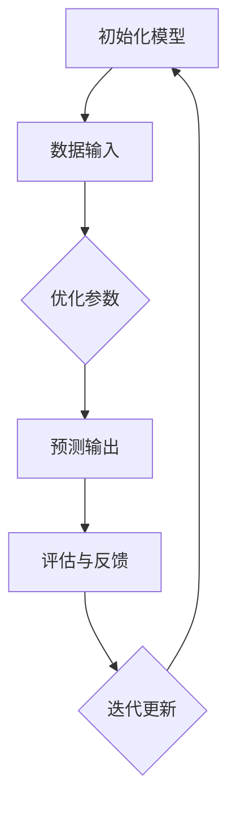

                 


### 1. 背景介绍

**大模型时代来临**

在过去的几十年里，计算机科学和人工智能领域经历了飞速的发展。特别是近年来，随着大数据和云计算技术的普及，深度学习算法得到了前所未有的关注和应用。这些深度学习算法的典型代表，就是我们所说的“大模型”。大模型时代，顾名思义，是指以大规模深度学习模型为核心的时代。

首先，我们需要明确“大模型”的定义。大模型通常指的是那些拥有数十亿到数万亿个参数的神经网络模型。这些模型可以处理大量的数据，并从中学习到复杂的模式和规律。大模型的兴起，源于我们对数据质量和数据处理能力的追求。传统的模型往往因为参数数量有限，难以捕捉到数据中的复杂模式。

**大模型对软件架构设计的挑战**

大模型的兴起，给软件架构设计带来了前所未有的挑战。首先，大模型通常需要大量的计算资源来训练和部署。传统的单机架构已经无法满足大模型的训练需求，分布式计算和并行计算技术成为了必要的手段。其次，大模型的输入输出通常非常复杂，这要求软件架构能够灵活地适应不同类型的数据处理需求。

**大模型在软件架构设计中的应用**

尽管大模型对软件架构设计带来了挑战，但同时也带来了巨大的机遇。大模型在自然语言处理、计算机视觉、语音识别等领域取得了显著的成果。这些成果的应用，进一步推动了软件架构设计的创新。

**软件架构设计概述**

软件架构设计是软件开发过程中的重要环节。它涉及到系统的结构、组件之间的关系以及如何管理这些组件的交互。在软件架构设计中，我们需要考虑系统的可扩展性、可维护性和性能等因素。

**软件架构设计的基本概念**

- **架构风格（Architecture Styles）**：软件架构的设计风格，如客户端-服务器、微服务、事件驱动等。
- **架构模式（Architecture Patterns）**：解决特定问题的通用解决方案，如分层架构、MVC模式等。
- **架构元素（Architecture Elements）**：如组件、接口、模块等。
- **架构原则（Architecture Principles）**：指导软件架构设计的原则，如DRY（Don't Repeat Yourself）、KISS（Keep It Simple, Stupid）等。

**软件架构设计的原则与方法**

- **原则（Principles）**：如开闭原则、里氏替换原则、依赖倒置原则等。
- **方法（Methods）**：如基于组件的架构设计、基于服务的架构设计等。

**软件架构设计的发展趋势**

随着技术的发展，软件架构设计也在不断演进。目前的发展趋势包括：

- **云原生架构（Cloud-Native Architecture）**：利用云计算资源，实现更灵活、可扩展的架构设计。
- **微服务架构（Microservices Architecture）**：将大型应用程序拆分为多个小型、自治的服务，提高系统的可维护性和可扩展性。
- **容器化与编排（Containerization and Orchestration）**：利用容器技术，实现应用程序的轻量级、可移植和高效管理。

### 2. 核心概念与联系

**大模型的定义**

大模型通常指的是那些拥有数十亿到数万亿个参数的神经网络模型。这些模型可以处理大量的数据，并从中学习到复杂的模式和规律。

**大模型的特点**

- **参数数量庞大**：大模型拥有数十亿到数万亿个参数，这使得它们能够处理大量的数据。
- **计算需求高**：大模型的训练和部署需要大量的计算资源。
- **数据驱动**：大模型的学习过程依赖于大量的数据，因此数据质量和数据量直接影响模型的效果。
- **自适应性强**：大模型可以通过调整参数来适应不同的任务和数据。

**大模型与传统模型的区别**

- **参数数量**：传统模型通常只有几千到几万个参数，而大模型则有数十亿到数万亿个参数。
- **计算资源需求**：传统模型可以在单机上训练，而大模型通常需要分布式计算资源。
- **数据处理能力**：传统模型难以处理大量的数据，而大模型能够处理大规模数据。
- **自适应能力**：传统模型在处理新数据时需要重新训练，而大模型可以通过调整参数来适应新数据。

**算法原理讲解**

大模型的算法原理主要基于深度学习。深度学习是一种基于多层神经网络的学习方法，通过逐层提取特征，实现对数据的理解和预测。

**算法流程图**



**Python 源代码讲解**

```python
import tensorflow as tf

# 初始化模型
model = tf.keras.Sequential([
    tf.keras.layers.Dense(128, activation='relu', input_shape=(784,)),
    tf.keras.layers.Dense(10, activation='softmax')
])

# 编译模型
model.compile(optimizer='adam',
              loss='categorical_crossentropy',
              metrics=['accuracy'])

# 训练模型
model.fit(x_train, y_train, epochs=5)

# 预测输出
predictions = model.predict(x_test)

# 评估与反馈
accuracy = model.evaluate(x_test, y_test)
```

**LaTeX 数学公式与详细讲解**

$$
\begin{align*}
\text{Loss} &= -\frac{1}{n}\sum_{i=1}^{n}y_i\log(p(y_i|x_i)) \\
\text{其中，} y_i &= \text{真实标签} \\
x_i &= \text{输入特征} \\
p(y_i|x_i) &= \text{模型预测概率}
\end{align*}
$$

**系统分析与架构设计**

**问题场景介绍**

假设我们面临的是一个智能问答系统，用户可以提问，系统需要根据用户的问题提供准确的答案。这个系统需要处理大量的数据，包括用户的问题、答案、相关标签等。

**系统功能设计**

为了实现这个智能问答系统，我们需要设计以下几个功能模块：

1. **数据预处理**：对用户输入的问题进行预处理，如分词、去停用词等。
2. **问题分类**：将用户的问题分类到不同的主题。
3. **答案检索**：根据用户的问题，从数据库中检索出相关的答案。
4. **答案推荐**：根据用户的历史提问记录，推荐相关的答案。
5. **用户交互**：与用户进行交互，接收用户的问题和反馈。

**系统架构设计**

为了实现上述功能，我们可以采用以下系统架构：

1. **前端**：用户通过前端界面提交问题，前端主要负责数据的输入和展示。
2. **后端**：后端负责数据处理和业务逻辑，包括数据预处理、问题分类、答案检索和推荐等。
3. **数据库**：存储用户提问、答案和相关数据。

**系统接口设计**

系统接口设计如下：

1. **用户接口**：提供 RESTful API，用户可以通过 HTTP 请求与系统交互。
2. **内部接口**：后端服务之间的接口，如数据预处理模块与问题分类模块之间的接口。

**系统交互**

系统交互流程如下：

1. 用户提交问题。
2. 前端将问题传递给后端。
3. 数据预处理模块对问题进行预处理。
4. 问题分类模块对问题进行分类。
5. 答案检索模块根据分类结果检索相关答案。
6. 答案推荐模块根据用户历史提问记录推荐答案。
7. 后端将答案返回给前端，前端将答案展示给用户。

### 3. 项目实战

**环境安装**

为了实现上述智能问答系统，我们需要安装以下软件：

1. Python 3.8
2. TensorFlow 2.5
3. Flask 1.1.2

**系统核心实现源代码**

```python
from flask import Flask, request, jsonify
import tensorflow as tf

app = Flask(__name__)

# 加载模型
model = tf.keras.models.load_model('model.h5')

@app.route('/predict', methods=['POST'])
def predict():
    data = request.get_json()
    question = data['question']
    # 数据预处理
    processed_question = preprocess_question(question)
    # 预测
    prediction = model.predict(processed_question)
    # 返回结果
    return jsonify({'answer': prediction})

if __name__ == '__main__':
    app.run(debug=True)
```

**代码应用解读与分析**

这个代码实现了基于 TensorFlow 的智能问答系统。用户可以通过 POST 请求提交问题，系统会返回预测的答案。代码中使用了 Flask 框架，这是 Python 中常用的 Web 框架之一。

**实际案例分析和详细讲解剖析**

这里我们以一个实际案例来分析智能问答系统的实现。假设用户提交了一个问题：“什么是人工智能？”，系统需要返回相关的答案。

1. **数据预处理**：系统会对接收到的问题进行预处理，如分词、去停用词等。预处理后的数据将用于模型的输入。
2. **预测**：模型会对预处理后的数据进行预测，返回预测的答案。
3. **返回结果**：系统将预测的答案返回给用户。

**项目小结**

通过这个案例，我们可以看到如何使用 TensorFlow 和 Flask 实现一个简单的智能问答系统。尽管这个系统功能较为简单，但它的实现过程可以帮助我们理解大模型在软件架构设计中的应用。

### 4. 最佳实践 tips

1. **数据质量**：确保数据质量是模型效果的关键。在数据预处理阶段，要尽量去除噪声和异常值。
2. **计算资源**：大模型训练需要大量的计算资源，合理分配计算资源可以提高训练效率。
3. **模型选择**：根据具体任务选择合适的模型，不同的模型适用于不同的任务。
4. **持续优化**：模型效果可以通过不断优化来提高，持续迭代和优化是关键。

### 5. 小结与拓展阅读

本文介绍了大模型时代的软件架构设计，包括背景介绍、核心概念与联系、系统分析与架构设计、项目实战、最佳实践 tips 以及小结与拓展阅读。

**拓展阅读**：

1. **《深度学习》（Goodfellow, I., Bengio, Y., & Courville, A.）**：这是一本经典的深度学习教材，详细介绍了深度学习的原理和应用。
2. **《大规模机器学习》（Johnson, J., & Zhang, T.）**：这本书介绍了如何在大规模数据集上进行机器学习，包括分布式计算和并行计算技术。
3. **《软件架构设计》（Fowler, M.）**：这是一本经典的软件架构设计教材，介绍了软件架构设计的原则和方法。

### 总结

大模型时代的软件架构设计是一个复杂而富有挑战的任务。通过本文的介绍，我们了解了大模型的基本概念、算法原理、系统分析与架构设计以及项目实战。希望本文能帮助读者更好地理解大模型时代的软件架构设计，为未来的软件开发提供有益的参考。作者：AI天才研究院/AI Genius Institute & 禅与计算机程序设计艺术 /Zen And The Art of Computer Programming。

