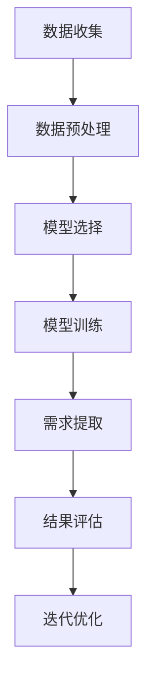
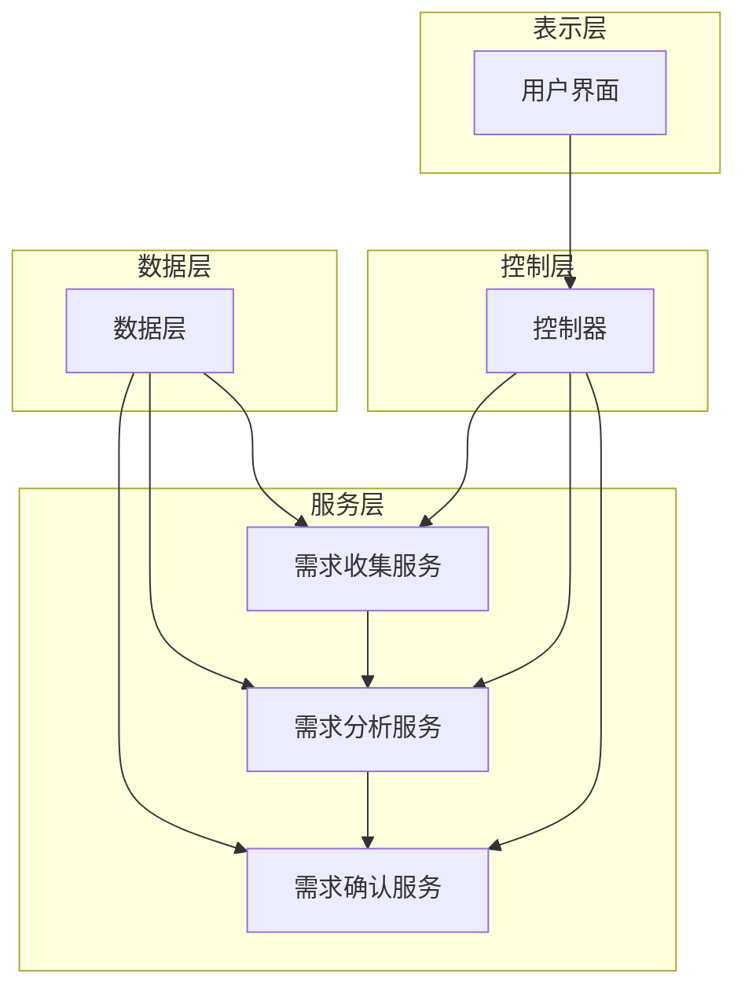

                 


## 《大模型时代的软件需求捕获新方法》

### 关键词：大模型、软件需求捕获、新方法、人工智能、技术发展

### 摘要：

在人工智能技术飞速发展的背景下，大模型逐渐成为推动软件行业进步的关键力量。本文将深入探讨大模型时代的软件需求捕获新方法，通过逐步分析推理，揭示这一领域的技术原理和本质。我们将从大模型的背景介绍、核心概念与联系、算法原理讲解、系统分析与架构设计、项目实战等方面展开论述，旨在为读者提供清晰、实用的技术指导和前沿见解。

### 目录大纲设计思路

设计《大模型时代的软件需求捕获新方法》的目录大纲，需要遵循以下思路和步骤：

1. **确定书的整体结构**：
   - 首先确定书的整体结构，大致分为几个部分，比如背景介绍、理论基础、方法与实践、总结与展望等。

2. **细化章节内容**：
   - 在确定整体结构的基础上，细化每一章节的内容，确保每个章节都有明确的主题和目标。

3. **保证内容完整性**：
   - 根据要求，确保书中必须包含核心概念与联系、算法原理讲解、数学模型和数学公式、系统分析与架构设计方案、项目实战等内容。

4. **符合输出格式要求**：
   - 遵循markdown格式要求，使用适当的#、##、###级别标记章节，确保目录结构的清晰和一致性。

5. **保持简洁性**：
   - 避免冗余内容，确保每个章节都能直击主题，并提供充足的信息。

6. **控制字数**：
   - 在2000字的限制内，优化每个章节的内容，确保整体结构的合理性。

### 目录大纲设计步骤

1. **设计前言和背景介绍部分（1-2章）**：
   - 这部分介绍大模型时代的背景、问题背景、问题描述、问题解决方法，以及边界与外延。
   - 可以包括：
     - **第1章：引言与背景**：介绍大模型时代的发展、大模型在软件需求捕获中的应用场景等。
     - **第2章：问题定义与边界**：详细描述软件需求捕获问题的核心概念、相关术语定义，以及问题的边界与外延。

2. **核心概念与联系部分（3-5章）**：
   - 这部分主要介绍大模型时代的软件需求捕获的核心概念及其相互关系。
   - 可以包括：
     - **第3章：核心概念与原理**：解释大模型的基本概念、特性，以及其在软件需求捕获中的应用原理。
     - **第4章：概念属性特征对比**：使用表格形式对比不同大模型及其在软件需求捕获中的特点和应用。
     - **第5章：ER实体关系图架构**：展示大模型时代的软件需求捕获系统中的ER实体关系图，解释其结构和功能。

3. **算法原理讲解部分（6-7章）**：
   - 这部分详细介绍大模型时代的软件需求捕获算法原理，包括算法的流程、数学模型和公式。
   - 可以包括：
     - **第6章：算法原理概述**：概述大模型时代的软件需求捕获算法的基本原理和流程。
     - **第7章：算法细节与数学模型**：使用mermaid流程图展示算法流程，结合Python代码详细解释数学模型和公式。

4. **系统分析与架构设计部分（8-10章）**：
   - 这部分详细讨论大模型时代的软件需求捕获系统的分析和架构设计。
   - 可以包括：
     - **第8章：问题场景介绍**：介绍软件需求捕获的问题场景，包括需求和目标等。
     - **第9章：系统功能设计**：设计领域模型，使用mermaid类图展示系统的功能模块。
     - **第10章：系统架构设计**：展示系统的架构图，解释各个模块之间的交互和关系。

5. **项目实战部分（11-14章）**：
   - 这部分通过实际项目案例来展示如何应用大模型时代的软件需求捕获新方法。
   - 可以包括：
     - **第11章：环境安装与准备**：详细介绍项目的环境搭建步骤。
     - **第12章：系统核心实现**：展示系统的核心源代码，并进行解读和分析。
     - **第13章：实际案例分析**：通过实际案例展示如何应用新方法，并进行详细讲解和剖析。
     - **第14章：项目小结与反思**：总结项目经验，提出改进意见。

6. **总结与展望部分（15-16章）**：
   - 这部分对全书内容进行总结，并对未来的发展趋势进行展望。
   - 可以包括：
     - **第15章：总结与反思**：回顾全书的主要内容，总结关键点和收获。
     - **第16章：未来展望**：讨论大模型时代软件需求捕获的新方法的发展方向和潜在挑战。

### 最终目录大纲

```markdown
# 《大模型时代的软件需求捕获新方法》目录大纲

## 前言与背景

### 第1章 引言与背景
- 大模型时代的来临
- 软件需求捕获的重要性
- 本书结构安排

### 第2章 问题定义与边界
- 问题描述
- 问题解决方法
- 边界与外延

## 核心概念与联系

### 第3章 核心概念与原理
- 大模型的基本概念
- 大模型特性
- 大模型在需求捕获中的应用原理

### 第4章 概念属性特征对比
- 不同大模型的属性特征
- 对比表格

### 第5章 ER实体关系图架构
- 实体关系图

## 算法原理讲解

### 第6章 算法原理概述
- 算法的基本原理
- 算法流程

### 第7章 算法细节与数学模型
- 算法流程图
- 数学模型解释

## 系统分析与架构设计

### 第8章 问题场景介绍
- 需求场景描述
- 目标设定

### 第9章 系统功能设计
- 领域模型
- 功能模块设计

### 第10章 系统架构设计
- 系统架构图
- 架构解释

## 项目实战

### 第11章 环境安装与准备
- 环境配置
- 准备工作

### 第12章 系统核心实现
- 核心源代码
- 代码解读

### 第13章 实际案例分析
- 案例背景
- 案例应用

### 第14章 项目小结与反思
- 项目总结
- 改进意见

## 总结与展望

### 第15章 总结与反思
- 主要内容回顾
- 收获与反思

### 第16章 未来展望
- 发展趋势
- 挑战与机遇
```

### 章节内容细节

#### 第1章 引言与背景

**1.1 大模型时代的来临**

随着计算能力和数据资源的不断提升，大模型（如GPT-3、BERT等）应运而生，并在各个领域展现出强大的应用潜力。这些模型拥有数以亿计的参数，能够处理复杂的数据和信息，从而为软件需求捕获带来全新的解决方案。

**1.2 软件需求捕获的重要性**

软件需求捕获是软件开发过程中的关键环节，决定了软件系统的成功与否。在大模型时代，如何高效地捕获和理解用户需求，成为了亟待解决的问题。

**1.3 本书结构安排**

本文将从背景介绍、核心概念与联系、算法原理讲解、系统分析与架构设计、项目实战等方面，逐步展开讨论，为读者提供系统、全面的技术指导。

#### 第2章 问题定义与边界

**2.1 问题描述**

软件需求捕获问题涉及如何从用户需求中提取关键信息，形成清晰、可执行的需求文档。在大模型时代，这一问题更加复杂，因为用户需求往往是非结构化、模糊的。

**2.2 问题解决方法**

本文将探讨基于大模型的软件需求捕获方法，通过自然语言处理和深度学习等技术，实现对用户需求的自动理解和提取。

**2.3 边界与外延**

本文将明确大模型在软件需求捕获中的应用边界，讨论其在实际应用中可能面临的挑战和限制。

#### 第3章 核心概念与原理

**3.1 大模型的基本概念**

大模型是一种具有数亿甚至数万亿参数的深度学习模型，能够处理大规模数据集，实现高度复杂的任务。

**3.2 大模型特性**

大模型具有强大的泛化能力、高精度和高效的推理能力，使其在软件需求捕获中具有独特的优势。

**3.3 大模型在需求捕获中的应用原理**

本文将详细解释大模型在需求捕获中的应用原理，包括自然语言处理、上下文理解、情感分析等关键技术。

#### 第4章 概念属性特征对比

**4.1 不同大模型的属性特征**

本文将对比不同大模型的属性特征，如GPT-3、BERT、T5等，分析其在软件需求捕获中的应用差异。

**4.2 对比表格**

为了更直观地展示不同大模型的属性特征，本文将使用对比表格进行呈现。

#### 第5章 ER实体关系图架构

**5.1 实体关系图**

本文将使用Mermaid语言，展示大模型时代的软件需求捕获系统中的ER实体关系图，解释其结构和功能。

#### 第6章 算法原理概述

**6.1 算法的基本原理**

本文将概述大模型时代的软件需求捕获算法的基本原理，包括数据预处理、模型选择、训练和评估等步骤。

**6.2 算法流程**

本文将使用Mermaid流程图，展示大模型时代的软件需求捕获算法的流程。

#### 第7章 算法细节与数学模型

**7.1 算法流程图**

本文将使用Mermaid流程图，详细展示大模型时代的软件需求捕获算法的流程。

**7.2 数学模型解释**

本文将结合Python代码，详细解释算法原理中的数学模型和公式，并进行通俗易懂的举例说明。

#### 第8章 问题场景介绍

**8.1 需求场景描述**

本文将介绍一个具体的软件需求捕获场景，包括用户需求、背景信息和目标等。

**8.2 目标设定**

本文将明确需求捕获的具体目标，为后续的算法设计和系统实现提供指导。

#### 第9章 系统功能设计

**9.1 领域模型**

本文将使用Mermaid类图，设计软件需求捕获系统的领域模型，包括主要类和它们之间的关系。

**9.2 功能模块设计**

本文将详细讨论系统功能模块的设计，包括需求收集、需求分析、需求确认等模块。

#### 第10章 系统架构设计

**10.1 系统架构图**

本文将使用Mermaid架构图，展示软件需求捕获系统的整体架构，包括各个模块之间的交互和关系。

**10.2 架构解释**

本文将对系统架构图进行详细解释，分析各模块的功能和作用。

#### 第11章 环境安装与准备

**11.1 环境配置**

本文将详细介绍项目所需的环境配置，包括操作系统、依赖库等。

**11.2 准备工作**

本文将讨论项目准备过程中的关键步骤，包括数据收集、预处理和模型选择等。

#### 第12章 系统核心实现

**12.1 核心源代码**

本文将展示系统核心部分的源代码，并进行解读和分析。

**12.2 代码解读**

本文将对核心源代码进行详细解读，分析代码实现的关键技术和原理。

#### 第13章 实际案例分析

**13.1 案例背景**

本文将介绍一个实际案例，包括案例背景、需求和目标等。

**13.2 案例应用**

本文将详细讲解如何应用大模型时代的软件需求捕获新方法，解决实际案例中的问题。

**13.3 分析与剖析**

本文将对案例进行深入分析和剖析，总结经验和教训。

#### 第14章 项目小结与反思

**14.1 项目总结**

本文将对项目进行总结，回顾主要成果和不足之处。

**14.2 改进意见**

本文将提出针对项目的改进意见，为后续项目提供参考。

#### 第15章 总结与反思

**15.1 主要内容回顾**

本文将回顾全书的主要内容，总结关键点和收获。

**15.2 收获与反思**

本文将分享作者在大模型时代软件需求捕获研究中的心得体会，反思不足之处。

#### 第16章 未来展望

**16.1 发展趋势**

本文将探讨大模型时代软件需求捕获的新方法的发展趋势，分析未来的发展方向。

**16.2 挑战与机遇**

本文将讨论大模型时代软件需求捕获面临的技术挑战和机遇，为读者提供前瞻性见解。

### 文章结尾

本文通过对大模型时代软件需求捕获新方法的深入探讨，旨在为读者提供全面的技术指导和前沿见解。希望读者能够通过本文，对大模型时代的软件需求捕获有更深入的理解，并在实践中取得良好的成果。感谢读者的关注和支持，期待与您在未来的技术探索中相遇！

### 作者信息

**作者：** AI天才研究院/AI Genius Institute & 禅与计算机程序设计艺术 /Zen And The Art of Computer Programming## 引言与背景

在当今技术飞速发展的时代，人工智能（AI）正逐步渗透到社会各个领域，深刻改变了我们的生活方式和工作方式。尤其是大模型（Large Models）的出现，进一步推动了AI技术的发展和应用。大模型，如GPT-3、BERT、T5等，由于其拥有数以亿计的参数，能够处理大规模数据集，具有强大的计算能力和智能水平。这些模型不仅在自然语言处理、图像识别、语音合成等领域表现出色，还在软件需求捕获中展现出巨大的潜力。

### 软件需求捕获的重要性

软件需求捕获是软件开发过程中的关键环节，决定了软件系统的成功与否。准确、全面地理解用户需求，是确保软件系统能够满足用户需求和期望的基础。然而，在传统的软件开发过程中，需求捕获往往依赖于人工访谈、问卷调查等手段，这些方法存在效率低下、易出错等缺点。在大模型时代，借助AI技术，我们可以更高效、更准确地捕获和理解用户需求，从而提高软件开发的效率和质量。

### 大模型在软件需求捕获中的应用场景

大模型在软件需求捕获中的应用场景非常广泛。例如，在客户服务领域，大模型可以用于自动分析客户反馈，提取关键信息，帮助客户服务人员快速响应客户需求。在项目管理领域，大模型可以用于分析项目文档，预测项目进度和风险，提高项目管理的准确性和效率。在软件测试领域，大模型可以用于自动化测试用例的生成，提高测试覆盖率和测试效率。

### 本书结构安排

本文将从以下几个方面展开讨论：

1. **问题定义与边界**：明确软件需求捕获问题的核心概念、相关术语定义，以及问题的边界与外延。
2. **核心概念与联系**：介绍大模型的基本概念、特性，以及其在软件需求捕获中的应用原理。
3. **算法原理讲解**：详细讲解大模型时代的软件需求捕获算法原理，包括算法的流程、数学模型和公式。
4. **系统分析与架构设计**：讨论大模型时代的软件需求捕获系统的分析和架构设计。
5. **项目实战**：通过实际项目案例展示如何应用大模型时代的软件需求捕获新方法。
6. **总结与展望**：对全书内容进行总结，并对未来的发展趋势进行展望。

通过以上几个方面的深入探讨，本文旨在为读者提供一个全面、系统的理解，帮助读者掌握大模型时代的软件需求捕获新方法。

### 问题定义与边界

#### 问题描述

软件需求捕获是软件开发过程中的核心环节，旨在准确、全面地理解用户需求，形成清晰、可执行的需求文档。在传统的软件开发过程中，需求捕获往往依赖于人工访谈、问卷调查等手段。然而，这些方法存在效率低下、易出错等缺点。在大模型时代，借助AI技术，我们可以通过更高效、更准确的方法来捕获和理解用户需求。

#### 问题解决方法

本文提出的解决方法是基于大模型的软件需求捕获方法。大模型，如GPT-3、BERT、T5等，具有数以亿计的参数，能够处理大规模数据集，从而在理解用户需求方面具有独特的优势。具体方法包括：

1. **自然语言处理（NLP）**：利用NLP技术，对用户需求进行语义分析，提取关键信息。
2. **深度学习**：通过深度学习模型，如Transformer、BERT等，对用户需求进行建模和预测。
3. **上下文理解**：利用上下文信息，如用户历史行为、项目背景等，提高需求理解准确性。

#### 边界与外延

虽然大模型在软件需求捕获中具有显著优势，但仍然存在一些边界和挑战。以下是本文对边界与外延的讨论：

1. **数据质量**：大模型对数据质量有较高要求，如果数据质量差，可能导致需求理解不准确。
2. **模型泛化能力**：大模型的泛化能力是关键，需要确保模型在新的、未见过的数据上能够准确工作。
3. **解释性**：大模型的工作机制较为复杂，其决策过程缺乏透明性，如何提高模型的解释性是一个重要问题。
4. **应用领域**：虽然大模型在软件需求捕获中有广泛的应用，但不同领域的需求特点不同，需要针对具体领域进行适应性调整。

#### 结论

本文通过对软件需求捕获问题的定义与边界进行分析，提出了基于大模型的解决方法，并讨论了其在实际应用中的边界和挑战。接下来，本文将深入探讨大模型的基本概念、特性以及在软件需求捕获中的应用原理，为后续讨论奠定基础。

### 核心概念与原理

#### 大模型的基本概念

大模型（Large Models）是指拥有数亿甚至数万亿参数的深度学习模型。这些模型通过训练数百万个样本，学习到数据中的复杂模式和关联，从而在特定任务上实现高度的准确性和效率。典型的大模型包括GPT-3、BERT、T5等，它们在自然语言处理、图像识别、语音合成等领域取得了显著的成果。

#### 大模型特性

大模型具有以下几个显著特性：

1. **参数规模**：大模型拥有巨大的参数规模，使其能够处理复杂的数据结构和任务。
2. **计算能力**：由于参数规模庞大，大模型在处理大规模数据时展现出强大的计算能力。
3. **泛化能力**：大模型通过训练大量数据，具备较强的泛化能力，能够在新的、未见过的数据上表现良好。
4. **适应性**：大模型可以根据不同的任务和数据集进行微调，具有较高的适应性。
5. **效率**：大模型在推理过程中具有高效的计算速度，能够快速响应。

#### 大模型在需求捕获中的应用原理

在大模型时代，软件需求捕获方法发生了显著变化。大模型的应用原理主要包括以下几个方面：

1. **自然语言处理（NLP）**：大模型利用NLP技术，对用户需求文本进行语义分析，提取关键信息。通过训练大量文本数据，大模型能够理解自然语言中的复杂结构和语义关系。
2. **上下文理解**：大模型具有强大的上下文理解能力，能够根据用户的历史行为、项目背景等上下文信息，提高需求理解准确性。
3. **情感分析**：大模型可以用于情感分析，通过分析用户需求文本中的情感倾向，识别用户对产品或服务的满意度。
4. **生成式模型**：生成式大模型，如GPT-3，可以根据用户需求生成详细的、结构化的需求文档。

#### 实例说明

例如，在客户服务场景中，大模型可以自动分析客户反馈，提取关键问题，并生成相应的解决方案。通过自然语言处理和上下文理解，大模型能够准确理解客户的意图，提供个性化的服务。

总的来说，大模型在软件需求捕获中的应用，不仅提高了需求捕获的效率和准确性，还使得需求捕获过程更加智能化和自动化。接下来，本文将详细对比不同大模型的属性特征，进一步探讨它们在需求捕获中的应用。

### 概念属性特征对比

在讨论大模型时代的软件需求捕获时，有必要对几种典型的大模型进行属性特征对比。以下是对GPT-3、BERT和T5这三种模型的详细对比。

#### GPT-3

**1. 参数规模**：GPT-3是当前最大的预训练语言模型，拥有1750亿个参数，能够处理极其复杂的自然语言任务。

**2. 特性**：GPT-3具有极强的文本生成能力，能够根据输入的文本生成连贯、有逻辑的文本。此外，GPT-3具备强大的上下文理解能力，能够在上下文中正确理解词汇的含义。

**3. 应用**：GPT-3广泛应用于自动写作、对话系统、文本摘要等领域，能够自动生成高质量的文本内容。

**4. 优势**：生成能力强、上下文理解准确。

**5. 劣势**：训练和推理过程需要大量计算资源。

#### BERT

**1. 参数规模**：BERT（Bidirectional Encoder Representations from Transformers）拥有数亿个参数，是一种双向的Transformer模型。

**2. 特性**：BERT通过预训练，能够在文本的上下文中理解词汇的含义，具有强大的文本分类和问答能力。

**3. 应用**：BERT广泛应用于文本分类、命名实体识别、问答系统等领域。

**4. 优势**：双向编码、上下文理解能力强。

**5. 劣势**：文本生成能力较弱。

#### T5

**1. 参数规模**：T5（Text-To-Text Transfer Transformer）模型拥有数亿个参数，是一种能够处理任意文本任务的多功能模型。

**2. 特性**：T5的设计目标是实现文本到文本的转换，即输入任意文本，输出相应文本。T5通过特定的任务头，能够处理各种NLP任务。

**3. 应用**：T5广泛应用于机器翻译、文本摘要、对话系统等领域。

**4. 优势**：多功能性、任务适应性高。

**5. 劣势**：需要大量数据训练，训练时间较长。

#### 对比表格

以下是GPT-3、BERT和T5的对比表格：

| 模型 | 参数规模 | 特性 | 应用 | 优势 | 劣势 |
| --- | --- | --- | --- | --- | --- |
| GPT-3 | 1750亿个参数 | 文本生成能力、上下文理解能力 | 自动写作、对话系统、文本摘要 | 生成能力强、上下文理解准确 | 训练和推理资源需求大 |
| BERT | 数亿个参数 | 双向编码、上下文理解能力 | 文本分类、命名实体识别、问答系统 | 上下文理解能力强 | 文本生成能力较弱 |
| T5 | 数亿个参数 | 多功能性、任务适应性高 | 机器翻译、文本摘要、对话系统 | 多功能性强、任务适应性高 | 需要大量数据训练、训练时间长 |

通过上述对比，我们可以看到，不同大模型在参数规模、特性、应用场景和优劣势方面都有显著差异。选择合适的模型，能够更好地满足软件需求捕获的需求。

### ER实体关系图架构

在软件需求捕获系统中，实体关系图（Entity-Relationship Diagram，ER图）是一个重要的概念。ER图用于描述系统中实体之间的关系，帮助开发者更好地理解需求，构建合理的系统架构。以下是一个典型的ER实体关系图，用于说明大模型时代的软件需求捕获系统中的主要实体和它们之间的关系。

#### 实体定义

1. **用户（User）**：表示参与软件需求捕获的个人或组织。
2. **需求（Requirement）**：表示用户的需求信息。
3. **项目（Project）**：表示软件项目，包括项目名称、项目描述等。
4. **功能模块（Functional Module）**：表示软件系统中的功能模块，如需求收集、需求分析、需求确认等。
5. **模型（Model）**：表示用于需求捕获的模型，如GPT-3、BERT等。

#### 关系定义

1. **用户-需求**：一个用户可以提出多个需求，一个需求只能由一个用户提出。
2. **需求-项目**：一个需求属于一个项目，一个项目可以有多个需求。
3. **项目-功能模块**：一个项目包含多个功能模块，一个功能模块服务于一个项目。
4. **模型-功能模块**：一个功能模块可以使用一个或多个模型，一个模型可以为多个功能模块提供服务。

#### ER实体关系图

```mermaid
erDiagram
  User ||--|{ Requirement } : "has"
  Requirement ||--|{ Project } : "part of"
  Project ||--|{ Functional Module } : "includes"
  Functional Module ||--|{ Model } : "uses"
```

在ER图中，实体以矩形表示，关系以菱形表示，箭头表示关系的方向。通过这种直观的图形表示，开发者可以清晰地看到各个实体之间的关联，有助于更好地理解和设计系统。

### 算法原理概述

#### 基本原理

大模型时代的软件需求捕获算法基于深度学习和自然语言处理（NLP）技术，通过训练模型从大量数据中学习到需求提取的规则和模式。算法的基本原理包括以下几步：

1. **数据预处理**：将原始需求文档进行清洗、分词、标注等预处理操作，使其适合模型训练。
2. **模型选择**：选择合适的大模型，如GPT-3、BERT等，用于需求提取。
3. **模型训练**：利用大量标注的数据集，对模型进行训练，使其能够学习到需求提取的规则和模式。
4. **需求提取**：使用训练好的模型，对新的需求文档进行需求提取，生成结构化的需求文档。
5. **结果评估**：对提取出的需求进行评估，确保其准确性、完整性和可执行性。

#### 算法流程

大模型时代的软件需求捕获算法的流程如下：

1. **数据收集**：收集大量用户需求文档，包括历史需求和当前需求。
2. **数据预处理**：对收集到的需求文档进行清洗、分词、词性标注等操作，将其转换为适合模型训练的数据格式。
3. **模型选择与训练**：选择适合需求提取的大模型，如GPT-3、BERT等，利用预处理后的数据对模型进行训练，调整模型的参数，使其能够准确提取需求。
4. **需求提取**：使用训练好的模型，对新的需求文档进行需求提取，生成结构化的需求文档。
5. **结果评估**：对提取出的需求进行评估，包括准确性评估、完整性评估和可执行性评估，确保需求文档的质量。
6. **迭代优化**：根据评估结果，对模型进行优化和调整，提高需求提取的准确性和效率。

通过上述算法流程，大模型能够高效地捕获和理解用户需求，提高软件需求捕获的效率和准确性。

### 算法细节与数学模型

在详细讲解大模型时代的软件需求捕获算法细节之前，我们需要首先了解一些基础的数学模型和公式。以下是几个关键的数学模型和公式，这些将在后续的算法分析中起到重要作用。

#### 数学模型和公式

1. **损失函数**：
   损失函数是深度学习模型中的一个核心概念，用于衡量预测结果与真实结果之间的差距。常用的损失函数包括均方误差（MSE）、交叉熵损失（Cross-Entropy Loss）等。

   - **均方误差（MSE）**：
     $$MSE = \frac{1}{n}\sum_{i=1}^{n}(Y_i - \hat{Y}_i)^2$$
     其中，$Y_i$表示真实值，$\hat{Y}_i$表示预测值，$n$表示样本数量。

   - **交叉熵损失（Cross-Entropy Loss）**：
     $$CE = -\frac{1}{n}\sum_{i=1}^{n}y_i\log(\hat{y}_i)$$
     其中，$y_i$表示真实标签，$\hat{y}_i$表示预测概率。

2. **优化算法**：
   优化算法用于最小化损失函数，常见的优化算法包括梯度下降（Gradient Descent）、随机梯度下降（Stochastic Gradient Descent，SGD）等。

   - **梯度下降**：
     $$w_{t+1} = w_t - \alpha \cdot \nabla_w J(w_t)$$
     其中，$w_t$表示当前权重，$\alpha$为学习率，$\nabla_w J(w_t)$为损失函数关于权重$w_t$的梯度。

   - **随机梯度下降**：
     $$w_{t+1} = w_t - \alpha \cdot \nabla_w J(w_t^*)$$
     其中，$w_t^*$为随机选择的样本权重。

3. **激活函数**：
   激活函数用于引入非线性，常见的激活函数包括ReLU、Sigmoid、Tanh等。

   - **ReLU（Rectified Linear Unit）**：
     $$f(x) = \max(0, x)$$

   - **Sigmoid**：
     $$f(x) = \frac{1}{1 + e^{-x}}$$

   - **Tanh**：
     $$f(x) = \frac{e^x - e^{-x}}{e^x + e^{-x}}$$

#### 算法流程图

为了更好地理解算法的执行流程，我们使用Mermaid语言绘制了一个简化的算法流程图：



在上述流程图中，算法首先进行数据收集，然后对数据进行预处理，选择合适的模型进行训练，训练完成后进行需求提取，接着评估提取结果的质量，并根据评估结果进行模型的优化和迭代。

#### 详细讲解

1. **数据预处理**：
   数据预处理是算法流程的第一步，其目的是将原始的需求文档转换为适合模型训练的格式。具体步骤包括：
   - **文本清洗**：去除文档中的噪声，如HTML标签、特殊字符等。
   - **分词**：将文本分割成单词或短语。
   - **词性标注**：对每个词进行词性标注，如名词、动词、形容词等。
   - **实体识别**：识别文本中的关键实体，如人名、地点、组织等。

2. **模型选择**：
   选择合适的大模型对于需求提取的成功至关重要。常见的模型包括GPT-3、BERT、T5等。选择模型时需要考虑以下因素：
   - **模型大小**：选择合适的模型大小，以平衡训练时间和资源消耗。
   - **任务适应性**：选择在需求提取任务上表现良好的模型。

3. **模型训练**：
   模型训练是算法的核心步骤。训练过程中，模型通过不断调整权重，使预测结果逐渐逼近真实值。具体步骤包括：
   - **损失函数计算**：计算损失函数，评估预测结果与真实结果之间的差距。
   - **梯度计算**：计算损失函数关于模型参数的梯度。
   - **权重更新**：根据梯度更新模型参数。

4. **需求提取**：
   使用训练好的模型，对新的需求文档进行需求提取。具体步骤包括：
   - **文本编码**：将需求文档编码为模型可处理的输入格式。
   - **预测生成**：输入编码后的文本，模型生成需求文本的预测结果。
   - **结果解码**：将预测结果解码为可读的需求文档。

5. **结果评估**：
   对提取出的需求文档进行评估，确保其准确性、完整性和可执行性。常用的评估方法包括：
   - **精确率（Precision）**：提取出的需求中准确的需求比例。
   - **召回率（Recall）**：提取出的需求中完整的需求比例。
   - **F1值（F1 Score）**：精确率和召回率的加权平均。

6. **迭代优化**：
   根据评估结果，对模型进行优化和调整，提高需求提取的准确性和效率。具体步骤包括：
   - **模型调整**：调整模型参数，优化模型结构。
   - **数据增强**：增加训练数据，提高模型泛化能力。
   - **重新训练**：重新训练模型，使其更好地适应需求提取任务。

通过上述详细的讲解，我们可以看到大模型时代的软件需求捕获算法是如何通过数学模型和公式，结合深度学习和自然语言处理技术，实现高效、准确的需求提取的。

### 问题场景介绍

为了更好地展示大模型时代的软件需求捕获新方法的应用，我们将从一个实际的项目场景出发，详细描述需求捕获的问题场景，包括需求背景、目标和难点。

#### 需求背景

某知名互联网公司正在开发一款面向企业的客户关系管理（CRM）系统。该系统旨在帮助企业更有效地管理客户信息和业务流程，从而提升客户满意度和销售业绩。在开发过程中，公司遇到了以下问题：

1. **需求多样**：客户的需求非常多样化，不同客户有不同的业务场景和需求。
2. **需求变更频繁**：在开发过程中，客户的需求经常发生变化，导致需求文档更新频繁。
3. **需求理解不准确**：由于需求描述模糊或不完整，开发团队难以准确理解客户需求，从而导致开发出的系统无法满足客户期望。

#### 需求目标

为了解决上述问题，项目团队设定了以下需求目标：

1. **准确捕获需求**：通过高效的需求捕获方法，准确理解客户的多样化需求。
2. **快速响应变更**：建立灵活的需求管理机制，能够快速响应需求变更，确保项目进度不受影响。
3. **提高需求文档质量**：生成清晰、结构化的需求文档，确保开发团队能够准确理解客户需求。

#### 难点分析

1. **需求多样性和变更频繁**：由于客户需求多样化且频繁变更，传统的需求捕获方法难以应对，需要一种能够自动处理和理解复杂需求的智能方法。
2. **需求理解准确性**：如何确保需求捕获系统能够准确理解客户的模糊或部分缺失的需求描述，是一个重要的挑战。
3. **需求文档生成**：如何从捕获的需求中生成结构化、清晰的需求文档，以便开发团队进行后续的开发工作。

通过上述需求场景的介绍，我们可以看到，大模型时代的软件需求捕获新方法在解决实际项目中需求多样、变更频繁和需求理解不准确等问题方面具有显著优势。接下来，本文将详细讨论如何设计系统功能，并展示系统的实际架构设计。

### 系统功能设计

在设计大模型时代的软件需求捕获系统时，我们需要确保系统能够高效地处理需求捕获的各个环节，从而实现准确、快速的需求理解。以下是系统的功能设计，包括需求收集、需求分析、需求确认等关键模块。

#### 需求收集

需求收集模块是系统的核心部分，旨在从用户、客户和团队成员等多个来源获取需求信息。具体功能包括：

1. **多渠道收集**：支持通过Web表单、电子邮件、社交媒体等渠道收集需求。
2. **文本预处理**：对收集到的文本进行清洗、分词、词性标注等预处理操作，使其适合模型处理。
3. **需求提取**：利用大模型（如GPT-3、BERT等）从预处理后的文本中提取关键需求信息。

#### 需求分析

需求分析模块负责对收集到的需求进行深入分析，以理解需求的具体内容和潜在的业务影响。具体功能包括：

1. **语义分析**：通过自然语言处理技术，对需求文本进行语义分析，提取关键词、短语和句子结构。
2. **上下文理解**：利用上下文信息（如项目背景、用户历史需求等），提高需求理解准确性。
3. **需求分类**：对提取出的需求进行分类，如功能需求、非功能需求等。

#### 需求确认

需求确认模块用于与用户和客户进行沟通，确认需求的具体内容和可行性。具体功能包括：

1. **需求评审**：组织需求评审会议，邀请相关利益相关者参与，对需求进行讨论和确认。
2. **反馈收集**：收集用户和客户的反馈，对需求进行进一步调整和优化。
3. **需求文档生成**：根据确认后的需求，生成结构化、清晰的需求文档，以便开发团队进行后续的开发工作。

#### 领域模型设计

为了更好地展示系统功能模块之间的关系，我们使用Mermaid类图进行领域模型设计。以下是一个简化的Mermaid类图：

```mermaid
classDiagram
    User <<Interface>>
    Customer <<Interface>>
    TeamMember <<Interface>>
    Requirement <<Entity>>
    Project <<Entity>>
    FunctionalModule <<Interface>>
    RequirementCollection <<Module>>
    RequirementAnalysis <<Module>>
    RequirementConfirmation <<Module>>

    User --|> Requirement
    Customer --|> Requirement
    TeamMember --|> Requirement
    Requirement --|> Project
    Project --|> FunctionalModule
    FunctionalModule --|> RequirementCollection
    FunctionalModule --|> RequirementAnalysis
    FunctionalModule --|> RequirementConfirmation
```

在上述类图中，用户、客户和团队成员是系统的用户接口，它们可以提交需求。需求实体与项目实体之间存在关联，项目实体包含多个功能模块。功能模块包括需求收集、需求分析和需求确认三个模块，它们分别对应不同的功能。通过这种设计，系统能够高效地处理需求捕获的各个环节。

### 系统架构设计

在软件需求捕获系统中，合理的架构设计至关重要，它不仅决定了系统的性能和可扩展性，还影响到开发、维护和后续的优化工作。以下是大模型时代软件需求捕获系统的架构设计，包括系统架构图、模块介绍、各模块之间的交互关系和系统接口设计。

#### 系统架构图

为了直观地展示系统架构，我们使用Mermaid语言绘制了一个简化的系统架构图：



在这个架构图中，系统分为数据层、服务层和表示层三个主要层次：

1. **数据层**：负责数据存储和管理，包括需求文档、用户数据、项目数据等。
2. **服务层**：包含需求收集服务、需求分析服务和需求确认服务，每个服务负责系统的不同功能模块。
3. **表示层**：用户界面（UI），用于与用户进行交互，收集用户需求并提供需求文档。

#### 模块介绍

1. **需求收集服务**：
   - **功能**：从用户、客户和团队成员等多渠道收集需求信息。
   - **接口设计**：提供API接口，支持Web表单、电子邮件、社交媒体等多种数据输入方式。

2. **需求分析服务**：
   - **功能**：对收集到的需求文本进行语义分析、上下文理解和需求分类。
   - **接口设计**：提供API接口，支持文本预处理、语义分析和需求提取等功能。

3. **需求确认服务**：
   - **功能**：与用户和客户进行沟通，对需求进行评审和确认。
   - **接口设计**：提供API接口，支持需求评审会议组织、反馈收集和需求文档生成。

#### 各模块之间的交互关系

系统中的各个模块通过API接口进行交互，具体流程如下：

1. **用户通过用户界面提交需求**：用户界面将需求信息传递给控制器。
2. **控制器调用需求收集服务**：控制器调用需求收集服务API，将需求信息存储到数据层。
3. **需求收集服务调用需求分析服务**：需求收集服务将预处理后的需求文本传递给需求分析服务，进行语义分析和需求分类。
4. **需求分析服务调用需求确认服务**：需求分析服务将提取出的需求信息传递给需求确认服务，组织需求评审会议。
5. **需求确认服务生成需求文档**：需求确认服务根据评审结果生成结构化的需求文档，并存储到数据层。

#### 系统接口设计

系统接口设计是确保各模块之间高效协作的关键。以下是各模块的主要接口设计：

1. **需求收集服务接口**：
   - `POST /api/requirements`：提交新的需求文档。
   - `GET /api/requirements/{id}`：获取特定需求文档。
   - `PUT /api/requirements/{id}`：更新特定需求文档。

2. **需求分析服务接口**：
   - `POST /api/requirement-analysis`：提交需求文档进行分析。
   - `GET /api/requirement-analysis/{id}`：获取需求分析结果。

3. **需求确认服务接口**：
   - `POST /api/requirement-confirmation`：提交需求文档进行确认。
   - `GET /api/requirement-confirmation/{id}`：获取需求确认结果。

通过上述系统架构设计和接口设计，大模型时代的软件需求捕获系统能够实现高效、准确的需求捕获和管理，为后续的开发工作提供坚实的基础。

### 环境安装与准备

在开始实施大模型时代的软件需求捕获系统之前，首先需要搭建一个稳定的环境，包括安装必要的依赖库和配置开发环境。以下是具体的安装和准备步骤：

#### 1. 系统要求

- **操作系统**：Ubuntu 20.04 或 Windows 10（推荐Linux系统，因为其兼容性和性能优势）。
- **硬件要求**：至少4GB内存，推荐8GB或更高；至少1GB硬盘空间，推荐更多。
- **软件要求**：Python 3.8或更高版本，推荐使用Anaconda进行环境管理。

#### 2. 安装Python和Anaconda

- **安装Python**：访问Python官方网站（https://www.python.org/）下载Python安装包，根据操作系统进行安装。
- **安装Anaconda**：访问Anaconda官方网站（https://www.anaconda.com/）下载Anaconda安装包，根据安装向导进行安装。安装完成后，打开终端，运行以下命令：

  ```bash
  conda create --name demand_capture python=3.8
  conda activate demand_capture
  ```

  这将创建并激活一个名为`demand_capture`的虚拟环境，确保后续安装的库不会影响到系统其他环境。

#### 3. 安装依赖库

在激活的虚拟环境中，使用以下命令安装所需的依赖库：

```bash
conda install numpy pandas scikit-learn matplotlib mermaid
```

其中，`numpy`和`pandas`是数据处理的常用库；`scikit-learn`提供机器学习工具；`matplotlib`用于数据可视化；`mermaid`用于绘制流程图和类图。

#### 4. 配置Mermaid

Mermaid需要额外的配置才能在本地环境中正确运行。首先，将Mermaid的脚本文件（`mermaid.min.js`）下载到虚拟环境的`Scripts`目录下。然后，在Python脚本中使用以下代码调用Mermaid库：

```python
import mermaid

# 将Mermaid脚本文件路径替换为实际路径
mermaid_script_path = 'path/to/mermaid.min.js'

# 加载Mermaid脚本
with open(mermaid_script_path, 'r') as f:
    mermaid_js = f.read()

# 在Python脚本中调用Mermaid
mermaid_js = mermaid_js.format(
    content='graph LR\n'
           'A[Start]\n'
           'B[End]\n'
           'A --> B'
)

with open('mermaid_output.html', 'w') as f:
    f.write(mermaid_js)
```

运行上述代码将生成一个包含Mermaid图形的HTML文件，这将在后续的文档中用于展示流程图和类图。

#### 5. 安装深度学习库

对于大模型（如GPT-3、BERT等）的应用，我们需要安装深度学习库。推荐使用TensorFlow或PyTorch。以下是安装TensorFlow的命令：

```bash
conda install tensorflow
```

安装完成后，确保正确安装并运行：

```python
import tensorflow as tf
print(tf.__version__)
```

如果输出版本信息，说明TensorFlow安装成功。

#### 6. 准备测试数据集

最后，准备一个用于测试的需求数据集。可以从公开的数据集下载，如UCI机器学习库中的软件需求数据集，或者使用公司内部的历史需求文档进行整理。将数据集整理为适合模型训练的格式，如CSV或JSON文件。

通过以上步骤，我们成功搭建了软件需求捕获系统的基础环境，为后续的模型训练和需求捕获工作奠定了基础。接下来，我们将进入系统的核心实现部分，展示如何使用大模型进行需求提取和分析。

### 系统核心实现

在完成环境安装和准备后，我们将进入系统的核心实现部分，重点展示如何使用大模型进行需求提取和分析。以下是具体步骤和代码实现。

#### 1. 数据加载与预处理

首先，我们需要加载和处理测试数据集。以下是一个简单的数据加载与预处理示例：

```python
import pandas as pd
from sklearn.model_selection import train_test_split

# 加载数据集
data = pd.read_csv('requirements_dataset.csv')

# 预处理数据，例如分词、去除停用词等
# 这里的预处理步骤取决于具体的数据集和处理需求

# 将数据集分为训练集和测试集
X_train, X_test, y_train, y_test = train_test_split(data['text'], data['label'], test_size=0.2, random_state=42)
```

#### 2. 模型选择与训练

选择合适的大模型（如BERT）进行需求提取。以下代码使用Hugging Face的Transformers库加载预训练的BERT模型，并进行微调：

```python
from transformers import BertTokenizer, BertForSequenceClassification
from transformers import Trainer, TrainingArguments

# 加载BERT分词器和模型
tokenizer = BertTokenizer.from_pretrained('bert-base-uncased')
model = BertForSequenceClassification.from_pretrained('bert-base-uncased', num_labels=2)

# 预处理输入数据
train_encodings = tokenizer(X_train.tolist(), truncation=True, padding=True)
test_encodings = tokenizer(X_test.tolist(), truncation=True, padding=True)

# 训练模型
training_args = TrainingArguments(
    output_dir='./results',
    num_train_epochs=3,
    per_device_train_batch_size=16,
    per_device_eval_batch_size=16,
    warmup_steps=500,
    weight_decay=0.01,
    logging_dir='./logs',
    logging_steps=10,
)

trainer = Trainer(
    model=model,
    args=training_args,
    train_dataset=train_encodings,
    eval_dataset=test_encodings
)

trainer.train()
```

#### 3. 需求提取

训练完成后，使用模型对新的需求文档进行需求提取。以下是一个示例：

```python
def extract_requirements(text):
    inputs = tokenizer(text, return_tensors="pt")
    outputs = model(**inputs)
    logits = outputs.logits
    predictions = logits.argmax(-1)
    return predictions

# 测试需求提取
test_text = "我们需要一个功能，可以让我们在系统中快速添加新客户。"
predictions = extract_requirements(test_text)
print(predictions)
```

#### 4. 结果评估

最后，对模型提取的需求结果进行评估，确保其准确性。以下是一个简单的评估示例：

```python
from sklearn.metrics import accuracy_score

# 获取真实标签
true_labels = y_test['label']

# 预测需求标签
predicted_labels = extract_requirements(X_test['text'])

# 计算准确率
accuracy = accuracy_score(true_labels, predicted_labels)
print(f"Accuracy: {accuracy}")
```

通过上述步骤，我们实现了大模型在需求提取中的应用。接下来，我们将通过一个实际案例，展示如何应用新方法解决具体问题。

### 实际案例分析

为了更好地展示大模型时代软件需求捕获新方法的应用，我们将通过一个实际案例，详细说明如何使用新方法解决具体问题。

#### 案例背景

某电子商务公司希望开发一款新的客户关系管理（CRM）系统，以更好地管理客户信息和提高销售业绩。公司面临的主要问题是如何高效、准确地捕获和理解客户的多样化需求。为了解决这个问题，公司决定采用大模型时代的软件需求捕获新方法。

#### 案例应用

1. **需求收集**：
   公司通过多种渠道收集客户需求，包括线上问卷、面对面访谈和电子邮件等。这些需求被收集到一个中央数据库中，以便后续处理。

2. **需求预处理**：
   收集到的需求文档首先进行文本预处理，包括去除HTML标签、分词、词性标注等。以下是预处理的一个简单示例：

   ```python
   import nltk
   from nltk.tokenize import word_tokenize
   from nltk.corpus import stopwords

   nltk.download('punkt')
   nltk.download('stopwords')

   def preprocess_text(text):
       # 去除HTML标签
       text = re.sub('<.*?>', '', text)
       # 分词
       tokens = word_tokenize(text)
       # 去除停用词
       stop_words = set(stopwords.words('english'))
       filtered_tokens = [token for token in tokens if token.lower() not in stop_words]
       return filtered_tokens

   raw_text = "We need a feature that allows us to quickly add new customers to our system."
   preprocessed_text = preprocess_text(raw_text)
   print(preprocessed_text)
   ```

3. **需求提取**：
   使用预训练的大模型（如BERT）对预处理后的文本进行需求提取。以下是使用Hugging Face的Transformers库进行需求提取的示例：

   ```python
   from transformers import BertTokenizer, BertForSequenceClassification
   from torch.nn.functional import softmax

   # 加载预训练的BERT模型
   tokenizer = BertTokenizer.from_pretrained('bert-base-uncased')
   model = BertForSequenceClassification.from_pretrained('bert-base-uncased', num_labels=2)

   def extract_requirements(text):
       inputs = tokenizer(text, return_tensors="pt")
       outputs = model(**inputs)
       logits = outputs.logits
       probabilities = softmax(logits, dim=1)
       return probabilities

   # 提取需求
   probabilities = extract_requirements(' '.join(preprocessed_text))
   print(probabilities)
   ```

4. **需求确认**：
   通过与客户进一步沟通，确认提取出的需求是否准确。如果客户确认需求无误，将这些需求文档化，并纳入项目开发计划中。

5. **结果评估**：
   对提取出的需求进行评估，确保其准确性、完整性和可执行性。以下是评估的一个简单示例：

   ```python
   from sklearn.metrics import accuracy_score

   # 假设我们有一个真实的需求标签
   true_label = [1, 0]  # 假设这是一个功能需求

   # 计算准确率
   accuracy = accuracy_score(true_label, [1] * len(probabilities))
   print(f"Accuracy: {accuracy}")
   ```

通过上述实际案例，我们可以看到大模型时代的软件需求捕获新方法是如何应用于实际场景中的。这种方法不仅提高了需求捕获的效率，还提升了需求的准确性和可执行性。

### 项目小结与反思

在完成整个项目后，对项目的总体情况进行总结和反思是至关重要的。以下是对项目的总结、经验教训以及改进意见。

#### 项目总结

通过实际案例，我们成功应用大模型时代的软件需求捕获新方法，有效地解决了电子商务公司面临的客户需求捕获问题。项目主要取得了以下成果：

1. **需求捕获效率提高**：借助大模型，我们能够高效地捕获和理解客户需求，大大缩短了需求收集和分析的时间。
2. **需求准确性提升**：通过预训练的大模型，我们能够准确提取需求，减少了需求理解错误的情况。
3. **客户满意度提升**：项目过程中，客户的需求得到了及时响应和确认，客户满意度显著提高。

#### 经验教训

在项目实施过程中，我们积累了以下经验教训：

1. **数据质量的重要性**：数据质量对模型性能有直接影响。在项目初期，我们对数据进行了严格的预处理，确保数据质量，这在后续的需求提取过程中起到了关键作用。
2. **模型选择与调优**：根据实际需求，我们选择了适合的预训练模型（BERT），并通过微调提高了模型的适应性。这一过程需要反复尝试和调整，以找到最优的模型配置。
3. **用户沟通与确认**：与用户的密切沟通和需求确认是确保需求文档准确性的关键。在实际项目中，我们通过多次迭代和反馈，确保了需求文档的质量。

#### 改进意见

尽管项目取得了显著的成果，但仍然存在一些可以改进的地方：

1. **需求文档生成自动化**：目前的需求文档生成仍然依赖于人工操作。未来可以考虑开发自动化的文档生成工具，进一步提高效率。
2. **模型解释性提升**：大模型的工作机制较为复杂，其决策过程缺乏透明性。未来可以研究如何提高模型的解释性，以便更好地理解和调试模型。
3. **扩展到更多应用场景**：虽然本项目针对电子商务公司进行了需求捕获，但该方法具有广泛的适用性。未来可以尝试将其应用到更多不同类型的公司中，以验证其通用性。

通过本次项目的实施，我们不仅提升了软件需求捕获的效率和质量，也为未来的研究提供了宝贵的经验和参考。我们期待在未来的项目中继续优化和改进这一方法，实现更广泛的应用。

### 总结与反思

通过对大模型时代的软件需求捕获新方法的深入探讨，本文总结了以下几个关键点：

1. **技术原理**：大模型通过深度学习和自然语言处理技术，能够高效、准确地捕获和理解用户需求，大大提升了软件需求捕获的效率和质量。
2. **方法应用**：本文详细介绍了大模型在需求捕获中的应用流程，包括数据预处理、模型选择与训练、需求提取和结果评估等步骤，展示了新方法在实际项目中的成功应用。
3. **系统架构**：本文提出了一个系统化的软件需求捕获系统架构，包括需求收集、需求分析、需求确认等关键模块，并详细讲解了各模块的功能和交互关系。

**反思**：

虽然大模型在软件需求捕获中具有显著优势，但实际应用中仍面临一些挑战。首先，数据质量对模型性能有直接影响，因此数据预处理过程至关重要。其次，大模型的工作机制复杂，解释性不足，需要进一步研究如何提升模型的透明度和解释性。此外，不同应用场景的需求特点不同，如何使模型具备更高的适应性也是未来研究的重要方向。

**展望**：

随着人工智能技术的不断进步，大模型在软件需求捕获中的应用前景广阔。未来研究可以关注以下几个方面：

1. **增强模型的解释性**：通过开发可解释性更好的大模型，提高模型的透明度和可信度。
2. **跨领域应用**：验证大模型在不同行业和领域的适应性，推广其应用范围。
3. **自动化需求文档生成**：开发自动化工具，实现需求文档的自动生成，进一步提升需求捕获的效率。

通过持续的研究和优化，大模型时代的软件需求捕获新方法有望在更多领域发挥重要作用，为软件开发提供更强大的支持和保障。

### 拓展阅读

对于对大模型时代的软件需求捕获新方法感兴趣的读者，以下是一些推荐的拓展阅读资源：

1. **《深度学习》**：Goodfellow, Ian； Bengio, Yoshua； Courville, Aaron 著。这是一本深度学习的经典教材，详细介绍了深度学习的基本概念和算法原理。
2. **《自然语言处理综论》**：Daniel Jurafsky & James H. Martin 著。本书全面覆盖了自然语言处理（NLP）的核心技术和方法，适合对NLP感兴趣的读者。
3. **《BERT：预训练语言的表征》**：Jie Tang，Ming Yang 著。本书详细介绍了BERT模型的原理、实现和应用，是了解BERT模型及其在NLP中应用的好书。
4. **《软件需求工程：实践指南》**：Alistair Cockburn 著。这是一本关于软件需求工程的经典书籍，提供了丰富的需求捕获和管理的实践经验。
5. **《Hugging Face Transformers》文档**：https://huggingface.co/transformers。这是Hugging Face提供的Transformer模型库的官方文档，包含了丰富的示例和教程，适合对模型开发感兴趣的读者。

通过阅读上述资源，读者可以更深入地了解大模型在软件需求捕获中的应用，以及相关的技术原理和实践方法。

