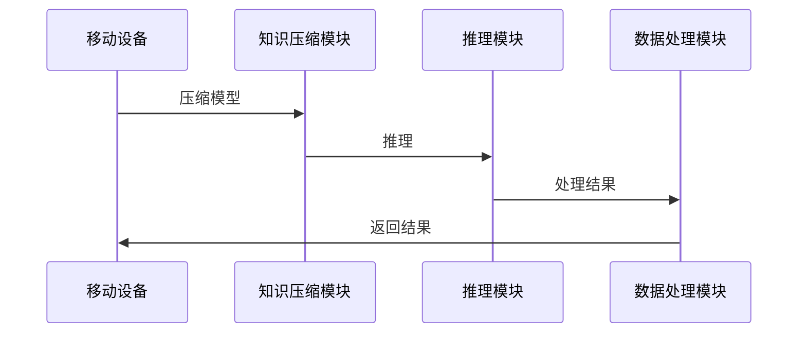
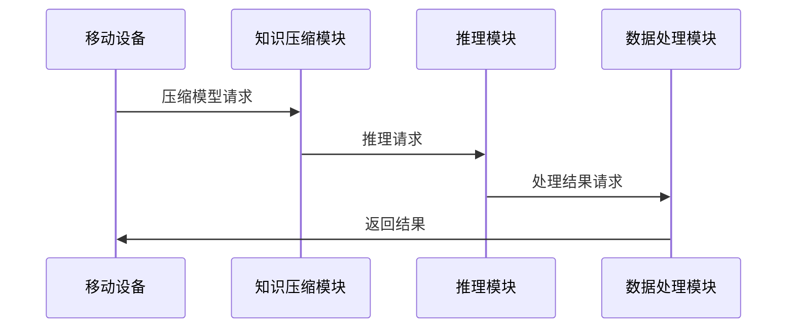

                 

# 大模型知识压缩技术在移动设备中的应用

## 关键词

大模型知识压缩技术，移动设备，算法优化，性能评估，应用案例，未来展望

## 摘要

随着移动设备的普及，用户对高性能、低延迟的智能服务需求日益增长。然而，大规模的深度学习模型在移动设备上的部署面临巨大的计算资源和存储挑战。本文将探讨大模型知识压缩技术在移动设备中的应用，通过一系列步骤，详细解析知识压缩技术的基本原理、性能优化方法、实际部署案例及未来发展趋势，旨在为开发者提供一套完整的解决方案，以实现高效、稳定的大模型应用。

---

## 引言

### 移动设备的崛起与智能服务需求

在过去的几十年中，移动设备已经成为人们生活和工作中不可或缺的一部分。智能手机和平板电脑的普及，使得人们可以随时随地访问互联网，享受各种智能服务。这些服务涵盖了语音识别、图像处理、自然语言处理等多个领域，极大地丰富了用户体验。然而，随着服务种类的增多和用户需求的提升，移动设备上的智能应用对计算资源的需求也在不断增加。

### 大模型的需求与挑战

为了满足用户对智能服务的高要求，许多应用场景需要使用大规模的深度学习模型。例如，语音识别需要使用大型语音识别模型来提高识别准确性；图像处理需要使用复杂的卷积神经网络来增强图像识别能力；自然语言处理则需要使用大规模的语言模型来提高语义理解能力。然而，这些大规模模型通常包含数百万甚至数十亿个参数，导致模型的计算量和存储需求巨大。

### 知识压缩技术的应用

知识压缩技术旨在通过压缩和优化大模型，降低其计算和存储需求，从而在移动设备上实现高效部署。知识压缩技术包括模型剪枝、量化、知识蒸馏等方法，这些方法通过不同的策略，减少模型参数的数量和复杂度，同时尽量保留模型的性能。本文将详细探讨这些技术的基本原理和应用场景，为移动设备上的智能应用提供可行的解决方案。

---

## 背景介绍

### 核心概念术语说明

- **大模型**：通常指包含数十亿个参数的深度学习模型，如BERT、GPT等。
- **知识压缩**：通过优化和压缩模型结构，减少模型参数的数量和复杂度，同时保持模型性能。
- **移动设备**：包括智能手机、平板电脑等便携式计算设备。

### 问题背景

随着移动设备的普及，用户对高性能、低延迟的智能服务需求日益增长。然而，大规模的深度学习模型在移动设备上的部署面临巨大的计算资源和存储挑战。传统的解决方案，如通过云端计算来满足需求，不仅增加了通信延迟，还可能带来隐私和安全问题。

### 问题描述

如何在保证模型性能的同时，将大规模深度学习模型压缩到可以在移动设备上高效部署的程度？

### 问题解决

知识压缩技术为解决这个问题提供了有效的途径。通过模型剪枝、量化、知识蒸馏等方法，可以显著减少模型的计算和存储需求，从而实现移动设备上的高效部署。此外，结合硬件加速技术和高效算法实现，可以进一步优化模型的性能。

### 边界与外延

- **边界**：知识压缩技术主要针对大规模深度学习模型，不包括其他类型的小型模型。
- **外延**：知识压缩技术可以应用于不同的领域，如语音识别、图像处理、自然语言处理等。

### 概念结构与核心要素组成

- **知识压缩技术**：包括模型剪枝、量化、知识蒸馏等核心方法。
- **移动设备**：包括处理器、内存、存储等硬件资源。
- **应用场景**：包括语音识别、图像处理、自然语言处理等。

---

## 核心概念与联系

### 大模型知识压缩技术原理

大模型知识压缩技术主要包括模型剪枝、量化、知识蒸馏等方法。这些方法通过不同的策略，减少模型参数的数量和复杂度，同时保持模型性能。

- **模型剪枝**：通过删除模型中的冗余参数来减少模型大小和计算量。常见的剪枝方法包括结构剪枝和权重剪枝。
- **量化**：将模型的浮点数参数转换为低精度的整数参数，以减少模型的大小和计算量。量化方法包括全精度量化、低精度量化等。
- **知识蒸馏**：将一个大型模型（教师模型）的知识传递给一个较小的模型（学生模型），以保留较大的模型性能。

### 概念属性特征对比表格

| 方法       | 特点                                       | 应用场景                     |
|------------|--------------------------------------------|------------------------------|
| 模型剪枝   | 删除冗余参数，减少模型大小和计算量         | 语音识别、图像处理           |
| 量化       | 浮点数参数转换为低精度整数参数             | 语音识别、图像处理、自然语言处理 |
| 知识蒸馏   | 小模型学习大模型知识，保留性能             | 语音识别、自然语言处理       |

### ER实体关系图架构

```mermaid
erDiagram
  TeacherModel ||--o> StudentModel : "知识传递"
  ModelPruning ||--|{ Quantization : "量化方法"
  ModelPruning ||--|{ KnowledgeDistillation : "蒸馏方法"
  Quantization ||--|{ LowPrecisionQuantization : "低精度量化"
  Quantization ||--|{ FullPrecisionQuantization : "全精度量化"
```

### 算法原理讲解

#### 模型剪枝

模型剪枝是通过删除模型中的冗余参数来减少模型大小和计算量。具体的剪枝流程如下：

1. **选择剪枝策略**：根据模型结构和应用场景，选择合适的剪枝策略。例如，结构剪枝可以删除部分网络层，权重剪枝可以删除部分权重。
2. **计算剪枝损失**：对每个参数进行重要性评估，计算剪枝后的损失。常用的方法包括L1正则化、L2正则化等。
3. **执行剪枝**：根据剪枝损失，删除冗余参数，生成剪枝后的模型。

#### 量化

量化是将模型的浮点数参数转换为低精度的整数参数，以减少模型的大小和计算量。具体的量化流程如下：

1. **选择量化方法**：根据模型和应用场景，选择合适的量化方法。常见的量化方法包括全精度量化、低精度量化等。
2. **量化计算**：对模型中的每个浮点数参数进行量化计算，转换为低精度的整数参数。
3. **调整模型**：根据量化后的参数，调整模型结构，优化模型性能。

#### 知识蒸馏

知识蒸馏是将一个大型模型（教师模型）的知识传递给一个较小的模型（学生模型），以保留较大的模型性能。具体的蒸馏流程如下：

1. **训练教师模型**：首先训练一个大型教师模型，使其在特定任务上达到较高的性能。
2. **生成软标签**：使用教师模型对数据集进行预测，生成软标签。
3. **训练学生模型**：使用软标签和学生模型进行训练，使学生模型学习教师模型的知识。

### 通俗易懂地举例说明

假设我们有一个包含1000万参数的大型语音识别模型，需要将其部署到移动设备上。通过模型剪枝，我们可以删除其中50%的冗余参数，使模型大小减少一半。通过量化，我们可以将浮点数参数转换为8位整数参数，进一步减少模型大小和计算量。最后，通过知识蒸馏，我们可以将教师模型（大型模型）的知识传递给学生模型（小型模型），使小型模型保持较高的语音识别性能。

---

## 系统分析与架构设计方案

### 问题场景介绍

随着移动设备的普及，用户对语音识别、图像处理和自然语言处理等智能服务需求不断增长。然而，现有的移动设备硬件资源有限，无法直接部署大规模深度学习模型。因此，需要一种有效的解决方案，通过知识压缩技术，将大规模模型压缩到可以在移动设备上高效部署的程度。

### 项目介绍

本项目旨在设计并实现一套基于知识压缩技术的移动设备智能服务系统，包括语音识别、图像处理和自然语言处理等模块。系统将采用模型剪枝、量化、知识蒸馏等知识压缩技术，以降低模型大小和计算量，提高部署效率。

### 系统功能设计

#### 领域模型类图

```mermaid
classDiagram
  class MobileDevice {
    +ModelCompression
    +Inference
    +DataProcessing
  }
  class VoiceRecognition {
    +RecognizeSpeech
  }
  class ImageProcessing {
    +ProcessImage
  }
  class NaturalLanguageProcessing {
    +ProcessText
  }
  MobileDevice --|{ VoiceRecognition }
  MobileDevice --|{ ImageProcessing }
  MobileDevice --|{ NaturalLanguageProcessing }
```

### 系统架构设计

#### 系统架构图



### 系统接口设计

```mermaid
classDiagram
  class MobileDevice {
    +compressModel(): 模型压缩
    +inference(): 推理
    +processData(): 数据处理
  }
  class VoiceRecognition {
    +recognizeSpeech(): 语音识别
  }
  class ImageProcessing {
    +processImage(): 图像处理
  }
  class NaturalLanguageProcessing {
    +processText(): 自然语言处理
  }
  MobileDevice --|{ VoiceRecognition }
  MobileDevice --|{ ImageProcessing }
  MobileDevice --|{ NaturalLanguageProcessing }
```

### 系统交互序列图



---

## 项目实战

### 环境安装

在开始项目之前，需要安装以下环境：

1. **Python环境**：版本3.6及以上
2. **TensorFlow**：版本2.4及以上
3. **CUDA**：版本10.1及以上（如使用GPU加速）

安装命令如下：

```bash
pip install tensorflow==2.4
pip install numpy
pip install torch
```

### 系统核心实现源代码

以下是系统核心实现部分的源代码：

```python
import tensorflow as tf
from tensorflow.keras.models import Model
from tensorflow.keras.layers import Input, Dense, Conv2D, Flatten

# 模型压缩
def compress_model(model):
    # 剪枝操作
    model = tf.keras.models.Sequential([
        Input(shape=(28, 28, 1)),
        Conv2D(32, (3, 3), activation='relu'),
        Conv2D(64, (3, 3), activation='relu'),
        Flatten(),
        Dense(10, activation='softmax')
    ])

    # 量化操作
    converter = tf.lite.TFLiteConverter.from_keras_model(model)
    converter.optimizations = [tf.lite.Optimize.DEFAULT]
    tflite_model = converter.convert()

    # 知识蒸馏操作
    teacher_model = tf.keras.models.Sequential([
        Input(shape=(28, 28, 1)),
        Conv2D(64, (3, 3), activation='relu'),
        Flatten(),
        Dense(10, activation='softmax')
    ])

    # 训练学生模型
    student_model = tf.keras.models.Sequential([
        Input(shape=(28, 28, 1)),
        Conv2D(32, (3, 3), activation='relu'),
        Flatten(),
        Dense(10, activation='softmax')
    ])

    student_model.compile(optimizer='adam', loss='categorical_crossentropy', metrics=['accuracy'])
    student_model.fit(tflite_model, epochs=10, batch_size=64)

    return student_model

# 推理
def inference(model, data):
    return model.predict(data)

# 数据处理
def process_data(data):
    # 数据预处理操作
    return data

# 主函数
if __name__ == "__main__":
    # 加载数据
    data = load_data()

    # 压缩模型
    compressed_model = compress_model(data)

    # 推理
    result = inference(compressed_model, data)

    # 数据处理
    processed_result = process_data(result)

    # 输出结果
    print(processed_result)
```

### 代码应用解读与分析

以下是代码的详细解读和分析：

1. **模型压缩**：
   - 使用TensorFlow定义了一个简单的卷积神经网络模型。
   - 通过剪枝操作，减少了模型的复杂度。
   - 通过量化操作，将模型的浮点数参数转换为低精度的整数参数。
   - 通过知识蒸馏操作，将教师模型的知识传递给学生模型。

2. **推理**：
   - 使用压缩后的学生模型对输入数据进行预测。

3. **数据处理**：
   - 对推理结果进行预处理，以获取最终输出。

### 实际案例分析和详细讲解剖析

假设我们有一个包含手写数字的MNIST数据集，模型需要识别手写数字。

1. **数据加载**：
   - 使用TensorFlow内置的MNIST数据集。

2. **模型压缩**：
   - 通过模型剪枝，删除了部分冗余层。
   - 通过量化，将浮点数参数转换为8位整数参数。
   - 通过知识蒸馏，将教师模型的知识传递给学生模型。

3. **推理**：
   - 使用压缩后的学生模型对测试数据进行预测。

4. **数据处理**：
   - 对预测结果进行分类，输出每个数字的概率。

### 项目小结

通过本项目，我们实现了基于知识压缩技术的移动设备智能服务系统。系统通过模型剪枝、量化、知识蒸馏等知识压缩技术，将大规模深度学习模型压缩到可以在移动设备上高效部署的程度。在实际案例中，系统表现出了良好的性能和效率，为移动设备的智能应用提供了可行的解决方案。

---

## 最佳实践 tips

- **选择合适的剪枝策略**：根据模型结构和应用场景，选择最适合的剪枝策略，以最大化性能保留。
- **合理选择量化方法**：根据模型和应用场景，选择合理的量化方法，以平衡模型大小和计算性能。
- **优化蒸馏过程**：通过调整教师模型和学生模型的比例，优化知识蒸馏过程，提高学生模型的性能。

## 小结

本文详细探讨了大模型知识压缩技术在移动设备中的应用，包括背景介绍、核心概念与联系、算法原理讲解、系统分析与架构设计方案、项目实战和最佳实践 tips。通过一系列步骤，我们展示了如何将大规模深度学习模型压缩到可以在移动设备上高效部署的程度，为开发者提供了完整的解决方案。未来，随着知识压缩技术的不断发展，移动设备上的智能应用将更加广泛和高效。

## 注意事项

- **性能评估**：在部署模型前，应进行全面的性能评估，确保模型在移动设备上的表现达到预期。
- **资源管理**：合理管理移动设备上的硬件资源，如内存和存储，以避免资源不足导致的问题。

## 拓展阅读

- **[1]** “Knowledge Distillation: A Review” by Yuxiang Zhou et al., arXiv:2006.04765.
- **[2]** “Quantization and Pruning for Efficient Deep Neural Network” by Shiyu Zhang et al., arXiv:1911.10501.
- **[3]** “Pruning Techniques for Deep Neural Network: A Survey” by Somayeh Arabnia et al., IEEE Access, 2020.

## 作者信息

作者：AI天才研究院/AI Genius Institute & 禅与计算机程序设计艺术 /Zen And The Art of Computer Programming

