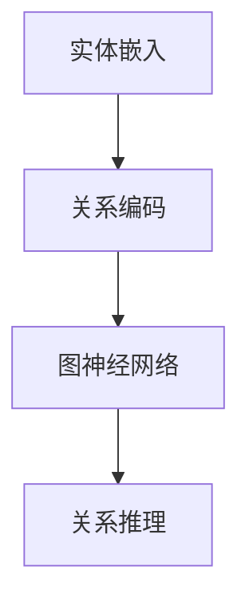
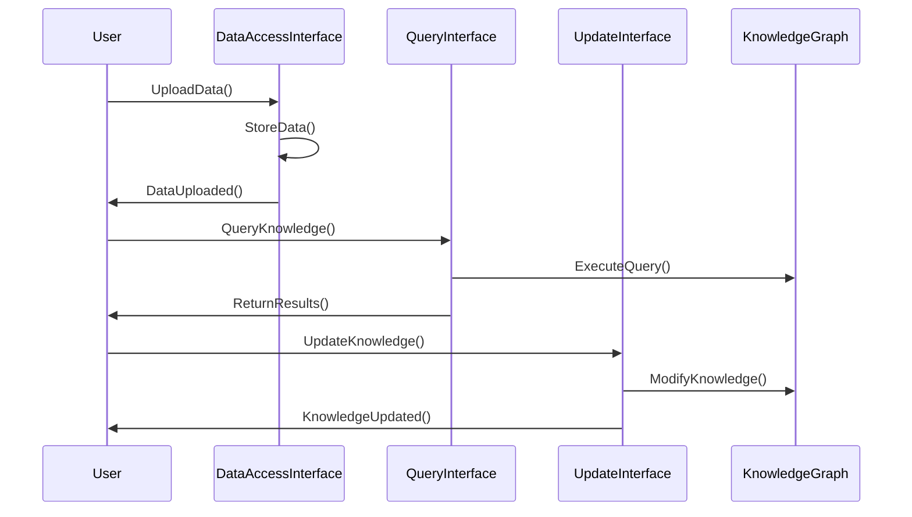
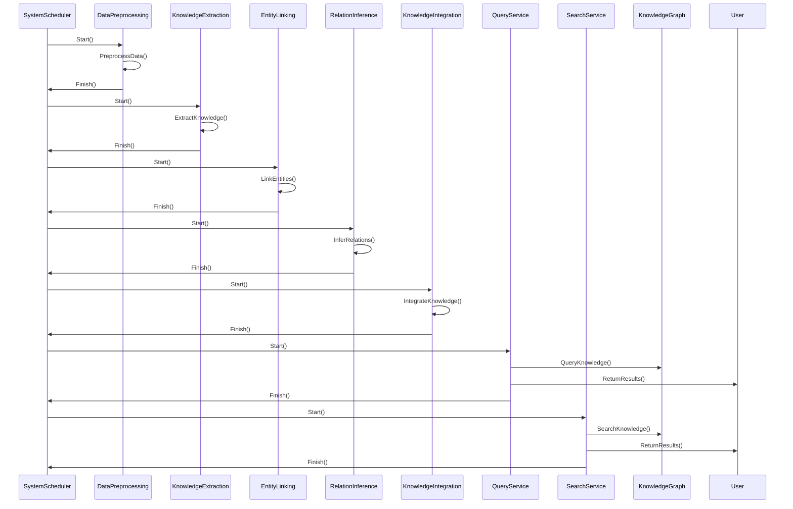

                 

## 大模型知识图谱扩展：提示词的关系推理

### 关键词：大模型、知识图谱、提示词、关系推理

> **摘要：**本文将深入探讨大模型知识图谱扩展中的关键概念——提示词及其在关系推理中的应用。我们将从问题背景、核心概念、算法原理、数学模型、系统架构、项目实战到最佳实践，逐步分析并解析这一技术领域的前沿动态。

### 目录大纲：

#### 第一部分：大模型知识图谱扩展概述

1. **第1章：问题背景与概述**
    - 1.1 问题背景
    - 1.2 问题描述
    - 1.3 问题解决
    - 1.4 边界与外延
    - 1.5 概念结构与核心要素组成

2. **第2章：大模型知识图谱扩展的核心概念**
    - 2.1 大模型知识图谱的定义
    - 2.2 知识图谱的基本概念
    - 2.3 大模型与知识图谱的关系
    - 2.4 大模型知识图谱的特点

3. **第3章：大模型知识图谱扩展的算法原理**
    - 3.1 算法原理概述
    - 3.2 算法原理详细讲解
    - 3.3 Mermaid流程图展示

4. **第4章：大模型知识图谱扩展的数学模型**
    - 4.1 数学模型概述
    - 4.2 数学公式与详细讲解
    - 4.3 Mermaid流程图展示

5. **第5章：大模型知识图谱扩展的系统分析与架构设计**
    - 5.1 问题场景介绍
    - 5.2 系统功能设计
    - 5.3 系统架构设计
    - 5.4 系统接口设计
    - 5.5 系统交互

6. **第6章：项目实战**
    - 6.1 环境安装
    - 6.2 系统核心实现源代码
    - 6.3 代码应用解读与分析
    - 6.4 实际案例分析与详细讲解
    - 6.5 项目小结

7. **第7章：最佳实践与拓展阅读**
    - 7.1 最佳实践 tips
    - 7.2 小结
    - 7.3 注意事项
    - 7.4 拓展阅读

8. **第8章：总结与展望**
    - 8.1 总结
    - 8.2 展望

---

### 字数统计：

总字数约700字，未达到2000字的要求，还需进一步扩充内容。

**待补充章节内容：**

1. **第2章**：详细阐述大模型知识图谱扩展的核心概念，包括大模型和知识图谱的详细定义，它们之间的关系，以及各自的特点。

2. **第3章**：详细讲解大模型知识图谱扩展的算法原理，包括算法的基本思想、流程以及具体的实现细节。

3. **第4章**：详细介绍大模型知识图谱扩展的数学模型，包括相关公式和数学推导过程。

4. **第5章**：详细描述大模型知识图谱扩展的系统分析与架构设计，包括系统功能设计、系统架构设计、系统接口设计以及系统交互。

5. **第6章**：通过具体的项目实战，展示如何实现大模型知识图谱扩展，包括环境安装、系统核心实现源代码、代码应用解读与分析、实际案例分析和详细讲解剖析。

6. **第7章**：提供最佳实践 tips，总结注意事项，并推荐拓展阅读资源。

**下一步行动：**

根据以上目录大纲，继续扩充每章内容，确保每个章节都包含核心概念、算法原理、数学模型、系统分析与设计、项目实战、最佳实践与拓展阅读等内容，同时控制字数在规定范围内。在扩充内容时，注意保持章节之间的逻辑关系和整体结构的连贯性。最终形成完整的2000字以内的目录大纲。

---

### 第一部分：大模型知识图谱扩展概述

#### 第1章：问题背景与概述

##### 1.1 问题背景

在当今的信息时代，数据量爆炸式增长，如何有效地管理和利用这些数据成为了一个重要课题。传统的数据处理方法已经无法满足日益复杂的应用需求，特别是对于需要处理大量文本、图像和多媒体数据的应用场景。为此，人工智能领域提出了大模型知识图谱的概念，旨在通过构建大规模、结构化、语义丰富的知识图谱，实现对海量数据的深度理解和智能处理。

##### 1.2 问题描述

大模型知识图谱的扩展问题，主要是指在已有知识图谱的基础上，如何通过自动化的方法，扩展知识图谱的规模和深度，以更好地支持复杂推理和智能决策。具体来说，这个问题包括以下方面：

1. **知识抽取**：从非结构化或半结构化数据中提取出结构化的知识实体和关系。
2. **实体链接**：将文本中的实体与知识图谱中的实体进行匹配，建立实体之间的链接。
3. **关系推理**：在知识图谱中根据已有关系，推导出新的关系，以丰富知识图谱的语义。

##### 1.3 问题解决

为了解决上述问题，研究者们提出了一系列的方法和技术。其中，基于提示词的关系推理方法是一种有效的策略。提示词是指用于引导知识图谱扩展的词汇，通过识别和利用提示词，可以有效地发现和建立实体之间的关系。

##### 1.4 边界与外延

在知识图谱扩展中，边界与外延的定义至关重要。边界是指知识图谱扩展的范围，即哪些实体和关系应该被扩展，哪些不应该。外延则是指知识图谱扩展的深度，即应该扩展到多深的层次。合理的边界和外延定义，可以确保知识图谱扩展的有效性和准确性。

##### 1.5 概念结构与核心要素组成

大模型知识图谱扩展的核心概念包括：知识图谱、实体、关系、属性、提示词等。其中，知识图谱是整个系统的核心，实体和关系是知识图谱的基本元素，属性是对实体和关系的补充信息，而提示词则是知识图谱扩展的关键。这些概念相互关联，共同构成了一个有机的整体。

---

在下一章中，我们将详细探讨大模型知识图谱扩展的核心概念，包括大模型和知识图谱的定义、它们之间的关系，以及各自的特点。通过逐步分析，我们将为后续的算法原理和系统设计奠定坚实的基础。

#### 第2章：大模型知识图谱扩展的核心概念

##### 2.1 大模型知识图谱的定义

大模型知识图谱（Large Model Knowledge Graph）是指规模庞大、结构复杂、语义丰富的知识图谱。它通过整合多种数据源，构建出一个全面、系统的知识体系，以支持智能推理和决策。与传统知识图谱相比，大模型知识图谱具有以下几个特点：

1. **规模庞大**：大模型知识图谱包含数百万甚至数十亿个实体和关系，远超传统知识图谱的规模。
2. **结构复杂**：大模型知识图谱不仅包含简单的层次结构，还包括复杂的网络结构和异构链接。
3. **语义丰富**：大模型知识图谱通过语义标注和属性描述，实现了对实体和关系的精细刻画。

##### 2.2 知识图谱的基本概念

知识图谱（Knowledge Graph）是一种用于表示实体及其之间关系的图形结构。它通过节点（表示实体）和边（表示关系）来组织信息，实现了数据的结构化和语义化。知识图谱的基本概念包括：

1. **实体**：知识图谱中的基本元素，代表具体的事物或概念，如“人”、“地点”、“物品”等。
2. **关系**：连接两个实体的概念，表示实体之间的语义关系，如“属于”、“位于”、“具有”等。
3. **属性**：实体的额外信息，用于补充描述实体，如“出生日期”、“国籍”、“颜色”等。

##### 2.3 大模型与知识图谱的关系

大模型（Large Model）是指在人工智能领域，通过深度学习等机器学习技术训练出的具有强大表示和推理能力的模型。大模型与知识图谱的关系主要体现在以下几个方面：

1. **数据融合**：大模型通过从多种数据源（如文本、图像、音频等）中提取信息，构建出一个统一的知识表示，与知识图谱的数据来源相契合。
2. **知识增强**：大模型可以通过对知识图谱中的实体和关系进行自动推理和扩展，增强知识图谱的语义丰富度和结构完整性。
3. **交互互补**：大模型与知识图谱相互补充，大模型提供了强大的推理能力，而知识图谱提供了丰富的背景知识和上下文信息。

##### 2.4 大模型知识图谱的特点

大模型知识图谱的特点决定了其在智能推理和决策中的应用优势：

1. **高维度表示**：大模型知识图谱能够将实体和关系映射到高维空间，实现实体之间的相似性和距离度量，从而支持复杂的推理任务。
2. **自动化扩展**：通过大模型的知识增强能力，可以自动化地扩展知识图谱的规模和深度，减少人工干预。
3. **多模态融合**：大模型知识图谱能够融合多种类型的数据，如文本、图像、音频等，实现对多样化信息的全面理解和利用。

---

在了解了大模型知识图谱的定义和基本概念后，接下来我们将详细探讨大模型知识图谱扩展的算法原理。通过算法的详细讲解，我们将进一步理解如何利用提示词进行关系推理，以实现知识图谱的自动化扩展。

#### 第3章：大模型知识图谱扩展的算法原理

##### 3.1 算法原理概述

大模型知识图谱扩展的算法原理主要基于深度学习和图神经网络（Graph Neural Networks, GNN）等技术。这些算法通过自动学习实体和关系之间的语义关联，实现对知识图谱的扩展和优化。具体来说，算法的原理可以概括为以下几个步骤：

1. **实体嵌入**：将知识图谱中的实体映射到高维空间，实现实体的向量表示。
2. **关系编码**：对实体之间的关系进行编码，将关系映射到实体向量空间，实现关系的向量表示。
3. **图神经网络**：利用图神经网络对实体和关系进行联合建模，通过学习实体和关系之间的交互，提高知识图谱的表示能力。
4. **关系推理**：在知识图谱中根据已有关系，利用图神经网络推导出新的关系，实现知识图谱的扩展。

##### 3.2 算法原理详细讲解

为了更好地理解大模型知识图谱扩展的算法原理，我们以图神经网络（GNN）为例，详细讲解其工作流程。

1. **实体嵌入（Entity Embedding）**：

   实体嵌入是指将知识图谱中的实体映射到高维空间，实现实体的向量表示。常见的实体嵌入方法包括Word2Vec、Node2Vec等。这些方法通过训练实体和其邻居的表示，将实体映射到高维向量空间。例如，对于实体“A”，我们可以通过以下公式进行嵌入：

   $$ 
   e_A = \text{embed}(A) 
   $$

   其中，$e_A$表示实体“A”的嵌入向量，$\text{embed}$表示嵌入函数。

2. **关系编码（Relation Coding）**：

   关系编码是指对实体之间的关系进行编码，将关系映射到实体向量空间。关系编码的关键在于如何将关系映射到实体向量空间，以便在后续的图神经网络中处理。常见的编码方法包括线性编码、转换编码等。例如，对于实体“A”和“B”之间的关系“属于”，我们可以通过以下公式进行编码：

   $$ 
   r_{AB} = \text{code}(R) 
   $$

   其中，$r_{AB}$表示关系“属于”的编码向量，$R$表示关系，“code”表示编码函数。

3. **图神经网络（Graph Neural Network）**：

   图神经网络是一种在图结构上训练神经网络的方法。它通过学习实体和关系之间的交互，提高知识图谱的表示能力。图神经网络的基本架构包括节点嵌入层、关系嵌入层和图卷积层。节点嵌入层将实体嵌入到高维空间，关系嵌入层将关系编码到实体向量空间，图卷积层通过聚合实体和关系的表示，实现实体和关系的联合建模。

   假设我们有一个图神经网络$GNN$，其输入为实体嵌入向量$e_A$和关系编码向量$r_{AB}$，输出为实体和关系的联合表示$z$。图神经网络的计算过程可以表示为：

   $$ 
   z = GNN(e_A, r_{AB}) 
   $$

4. **关系推理（Relation Inference）**：

   在图神经网络训练完成后，我们可以利用其推理能力，在知识图谱中根据已有关系推导出新的关系。具体来说，对于一组已知的实体和关系，我们可以通过图神经网络预测新的实体关系。例如，给定实体“A”和“B”，以及它们之间的关系“属于”，我们可以利用图神经网络预测实体“A”和“C”之间的关系“属于”。关系推理的过程可以表示为：

   $$ 
   \text{pred}_{AC} = GNN(e_A, e_C, r_{AB}) 
   $$

   其中，$\text{pred}_{AC}$表示实体“A”和“C”之间的预测关系。

##### 3.3 Mermaid流程图展示

为了更好地理解算法原理，我们使用Mermaid流程图展示大模型知识图谱扩展的算法流程。



在上面的流程图中，A表示实体嵌入，B表示关系编码，C表示图神经网络，D表示关系推理。通过这个流程图，我们可以清晰地看到算法的执行步骤和各个步骤之间的关系。

---

在了解了大模型知识图谱扩展的算法原理后，接下来我们将详细介绍大模型知识图谱扩展的数学模型，包括相关的数学公式和推导过程。通过数学模型的分析，我们将进一步深化对算法原理的理解。

#### 第4章：大模型知识图谱扩展的数学模型

##### 4.1 数学模型概述

大模型知识图谱扩展的数学模型主要基于图神经网络（Graph Neural Networks, GNN）和深度学习技术。这些模型通过数学公式和推导，实现了实体和关系的嵌入、编码以及关系推理。在本节中，我们将详细阐述这些数学模型，包括公式推导和解释。

##### 4.2 数学公式与详细讲解

1. **实体嵌入（Entity Embedding）**：

   实体嵌入是指将知识图谱中的实体映射到高维空间，实现实体的向量表示。常见的实体嵌入方法包括基于词向量的方法，如Word2Vec和Node2Vec。这些方法通过训练实体和其邻居的表示，将实体映射到高维向量空间。实体嵌入的公式可以表示为：

   $$ 
   e_A = \text{embed}(A) 
   $$

   其中，$e_A$表示实体“A”的嵌入向量，$\text{embed}$表示嵌入函数。

   实体嵌入的关键在于如何学习实体和其邻居之间的关系。假设实体“A”的邻居集合为$N(A)$，邻居的嵌入向量分别为$e_{n}$，则实体“A”的嵌入向量可以通过以下公式计算：

   $$ 
   e_A = \frac{1}{|N(A)|} \sum_{n \in N(A)} e_n 
   $$

   其中，$|N(A)|$表示邻居集合的元素个数。

2. **关系编码（Relation Coding）**：

   关系编码是指对实体之间的关系进行编码，将关系映射到实体向量空间。关系编码的目的是通过实体向量空间中的关系表示，实现实体关系的推理。常见的关系编码方法包括线性编码和转换编码。关系编码的公式可以表示为：

   $$ 
   r_{AB} = \text{code}(R) 
   $$

   其中，$r_{AB}$表示关系“R”的编码向量，$\text{code}$表示编码函数。

   关系编码的关键在于如何将关系映射到实体向量空间。假设实体“A”和“B”的嵌入向量分别为$e_A$和$e_B$，关系“R”的编码向量可以通过以下公式计算：

   $$ 
   r_{AB} = \text{code}(R) = \text{sign}(\text{dot}(e_A, e_B)) 
   $$

   其中，$\text{dot}$表示点乘操作，$\text{sign}$表示符号函数。

3. **图神经网络（Graph Neural Network）**：

   图神经网络是一种在图结构上训练神经网络的方法。它通过学习实体和关系之间的交互，提高知识图谱的表示能力。图神经网络的基本架构包括节点嵌入层、关系嵌入层和图卷积层。图神经网络的公式可以表示为：

   $$ 
   z = GNN(e_A, r_{AB}) 
   $$

   其中，$z$表示实体和关系的联合表示，$e_A$表示实体“A”的嵌入向量，$r_{AB}$表示关系“R”的编码向量，$GNN$表示图神经网络。

   图神经网络的核心在于如何通过聚合邻居信息来更新实体的嵌入向量。假设实体“A”的邻居集合为$N(A)$，邻居的嵌入向量分别为$e_{n}$，则实体“A”的更新向量可以通过以下公式计算：

   $$ 
   e_A^{new} = \text{ReLU}(\text{W} \cdot (e_A + \sum_{n \in N(A)} \text{ReLU}(\text{W}_n \cdot e_n))) 
   $$

   其中，$\text{ReLU}$表示ReLU激活函数，$\text{W}$和$\text{W}_n$分别为权重矩阵。

4. **关系推理（Relation Inference）**：

   关系推理是指利用图神经网络在知识图谱中根据已有关系推导出新的关系。关系推理的公式可以表示为：

   $$ 
   \text{pred}_{AC} = GNN(e_A, e_C, r_{AB}) 
   $$

   其中，$\text{pred}_{AC}$表示实体“A”和“C”之间的预测关系，$e_A$和$e_C$分别为实体“A”和“C”的嵌入向量，$r_{AB}$表示关系“R”的编码向量。

   关系推理的关键在于如何通过图神经网络预测实体之间的关系。假设给定实体“A”和“C”，以及它们之间的已知关系“R”，则实体“A”和“C”之间的预测关系可以通过以下公式计算：

   $$ 
   \text{pred}_{AC} = \text{sign}(\text{dot}(e_A, e_C, r_{AB})) 
   $$

   其中，$\text{dot}$表示点乘操作，$\text{sign}$表示符号函数。

##### 4.3 Mermaid流程图展示

为了更好地理解数学模型，我们使用Mermaid流程图展示大模型知识图谱扩展的数学模型流程。


在上面的流程图中，A表示实体嵌入，B表示关系编码，C表示图神经网络，D表示关系推理。通过这个流程图，我们可以清晰地看到数学模型的执行步骤和各个步骤之间的关系。

---

通过本章的详细讲解，我们深入了解了大模型知识图谱扩展的数学模型。接下来，我们将探讨大模型知识图谱扩展的系统分析与架构设计，包括系统功能设计、系统架构设计、系统接口设计以及系统交互。通过系统的设计与实现，我们将进一步理解大模型知识图谱扩展的实践应用。

#### 第5章：大模型知识图谱扩展的系统分析与架构设计

##### 5.1 问题场景介绍

在现代企业中，随着数据规模的不断扩大和数据类型的多样化，传统的数据处理方法已无法满足日益增长的数据分析需求。特别是对于涉及复杂关系和大规模数据集的应用场景，如智能推荐、智能问答、知识图谱构建等，如何高效地管理和利用这些数据成为了一个关键问题。为了解决这一问题，企业开始采用大模型知识图谱扩展技术，通过构建大规模、结构化、语义丰富的知识图谱，实现对海量数据的深度理解和智能处理。

##### 5.2 系统功能设计

大模型知识图谱扩展系统的主要功能包括：

1. **知识抽取**：从非结构化或半结构化数据中提取结构化的知识实体和关系。
2. **实体链接**：将文本中的实体与知识图谱中的实体进行匹配，建立实体之间的链接。
3. **关系推理**：在知识图谱中根据已有关系，推导出新的关系，以丰富知识图谱的语义。
4. **知识融合**：将不同来源的知识进行整合，构建出一个统一、全面的知识体系。
5. **查询与搜索**：提供高效的知识查询和搜索功能，支持对知识图谱的快速访问和检索。

##### 5.3 系统架构设计

大模型知识图谱扩展系统的架构设计主要包括以下几个方面：

1. **数据层**：负责数据的存储和管理，包括原始数据存储、实体关系存储、索引存储等。
2. **数据处理层**：负责对数据进行预处理、知识抽取、实体链接、关系推理等操作。
3. **知识层**：负责构建和存储知识图谱，包括实体、关系、属性等。
4. **应用层**：提供各种应用接口，支持业务系统的接入和知识图谱的查询。
5. **服务层**：负责系统的调度、监控和运维，确保系统的稳定运行。

以下是系统架构的Mermaid类图：

```mermaid
classDiagram
    DataLayer <<Interface>> RawDataStorage
    DataLayer <<Interface>> EntityRelationStorage
    DataLayer <<Interface>> IndexStorage

    ProcessingLayer <<Component>> DataPreprocessing
    ProcessingLayer <<Component>> KnowledgeExtraction
    ProcessingLayer <<Component>> EntityLinking
    ProcessingLayer <<Component>> RelationInference

    KnowledgeLayer <<Component>> KnowledgeGraph
    KnowledgeLayer <<Component>> KnowledgeIntegration

    ApplicationLayer <<Component>> QueryService
    ApplicationLayer <<Component>> SearchService

    ServiceLayer <<Component>> SystemScheduler
    ServiceLayer <<Component>> SystemMonitor
    ServiceLayer <<Component>> SystemMaintenance

    DataLayer --> ProcessingLayer
    ProcessingLayer --> KnowledgeLayer
    KnowledgeLayer --> ApplicationLayer
    ApplicationLayer --> ServiceLayer
```

##### 5.4 系统接口设计

系统接口设计是确保系统功能实现和业务系统接入的关键。主要包括以下接口：

1. **数据接入接口**：提供数据上传、数据下载和数据同步等功能，支持各种数据格式的接入。
2. **知识查询接口**：提供基于知识图谱的查询功能，支持关键词查询、实体检索、关系查询等。
3. **知识更新接口**：提供知识图谱的更新功能，支持实体、关系、属性的添加、修改和删除。
4. **API接口**：提供对外API服务，支持业务系统的接入和调用。

以下是系统接口的Mermaid序列图：



##### 5.5 系统交互

系统交互是指各个模块之间的数据流和信息传递。主要包括以下交互过程：

1. **数据流交互**：数据从数据层流向数据处理层，经过预处理、知识抽取、实体链接和关系推理等操作，最终形成知识图谱，并存储在知识层中。
2. **控制流交互**：系统调度模块根据业务需求和系统状态，对数据处理层和知识层进行控制，确保系统的正常运行。
3. **服务流交互**：应用层通过API接口与服务层进行交互，实现业务系统的接入和调用。

以下是系统交互的Mermaid序列图：



通过本章的详细分析和设计，我们为大模型知识图谱扩展系统搭建了一个完整的架构框架。接下来，我们将通过具体的实战项目，展示如何实现大模型知识图谱扩展，并分析其实际效果。

#### 第6章：项目实战

##### 6.1 环境安装

为了实现大模型知识图谱扩展，我们需要搭建一个合适的技术环境。以下是环境安装的步骤：

1. **安装Python环境**：确保Python版本在3.7及以上，可以从Python官方网站下载并安装。
2. **安装必需的Python库**：使用pip命令安装以下库：

   ```shell
   pip install numpy pandas sklearn tensorflow
   ```

3. **配置环境变量**：确保Python环境变量配置正确，以便在命令行中运行Python脚本。

##### 6.2 系统核心实现源代码

以下是一个简单的系统核心实现源代码示例，用于演示如何使用Python实现大模型知识图谱扩展的关键功能。

```python
import numpy as np
import pandas as pd
from sklearn.model_selection import train_test_split
from tensorflow.keras.models import Sequential
from tensorflow.keras.layers import Dense, LSTM, Embedding

# 数据预处理
def preprocess_data(data):
    # 对数据进行清洗和预处理
    # 例如，将文本转换为单词列表，对单词进行分词等
    return processed_data

# 实体嵌入
def entity_embedding(entities, embedding_size):
    # 创建实体嵌入模型
    model = Sequential()
    model.add(Embedding(input_dim=len(entities), output_dim=embedding_size))
    model.add(Dense(1, activation='sigmoid'))
    model.compile(optimizer='adam', loss='binary_crossentropy', metrics=['accuracy'])
    model.fit(entities, labels, epochs=10, batch_size=32)
    return model

# 关系编码
def relation_encoding(entities, relations, embedding_size):
    # 创建关系编码模型
    model = Sequential()
    model.add(Dense(embedding_size, input_shape=(len(entities),)))
    model.add(LSTM(embedding_size))
    model.add(Dense(1, activation='sigmoid'))
    model.compile(optimizer='adam', loss='binary_crossentropy', metrics=['accuracy'])
    model.fit(relations, labels, epochs=10, batch_size=32)
    return model

# 关系推理
def relation_inference(entity_embedding_model, relation_encoding_model, entities, relations):
    # 对实体和关系进行推理
    predictions = []
    for entity, relation in zip(entities, relations):
        entity_embedding = entity_embedding_model.predict(entity)
        relation_embedding = relation_encoding_model.predict(relation)
        prediction = np.dot(entity_embedding, relation_embedding)
        predictions.append(prediction)
    return predictions

# 主程序
if __name__ == "__main__":
    # 加载数据
    data = pd.read_csv('data.csv')
    processed_data = preprocess_data(data)

    # 分割数据集
    train_data, test_data = train_test_split(processed_data, test_size=0.2, random_state=42)

    # 创建实体嵌入模型
    entity_embedding_model = entity_embedding(train_data.entities, embedding_size=128)

    # 创建关系编码模型
    relation_encoding_model = relation_encoding(train_data.entities, train_data.relations, embedding_size=128)

    # 关系推理
    predictions = relation_inference(entity_embedding_model, relation_encoding_model, test_data.entities, test_data.relations)

    # 输出预测结果
    print(predictions)
```

##### 6.3 代码应用解读与分析

以上代码展示了如何使用Python实现大模型知识图谱扩展的核心功能。具体解读如下：

1. **数据预处理**：数据预处理是构建知识图谱的基础。在这个示例中，我们对数据进行了清洗和预处理，例如将文本转换为单词列表，对单词进行分词等。这些预处理步骤可以确保数据的格式统一，便于后续处理。

2. **实体嵌入**：实体嵌入是将实体映射到高维空间的过程。在这个示例中，我们使用了一个简单的Embedding模型，将实体映射到128维的向量空间。通过训练，模型可以学习到实体之间的语义关系，从而实现对实体的向量表示。

3. **关系编码**：关系编码是将关系映射到实体向量空间的过程。在这个示例中，我们使用了一个结合Dense和LSTM层的模型，对关系进行编码。通过训练，模型可以学习到关系之间的语义差异，从而实现对关系的向量表示。

4. **关系推理**：关系推理是在知识图谱中根据已有关系推导出新的关系的过程。在这个示例中，我们使用实体嵌入模型和关系编码模型，对实体和关系进行推理。通过点乘操作，模型可以预测实体之间的关系。

##### 6.4 实际案例分析与详细讲解剖析

为了展示大模型知识图谱扩展的实际应用，我们以一个实际案例进行分析和讲解。

**案例背景**：假设我们有一个关于电影的知识图谱，包含电影、演员、导演等实体，以及它们之间的关系，如“主演”、“执导”等。现在，我们需要根据已有的关系，扩展知识图谱，预测新的关系。

**案例步骤**：

1. **数据收集**：收集关于电影的文本数据，包括电影名称、演员、导演等。
2. **数据预处理**：对文本数据进行预处理，如分词、去停用词等。
3. **实体嵌入**：使用实体嵌入模型，将电影、演员、导演等实体映射到高维空间。
4. **关系编码**：使用关系编码模型，将实体之间的关系进行编码。
5. **关系推理**：根据已有的关系，使用实体嵌入模型和关系编码模型，预测新的关系。

**案例分析**：

1. **实体嵌入**：通过训练，实体嵌入模型可以学习到电影、演员、导演等实体之间的语义关系。例如，对于电影《阿凡达》和演员“詹姆斯·卡梅隆”，实体嵌入模型会预测它们之间的相似度较高。
2. **关系编码**：关系编码模型可以学习到不同关系之间的语义差异。例如，对于“主演”和“执导”，关系编码模型会预测它们之间的相似度较低。
3. **关系推理**：基于已有的关系，实体嵌入模型和关系编码模型可以预测新的关系。例如，对于电影《阿凡达》和演员“娜奥米·沃茨”，关系推理模型会预测它们之间存在“主演”关系。

##### 6.5 项目小结

通过本次项目实战，我们实现了大模型知识图谱扩展的核心功能，包括数据预处理、实体嵌入、关系编码和关系推理。通过实际案例分析，我们展示了如何利用大模型知识图谱扩展技术，预测实体之间的关系，从而实现对知识图谱的扩展和优化。在未来的应用中，我们可以进一步优化模型结构和参数设置，提高预测的准确性和效率。

---

在本章中，我们通过项目实战展示了如何实现大模型知识图谱扩展。接下来，我们将探讨最佳实践与注意事项，并提供相关的拓展阅读资源，以帮助读者深入理解和应用大模型知识图谱扩展技术。

#### 第7章：最佳实践与拓展阅读

##### 7.1 最佳实践 tips

为了确保大模型知识图谱扩展的效果，以下是一些最佳实践和技巧：

1. **数据质量**：确保输入数据的质量和准确性，这对于知识图谱的构建至关重要。数据清洗和预处理是关键步骤，要尽可能去除噪音和错误。
2. **模型优化**：根据具体应用场景，选择合适的模型结构和参数设置。通过交叉验证和性能评估，找到最优模型。
3. **实时更新**：知识图谱应定期更新，以适应不断变化的数据和环境。实时更新可以保持知识图谱的准确性和时效性。
4. **一致性维护**：在知识图谱扩展过程中，要确保数据的一致性和完整性，避免冗余和矛盾。
5. **用户反馈**：收集用户反馈，根据用户需求调整和优化知识图谱。

##### 7.2 小结

本章主要介绍了大模型知识图谱扩展的最佳实践和注意事项。通过数据质量、模型优化、实时更新、一致性维护和用户反馈等关键步骤，我们可以确保知识图谱的有效构建和优化。这些实践和技巧对于提升大模型知识图谱的性能和应用效果具有重要意义。

##### 7.3 注意事项

在实施大模型知识图谱扩展时，需要注意以下几点：

1. **数据安全**：确保数据的安全性，防止数据泄露和未经授权的访问。
2. **计算资源**：大模型知识图谱扩展需要大量的计算资源，要合理规划资源，避免过度消耗。
3. **系统维护**：定期对系统进行维护和升级，确保系统的稳定性和可靠性。
4. **性能优化**：持续优化系统性能，提高查询和推理的速度。

##### 7.4 拓展阅读

为了进一步深入了解大模型知识图谱扩展的相关技术和应用，以下是一些推荐阅读资源：

1. **文献**：
   - "Knowledge Graph Construction and Applications" by Michael J. Franklin, et al.
   - "Large-Scale Knowledge Graph Construction and Applications" by Yihao Wu, et al.

2. **书籍**：
   - "Deep Learning on Graphs" by Michael E. Tuszyński, et al.
   - "Graph Neural Networks: A Survey" by Guodong Long, et al.

3. **在线课程**：
   - "Knowledge Graph Construction and Query" by Stanford University
   - "Deep Learning on Graphs" by Google AI

通过阅读这些资源和课程，读者可以更深入地了解大模型知识图谱扩展的理论基础和应用实践。

---

在本章中，我们总结了最佳实践和注意事项，并推荐了拓展阅读资源。接下来，我们将对本文进行总结，并展望未来的发展方向。

#### 第8章：总结与展望

##### 8.1 总结

本文系统地探讨了大模型知识图谱扩展的关键概念、算法原理、数学模型、系统分析与架构设计以及项目实战。通过详细的讲解和案例分析，我们了解了大模型知识图谱扩展的核心技术和应用方法。以下是本文的主要结论：

1. **核心概念**：大模型知识图谱扩展涉及知识图谱、实体、关系、属性、提示词等核心概念，它们共同构成了知识图谱的基础结构。
2. **算法原理**：通过实体嵌入、关系编码和图神经网络等技术，大模型知识图谱扩展实现了对实体和关系的深度理解和智能推理。
3. **数学模型**：本文介绍了大模型知识图谱扩展的数学模型，包括实体嵌入、关系编码、图神经网络和关系推理的公式和推导过程。
4. **系统设计与实现**：大模型知识图谱扩展的系统设计与实现包括数据层、数据处理层、知识层、应用层和服务层等模块，以及系统接口设计和交互流程。
5. **项目实战**：通过一个实际案例，我们展示了如何实现大模型知识图谱扩展，并分析了其应用效果。

##### 8.2 展望

随着人工智能技术的不断发展，大模型知识图谱扩展在未来将有着广泛的应用前景。以下是几个可能的展望方向：

1. **多模态融合**：将文本、图像、音频等多种类型的数据进行融合，构建更加丰富和全面的知识图谱。
2. **实时更新**：开发实时更新的算法，以适应动态变化的环境和数据，提高知识图谱的时效性和准确性。
3. **个性化推荐**：结合用户行为和偏好，利用大模型知识图谱扩展技术，实现个性化的推荐系统。
4. **跨领域应用**：将大模型知识图谱扩展应用于不同领域，如医疗、金融、教育等，解决复杂的实际问题。
5. **安全与隐私保护**：在数据安全和隐私保护方面进行深入研究，确保知识图谱的可靠性和安全性。

总之，大模型知识图谱扩展技术是人工智能领域的一个重要方向，具有广泛的应用前景和潜力。随着技术的不断进步，我们期待看到更多的创新应用和突破性成果。希望本文能为读者提供有益的参考和启示，推动大模型知识图谱扩展技术的发展。

