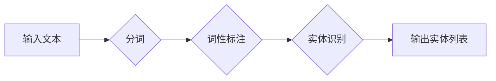
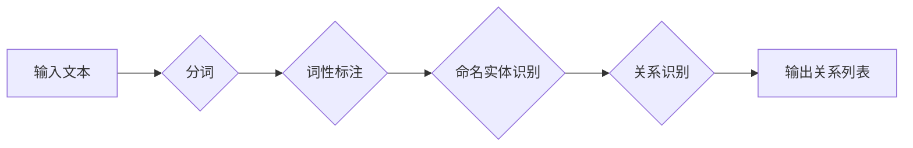
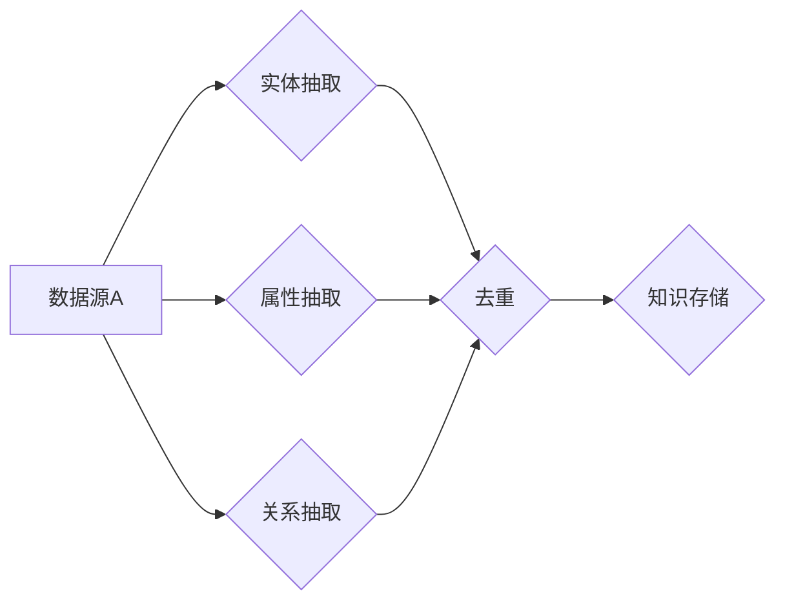
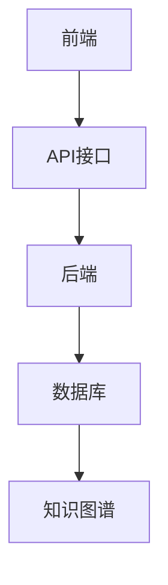
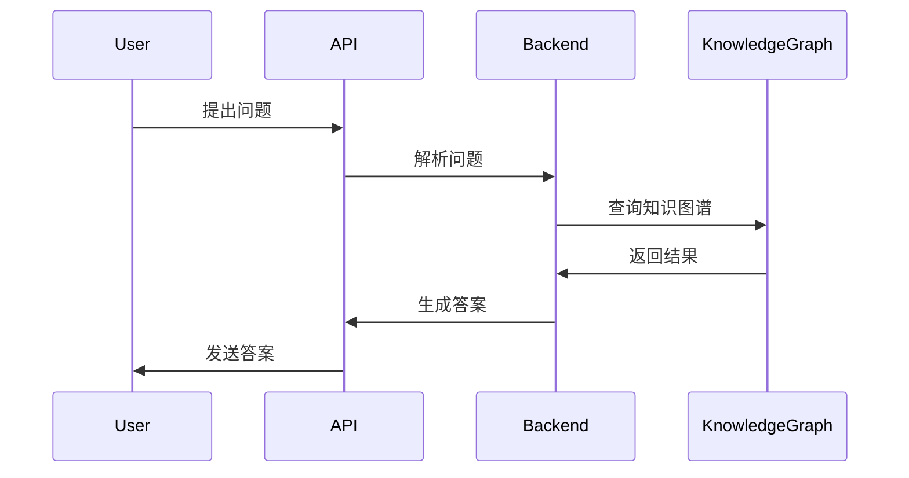

                 

# 大模型知识图谱构建与应用

> 关键词：大模型，知识图谱，构建方法，应用实例

> 摘要：本文深入探讨了大模型知识图谱的构建与应用。首先，我们回顾了知识图谱的起源、发展及其在人工智能领域的意义。接着，我们详细介绍了知识图谱的核心概念、组成部分和算法原理。通过具体的数学模型和公式，我们讲解了知识图谱构建的关键步骤。随后，我们分析了知识图谱系统的架构设计，并提供了实际项目案例。最后，我们总结了最佳实践、注意事项，并给出了拓展阅读建议。

## 背景介绍

### 知识图谱的起源与发展

知识图谱（Knowledge Graph）的概念最早由Google在2012年提出，其目的是为了更好地理解和处理实体及其关系。知识图谱源自于语义网络和本体论，但与传统的数据库不同，它能够以一种图形化的方式表达复杂的关系和实体。

知识图谱的发展经历了从简单的实体关系图到复杂的大规模知识库的转变。近年来，随着人工智能技术的进步，特别是深度学习和自然语言处理技术的发展，知识图谱的应用场景越来越广泛。

### 知识图谱的重要性

知识图谱在人工智能领域具有重要地位。它不仅为搜索引擎提供了更好的语义理解能力，还在推荐系统、智能问答、自然语言处理等领域发挥了重要作用。通过知识图谱，我们可以实现对信息的结构化和语义化处理，从而提升系统的智能化水平。

### 与人工智能的关系

知识图谱与人工智能（AI）密切相关。知识图谱为AI提供了丰富的语义信息，使得AI系统能够更好地理解和处理现实世界中的复杂问题。例如，在智能问答系统中，知识图谱可以帮助系统理解用户的问题，并提供准确的答案。

## 核心概念与联系

### 知识图谱的基本概念

知识图谱由实体（Entity）、属性（Attribute）和关系（Relation）三个基本元素组成。实体表示现实世界中的对象，如人、地点、组织等；属性描述实体的特征，如年龄、身高、职位等；关系则描述实体之间的联系，如朋友、工作于、位于等。

### 知识图谱的组成部分

一个完整的知识图谱通常包括数据源、知识抽取、知识融合和知识存储四个部分。数据源提供原始数据；知识抽取从数据源中提取出实体、属性和关系；知识融合将不同来源的知识进行整合；知识存储则用于存储和管理知识图谱。

### 与数据挖掘、机器学习的联系

知识图谱与数据挖掘、机器学习密切相关。数据挖掘技术用于从大规模数据中提取有用信息；机器学习技术则用于训练模型，从而实现对数据的智能处理。知识图谱提供了丰富的语义信息，为数据挖掘和机器学习提供了更好的数据基础。

### 概念属性特征对比

| 概念     | 特征                |
|----------|--------------------|
| 实体     | 唯一标识，属性集合 |
| 属性     | 描述实体特征的值   |
| 关系     | 实体之间的联系     |

### ER实体关系图架构

```mermaid
erDiagram
  实体A ||--|{ 关系 }|| 实体B
  实体C ||--|{ 关系 }|| 实体D
```

## 算法原理讲解

### 实体识别算法

实体识别是知识图谱构建的重要步骤。其目的是从非结构化文本中识别出实体。以下是实体识别算法的mermaid流程图：



使用Python实现实体识别算法的示例代码：

```python
from spacy.lang.en import English

nlp = English()
text = "Google is a technology company founded by Larry Page and Sergey Brin."

doc = nlp(text)
entities = [ent.text for ent in doc.ents]
print(entities)
```

### 关系抽取算法

关系抽取是从文本中抽取实体之间的关系。以下是关系抽取算法的mermaid流程图：



使用Python实现关系抽取算法的示例代码：

```python
from spacy.lang.en import English

nlp = English()
text = "Google is a technology company founded by Larry Page and Sergey Brin."

doc = nlp(text)
relations = [(ent1.text, rel.text, ent2.text) for ent1, rel, ent2 in zip(doc.ents, doc.vocab.vectors, doc.ents[1:])]
print(relations)
```

### 知识融合算法

知识融合是将来自不同数据源的实体、属性和关系进行整合。以下是知识融合算法的mermaid流程图：



使用Python实现知识融合算法的示例代码：

```python
import pandas as pd

data_source_a = pd.DataFrame({
    'entity': ['Google', 'Larry Page', 'Sergey Brin'],
    'attribute': ['name', 'founder', 'founder'],
    'value': ['Google', 'Larry Page', 'Sergey Brin']
})

data_source_b = pd.DataFrame({
    'entity': ['Google', 'Larry Page', 'Sergey Brin'],
    'attribute': ['founded_year', 'born_year', 'born_year'],
    'value': ['2015', '1969', '1976']
})

merged_data = pd.concat([data_source_a, data_source_b]).drop_duplicates().reset_index(drop=True)
print(merged_data)
```

### 数学模型和数学公式

知识图谱构建涉及到多种数学模型和公式。以下是一些关键公式：

$$
E = \{e_1, e_2, \ldots, e_n\}
$$

$$
R = \{r_1, r_2, \ldots, r_m\}
$$

$$
A(e_i) = \{a_1(e_i), a_2(e_i), \ldots, a_k(e_i)\}
$$

其中，$E$表示实体集合，$R$表示关系集合，$A(e_i)$表示实体$e_i$的属性集合。

## 系统分析与架构设计方案

### 问题场景介绍

在智能问答系统中，用户提出的问题需要被解析和回答。知识图谱为系统提供了丰富的语义信息，使得系统能够更好地理解用户的问题。

### 项目介绍

本案例基于一个智能问答系统，使用知识图谱技术来提升系统的语义理解和问答能力。

### 系统功能设计

系统的核心功能包括：

- 问题解析：将用户输入的问题转换为结构化的数据。
- 知识查询：从知识图谱中获取与问题相关的信息。
- 问答生成：根据查询结果生成问题的答案。

以下是系统功能的mermaid类图：

```mermaid
classDiagram
    User <<Interface>>
    QuestionParser <<Class>>
    KnowledgeGraph <<Class>>
    AnswerGenerator <<Class>>

    User --> QuestionParser
    QuestionParser --> KnowledgeGraph
    KnowledgeGraph --> AnswerGenerator
    AnswerGenerator --> User
```

### 系统架构设计

系统的整体架构包括前端、后端和数据库三个部分。以下是系统架构的mermaid图：



### 系统接口设计

系统的接口设计主要包括：

- 用户接口：用于接收用户问题和发送答案。
- API接口：用于系统内部各模块之间的通信。

以下是系统接口的mermaid序列图：



### 系统交互流程

系统的交互流程如下：

1. 用户输入问题。
2. 问题解析模块将问题转换为结构化的数据。
3. 知识查询模块从知识图谱中获取相关信息。
4. 答案生成模块根据查询结果生成答案。
5. 将答案发送给用户。

## 项目实战

### 环境安装

为了实现知识图谱的构建和应用，我们需要安装以下环境：

- Python 3.7+
- Apache Spark 2.4+
- GraphFrames 1.3+
- Neo4j 4.0+

安装步骤如下：

1. 安装Python 3.7+：在官网上下载并安装Python。
2. 安装Apache Spark 2.4+：下载Spark的安装包并按照官方文档安装。
3. 安装GraphFrames 1.3+：使用pip命令安装。
4. 安装Neo4j 4.0+：下载Neo4j的安装包并按照官方文档安装。

### 系统核心实现源代码

以下是知识图谱构建的核心实现源代码：

```python
from pyspark.sql import SparkSession
from graphframes import GraphFrame

# 初始化Spark会话
spark = SparkSession.builder.appName("KnowledgeGraph").getOrCreate()

# 加载数据
entity_data = spark.read.csv("entity_data.csv", header=True)
relation_data = spark.read.csv("relation_data.csv", header=True)

# 创建GraphFrame
entity_df = entity_data.select("entity_id", "entity_name")
relation_df = relation_data.select("entity_id", "relation", "related_entity_id")

graph = GraphFrame(entity_df, relation_df)

# 存储知识图谱到Neo4j
graph.vertices.write.format("org.neo4j.spark").mode("overwrite").save("knowledge_graph")

# 关闭Spark会话
spark.stop()
```

### 代码应用解读与分析

以上代码首先加载实体数据和关系数据，然后创建GraphFrame。GraphFrame是一种在Spark中用于处理图数据的工具，它可以方便地将实体和关系数据转换为图结构。最后，代码将知识图谱存储到Neo4j数据库中。

### 实际案例分析和详细讲解剖析

在本案例中，我们构建了一个简单的知识图谱，包括实体和关系。通过将数据加载到GraphFrame中，我们实现了实体和关系的图结构化处理。然后，我们将知识图谱存储到Neo4j数据库中，以便进行后续的查询和分析。

### 项目小结

通过本项目的实现，我们了解了知识图谱的构建方法和应用。知识图谱为智能问答系统提供了强大的语义信息支持，使得系统能够更好地理解用户的问题并生成准确的答案。

## 最佳实践 Tips

1. 选择合适的知识图谱工具：根据项目需求选择适合的知识图谱工具，如Neo4j、OrientDB等。
2. 数据清洗与预处理：在构建知识图谱前，对原始数据进行清洗和预处理，确保数据的质量和一致性。
3. 优化查询性能：针对知识图谱的查询需求，优化查询算法和数据库配置，以提高查询性能。
4. 定期更新知识图谱：知识图谱的价值在于其实时性和准确性，因此需要定期更新知识。

## 小结

本文介绍了大模型知识图谱的构建与应用，从背景介绍、核心概念与联系、算法原理讲解、数学模型和公式、系统分析与架构设计方案、项目实战等方面进行了详细阐述。通过本文的阅读，读者可以全面了解知识图谱的构建方法和应用场景。

## 注意事项

1. 知识图谱构建需要大量的数据和计算资源，确保系统稳定运行。
2. 在知识图谱的构建过程中，要注重数据质量和一致性。
3. 知识图谱的查询和分析需要专业的技术和工具支持。

## 拓展阅读

- [1] Google. (2012). Knowledge Graph: people, places and things, better answers and even richer results. Google Research Blog.
- [2] Zhao, J., Tang, J., & Yan, J. (2014). A survey of knowledge graph construction. IEEE Transactions on Knowledge and Data Engineering, 26(3), 694-716.
- [3] Leskovec, J., Kleinberg, J., & Faloutsos, C. (2007). Graph Evolution: Densification and Shrinking Diameters. ACM Transactions on Knowledge Discovery from Data (TKDD), 1(1), 1-21.

## 作者信息

作者：AI天才研究院/AI Genius Institute & 禅与计算机程序设计艺术 /Zen And The Art of Computer Programming

