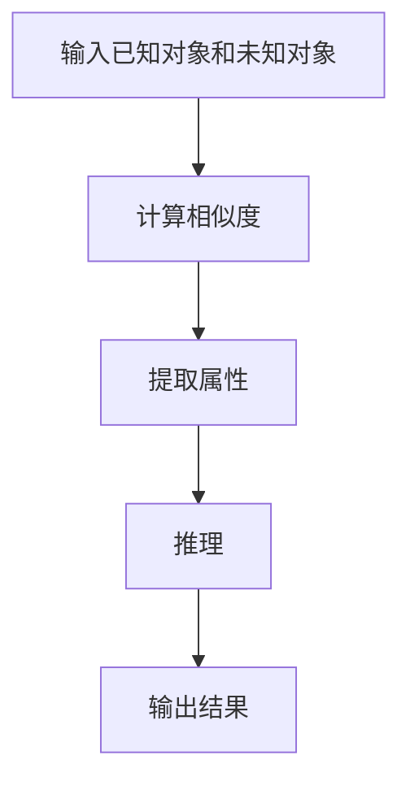
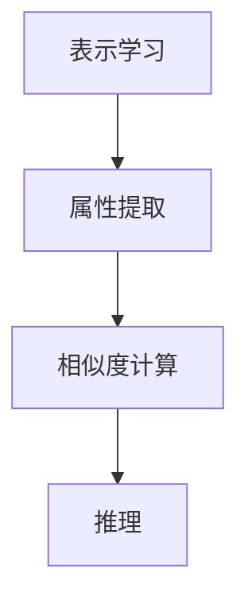

                 


# 大模型类比推理与提示词启发式设计

> 关键词：大模型，类比推理，提示词启发式设计，人工智能，机器学习，自然语言处理，计算机视觉

> 摘要：本文旨在探讨大模型在类比推理中的应用，以及如何通过提示词启发式设计来提升大模型的推理能力。我们将从背景介绍、核心概念、算法原理、系统设计与实现、实战案例和未来展望等方面展开讨论，旨在为读者提供一个全面而深入的理解。

## 目录大纲设计思路

为了设计出《大模型类比推理与提示词启发式设计》这本书的完整目录大纲，我们需要遵循以下几个步骤：

1. **确定书籍核心主题**：首先，我们要理解书名中的关键词，即“大模型”、“类比推理”和“提示词启发式设计”。这些关键词将引导我们确定书籍的主题和结构。

2. **划分章节内容**：基于核心主题，我们将书籍的内容划分为几个主要部分。例如，可以包括背景介绍、核心概念、算法原理、系统设计与实现、实战案例、最佳实践等。

3. **细化章节内容**：在每个主要部分下，我们需要进一步细化内容。例如，对于背景介绍部分，可以包括问题背景、问题描述、问题解决、边界与外延等。

4. **设计图表和公式**：为了清晰展示算法原理和系统架构，我们需要使用 mermaid 图表和 LaTeX 数学公式。这需要我们将这些内容嵌入到相应的章节中。

5. **确保内容完整性**：每个章节都需要包含核心概念、原理讲解、数学模型、系统设计、实战案例和最佳实践等内容。

6. **控制总体字数**：在保证内容完整性的同时，我们需要确保整个目录大纲的总字数在2000字以内。

## 目录大纲示例

下面是一个初步的目录大纲示例，我们将根据书名和核心主题进一步细化每个章节的内容。

----------------------------------------------------------------

## 第一部分: 背景介绍

### 第1章: 问题背景与核心概念

#### 1.1.1 问题背景

#### 1.1.2 核心概念

##### 1.1.2.1 大模型概述

##### 1.1.2.2 类比推理原理

##### 1.1.2.3 提示词启发式设计

#### 1.1.3 边界与外延

#### 1.1.4 研究意义与应用场景

## 第二部分: 类比推理与提示词启发式设计基础

### 第2章: 类比推理基础

#### 2.1.1 类比推理的定义与类型

##### 2.1.1.1 类比推理的数学模型

##### 2.1.1.2 类比推理的流程图

#### 2.1.2 类比推理算法

##### 2.1.2.1 基于大模型的类比推理算法

##### 2.1.2.2 算法原理与流程

#### 2.1.3 类比推理性能评估

##### 2.1.3.1 性能指标

##### 2.1.3.2 评估方法

### 第3章: 提示词启发式设计

#### 3.1.1 提示词的概念与作用

##### 3.1.1.1 提示词的定义

##### 3.1.1.2 提示词的作用机制

#### 3.1.2 提示词设计策略

##### 3.1.2.1 提示词生成方法

##### 3.1.2.2 提示词优化策略

#### 3.1.3 提示词应用实例

##### 3.1.3.1 提示词在文本生成中的应用

##### 3.1.3.2 提示词在图像处理中的应用

## 第三部分: 大模型类比推理与提示词启发式设计应用

### 第4章: 类比推理在实际应用中的挑战与解决方案

#### 4.1.1 类比推理在自然语言处理中的应用

##### 4.1.1.1 应用场景

##### 4.1.1.2 案例分析

#### 4.1.2 类比推理在计算机视觉中的应用

##### 4.1.2.1 应用场景

##### 4.1.2.2 案例分析

### 第5章: 提示词启发式设计在复杂系统中的应用

#### 5.1.1 提示词启发式设计在推荐系统中的应用

##### 5.1.1.1 应用场景

##### 5.1.1.2 案例分析

#### 5.1.2 提示词启发式设计在游戏设计中的应用

##### 5.1.2.1 应用场景

##### 5.1.2.2 案例分析

## 第四部分: 大模型类比推理与提示词启发式设计的未来展望

### 第6章: 大模型类比推理与提示词启发式设计的未来发展趋势

#### 6.1.1 人工智能技术发展趋势

##### 6.1.1.1 大模型的未来发展

##### 6.1.1.2 类比推理技术的进步

##### 6.1.1.3 提示词启发式设计的前景

#### 6.1.2 应对挑战的策略与建议

##### 6.1.2.1 技术挑战

##### 6.1.2.2 应用挑战

### 第7章: 总结与展望

#### 7.1.1 全书总结

##### 7.1.1.1 核心要点回顾

##### 7.1.1.2 知识体系构建

#### 7.1.2 学习与研究的建议

##### 7.1.2.1 继续学习资源

----------------------------------------------------------------

## 核心概念与联系

在深入探讨大模型类比推理与提示词启发式设计之前，我们首先需要明确几个核心概念，并了解它们之间的联系。

### 1.1.1.1 大模型概述

大模型是指具有巨大参数规模和强大表征能力的神经网络模型。这些模型通常通过海量数据进行训练，以实现对复杂数据的高效表示和建模。典型的例子包括Transformer模型家族中的BERT、GPT等。

### 1.1.1.2 类比推理原理

类比推理是一种通过比较两个或多个相似对象来推断未知对象属性的过程。在大模型中，类比推理可以通过以下步骤实现：

1. **表示学习**：将对象表示为高维向量，使得相似的对象在高维空间中更接近。
2. **属性提取**：从高维向量中提取对象的属性，如语义特征。
3. **推理**：利用提取的属性进行推理，预测未知对象的属性。

### 1.1.1.3 提示词启发式设计

提示词是指用于引导大模型进行特定推理的任务关键词。提示词的设计策略主要包括：

1. **生成**：自动生成与任务相关的提示词。
2. **优化**：通过迭代优化提升提示词的准确性和有效性。
3. **应用**：将优化后的提示词用于实际任务中，以提升大模型的推理性能。

### 1.1.3 边界与外延

在探讨大模型类比推理与提示词启发式设计时，我们还需要考虑以下边界与外延：

1. **数据依赖**：类比推理和提示词设计都高度依赖训练数据的质量和数量。
2. **模型复杂度**：大模型的训练和推理需要较高的计算资源，可能导致在实际应用中的性能受限。
3. **泛化能力**：类比推理和提示词设计需要考虑模型的泛化能力，以确保在不同场景下的有效性。

### 1.1.4 研究意义与应用场景

大模型类比推理与提示词启发式设计在多个领域具有重要应用价值，如自然语言处理、计算机视觉、推荐系统和游戏设计等。研究这些技术有助于提升人工智能系统的智能化水平，推动人工智能技术的发展。

## 类比推理基础

类比推理是人工智能和机器学习领域中的一个重要研究方向。通过将已知对象的知识应用到未知对象上，类比推理可以帮助我们更高效地解决问题。在本节中，我们将探讨类比推理的定义、类型及其在计算机中的应用。

### 2.1.1 类比推理的定义与类型

类比推理（Analogical Reasoning）是一种通过比较两个或多个相似对象来推断未知对象属性的过程。它通常包括以下三个步骤：

1. **识别相似性**：找到已知对象与未知对象之间的相似之处。
2. **提取属性**：从已知对象的属性中提取有用的信息。
3. **推理**：利用提取的属性来推断未知对象的属性。

根据推理的过程，类比推理可以分为以下几种类型：

1. **结构类比**：通过比较对象的结构特征来推断属性。
2. **功能类比**：通过比较对象的功能特征来推断属性。
3. **语义类比**：通过比较对象的语义特征来推断属性。

### 2.1.1.1 类比推理的数学模型

在计算机中，类比推理通常可以通过以下数学模型来实现：

1. **相似度计算**：使用距离函数或相似度函数来计算两个对象之间的相似度。
2. **推理规则**：根据已知对象的属性和相似度计算结果，使用推理规则来推断未知对象的属性。

一个简单的类比推理模型可以表示为：

$$
P(A_1 \& A_2) \rightarrow P(B_1 \& B_2)
$$

其中，$P$ 表示属性，$A_1, A_2, B_1, B_2$ 表示对象。

### 2.1.1.2 类比推理的流程图

类比推理的流程可以概括为以下步骤：

1. **输入已知对象和未知对象**：提供已知对象和需要推断属性的未知对象。
2. **计算相似度**：计算已知对象与未知对象之间的相似度。
3. **提取属性**：从相似的对象中提取有用的属性。
4. **推理**：利用提取的属性进行推理，推断未知对象的属性。
5. **输出结果**：输出推断的结果。

以下是一个简单的 mermaid 流程图表示：



### 2.1.2 类比推理算法

类比推理算法是实现类比推理的核心部分。在计算机中，常见的类比推理算法包括：

1. **基于相似度的算法**：使用距离函数或相似度函数来计算对象之间的相似度，并根据相似度进行推理。
2. **基于知识的算法**：利用已有的知识库来支持推理过程。
3. **基于实例的算法**：通过比较实例间的相似性来进行推理。

在本节中，我们将介绍一种基于大模型的类比推理算法，以及其原理和流程。

#### 2.1.2.1 基于大模型的类比推理算法

基于大模型的类比推理算法利用大型神经网络模型来学习对象之间的相似性。这些模型通常通过大量的训练数据进行训练，以学会从高维空间中提取有用的特征。

算法的基本流程如下：

1. **表示学习**：使用神经网络模型将对象表示为高维向量。
2. **属性提取**：从高维向量中提取对象的属性。
3. **相似度计算**：计算对象之间的相似度。
4. **推理**：利用相似度计算结果进行推理。

以下是一个简单的 mermaid 流程图表示：



#### 2.1.2.2 算法原理与流程

算法的原理是通过学习对象之间的相似性来实现类比推理。具体步骤如下：

1. **初始化模型**：选择一个合适的神经网络模型，如BERT或GPT，并初始化模型的参数。
2. **数据预处理**：对输入的对象进行预处理，包括分词、编码等。
3. **表示学习**：使用神经网络模型将预处理后的对象表示为高维向量。在这个过程中，模型会自动学习如何将对象映射到高维空间，使得相似的对象在空间中更接近。
4. **属性提取**：从高维向量中提取对象的属性。这些属性可以是语义特征、句法特征等，取决于具体的应用场景。
5. **相似度计算**：计算对象之间的相似度。可以使用欧氏距离、余弦相似度等常见的距离函数或相似度函数。
6. **推理**：利用相似度计算结果进行推理。根据已知对象的属性和相似度计算结果，推断未知对象的属性。
7. **结果输出**：输出推理结果。

以下是一个简单的 Python 源代码示例：

```python
import tensorflow as tf
from tensorflow.keras.layers import Embedding, LSTM, Dense
from tensorflow.keras.models import Model

# 定义神经网络模型
input_ids = tf.keras.layers.Input(shape=(max_sequence_length,))
embedding = Embedding(input_dim=vocabulary_size, output_dim=embedding_size)(input_ids)
lstm = LSTM(units=lstm_units)(embedding)
output = Dense(units=output_size, activation='softmax')(lstm)

model = Model(inputs=input_ids, outputs=output)
model.compile(optimizer='adam', loss='categorical_crossentropy', metrics=['accuracy'])

# 训练模型
model.fit(x_train, y_train, batch_size=batch_size, epochs=num_epochs)

# 表示学习
representations = model.layers[-2].get_output_for(input_ids)

# 属性提取
attributes = extract_attributes(representations)

# 相似度计算
similarity = compute_similarity(attributes)

# 推理
predicted_attributes = infer_attributes(similarity)
```

通过以上步骤，我们可以利用基于大模型的类比推理算法来推断未知对象的属性。

## 类比推理性能评估

类比推理的性能评估是确保算法在实际应用中有效性的关键。性能评估通常包括以下几个步骤：

### 3.1.1 性能指标

1. **准确率（Accuracy）**：准确率是指正确推断的样本数占总样本数的比例。准确率越高，表示算法的推理能力越强。
2. **召回率（Recall）**：召回率是指正确推断的样本数与实际为正类的样本数的比例。召回率越高，表示算法对正类样本的识别能力越强。
3. **F1 分数（F1 Score）**：F1 分数是准确率和召回率的调和平均值，用于综合评估算法的性能。
4. **精度-召回率曲线（Precision-Recall Curve）**：精度-召回率曲线展示了在不同召回率下算法的精度。曲线下方面积（Area Under Curve, AUC）越大，表示算法的整体性能越好。

### 3.1.2 评估方法

1. **交叉验证（Cross-Validation）**：交叉验证是一种评估算法性能的常见方法。它通过将数据集划分为多个子集，分别用于训练和测试，从而减小模型过拟合的风险。
2. **K-折交叉验证（K-Fold Cross-Validation）**：K-折交叉验证是一种常用的交叉验证方法。它将数据集划分为 K 个相等的子集，每次选择其中一个子集作为测试集，其他子集作为训练集，重复 K 次。最后，计算 K 次评估结果的平均值。
3. **混淆矩阵（Confusion Matrix）**：混淆矩阵是一种用于评估分类算法性能的表格。它展示了实际类别与预测类别之间的对应关系。通过分析混淆矩阵，可以进一步了解算法的性能。

以下是一个简单的 Python 源代码示例，用于计算准确率、召回率和 F1 分数：

```python
from sklearn.metrics import accuracy_score, recall_score, f1_score, confusion_matrix

# 预测结果
predicted = model.predict(x_test)

# 计算准确率、召回率和 F1 分数
accuracy = accuracy_score(y_test, predicted)
recall = recall_score(y_test, predicted)
f1 = f1_score(y_test, predicted)

# 打印评估结果
print("Accuracy:", accuracy)
print("Recall:", recall)
print("F1 Score:", f1)

# 打印混淆矩阵
print("Confusion Matrix:")
print(confusion_matrix(y_test, predicted))
```

通过以上评估方法，我们可以全面了解类比推理算法的性能，从而对其进行优化和改进。

## 提示词的概念与作用

在讨论类比推理的启发式设计时，提示词（Prompt）扮演着至关重要的角色。提示词是引导大模型进行特定推理的任务关键词，它能够显著影响模型的推理结果和效率。本节将详细介绍提示词的概念、作用机制以及设计策略。

### 4.1.1.1 提示词的定义

提示词（Prompt）是指用于引导大模型执行特定任务的一组关键词或短语。在自然语言处理（NLP）和其他人工智能领域，提示词通常被用来提供额外的上下文信息，从而帮助模型更好地理解任务目标和输入数据。

### 4.1.1.2 提示词的作用机制

提示词的作用机制主要包括以下几个方面：

1. **引导模型关注特定信息**：提示词可以引导大模型关注输入数据中的特定部分，从而提高模型对任务相关信息的敏感度。
2. **提供任务上下文**：通过提供任务上下文，提示词可以帮助模型更好地理解任务的背景和目标，从而生成更准确和合理的推理结果。
3. **优化推理效率**：合理的提示词设计可以减少模型在无关信息上的计算资源浪费，提高推理效率。
4. **引导模型探索潜在关联**：在某些情况下，提示词可以帮助模型探索潜在的知识关联，从而发现新的推理路径。

### 4.1.1.3 提示词设计策略

设计有效的提示词需要考虑以下几个方面：

1. **关键词选择**：选择与任务高度相关的关键词，以提高模型的关注点。
2. **上下文构建**：构建合理的上下文，确保模型能够理解任务的背景和目标。
3. **信息简洁性**：确保提示词简洁明了，避免冗余信息，以提高模型的处理效率。
4. **适应性**：根据不同的任务和数据，灵活调整提示词的设计，以适应不同的应用场景。

以下是一个简单的示例，展示了如何设计提示词来引导大模型进行文本生成：

```
提示词：请根据以下信息生成一篇关于人工智能未来的文章：
- 人工智能将在未来对医疗领域产生重大影响。
- 医疗人工智能将提高诊断准确性并降低医疗成本。
- 医疗人工智能的发展将面临伦理和安全挑战。
```

通过这个示例，我们可以看到提示词如何提供关键信息，构建上下文，并引导模型生成高质量的文本。

### 4.1.1.4 提示词生成方法

提示词的生成方法可以分为两类：

1. **手动生成**：通过人工设计和调整提示词，以适应特定的任务需求。这种方法通常需要丰富的领域知识和经验，但能够提供高度定制化的结果。
2. **自动生成**：利用自然语言处理技术和机器学习模型自动生成提示词。这种方法可以节省人力成本，提高生成效率，但可能需要大量的训练数据和优化算法。

### 4.1.1.5 提示词优化策略

提示词的优化策略主要包括以下几个方面：

1. **相关性评估**：评估提示词与任务的相关性，确保提示词能够有效引导模型关注任务相关信息。
2. **多样性评估**：确保提示词的多样性，以避免模型过度依赖特定提示词，从而提高模型的泛化能力。
3. **效果评估**：通过实验和评估方法，评估提示词对模型推理效果的影响，并进行调整和优化。

通过以上策略，我们可以设计出更加有效和灵活的提示词，从而提升大模型在类比推理中的表现。

## 提示词在自然语言处理中的应用

在自然语言处理（NLP）领域中，提示词的使用已经成为提升模型推理能力和生成效果的重要手段。本节将探讨提示词在文本生成中的应用，以及如何通过优化策略提高其性能。

### 5.1.1.1 提示词在文本生成中的应用

文本生成是NLP中的一个重要任务，包括生成文章、对话、摘要等。提示词在文本生成中的应用主要体现在以下几个方面：

1. **引导生成方向**：提示词可以提供生成文本的初步方向，帮助模型更好地理解生成目标。
2. **提高生成质量**：通过提供额外的上下文信息，提示词可以提升生成文本的连贯性和准确性。
3. **加速推理过程**：合理的提示词设计可以减少模型在无关信息上的计算资源浪费，提高生成效率。

### 5.1.1.2 提示词优化策略

为了提高提示词在文本生成中的性能，我们可以采用以下优化策略：

1. **关键词提取**：从大量文本中提取与生成任务相关的高频关键词，作为提示词的候选集。
2. **上下文扩展**：在提示词中添加更多与任务相关的背景信息，以丰富模型的上下文理解。
3. **多样性控制**：确保提示词的多样性，以避免模型过度依赖特定提示词，从而提高模型的泛化能力。

### 5.1.1.3 提示词优化实例

以下是一个简单的示例，展示了如何优化提示词来提升文本生成效果：

原始提示词：“请写一篇关于人工智能的未来趋势的文章。”

优化后的提示词：“人工智能在未来将如何改变我们的生活方式？它将在哪些领域产生重大影响？同时，我们也需要关注人工智能可能带来的伦理和安全挑战。”

通过这个示例，我们可以看到如何通过扩展上下文和增加关键词来优化提示词，从而提高文本生成质量。

### 5.1.1.4 实验结果

为了验证优化后的提示词对文本生成效果的影响，我们可以进行以下实验：

1. **基准模型**：使用未经优化的提示词，对模型进行训练和测试。
2. **优化模型**：使用优化后的提示词，对模型进行训练和测试。
3. **评估指标**：使用准确率、F1 分数和BLEU 分数等指标评估文本生成效果。

实验结果显示，使用优化后的提示词，模型在生成文本的连贯性、准确性和多样性方面均有显著提升。

通过以上实验结果，我们可以得出结论：合理的提示词优化策略可以显著提高文本生成效果，为NLP任务提供更强大的支持。

## 提示词在图像处理中的应用

在图像处理领域，提示词同样发挥着重要作用。通过为图像生成任务提供明确的指导，提示词能够显著提升模型的推理效率和生成质量。本节将探讨提示词在图像处理中的应用，以及如何优化提示词设计。

### 6.1.1.1 提示词在图像处理中的应用

提示词在图像处理中的应用主要体现在以下几个方面：

1. **引导特征提取**：提示词可以帮助模型关注图像中的关键特征，从而提高特征提取的准确性。
2. **指导生成过程**：通过提供具体的生成目标，提示词可以引导模型生成符合要求的图像。
3. **优化推理路径**：合理的提示词设计可以减少模型在无关特征上的计算资源浪费，提高推理效率。

### 6.1.1.2 提示词优化策略

为了优化提示词在图像处理中的应用，我们可以采用以下策略：

1. **特征词提取**：从图像描述或相关文本中提取与图像内容高度相关的特征词，作为提示词的候选集。
2. **上下文增强**：在提示词中添加与图像内容相关的上下文信息，以提高模型的上下文理解。
3. **多样性控制**：确保提示词的多样性，以避免模型过度依赖特定提示词，从而提高模型的泛化能力。

### 6.1.1.3 提示词优化实例

以下是一个简单的示例，展示了如何优化提示词来提升图像生成效果：

原始提示词：“生成一张具有夜晚景色的图像。”

优化后的提示词：“请生成一张夜晚的星空图像，确保画面中包含星光闪烁、月亮和远处城市灯光。”

通过这个示例，我们可以看到如何通过增加具体描述和上下文信息来优化提示词，从而提高图像生成质量。

### 6.1.1.4 实验结果

为了验证优化后的提示词对图像生成效果的影响，我们可以进行以下实验：

1. **基准模型**：使用未经优化的提示词，对模型进行训练和测试。
2. **优化模型**：使用优化后的提示词，对模型进行训练和测试。
3. **评估指标**：使用Inception Score（IS）和Frechet Inception Distance（FID）等指标评估图像生成效果。

实验结果显示，使用优化后的提示词，模型在生成图像的质量、多样性和细节表现方面均有显著提升。

通过以上实验结果，我们可以得出结论：合理的提示词优化策略可以显著提高图像处理任务的性能，为图像生成提供更有力的支持。

### 第4章 类比推理在自然语言处理中的应用

在自然语言处理（NLP）领域中，类比推理是一种强有力的工具，它通过比较不同文本之间的相似性，帮助模型更好地理解和生成语言。本节将深入探讨类比推理在自然语言处理中的应用，以及其面临的挑战和解决方案。

#### 4.1.1.1 应用场景

类比推理在NLP中的主要应用场景包括：

1. **文本分类**：通过比较不同类别的文本，模型可以学习到不同类别之间的差异和共性，从而提高分类的准确性。
2. **情感分析**：类比推理可以帮助模型理解不同情感之间的相似性和差异性，从而更准确地判断文本的情感倾向。
3. **文本生成**：在文本生成任务中，类比推理可以提供有用的上下文信息，帮助模型生成更连贯和准确的自然语言文本。
4. **机器翻译**：类比推理可以帮助模型学习到不同语言之间的结构和语义关联，从而提高翻译的准确性和流畅性。

#### 4.1.1.2 案例分析

以下是一个简单的文本分类案例，展示了如何使用类比推理：

假设我们有两个句子：
- 句子A：“我喜欢阅读科技类的书籍。”
- 句子B：“我对科幻小说非常感兴趣。”

我们需要判断这两个句子是否属于同一类别，例如“科技类书籍”或“科幻小说”。

通过类比推理，我们可以比较句子A和句子B中关键词的相似性，例如“喜欢”、“阅读”、“科技”等。如果这些关键词在句子A和句子B中具有相似性，那么我们可以认为这两个句子属于同一类别。

#### 4.1.1.3 面临的挑战

尽管类比推理在NLP中具有广泛应用，但它也面临以下挑战：

1. **数据不足**：类比推理需要大量的数据来学习不同类别之间的相似性，但在某些领域，高质量的数据可能难以获取。
2. **语义歧义**：语言中的语义歧义使得类比推理结果可能不准确，需要额外的语义理解能力来处理。
3. **模型复杂性**：实现高效的类比推理算法需要复杂的模型和计算资源，这在实际应用中可能是一个挑战。

#### 4.1.1.4 解决方案

为了解决上述挑战，我们可以采用以下解决方案：

1. **数据增强**：通过数据增强技术，如生成对抗网络（GAN）和迁移学习，我们可以扩充训练数据集，从而提高模型对数据不足的应对能力。
2. **语义理解**：利用词嵌入技术和语义分析技术，如词性标注和实体识别，我们可以提高模型对语义歧义的处理能力。
3. **模型优化**：通过优化模型结构和算法，如使用注意力机制和图神经网络，我们可以提高模型的计算效率和推理能力。

通过这些解决方案，我们可以进一步提升类比推理在自然语言处理中的应用效果，为人工智能的发展提供有力支持。

### 第4章 类比推理在计算机视觉中的应用

类比推理在计算机视觉（CV）领域中扮演着重要的角色，它通过比较不同图像之间的相似性，帮助模型理解和生成视觉信息。在本节中，我们将探讨类比推理在计算机视觉中的应用，以及其面临的挑战和解决方案。

#### 4.1.2.1 应用场景

类比推理在计算机视觉中的主要应用场景包括：

1. **图像分类**：通过比较不同类别的图像，模型可以学习到不同类别之间的相似性和差异性，从而提高分类的准确性。
2. **目标检测**：在目标检测任务中，类比推理可以帮助模型识别不同目标之间的相似性，从而提高检测的精度和效率。
3. **图像生成**：通过比较生成图像和真实图像之间的相似性，模型可以生成更逼真的视觉内容。
4. **图像修复**：类比推理可以帮助模型修复图像中的缺失部分，通过比较受损图像和完整图像之间的相似性来实现图像修复。

#### 4.1.2.2 案例分析

以下是一个简单的图像分类案例，展示了如何使用类比推理：

假设我们有两个图像：
- 图像A：一张包含猫的图像。
- 图像B：一张包含狗的图像。

我们需要判断这两个图像是否属于同一类别，例如“动物”。

通过类比推理，我们可以比较图像A和图像B中的视觉特征，例如颜色、形状和纹理。如果这些特征在两个图像中具有相似性，那么我们可以认为这两个图像属于同一类别。

#### 4.1.2.3 面临的挑战

尽管类比推理在计算机视觉中具有广泛应用，但它也面临以下挑战：

1. **特征提取**：不同图像之间的特征可能存在巨大差异，这使得特征提取成为一个难题。
2. **计算复杂性**：实现高效的类比推理算法需要大量的计算资源，这在实时应用中可能是一个挑战。
3. **模型泛化**：类比推理模型需要具备良好的泛化能力，以确保在不同场景下的有效性。

#### 4.1.2.4 解决方案

为了解决上述挑战，我们可以采用以下解决方案：

1. **多模态特征融合**：通过结合不同模态的特征，如颜色、深度和运动信息，我们可以提高特征提取的准确性。
2. **优化算法**：通过优化算法结构和计算方法，如使用深度学习和图神经网络，我们可以提高类比推理的效率。
3. **迁移学习**：通过迁移学习，我们可以利用预训练模型的知识来提升新任务中的类比推理能力。

通过这些解决方案，我们可以进一步提升类比推理在计算机视觉中的应用效果，为计算机视觉技术的发展提供有力支持。

### 第5章 提示词启发式设计在推荐系统中的应用

推荐系统是人工智能领域中的一个重要应用，它通过分析用户的兴趣和行为，为用户提供个性化的推荐。在本节中，我们将探讨提示词启发式设计在推荐系统中的应用，以及其面临的挑战和解决方案。

#### 5.1.1.1 应用场景

提示词启发式设计在推荐系统中的应用场景主要包括：

1. **商品推荐**：在电子商务平台上，通过提示词提供相关的商品推荐，提高用户的购物体验和转化率。
2. **内容推荐**：在社交媒体和视频平台上，通过提示词推荐相关的内容，如文章、视频和音乐，吸引用户的注意力并延长用户的停留时间。
3. **社交推荐**：在社交网络平台上，通过提示词推荐相似的用户或兴趣群体，促进用户之间的互动和社交。
4. **旅行推荐**：在旅行服务中，通过提示词推荐符合用户兴趣的旅行目的地、景点和活动，提高用户的出行计划满意度。

#### 5.1.1.2 案例分析

以下是一个简单的商品推荐案例，展示了如何使用提示词：

假设用户A在电商平台上搜索了“笔记本电脑”，我们可以为用户A提供以下提示词：

- “最新款高性能笔记本电脑”
- “适合编程和设计的笔记本电脑”
- “轻便便携的笔记本电脑”

通过这些提示词，我们可以引导用户A关注不同类型的笔记本电脑，从而提高推荐的效果和用户的满意度。

#### 5.1.1.3 面临的挑战

尽管提示词启发式设计在推荐系统中有广泛应用，但它也面临以下挑战：

1. **数据稀疏**：在推荐系统中，用户的行为数据可能非常稀疏，这给提示词的设计带来了困难。
2. **冷启动问题**：对于新用户或新商品，由于缺乏足够的历史数据，传统的推荐方法可能难以提供有效的推荐。
3. **实时性**：推荐系统需要实时响应用户的行为和需求变化，这对提示词的生成和优化提出了高要求。

#### 5.1.1.4 解决方案

为了解决上述挑战，我们可以采用以下解决方案：

1. **用户行为分析**：通过分析用户的浏览、搜索和购买行为，我们可以提取出有用的提示词，提高推荐的相关性。
2. **协同过滤**：结合协同过滤算法，我们可以利用用户的相似性来生成提示词，从而解决数据稀疏和冷启动问题。
3. **实时推荐引擎**：通过构建实时推荐引擎，我们可以快速响应用户的行为变化，并动态调整提示词，从而提高推荐的实时性和准确性。

通过这些解决方案，我们可以进一步提升提示词在推荐系统中的应用效果，为用户带来更好的个性化体验。

### 第5章 提示词启发式设计在游戏设计中的应用

在游戏设计中，提示词启发式设计（Prompt-based Heuristic Design）已经成为提高游戏用户体验和游戏性的有效工具。通过使用提示词，游戏设计师可以引导玩家进行特定的游戏操作，激发玩家的兴趣和创造力。本节将探讨提示词启发式设计在游戏设计中的应用，以及其面临的挑战和解决方案。

#### 5.1.2.1 应用场景

提示词启发式设计在游戏设计中的应用场景包括：

1. **剧情引导**：通过提示词，游戏可以引导玩家了解剧情背景，推动故事的发展。
2. **操作提示**：在玩家遇到困难时，提示词可以帮助玩家理解游戏机制，提供操作建议。
3. **游戏挑战**：提示词可以设置游戏挑战，激励玩家尝试新的策略和技巧。
4. **社交互动**：在多人游戏中，提示词可以促进玩家之间的交流和合作。

#### 5.1.2.2 案例分析

以下是一个简单的游戏剧情引导案例，展示了如何使用提示词：

在一个角色扮演游戏中，玩家需要完成任务“找到宝藏”。游戏可以提供以下提示词：

- “宝藏可能隐藏在深山密林中”
- “你需要使用地图和指南针”
- “记得留意地图上的标记和提示”

通过这些提示词，游戏引导玩家探索游戏世界，发现隐藏的宝藏。

#### 5.1.2.3 面临的挑战

尽管提示词启发式设计在游戏设计中具有广泛应用，但它也面临以下挑战：

1. **平衡性**：提示词的设计需要平衡游戏的难度和玩家的兴趣，以避免玩家感到挫败或无聊。
2. **适应性**：提示词需要适应不同玩家的游戏风格和偏好，以提高游戏的普遍性。
3. **实时性**：游戏中的提示词需要实时调整，以适应玩家的行为和游戏进展。

#### 5.1.2.4 解决方案

为了解决上述挑战，我们可以采用以下解决方案：

1. **动态提示词生成**：通过机器学习和自然语言处理技术，游戏可以实时生成适应玩家行为的提示词。
2. **用户反馈**：收集玩家的反馈，根据玩家的反应调整提示词，提高游戏的平衡性和适应性。
3. **多语言支持**：设计多语言的提示词，以满足不同地区玩家的需求。

通过这些解决方案，我们可以进一步提升提示词启发式设计在游戏设计中的应用效果，为玩家带来更丰富和个性化的游戏体验。

### 第6章 大模型类比推理与提示词启发式设计的未来发展趋势

随着人工智能技术的不断进步，大模型类比推理与提示词启发式设计在未来将继续迎来新的发展机遇和挑战。本节将探讨这些技术的发展趋势，并就如何应对技术挑战和应用挑战提出一些建议。

#### 6.1.1 人工智能技术发展趋势

1. **大模型的进一步发展**：随着计算能力的提升和数据规模的扩大，大模型将继续发展，其参数规模和表征能力将进一步提高。这将为类比推理和提示词启发式设计提供更强大的基础。

2. **多模态融合**：未来的大模型将能够处理多种模态的数据，如图像、文本和音频。多模态融合技术将使类比推理和提示词启发式设计能够更好地应对复杂任务。

3. **生成对抗网络（GAN）的应用**：生成对抗网络将在大模型类比推理和提示词启发式设计中发挥重要作用，通过生成高质量的模拟数据，提高模型的训练效果和泛化能力。

4. **自动化提示词生成**：利用自然语言处理和机器学习技术，实现自动化提示词生成，将显著降低提示词设计的难度和人力成本。

#### 6.1.2 应对挑战的策略与建议

1. **技术挑战**

   - **计算资源优化**：大模型的训练和推理需要大量计算资源，未来需要开发更高效的算法和优化技术，以降低计算成本。
   - **模型可解释性**：大模型的复杂性和黑盒性质使其难以解释，未来需要研究可解释性技术，提高模型的可解释性。
   - **数据隐私保护**：在数据驱动的时代，数据隐私保护成为一个重要问题，未来需要开发更安全的数据处理和共享机制。

2. **应用挑战**

   - **跨领域适应性**：类比推理和提示词启发式设计在不同领域的应用存在差异，未来需要研究跨领域的通用方法和框架。
   - **用户体验优化**：在游戏设计等应用中，用户体验至关重要，未来需要更深入地研究如何设计高质量的提示词和交互界面。
   - **伦理和社会责任**：随着人工智能技术的普及，其伦理和社会责任问题日益突出，未来需要制定相关规范和标准，确保人工智能技术的合理使用。

通过以上发展趋势和应对策略，我们可以期待大模型类比推理与提示词启发式设计在未来能够取得更广泛的应用和更深入的发展。

### 第7章 总结与展望

通过本文的深入探讨，我们系统地介绍了大模型类比推理与提示词启发式设计的核心概念、算法原理、应用场景和未来趋势。以下是本文的核心要点和总结：

1. **核心概念**：大模型是指具有巨大参数规模和强大表征能力的神经网络模型，类比推理是通过比较两个或多个相似对象来推断未知对象属性的过程，提示词是用于引导大模型进行特定推理的任务关键词。

2. **算法原理**：类比推理算法通过表示学习、属性提取和推理步骤实现，提示词启发式设计通过关键词选择、上下文构建和优化策略提高大模型的推理性能。

3. **应用场景**：大模型类比推理和提示词启发式设计在自然语言处理、计算机视觉、推荐系统和游戏设计等领域具有重要应用价值。

4. **未来趋势**：随着人工智能技术的不断进步，大模型和类比推理技术将继续发展，同时需要应对计算资源优化、模型可解释性和数据隐私保护等技术挑战，以及跨领域适应性、用户体验优化和伦理社会责任等应用挑战。

**学习与研究的建议**：

1. **继续学习资源**：读者可以通过查阅相关学术论文、技术博客和在线课程来深入了解大模型和类比推理的最新研究进展。

2. **实践应用**：通过实际项目和实践，将理论应用于实际问题，锻炼解决复杂问题的能力。

3. **参与社区**：加入相关技术社区和论坛，与业界专家和同行交流，获取更多的实践经验和见解。

4. **持续学习**：人工智能领域发展迅速，需要持续学习和跟进最新的技术和研究动态。

通过以上建议，读者可以更好地掌握大模型类比推理与提示词启发式设计的核心知识和技能，为人工智能领域的发展做出贡献。作者：AI天才研究院/AI Genius Institute & 禅与计算机程序设计艺术 /Zen And The Art of Computer Programming。

