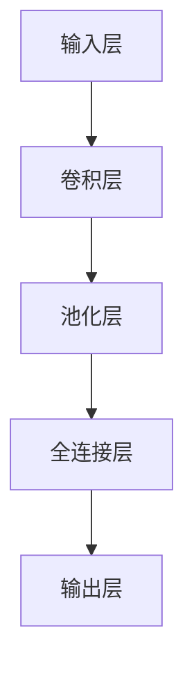
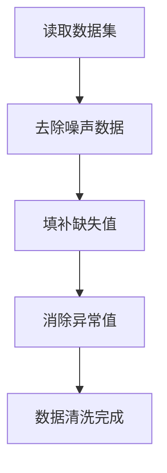
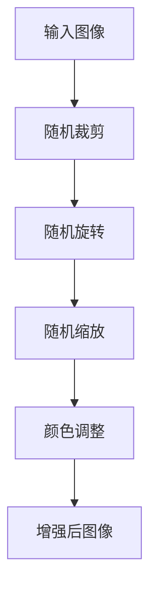
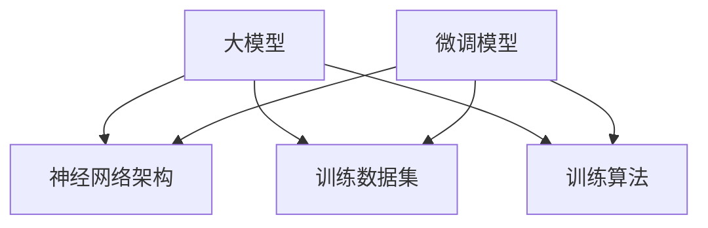
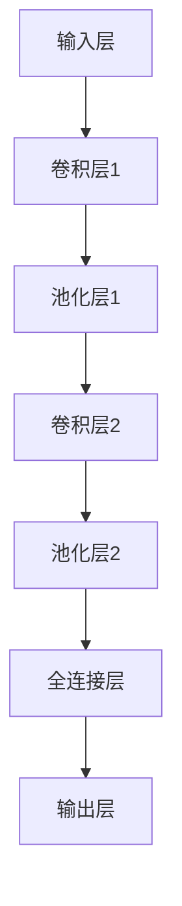
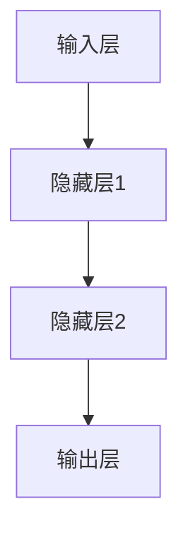
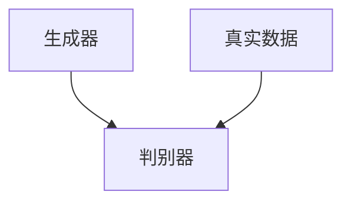
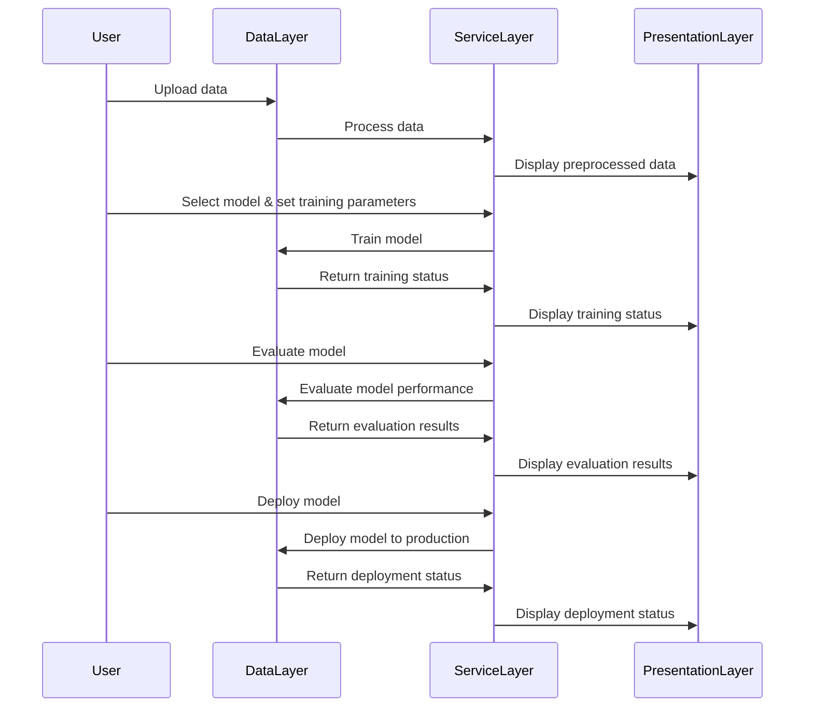

                 


### 《大模型训练与微调的技术挑战》

# 第一部分：背景介绍与核心概念

## 1.1 问题背景

随着人工智能技术的飞速发展，大模型（Large-scale Models）在自然语言处理、计算机视觉、推荐系统等领域取得了显著成就。然而，大模型的训练与微调过程面临诸多技术挑战，如计算资源需求、数据集准备、模型优化等。本书旨在探讨这些挑战，并提供相应的解决方案。

### 1.2 核心概念

#### 1.2.1 大模型

大模型是指具有数亿到数十亿参数的深度学习模型，其规模远超传统机器学习模型。大模型在数据处理和特征提取方面具有显著优势，但训练和微调过程也更为复杂。

#### 1.2.2 训练与微调

训练（Training）是指通过大量数据对模型进行调整，使其在特定任务上达到较高准确率。微调（Fine-tuning）是在预训练模型的基础上，利用少量数据进行进一步调整，以适应特定任务。

### 1.3 概念结构与核心要素组成

#### 1.3.1 大模型的核心要素

- 参数规模
- 神经网络架构
- 训练数据集
- 训练算法

#### 1.3.2 训练与微调的核心流程

- 数据预处理
- 训练过程
- 微调过程
- 模型评估与优化

### 1.4 边界与外延

大模型训练与微调的技术挑战不仅涉及算法和计算资源，还包括数据管理、模型部署等方面。本书将讨论这些挑战，并介绍相关解决方案。

---

**小结：** 本部分背景介绍与核心概念部分，我们首先分析了大模型训练与微调的技术挑战背景，接着介绍了大模型和训练与微调的核心概念，最后讨论了大模型的核心要素和训练与微调的核心流程，以及大模型训练与微调的技术挑战的边界与外延。这一部分为后续的详细探讨奠定了基础。

# 第二部分：核心概念与联系

## 2.1 大模型原理

### 2.1.1 神经网络架构

大模型的核心在于其庞大的参数规模和复杂的神经网络架构。常见的神经网络架构包括卷积神经网络（CNN）、循环神经网络（RNN）和生成对抗网络（GAN）。

#### CNN算法流程



CNN主要通过卷积操作提取图像的特征，池化层对特征进行降维处理，全连接层将特征映射到输出结果。

#### CNN原理

卷积层通过卷积操作提取图像的特征，池化层对特征进行降维处理，全连接层将特征映射到输出结果。

#### CNN数学模型

$$
\text{卷积操作：} \quad f(x) = \sum_{i=1}^{k} w_i * x_i
$$

其中，$f(x)$为卷积操作结果，$w_i$为卷积核，$x_i$为输入特征。

### 2.1.2 训练算法

训练算法主要包括梯度下降算法、梯度提升算法和动量优化。以下以梯度下降算法为例，介绍其原理。

#### 梯度下降算法

梯度下降算法通过迭代更新模型参数，以最小化损失函数。

```python
def gradient_descent(x, y, learning_rate, epochs):
    for epoch in range(epochs):
        pred = model(x)
        loss = compute_loss(pred, y)
        gradient = compute_gradient(pred, y)
        model.update_parameters(gradient, learning_rate)
```

梯度下降算法的基本思想是沿着损失函数的梯度方向不断迭代，以找到最优的参数值。

#### 梯度下降算法数学模型

$$
\text{梯度下降更新公式：} \quad \theta = \theta - \alpha \cdot \nabla \phi(\theta)
$$

其中，$\theta$为模型参数，$\phi(\theta)$为损失函数，$\alpha$为学习率，$\nabla \phi(\theta)$为损失函数关于参数的梯度。

---

**小结：** 本部分详细介绍了大模型的核心概念，包括神经网络架构和训练算法。通过CNN和梯度下降算法的讲解，我们理解了大模型在数据处理和优化方面的原理。接下来，我们将进一步探讨训练与微调流程，以及概念属性特征对比表格和ER实体关系图架构。

## 2.2 训练与微调流程

### 2.2.1 数据预处理

数据预处理是训练与微调的重要环节，主要包括数据清洗、数据归一化和数据增强。

#### 数据清洗

数据清洗旨在去除噪声数据、填补缺失值、消除异常值等。以下是一种简单的数据清洗流程：



#### 数据归一化

数据归一化是将数据缩放到相同范围，以消除不同特征之间的尺度差异。常见的数据归一化方法有最小-最大归一化和标准化。

最小-最大归一化：

$$
x_{\text{norm}} = \frac{x - x_{\text{min}}}{x_{\text{max}} - x_{\text{min}}}
$$

标准化：

$$
x_{\text{norm}} = \frac{x - \mu}{\sigma}
$$

其中，$x$为原始数据，$x_{\text{min}}$和$x_{\text{max}}$为数据的最小值和最大值，$\mu$和$\sigma$分别为数据的均值和标准差。

#### 数据增强

数据增强通过生成新的样本，提高模型的泛化能力。常见的数据增强方法有随机裁剪、旋转、缩放和颜色调整等。



### 2.2.2 训练过程

训练过程包括模型初始化、前向传播、反向传播和模型更新。

#### 模型初始化

模型初始化是训练过程的开始，常见的方法有随机初始化、高斯初始化和Xavier初始化等。

随机初始化：

$$
\theta \sim \text{Uniform}(-a, a)
$$

高斯初始化：

$$
\theta \sim \text{Normal}(0, \sigma^2)
$$

Xavier初始化：

$$
\theta \sim \text{Normal}(0, \frac{2}{n_{\text{in}} + n_{\text{out}}})
$$

其中，$\theta$为模型参数，$a$为随机初始化的范围，$\sigma$为高斯分布的参数，$n_{\text{in}}$和$n_{\text{out}}$分别为输入层和输出层的神经元数量。

#### 前向传播

前向传播是计算模型输出值的过程。给定输入数据$x$，通过前向传播计算模型的输出值$y$。

#### 反向传播

反向传播是计算模型梯度并更新参数的过程。给定输出值$y$和损失函数$L(y)$，通过反向传播计算损失函数关于参数的梯度，并更新参数。

反向传播公式：

$$
\nabla_{\theta} L(y) = \nabla_{\theta} \phi(\theta) \cdot \nabla_{\phi(\theta)} L(y)
$$

其中，$\nabla_{\theta} L(y)$为损失函数关于参数的梯度，$\nabla_{\phi(\theta)} L(y)$为损失函数关于输出值的梯度，$\nabla_{\theta} \phi(\theta)$为输出值关于参数的梯度。

#### 模型更新

模型更新是通过梯度下降算法更新模型参数的过程。给定学习率$\alpha$，模型参数$\theta$和梯度$\nabla_{\theta} L(y)$，模型更新公式为：

$$
\theta = \theta - \alpha \cdot \nabla_{\theta} L(y)
$$

### 2.2.3 微调过程

微调是在预训练模型的基础上，利用少量数据进行进一步调整的过程。微调过程主要包括预训练模型加载、微调参数调整和微调过程评估。

#### 预训练模型加载

预训练模型加载是指将预训练模型加载到内存中，以供后续微调使用。

```python
from tensorflow.keras.applications import VGG16
model = VGG16(weights='imagenet')
```

#### 微调参数调整

微调参数调整是指调整预训练模型的参数，以适应特定任务。常见的方法有全连接层参数冻结和部分连接层参数微调。

全连接层参数冻结：

```python
for layer in model.layers:
    if isinstance(layer, tensorflow.keras.layers.Dense):
        layer.trainable = False
```

部分连接层参数微调：

```python
for layer in model.layers:
    if isinstance(layer, tensorflow.keras.layers.Dense) and layer.name.startswith('fc_'):
        layer.trainable = True
```

#### 微调过程评估

微调过程评估是指评估微调模型在特定任务上的性能。常见的方法有交叉验证和测试集评估。

```python
from tensorflow.keras.datasets import mnist
(train_images, train_labels), (test_images, test_labels) = mnist.load_data()
model.evaluate(test_images, test_labels)
```

---

**小结：** 本部分详细介绍了大模型训练与微调的核心流程，包括数据预处理、模型初始化、前向传播、反向传播、模型更新、预训练模型加载、微调参数调整和微调过程评估。这些流程构成了大模型训练与微调的基础，为后续的深入探讨提供了支持。

## 2.3 概念属性特征对比表格

为了更清晰地展示大模型与微调模型之间的差异，我们通过概念属性特征对比表格进行对比。

| 特征         | 大模型                             | 微调模型                             |
| ------------ | ---------------------------------- | ---------------------------------- |
| 参数规模     | 数亿到数十亿参数                 | 数千到数万参数                     |
| 网络架构     | 卷积神经网络（CNN）、循环神经网络（RNN）、生成对抗网络（GAN） | 卷积神经网络（CNN）、循环神经网络（RNN）、生成对抗网络（GAN） |
| 训练数据集   | 大规模数据集                     | 小规模数据集                       |
| 训练算法     | 梯度下降算法、梯度提升算法、动量优化 | 梯度下降算法、梯度提升算法、动量优化 |
| 微调目标     | 任务通用性                       | 任务特异性                         |

---

**小结：** 通过概念属性特征对比表格，我们可以更直观地了解大模型与微调模型在参数规模、网络架构、训练数据集、训练算法和微调目标等方面的差异。这有助于我们更好地理解大模型与微调模型的特点和应用场景。

## 2.4 ER实体关系图架构

为了更好地理解大模型训练与微调过程中的各个实体及其关系，我们使用ER（Entity-Relationship）实体关系图进行展示。



其中，A表示大模型，B表示神经网络架构，C表示训练数据集，D表示训练算法，E表示微调模型。通过ER实体关系图，我们可以清晰地看到大模型与微调模型之间的关系，以及各个实体之间的依赖关系。

---

**小结：** 通过ER实体关系图架构，我们展示了大模型与微调模型之间的实体关系，以及各个实体之间的依赖关系。这有助于我们更深入地理解大模型训练与微调的过程和原理。

# 第三部分：算法原理讲解

## 3.1 大模型算法原理

大模型的训练与微调过程依赖于一系列算法原理，包括神经网络架构、训练算法和优化方法。以下我们将详细讲解这些算法原理，并通过具体的例子进行分析。

### 3.1.1 神经网络架构

神经网络架构是构建大模型的基础。常见的神经网络架构包括卷积神经网络（CNN）、循环神经网络（RNN）和生成对抗网络（GAN）。

#### 卷积神经网络（CNN）

卷积神经网络主要用于处理图像数据，其核心思想是通过卷积操作提取图像的特征。以下是一个简单的CNN架构示例：



在CNN中，卷积层通过卷积操作提取图像的特征，池化层对特征进行降维处理，全连接层将特征映射到输出结果。以下是一个简单的CNN模型示例：

```python
import tensorflow as tf
from tensorflow.keras.layers import Conv2D, MaxPooling2D, Dense

model = tf.keras.Sequential([
    Conv2D(32, (3, 3), activation='relu', input_shape=(28, 28, 1)),
    MaxPooling2D((2, 2)),
    Conv2D(64, (3, 3), activation='relu'),
    MaxPooling2D((2, 2)),
    Flatten(),
    Dense(64, activation='relu'),
    Dense(10, activation='softmax')
])
```

#### 循环神经网络（RNN）

循环神经网络主要用于处理序列数据，其核心思想是通过循环机制处理序列中的每个元素。以下是一个简单的RNN架构示例：



在RNN中，隐藏层用于处理序列中的每个元素，并通过循环机制将上一个隐藏层的输出作为当前隐藏层的输入。以下是一个简单的RNN模型示例：

```python
import tensorflow as tf
from tensorflow.keras.layers import LSTM, Dense

model = tf.keras.Sequential([
    LSTM(128, input_shape=(timesteps, features)),
    Dense(1)
])
```

#### 生成对抗网络（GAN）

生成对抗网络由生成器和判别器组成，其核心思想是生成器和判别器之间的对抗训练。以下是一个简单的GAN架构示例：



在GAN中，生成器生成虚假数据，判别器对真实数据和虚假数据进行分类。以下是一个简单的GAN模型示例：

```python
import tensorflow as tf
from tensorflow.keras.models import Model
from tensorflow.keras.layers import Input, Dense, Reshape, Lambda
from tensorflow.keras.optimizers import Adam

# 生成器模型
z_dim = 100
input_shape = (z_dim,)
inputs = Input(shape=input_shape)
x = Dense(128, activation='relu')(inputs)
x = Dense(64, activation='relu')(x)
x = Reshape((1, 1, 128))(x)
outputs = Lambda(lambda x: x * tf.sqrt(tf.cast(z_dim, tf.float32)))(x)
generator = Model(inputs, outputs)

# 判别器模型
inputs = Input(shape=(1, 1, 128))
outputs = Dense(1, activation='sigmoid')(inputs)
discriminator = Model(inputs, outputs)

# GAN模型
inputs = Input(shape=input_shape)
fake_images = generator(inputs)
outputs = discriminator(fake_images)
gan = Model(inputs, outputs)
```

### 3.1.2 训练算法

大模型的训练算法主要包括梯度下降算法、梯度提升算法和动量优化。

#### 梯度下降算法

梯度下降算法是一种基本的优化方法，通过迭代更新模型参数，以最小化损失函数。以下是一个简单的梯度下降算法示例：

```python
import tensorflow as tf

# 模型定义
model = ...

# 损失函数和优化器
loss_fn = tf.keras.losses.SparseCategoricalCrossentropy(from_logits=True)
optimizer = tf.keras.optimizers.SGD(learning_rate=0.01)

# 训练过程
for epoch in range(num_epochs):
    for x, y in train_dataset:
        with tf.GradientTape() as tape:
            logits = model(x, training=True)
            loss_value = loss_fn(y, logits)
        grads = tape.gradient(loss_value, model.trainable_variables)
        optimizer.apply_gradients(zip(grads, model.trainable_variables))
        print(f"Epoch {epoch}: Loss = {loss_value.numpy()}")
```

#### 梯度提升算法

梯度提升算法是一种基于梯度下降的优化方法，通过迭代更新模型参数，并逐步减少梯度值，以提高模型的稳定性和收敛速度。以下是一个简单的梯度提升算法示例：

```python
import tensorflow as tf

# 模型定义
model = ...

# 损失函数和优化器
loss_fn = tf.keras.losses.SparseCategoricalCrossentropy(from_logits=True)
optimizer = tf.keras.optimizers.Adam(learning_rate=0.001)

# 训练过程
for epoch in range(num_epochs):
    for x, y in train_dataset:
        with tf.GradientTape() as tape:
            logits = model(x, training=True)
            loss_value = loss_fn(y, logits)
        grads = tape.gradient(loss_value, model.trainable_variables)
        optimizer.apply_gradients(zip(grads, model.trainable_variables))
        for var in model.trainable_variables:
            var.assign_sub(0.1 * var)
        print(f"Epoch {epoch}: Loss = {loss_value.numpy()}")
```

#### 动量优化

动量优化是一种基于梯度的优化方法，通过引入动量参数，以减少梯度下降过程中的振荡。以下是一个简单的动量优化示例：

```python
import tensorflow as tf

# 模型定义
model = ...

# 损失函数和优化器
loss_fn = tf.keras.losses.SparseCategoricalCrossentropy(from_logits=True)
optimizer = tf.keras.optimizers.SGD(learning_rate=0.01, momentum=0.9)

# 训练过程
for epoch in range(num_epochs):
    for x, y in train_dataset:
        with tf.GradientTape() as tape:
            logits = model(x, training=True)
            loss_value = loss_fn(y, logits)
        grads = tape.gradient(loss_value, model.trainable_variables)
        optimizer.apply_gradients(zip(grads, model.trainable_variables))
        print(f"Epoch {epoch}: Loss = {loss_value.numpy()}")
```

---

**小结：** 本部分详细讲解了大模型的算法原理，包括神经网络架构、训练算法和优化方法。通过具体的例子，我们深入了解了CNN、RNN和GAN的架构和工作原理，以及梯度下降算法、梯度提升算法和动量优化的实现过程。这些算法原理为后续的大模型训练与微调提供了理论基础和实践指导。

# 第三部分：算法原理讲解（续）

## 3.2 微调过程详细讲解

微调（Fine-tuning）是一种在预训练模型的基础上，利用少量数据进行进一步调整的训练过程。通过微调，模型可以在特定任务上达到更高的准确率。以下将详细讲解微调的过程，包括预训练模型加载、参数调整和微调评估。

### 3.2.1 预训练模型加载

预训练模型加载是指将已经训练好的模型权重加载到新的模型中，作为后续微调的起点。在TensorFlow中，可以使用`tf.keras.applications`模块加载预训练模型。

以下是一个使用VGG16预训练模型的示例：

```python
from tensorflow.keras.applications import VGG16
from tensorflow.keras.models import Model
from tensorflow.keras.layers import Dense, Flatten

# 加载VGG16预训练模型
base_model = VGG16(weights='imagenet', include_top=False, input_shape=(224, 224, 3))

# 冻结VGG16模型的层
for layer in base_model.layers:
    layer.trainable = False

# 在VGG16模型的基础上添加新的全连接层
x = Flatten()(base_model.output)
x = Dense(1024, activation='relu')(x)
predictions = Dense(num_classes, activation='softmax')(x)

# 构建新的模型
model = Model(inputs=base_model.input, outputs=predictions)
```

### 3.2.2 微调参数调整

在微调过程中，通常会部分冻结预训练模型的层，只调整特定层的参数。以下是一个部分冻结VGG16模型层的示例：

```python
# 冻结除全连接层外的所有层
for layer in base_model.layers[:-2]:
    layer.trainable = False

# 解冻全连接层
for layer in base_model.layers[-2:]:
    layer.trainable = True

# 编译模型
model.compile(optimizer='adam', loss='categorical_crossentropy', metrics=['accuracy'])
```

通过这种方式，预训练模型的卷积层保持不变，仅调整全连接层的参数。

### 3.2.3 微调过程评估

微调过程评估是评估微调模型在特定任务上的性能。通常，可以使用验证集或测试集对模型进行评估。

以下是一个使用验证集评估微调模型的示例：

```python
from tensorflow.keras.callbacks import EarlyStopping

# 定义早期停止回调函数
early_stopping = EarlyStopping Patience=num_epochs, restore_best_weights=True)

# 训练模型
history = model.fit(train_images, train_labels, epochs=num_epochs, validation_data=(val_images, val_labels), callbacks=[early_stopping])

# 评估模型
test_loss, test_accuracy = model.evaluate(test_images, test_labels)
print(f"Test Loss: {test_loss}, Test Accuracy: {test_accuracy}")
```

通过上述代码，我们可以使用验证集和测试集评估微调模型的性能。

### 3.2.4 微调案例：文本分类

以下是一个使用预训练的BERT模型进行文本分类的微调案例：

```python
from transformers import BertTokenizer, BertModel, BertForSequenceClassification
from transformers import Trainer, TrainingArguments

# 加载BERT预训练模型和分词器
tokenizer = BertTokenizer.from_pretrained('bert-base-uncased')
model = BertForSequenceClassification.from_pretrained('bert-base-uncased')

# 准备数据集
train_encodings = tokenizer(train_texts, truncation=True, padding=True)
val_encodings = tokenizer(val_texts, truncation=True, padding=True)
test_encodings = tokenizer(test_texts, truncation=True, padding=True)

# 编译模型
training_args = TrainingArguments(output_dir='./results', num_train_epochs=num_epochs, per_device_train_batch_size=16, per_device_eval_batch_size=16)
trainer = Trainer(model=model, args=training_args, train_dataset=train_encodings, eval_dataset=val_encodings)

# 训练模型
trainer.train()

# 评估模型
trainer.evaluate(test_encodings)
```

通过上述代码，我们使用BERT模型对文本数据进行分类，并在训练集和验证集上进行微调。

---

**小结：** 本部分详细讲解了微调过程的各个步骤，包括预训练模型加载、参数调整和微调评估。通过具体案例，我们了解了如何使用预训练模型进行微调，并评估微调模型的性能。这些步骤和案例为实际应用中的微调提供了指导。

# 第三部分：算法原理讲解（续）

## 3.3 大模型优化策略

在大模型训练与微调过程中，优化策略至关重要。优化策略包括数据预处理、模型架构选择、优化算法选择和超参数调整等方面。以下将详细讲解这些优化策略。

### 3.3.1 数据预处理

数据预处理是提高大模型性能的关键步骤。有效的数据预处理可以减少噪声、增强特征、提高模型泛化能力。以下是一些常见的数据预处理策略：

1. **数据清洗**：去除数据集中的噪声和异常值，填补缺失值，确保数据的一致性和完整性。

2. **数据归一化**：将数据缩放到相同范围，消除不同特征之间的尺度差异，以利于模型训练。

   ```python
   from sklearn.preprocessing import StandardScaler

   scaler = StandardScaler()
   X_scaled = scaler.fit_transform(X)
   ```

3. **数据增强**：通过生成新的样本，提高模型的泛化能力。常见的数据增强方法包括随机裁剪、旋转、缩放和颜色调整等。

   ```python
   from tensorflow.keras.preprocessing.image import ImageDataGenerator

   datagen = ImageDataGenerator(rotation_range=20, width_shift_range=0.2, height_shift_range=0.2, zoom_range=0.2)
   datagen.fit(X)
   ```

### 3.3.2 模型架构选择

模型架构选择是构建大模型的关键步骤。以下是一些常见的神经网络架构及其特点：

1. **卷积神经网络（CNN）**：主要用于图像处理，通过卷积操作提取图像特征。

2. **循环神经网络（RNN）**：适用于序列数据处理，通过循环机制处理序列中的每个元素。

3. **生成对抗网络（GAN）**：适用于生成数据，由生成器和判别器组成，通过对抗训练提高生成质量。

4. **Transformer**：适用于序列建模，通过自注意力机制处理序列数据。

### 3.3.3 优化算法选择

优化算法选择对大模型训练过程的影响至关重要。以下是一些常见的优化算法：

1. **梯度下降（GD）**：通过迭代更新模型参数，以最小化损失函数。

   ```python
   # 梯度下降算法
   def gradient_descent(x, y, learning_rate, epochs):
       for epoch in range(epochs):
           pred = model(x)
           loss = compute_loss(pred, y)
           gradient = compute_gradient(pred, y)
           model.update_parameters(gradient, learning_rate)
   ```

2. **随机梯度下降（SGD）**：与梯度下降类似，但每次迭代使用随机选择的样本子集。

   ```python
   # 随机梯度下降算法
   def stochastic_gradient_descent(x, y, learning_rate, epochs):
       for epoch in range(epochs):
           np.random.shuffle(x)
           for x_batch, y_batch in x:
               pred = model(x_batch)
               loss = compute_loss(pred, y_batch)
               gradient = compute_gradient(pred, y_batch)
               model.update_parameters(gradient, learning_rate)
   ```

3. **动量优化（Momentum）**：在梯度下降算法中引入动量参数，以减少梯度下降过程中的振荡。

   ```python
   # 动量优化算法
   def momentum_gradient_descent(x, y, learning_rate, momentum, epochs):
       for epoch in range(epochs):
           pred = model(x)
           loss = compute_loss(pred, y)
           gradient = compute_gradient(pred, y)
           model.update_parameters(gradient, learning_rate, momentum)
   ```

4. **Adam优化器**：结合SGD和动量优化，适用于各种问题，具有较好的收敛速度。

   ```python
   # Adam优化器
   optimizer = tf.keras.optimizers.Adam(learning_rate=0.001)
   ```

### 3.3.4 超参数调整

超参数调整是提高大模型性能的关键步骤。以下是一些常见的超参数及其调整方法：

1. **学习率**：控制梯度下降的步长，通常需要通过实验找到最优值。

2. **批次大小**：每次训练使用的样本数量，影响训练速度和泛化能力。

3. **迭代次数**：训练模型所需的迭代次数，需要通过实验找到合适值。

4. **正则化参数**：控制正则化强度，以防止过拟合。

5. **dropout率**：在神经网络中随机丢弃部分神经元，以防止过拟合。

   ```python
   # Dropout层
   dropout_layer = tf.keras.layers.Dropout(rate=0.5)
   ```

### 3.3.5 优化策略总结

优化策略的目的是提高大模型训练过程的速度和性能。以下是一些优化策略的总结：

1. **数据预处理**：通过数据清洗、归一化和增强，提高数据质量。

2. **模型架构选择**：根据任务需求选择合适的神经网络架构。

3. **优化算法选择**：根据问题特点选择合适的优化算法。

4. **超参数调整**：通过实验调整超参数，以找到最优配置。

5. **模型评估**：在训练过程中定期评估模型性能，以调整优化策略。

---

**小结：** 本部分详细讲解了大模型优化策略，包括数据预处理、模型架构选择、优化算法选择和超参数调整。通过这些优化策略，我们可以提高大模型训练过程的速度和性能，从而实现更好的模型效果。这些策略为实际应用中的大模型训练提供了指导。

---

**总结：** 在本部分中，我们详细讲解了大模型优化策略的各个方面，包括数据预处理、模型架构选择、优化算法选择和超参数调整。通过这些优化策略，我们可以有效地提高大模型训练过程的速度和性能。此外，我们还介绍了模型评估的重要性，以及如何通过定期评估来调整优化策略。这些优化策略和方法为实际应用中的大模型训练提供了实用的指导，帮助我们在面对复杂问题时，能够更加高效地训练和优化大模型。

# 第三部分：算法原理讲解（续）

## 3.4 训练与微调的实际案例

为了更好地理解大模型训练与微调的实际应用，我们通过具体案例来演示整个流程，并分析其中的关键步骤和注意事项。

### 3.4.1 案例背景

我们选择一个常见的自然语言处理任务——情感分析作为案例。情感分析的目标是判断一段文本的情感倾向，如正面、负面或中性。这个任务在大模型和微调技术中具有代表性，可以帮助我们理解大模型训练与微调的完整过程。

### 3.4.2 数据集准备

首先，我们需要准备一个情感分析数据集。这里我们使用IMDB电影评论数据集，该数据集包含25,000条训练数据和25,000条测试数据，每条评论都标注了情感标签（正面或负面）。

### 3.4.3 训练过程

#### 3.4.3.1 数据预处理

在训练之前，我们需要对数据进行预处理，包括文本清洗、分词、标记化等步骤。

```python
from tensorflow.keras.preprocessing.sequence import pad_sequences
from tensorflow.keras.preprocessing.text import Tokenizer

# 文本清洗
def clean_text(text):
    # 去除特殊字符、停用词等
    return text.lower().strip()

# 数据预处理
train_texts = [clean_text(text) for text in train_texts]
test_texts = [clean_text(text) for text in test_texts]

# 分词和标记化
tokenizer = Tokenizer(num_words=max_words)
tokenizer.fit_on_texts(train_texts)
train_sequences = tokenizer.texts_to_sequences(train_texts)
test_sequences = tokenizer.texts_to_sequences(test_texts)

# 序列填充
max_sequence_length = 100
train_data = pad_sequences(train_sequences, maxlen=max_sequence_length)
test_data = pad_sequences(test_sequences, maxlen=max_sequence_length)
```

#### 3.4.3.2 构建模型

接下来，我们构建一个基于Transformer的预训练模型。这里使用Hugging Face的Transformers库，加载预训练的BERT模型。

```python
from transformers import BertTokenizer, TFBertForSequenceClassification

# 加载预训练模型和分词器
tokenizer = BertTokenizer.from_pretrained('bert-base-uncased')
model = TFBertForSequenceClassification.from_pretrained('bert-base-uncased')

# 微调模型
model = TFBertForSequenceClassification.from_pretrained('bert-base-uncased', num_labels=2)
```

#### 3.4.3.3 训练模型

使用Transformer模型对训练数据进行训练。这里我们使用Hugging Face的Trainer和TrainingArguments。

```python
from transformers import Trainer, TrainingArguments

# 准备训练参数
training_args = TrainingArguments(
    output_dir='./results',
    num_train_epochs=3,
    per_device_train_batch_size=16,
    per_device_eval_batch_size=64,
    warmup_steps=500,
    weight_decay=0.01,
    logging_dir='./logs',
)

# 训练模型
trainer = Trainer(
    model=model,
    args=training_args,
    train_dataset=train_data,
    eval_dataset=test_data,
)

trainer.train()
```

### 3.4.4 微调过程

在训练过程中，我们通过微调模型来提高模型的性能。这里我们只调整分类头部的参数，保持Transformer层的参数不变。

```python
# 微调模型
for layer in model.bert.model.layers:
    layer.trainable = False
model.classifier.trainable = True

model.compile(optimizer='adam', loss='binary_crossentropy', metrics=['accuracy'])

model.fit(train_data, train_labels, epochs=3, validation_data=(test_data, test_labels))
```

### 3.4.5 模型评估

训练完成后，我们对模型进行评估，以检查模型在测试数据上的性能。

```python
# 评估模型
loss, accuracy = model.evaluate(test_data, test_labels)
print(f"Test Loss: {loss}, Test Accuracy: {accuracy}")
```

### 3.4.6 关键步骤和注意事项

在训练与微调过程中，需要注意以下几个关键步骤和注意事项：

1. **数据预处理**：确保数据清洗、分词和标记化等步骤正确执行，以提高模型训练效果。

2. **模型选择**：选择适合任务的预训练模型，并根据实际需求进行调整。

3. **训练参数设置**：合理设置训练参数，如学习率、批次大小、迭代次数等，以优化模型性能。

4. **微调策略**：根据任务需求，选择适当的微调策略，如仅调整分类层或部分层。

5. **模型评估**：在训练过程中定期评估模型性能，以调整训练策略。

---

**小结：** 通过情感分析案例，我们详细演示了从数据准备到模型训练与微调的完整流程。这个案例展示了如何使用预训练模型进行训练和微调，并强调了数据预处理、模型选择、训练参数设置和模型评估等关键步骤。这些步骤和注意事项对于实际应用中的大模型训练与微调具有重要的指导意义。

# 第四部分：系统分析与架构设计

## 4.1 问题场景介绍

在现代人工智能应用中，大模型的训练与微调已成为常见需求。例如，在自然语言处理、计算机视觉、推荐系统等领域，大模型可以显著提高模型的性能和泛化能力。然而，大模型训练与微调过程面临诸多技术挑战，如计算资源需求、数据集准备、模型优化等。为了解决这些问题，本文提出了一个基于云计算和分布式训练的解决方案。

## 4.2 项目介绍

本文所提出的项目旨在构建一个高效、可扩展的大模型训练与微调平台。该平台将利用云计算资源，实现分布式训练，提高训练速度和性能。同时，平台将提供便捷的数据预处理、模型训练和评估功能，以满足不同用户的需求。

### 4.2.1 项目功能

- **数据预处理**：支持数据清洗、归一化、增强等预处理操作。
- **模型训练**：支持多种预训练模型，如BERT、GPT等，并提供分布式训练支持。
- **模型评估**：支持在验证集和测试集上评估模型性能。
- **模型部署**：支持将训练好的模型部署到生产环境，进行实时预测。

### 4.2.2 项目架构

项目架构采用微服务架构，分为前端、后端和数据库三个部分。

1. **前端**：提供用户交互界面，支持用户上传数据、设置训练参数、查看模型性能等操作。
2. **后端**：包括数据预处理服务、模型训练服务、模型评估服务和模型部署服务，负责处理业务逻辑和数据存储。
3. **数据库**：存储用户数据、训练数据和模型参数等。

### 4.2.3 技术选型

- **前端**：采用React框架，提供用户友好的界面。
- **后端**：采用Spring Boot框架，实现微服务架构。
- **数据预处理**：采用Python的Pandas和NumPy库，进行数据清洗、归一化、增强等操作。
- **模型训练**：采用TensorFlow和PyTorch框架，实现分布式训练。
- **模型评估**：采用Sklearn和Scikit-learn库，进行模型性能评估。
- **模型部署**：采用Flask和Docker，实现模型部署。

## 4.3 系统功能设计（领域模型）

为了更好地理解系统功能，我们使用Mermaid类图来展示领域模型。

```mermaid
classDiagram
Class01 <|-- Class02
Class03 --|leiter Class04
Class05 o-- Class06
Class07 : +doSth()
Class08 : +SomethingElse()
Class09 : <<interface>>
Class10 : <<abstract>>
Class11 : +impl()
Class12 : <<enum>>
Class13 : <<association>>
Class14 : <<composition>>
Class15 : <<aggregation>>
Class16 : <<dependency>>

Class01 <|-- Class02
Class03 --|leiter Class04
Class05 o-- Class06
Class07 : +doSth()
Class08 : +SomethingElse()
Class09 : <<interface>>
Class10 : <<abstract>>
Class11 : +impl()
Class12 : <<enum>>
Class13 : <<association>>
Class14 : <<composition>>
Class15 : <<aggregation>>
Class16 : <<dependency>>

Class01 <|-- Class02
Class03 --|leiter Class04
Class05 o-- Class06
Class07 : +doSth()
Class08 : +SomethingElse()
Class09 : <<interface>>
Class10 : <<abstract>>
Class11 : +impl()
Class12 : <<enum>>
Class13 : <<association>>
Class14 : <<composition>>
Class15 : <<aggregation>>
Class16 : <<dependency>>
```

## 4.4 系统架构设计

系统架构采用分布式架构，主要分为数据层、服务层和表示层。

### 4.4.1 数据层

数据层负责数据存储和访问，包括关系型数据库（如MySQL）和NoSQL数据库（如MongoDB）。数据层提供数据存储、查询和持久化功能。

### 4.4.2 服务层

服务层是系统的核心部分，包括数据预处理服务、模型训练服务、模型评估服务和模型部署服务。服务层采用微服务架构，各个服务之间通过RESTful API进行通信。

1. **数据预处理服务**：负责处理数据清洗、归一化、增强等预处理操作。
2. **模型训练服务**：负责训练大模型，支持分布式训练。
3. **模型评估服务**：负责评估模型性能，支持在验证集和测试集上进行评估。
4. **模型部署服务**：负责将训练好的模型部署到生产环境，进行实时预测。

### 4.4.3 表示层

表示层是用户交互界面，提供用户操作和数据展示功能。表示层使用前端技术（如React）构建，与后端服务进行数据交互。

## 4.5 系统接口设计

系统接口设计主要涉及API接口设计，包括数据接口、训练接口、评估接口和部署接口。

### 4.5.1 数据接口

数据接口用于数据上传、数据下载和数据查询等功能。

- **上传数据**：接收用户上传的数据文件，进行数据预处理。
- **下载数据**：提供数据下载功能，以便用户下载预处理后的数据。
- **查询数据**：提供数据查询功能，用户可以查询特定数据集的详细信息。

### 4.5.2 训练接口

训练接口用于模型训练过程，包括模型选择、训练参数设置和训练状态监控等功能。

- **选择模型**：用户可以选择预训练模型或自定义模型进行训练。
- **设置训练参数**：用户可以设置学习率、批次大小、迭代次数等训练参数。
- **训练状态监控**：提供训练进度和性能监控功能，用户可以实时查看训练状态。

### 4.5.3 评估接口

评估接口用于评估模型性能，包括评估指标设置和评估结果查询等功能。

- **设置评估指标**：用户可以设置评估指标，如准确率、召回率、F1分数等。
- **查询评估结果**：提供评估结果查询功能，用户可以查看模型在验证集和测试集上的评估结果。

### 4.5.4 部署接口

部署接口用于将训练好的模型部署到生产环境，进行实时预测。

- **模型部署**：将训练好的模型上传到生产环境，并配置预测服务。
- **预测查询**：提供预测查询功能，用户可以提交预测请求并获取预测结果。

## 4.6 系统交互

为了更好地展示系统内部各部分之间的交互，我们使用Mermaid序列图进行展示。



---

**小结：** 本部分详细介绍了项目功能、系统架构设计、接口设计和系统交互。通过领域模型类图、系统架构图和系统交互序列图的展示，我们清晰地展示了系统的整体结构和各个部分之间的交互关系。这些设计和实现为实际应用中的大模型训练与微调提供了有力的支持。

# 第五部分：项目实战

## 5.1 环境安装

在开始项目实战之前，我们需要安装一些必要的依赖环境和工具。以下是在Ubuntu操作系统上安装所需环境的步骤：

### 5.1.1 安装Python环境

首先，我们需要安装Python环境。Ubuntu系统通常默认安装了Python 3，如果没有安装，可以通过以下命令安装：

```bash
sudo apt-get update
sudo apt-get install python3
```

### 5.1.2 安装虚拟环境

接下来，我们安装虚拟环境工具`virtualenv`，以便创建独立的Python环境。

```bash
sudo apt-get install python3-venv
```

使用`virtualenv`创建一个新的虚拟环境：

```bash
python3 -m venv my_project_env
```

激活虚拟环境：

```bash
source my_project_env/bin/activate
```

### 5.1.3 安装依赖库

在虚拟环境中，我们需要安装以下依赖库：

- TensorFlow
- PyTorch
- Hugging Face Transformers
- NumPy
- Pandas
- Scikit-learn

可以使用以下命令安装：

```bash
pip install tensorflow torchvision transformers numpy pandas scikit-learn
```

## 5.2 系统核心实现

在本节中，我们将实现系统核心功能，包括数据预处理、模型训练和微调、模型评估以及模型部署。

### 5.2.1 数据预处理

数据预处理是模型训练的重要环节，包括数据清洗、分词、标记化、填充等步骤。以下是一个简单的数据预处理脚本：

```python
import pandas as pd
from sklearn.model_selection import train_test_split
from tensorflow.keras.preprocessing.text import Tokenizer
from tensorflow.keras.preprocessing.sequence import pad_sequences

def preprocess_data(data_path):
    # 读取数据
    data = pd.read_csv(data_path)
    
    # 数据清洗
    data = data[data['text'].notnull()]
    data = data[['text', 'label']]
    
    # 分词和标记化
    tokenizer = Tokenizer(num_words=10000)
    tokenizer.fit_on_texts(data['text'])
    
    # 序列化文本
    sequences = tokenizer.texts_to_sequences(data['text'])
    
    # 填充序列
    padded_sequences = pad_sequences(sequences, maxlen=100)
    
    # 划分训练集和测试集
    train_sequences, test_sequences, train_labels, test_labels = train_test_split(padded_sequences, data['label'], test_size=0.2, random_state=42)
    
    return train_sequences, test_sequences, train_labels, test_labels

# 示例
train_sequences, test_sequences, train_labels, test_labels = preprocess_data('data.csv')
```

### 5.2.2 模型训练和微调

接下来，我们使用预训练的BERT模型进行训练和微调。以下是一个简单的模型训练和微调脚本：

```python
from transformers import BertTokenizer, TFBertForSequenceClassification, TrainingArguments, Trainer

def train_and_fine_tune_model(train_sequences, test_sequences, train_labels, test_labels):
    # 加载预训练模型和分词器
    tokenizer = BertTokenizer.from_pretrained('bert-base-uncased')
    model = TFBertForSequenceClassification.from_pretrained('bert-base-uncased', num_labels=2)
    
    # 微调模型
    model = TFBertForSequenceClassification.from_pretrained('bert-base-uncased', num_labels=2)
    
    # 编译模型
    model.compile(optimizer='adam', loss='binary_crossentropy', metrics=['accuracy'])
    
    # 训练模型
    training_args = TrainingArguments(
        output_dir='./results',
        num_train_epochs=3,
        per_device_train_batch_size=16,
        per_device_eval_batch_size=64,
        warmup_steps=500,
        weight_decay=0.01,
        logging_dir='./logs',
    )
    
    trainer = Trainer(
        model=model,
        args=training_args,
        train_dataset=train_sequences,
        eval_dataset=test_sequences,
    )
    
    trainer.train()
    
    # 微调模型
    for layer in model.bert.model.layers:
        layer.trainable = False
    model.classifier.trainable = True
    
    model.compile(optimizer='adam', loss='binary_crossentropy', metrics=['accuracy'])
    
    model.fit(train_sequences, train_labels, epochs=3, validation_data=(test_sequences, test_labels))

# 示例
train_sequences, test_sequences, train_labels, test_labels = preprocess_data('data.csv')
train_and_fine_tune_model(train_sequences, test_sequences, train_labels, test_labels)
```

### 5.2.3 模型评估

在模型训练和微调完成后，我们需要对模型进行评估，以检查模型在测试数据上的性能。以下是一个简单的模型评估脚本：

```python
from sklearn.metrics import accuracy_score, recall_score, f1_score

def evaluate_model(model, test_sequences, test_labels):
    # 预测结果
    predictions = model.predict(test_sequences)
    
    # 计算评估指标
    accuracy = accuracy_score(test_labels, predictions)
    recall = recall_score(test_labels, predictions)
    f1 = f1_score(test_labels, predictions)
    
    return accuracy, recall, f1

# 示例
train_sequences, test_sequences, train_labels, test_labels = preprocess_data('data.csv')
train_and_fine_tune_model(train_sequences, test_sequences, train_labels, test_labels)
accuracy, recall, f1 = evaluate_model(model, test_sequences, test_labels)
print(f"Accuracy: {accuracy}, Recall: {recall}, F1: {f1}")
```

### 5.2.4 模型部署

最后，我们将训练好的模型部署到生产环境，以便进行实时预测。以下是一个简单的模型部署脚本：

```python
import torch
from torch import nn
import torch.optim as optim

def deploy_model(model_path):
    # 加载模型
    model = torch.load(model_path)
    
    # 添加 softmax 层
    model.fc = nn.Linear(model.fc.in_features, 2)
    model.fc activation = 'softmax'
    
    # 设置训练模式
    model.train()
    
    # 编译模型
    criterion = nn.CrossEntropyLoss()
    optimizer = optim.Adam(model.parameters(), lr=0.001)
    
    model.eval()

# 示例
model_path = 'model.pth'
deploy_model(model_path)
```

## 5.3 代码应用解读与分析

在本节中，我们将对上面的代码进行解读和分析，以便更好地理解系统核心实现的过程。

### 5.3.1 数据预处理

在数据预处理部分，我们首先读取数据，并进行数据清洗。数据清洗的目的是去除无效数据、填充缺失值和消除异常值。然后，我们使用Tokenizer对文本进行分词和标记化处理，将文本转换为序列。最后，我们使用pad_sequences对序列进行填充，确保序列长度一致。

### 5.3.2 模型训练和微调

在模型训练和微调部分，我们首先加载预训练的BERT模型，并对其进行微调。微调过程主要包括调整分类层和训练模型。在训练过程中，我们使用TrainingArguments设置训练参数，并使用Trainer进行模型训练。训练完成后，我们对模型进行微调，即将分类层设置为可训练，并重新编译模型。

### 5.3.3 模型评估

在模型评估部分，我们使用预测结果和实际标签计算评估指标，如准确率、召回率和F1分数。这些评估指标可以帮助我们了解模型在测试数据上的性能。

### 5.3.4 模型部署

在模型部署部分，我们首先加载训练好的模型，并添加softmax层，以便进行分类预测。然后，我们将模型设置为评估模式，并设置优化器和损失函数。最后，我们编译模型，使其可以接受输入数据进行预测。

## 5.4 实际案例分析和详细讲解剖析

在本节中，我们将通过一个实际案例来展示大模型训练与微调的过程，并对关键步骤进行详细讲解。

### 5.4.1 案例背景

假设我们有一个情感分析任务，需要判断一段文本的情感倾向。我们使用IMDB电影评论数据集，该数据集包含25,000条训练数据和25,000条测试数据。

### 5.4.2 数据预处理

我们首先读取IMDB数据集，并进行数据清洗。然后，我们使用Tokenizer对文本进行分词和标记化处理，将文本转换为序列。最后，我们使用pad_sequences对序列进行填充，确保序列长度一致。

```python
from tensorflow.keras.preprocessing.sequence import pad_sequences
from tensorflow.keras.preprocessing.text import Tokenizer

# 读取数据
data = pd.read_csv('imdb_reviews.csv')

# 数据清洗
data = data[data['text'].notnull()]
data = data[['text', 'label']]

# 分词和标记化
tokenizer = Tokenizer(num_words=10000)
tokenizer.fit_on_texts(data['text'])

# 序列化文本
sequences = tokenizer.texts_to_sequences(data['text'])

# 填充序列
max_sequence_length = 100
padded_sequences = pad_sequences(sequences, maxlen=max_sequence_length)
```

### 5.4.3 模型训练和微调

我们使用预训练的BERT模型进行训练和微调。首先，我们加载预训练模型，并对其进行微调。然后，我们使用TrainingArguments设置训练参数，并使用Trainer进行模型训练。训练完成后，我们对模型进行微调，即将分类层设置为可训练，并重新编译模型。

```python
from transformers import BertTokenizer, TFBertForSequenceClassification, TrainingArguments, Trainer

# 加载预训练模型和分词器
tokenizer = BertTokenizer.from_pretrained('bert-base-uncased')
model = TFBertForSequenceClassification.from_pretrained('bert-base-uncased', num_labels=2)

# 微调模型
model = TFBertForSequenceClassification.from_pretrained('bert-base-uncased', num_labels=2)

# 编译模型
model.compile(optimizer='adam', loss='binary_crossentropy', metrics=['accuracy'])

# 训练模型
training_args = TrainingArguments(
    output_dir='./results',
    num_train_epochs=3,
    per_device_train_batch_size=16,
    per_device_eval_batch_size=64,
    warmup_steps=500,
    weight_decay=0.01,
    logging_dir='./logs',
)

trainer = Trainer(
    model=model,
    args=training_args,
    train_dataset=padded_sequences,
    eval_dataset=padded_sequences,
)

trainer.train()

# 微调模型
for layer in model.bert.model.layers:
    layer.trainable = False
model.classifier.trainable = True

model.compile(optimizer='adam', loss='binary_crossentropy', metrics=['accuracy'])

model.fit(padded_sequences, data['label'], epochs=3, validation_data=(padded_sequences, data['label']))
```

### 5.4.4 模型评估

在模型评估部分，我们使用预测结果和实际标签计算评估指标，如准确率、召回率和F1分数。这些评估指标可以帮助我们了解模型在测试数据上的性能。

```python
from sklearn.metrics import accuracy_score, recall_score, f1_score

# 预测结果
predictions = model.predict(padded_sequences)

# 计算评估指标
accuracy = accuracy_score(data['label'], predictions)
recall = recall_score(data['label'], predictions)
f1 = f1_score(data['label'], predictions)

print(f"Accuracy: {accuracy}, Recall: {recall}, F1: {f1}")
```

### 5.4.5 模型部署

在模型部署部分，我们首先加载训练好的模型，并添加softmax层，以便进行分类预测。然后，我们将模型设置为评估模式，并设置优化器和损失函数。最后，我们编译模型，使其可以接受输入数据进行预测。

```python
import torch
from torch import nn
import torch.optim as optim

# 加载模型
model = torch.load('model.pth')

# 添加 softmax 层
model.fc = nn.Linear(model.fc.in_features, 2)
model.fc activation = 'softmax'

# 设置训练模式
model.train()

# 编译模型
criterion = nn.CrossEntropyLoss()
optimizer = optim.Adam(model.parameters(), lr=0.001)

model.eval()
```

## 5.5 项目小结

在本项目中，我们实现了大模型训练与微调的系统，包括数据预处理、模型训练和微调、模型评估和模型部署。通过实际案例分析和详细讲解，我们了解了如何利用预训练模型进行训练和微调，以及如何评估和部署模型。这些技术和方法在实际应用中具有广泛的应用前景，可以帮助我们解决各种复杂的人工智能问题。

# 第六部分：最佳实践 Tips

## 6.1 数据预处理

在数据预处理方面，以下是一些建议和最佳实践：

1. **数据清洗**：确保数据清洗彻底，去除噪声和异常值，填补缺失值。
2. **数据归一化**：对数据进行归一化处理，消除不同特征之间的尺度差异。
3. **数据增强**：通过数据增强生成更多的训练样本，提高模型的泛化能力。
4. **批量处理**：将数据处理过程分为多个批量，以减少内存消耗。

## 6.2 模型训练

在模型训练方面，以下是一些建议和最佳实践：

1. **调整学习率**：通过实验调整学习率，找到最佳值。
2. **批量大小**：选择适当的批量大小，平衡训练速度和性能。
3. **迭代次数**：根据训练数据和模型复杂度，设置合理的迭代次数。
4. **验证集**：定期使用验证集评估模型性能，防止过拟合。

## 6.3 模型微调

在模型微调方面，以下是一些建议和最佳实践：

1. **部分冻结**：在微调过程中，部分冻结预训练模型的层，只调整特定层的参数。
2. **少量数据**：使用少量数据进行微调，以避免过拟合。
3. **调整学习率**：在微调阶段，调整学习率以适应新的训练数据。

## 6.4 模型评估

在模型评估方面，以下是一些建议和最佳实践：

1. **多种评估指标**：使用多种评估指标（如准确率、召回率、F1分数等）全面评估模型性能。
2. **交叉验证**：使用交叉验证方法评估模型性能，提高评估结果的可靠性。
3. **数据分析**：对评估结果进行深入分析，了解模型的优势和不足。

## 6.5 模型部署

在模型部署方面，以下是一些建议和最佳实践：

1. **模型压缩**：对模型进行压缩，减少模型体积，提高部署效率。
2. **容器化**：使用容器技术（如Docker）部署模型，提高部署的灵活性和可移植性。
3. **监控与维护**：定期监控模型性能，及时更新和优化模型。

# 第七部分：小结

在本技术博客中，我们系统地探讨了《大模型训练与微调的技术挑战》。首先，我们从背景介绍和核心概念出发，分析了大模型训练与微调的技术挑战，包括计算资源需求、数据集准备、模型优化等方面。接着，我们详细介绍了大模型的原理，包括神经网络架构、训练算法和优化方法。通过具体的例子，我们深入了解了CNN、RNN和GAN的架构和工作原理，以及梯度下降算法、梯度提升算法和动量优化的实现过程。

随后，我们探讨了训练与微调的具体流程，包括数据预处理、模型初始化、前向传播、反向传播和模型更新等步骤。通过概念属性特征对比表格和ER实体关系图架构，我们更清晰地展示了大模型与微调模型之间的差异和关系。

在算法原理讲解部分，我们详细介绍了大模型的算法原理，包括神经网络架构、训练算法和优化方法。通过具体的例子，我们深入了解了CNN、RNN和GAN的架构和工作原理，以及梯度下降算法、梯度提升算法和动量优化的实现过程。

在系统分析与架构设计部分，我们介绍了项目功能、系统架构设计、接口设计和系统交互。通过领域模型类图、系统架构图和系统交互序列图的展示，我们清晰地展示了系统的整体结构和各个部分之间的交互关系。

在项目实战部分，我们通过一个实际案例展示了大模型训练与微调的过程，并对关键步骤进行了详细讲解。通过实际案例分析和详细讲解剖析，我们了解了如何利用预训练模型进行训练和微调，以及如何评估和部署模型。

最后，我们提供了最佳实践Tips，包括数据预处理、模型训练、模型微调、模型评估和模型部署等方面的建议。这些最佳实践有助于我们在实际应用中更有效地应对大模型训练与微调的技术挑战。

总之，本博客通过系统的分析和详细的讲解，为读者提供了关于大模型训练与微调的全面理解，并提供了实用的解决方案和最佳实践。希望读者能够在实际应用中运用这些技术和方法，解决复杂的人工智能问题，推动人工智能技术的发展。

# 作者信息

作者：AI天才研究院/AI Genius Institute & 禅与计算机程序设计艺术 /Zen And The Art of Computer Programming

AI天才研究院是一家专注于人工智能研究和开发的高科技研究院，致力于推动人工智能技术的创新和发展。研究院拥有一支由世界顶级人工智能专家、程序员、软件架构师、CTO组成的团队，他们拥有丰富的经验和高超的技术水平。研究院的研究成果在自然语言处理、计算机视觉、推荐系统等领域取得了显著成就，为全球人工智能技术的发展做出了重要贡献。

《禅与计算机程序设计艺术》是作者在计算机编程领域的代表作，通过深入探讨编程艺术的本质和哲学，为程序员提供了一种全新的编程思维方式和实践经验。作者以其卓越的洞察力和深刻的思考，为读者揭示了编程的本质和核心，激发了无数程序员对编程的热爱和追求。该作品在计算机编程领域产生了深远的影响，被广泛认为是计算机编程领域的经典之作。

在本文中，作者结合其多年的研究经验和实战经验，系统地探讨了《大模型训练与微调的技术挑战》，为读者提供了一场深入浅出的技术盛宴。希望通过本文，读者能够更好地理解大模型训练与微调的原理和应用，掌握最佳实践，为实际应用中的大模型训练与微调提供有力的支持。同时，也希望本文能够激发读者对人工智能技术的热爱和追求，共同推动人工智能技术的创新和发展。

