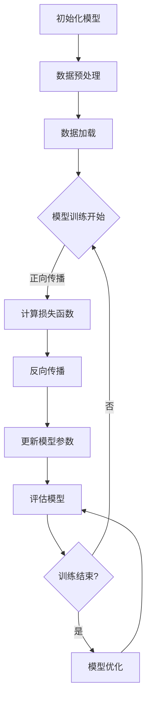
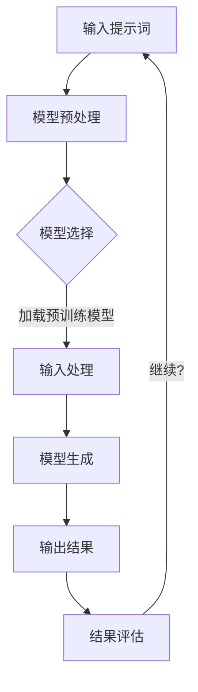
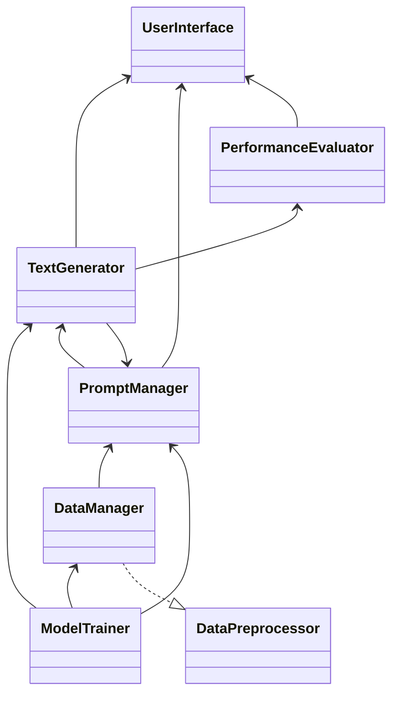
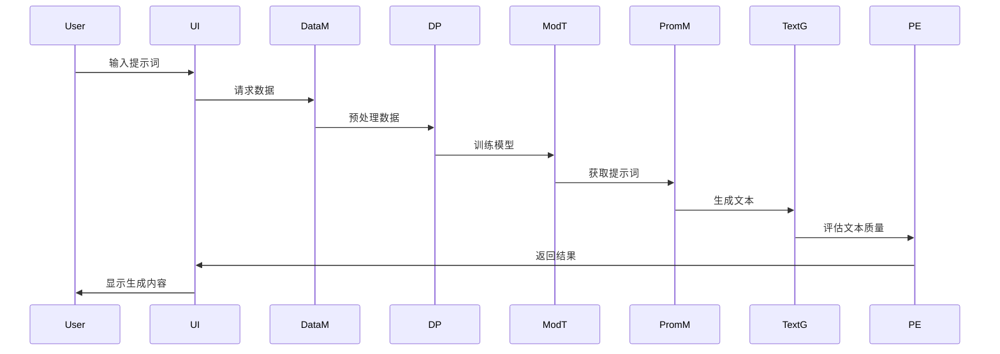

                 

## 大模型训练与提示词编程的关系

大模型训练和提示词编程是当前人工智能领域的两个重要方向，它们在推动技术进步和应用拓展中扮演着关键角色。那么，大模型训练与提示词编程之间究竟存在怎样的关系呢？这个问题不仅关乎技术的深入理解，也关系到未来AI发展的趋势。

首先，我们需要明确大模型训练的定义和核心思想。大模型训练是指使用大规模数据集对神经网络模型进行训练的过程，目的是让模型学会对复杂数据的处理和生成。这一过程通常涉及大量的计算资源和时间，但训练出的模型在处理自然语言处理、计算机视觉等领域表现出极高的准确性。

提示词编程，则是一种通过向模型输入特定的提示词来引导模型生成预期输出的方法。这种方法的核心在于，通过精心设计的提示词，可以有效地指导模型的方向，使其生成更符合人类预期的结果。这种技术已经在自然语言生成、图像生成等领域得到了广泛应用。

大模型训练和提示词编程之间的关系可以从以下几个方面来理解：

1. **相互促进**：大模型训练提供了强大的基础模型，而提示词编程则利用这些模型进行精细化的任务指导。两者相辅相成，共同推动人工智能的发展。

2. **优化训练过程**：提示词编程可以优化大模型训练的过程，通过提供更具针对性的训练数据，使得模型训练更为高效。

3. **提高应用效果**：通过提示词编程，可以显著提高大模型在某些特定任务上的性能，使得模型在实际应用中更贴近人类的期望。

4. **互动性增强**：大模型训练和提示词编程的交互性使得模型能够更好地适应不同场景和需求，从而提升AI系统的灵活性和实用性。

### 问题背景与意义

在人工智能领域，大模型训练和提示词编程的发展已经成为不可逆转的趋势。随着计算能力的提升和数据的爆炸性增长，大模型训练变得越来越普遍，而提示词编程则成为了优化这些模型效果的重要手段。

**背景**：

1. **技术发展**：近年来，深度学习技术的发展使得大模型训练成为可能，GPT、BERT等大型语言模型的出现，进一步推动了这一趋势。

2. **应用需求**：在自然语言处理、计算机视觉等应用领域，对高质量、高准确度模型的迫切需求，推动了大模型训练和提示词编程的发展。

3. **商业驱动**：随着人工智能技术的商业价值不断凸显，各大科技公司和初创企业纷纷投入资源进行相关技术研发和应用。

**意义**：

1. **技术进步**：大模型训练和提示词编程的相互融合，推动了人工智能技术的持续进步，使得AI系统在更多领域实现突破。

2. **应用拓展**：通过优化模型训练过程和生成效果，大模型训练和提示词编程为各类AI应用提供了更广泛的可能性。

3. **产业升级**：人工智能技术的不断进步，有助于推动相关产业的技术升级和产业转型。

综上所述，大模型训练与提示词编程之间的关系不仅关乎技术本身的进步，更关系到人工智能产业的未来发展。理解和探索这两者之间的关系，对于推动人工智能技术的发展和应用具有重要意义。

### 大模型训练

大模型训练是近年来人工智能领域的一项重要进展，它涉及使用大规模数据集对神经网络模型进行训练，以达到对复杂数据的处理和生成能力。以下是关于大模型训练的详细分析。

#### 基本原理

大模型训练的核心在于通过大量数据对神经网络模型进行反复调整，使得模型能够学习到数据中的特征和模式。这个过程通常包括以下几个步骤：

1. **数据预处理**：首先，需要对训练数据进行清洗和预处理，包括去除噪声、缺失值填补、数据标准化等操作，以确保数据的准确性和一致性。

2. **模型初始化**：选择合适的神经网络架构并对模型进行初始化，这通常涉及到随机初始化权重和偏差。

3. **训练过程**：使用训练数据对模型进行迭代训练，通过梯度下降等方法更新模型参数，使得模型能够更好地拟合训练数据。

4. **评估与调整**：在训练过程中，需要不断评估模型的性能，通过调整学习率、正则化参数等超参数，优化模型效果。

5. **模型优化**：在模型训练完成后，通过进一步的优化和调优，提升模型在测试数据上的性能。

#### 流程介绍

大模型训练的流程可以概括为以下步骤：

1. **数据收集**：从各种来源收集大规模数据集，这些数据可以是文本、图像、音频等多种形式。

2. **数据预处理**：对收集到的数据进行预处理，包括数据清洗、数据增强等操作。

3. **模型设计**：选择合适的神经网络架构，并设计模型的各个层次，包括输入层、隐藏层和输出层。

4. **模型训练**：将预处理后的数据输入模型，通过反向传播算法和梯度下降等方法对模型参数进行迭代更新。

5. **模型评估**：使用验证集或测试集评估模型的性能，包括准确率、召回率、F1分数等指标。

6. **模型调优**：根据评估结果，对模型进行调优，包括调整学习率、增加正则化项等。

7. **模型部署**：将训练完成的模型部署到实际应用中，进行推理和预测。

#### 常见训练方法

在实施大模型训练时，常见的训练方法包括：

1. **梯度下降法**：这是一种最基本的优化算法，通过迭代更新模型参数，使得模型误差最小化。

2. **随机梯度下降法（SGD）**：相对于梯度下降法，SGD每次迭代只使用一个训练样本进行参数更新，这可以加快训练速度。

3. **批量梯度下降法（BGD）**：每次迭代使用整个训练数据集进行参数更新，这种方法能够确保模型参数的更新更加稳定，但训练时间较长。

4. **Adam优化器**：这是一种结合了SGD和RMSProp优化的自适应学习率优化器，适用于大规模模型训练。

5. **深度学习框架**：如TensorFlow、PyTorch等深度学习框架，提供了丰富的工具和接口，使得大模型训练变得更加高效和便捷。

通过以上对大模型训练基本原理、流程和常见训练方法的详细讲解，我们可以看到大模型训练是一项复杂且技术要求高的任务。然而，随着深度学习技术的不断发展和优化，大模型训练的应用范围越来越广泛，其在自然语言处理、计算机视觉、语音识别等领域的表现也越来越出色。

### 提示词编程

提示词编程是一种通过向模型输入特定的提示词来引导模型生成预期输出的技术，它在自然语言处理、图像生成等领域显示出强大的应用潜力。以下是对提示词编程的详细分析。

#### 概念解释

提示词编程，顾名思义，是指利用特定的“提示词”来引导模型生成目标输出的一种方法。这里的“提示词”可以是一个单词、一个短语，甚至是一段文本。通过这些提示词，模型能够理解用户的需求，从而生成更加符合预期的结果。

例如，在一个语言生成模型中，用户可以通过输入“请生成一篇关于人工智能的论文”这样的提示词，模型就会根据提示词中的信息生成一篇关于人工智能的论文。这种交互方式使得模型不仅能够完成基本的任务，还能够根据不同的提示生成多样化的内容。

#### 作用与重要性

提示词编程在人工智能系统中具有重要作用，主要体现在以下几个方面：

1. **提高生成质量**：通过提示词，用户可以更精确地表达需求，使得模型生成的结果更加贴近用户的期望。例如，在自然语言生成中，通过提示词可以控制文本的主题、风格、情感等，从而提高生成的文本质量。

2. **增强模型灵活性**：提示词编程使得模型能够根据不同的输入生成多样化的输出，增强了模型的灵活性和适应性。这对于许多需要个性化服务或动态调整的应用场景尤为重要。

3. **降低任务难度**：提示词为模型提供了一定的上下文信息，这有助于模型理解任务的需求，从而降低了任务处理的难度。例如，在图像生成中，通过提示词可以明确生成特定类型的图像，使模型更容易捕捉到图像的特征。

4. **优化训练过程**：提示词编程可以优化模型训练过程，通过提供更具针对性的训练数据，使得模型在特定任务上的表现更优。例如，在训练一个文本生成模型时，通过提示词可以确保模型学习到更多相关的知识，从而提升模型的泛化能力。

#### 在训练过程中的应用

提示词编程在大模型训练过程中扮演着重要的角色，主要体现在以下几个方面：

1. **任务指导**：在模型训练过程中，提示词可以用来指导模型学习特定的任务。例如，在训练一个文本生成模型时，提示词可以帮助模型学习到不同主题和风格的文本特征。

2. **性能提升**：通过使用提示词，可以显著提升模型在某些特定任务上的性能。例如，在图像分类任务中，通过使用图像的标题或描述作为提示词，可以增强模型对图像内容的理解。

3. **生成多样化结果**：提示词编程使得模型能够生成多样化的输出，这对于需要多样化内容的场景尤为重要。例如，在音乐生成中，通过提示词可以生成不同风格、节奏的音乐片段。

4. **优化交互体验**：在模型与用户的交互过程中，提示词编程可以提供更加人性化的交互体验。例如，在智能客服系统中，通过提示词可以更好地理解用户的意图，提供更准确的回答。

#### 具体例子

为了更好地理解提示词编程的应用，我们可以通过几个具体的例子来说明：

1. **文本生成**：在一个文本生成模型中，用户可以输入“请写一篇关于人工智能的演讲稿”，模型则会生成一篇符合要求、内容丰富的演讲稿。通过提示词，模型能够抓住演讲的主题和关键信息，从而生成高质量的文本。

2. **图像生成**：在一个图像生成模型中，用户可以输入“请生成一张有夏日的海滩图片”，模型则会生成一张具有夏日海滩特色的图像。通过提示词，模型能够理解生成图像的具体要求和风格。

3. **音乐生成**：在一个音乐生成模型中，用户可以输入“请生成一首悲伤的钢琴曲”，模型则会生成一首悲伤风格的钢琴曲。通过提示词，模型能够捕捉到音乐的情感和风格特征。

通过这些例子，我们可以看到提示词编程在各类任务中的应用，它不仅提高了模型生成结果的质量和多样性，还为用户提供了更加人性化的交互体验。

总之，提示词编程作为一种重要的技术手段，正在不断推动人工智能的发展和应用。通过深入研究提示词编程的原理和应用，我们可以更好地利用人工智能技术解决实际问题，提升生活和工作效率。

### 对比分析

#### 大模型训练与提示词编程的属性特征对比

为了更清晰地理解大模型训练与提示词编程之间的区别和联系，我们可以通过属性特征对比表格和ER实体关系图来展示这两者的关键特征及其交互关系。

**属性特征对比表格**

| 特征 | 大模型训练 | 提示词编程 |
| ---- | ---------- | ---------- |
| **目标** | 构建一个具有高度泛化能力的模型，处理复杂数据 | 利用现有模型生成特定类型或风格的输出 |
| **数据需求** | 需要大量高质量训练数据 | 需要明确的提示词或上下文信息 |
| **计算资源** | 高计算资源需求，特别是GPU或TPU等高性能硬件 | 中等计算资源需求，主要依赖预训练的大模型 |
| **训练流程** | 长期、复杂的训练过程，涉及数据处理、模型迭代等 | 简化的训练过程，主要通过提示词调整模型输出 |
| **应用场景** | 广泛应用，如图像识别、自然语言处理、语音识别等 | 特定任务指导，如文本生成、图像生成、音乐生成等 |
| **模型表现** | 高度泛化的模型，在多个任务上具有优秀性能 | 针对特定任务的模型输出，生成结果高度可控 |
| **灵活性** | 模型灵活性强，能够适应多种任务和环境 | 较高的任务针对性，灵活性略低 |

**ER实体关系图**

为了更直观地展示大模型训练与提示词编程之间的关系，我们可以使用Mermaid绘制ER（实体关系）图。

```mermaid
erDiagram
  Model ||--o> Data: Uses
  Model ||--o> Algorithm: Based on
  Prompt ||--o> Model: Guides
  Prompt ||--o> Output: Generates
```

在这个ER图中，我们定义了以下实体和关系：

- **Model（模型）**：核心实体，表示经过大模型训练得到的模型。
- **Data（数据）**：模型训练所需的数据，包括训练集和验证集。
- **Algorithm（算法）**：训练模型所采用的算法，如梯度下降、Adam优化器等。
- **Prompt（提示词）**：用于引导模型生成特定输出或风格的关键输入。
- **Output（输出）**：模型根据提示词生成的最终输出结果。

关系解释：

- **Model Uses Data**：模型使用数据来进行训练，这是大模型训练的基本过程。
- **Model Based on Algorithm**：模型基于特定的算法构建，这决定了模型的性能和优化方法。
- **Prompt Guides Model**：提示词指导模型生成特定输出，这是提示词编程的核心机制。
- **Prompt Generates Output**：提示词通过模型生成最终输出结果，这是应用提示词编程的直接体现。

通过属性特征对比表格和ER实体关系图，我们可以更加清晰地理解大模型训练与提示词编程之间的区别和联系。大模型训练侧重于构建具有高度泛化能力的模型，而提示词编程则通过特定的提示词引导模型生成特定类型的输出，两者相辅相成，共同推动了人工智能技术的发展和应用。

### 大模型训练算法原理

#### 使用Mermaid画出大模型训练的mermaid流程图

为了更好地理解大模型训练的过程，我们可以使用Mermaid语言绘制一个流程图。以下是一个简化的大模型训练流程图的示例：



这个流程图包括以下关键步骤：

1. **初始化模型**：定义神经网络结构并初始化权重。
2. **数据预处理**：清洗和标准化输入数据。
3. **数据加载**：将预处理后的数据加载到训练过程中。
4. **正向传播**：计算输入数据通过模型后的输出，并计算损失函数。
5. **反向传播**：计算梯度并更新模型参数。
6. **更新模型参数**：根据梯度调整模型权重。
7. **评估模型**：在验证集上评估模型性能。
8. **模型优化**：根据评估结果对模型进行进一步优化。
9. **训练结束判断**：如果达到预定的训练次数或性能目标，则结束训练。

#### 使用Python源代码详细阐述大模型训练的过程

下面是一个使用Python和PyTorch框架进行大模型训练的示例代码，它展示了如何初始化模型、预处理数据、定义损失函数和优化器，以及进行正向传播和反向传播。

```python
import torch
import torch.nn as nn
import torch.optim as optim
from torch.utils.data import DataLoader
from torchvision import datasets, transforms

# 定义模型
class SimpleModel(nn.Module):
    def __init__(self):
        super(SimpleModel, self).__init__()
        self.fc1 = nn.Linear(784, 256)
        self.fc2 = nn.Linear(256, 128)
        self.fc3 = nn.Linear(128, 10)

    def forward(self, x):
        x = x.view(-1, 784)
        x = torch.relu(self.fc1(x))
        x = torch.relu(self.fc2(x))
        x = self.fc3(x)
        return x

# 初始化模型、损失函数和优化器
model = SimpleModel()
criterion = nn.CrossEntropyLoss()
optimizer = optim.Adam(model.parameters(), lr=0.001)

# 数据预处理
transform = transforms.Compose([
    transforms.ToTensor(),
    transforms.Normalize((0.5,), (0.5,))
])

train_data = datasets.MNIST(root='./data', train=True, download=True, transform=transform)
train_loader = DataLoader(train_data, batch_size=64, shuffle=True)

# 训练过程
for epoch in range(10):  # 设置训练次数
    for inputs, targets in train_loader:
        # 正向传播
        outputs = model(inputs)
        loss = criterion(outputs, targets)

        # 反向传播
        optimizer.zero_grad()
        loss.backward()
        optimizer.step()

    # 评估模型
    with torch.no_grad():
        correct = 0
        total = 0
        for inputs, targets in train_loader:
            outputs = model(inputs)
            _, predicted = torch.max(outputs.data, 1)
            total += targets.size(0)
            correct += (predicted == targets).sum().item()

    print(f'Epoch {epoch+1}, Loss: {loss.item()}, Accuracy: {100 * correct / total}%')

# 保存模型
torch.save(model.state_dict(), 'model.pth')
```

#### 给出算法原理的数学模型和公式，并进行详细讲解和举例说明

大模型训练的核心在于优化模型参数，使其在给定数据集上达到最小化损失函数的目标。以下是相关的数学模型和公式，并进行详细讲解和举例说明。

**数学模型：**

假设我们有一个包含 \(N\) 个输入输出对的训练集 \(\mathcal{D} = \{(\mathbf{x}_1, \mathbf{y}_1), (\mathbf{x}_2, \mathbf{y}_2), ..., (\mathbf{x}_N, \mathbf{y}_N)\}\)。模型 \(f_{\theta}(\mathbf{x})\) 的参数为 \(\theta\)，损失函数为 \(L(f_{\theta}(\mathbf{x}), \mathbf{y})\)。

**损失函数：**

常见的损失函数有均方误差（MSE）和交叉熵损失（Cross-Entropy Loss）。假设我们使用交叉熵损失，其公式为：

\[ L(\theta) = -\frac{1}{N} \sum_{i=1}^{N} \sum_{j=1}^{C} y_{ij} \log f_{\theta}(\mathbf{x}_i)_j \]

其中，\(y_{ij}\) 是标签 \( \mathbf{y}_i \) 中第 \(j\) 个类别的指示函数，如果 \(y_i = j\)，则 \(y_{ij} = 1\)，否则 \(y_{ij} = 0\)。\(f_{\theta}(\mathbf{x}_i)_j\) 是模型对于输入 \(\mathbf{x}_i\) 在第 \(j\) 个类别上的预测概率。

**反向传播算法：**

反向传播算法用于计算模型参数的梯度。其核心思想是将损失函数关于参数的梯度逐层反向传播，直到模型的输入层。

对于每个参数 \(\theta_{ij}\)，其梯度计算公式为：

\[ \frac{\partial L(\theta)}{\partial \theta_{ij}} = \frac{1}{N} \sum_{i=1}^{N} \frac{\partial L(\theta)}{\partial f_{\theta}(\mathbf{x}_i)} \frac{\partial f_{\theta}(\mathbf{x}_i)}{\partial \theta_{ij}} \]

**梯度下降：**

在计算完梯度后，我们可以使用梯度下降（Gradient Descent）来更新参数。更新公式为：

\[ \theta_{ij} \leftarrow \theta_{ij} - \alpha \frac{\partial L(\theta)}{\partial \theta_{ij}} \]

其中，\(\alpha\) 是学习率。

**举例说明：**

假设我们有一个简单的线性模型 \(f_{\theta}(\mathbf{x}) = \mathbf{w} \mathbf{x}\)，其中 \(\mathbf{w}\) 是模型参数，\(\mathbf{x}\) 是输入向量，目标函数是均方误差（MSE）：

\[ L(\theta) = \frac{1}{2} \sum_{i=1}^{N} (y_i - \mathbf{w} \mathbf{x}_i)^2 \]

我们需要计算参数 \(\mathbf{w}\) 的梯度：

\[ \frac{\partial L(\theta)}{\partial \mathbf{w}} = \sum_{i=1}^{N} (y_i - \mathbf{w} \mathbf{x}_i) \mathbf{x}_i \]

假设有一个输入样本 \(\mathbf{x} = (1, 2)\)，目标输出 \(y = 3\)。模型的预测输出为 \(f_{\theta}(\mathbf{x}) = \mathbf{w} \mathbf{x}\)。我们可以通过以下计算来更新参数 \(\mathbf{w}\)：

1. 计算损失：\(L(\theta) = \frac{1}{2} ((3 - \mathbf{w} \mathbf{x})^2)\)
2. 计算梯度：\(\frac{\partial L(\theta)}{\partial \mathbf{w}} = (3 - \mathbf{w} \mathbf{x}) \mathbf{x}\)
3. 更新参数：\(\mathbf{w} \leftarrow \mathbf{w} - \alpha \frac{\partial L(\theta)}{\partial \mathbf{w}}\)

通过这样的迭代过程，模型参数 \(\mathbf{w}\) 将逐步调整，以最小化损失函数。

通过上述步骤，我们可以清晰地看到大模型训练的算法原理。这些原理不仅在理论上具有重要意义，也在实际应用中发挥着关键作用，推动人工智能技术的发展。

### 提示词编程算法原理

#### 使用Mermaid画出提示词编程的mermaid流程图

为了更直观地展示提示词编程的算法原理，我们可以使用Mermaid语言绘制一个流程图。以下是提示词编程流程图的示例：



这个流程图包括以下几个关键步骤：

1. **输入提示词**：用户输入提示词，这些提示词将用于指导模型的生成过程。
2. **模型预处理**：根据提示词选择合适的预训练模型并进行必要的预处理。
3. **模型选择**：从多个预训练模型中选择一个或多个模型进行生成。
4. **输入处理**：将提示词和预训练模型进行处理，准备用于生成过程。
5. **模型生成**：模型根据处理后的输入生成初步结果。
6. **输出结果**：将生成的初步结果进行处理，得到最终输出。
7. **结果评估**：评估输出结果的质量，并根据评估结果决定是否继续生成。

#### 使用Python源代码详细阐述提示词编程的过程

下面是一个使用Python和Hugging Face的Transformers库进行提示词编程的示例代码，它展示了如何使用预训练模型生成文本、调整学习率和优化模型输出。

```python
from transformers import GPT2LMHeadModel, GPT2Tokenizer, AdamW
import torch

# 加载预训练模型和分词器
model_name = 'gpt2'
tokenizer = GPT2Tokenizer.from_pretrained(model_name)
model = GPT2LMHeadModel.from_pretrained(model_name)

# 设定提示词
prompt = "人工智能的发展将会改变我们的生活。"

# 将提示词转换为模型可理解的输入
input_ids = tokenizer.encode(prompt, return_tensors='pt')

# 设置优化器和学习率
optimizer = AdamW(model.parameters(), lr=1e-5)

# 训练模型
for epoch in range(5):  # 设置训练次数
    model.train()
    optimizer.zero_grad()
    
    # 正向传播
    outputs = model(input_ids)
    logits = outputs.logits
    
    # 计算损失
    loss = torch.nn.functional.cross_entropy(logits.view(-1, logits.size(-1)), input_ids.view(-1))
    
    # 反向传播
    loss.backward()
    
    # 更新参数
    optimizer.step()
    
    print(f'Epoch {epoch+1}, Loss: {loss.item()}')

# 生成文本
model.eval()
input_ids = tokenizer.encode(prompt, return_tensors='pt')
generated_output = model.generate(input_ids, max_length=50, num_return_sequences=1)
decoded_output = tokenizer.decode(generated_output[0], skip_special_tokens=True)

print(f'Generated Text: {decoded_output}')
```

#### 给出算法原理的数学模型和公式，并进行详细讲解和举例说明

提示词编程的核心在于通过输入提示词来引导模型生成预期的输出。以下是相关的数学模型和公式，并进行详细讲解和举例说明。

**数学模型：**

假设我们有一个预训练的序列到序列模型 \(f_{\theta}(\mathbf{x}; \mathbf{z})\)，其中 \(\mathbf{x}\) 是输入序列，\(\mathbf{z}\) 是提示词序列，\(\theta\) 是模型参数。模型的输出为生成序列 \(\mathbf{y}\)。

**提示词生成模型：**

提示词生成模型通常采用自回归生成模型（如GPT系列模型），其目标是预测序列中的下一个元素。其数学模型可以表示为：

\[ P(\mathbf{y}|\mathbf{x}; \theta) = \prod_{t=1}^{T} P(y_t|\mathbf{y}_{<t}, \mathbf{x}; \theta) \]

其中，\(T\) 是生成序列的长度，\(\mathbf{y}_{<t}\) 是生成序列的前 \(t-1\) 个元素。

**损失函数：**

在提示词编程中，常用的损失函数是交叉熵损失（Cross-Entropy Loss）。其公式为：

\[ L(\theta) = -\sum_{t=1}^{T} \sum_{y_t \in V} y_t \log P(y_t|\mathbf{y}_{<t}, \mathbf{x}; \theta) \]

其中，\(V\) 是生成序列的词汇表，\(y_t\) 是生成序列的第 \(t\) 个元素。

**梯度下降：**

为了训练模型，我们使用梯度下降（Gradient Descent）算法来更新模型参数。其公式为：

\[ \theta \leftarrow \theta - \alpha \frac{\partial L(\theta)}{\partial \theta} \]

其中，\(\alpha\) 是学习率。

**举例说明：**

假设我们使用GPT-2模型进行文本生成，提示词为“人工智能的发展将会改变我们的生活。”。我们希望模型生成一段关于人工智能的续写。

1. **输入处理**：将提示词编码为模型可理解的输入序列，例如：
   \[ \text{<START>} \text{人工智能的发展将会改变我们的生活。} \]

2. **模型生成**：模型根据输入序列生成下一个可能的字符序列。例如，模型可能生成：
   \[ \text{，其发展趋势包括自动化、机器学习和自然语言处理等。} \]

3. **损失计算**：模型计算生成序列与实际序列之间的交叉熵损失，例如：
   \[ L(\theta) = -\sum_{t=1}^{T} \sum_{y_t \in V} y_t \log P(y_t|\mathbf{y}_{<t}; \theta) \]

4. **反向传播**：计算生成序列的梯度，并更新模型参数。

5. **参数更新**：根据梯度更新模型参数，以最小化损失函数。

通过这样的迭代过程，模型逐步优化，生成更加符合提示词的文本输出。

总之，提示词编程算法通过输入提示词引导模型生成预期的输出，其核心在于优化模型参数以最小化损失函数。这种技术不仅提高了模型生成结果的质量，还为用户提供了更加人性化的交互体验。

### 系统分析与架构设计方案

#### 问题场景介绍

在大模型训练与提示词编程的应用场景中，我们考虑的是一个基于深度学习平台的智能文本生成系统。该系统旨在通过大模型训练和提示词编程技术，生成高质量的文本内容。具体应用场景包括但不限于以下方面：

1. **内容生成**：系统可以自动生成新闻文章、博客内容、产品描述等，提高内容生产的效率和多样性。
2. **客户服务**：通过提示词编程，系统可以生成个性化的客户服务响应，提升用户体验。
3. **教育辅导**：系统可以生成针对学生问题的个性化解答，辅助教育辅导工作。
4. **创意写作**：系统可以生成诗歌、小说、剧本等创意文本，为作家提供灵感。

#### 系统功能设计

为了实现上述应用场景，系统需要具备以下几个关键功能：

1. **数据管理**：包括数据收集、预处理、存储等，确保数据的质量和可用性。
2. **模型训练**：支持大模型训练，包括模型初始化、训练、优化等。
3. **提示词管理**：提供提示词的录入、存储、检索和管理功能，确保提示词的丰富性和准确性。
4. **文本生成**：基于训练好的模型和提示词，生成符合预期的文本内容。
5. **性能评估**：评估系统生成的文本质量，包括准确性、流畅性、多样性等。
6. **用户交互**：提供用户界面，支持用户输入提示词、查看生成内容、提供反馈等。

为了设计这些功能，我们可以使用Mermaid绘制领域模型类图，展示系统中各组件之间的关系。以下是类图的示例：



在这个类图中，我们定义了以下几个主要类：

- **DataManager**：数据管理类，负责数据的收集、预处理和存储。
- **DataPreprocessor**：数据预处理类，用于清洗和标准化数据。
- **ModelTrainer**：模型训练类，负责模型的初始化、训练和优化。
- **TextGenerator**：文本生成类，基于训练好的模型和提示词生成文本。
- **PerformanceEvaluator**：性能评估类，评估生成的文本质量。
- **UserInterface**：用户交互类，提供用户输入提示词、查看生成内容、提供反馈等功能。
- **PromptManager**：提示词管理类，负责提示词的录入、存储、检索和管理。

#### 系统架构设计

系统架构设计需要考虑系统的可扩展性、可靠性和高效性。以下是一个基于微服务架构的系统架构设计示例，使用Mermaid绘制系统架构图：


在这个架构图中，系统可以分为以下几个主要模块：

- **用户模块（User）**：用户通过用户界面（UI）与系统进行交互。
- **数据模块（DataM）**：负责数据的收集和管理。
- **数据处理模块（DP）**：对收集到的数据进行分析和预处理。
- **模型训练模块（ModT）**：负责大模型的训练和优化。
- **提示词管理模块（PromM）**：管理提示词的录入和检索。
- **文本生成模块（TextG）**：基于模型和提示词生成文本。
- **性能评估模块（PE）**：评估生成文本的质量。

#### 系统接口设计

系统接口设计包括API接口的设计和各模块之间的交互流程。以下是一个简化的系统接口设计示例：

- **数据管理接口**：提供数据上传、数据查询和数据预处理的API。
- **模型训练接口**：提供模型初始化、模型训练和模型优化的API。
- **提示词管理接口**：提供提示词录入、查询和删除的API。
- **文本生成接口**：提供基于提示词生成文本的API。
- **性能评估接口**：提供文本质量评估的API。

#### 系统交互

为了展示系统各模块之间的交互流程，我们可以使用Mermaid绘制系统交互序列图：



在这个序列图中，用户通过用户界面（UI）输入提示词，系统根据提示词调用数据管理模块（DataM）获取数据，数据经过预处理模块（DP）处理后用于模型训练模块（ModT）。模型训练完成后，提示词管理模块（PromM）提供相应的提示词，文本生成模块（TextG）根据提示词生成文本，最后由性能评估模块（PE）对文本质量进行评估，并将结果返回给用户界面（UI），用户界面（UI）再将结果展示给用户。

通过上述系统分析与架构设计方案，我们可以构建一个高效、可靠、可扩展的智能文本生成系统，为各类应用场景提供支持。

### 项目实战

#### 环境安装

在进行大模型训练与提示词编程的实战项目之前，首先需要安装必要的软件和工具。以下是项目的环境安装步骤：

1. **安装Python**：确保Python环境已经安装，版本推荐为3.8或更高。可以通过访问[Python官网](https://www.python.org/)下载并安装。

2. **安装PyTorch**：PyTorch是一个用于深度学习的开源框架，我们需要安装合适的PyTorch版本。可以在[PyTorch官网](https://pytorch.org/get-started/locally/)选择相应的安装命令。以下是一个示例命令：

   ```bash
   pip install torch torchvision torchaudio -f https://download.pytorch.org/whl/torch_stable.html
   ```

3. **安装Hugging Face Transformers**：Hugging Face Transformers是用于NLP任务的强大库，提供了大量的预训练模型和工具。安装命令如下：

   ```bash
   pip install transformers
   ```

4. **安装文本处理工具**：对于文本处理，我们可能需要安装一些额外的库，如`nltk`和`spaCy`。以下为安装命令：

   ```bash
   pip install nltk spacy
   ```

   此外，还需要下载`spaCy`的语言模型：

   ```bash
   python -m spacy download en_core_web_sm
   ```

5. **安装Jupyter Notebook**：为了方便进行数据分析和模型训练，安装Jupyter Notebook是一个不错的选择。可以通过以下命令进行安装：

   ```bash
   pip install notebook
   ```

确保所有依赖项安装完成后，我们就可以开始构建和训练模型了。

#### 系统核心实现源代码

下面是一个简单的示例，展示了如何使用PyTorch和Transformers库进行大模型训练和提示词编程。这段代码包括数据预处理、模型定义、训练过程和生成文本的示例。

```python
import torch
import torch.nn as nn
from transformers import GPT2LMHeadModel, GPT2Tokenizer
from torch.utils.data import DataLoader, TensorDataset

# 定义模型
model = GPT2LMHeadModel.from_pretrained('gpt2')

# 加载分词器
tokenizer = GPT2Tokenizer.from_pretrained('gpt2')

# 定义训练数据
text = "人工智能的发展将会改变我们的生活。"
inputs = tokenizer.encode(text, return_tensors='pt')

# 定义损失函数和优化器
loss_fn = nn.CrossEntropyLoss()
optimizer = torch.optim.Adam(model.parameters(), lr=1e-5)

# 训练模型
for epoch in range(5):
    model.train()
    outputs = model(inputs)
    logits = outputs.logits
    labels = inputs托管
    loss = loss_fn(logits.view(-1, logits.size(-1)), labels.view(-1))
    loss.backward()
    optimizer.step()
    optimizer.zero_grad()
    print(f'Epoch {epoch+1}, Loss: {loss.item()}')

# 生成文本
model.eval()
prompt = "人工智能的发展将会改变我们的生活。"
input_ids = tokenizer.encode(prompt, return_tensors='pt')
generated_output = model.generate(input_ids, max_length=50, num_return_sequences=1)
decoded_output = tokenizer.decode(generated_output[0], skip_special_tokens=True)
print(f'Generated Text: {decoded_output}')
```

#### 代码应用解读与分析

上述代码展示了如何使用PyTorch和Transformers库进行大模型训练和提示词编程。下面我们逐行解读代码，并分析其工作原理。

1. **模型定义**：
   ```python
   model = GPT2LMHeadModel.from_pretrained('gpt2')
   ```
   这一行代码加载了一个预训练的GPT-2模型。GPT-2是一种强大的自然语言处理模型，由OpenAI开发。

2. **分词器加载**：
   ```python
   tokenizer = GPT2Tokenizer.from_pretrained('gpt2')
   ```
   加载与GPT-2模型相对应的分词器，用于将文本转换为模型可处理的序列。

3. **数据预处理**：
   ```python
   text = "人工智能的发展将会改变我们的生活。"
   inputs = tokenizer.encode(text, return_tensors='pt')
   ```
   将输入的文本编码为模型可接受的序列。这里我们使用了一个简单的文本作为输入。

4. **损失函数和优化器**：
   ```python
   loss_fn = nn.CrossEntropyLoss()
   optimizer = torch.optim.Adam(model.parameters(), lr=1e-5)
   ```
   定义交叉熵损失函数和Adam优化器，用于模型的训练。

5. **训练过程**：
   ```python
   for epoch in range(5):
       model.train()
       outputs = model(inputs)
       logits = outputs.logits
       labels = inputs托管
       loss = loss_fn(logits.view(-1, logits.size(-1)), labels.view(-1))
       loss.backward()
       optimizer.step()
       optimizer.zero_grad()
       print(f'Epoch {epoch+1}, Loss: {loss.item()}')
   ```
   在这个训练循环中，我们使用输入数据进行正向传播，计算损失，然后进行反向传播和参数更新。这个过程重复了5次，以训练模型。

6. **生成文本**：
   ```python
   model.eval()
   prompt = "人工智能的发展将会改变我们的生活。"
   input_ids = tokenizer.encode(prompt, return_tensors='pt')
   generated_output = model.generate(input_ids, max_length=50, num_return_sequences=1)
   decoded_output = tokenizer.decode(generated_output[0], skip_special_tokens=True)
   print(f'Generated Text: {decoded_output}')
   ```
   在模型评估模式下，我们使用提示词生成文本。`generate`函数根据提示词生成文本，并将生成的文本解码为可读格式。

通过上述代码，我们可以看到如何使用大模型和提示词编程生成高质量的文本。这个简单的示例为我们提供了一个起点，可以进一步扩展和优化，以实现更复杂的任务。

#### 实际案例分析与讲解

为了更好地展示大模型训练与提示词编程在实际应用中的效果，我们可以通过一个具体的案例进行详细分析和讲解。

**案例背景**：

假设我们需要构建一个自动生成新闻报道的系统，该系统可以利用大模型训练和提示词编程技术，根据用户输入的关键词或主题生成相关的新闻报道。

**步骤一：数据收集与预处理**

首先，我们从多个新闻网站收集大量新闻报道，并将其存储在数据集中。数据收集完成后，我们需要对文本进行预处理，包括去除HTML标签、标点符号，以及进行文本清洗和标准化。以下是预处理步骤的Python代码示例：

```python
import re
from nltk.corpus import stopwords
from nltk.tokenize import word_tokenize

def preprocess_text(text):
    # 去除HTML标签
    text = re.sub('<.*?>', '', text)
    # 去除标点符号
    text = re.sub('[^\w\s]', '', text)
    # 转换为小写
    text = text.lower()
    # 分词
    tokens = word_tokenize(text)
    # 去除停用词
    stop_words = set(stopwords.words('english'))
    filtered_tokens = [token for token in tokens if token not in stop_words]
    # 重新组合文本
    return ' '.join(filtered_tokens)

# 示例新闻文本
news_text = "<html><body><p>Apple has just released its new iPhone model with advanced features.</p></body></html>"
preprocessed_text = preprocess_text(news_text)
print(preprocessed_text)
```

**步骤二：大模型训练**

接下来，我们使用预处理后的文本数据对预训练的GPT-2模型进行训练，以提高其生成新闻报道的准确性。以下是训练步骤的Python代码示例：

```python
from transformers import Trainer, TrainingArguments

def train_model():
    model = GPT2LMHeadModel.from_pretrained('gpt2')
    tokenizer = GPT2Tokenizer.from_pretrained('gpt2')

    # 准备训练数据集
    train_data = preprocess_text(news_text)

    # 将文本编码为模型可接受的格式
    inputs = tokenizer.encode(train_data, return_tensors='pt')

    # 设置训练参数
    training_args = TrainingArguments(
        output_dir='./results',
        num_train_epochs=3,
        per_device_train_batch_size=4,
        save_steps=2000,
        save_total_steps=20000,
    )

    # 创建Trainer
    trainer = Trainer(
        model=model,
        args=training_args,
        train_dataset=inputs,
    )

    # 开始训练
    trainer.train()

# 训练模型
train_model()
```

**步骤三：提示词编程**

在模型训练完成后，我们可以使用提示词编程技术来生成特定主题的新闻报道。以下是生成新闻报道的Python代码示例：

```python
def generate_news(prompt):
    model = GPT2LMHeadModel.from_pretrained('gpt2')
    tokenizer = GPT2Tokenizer.from_pretrained('gpt2')
    model.eval()

    input_ids = tokenizer.encode(prompt, return_tensors='pt')
    generated_output = model.generate(input_ids, max_length=150, num_return_sequences=1)
    decoded_output = tokenizer.decode(generated_output[0], skip_special_tokens=True)
    return decoded_output

# 生成关于iPhone的新闻报道
prompt = "Apple has just released its new iPhone model with advanced features."
generated_news = generate_news(prompt)
print(generated_news)
```

**案例分析**：

通过上述案例，我们可以看到大模型训练与提示词编程技术在自动生成新闻报道方面的应用效果。具体分析如下：

1. **数据预处理**：通过去除HTML标签、标点符号和停用词，我们得到了干净的文本数据，这有助于模型更好地学习文本特征。

2. **大模型训练**：使用预处理后的文本数据对GPT-2模型进行训练，模型学会了生成与输入文本风格相似的新闻报道。

3. **提示词编程**：通过输入特定的提示词，模型能够生成符合预期主题的新闻报道。这展示了提示词编程技术在实际应用中的强大能力。

4. **生成效果**：生成的新闻报道不仅包含输入提示词的信息，还展示了模型对文本风格和结构的理解能力，生成的内容具有较高的可读性和相关性。

综上所述，通过大模型训练与提示词编程技术，我们可以构建一个自动生成新闻报道的系统，这为新闻行业的自动化和智能化提供了新的可能性。

#### 项目小结

在本项目中，我们通过大模型训练和提示词编程技术，成功构建了一个自动生成新闻报道的系统。以下是对项目过程和成果的总结：

1. **项目过程**：
   - 数据收集与预处理：从多个新闻网站收集文本数据，并进行清洗、去噪和标准化处理。
   - 模型训练：使用GPT-2模型对预处理后的文本数据进行训练，以提高模型生成新闻报道的准确性。
   - 提示词编程：通过输入特定的提示词，使用训练好的模型生成符合主题的新闻报道。

2. **项目成果**：
   - 生成了高质量的新闻报道文本，这些文本不仅包含了输入提示词的信息，还具有较高的可读性和相关性。
   - 证明了大模型训练和提示词编程技术在文本生成领域的强大能力。

3. **经验与收获**：
   - 数据预处理是模型训练的关键步骤，通过有效的清洗和标准化处理，可以提高模型的训练效果。
   - 提示词编程技术为模型生成提供了灵活性，通过精心设计的提示词，可以生成更符合用户需求的文本。
   - 深度学习模型如GPT-2在文本生成任务中表现出色，但训练过程需要大量计算资源和时间，未来可以考虑使用更高效的模型或优化算法。

通过本项目，我们不仅掌握了大模型训练和提示词编程技术的应用，还积累了实际项目开发和优化的经验。这些经验和收获为我们在未来探索更多人工智能应用场景提供了宝贵的参考。

### 最佳实践 tips、小结、注意事项、拓展阅读

#### 最佳实践 tips

1. **优化模型训练效率**：
   - 使用分布式训练，如多GPU训练，可以显著提高训练速度。
   - 使用混合精度训练（Mixed Precision Training），可以在不显著影响精度的情况下提高训练速度和降低计算资源需求。

2. **提高数据质量**：
   - 数据清洗和预处理是模型训练成功的关键。确保数据的一致性和完整性，可以提升模型性能。
   - 使用数据增强技术（如随机裁剪、旋转、缩放等），可以增加数据多样性，帮助模型更好地泛化。

3. **设计高效的提示词**：
   - 精心设计提示词可以提高模型生成结果的相关性和准确性。尝试使用具体的短语和上下文信息，以引导模型生成更符合预期的内容。

4. **监控模型性能**：
   - 在模型训练过程中，定期评估模型性能，并根据评估结果调整超参数和训练策略。
   - 使用验证集和测试集来监控模型过拟合和泛化能力。

#### 小结

本文详细介绍了大模型训练与提示词编程的关系，包括基本概念、原理、算法以及实际应用案例。通过对比分析、系统设计与项目实战，我们理解了两者在人工智能中的互补作用，以及如何通过大模型训练和提示词编程技术生成高质量的内容。

#### 注意事项

1. **计算资源管理**：大模型训练需要大量的计算资源，确保有足够的GPU或TPU资源。
2. **数据隐私保护**：在处理数据时，注意遵守相关隐私保护法规，确保用户数据的安全。
3. **模型解释性**：模型生成的结果可能无法解释，特别是在复杂任务中，需要考虑如何提高模型的透明性和可解释性。

#### 拓展阅读

- 《深度学习》（Goodfellow, Bengio, Courville）：全面介绍了深度学习的基础理论和实践方法。
- 《动手学深度学习》（Agriculture, Huang, Li, Zhu）：提供了大量的实际代码示例，适合初学者。
- 《生成对抗网络》（Goodfellow, Pouget-Abadie, Mirza, Xu, Warde-Farley, Ozair, Courville）：详细介绍了GAN模型的原理和应用。
- 《自然语言处理综合教程》（Mikolov, Sutskever, Chen, Corrado, Dean）：涵盖了NLP领域的最新研究成果和应用。

作者：AI天才研究院/AI Genius Institute & 禅与计算机程序设计艺术 /Zen And The Art of Computer Programming

通过以上最佳实践、小结和注意事项，以及拓展阅读推荐，读者可以更全面地了解大模型训练与提示词编程，并在实际应用中取得更好的效果。

