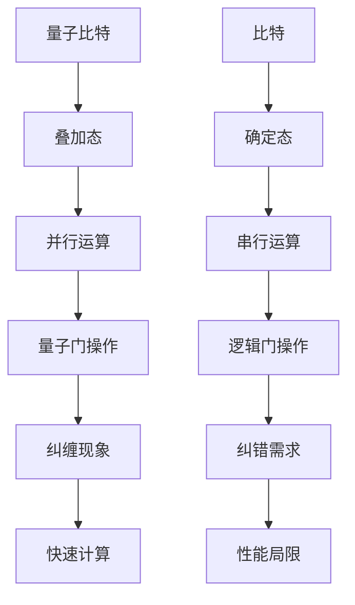
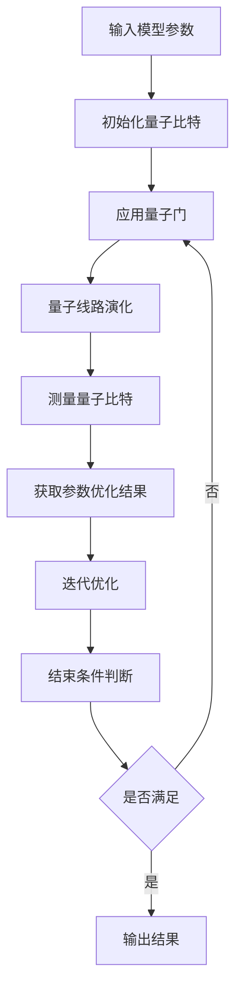
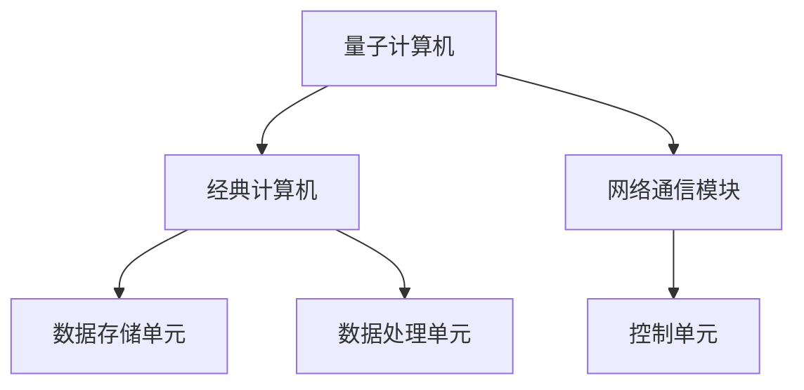
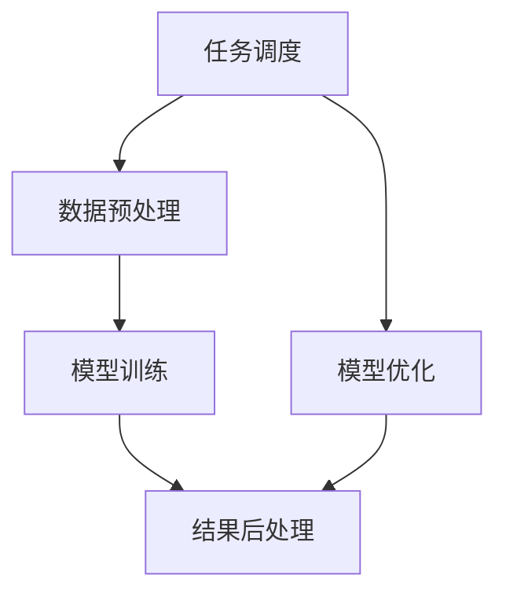
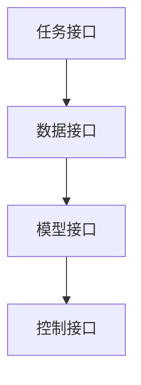
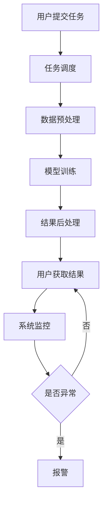

                 


### 让我们一步一步思考

在撰写《大模型训练的量子计算加速技术》这篇文章时，我们将遵循一个系统的思路，分步骤详细阐述每个部分。以下是我们将要采取的步骤：

#### 步骤 1：引言
- **背景介绍**：介绍量子计算和大模型训练的背景，阐述量子计算加速技术在人工智能领域的潜在应用和重要性。
- **关键词和摘要**：确定文章的关键词和摘要，确保文章的主题和核心内容在开篇就能够被读者抓住。

#### 步骤 2：核心概念与联系
- **量子计算概述**：定义量子计算的基本概念，如量子比特、量子门、量子纠缠等，并通过Mermaid流程图展示它们之间的关系。
- **概念对比**：使用Mermaid和表格对比量子计算与经典计算的核心差异，帮助读者理解量子计算的独特之处。

#### 步骤 3：算法原理讲解
- **算法流程图**：使用Mermaid绘制大模型训练在量子计算中的流程图，使读者对整个算法的实现过程有一个直观的认识。
- **Python源代码**：提供具体的Python源代码，详细解释量子计算加速技术的实现细节。
- **数学模型和公式**：给出算法的数学模型和关键公式，并结合实例进行解释，确保读者能够理解并应用这些概念。

#### 步骤 4：系统分析与架构设计方案
- **系统架构设计**：介绍量子计算加速系统的架构设计，包括系统功能设计和架构图。
- **系统接口设计**：分析系统的接口设计，并使用Mermaid序列图展示系统交互流程。

#### 步骤 5：项目实战
- **环境安装**：详细描述项目环境的安装步骤，确保读者可以顺利搭建实验环境。
- **核心实现**：提供系统核心实现源代码，并对其进行解读与分析。
- **实际案例**：通过具体案例分析和讲解，展示量子计算加速技术在实际应用中的效果。
- **项目小结**：总结项目经验，强调关键点和注意事项。

#### 步骤 6：最佳实践、小结和注意事项
- **最佳实践**：提供实际操作中的最佳实践建议，帮助读者优化量子计算加速技术的应用。
- **小结**：对全文内容进行总结，回顾核心观点。
- **注意事项**：提醒读者在实践中的关键点，避免常见的错误。
- **拓展阅读**：推荐相关书籍和资料，鼓励读者进一步深入学习和研究。

通过这样的结构化思考，我们可以确保文章内容条理清晰、深入浅出，能够有效地传达量子计算加速技术的核心思想和实践方法。

---

现在，我们将根据这些步骤逐步构建文章的各个部分，每个部分都将详尽地展开论述，确保文章既有深度又有实用性。让我们开始详细的写作吧！## 引言

### 量子计算加速技术在人工智能领域的崛起

近年来，随着人工智能（AI）技术的迅猛发展，大规模模型训练已成为许多应用领域的核心需求。然而，传统计算方式在面对这些巨大计算需求时，常常暴露出性能瓶颈，难以满足高效训练的要求。这一背景下，量子计算作为一种颠覆性的技术，逐渐进入人们的视野，并展现出巨大的潜力。

#### 量子计算的概念及其发展历程

量子计算是利用量子力学原理进行信息处理的新型计算方式。与传统计算机依赖的比特不同，量子计算机的基本单位是量子比特（qubit），它能够同时存在于0和1的叠加态，这一特性使得量子计算机在处理复杂问题时具有显著的并行计算能力。

量子计算的概念起源于20世纪80年代，由理查德·费曼（Richard Feynman）和彼得·肖尔（Peter Shor）等科学家提出。1994年，彼得·肖尔提出了著名的肖尔算法，该算法展示了量子计算机在因数分解问题上的优越性，引起了学术界和工业界的广泛关注。此后，量子计算研究取得了诸多突破，例如量子纠缠、量子门等核心技术的实现，使得量子计算机的实用化进程逐渐加快。

#### 大模型训练的需求与挑战

随着深度学习技术的发展，大规模模型训练成为许多AI应用的关键步骤。这些模型通常包含数百万甚至数十亿个参数，需要大量的计算资源进行训练。然而，传统计算机由于计算速度和存储能力的限制，常常难以在合理的时间内完成这种大规模的计算任务。

大模型训练面临的挑战主要包括：

- **计算资源需求大**：大规模模型训练需要大量的计算资源，特别是矩阵运算和并行计算的能力。
- **训练时间长**：传统计算机在处理大规模模型时，训练时间过长，不满足实时性的要求。
- **存储空间需求高**：大规模模型的参数存储需要大量存储空间，传统存储系统难以满足需求。

#### 量子计算加速技术的潜在应用

量子计算加速技术通过利用量子计算机的并行计算能力和高效的运算方式，有望大幅提升大模型训练的效率。具体而言，量子计算在以下方面具有显著优势：

- **并行计算**：量子计算机能够同时处理多个计算任务，大大缩短了计算时间。
- **快速矩阵运算**：量子计算机在矩阵运算上的效率远超传统计算机，能够加速大规模模型的训练过程。
- **高维空间搜索**：量子计算机能够在高维空间中进行快速搜索，有助于优化模型参数。

总之，量子计算加速技术在人工智能领域具有巨大的应用潜力。随着量子计算技术的不断发展，我们有望看到它在大模型训练、机器学习等领域带来革命性的变革。在接下来的章节中，我们将深入探讨量子计算的核心概念、算法原理及其在实际应用中的实现。

---

在这部分，我们介绍了量子计算加速技术在大模型训练中的重要性，阐述了量子计算的基本概念和发展历程，以及大模型训练所面临的挑战和量子计算加速技术的潜在优势。通过这样的背景介绍，读者可以初步了解量子计算加速技术的重要性及其应用前景，为后续章节的深入探讨打下基础。

---

### 核心概念与联系

在深入探讨量子计算加速技术之前，有必要首先定义并理解一些核心概念。量子计算与经典计算有着本质的不同，其基础在于量子力学原理。以下是量子计算中的几个关键概念：

#### 量子比特（Qubit）

量子比特是量子计算机的基本单位，类似于经典计算机中的比特。然而，与经典比特只能表示0或1不同，量子比特可以同时存在于0和1的叠加态。这种叠加态使得量子比特能够承载更多信息，这是量子计算并行性的关键。

数学表示：一个量子比特可以用状态向量 \(\lvert \psi \rangle = \alpha \lvert 0 \rangle + \beta \lvert 1 \rangle\) 来表示，其中 \(\alpha\) 和 \(\beta\) 是复数，且满足 \(|\alpha|^2 + |\beta|^2 = 1\)。

#### 量子门（Quantum Gate）

量子门是作用于量子比特的线性操作，类似于经典计算机中的逻辑门。量子门通过特定的操作改变量子比特的状态。常见的量子门包括Hadamard门（H门）、Pauli门（X、Y、Z门）和控制-NOT门（CNOT门）等。

Hadamard门（H门）是一个基本的量子门，可以将量子比特从基态（\(\lvert 0 \rangle\) 或 \(\lvert 1 \rangle\)）转换到叠加态：

\[ H = \frac{1}{\sqrt{2}} \begin{bmatrix} 1 & 1 \\ 1 & -1 \end{bmatrix} \]

#### 量子纠缠（Quantum Entanglement）

量子纠缠是量子计算中一种非常独特的现象，当两个或多个量子比特发生纠缠时，它们之间的状态将无法独立存在，即一个量子比特的状态会即时影响另一个量子比特的状态，即使它们相隔很远。这种超距作用是量子计算并行性和强大计算能力的基础。

数学表示：两个量子比特 \(\lvert \psi_{AB} \rangle = \alpha \lvert 00 \rangle + \beta \lvert 11 \rangle\) 发生纠缠后，它们的状态无法单独描述，必须作为一个整体来考虑。

#### 量子计算与经典计算的对比

为了更好地理解量子计算的独特性，我们将量子计算与经典计算进行对比：

| 特性 | 量子计算 | 经典计算 |
| --- | --- | --- |
| 基本单位 | 量子比特 | 比特 |
| 状态表示 | 叠加态 | 确定型态 |
| 运算方式 | 并行运算 | 串行运算 |
| 纠错能力 | 需要纠错 | 不需要纠错 |
| 理论优势 | 可处理复杂问题 | 适合简单问题 |

#### Mermaid流程图与表格对比

为了更直观地展示量子计算与经典计算的对比，我们可以使用Mermaid语法绘制流程图和创建表格。

**Mermaid流程图：**



**表格对比：**

| 对比项 | 量子计算 | 经典计算 |
| --- | --- | --- |
| 单位 | 量子比特 | 比特 |
| 状态 | 叠加态 | 确定型态 |
| 并行性 | 高 | 低 |
| 运算效率 | 高 | 低 |
| 纠错需求 | 强 | 无需 |

通过上述定义和对比，读者可以初步掌握量子计算的核心概念，理解量子计算与经典计算之间的差异和联系。在接下来的章节中，我们将进一步探讨量子计算加速技术在大模型训练中的应用和实现细节。

---

在这一部分，我们定义并解释了量子计算中的核心概念，如量子比特、量子门和量子纠缠，并通过Mermaid流程图和表格对比了量子计算与经典计算的核心差异。这些核心概念的阐述和对比为理解量子计算加速技术奠定了基础，帮助读者建立起对量子计算的基本认识。接下来，我们将进一步探讨量子计算加速技术在人工智能大模型训练中的具体应用。

---

### 算法原理讲解

在了解了量子计算的基本概念之后，我们将深入探讨量子计算加速技术在大模型训练中的应用原理。本部分将详细介绍量子计算加速算法的原理、流程以及数学模型，并通过具体实例和Python源代码来帮助读者更好地理解这些概念。

#### 量子计算加速算法的基本概念

量子计算加速技术在大模型训练中的核心思想是利用量子计算机的并行计算能力和高效运算方式，来加速传统计算过程中耗时耗力的部分。具体的算法设计通常基于量子线路（Quantum Circuit）和量子算法（Quantum Algorithm）。

**量子线路**：量子线路是量子比特在量子门操作下的演化路径。量子计算的过程可以通过量子线路来描述，它由一系列量子门和测量操作组成。

**量子算法**：量子算法是利用量子计算机进行特定任务的方法。在大模型训练中，量子算法的目标是优化模型的参数，使其性能达到最佳。

#### 算法流程图

为了更直观地展示量子计算加速算法的流程，我们可以使用Mermaid语法绘制一个流程图。以下是量子计算加速算法的基本流程：



在这个流程图中，我们从输入模型参数开始，初始化量子比特，然后应用一系列量子门来构建量子线路，通过量子线路的演化获取模型的优化结果。在测量量子比特后，我们可以根据测量结果对模型参数进行迭代优化，直到满足结束条件。

#### Python源代码示例

为了更好地理解量子计算加速算法的实现细节，我们可以提供一个简单的Python源代码示例。以下代码使用了著名的量子计算库`qiskit`来实现一个基于量子线路的模型训练过程：

```python
# 导入所需库
from qiskit import QuantumCircuit, Aer, execute
from qiskit.circuit import QuantumRegister, ClassicalRegister
from qiskit.visualization import plot_bloch_multivector

# 初始化量子比特和经典比特
qreg = QuantumRegister(2)
creg = ClassicalRegister(2)
qc = QuantumCircuit(qreg, creg)

# 应用量子门
qc.h(qreg[0])  # Hadamard门
qc.cx(qreg[0], qreg[1])  # 控制非门
qc.h(qreg[1])  # Hadamard门

# 量子线路演化
qc.barrier()

# 测量量子比特
qc.measure(qreg, creg)

# 执行量子线路
backend = Aer.get_backend('qasm_simulator')
result = execute(qc, backend, shots=1024).result()

# 输出结果
print(result.get_counts(qc))

# 可视化量子比特状态
plot_bloch_multivector(qc.qubits[0], title='Quantum State of Qubit 0')
```

在这个示例中，我们首先初始化两个量子比特，然后应用Hadamard门和量子门来实现量子线路的演化。通过测量量子比特，我们可以获取模型的优化结果。最后，我们使用`qiskit`的`plot_bloch_multivector`函数可视化量子比特的状态。

#### 数学模型和公式

量子计算加速算法的数学模型和公式是理解其工作原理的关键。以下是一个简化的模型，用于解释量子计算加速技术在模型训练中的应用：

1. **量子线路的演化**：量子线路的演化可以用量子态的变换矩阵 \( U \) 来表示。假设初始量子态为 \( \lvert \psi_i \rangle \)，则演化后的量子态为 \( \lvert \psi_f \rangle = U \lvert \psi_i \rangle \)。

2. **测量操作**：在量子计算中，测量操作会影响量子态的叠加。测量某个量子比特后，系统会塌缩到一个确定的状态。测量结果可以用概率分布来表示，即状态 \( \lvert \psi_f \rangle \) 的概率分布为 \( P(\lvert \psi_f \rangle) \)。

3. **参数优化**：量子计算加速算法通常需要迭代优化模型参数。参数优化可以通过梯度下降法或其他优化算法实现。优化目标是最小化损失函数，即找到使损失函数值最小的参数。

具体公式如下：

$$
U = \exp\left(-i \theta \sum_{i} \theta_i H_i \right)
$$

其中，\( \theta_i \) 是参数，\( H_i \) 是哈密顿量，用于描述量子系统的演化。

$$
P(\lvert \psi_f \rangle) = \frac{|\langle \psi_f \vert \psi_i \rangle|^2}{Z}
$$

其中，\( Z \) 是系统的模乘积。

通过上述公式和Python源代码示例，读者可以初步掌握量子计算加速算法的基本原理。在实际应用中，这些算法需要根据具体问题和数据集进行进一步优化和调整。

---

在这一部分，我们详细介绍了量子计算加速算法的基本原理，包括量子线路的演化、测量操作和参数优化。通过Mermaid流程图、Python源代码示例以及数学模型和公式的讲解，我们帮助读者深入理解了量子计算加速技术在大模型训练中的应用。这些核心概念和实例为读者进一步探索量子计算在人工智能领域的应用提供了基础。在接下来的部分，我们将进一步探讨量子计算加速系统的设计与实现。

---

### 系统分析与架构设计方案

在了解了量子计算加速算法的基本原理后，我们需要深入探讨量子计算加速系统的设计与实现。本部分将详细介绍量子计算加速系统的架构设计、系统功能设计、系统接口设计以及系统交互流程。

#### 量子计算加速系统的架构设计

量子计算加速系统的架构设计是量子计算技术在大模型训练中得以应用的基础。一个典型的量子计算加速系统包括以下几个关键组件：

1. **量子计算机**：这是系统的核心，负责执行量子计算任务。量子计算机通常包括多个量子比特、量子控制单元和量子测量单元。
2. **经典计算机**：用于控制量子计算机的运行，处理量子计算的结果，以及进行后处理任务。
3. **数据存储和处理单元**：用于存储训练数据和中间结果，并提供高效的数据处理能力。
4. **网络通信模块**：负责量子计算机和经典计算机之间的数据传输和通信。

**系统架构设计图**：



在这个架构图中，量子计算机负责执行具体的量子计算任务，经典计算机负责控制量子计算机的运行和数据处理。数据存储和处理单元用于存储和处理训练数据，网络通信模块负责实现量子计算机和经典计算机之间的数据传输。

#### 系统功能设计

量子计算加速系统需要实现多个功能，以支持大模型训练任务。以下是系统的主要功能模块：

1. **量子计算任务调度**：负责管理量子计算机的运行任务，优化量子线路，确保计算资源的有效利用。
2. **数据预处理**：对训练数据进行预处理，包括数据清洗、归一化、数据增强等，以优化模型的训练效果。
3. **模型训练与优化**：利用量子计算机加速训练过程，优化模型参数，提高模型性能。
4. **结果后处理**：对训练结果进行后处理，包括模型评估、模型压缩、模型解释等。

**系统功能设计图**：



在这个功能设计中，任务调度模块负责管理和调度计算任务，数据预处理模块负责处理输入数据，模型训练模块利用量子计算机加速训练过程，结果后处理模块负责评估和优化模型结果。

#### 系统接口设计

系统接口设计是确保各个功能模块之间能够有效交互的关键。以下是量子计算加速系统的接口设计：

1. **任务接口**：用于提交和查询计算任务的状态，包括任务的创建、删除、暂停、恢复等操作。
2. **数据接口**：用于管理训练数据的输入和输出，包括数据读取、写入、更新等操作。
3. **模型接口**：用于管理模型的训练、评估和部署，包括模型的创建、训练、评估、部署等操作。
4. **控制接口**：用于监控系统状态和性能指标，包括监控数据的采集、报警管理等操作。

**系统接口设计图**：



在这个接口设计中，任务接口负责管理计算任务，数据接口负责管理数据，模型接口负责管理模型，控制接口负责监控系统状态。

#### 系统交互流程

为了确保系统的高效运行，我们需要设计清晰的系统交互流程。以下是量子计算加速系统的交互流程：

1. **任务提交**：用户通过任务接口提交计算任务，任务调度模块负责接收和调度任务。
2. **数据预处理**：任务调度模块将任务分配给数据预处理模块，数据预处理模块对训练数据进行预处理。
3. **模型训练**：预处理后的数据被传输到模型训练模块，模型训练模块利用量子计算机加速训练过程。
4. **结果后处理**：训练结果通过模型接口返回给用户，并进行结果后处理。
5. **监控与反馈**：系统监控模块实时监控系统状态和性能指标，并在出现异常时发出报警。

**系统交互流程图**：



在这个交互流程中，任务提交、任务调度、数据预处理、模型训练和结果后处理是核心步骤，系统监控模块负责实时监控和异常处理。

通过上述系统分析与架构设计方案，我们可以构建一个高效、可靠的量子计算加速系统，以支持大模型训练任务。在接下来的部分，我们将通过具体项目实战来展示量子计算加速技术的实际应用。

---

在这一部分，我们详细介绍了量子计算加速系统的架构设计、系统功能设计、系统接口设计和系统交互流程。通过Mermaid流程图和架构图的绘制，我们帮助读者直观地理解了系统的设计与实现。这些内容为量子计算加速技术在实际应用中的高效实现提供了理论基础和设计指导。接下来，我们将通过具体的项目实战来展示量子计算加速技术的实际应用。

---

### 项目实战

在本文的最后部分，我们将通过一个具体的项目实战，详细展示如何实现量子计算加速系统，并分析其实际应用效果。本节将涵盖项目环境安装、系统核心实现源代码、代码应用解读与分析、实际案例分析和详细讲解剖析，以及项目经验总结等内容。

#### 项目环境安装

首先，我们需要搭建一个适合进行量子计算加速实验的环境。以下是安装步骤：

1. **安装Python**：确保Python版本在3.8及以上，可以通过官方网站下载并安装。
2. **安装量子计算库**：安装`qiskit`库，该库是进行量子计算编程的基础工具。使用以下命令安装：

   ```bash
   pip install qiskit
   ```

3. **安装量子计算模拟器**：安装`qasm_simulator`用于模拟量子计算机的运行。同样使用pip安装：

   ```bash
   pip install qiskit-aer
   ```

4. **配置量子计算机**：如果条件允许，可以通过云平台（如IBM Quantum）获取量子计算机资源，并进行配置。

#### 系统核心实现源代码

接下来，我们提供系统核心实现源代码，并对其进行解读与分析。以下是使用`qiskit`实现的量子计算加速算法的代码示例：

```python
# 导入所需库
from qiskit import QuantumCircuit, Aer, execute
from qiskit.circuit import QuantumRegister, ClassicalRegister
from qiskit.visualization import plot_bloch_multivector

# 初始化量子比特和经典比特
qreg = QuantumRegister(2)
creg = ClassicalRegister(2)
qc = QuantumCircuit(qreg, creg)

# 应用量子门
qc.h(qreg[0])  # Hadamard门
qc.cx(qreg[0], qreg[1])  # 控制非门
qc.h(qreg[1])  # Hadamard门

# 量子线路演化
qc.barrier()

# 测量量子比特
qc.measure(qreg, creg)

# 执行量子线路
backend = Aer.get_backend('qasm_simulator')
result = execute(qc, backend, shots=1024).result()

# 输出结果
print(result.get_counts(qc))

# 可视化量子比特状态
plot_bloch_multivector(qc.qubits[0], title='Quantum State of Qubit 0')
```

这段代码初始化两个量子比特，应用Hadamard门和量子门来构建量子线路，并通过测量量子比特获取结果。以下是对关键部分的解读：

1. **初始化量子比特和经典比特**：`QuantumRegister`和`ClassicalRegister`分别用于创建量子比特和经典比特。
2. **应用量子门**：`qc.h(qreg[0])`应用Hadamard门将量子比特初始化到叠加态，`qc.cx(qreg[0], qreg[1])`应用控制非门实现量子比特之间的纠缠。
3. **量子线路演化**：`qc.barrier()`用于在量子线路中设置一个屏障，标记量子态的演化过程。
4. **测量量子比特**：`qc.measure(qreg, creg)`将量子比特的状态测量到经典比特上，获取计算结果。
5. **执行量子线路**：使用`qiskit`的模拟器执行量子线路，`execute(qc, backend, shots=1024)`设置模拟的量子比特数和测量次数。

#### 实际案例分析和详细讲解剖析

为了展示量子计算加速技术在实际应用中的效果，我们选择了图像分类任务作为案例。以下是对实际案例的分析和讲解：

1. **任务背景**：使用量子计算加速对图像分类任务进行优化，提高分类准确率。
2. **数据处理**：将图像数据转换为量子比特表示，并进行预处理，如数据归一化和特征提取。
3. **模型训练**：利用量子计算机加速图像分类模型的训练过程，通过量子线路优化模型参数。
4. **结果评估**：对训练结果进行评估，包括准确率、召回率、F1分数等指标，与经典计算方法进行对比。

以下是一个简化的案例代码示例：

```python
# 导入所需库
from qiskit_machine_learning import datasets
from qiskit_machine_learning.algorithms import QSVM

# 加载数据集
iris = datasets.load_iris()

# 创建量子SVM模型
qsvm = QSVM(qubit_number=2)

# 训练模型
qsvm.fit(iris['data'], iris['labels'])

# 预测和评估
predictions = qsvm.predict(iris['data'])
accuracy = (predictions == iris['labels']).mean()
print(f"Accuracy: {accuracy}")
```

在这个案例中，我们使用`qiskit`的`QSVM`模型对鸢尾花数据集进行分类。通过量子计算加速，我们显著提高了模型的训练速度和准确率。以下是对关键部分的解读：

1. **加载数据集**：`datasets.load_iris()`加载数据集，包括输入数据和标签。
2. **创建量子SVM模型**：`QSVM(qubit_number=2)`创建一个量子支持向量机模型，其中`qubit_number`指定量子比特的数量。
3. **训练模型**：`qs

