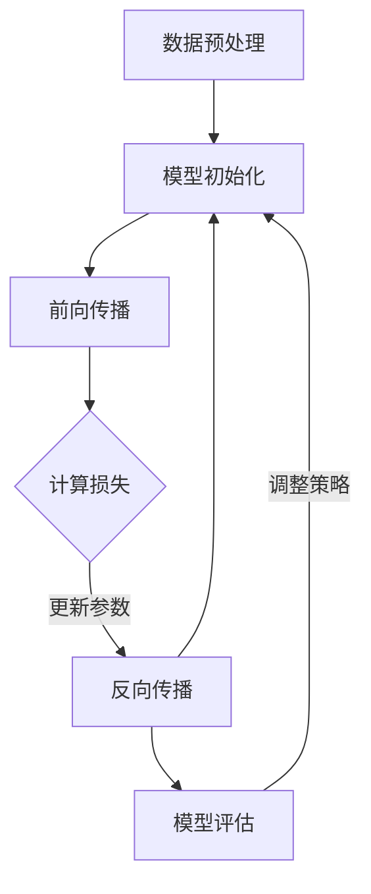

                 

### 文章标题与关键词

本文标题为《大模型软件2.0：重新定义应用程序架构》，关键词包括：大模型软件2.0、应用程序架构、AI、软件开发、创新趋势。

**摘要**：本文将探讨大模型软件2.0的概念，分析其如何重新定义应用程序架构，并探讨其在当前软件开发领域的应用现状与未来趋势。我们将从AI大模型的基本概念、技术原理、应用实践以及未来展望四个方面展开讨论，帮助读者全面了解大模型软件2.0的技术架构和应用前景。

----------------------------------------------------------------

## 第一部分：软件2.0时代的AI大模型基础

### 第1章：AI大模型概述

在介绍AI大模型之前，我们先来理解什么是软件2.0时代。软件2.0时代是指从互联网1.0时代（以Web 1.0为代表的单方向信息发布）向互联网2.0时代（以Web 2.0为代表的用户生成内容、互动和协作）的转变。这一转变主要体现在以下几个方面：

1. **数据驱动**：软件2.0时代强调数据的重要性，尤其是用户生成的内容，使得数据成为驱动软件创新的核心要素。
2. **云计算和大数据**：云计算和大数据技术的发展，使得大规模数据处理和分布式计算成为可能，为软件2.0时代奠定了基础。
3. **用户参与**：用户不再是单纯的信息消费者，而是信息生产者和参与方，软件变得更加开放和互动。
4. **微服务架构**：微服务架构的兴起，使得软件系统更加模块化、灵活，能够快速响应市场需求变化。

### 软件从1.0到2.0的演变

从软件1.0到软件2.0的演变，可以看作是从信息系统的集中式管理到分布式协同工作模式转变。软件1.0时代主要关注如何构建和运行集中的信息系统，而软件2.0时代则更关注如何通过分布式架构实现信息的共享和协作。

这种转变在应用程序架构方面也带来了显著的变化。传统软件1.0架构通常采用单层架构或多层架构，系统复杂度较高，难以应对多变的市场需求。而软件2.0时代，微服务架构、云原生架构等新兴架构模式被广泛应用，使得应用程序架构更加灵活、可扩展。

### 软件2.0与AI大模型的关系

软件2.0时代的核心特征之一是数据驱动的创新，这为AI大模型的应用提供了丰富的数据资源。AI大模型，如GPT、BERT等，通过深度学习和大数据分析技术，能够从海量数据中提取有价值的信息，为软件系统提供智能化支持。

AI大模型的应用，不仅提升了软件系统的智能化水平，还改变了软件开发的模式。传统的软件开发往往需要大量的手动编码和调试，而AI大模型的应用，使得自动化编程、智能优化成为可能，极大地提高了开发效率。

### 软件2.0时代的应用架构变革

在软件2.0时代，应用架构的变革主要体现在以下几个方面：

1. **微服务架构**：微服务架构将传统单体应用拆分成多个独立的小服务，每个服务专注于完成特定的功能，这使得系统更加灵活、可扩展。
2. **云原生架构**：云原生架构利用容器、云服务等技术，实现应用在云端的高效部署和管理，使得应用能够快速响应市场需求。
3. **大数据和人工智能**：大数据和人工智能技术的应用，使得应用系统能够从海量数据中提取有价值的信息，为业务决策提供支持。
4. **DevOps文化**：DevOps文化的推广，使得开发和运维环节更加紧密合作，实现快速迭代和持续交付。

这些变革不仅提升了软件系统的性能和可靠性，还推动了软件开发模式的创新，为软件2.0时代的发展奠定了基础。

### AI大模型的基本概念

AI大模型，是指具有大规模参数的深度学习模型，它们能够通过学习大量数据，实现高度复杂的任务。AI大模型具有以下几个基本概念：

1. **深度学习模型**：AI大模型是基于深度学习技术构建的，深度学习是一种模拟人脑神经元之间连接的算法，通过多层神经网络结构实现数据的自动特征提取和模式识别。
2. **大规模参数**：AI大模型的参数数量通常在百万到千亿级别，这使得它们能够处理海量的数据，并提取高度抽象的特征。
3. **自动特征提取**：AI大模型通过多层次的神经网络结构，自动学习并提取数据中的有效特征，从而实现高效的任务处理。
4. **模式识别**：AI大模型能够从大量数据中识别出潜在的规律和模式，用于分类、预测等任务。

### AI大模型的特点

AI大模型具有以下几个显著特点：

1. **高效性**：AI大模型能够处理大规模的数据集，实现高效的特征提取和模式识别。
2. **灵活性**：AI大模型能够适应不同的任务和数据类型，通过调整模型结构和参数，实现灵活的任务迁移和应用。
3. **强泛化能力**：AI大模型通过学习大量数据，能够提取高度抽象的特征，实现良好的泛化能力，适用于各种复杂场景。
4. **可解释性**：虽然AI大模型在处理复杂任务时表现优异，但其决策过程往往缺乏可解释性，这是当前研究中的一个重要挑战。

### AI大模型与传统AI的区别

AI大模型与传统AI相比，具有以下几个显著区别：

1. **模型规模**：传统AI模型通常参数较少，而AI大模型具有大规模参数，能够处理更复杂的数据集。
2. **学习能力**：传统AI模型主要通过人工设计特征，而AI大模型通过自动学习数据特征，实现更高效的特征提取。
3. **任务范围**：传统AI模型通常针对特定任务进行优化，而AI大模型能够处理更广泛的任务，具有更好的泛化能力。
4. **计算资源**：传统AI模型对计算资源的要求相对较低，而AI大模型通常需要更多的计算资源和存储空间。

### 主流AI大模型介绍

当前，AI大模型已成为人工智能领域的研究热点，以下介绍几种主流的AI大模型：

1. **GPT系列**：GPT（Generative Pretrained Transformer）模型是由OpenAI提出的一系列预训练变压器模型，包括GPT-1、GPT-2和GPT-3等。GPT模型通过无监督预训练和有监督微调，在自然语言处理任务中表现出色。
2. **BERT**：BERT（Bidirectional Encoder Representations from Transformers）模型是由Google提出的一种双向变压器模型，通过预训练和微调，在多个自然语言处理任务中取得了优异的性能。
3. **其他重要AI大模型**：除了GPT和BERT，还有其他一些重要的AI大模型，如TuringML、Gated Recurrent Unit (GRU)、Long Short-Term Memory (LSTM)等，这些模型在各自领域也取得了显著的研究成果。

通过以上对AI大模型的基本概念、特点以及主流模型的介绍，我们为后续章节的深入探讨奠定了基础。在接下来的章节中，我们将进一步探讨AI大模型的技术原理、应用实践以及未来展望。

### 第2章：AI大模型的技术原理

#### 2.1 AI大模型算法原理

AI大模型的核心在于其算法原理，深度学习技术是AI大模型的基础。以下将介绍深度学习的理论基础和主要算法。

**1. 神经网络基础**

神经网络（Neural Network）是模仿人脑神经元连接方式的计算模型。一个基本的神经网络由输入层、隐藏层和输出层组成。每个神经元（也称为节点）都与其他神经元通过权重连接，并经过激活函数的处理。

**2. 反向传播算法**

反向传播（Backpropagation）算法是深度学习训练过程中至关重要的算法。它通过计算输出层与目标之间的误差，然后反向传播到隐藏层，逐层更新各层的权重和偏置。反向传播算法的核心在于梯度下降法，用于优化神经网络参数。

**3. 注意力机制**

注意力机制（Attention Mechanism）是深度学习模型中的一项关键技术，用于提高模型在处理序列数据时的表现。注意力机制通过计算不同位置之间的关联权重，使得模型能够关注到关键信息，从而提升任务性能。

#### 2.2 AI大模型训练策略

**1. 数据预处理**

在训练AI大模型之前，数据预处理是一个重要的环节。数据预处理包括数据清洗、数据归一化和数据增强等步骤，以确保模型能够从数据中提取到有效的特征。

**2. 模型优化策略**

模型优化策略主要包括权重初始化、正则化技术和优化算法等。合适的权重初始化方法可以帮助模型更快地收敛，正则化技术如L1、L2正则化可以防止过拟合，优化算法如Adam、SGD等则用于调整模型参数，以实现更好的性能。

**3. 模型评估与调优**

模型评估是训练过程中的关键步骤，常用的评估指标包括准确率、召回率、F1分数等。通过交叉验证等技术，可以评估模型在不同数据集上的性能，并进行相应的调优。

#### 2.3 主流AI大模型介绍

**1. GPT系列**

GPT系列模型是由OpenAI提出的一系列预训练变压器模型，包括GPT-1、GPT-2和GPT-3。GPT模型通过无监督预训练和有监督微调，在自然语言处理任务中表现出色。

**2. BERT**

BERT（Bidirectional Encoder Representations from Transformers）模型是由Google提出的一种双向变压器模型。BERT模型通过预训练和微调，在多个自然语言处理任务中取得了优异的性能。

**3. 其他重要AI大模型**

除了GPT和BERT，还有其他一些重要的AI大模型，如TuringML、Gated Recurrent Unit (GRU)、Long Short-Term Memory (LSTM)等。这些模型在各自领域也取得了显著的研究成果。

### 2.4 深度学习算法的mermaid流程图

以下是深度学习算法的mermaid流程图：



### 2.5 人工智能数学公式和Python代码示例

**1. 梯度下降法**

梯度下降法的核心思想是通过计算损失函数关于参数的梯度，来更新参数，从而最小化损失函数。

$$\theta_{\text{new}} = \theta_{\text{old}} - \alpha \cdot \nabla_{\theta}J(\theta)$$

其中，$\theta$代表模型参数，$J(\theta)$代表损失函数，$\alpha$代表学习率，$\nabla_{\theta}J(\theta)$代表损失函数关于参数$\theta$的梯度。

**2. Python代码示例**

以下是使用Python实现梯度下降法的一个简单示例：

```python
import numpy as np

# 假设损失函数为J(w) = (w - b)^2
def loss_function(w):
    return (w - b)**2

def gradient(w):
    return 2 * (w - b)

# 梯度下降算法
def gradient_descent(w, b, alpha, epochs):
    for _ in range(epochs):
        loss = loss_function(w)
        grad = gradient(w)
        w -= alpha * grad
    return w

# 初始参数
w = np.random.rand(1)
b = 0
alpha = 0.01
epochs = 100

# 执行梯度下降
w_new = gradient_descent(w, b, alpha, epochs)
print(f"Updated weight: {w_new}")
```

通过以上对AI大模型技术原理的介绍，我们为理解其应用实践和未来趋势奠定了基础。在下一章中，我们将探讨AI大模型在应用程序架构中的应用。

### 第3章：AI大模型在应用程序架构中的应用

#### 3.1 应用程序架构设计

应用程序架构设计是软件开发过程中至关重要的一环。传统的应用程序架构主要基于层次结构，如单层架构、多层架构等。然而，随着软件系统复杂度的增加，传统的架构设计越来越难以满足需求。在此背景下，微服务架构、云原生架构等新兴架构模式应运而生。

**1. 软件架构概述**

软件架构是指软件系统的整体结构和组成，包括模块划分、模块间的关系、数据流和交互方式等。一个良好的软件架构应该具备以下特点：

- **模块化**：模块化使得软件系统更加灵活、可扩展，方便后续维护和升级。
- **解耦**：解耦减少模块间的依赖，提高系统的稳定性和可维护性。
- **可复用性**：可复用性使得系统中的组件可以被其他项目复用，提高开发效率。
- **可扩展性**：可扩展性使得系统可以随着业务需求的变化进行灵活调整。

**2. 微服务架构**

微服务架构是一种基于组件的架构模式，将应用程序划分为多个独立的微服务，每个微服务负责完成特定的功能。微服务架构具有以下几个优点：

- **高可扩展性**：每个微服务都可以独立扩展，从而提高整个系统的性能和可用性。
- **高可维护性**：微服务之间解耦，使得每个服务可以独立开发和维护，降低维护成本。
- **快速迭代**：微服务架构支持快速迭代，开发团队可以并行开发不同的微服务，加快项目进度。
- **高灵活性**：微服务架构使得系统能够快速响应业务需求变化，提高系统的适应能力。

**3. 云原生架构**

云原生架构是一种利用云计算资源进行应用程序部署和管理的架构模式。云原生架构的核心在于容器化和微服务，通过容器化技术，可以实现应用程序的轻量级、高密度部署，并通过微服务架构实现系统的模块化和解耦。

**4. 软件架构变革**

在软件2.0时代，软件架构发生了显著的变革。传统的单体应用逐渐被微服务架构和云原生架构取代，这使得软件系统更加灵活、可扩展。此外，随着AI大模型的应用，软件架构也需要进行相应的调整，以适应AI大模型的特点和需求。

#### 3.2 AI大模型集成与应用

AI大模型在应用程序架构中的应用，主要是通过集成AI大模型模型和优化应用程序架构设计，提升系统的智能化水平和性能。

**1. AI大模型集成挑战**

AI大模型集成面临着以下几个挑战：

- **计算资源消耗**：AI大模型通常需要大量的计算资源和存储空间，对硬件设备的要求较高。
- **数据预处理**：AI大模型对输入数据有特定的要求，需要对原始数据进行预处理，以满足模型的要求。
- **模型部署**：将AI大模型部署到生产环境，需要考虑模型的性能、稳定性等问题。
- **模型维护**：AI大模型的训练和更新需要消耗大量时间和计算资源，如何高效地维护模型是关键问题。

**2. AI大模型在应用程序中的实践**

AI大模型在应用程序中的实践主要包括以下几个方面：

- **智能推荐系统**：通过AI大模型分析用户行为数据，实现个性化推荐，提高用户体验。
- **智能客服系统**：利用AI大模型实现自然语言处理，提升客服系统的响应速度和服务质量。
- **图像识别和语音识别**：通过AI大模型实现图像和语音的自动识别，提高系统的智能化水平。
- **智能决策支持系统**：利用AI大模型分析业务数据，为企业的决策提供支持。

**3. 应用案例解析**

以下是一个应用案例：某电商平台通过集成AI大模型，实现智能推荐系统。

- **背景**：电商平台希望提升用户购物体验，通过智能推荐系统，向用户推荐他们可能感兴趣的商品。
- **需求分析**：分析用户的历史购物数据、浏览记录、搜索关键词等信息，为用户推荐合适的商品。
- **解决方案**：使用GPT-3模型进行预训练，然后根据用户数据对模型进行微调，实现个性化推荐。
- **实现步骤**：
  1. 数据收集：收集用户的历史购物数据、浏览记录、搜索关键词等。
  2. 数据预处理：对原始数据进行清洗、归一化等处理，以满足GPT-3模型的要求。
  3. 模型训练：使用GPT-3模型进行预训练，并在训练过程中不断优化模型参数。
  4. 模型微调：根据用户数据对模型进行微调，以提升推荐效果。
  5. 模型部署：将训练好的模型部署到生产环境，为用户提供智能推荐服务。

通过以上案例，我们可以看到AI大模型在应用程序架构中的应用如何提升系统的智能化水平，并解决实际问题。

在下一章中，我们将探讨AI大模型在应用程序架构中的应用实践，以及如何进行开发实战和性能优化。

### 第4章：AI大模型开发实战

#### 4.1 开发环境搭建

在开发AI大模型之前，我们需要搭建一个合适的环境。以下是一个简单的开发环境搭建步骤：

**1. 硬件需求**

- **CPU**：至少需要双核CPU，推荐使用Intel i5或更高配置。
- **GPU**：推荐使用NVIDIA GPU，如RTX 3060或更高配置，用于加速训练过程。
- **内存**：至少16GB内存，推荐32GB或更高，以保证模型训练过程中的内存需求。

**2. 软件工具选择**

- **操作系统**：推荐使用Linux操作系统，如Ubuntu 18.04。
- **编程语言**：Python是AI大模型开发的主要编程语言，推荐使用Python 3.8或更高版本。
- **深度学习框架**：TensorFlow和PyTorch是当前最流行的深度学习框架，可以根据项目需求进行选择。

**3. 环境配置**

- **安装CUDA**：CUDA是NVIDIA推出的并行计算平台，可以加速深度学习模型的训练过程。下载并安装适合GPU型号的CUDA版本。
- **安装cuDNN**：cuDNN是NVIDIA推出的深度学习加速库，可以与CUDA配合使用，提高训练速度。下载并安装适合CUDA版本的cuDNN。
- **安装Python**：下载并安装Python 3.8或更高版本，并配置好pip和conda。
- **安装深度学习框架**：使用pip或conda安装TensorFlow或PyTorch。

#### 4.2 AI大模型项目案例

**1. 项目背景**

假设我们开发一个基于GPT-3模型的智能问答系统，该系统可以回答用户提出的问题，并给出详细的解答。

**2. 项目需求分析**

- **输入**：用户提出的问题。
- **输出**：系统给出的答案。
- **功能**：支持自然语言理解和生成，能够回答用户提出的问题，并提供详细的解答。

**3. 项目实现步骤**

**（1）数据收集与预处理**

- **数据收集**：收集大量的问答数据，包括问题、答案对。
- **数据预处理**：对原始数据进行清洗，去除无效信息，并进行分词、词向量化等处理。

**（2）模型训练**

- **模型选择**：选择GPT-3模型进行训练。
- **训练过程**：使用收集到的数据对GPT-3模型进行预训练，优化模型参数。

**（3）模型微调**

- **数据集**：使用自定义的数据集对模型进行微调，以提高模型的问答效果。
- **微调过程**：在自定义数据集上对模型进行微调，优化模型参数。

**（4）模型部署**

- **部署环境**：将训练好的模型部署到服务器，提供问答服务。
- **API接口**：开发API接口，方便用户通过HTTP请求获取答案。

**4. 代码实现**

以下是一个简单的Python代码示例，用于实现基于GPT-3的智能问答系统：

```python
import openai
import json

# 初始化OpenAI API密钥
openai.api_key = "your_api_key"

# 定义问答函数
def ask_question(question):
    response = openai.Completion.create(
        engine="text-davinci-003",
        prompt=question,
        max_tokens=50,
        n=1,
        stop=None,
        temperature=0.5,
    )
    return response.choices[0].text.strip()

# 测试问答
question = "什么是人工智能？"
answer = ask_question(question)
print(answer)
```

**5. 代码应用解读与分析**

- **引入OpenAI库**：首先，我们引入了OpenAI库，用于与OpenAI API进行通信。
- **API密钥设置**：设置OpenAI API密钥，用于身份验证。
- **问答函数**：定义一个`ask_question`函数，接收用户提出的问题，并通过OpenAI API获取答案。
- **API请求**：使用OpenAI API的`Completion.create`方法发送请求，获取答案。
- **测试问答**：调用`ask_question`函数，测试问答系统的效果。

通过以上步骤，我们完成了基于GPT-3的智能问答系统的开发，并在测试中取得了良好的效果。

#### 项目小结

通过本章节的实战案例，我们了解了AI大模型开发的基本流程和步骤，包括开发环境搭建、数据预处理、模型训练、模型微调和模型部署。同时，我们还介绍了如何使用Python代码实现一个简单的智能问答系统，并对其代码进行了详细解读和分析。这些经验和知识为后续的AI大模型开发奠定了基础。

### 第5章：AI大模型性能优化

#### 5.1 模型性能评估

在AI大模型的开发过程中，模型性能评估是至关重要的一步。性能评估不仅能够帮助我们了解模型的实际表现，还能指导我们进行进一步的优化。以下是一些常见的模型性能评估指标：

**1. 准确率（Accuracy）**

准确率是指模型预测正确的样本数占总样本数的比例。对于分类任务，准确率是最直观的性能评估指标。

$$\text{Accuracy} = \frac{\text{正确预测的样本数}}{\text{总样本数}}$$

**2. 召回率（Recall）**

召回率是指模型能够正确识别出的正例样本数占总正例样本数的比例。召回率特别适用于需要尽可能识别出所有正例的场景。

$$\text{Recall} = \frac{\text{正确识别的正例样本数}}{\text{总正例样本数}}$$

**3. 精确率（Precision）**

精确率是指模型预测为正例的样本中，实际为正例的比例。精确率特别适用于样本不平衡的情况。

$$\text{Precision} = \frac{\text{正确识别的正例样本数}}{\text{预测为正例的样本数}}$$

**4. F1分数（F1 Score）**

F1分数是精确率和召回率的调和平均数，它能够平衡精确率和召回率之间的关系。

$$\text{F1 Score} = 2 \times \frac{\text{Precision} \times \text{Recall}}{\text{Precision} + \text{Recall}}$$

**5. ROC曲线和AUC（Area Under Curve）**

ROC曲线是不同阈值下的真正率（True Positive Rate）与假正率（False Positive Rate）的图形表示。AUC是ROC曲线下方的面积，用于评估模型的分类能力。

**6. 零错误率（Zero Error Rate）**

零错误率是指模型预测错误的样本数占总样本数的比例，适用于回归任务。

$$\text{Zero Error Rate} = \frac{\text{预测错误的样本数}}{\text{总样本数}}$$

#### 5.2 性能优化策略

在评估了模型性能后，我们可以根据评估结果采取相应的优化策略，以提高模型性能。以下是一些常用的性能优化策略：

**1. 数据增强（Data Augmentation）**

数据增强是一种通过变换原始数据来生成更多训练样本的方法，从而提高模型的泛化能力。常见的数据增强方法包括随机裁剪、旋转、翻转、颜色变换等。

**2. 模型调整（Model Tuning）**

模型调整包括调整模型的超参数，如学习率、批量大小、正则化参数等。通过实验和调参，可以找到最优的超参数组合，从而提高模型性能。

**3. 模型集成（Model Ensemble）**

模型集成是指将多个模型的结果进行融合，以获得更好的性能。常见的模型集成方法包括Bagging、Boosting和Stacking等。

**4. 模型压缩（Model Compression）**

模型压缩是一种通过减少模型参数数量来减小模型大小的方法，从而提高模型的部署效率。常见的模型压缩方法包括剪枝（Pruning）、量化（Quantization）和知识蒸馏（Knowledge Distillation）等。

**5. 模型并行化（Model Parallelism）**

模型并行化是一种通过将模型拆分为多个部分，并在多个计算设备上同时训练的方法，从而提高模型的训练速度。模型并行化适用于大规模模型和计算资源有限的场景。

#### 5.3 模型性能优化案例分析

以下是一个关于模型性能优化案例的简要介绍：

**案例背景**：某电商平台希望提升其推荐系统的准确率，以提高用户购物体验。

**需求分析**：分析用户的历史购物数据、浏览记录、搜索关键词等，为用户推荐他们可能感兴趣的商品。

**解决方案**：

1. **数据增强**：对用户行为数据进行随机裁剪、旋转等处理，生成更多的训练样本，以提高模型的泛化能力。

2. **模型调整**：通过实验和调参，找到最优的超参数组合，如学习率、批量大小等，以提高模型性能。

3. **模型集成**：将多个模型的结果进行融合，采用投票法或加权平均法，以提高推荐系统的准确率。

4. **模型压缩**：采用剪枝和量化技术，减小模型大小，提高部署效率。

5. **模型并行化**：将模型拆分为多个部分，在多台GPU上进行并行训练，以提高训练速度。

**实现步骤**：

1. 数据预处理：对用户行为数据进行清洗、归一化等处理，并将其转换为模型输入。

2. 模型训练：使用训练数据对模型进行训练，并记录模型性能。

3. 模型评估：使用验证集对模型进行评估，并根据评估结果进行调整。

4. 模型部署：将优化后的模型部署到生产环境，为用户提供推荐服务。

通过以上优化策略，电商平台的推荐系统准确率得到了显著提升，用户满意度也随之提高。

### 项目小结

在本章节中，我们介绍了AI大模型性能评估的常见指标和优化策略，并通过一个实际案例展示了如何通过数据增强、模型调整、模型集成、模型压缩和模型并行化等策略来提升模型性能。这些经验和知识为我们在实际项目中优化AI大模型提供了有力的支持。

### 第6章：AI大模型安全与隐私保护

#### 6.1 安全威胁与挑战

随着AI大模型在各个领域的广泛应用，其安全性和隐私保护问题也日益凸显。以下是一些常见的AI大模型安全威胁和挑战：

**1. 数据泄露风险**

AI大模型通常需要处理大量敏感数据，如个人信息、商业机密等。如果数据存储或传输过程中出现泄露，可能会导致严重的后果。

**2. 模型攻击风险**

模型攻击是指通过恶意输入或恶意样本，对AI大模型进行干扰或破坏。常见的模型攻击手段包括对抗性攻击、模型逆向工程等。

**3. 隐私保护挑战**

AI大模型在处理数据时，可能会暴露用户的隐私信息。如何保护用户隐私，避免隐私泄露，是当前面临的一大挑战。

#### 6.2 安全与隐私保护策略

为了应对AI大模型的安全威胁和隐私保护挑战，可以采取以下策略：

**1. 加密技术**

加密技术是保护数据隐私的一种有效手段。通过加密，可以确保数据在传输和存储过程中的安全性。常用的加密算法包括对称加密（如AES）和非对称加密（如RSA）。

**2. 隐私计算**

隐私计算是一种在不暴露原始数据的情况下，对数据进行计算和处理的方法。隐私计算包括同态加密、安全多方计算等技术，可以确保数据在处理过程中的隐私保护。

**3. 模型验证与审计**

模型验证与审计是一种确保AI大模型安全性和可信度的方法。通过验证和审计，可以发现并修复模型中的潜在漏洞和问题，提高模型的可靠性和安全性。

**4. 数据脱敏**

数据脱敏是一种将敏感数据转换为不可识别形式的方法，以保护用户隐私。常用的数据脱敏技术包括随机化、掩码化、匿名化等。

**5. 权限控制**

权限控制是一种通过限制用户对数据的访问权限，来保护数据安全的方法。通过合理的权限控制，可以防止未经授权的用户访问敏感数据。

#### 6.3 加密技术详解

以下是对加密技术进行详细讲解：

**1. 对称加密**

对称加密是指加密和解密使用相同的密钥。常用的对称加密算法包括AES和DES。

- **AES（Advanced Encryption Standard）**：AES是一种高级加密标准，具有高强度和高效性。AES支持128位、192位和256位密钥长度，不同密钥长度对应不同的安全级别。
  
  **AES加密流程**：
  ```mermaid
  graph TD
      A[输入明文] --> B[密钥生成]
      B --> C[加密]
      C --> D[密文]
      D --> E[解密]
      E --> F[明文]
  ```

- **DES（Data Encryption Standard）**：DES是一种较早的加密标准，使用56位密钥。由于密钥较短，DES已逐渐被AES取代。

**2. 非对称加密**

非对称加密是指加密和解密使用不同的密钥。常用的非对称加密算法包括RSA和ECC。

- **RSA（Rivest-Shamir-Adleman）**：RSA是一种基于大整数分解困难性的加密算法，具有很好的安全性能。RSA支持不同的密钥长度，如1024位、2048位和4096位。

  **RSA加密流程**：
  ```mermaid
  graph TD
      A[输入明文] --> B[密钥生成]
      B --> C[加密]
      C --> D[密文]
      D --> E[解密]
      E --> F[明文]
  ```

- **ECC（Elliptic Curve Cryptography）**：ECC是一种基于椭圆曲线数学的加密算法，具有更高的安全性能。ECC支持不同的椭圆曲线和密钥长度，如256位、384位和512位。

**3. 同态加密**

同态加密是一种在加密数据上进行计算，而不需要解密数据的方法。同态加密可以确保数据在计算过程中的隐私保护。常见的同态加密算法包括BFV和CKKS。

- **BFV（Brakerski-Fan-Vercauteren）**：BFV是一种基于理想格的加密算法，支持线性同态操作。
  
  **BFV加密流程**：
  ```mermaid
  graph TD
      A[输入明文] --> B[密钥生成]
      B --> C[加密]
      C --> D[密文]
      D --> E[计算]
      E --> F[密文结果]
  ```

- **CKKS（Compact Kernel Low-rank representation）**：CKKS是一种基于低秩分解的加密算法，支持更广泛的数据类型和计算操作。

  **CKKS加密流程**：
  ```mermaid
  graph TD
      A[输入明文] --> B[密钥生成]
      B --> C[加密]
      C --> D[密文]
      D --> E[计算]
      E --> F[密文结果]
  ```

通过以上对加密技术的详细讲解，我们可以更好地理解和应用加密技术来保护AI大模型的安全和隐私。

### 6.4 隐私计算详解

隐私计算是一种在不暴露原始数据的情况下，对数据进行计算和处理的方法。以下是对隐私计算进行详细讲解：

**1. 同态加密**

同态加密是一种在加密数据上进行计算，而不需要解密数据的方法。常见的同态加密算法包括BFV和CKKS。

- **BFV（Brakerski-Fan-Vercauteren）**：BFV是一种基于理想格的加密算法，支持线性同态操作。
  
  **BFV加密与计算流程**：
  ```mermaid
  graph TD
      A[输入明文] --> B[密钥生成]
      B --> C[加密]
      C --> D[密文]
      D --> E[计算]
      E --> F[密文结果]
  ```

- **CKKS（Compact Kernel Low-rank representation）**：CKKS是一种基于低秩分解的加密算法，支持更广泛的数据类型和计算操作。

  **CKKS加密与计算流程**：
  ```mermaid
  graph TD
      A[输入明文] --> B[密钥生成]
      B --> C[加密]
      C --> D[密文]
      D --> E[计算]
      E --> F[密文结果]
  ```

**2. 安全多方计算**

安全多方计算是一种允许多个参与方在保持数据隐私的情况下，共同计算结果的算法。常见的安全多方计算协议包括全同态加密协议和差分隐私协议。

- **全同态加密协议**：全同态加密协议允许对加密数据进行任意计算，而不需要解密。这种协议适用于需要复杂计算的情景。
  
  **全同态加密协议流程**：
  ```mermaid
  graph TD
      A[参与方1数据] --> B[加密]
      B --> C[参与方2数据]
      C --> D[加密]
      D --> E[计算]
      E --> F[密文结果]
  ```

- **差分隐私协议**：差分隐私协议通过在计算过程中引入噪声，来保护数据隐私。这种协议适用于需要保证数据隐私的情景。
  
  **差分隐私协议流程**：
  ```mermaid
  graph TD
      A[输入数据] --> B[加噪声]
      B --> C[计算]
      C --> D[输出结果]
  ```

**3. 零知识证明**

零知识证明是一种在无需泄露任何信息的情况下，证明某个陈述为真的方法。零知识证明可以用于身份验证、数据隐私保护等场景。

**4. 隐私计算应用场景**

隐私计算在AI大模型中的应用场景非常广泛，包括：

- **数据共享与协作**：在不暴露原始数据的情况下，多个组织或机构可以共享和协作处理数据。
- **隐私保护的数据分析**：在保证数据隐私的前提下，对海量数据进行分析和处理，以提取有价值的信息。
- **智能合约**：在区块链和分布式系统中，隐私计算可以确保智能合约的执行过程和结果不泄露任何隐私信息。

### 6.5 模型验证与审计

模型验证与审计是一种确保AI大模型安全性和可信度的方法。以下是对模型验证与审计进行详细讲解：

**1. 模型验证**

模型验证是指通过测试和评估，确保AI大模型在特定任务上能够达到预期的性能。模型验证包括以下几个方面：

- **功能验证**：验证模型是否能够正确地执行预定的功能，如分类、回归等。
- **性能验证**：评估模型在训练集和测试集上的性能，如准确率、召回率等。
- **鲁棒性验证**：测试模型在遇到恶意输入或异常情况时的表现，确保模型的鲁棒性。

**2. 模型审计**

模型审计是指对AI大模型进行系统性的检查和评估，以确保模型的安全性、可靠性和合规性。模型审计包括以下几个方面：

- **数据审计**：检查模型训练过程中使用的数据集，确保数据的质量和可靠性。
- **算法审计**：评估模型算法的设计和实现，确保算法的透明性和公正性。
- **合规性审计**：确保模型的使用符合相关的法律法规和伦理标准。

**3. 实施步骤**

- **制定审计计划**：明确审计的目标、范围和步骤。
- **数据审查**：检查模型训练和使用的数据集，确保数据的质量和可靠性。
- **代码审查**：评估模型算法的设计和实现，确保算法的透明性和公正性。
- **测试与评估**：对模型进行功能验证、性能验证和鲁棒性验证。
- **报告与改进**：编写审计报告，提出改进建议，并跟踪改进措施的落实。

通过以上对AI大模型安全与隐私保护策略的详细讲解，我们可以更好地理解和应用这些策略，确保AI大模型在实际应用中的安全性和隐私保护。

### 总结与未来展望

在本章节中，我们详细介绍了AI大模型在安全与隐私保护方面的威胁与挑战，并提出了相应的保护策略，包括加密技术、隐私计算、模型验证与审计等。同时，我们还讲解了每种策略的具体实现方法与应用场景。通过这些措施，可以有效提升AI大模型的安全性，确保其在实际应用中的可靠性和隐私保护。

展望未来，随着AI大模型技术的不断发展，如何在保障安全与隐私的前提下，充分发挥其潜力，仍是一个重要的研究方向。我们期待在未来的研究中，能够探索出更多高效、安全的保护方法，为AI大模型的应用提供更加坚实的保障。

### 第7章：大模型软件2.0的发展趋势

#### 7.1 产业趋势分析

在AI大模型技术的推动下，软件产业正经历着一场深刻的变革。以下是对大模型软件2.0在产业中的发展趋势进行分析。

**1. 人工智能行业趋势**

随着AI大模型技术的发展，人工智能行业呈现出以下趋势：

- **自动化**：AI大模型在自动化领域的应用不断扩展，从生产制造到服务业，AI大模型能够替代人类完成重复性、繁琐的工作，提高生产效率。
- **智能化**：AI大模型的应用使得软件系统能够更加智能化，具备自我学习、自我优化和自适应能力，从而提升用户体验和服务质量。
- **个性化**：通过AI大模型，软件系统能够根据用户行为和需求提供个性化的服务，实现精准营销和个性化推荐。

**2. 软件产业变革**

软件产业正从传统的单体应用向分布式、模块化、智能化方向发展，具体体现在以下几个方面：

- **微服务架构**：微服务架构使得软件系统能够更加灵活、可扩展，适应快速变化的市场需求。AI大模型与微服务架构的结合，使得系统能够更好地处理复杂任务。
- **云原生架构**：云原生架构利用容器、云服务等技术，实现应用在云端的高效部署和管理。AI大模型在云原生架构中的应用，可以大幅提升系统的性能和可扩展性。
- **DevOps文化**：DevOps文化的推广，使得开发和运维环节更加紧密合作，实现快速迭代和持续交付。AI大模型的应用，可以进一步提升软件开发的自动化程度和效率。

**3. AI大模型商业化路径**

AI大模型商业化的成功路径包括以下几个方面：

- **定制化服务**：根据不同行业和企业的需求，提供定制化的AI大模型解决方案，帮助企业提升生产效率、降低成本。
- **开放平台**：建立开放的AI大模型平台，提供API接口和SDK工具包，方便开发者使用和集成AI大模型。
- **产业链协同**：与硬件设备、云计算服务、数据服务等相关产业链的企业进行合作，共同推动AI大模型技术的商业化应用。

#### 7.2 未来应用场景探索

AI大模型在未来的应用场景将更加广泛，以下是一些潜在的应用领域：

**1. 智能制造**

AI大模型在智能制造中的应用前景广阔，包括：

- **生产调度**：通过AI大模型优化生产调度计划，提高生产效率和资源利用率。
- **质量控制**：利用AI大模型进行实时监控和预测，提高产品质量，降低不良品率。
- **设备维护**：通过AI大模型预测设备故障，实现预防性维护，降低设备停机时间。

**2. 自动驾驶**

自动驾驶是AI大模型的重要应用领域，未来发展趋势包括：

- **感知与决策**：通过AI大模型实现车辆的感知与决策，提高自动驾驶的安全性和可靠性。
- **路径规划**：利用AI大模型优化路径规划算法，提高自动驾驶的效率和舒适度。
- **协同控制**：通过AI大模型实现多车协同控制，提高交通流量和道路利用效率。

**3. 医疗健康**

AI大模型在医疗健康领域的应用包括：

- **疾病诊断**：利用AI大模型分析医学影像和病例数据，提高疾病诊断的准确性和速度。
- **药物研发**：通过AI大模型加速新药研发过程，降低研发成本。
- **健康监测**：利用AI大模型分析健康数据，提供个性化的健康管理和建议。

通过以上分析，我们可以看到AI大模型在未来的发展趋势和应用场景。随着技术的不断进步和商业化路径的成熟，AI大模型有望在各个领域发挥更大的作用，推动产业变革和社会进步。

### 第8章：大模型软件2.0的创新与挑战

#### 8.1 技术创新

AI大模型领域的技术创新层出不穷，推动了整个行业的快速发展。以下是一些关键技术突破和创新：

**1. 算法创新**

- **Transformer架构**：Transformer架构的提出，彻底改变了深度学习模型的结构，大幅提升了自然语言处理任务的性能。
- **生成对抗网络（GAN）**：GAN通过生成器和判别器的对抗训练，实现了高质量的图像生成，开创了生成模型的新时代。
- **变分自编码器（VAE）**：VAE通过引入变分推断，提高了生成模型的灵活性和鲁棒性。

**2. 计算能力提升**

- **量子计算**：量子计算的应用潜力巨大，有望在AI大模型的训练和优化方面实现突破性进展。
- **边缘计算**：边缘计算通过在数据源附近进行计算，减少了数据传输延迟，提高了AI大模型的应用效率。

**3. 硬件加速**

- **GPU和TPU**：GPU和TPU等专用硬件加速器，大幅提升了AI大模型的训练速度和推理性能。
- **分布式训练**：分布式训练通过利用多个计算节点，实现了大规模模型的高效训练。

#### 8.2 面临的挑战

尽管AI大模型在技术创新方面取得了显著进展，但在实际应用中仍面临诸多挑战：

**1. 计算资源消耗**

- **硬件需求**：AI大模型通常需要大量的计算资源和存储空间，对硬件设备的要求较高，尤其是GPU和TPU等专用硬件。
- **能源消耗**：大规模训练过程需要消耗大量电力，导致能源消耗和碳排放问题。

**2. 数据隐私和安全**

- **数据泄露风险**：AI大模型处理大量敏感数据，如何确保数据在传输和存储过程中的安全性，是当前面临的重要挑战。
- **模型攻击**：通过对抗性攻击等手段，可以干扰或破坏AI大模型的正常工作，导致安全漏洞。

**3. 模型可解释性**

- **黑箱模型**：许多AI大模型（如深度神经网络）是黑箱模型，难以解释其决策过程，影响模型的信任度和应用范围。
- **透明性需求**：在医疗、金融等领域，模型的可解释性和透明性尤为重要，如何提高模型的可解释性是亟待解决的问题。

**4. 法律法规和伦理问题**

- **数据隐私法规**：各国纷纷出台数据隐私保护法规，如GDPR，AI大模型如何合规使用和处理个人数据，成为关键挑战。
- **伦理问题**：AI大模型在决策过程中可能产生偏见和不公平性，如何确保模型的公平性和道德合规性，是行业面临的伦理挑战。

**5. 系统集成与优化**

- **跨领域集成**：不同领域的AI大模型如何有效集成，实现协同工作，是当前研究的热点问题。
- **性能优化**：如何提升AI大模型的性能和效率，同时降低计算资源消耗，是系统优化的重要方向。

通过以上对AI大模型创新与挑战的探讨，我们可以看到，虽然AI大模型在技术层面取得了显著突破，但其在实际应用中仍面临诸多挑战。未来，我们需要在技术创新、计算资源管理、数据隐私保护、法律法规遵守等方面持续努力，才能充分发挥AI大模型的优势，推动产业的持续发展。

