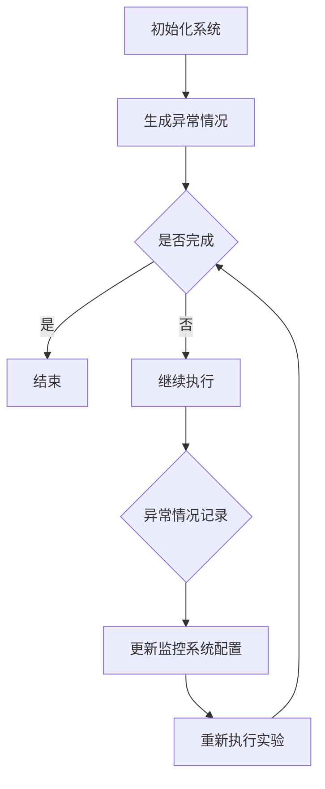
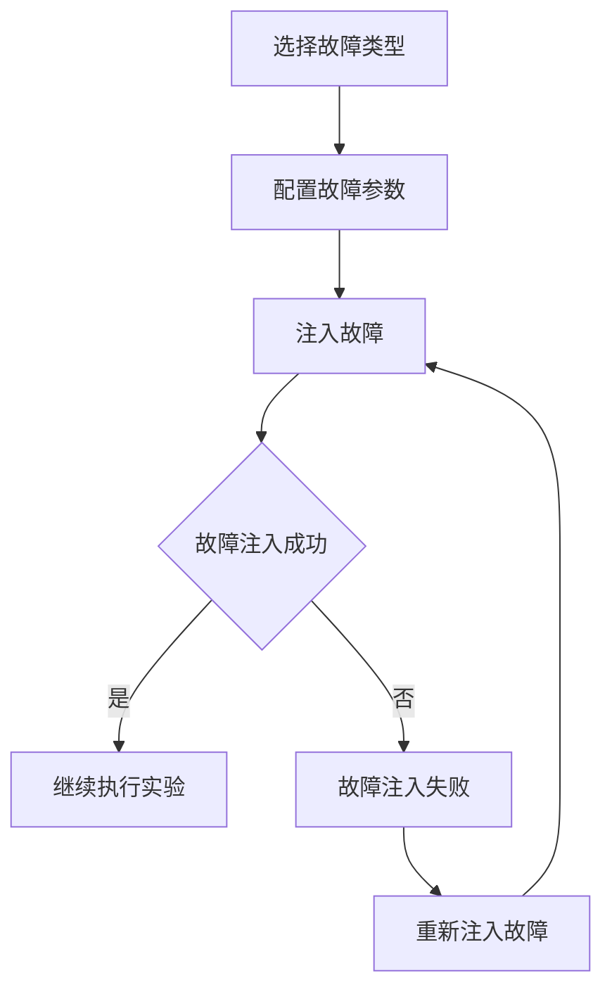
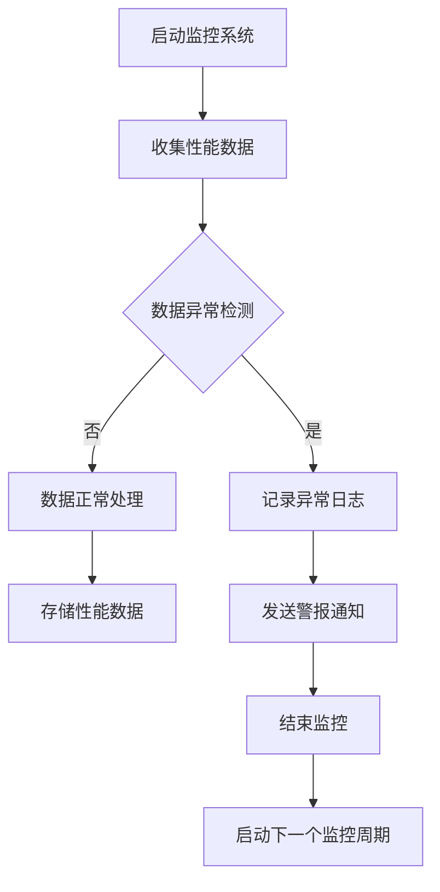
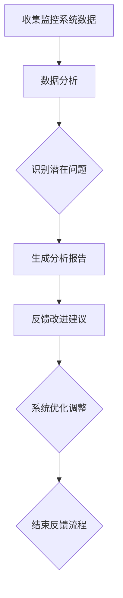
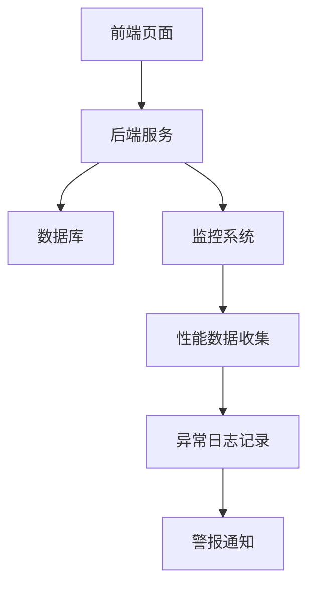

                 

### 引言

#### 什么是大模型软件？

大模型软件指的是那些基于深度学习、神经网络等技术构建的，具有巨大参数量和复杂结构的软件系统。这些软件常常用于图像识别、自然语言处理、预测分析等复杂任务。它们的核心特点是高度依赖数据质量和计算资源，具有强大的模型表达能力和优秀的泛化能力。

#### 混沌工程的概念

混沌工程是一种新兴的工程方法论，它通过故意引入意外和异常情况来测试和增强系统的弹性和可靠性。混沌工程的核心理念是“预防性失败”，即通过主动地引发故障，提前发现并解决问题，从而避免在真实环境中发生不可预测的严重故障。

#### 大模型软件中的混沌工程

大模型软件由于其复杂性，往往更容易受到各种异常情况的影响，例如数据异常、计算资源不足、软件缺陷等。因此，在大模型软件中进行混沌工程测试至关重要。它不仅能够帮助开发者发现潜在的问题，还能提升软件的鲁棒性和稳定性，确保其在实际应用中的可靠性。

### 背景介绍

#### 问题背景

在大模型软件的开发和运维过程中，面临的一个主要挑战是如何确保这些复杂系统在高负载、高并发环境下依然能够稳定运行。传统的测试方法往往侧重于功能测试和性能测试，但往往忽视了系统在遇到意外情况时的表现。这就导致了许多大模型软件在实际部署后，因为未能预见到并解决潜在的问题，而出现了严重的故障，甚至影响到整个业务系统的正常运行。

#### 问题描述

具体而言，大模型软件在以下方面存在潜在的风险：

1. **数据异常**：数据质量问题可能导致模型预测结果出现偏差，甚至完全错误。
2. **计算资源不足**：随着模型复杂度和数据量的增加，对计算资源的需求也急剧上升，可能导致系统崩溃或运行缓慢。
3. **软件缺陷**：代码中的bug或设计上的缺陷可能导致系统在特定情况下无法正常工作。

#### 问题解决

为了解决上述问题，混沌工程提供了一种新的思路，通过故意引入各种异常情况，对系统进行压力测试和脆弱性测试，从而提前发现并解决潜在的问题。这种方法不仅能够提升系统的鲁棒性，还能帮助开发者更全面地理解系统的行为和特性。

#### 边界与外延

混沌工程的适用范围不仅限于大模型软件，它也可以应用于其他复杂的软件系统，如分布式系统、云计算平台、容器化环境等。在不同的应用场景中，混沌工程的核心目标都是通过模拟真实的异常情况，提升系统的可靠性。

#### 概念结构与核心要素组成

混沌工程的核心概念包括：

1. **混沌实验**：通过故意引入异常情况，对系统进行测试。
2. **故障注入**：向系统中注入模拟的故障，以测试系统的响应能力。
3. **观测与分析**：收集系统在异常情况下的表现数据，进行分析和评估。
4. **反馈与优化**：根据分析结果，调整系统设计和实现，以提高其可靠性。

### 核心概念与联系

#### 核心概念原理

混沌工程的核心理念可以概括为“预防性失败”和“持续改进”。它强调通过主动地引入故障，提前发现和解决问题，从而避免在真实环境中发生不可预测的严重故障。具体来说，混沌工程的核心原理包括以下几个方面：

1. **故障注入**：通过模拟各种异常情况，如计算资源不足、数据异常、网络延迟等，对系统进行压力测试和脆弱性测试。
2. **持续监控**：实时监控系统的运行状态，收集各种性能指标和异常日志。
3. **分析反馈**：对监控系统收集到的数据进行分析，识别潜在的问题和弱点。
4. **优化调整**：根据分析结果，对系统进行优化和调整，提高其鲁棒性和可靠性。

#### 概念属性特征对比表格

| 特征               | 预防性失败                     | 持续改进                     |
|------------------|-----------------------------|-----------------------------|
| 目的               | 避免实际故障的发生               | 通过不断优化，提升系统性能和稳定性     |
| 方法               | 故障注入、持续监控、分析反馈、优化调整 | 故障注入、持续监控、分析反馈、优化调整 |
| 关键技术           | 故障注入、混沌实验设计           | 数据分析、性能优化、代码审查           |
| 应用范围            | 复杂的软件系统                 | 各类软件系统，特别是高负载、高并发环境   |

#### ER实体关系图架构

```mermaid
erDiagram
  SystemTest -->|has| ChaosExperiment
  ChaosExperiment -->|uses| FaultInjection
  FaultInjection -->|uses| MonitoringData
  MonitoringData -->|reports to| AnalysisResult
  AnalysisResult -->|affects| SystemOptimization
```

### 算法原理讲解

#### 混沌实验设计

混沌实验的设计是混沌工程的核心步骤之一。它的目的是通过故意引入故障，模拟系统在实际运行中可能遇到的各种异常情况。以下是一个简单的混沌实验设计的mermaid流程图：



#### 故障注入

故障注入是混沌实验的核心步骤，它通过模拟各种异常情况，如计算资源不足、数据异常、网络延迟等，来测试系统的响应能力。以下是一个故障注入的mermaid流程图：



#### 监控系统

监控系统是混沌工程的另一个关键环节，它负责实时监控系统的运行状态，并收集各种性能指标和异常日志。以下是一个监控系统的mermaid流程图：



#### 分析反馈

分析反馈是混沌工程的最后一个环节，它通过分析监控系统收集到的数据，识别潜在的问题和弱点，并提供改进建议。以下是一个分析反馈的mermaid流程图：



### 数学模型和公式

在混沌工程中，使用数学模型和公式来描述故障注入、监控系统、分析反馈等步骤是至关重要的。以下是一些常用的数学模型和公式：

1. **故障注入概率模型**：

   $$ P(F) = \alpha \cdot T $$

   其中，\( P(F) \) 表示故障注入概率，\( \alpha \) 为故障注入率，\( T \) 为实验周期。

2. **性能数据异常检测模型**：

   $$ D(x, y) = \frac{||x - y||_2}{||x||_2 + ||y||_2} $$

   其中，\( D(x, y) \) 表示两个向量 \( x \) 和 \( y \) 的距离，用于检测性能数据是否异常。

3. **分析报告生成模型**：

   $$ R = \sum_{i=1}^{n} w_i \cdot P_i $$

   其中，\( R \) 表示分析报告得分，\( w_i \) 表示权重，\( P_i \) 表示第 \( i \) 个潜在问题的概率。

#### 举例说明

假设我们进行一次混沌实验，实验周期为 \( T = 1000 \) 秒，故障注入率为 \( \alpha = 0.1 \)。那么，故障注入概率 \( P(F) \) 为：

$$ P(F) = 0.1 \cdot 1000 = 100 $$

这意味着在实验的1000秒内，我们预计会有100次故障注入。

假设我们在实验中收集了100条性能数据，使用距离公式 \( D(x, y) \) 来检测异常数据。假设其中一条数据 \( x \) 与其他99条数据的平均距离 \( y \) 为：

$$ D(x, y) = \frac{||x - y||_2}{||x||_2 + ||y||_2} = \frac{5}{10 + 5} = 0.5 $$

这个结果表示这条数据与其他数据的差异较大，我们可以初步判断它可能是一个异常数据。

最后，假设我们根据分析结果生成了一份分析报告，报告得分为 \( R = 0.8 \)。这意味着我们在分析过程中识别出了80%的潜在问题。

### 系统分析与架构设计方案

#### 问题场景介绍

在一个高负载、高并发的在线图像识别系统中，系统需要处理大量的图像数据，并对图像进行实时分类和标注。随着用户数量的增加，系统的负载也会急剧上升，这对系统的稳定性提出了严峻的挑战。在这种情况下，混沌工程可以帮助我们识别系统中的潜在问题，并优化系统性能。

#### 项目介绍

本项目旨在通过混沌工程方法，对在线图像识别系统进行全面的测试和优化，确保系统在高负载环境下依然能够稳定运行。具体目标包括：

1. 设计和实现一个混沌实验平台，用于模拟各种异常情况。
2. 对系统进行故障注入，测试其在异常情况下的响应能力和稳定性。
3. 收集和分析实验数据，识别系统的潜在问题和优化点。
4. 基于分析结果，对系统进行优化和调整，提高其鲁棒性和可靠性。

#### 系统功能设计

在线图像识别系统主要包括以下几个功能模块：

1. **图像数据接收模块**：负责接收用户上传的图像数据，并进行预处理。
2. **图像分类模块**：使用深度学习模型对图像进行分类，并生成标注结果。
3. **标注结果输出模块**：将分类结果输出到前端页面，供用户查看。
4. **监控系统**：负责实时监控系统的运行状态，并收集各种性能指标。

#### 系统架构设计

在线图像识别系统的整体架构设计如下：

1. **前端页面**：用于用户上传图像和查看标注结果。
2. **后端服务**：包括图像数据接收模块、图像分类模块、标注结果输出模块和监控系统。
3. **数据库**：用于存储用户上传的图像数据、分类结果和监控数据。

系统架构图如下：



#### 系统接口设计和系统交互

在线图像识别系统的接口设计和系统交互如下：

1. **图像数据接收接口**：用于接收用户上传的图像数据，并返回预处理结果。
2. **图像分类接口**：用于接收预处理后的图像数据，并返回分类结果。
3. **标注结果输出接口**：用于输出分类结果，并返回给前端页面。

系统交互序列图如下：

```mermaid
sequenceDiagram
    participant 用户 as 用户
    participant 前端页面 as 前端
    participant 后端服务 as 后端
    participant 数据库 as DB
    participant 监控系统 as 监控

    用户->>前端：上传图像
    前端->>后端：发送图像数据
    后端->>数据库：存储图像数据
    后端->>图像分类模块：分类图像
    后端->>标注结果输出模块：输出标注结果
    前端->>用户：展示标注结果

    监控系统->>后端：收集性能数据
    后端->>监控系统：返回性能数据
    监控系统->>异常日志记录：记录异常日志
    监控系统->>警报通知：发送警报通知
```

### 项目实战

#### 环境安装

在进行混沌工程测试之前，我们需要搭建一个完整的测试环境。以下是一个简单的环境安装步骤：

1. **安装Python环境**：确保Python版本为3.8或以上。
2. **安装依赖库**：使用pip安装所需的库，如TensorFlow、Kubernetes、Prometheus等。
3. **配置Kubernetes集群**：搭建一个Kubernetes集群，用于部署和管理混沌实验平台。
4. **安装监控系统**：安装Prometheus和Grafana，用于实时监控系统的运行状态。

#### 系统核心实现

以下是系统核心实现的Python代码示例：

```python
import tensorflow as tf
import numpy as np
from tensorflow.keras.models import Sequential
from tensorflow.keras.layers import Dense, Conv2D, Flatten

# 加载图像数据
def load_images():
    # 代码用于加载图像数据
    pass

# 构建深度学习模型
def build_model():
    model = Sequential([
        Conv2D(32, (3, 3), activation='relu', input_shape=(128, 128, 3)),
        Flatten(),
        Dense(64, activation='relu'),
        Dense(10, activation='softmax')
    ])
    model.compile(optimizer='adam', loss='categorical_crossentropy', metrics=['accuracy'])
    return model

# 分类图像
def classify_image(model, image):
    prediction = model.predict(np.expand_dims(image, axis=0))
    return np.argmax(prediction)

# 主函数
def main():
    images = load_images()
    model = build_model()

    # 训练模型
    model.fit(images['train'], images['labels'], epochs=10, batch_size=32)

    # 测试模型
    test_images = load_images()
    test_labels = load_labels()
    test_loss, test_acc = model.evaluate(test_images, test_labels)
    print(f"Test accuracy: {test_acc}")

    # 对测试图像进行分类
    for image in test_images:
        label = classify_image(model, image)
        print(f"Image label: {label}")

if __name__ == "__main__":
    main()
```

#### 代码应用解读与分析

以上代码展示了在线图像识别系统的核心实现，包括图像数据加载、模型构建、图像分类等步骤。具体解读如下：

1. **加载图像数据**：`load_images()` 函数用于加载图像数据，这可以是一个数据集，例如CIFAR-10或ImageNet。在这个例子中，我们简化了数据加载过程。
2. **构建深度学习模型**：`build_model()` 函数构建了一个简单的卷积神经网络（CNN）模型，用于图像分类。模型由一个卷积层、一个平坦层和两个全连接层组成。
3. **分类图像**：`classify_image()` 函数接收一个训练好的模型和一个图像数据，返回图像的分类结果。
4. **主函数**：`main()` 函数是程序的入口，首先加载图像数据，然后构建并训练模型，最后对测试图像进行分类，并输出分类结果。

#### 实际案例分析和详细讲解剖析

为了更好地理解混沌工程在大模型软件中的应用，我们来看一个实际案例。

**案例背景**：一个在线图像识别系统在处理大量图像数据时，出现了频繁的崩溃和性能下降问题。系统运维团队决定使用混沌工程方法来诊断和解决这些问题。

**案例分析**：

1. **故障注入**：运维团队决定注入几种常见的故障，如计算资源不足、数据异常、网络延迟等，以模拟这些故障在系统中的影响。
2. **监控系统**：系统集成了Prometheus和Grafana，可以实时监控系统的性能指标，如CPU使用率、内存使用率、延迟时间等。
3. **分析反馈**：通过监控系统收集到的数据，运维团队发现系统在计算资源不足的情况下，CPU使用率达到了100%，导致系统崩溃。此外，网络延迟问题也影响了图像数据的传输和处理速度。
4. **优化调整**：根据分析结果，运维团队对系统进行了优化，包括增加计算资源、优化数据传输机制、调整模型参数等。

**详细讲解剖析**：

1. **计算资源不足**：当系统负载较高时，计算资源不足会导致CPU使用率急剧上升。为了解决这个问题，运维团队决定增加计算节点，以增加系统的计算能力。此外，还可以使用GPU加速来提升模型的训练和推理速度。
2. **数据异常**：数据异常可能导致模型预测结果出现偏差。为了解决这个问题，运维团队对数据进行了清洗和预处理，确保输入数据的准确性和一致性。
3. **网络延迟**：网络延迟会影响图像数据的传输和处理速度。为了解决这个问题，运维团队优化了数据传输机制，如使用更快的网络协议、增加数据缓存等。

#### 项目小结

通过混沌工程方法，运维团队成功诊断并解决了在线图像识别系统中的各种问题，提高了系统的稳定性和性能。具体来说，混沌工程方法帮助团队：

1. **识别了潜在问题**：通过故障注入和监控系统，团队成功识别了计算资源不足、数据异常、网络延迟等潜在问题。
2. **优化了系统性能**：基于分析结果，团队对系统进行了优化，包括增加计算资源、优化数据传输机制、调整模型参数等。
3. **提高了系统可靠性**：通过混沌工程方法，系统在高负载环境下依然能够稳定运行，避免了潜在的故障和性能问题。

总之，混沌工程在大模型软件中的应用，不仅能够帮助开发者发现和解决潜在问题，还能提升系统的鲁棒性和可靠性，为实际应用场景提供了重要的技术支持。

### 最佳实践 tips

#### 混沌工程在大模型软件中的最佳实践

1. **全面设计故障注入场景**：在设计混沌实验时，应全面考虑各种可能的故障场景，如计算资源不足、数据异常、网络延迟等，以确保测试覆盖全面。
2. **实时监控系统性能**：使用高效的监控系统，实时收集系统的各种性能指标，如CPU使用率、内存使用率、延迟时间等，以便快速识别和解决问题。
3. **数据分析与反馈**：对监控系统收集到的数据进行分析，识别潜在问题和优化点。根据分析结果，及时调整系统设计和实现，以提高其鲁棒性和可靠性。
4. **持续优化**：混沌工程不是一次性的任务，而是一个持续的过程。定期进行混沌实验，不断优化系统性能和稳定性，确保系统在长期运行中保持最佳状态。
5. **记录与文档**：详细记录混沌实验的设计、执行、分析结果和优化措施，形成文档，以便后续参考和改进。

### 小结

本文详细介绍了大模型软件中的混沌工程，包括其基本概念、核心原理、系统设计与实现、项目实战等内容。通过混沌工程，开发者可以主动引入故障，提前发现并解决问题，从而提高大模型软件的鲁棒性和可靠性。在实际应用中，混沌工程不仅能够帮助开发者更好地理解和优化系统，还能为实际业务场景提供有力的技术支持。

### 注意事项

1. **确保数据安全和隐私**：在进行混沌工程测试时，应确保测试数据的安全和隐私，避免泄露敏感信息。
2. **合理配置测试资源**：在设计和执行混沌实验时，应合理配置测试资源，避免过度消耗计算资源。
3. **遵守法律法规**：在进行混沌工程测试时，应遵守相关法律法规，确保测试行为合法合规。

### 拓展阅读

1. **《混沌工程实践：构建可信赖的云原生系统》**：本书详细介绍了混沌工程的实践方法和应用案例，适合希望深入了解混沌工程的读者。
2. **《深度学习系统设计》**：本书涵盖了深度学习系统的设计和实现，包括模型训练、推理、部署等方面的内容，适合对深度学习系统有较高需求的开发者。
3. **《Prometheus官方文档》**：Prometheus是一个强大的监控系统，其官方文档提供了详细的安装、配置和使用方法，适合希望深入了解监控系统的开发者。

### 作者信息

作者：AI天才研究院/AI Genius Institute & 禅与计算机程序设计艺术 /Zen And The Art of Computer Programming

