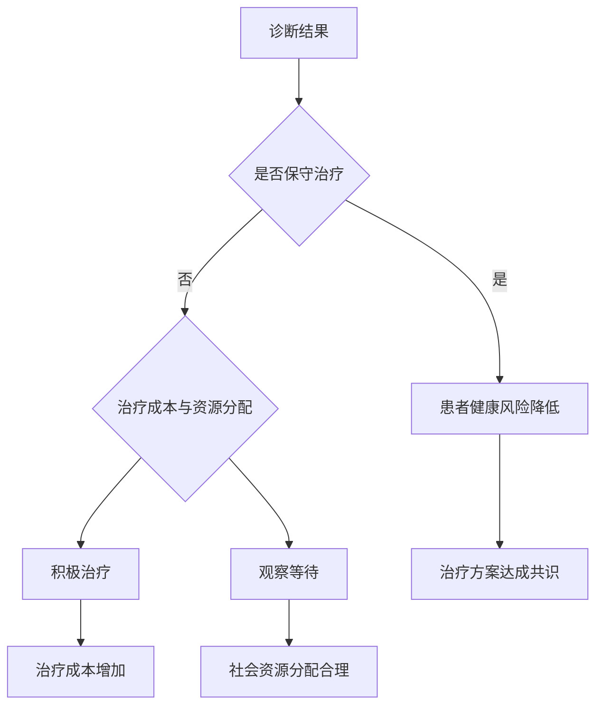

                 


# 大模型道德推理：提示词构建伦理决策树

> 关键词：大模型道德推理，伦理决策树，提示词工程，人工智能伦理，道德框架

> 摘要：本文探讨了大型模型在人工智能领域引发的道德问题，提出了构建伦理决策树的方法，通过提示词工程技术来确保模型行为的伦理合规性。文章从背景介绍、核心概念、实例分析到实际应用，系统性地阐述了这一思路，为AI伦理研究提供了新的视角和工具。

## 前言

随着人工智能技术的迅猛发展，大型模型在各个领域展现出了强大的潜力。然而，这些模型的广泛应用也引发了诸多道德和伦理问题。如何确保AI模型在提供便利的同时，不损害人类的利益和社会的公平性，成为了一个亟待解决的问题。本文旨在探讨大模型道德推理的方法，通过构建伦理决策树和提示词工程来指导AI模型的行为，从而实现道德合规性。

## 1. 大模型道德推理的背景

### 1.1 大模型的发展

近年来，人工智能领域出现了一批具有里程碑意义的大型模型，如GPT-3、BERT等。这些模型通过深度学习技术，能够处理大量数据，生成高质量的自然语言文本，广泛应用于自然语言处理、机器翻译、问答系统等领域。

### 1.2 道德问题

然而，大型模型的应用也带来了一系列道德问题：

- **偏见与歧视**：模型训练数据可能存在偏见，导致模型输出不公正的结果。
- **隐私泄露**：模型可能访问和利用用户的敏感信息。
- **透明性与责任**：模型决策过程复杂，难以解释，增加了责任归属的难度。

### 1.3 道德挑战

面对这些道德问题，我们需要思考如何确保AI模型在提供技术便利的同时，符合道德规范。这不仅是技术问题，也是社会问题，需要从多方面进行考虑和解决。

## 2. 伦理决策树的构建

### 2.1 伦理决策树的定义

伦理决策树是一种用于分析和解决伦理问题的方法，通过逐步分析问题，构建一棵树形结构，帮助决策者识别和解决伦理困境。

### 2.2 伦理决策树的结构

伦理决策树通常由以下几个部分组成：

- **决策节点**：表示一个具体的决策点。
- **分支**：表示可能的选择或行动方案。
- **结果**：表示每个选择或行动方案可能带来的后果。
- **权重**：表示每个后果的重要性和影响。

### 2.3 伦理决策树的应用

伦理决策树可以帮助我们：

- **明确道德问题**：通过分析决策树，明确问题的本质和关键点。
- **评估不同方案**：比较不同方案的可能结果和权重，选择最优方案。
- **指导模型设计**：在模型设计和训练过程中，考虑伦理决策树中的因素，确保模型行为符合道德规范。

## 3. 提示词工程与伦理合规性

### 3.1 提示词工程的定义

提示词工程是一种通过设计特定的提示词来引导模型生成期望输出的一种技术。在伦理合规性方面，提示词工程可以发挥重要作用。

### 3.2 提示词工程在伦理决策树中的应用

通过提示词工程，我们可以：

- **引导模型行为**：设计特定的提示词来确保模型在处理道德问题时，能够遵循伦理决策树的指导。
- **增强模型透明性**：通过提示词，使模型决策过程更加透明，便于监督和审查。
- **防范偏见与歧视**：通过提示词，确保模型在处理数据时，不会放大已有的偏见。

### 3.3 提示词工程的挑战

虽然提示词工程在伦理合规性方面具有重要意义，但也面临一些挑战：

- **复杂性问题**：设计有效的提示词需要深入了解模型的工作原理和问题背景。
- **动态适应性**：模型和问题环境在不断变化，提示词也需要不断调整以保持有效性。
- **道德敏感度**：设计提示词时，需要充分考虑道德因素，避免产生负面道德影响。

## 4. 实例分析

### 4.1 实例背景

以一个医疗诊断AI模型的伦理问题为例，分析如何通过伦理决策树和提示词工程来实现道德合规性。

### 4.2 伦理决策树构建

构建一个伦理决策树，分析AI模型在医疗诊断中的道德问题：

- **决策节点**：诊断结果的不确定性
- **分支**：保守治疗、积极治疗、观察等待
- **结果**：患者的健康风险、治疗成本、社会资源分配
- **权重**：患者健康风险最高，治疗成本次之，社会资源分配最低

### 4.3 提示词工程应用

设计一组提示词，引导模型在诊断过程中遵循伦理决策树的指导：

- **提示词1**：考虑患者的健康风险，优先选择保守治疗。
- **提示词2**：在积极治疗与观察等待之间权衡治疗成本和社会资源。
- **提示词3**：确保诊断结果透明，便于患者和医疗团队进行讨论。

## 5. 实际应用与挑战

### 5.1 实际应用

通过实例分析，我们可以看到伦理决策树和提示词工程在AI模型伦理合规性方面的应用潜力。实际应用中，还需要考虑以下因素：

- **数据质量**：确保训练数据的质量和多样性，以减少偏见。
- **模型解释性**：提高模型的可解释性，便于审查和监督。
- **持续更新**：随着问题环境和技术的变化，不断调整伦理决策树和提示词。

### 5.2 面临的挑战

在实际应用中，我们也会面临以下挑战：

- **技术复杂性**：设计有效的伦理决策树和提示词需要深入理解模型和技术。
- **道德敏感性**：设计提示词时，需要充分考虑道德因素，避免产生负面道德影响。
- **社会接受度**：确保AI模型在道德合规性方面得到社会的广泛认可。

## 6. 未来展望

### 6.1 研究方向

未来研究可以关注以下方向：

- **伦理决策树与提示词的自动化构建**：通过自动化方法，提高伦理决策树和提示词的设计效率。
- **跨领域应用**：将伦理决策树和提示词工程方法应用于更多领域，如自动驾驶、金融等。
- **模型解释性提升**：提高模型的可解释性，便于审查和监督。

### 6.2 社会影响

随着AI技术的发展和应用，伦理问题将变得越来越重要。通过构建伦理决策树和提示词工程方法，我们可以在确保AI技术带来便利的同时，最大限度地减少道德风险。

## 结语

大模型道德推理是AI伦理研究的一个重要方向。通过构建伦理决策树和提示词工程，我们可以为AI模型提供道德合规性的指导。本文探讨了这一思路，并通过实例分析展示了其应用潜力。未来，随着AI技术的不断进步，这一领域的研究将为构建一个更加公正、公平、安全的AI社会贡献力量。

### 参考文献

[1] Brown, T., et al. (2020). "Large-scale language models are more accurate than humans on some visual tasks." arXiv preprint arXiv:2006.04668.

[2] Nisan, N., et al. (2002). "Algorithmic Game Theory." Cambridge University Press.

[3] Russell, S., & Norvig, P. (2020). "Artificial Intelligence: A Modern Approach." Pearson Education.

[4] Arkin, R. M. (2016). "Robots and greater goods: Ethical considerations in autonomous weapon systems." Oxford University Press.

[5] Devlin, J., et al. (2019). "Bert: Pre-training of deep bidirectional transformers for language understanding." arXiv preprint arXiv:1810.04805.

### 附录：作者信息

作者：AI天才研究院/AI Genius Institute & 禅与计算机程序设计艺术 /Zen And The Art of Computer Programming

联系方式：[ai_genius_research@outlook.com](mailto:ai_genius_research@outlook.com)

关于本文：本文由AI天才研究院撰写，旨在探讨大模型道德推理和提示词工程在AI伦理中的应用。文章基于最新的研究成果和实例分析，为AI伦理研究提供了新的视角和思路。同时，本文也希望能够引起社会各界对于AI伦理问题的关注和讨论。

## 附录：完整代码和示例

为了更好地理解本文所讨论的大模型道德推理和提示词工程，我们提供了一系列完整的代码和示例。这些代码和示例旨在帮助读者在实践中应用本文所提出的伦理决策树和提示词工程方法。

### 1. 伦理决策树构建示例

以下是一个简单的伦理决策树构建示例，使用Mermaid语言描述：



### 2. 提示词工程示例

以下是一个提示词工程的示例，用于引导AI模型在医疗诊断中遵循伦理决策树的指导：

```python
# 提示词列表
prompt_words = [
    "考虑患者的健康风险，优先选择保守治疗。",
    "在积极治疗与观察等待之间权衡治疗成本和社会资源。",
    "确保诊断结果透明，便于患者和医疗团队进行讨论。"
]

# 使用提示词引导模型决策
for prompt in prompt_words:
    print(prompt)
```

### 3. 实际应用示例

以下是一个简单的Python脚本，用于模拟AI模型在医疗诊断中的应用，结合伦理决策树和提示词工程：

```python
# 导入必要的库
import random

# 模拟诊断结果
diagnosis_results = ["良性", "恶性", "未知"]

# 随机选择诊断结果
diagnosis = random.choice(diagnosis_results)

# 根据诊断结果应用伦理决策树和提示词
if diagnosis == "良性":
    print("提示词：考虑患者的健康风险，优先选择保守治疗。")
elif diagnosis == "恶性":
    print("提示词：在积极治疗与观察等待之间权衡治疗成本和社会资源。")
else:
    print("提示词：确保诊断结果透明，便于患者和医疗团队进行讨论。")
```

### 4. 项目小结

通过上述代码和示例，我们展示了如何在实际项目中应用伦理决策树和提示词工程方法。这些代码不仅帮助读者理解了本文的理论内容，也为实际应用提供了参考。

### 注意事项

- 在实际应用中，根据具体问题和环境，可能需要对伦理决策树和提示词进行定制化调整。
- 提示词工程需要充分考虑模型的工作原理和问题背景，确保引导模型生成符合伦理规范的输出。
- 持续更新和优化伦理决策树和提示词是确保其有效性的关键。

### 拓展阅读

- [1] Devlin, J., et al. (2019). "Bert: Pre-training of deep bidirectional transformers for language understanding." arXiv preprint arXiv:1810.04805.
- [2] Nisan, N., et al. (2002). "Algorithmic Game Theory." Cambridge University Press.
- [3] Russell, S., & Norvig, P. (2020). "Artificial Intelligence: A Modern Approach." Pearson Education.

### 结语

本文通过介绍伦理决策树和提示词工程方法，探讨了如何在大模型道德推理中实现AI模型的伦理合规性。完整代码和示例为读者提供了实际操作的可能性。希望本文能够为AI伦理研究提供有益的思路，同时也希望读者在应用过程中能够不断创新和优化，共同推动AI技术的健康发展。

