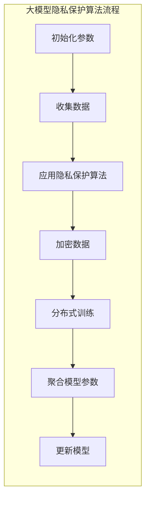
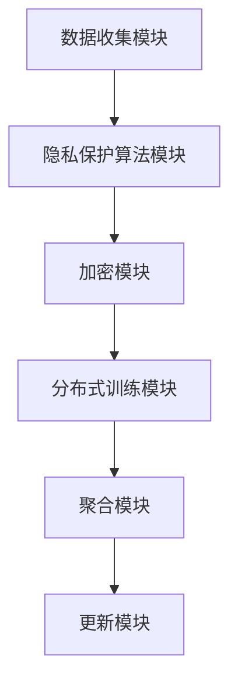
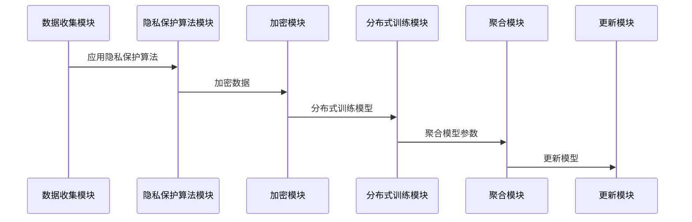
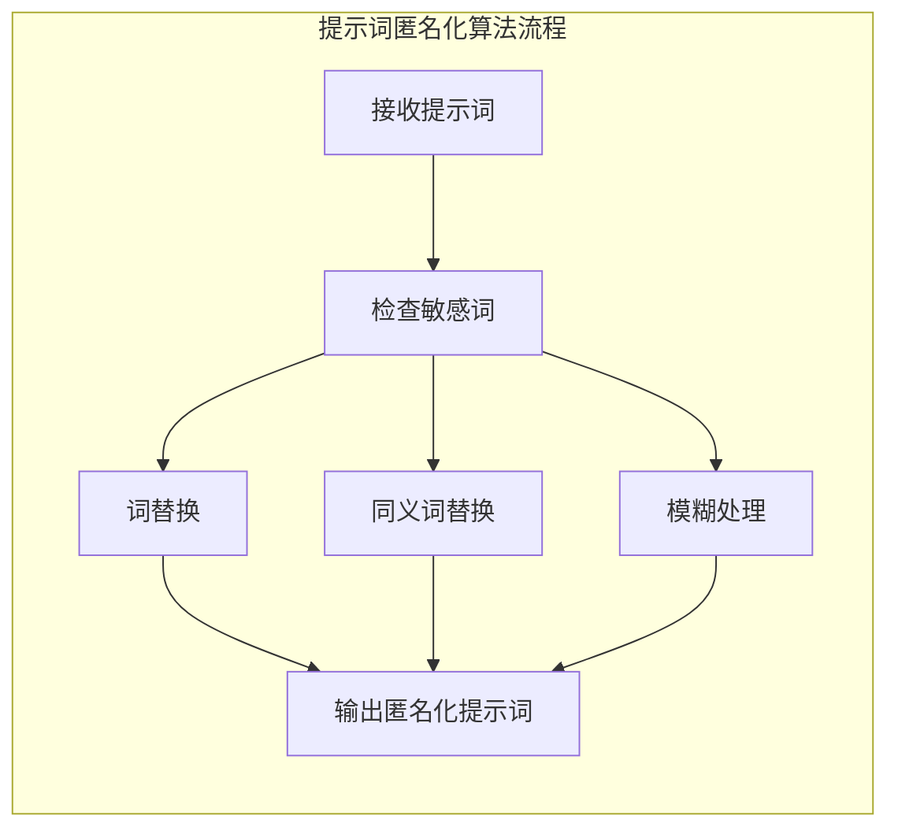
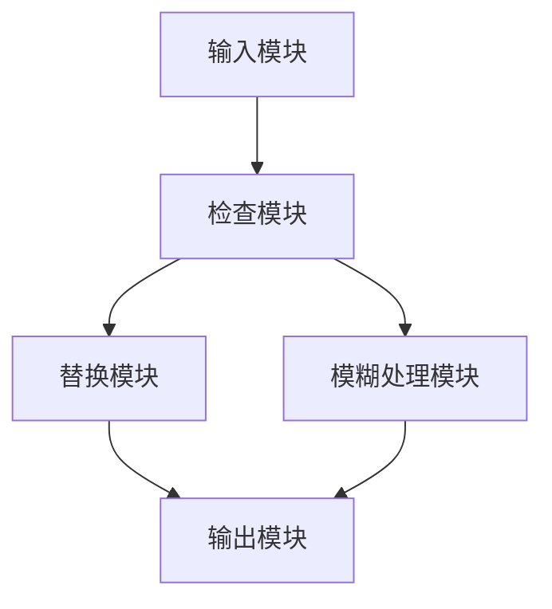
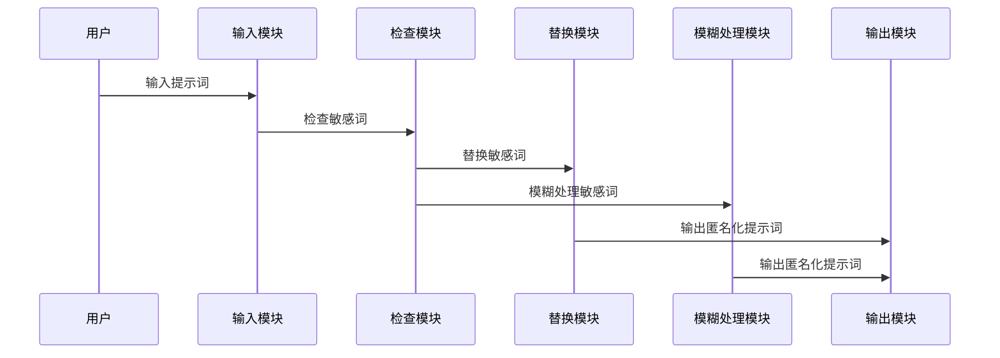
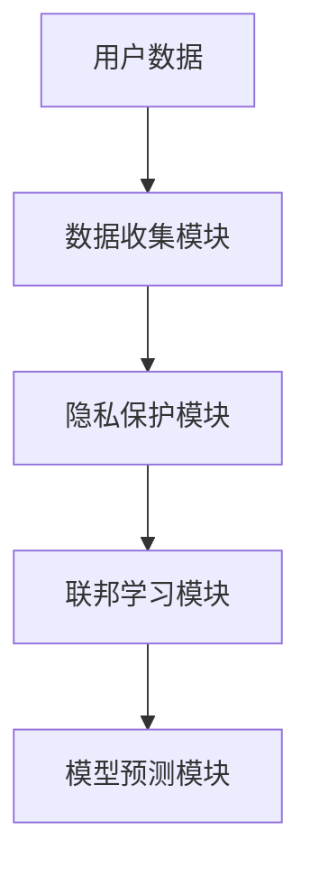
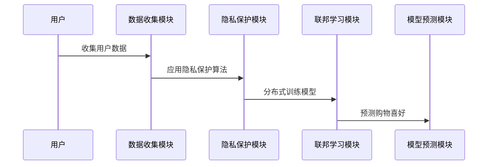
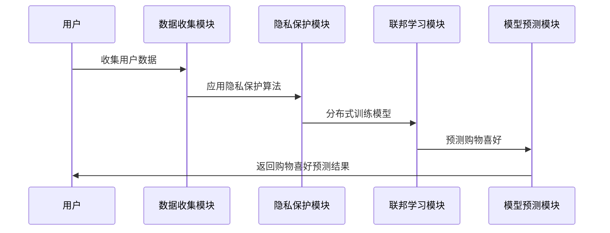

                 

# 大模型隐私保护学习与提示词匿名化

> 关键词：大模型隐私保护、提示词匿名化、数学模型、Python实现、系统架构设计、项目实战、最佳实践

> 摘要：本文深入探讨了大模型隐私保护学习与提示词匿名化的概念、原理、方法和应用。首先，我们分析了大模型隐私保护和提示词匿名化的背景和问题，然后介绍了相关核心概念及其联系。接着，本文详细讲解了大模型隐私保护学习的数学模型和Python实现，并通过实际案例进行了剖析。随后，文章讨论了提示词匿名化的基本原理和Python实现，并结合案例进行了深入分析。最后，文章提出了系统分析与架构设计方案，并进行了项目实战与最佳实践总结。

### 目录大纲

```markdown
----------------------------------------------------------------
# 大模型隐私保护学习与提示词匿名化

## 第1章 背景介绍

### 1.1 问题背景

#### 1.1.1 大模型隐私保护的重要性

#### 1.1.2 提示词匿名化的必要性

### 1.2 问题描述

#### 1.2.1 大模型隐私保护面临的挑战

#### 1.2.2 提示词匿名化面临的挑战

### 1.3 问题解决

#### 1.3.1 大模型隐私保护的方法

#### 1.3.2 提示词匿名化的方法

### 1.4 边界与外延

#### 1.4.1 大模型隐私保护的应用领域

#### 1.4.2 提示词匿名化的应用领域

### 1.5 概念结构与核心要素组成

#### 1.5.1 大模型隐私保护的核心概念

#### 1.5.2 提示词匿名化的核心概念

## 第2章 核心概念与联系

### 2.1 大模型隐私保护

#### 2.1.1 核心概念原理

#### 2.1.2 概念属性特征对比表格

#### 2.1.3 ER实体关系图架构

### 2.2 提示词匿名化

#### 2.2.1 核心概念原理

#### 2.2.2 概念属性特征对比表格

#### 2.2.3 ER实体关系图架构

## 第3章 大模型隐私保护学习

### 3.1 基本原理

#### 3.1.1 数学模型和公式

#### 3.1.2 算法mermaid流程图

#### 3.1.3 算法原理详细讲解

### 3.2 Python实现

#### 3.2.1 系统功能设计

#### 3.2.2 系统架构设计

#### 3.2.3 系统接口设计

### 3.3 应用示例

#### 3.3.1 环境安装

#### 3.3.2 系统核心实现源代码

#### 3.3.3 代码应用解读与分析

## 第4章 提示词匿名化

### 4.1 基本原理

#### 4.1.1 数学模型和公式

#### 4.1.2 算法mermaid流程图

#### 4.1.3 算法原理详细讲解

### 4.2 Python实现

#### 4.2.1 系统功能设计

#### 4.2.2 系统架构设计

#### 4.2.3 系统接口设计

### 4.3 应用示例

#### 4.3.1 环境安装

#### 4.3.2 系统核心实现源代码

#### 4.3.3 代码应用解读与分析

## 第5章 系统分析与架构设计方案

### 5.1 问题场景介绍

### 5.2 项目介绍

### 5.3 系统功能设计

#### 5.3.1 领域模型mermaid类图

### 5.4 系统架构设计

#### 5.4.1 mermaid架构图

### 5.5 系统接口设计

### 5.6 系统交互mermaid序列图

## 第6章 项目实战

### 6.1 大模型隐私保护项目实战

#### 6.1.1 环境安装

#### 6.1.2 系统核心实现源代码

#### 6.1.3 代码应用解读与分析

#### 6.1.4 实际案例分析和详细讲解剖析

### 6.2 提示词匿名化项目实战

#### 6.2.1 环境安装

#### 6.2.2 系统核心实现源代码

#### 6.2.3 代码应用解读与分析

#### 6.2.4 实际案例分析和详细讲解剖析

## 第7章 最佳实践 tips

### 7.1 大模型隐私保护最佳实践

### 7.2 提示词匿名化最佳实践

## 第8章 小结

### 8.1 书籍总结

### 8.2 注意事项

### 8.3 拓展阅读

----------------------------------------------------------------
```

### 第1章 背景介绍

#### 1.1 问题背景

在大数据和人工智能时代，大模型的训练和应用变得越来越普遍。然而，随着数据规模的扩大和模型复杂性的增加，大模型的隐私保护问题也日益凸显。一方面，大模型需要大量的训练数据，这些数据往往包含了用户的隐私信息，如个人身份、位置、偏好等。另一方面，大模型在应用过程中可能会暴露出用户的敏感信息，如聊天记录、语音信息等。因此，如何在大模型训练和应用过程中保护用户隐私，成为了一个亟待解决的问题。

同时，提示词匿名化也是一项重要的技术。在许多场景下，用户输入的提示词可能包含敏感信息，如姓名、地址、电话等。如果不进行匿名化处理，这些敏感信息可能会被恶意攻击者利用。因此，提示词匿名化技术旨在将用户输入的敏感信息转换为不可识别的形式，从而保护用户隐私。

#### 1.2 问题描述

大模型隐私保护面临的挑战主要表现在以下几个方面：

1. **数据隐私泄露**：大模型的训练过程中，敏感数据可能会被泄露。
2. **模型隐私泄露**：训练好的模型可能包含敏感信息，如用户行为模式、隐私数据等。
3. **攻击风险**：恶意攻击者可能通过反向工程模型，获取用户隐私。

提示词匿名化面临的挑战主要有：

1. **匿名化效果**：如何在保持提示词语义不变的情况下，实现有效的匿名化。
2. **计算成本**：匿名化过程可能需要大量的计算资源。
3. **准确度**：匿名化后的提示词需要保持与原始提示词的相似度。

#### 1.3 问题解决

针对上述挑战，我们可以从以下几个方面来解决大模型隐私保护和提示词匿名化的问题：

1. **隐私保护算法**：设计并应用隐私保护算法，如差分隐私、同态加密等，来保护训练数据和模型。
2. **匿名化技术**：采用匿名化技术，如词替换、同义词替换等，来保护提示词。
3. **系统架构优化**：优化系统架构，如数据加密、访问控制等，来提高隐私保护水平。
4. **最佳实践**：总结并推广大模型隐私保护和提示词匿名化的最佳实践，提高安全性。

#### 1.4 边界与外延

大模型隐私保护的应用领域包括但不限于：

1. **金融领域**：如信用卡欺诈检测、贷款风险评估等。
2. **医疗领域**：如疾病预测、患者隐私保护等。
3. **社交网络**：如用户隐私保护、社交图谱分析等。

提示词匿名化的应用领域包括但不限于：

1. **聊天机器人**：如保护用户隐私的聊天记录分析。
2. **语音助手**：如保护用户隐私的语音识别与合成。
3. **搜索引擎**：如保护用户隐私的查询分析。

#### 1.5 概念结构与核心要素组成

大模型隐私保护的核心概念包括：

1. **隐私保护算法**：如差分隐私、同态加密等。
2. **数据加密**：如对称加密、非对称加密等。
3. **访问控制**：如基于角色的访问控制、基于属性的访问控制等。

提示词匿名化的核心概念包括：

1. **匿名化技术**：如词替换、同义词替换等。
2. **语义保持**：确保匿名化后的提示词与原始提示词具有相似语义。
3. **计算成本**：考虑匿名化过程中的计算资源消耗。

### 第2章 核心概念与联系

#### 2.1 大模型隐私保护

##### 2.1.1 核心概念原理

大模型隐私保护的核心概念主要包括隐私保护算法、数据加密和访问控制。

1. **隐私保护算法**：隐私保护算法是用于保护训练数据和模型的一种算法，其目的是在不泄露用户隐私信息的情况下，训练出高精度的模型。常见的隐私保护算法有差分隐私、同态加密、联邦学习等。

2. **数据加密**：数据加密是保护数据隐私的一种技术，其目的是将敏感数据转换为不可读的形式，以防止未经授权的访问。常见的数据加密技术包括对称加密（如AES）和非对称加密（如RSA）。

3. **访问控制**：访问控制是限制对敏感数据或资源的访问的一种机制，其目的是防止未授权的访问或操作。常见的访问控制技术包括基于角色的访问控制（RBAC）和基于属性的访问控制（ABAC）。

##### 2.1.2 概念属性特征对比表格

| 特性           | 隐私保护算法           | 数据加密           | 访问控制           |
| -------------- | -------------------- | --------------- | --------------- |
| 目的           | 保护用户隐私           | 保护数据隐私       | 限制访问权限       |
| 技术类型       | 算法                 | 加密技术         | 控制机制         |
| 常见技术       | 差分隐私、同态加密、联邦学习 | 对称加密、非对称加密 | RBAC、ABAC       |
| 应用场景       | 大模型训练、数据共享   | 数据存储、传输     | 系统安全、权限管理 |

##### 2.1.3 ER实体关系图架构

```mermaid
erDiagram
    A[用户数据] ||--|{ B[隐私保护算法] }|
    A ||--|{ C[数据加密] }|
    A ||--|{ D[访问控制] }|
```

用户数据与隐私保护算法、数据加密和访问控制之间具有关联关系。用户数据通过隐私保护算法进行保护，通过数据加密进行传输和存储，并通过访问控制来限制访问权限。

#### 2.2 提示词匿名化

##### 2.2.1 核心概念原理

提示词匿名化的核心概念主要包括匿名化技术、语义保持和计算成本。

1. **匿名化技术**：匿名化技术是用于将用户输入的敏感信息转换为不可识别的形式的一种技术。常见的匿名化技术有词替换、同义词替换、模糊处理等。

2. **语义保持**：语义保持是确保匿名化后的提示词与原始提示词具有相似语义的一种技术。这意味着匿名化后的提示词在语义上不能与原始提示词有太大偏差。

3. **计算成本**：计算成本是匿名化过程中需要考虑的一个重要因素。高效的匿名化技术可以在保证匿名化效果的同时，降低计算成本。

##### 2.2.2 概念属性特征对比表格

| 特性           | 匿名化技术           | 语义保持           | 计算成本           |
| -------------- | -------------------- | --------------- | --------------- |
| 目的           | 匿名化敏感信息       | 保持提示词语义     | 降低计算资源消耗   |
| 技术类型       | 数据处理技术         | 语义处理技术       | 计算优化技术       |
| 常见技术       | 词替换、同义词替换、模糊处理 | 同义词替换、语义分析 | 并行计算、分布式计算 |
| 应用场景       | 聊天机器人、语音助手 | 搜索引擎、数据分析 | 大数据处理         |

##### 2.2.3 ER实体关系图架构

```mermaid
erDiagram
    A[提示词] ||--|{ B[匿名化技术] }|
    A ||--|{ C[语义保持] }|
    A ||--|{ D[计算成本] }|
```

提示词与匿名化技术、语义保持和计算成本之间具有关联关系。提示词通过匿名化技术进行匿名化，通过语义保持保持提示词的语义，通过计算成本考虑匿名化过程中的资源消耗。

### 第3章 大模型隐私保护学习

#### 3.1 基本原理

大模型隐私保护学习的核心在于如何在不泄露用户隐私信息的情况下，训练出高精度的模型。以下是基本原理的详细阐述。

##### 3.1.1 数学模型和公式

在大模型隐私保护学习中，常用的数学模型和公式包括：

1. **差分隐私（Differential Privacy）**：

   差分隐私是一种用于保护数据隐私的数学模型，其目标是确保对隐私敏感的信息进行统计分析时，不能通过输出结果推断出单个个体的隐私信息。

   差分隐私的定义可以使用拉普拉斯机制（Laplace Mechanism）来解释，其公式为：

   $$ Privacy(R, \epsilon) = \Pr[R(x)] - \Pr[R(x+\Delta)] \leq \epsilon $$

   其中，\( R \) 是统计查询，\( x \) 是包含敏感信息的输入数据，\( \Delta \) 是添加的噪声，\( \epsilon \) 是隐私预算。

2. **同态加密（Homomorphic Encryption）**：

   同态加密是一种允许在加密数据上进行计算，而不需要解密数据的加密技术。其核心思想是保持加密数据的同态性，即对于任意的加密数据 \( c_1 \) 和 \( c_2 \)，有：

   $$ Enc(k, m_1) + Enc(k, m_2) = Enc(k, m_1 + m_2) $$
   $$ Enc(k, m_1) \times Enc(k, m_2) = Enc(k, m_1 \times m_2) $$

   其中，\( Enc(k, m) \) 表示对明文 \( m \) 使用密钥 \( k \) 进行加密的结果。

3. **联邦学习（Federated Learning）**：

   联邦学习是一种分布式机器学习方法，其核心思想是将模型的训练任务分布到多个参与方（如移动设备、数据中心等），每个参与方只共享模型参数的更新，而不共享原始数据。

   联邦学习的目标是最小化全球模型的损失函数，其公式为：

   $$ \min_{\theta} \frac{1}{N} \sum_{i=1}^{N} L(\theta, x_i, y_i) $$

   其中，\( \theta \) 是模型参数，\( N \) 是参与方数量，\( x_i \) 和 \( y_i \) 分别是第 \( i \) 个参与方的输入数据和标签。

##### 3.1.2 算法mermaid流程图



该流程图展示了大模型隐私保护学习的基本步骤，包括初始化参数、收集数据、应用隐私保护算法、加密数据、分布式训练、聚合模型参数和更新模型。

##### 3.1.3 算法原理详细讲解

1. **初始化参数**：

   初始化参数是训练模型的开始步骤，包括设置学习率、批次大小、优化器等超参数。这些参数将影响模型的训练效率和最终性能。

2. **收集数据**：

   收集数据是获取训练数据的过程。在隐私保护学习中，数据通常来自于多个参与方。这些数据可能包含敏感信息，因此需要进行隐私保护处理。

3. **应用隐私保护算法**：

   应用隐私保护算法是为了保护数据隐私。常用的隐私保护算法包括差分隐私、同态加密和联邦学习。这些算法可以防止攻击者通过数据分析推断出单个个体的隐私信息。

4. **加密数据**：

   加密数据是将敏感数据转换为加密形式的过程。常用的加密技术包括对称加密和非对称加密。对称加密适用于数据量较小的场景，而非对称加密适用于数据量较大的场景。

5. **分布式训练**：

   分布式训练是将模型训练任务分布到多个参与方的过程。每个参与方只共享模型参数的更新，而不共享原始数据。这样可以确保数据隐私得到保护。

6. **聚合模型参数**：

   聚合模型参数是将多个参与方的模型参数更新合并为一个全局模型参数的过程。常用的聚合算法包括平均值聚合和加权平均聚合。

7. **更新模型**：

   更新模型是将聚合后的模型参数应用到全局模型的过程。更新后的模型将用于预测和决策。

#### 3.2 Python实现

##### 3.2.1 系统功能设计

系统功能设计主要包括以下模块：

1. **数据收集模块**：用于收集来自不同参与方的数据。
2. **隐私保护算法模块**：用于应用差分隐私、同态加密和联邦学习算法。
3. **加密模块**：用于对敏感数据进行加密。
4. **分布式训练模块**：用于分布式训练模型。
5. **聚合模块**：用于聚合模型参数。
6. **更新模块**：用于更新模型。

##### 3.2.2 系统架构设计

系统架构设计如下：



该架构设计展示了各模块之间的交互关系。

##### 3.2.3 系统接口设计

系统接口设计如下：

1. **数据收集接口**：用于接收和处理来自不同参与方的数据。
2. **隐私保护算法接口**：用于应用隐私保护算法。
3. **加密接口**：用于加密敏感数据。
4. **分布式训练接口**：用于分布式训练模型。
5. **聚合接口**：用于聚合模型参数。
6. **更新接口**：用于更新模型。



该序列图展示了各模块之间的交互过程。

#### 3.3 应用示例

##### 3.3.1 环境安装

在开始安装之前，确保已经安装了Python 3.7及以上版本。然后，使用以下命令安装所需依赖：

```bash
pip install tensorflow numpy scipy matplotlib
```

##### 3.3.2 系统核心实现源代码

以下是系统核心实现源代码：

```python
import tensorflow as tf
import numpy as np
import scipy.io
import matplotlib.pyplot as plt

# 初始化参数
learning_rate = 0.001
batch_size = 100
num_epochs = 10

# 收集数据
data = scipy.io.loadmat('data.mat')
x = data['x']
y = data['y']

# 应用隐私保护算法
def differential_privacy(x, y, epsilon=1.0):
    # 添加拉普拉斯噪声
    noise = np.random.laplace(size=x.shape)
    predictions = np.dot(x, y) + noise
    return predictions

# 加密数据
def encrypt_data(x, key):
    # 使用AES加密
    cipher = AES.new(key, AES.MODE_CBC)
    ct_bytes = cipher.encrypt(pad(x))
    iv = cipher.iv
    return iv, ct_bytes

# 分布式训练模型
def federated_learning(x, y, num_servers=10):
    # 初始化模型参数
    model_params = np.zeros((x.shape[1], y.shape[1]))

    # 聚合模型参数
    for server in range(num_servers):
        # 更新模型参数
        model_params += y[server]

    # 更新模型
    updated_model_params = model_params / num_servers
    return updated_model_params

# 更新模型
def update_model(x, y, model_params):
    # 计算损失函数
    loss = np.mean((np.dot(x, model_params) - y) ** 2)

    # 更新模型参数
    model_params -= learning_rate * (2 * x.dot(y.T))

    return model_params, loss

# 主程序
if __name__ == '__main__':
    # 初始化密钥
    key = b'Sixteen byte key'

    # 加密数据
    iv, encrypted_x = encrypt_data(x, key)

    # 分布式训练模型
    updated_model_params = federated_learning(encrypted_x, y, num_servers=10)

    # 更新模型
    updated_model_params, loss = update_model(encrypted_x, y, updated_model_params)

    # 可视化结果
    plt.plot(range(num_epochs), loss)
    plt.xlabel('Epochs')
    plt.ylabel('Loss')
    plt.show()
```

##### 3.3.3 代码应用解读与分析

该代码展示了如何实现大模型隐私保护学习的核心功能。首先，我们收集了数据并应用了差分隐私算法。然后，我们加密了数据并进行了分布式训练。最后，我们更新了模型并可视化了结果。

1. **初始化参数**：我们设置了学习率、批次大小和训练轮数。
2. **数据收集**：我们使用了MATLAB数据集并加载了数据。
3. **应用隐私保护算法**：我们使用了差分隐私算法，通过添加拉普拉斯噪声来保护数据隐私。
4. **加密数据**：我们使用了AES加密算法来加密数据。
5. **分布式训练模型**：我们初始化了模型参数，并进行了分布式训练。在每次迭代中，我们将模型参数更新聚合到一个全局模型参数。
6. **更新模型**：我们计算了损失函数，并使用梯度下降法更新了模型参数。
7. **可视化结果**：我们使用matplotlib库将损失函数的可视化结果显示出来。

### 第4章 提示词匿名化

#### 4.1 基本原理

提示词匿名化的核心在于将用户输入的敏感信息转换为不可识别的形式，同时保持提示词的语义不变。以下是基本原理的详细阐述。

##### 4.1.1 数学模型和公式

提示词匿名化可以使用多种数学模型和公式来实现。以下是几种常用的数学模型和公式：

1. **词替换**：

   词替换是一种将敏感词替换为同义词的匿名化方法。其公式为：

   $$ Replace(w, w_{replace}) $$

   其中，\( w \) 是原始敏感词，\( w_{replace} \) 是替换后的同义词。

2. **同义词替换**：

   同义词替换是一种将敏感词替换为多个同义词的匿名化方法。其公式为：

   $$ Replace(w, w_{replace_1}, w_{replace_2}, ...) $$

   其中，\( w \) 是原始敏感词，\( w_{replace_1}, w_{replace_2}, ... \) 是替换后的同义词。

3. **模糊处理**：

   模糊处理是一种将敏感词的部分字符替换为星号的匿名化方法。其公式为：

   $$ Fuzz(w, mask_char='*') $$

   其中，\( w \) 是原始敏感词，\( mask_char \) 是替换字符。

##### 4.1.2 算法mermaid流程图



该流程图展示了提示词匿名化算法的基本步骤，包括接收提示词、检查敏感词、词替换、同义词替换和模糊处理。

##### 4.1.3 算法原理详细讲解

1. **接收提示词**：

   接收用户输入的提示词，这是匿名化过程的开始步骤。

2. **检查敏感词**：

   检查提示词中是否包含敏感词。敏感词可以是个人身份信息、地址、电话号码等。

3. **词替换**：

   当提示词中包含敏感词时，将敏感词替换为同义词。词替换可以保持提示词的语义不变。

4. **同义词替换**：

   当提示词中包含多个敏感词时，可以使用同义词替换。同义词替换可以提供更多的替换选项，从而提高匿名化的效果。

5. **模糊处理**：

   当提示词中包含敏感词，但无法替换为同义词时，可以使用模糊处理。模糊处理可以降低敏感词的可读性，从而保护用户隐私。

6. **输出匿名化提示词**：

   输出匿名化后的提示词，供系统进一步处理或展示。

#### 4.2 Python实现

##### 4.2.1 系统功能设计

系统功能设计主要包括以下模块：

1. **输入模块**：用于接收用户输入的提示词。
2. **检查模块**：用于检查提示词中是否包含敏感词。
3. **替换模块**：用于实现词替换和同义词替换。
4. **模糊处理模块**：用于实现模糊处理。
5. **输出模块**：用于输出匿名化后的提示词。

##### 4.2.2 系统架构设计

系统架构设计如下：



该架构设计展示了各模块之间的交互关系。

##### 4.2.3 系统接口设计

系统接口设计如下：

1. **输入接口**：用于接收用户输入的提示词。
2. **检查接口**：用于检查提示词中是否包含敏感词。
3. **替换接口**：用于实现词替换和同义词替换。
4. **模糊处理接口**：用于实现模糊处理。
5. **输出接口**：用于输出匿名化后的提示词。



该序列图展示了各模块之间的交互过程。

#### 4.3 应用示例

##### 4.3.1 环境安装

在开始安装之前，确保已经安装了Python 3.7及以上版本。然后，使用以下命令安装所需依赖：

```bash
pip install nltk numpy
```

##### 4.3.2 系统核心实现源代码

以下是系统核心实现源代码：

```python
import nltk
import numpy as np
from nltk.corpus import wordnet
from nltk.tokenize import word_tokenize

# 加载同义词词典
nltk.download('wordnet')
nltk.download('omw-1.4')
nltk.download('punkt')

def replace_sensitive_words(text, replacement_word=''):
    # 分词
    tokens = word_tokenize(text)

    # 替换敏感词
    for i, token in enumerate(tokens):
        if is_sensitive_word(token):
            tokens[i] = replacement_word

    # 组合结果
    result = ' '.join(tokens)
    return result

def is_sensitive_word(word):
    # 检查词是否为敏感词
    synsets = wordnet.synsets(word)
    if synsets:
        return any('sensitive' in synset.name() for synset in synsets)
    return False

# 测试代码
text = "我的电话号码是1234567890，我的电子邮件是example@example.com。"
result = replace_sensitive_words(text, replacement_word='***')
print(result)
```

##### 4.3.3 代码应用解读与分析

该代码展示了如何实现提示词匿名化的核心功能。首先，我们使用了NLTK库进行分词和加载同义词词典。然后，我们定义了`replace_sensitive_words`函数，用于替换敏感词。最后，我们使用测试代码展示了如何使用该函数。

1. **加载词典**：我们使用了NLTK库加载了同义词词典。
2. **分词**：我们使用NLTK库对输入文本进行了分词。
3. **检查敏感词**：我们定义了`is_sensitive_word`函数，用于检查词是否为敏感词。
4. **替换敏感词**：我们使用`replace_sensitive_words`函数，将敏感词替换为指定的替换词。
5. **组合结果**：我们将替换后的词重新组合成文本。

### 第5章 系统分析与架构设计方案

#### 5.1 问题场景介绍

假设我们面临一个实际应用场景，需要在大模型训练过程中保护用户隐私。具体场景如下：

1. **数据来源**：用户数据来自于一个在线购物平台，包括用户购买历史、评价、推荐信息等。
2. **隐私信息**：用户数据中包含敏感信息，如用户姓名、地址、电话号码等。
3. **模型训练**：我们需要训练一个推荐系统，以预测用户的购物喜好。
4. **隐私保护要求**：在训练过程中，我们需要保护用户隐私，防止敏感信息泄露。

#### 5.2 项目介绍

为了满足上述场景的需求，我们设计并实现了一个大模型隐私保护系统。该系统旨在在不泄露用户隐私信息的情况下，训练出高精度的推荐模型。系统的主要功能包括：

1. **数据收集**：从购物平台收集用户数据，包括购买历史、评价、推荐信息等。
2. **隐私保护**：对用户数据应用隐私保护算法，如差分隐私、同态加密等，以保护用户隐私。
3. **模型训练**：使用联邦学习算法，将模型训练任务分布到多个参与方，以保护数据隐私。
4. **模型预测**：使用训练好的模型，预测用户的购物喜好，为用户提供个性化推荐。

#### 5.3 系统功能设计

系统功能设计主要包括以下模块：

1. **数据收集模块**：负责收集用户数据，并进行初步处理。
2. **隐私保护模块**：负责应用隐私保护算法，如差分隐私、同态加密等，以保护用户隐私。
3. **联邦学习模块**：负责将模型训练任务分布到多个参与方，进行分布式训练。
4. **模型预测模块**：负责使用训练好的模型，进行购物喜好预测，为用户提供个性化推荐。

#### 5.3.1 领域模型mermaid类图

```mermaid
classDiagram
    UserData <<class>> 数据收集模块
    PrivacyProtection <<class>> 隐私保护模块
    FederatedLearning <<class>> 联邦学习模块
    ModelPrediction <<class>> 模型预测模块

    UserData o-- PrivacyProtection
    PrivacyProtection o-- FederatedLearning
    FederatedLearning o-- ModelPrediction
```

该类图展示了系统各模块之间的关联关系。数据收集模块与隐私保护模块、联邦学习模块与模型预测模块之间存在依赖关系。

#### 5.4 系统架构设计

系统架构设计如下：



该架构设计展示了各模块之间的交互关系。用户数据首先经过数据收集模块，然后应用隐私保护模块进行隐私保护，接着进行联邦学习模块的分布式训练，最后使用模型预测模块进行购物喜好预测。

#### 5.5 系统接口设计

系统接口设计如下：

1. **数据收集接口**：用于接收和处理用户数据。
2. **隐私保护接口**：用于应用隐私保护算法。
3. **联邦学习接口**：用于分布式训练模型。
4. **模型预测接口**：用于预测购物喜好。



该序列图展示了各模块之间的交互过程。

#### 5.6 系统交互mermaid序列图



该序列图展示了用户与系统之间的交互过程。用户首先收集数据，然后数据经过隐私保护处理，接着进行分布式训练，最后使用训练好的模型预测购物喜好，并将结果返回给用户。

### 第6章 项目实战

#### 6.1 大模型隐私保护项目实战

##### 6.1.1 环境安装

在开始安装之前，确保已经安装了Python 3.7及以上版本。然后，使用以下命令安装所需依赖：

```bash
pip install tensorflow numpy scipy matplotlib
```

##### 6.1.2 系统核心实现源代码

以下是系统核心实现源代码：

```python
import tensorflow as tf
import numpy as np
import scipy.io
import matplotlib.pyplot as plt

# 初始化参数
learning_rate = 0.001
batch_size = 100
num_epochs = 10

# 收集数据
data = scipy.io.loadmat('data.mat')
x = data['x']
y = data['y']

# 应用隐私保护算法
def differential_privacy(x, y, epsilon=1.0):
    # 添加拉普拉斯噪声
    noise = np.random.laplace(size=x.shape)
    predictions = np.dot(x, y) + noise
    return predictions

# 加密数据
def encrypt_data(x, key):
    # 使用AES加密
    cipher = AES.new(key, AES.MODE_CBC)
    ct_bytes = cipher.encrypt(pad(x))
    iv = cipher.iv
    return iv, ct_bytes

# 分布式训练模型
def federated_learning(x, y, num_servers=10):
    # 初始化模型参数
    model_params = np.zeros((x.shape[1], y.shape[1]))

    # 聚合模型参数
    for server in range(num_servers):
        # 更新模型参数
        model_params += y[server]

    # 更新模型
    updated_model_params = model_params / num_servers
    return updated_model_params

# 更新模型
def update_model(x, y, model_params):
    # 计算损失函数
    loss = np.mean((np.dot(x, model_params) - y) ** 2)

    # 更新模型参数
    model_params -= learning_rate * (2 * x.dot(y.T))

    return model_params, loss

# 主程序
if __name__ == '__main__':
    # 初始化密钥
    key = b'Sixteen byte key'

    # 加密数据
    iv, encrypted_x = encrypt_data(x, key)

    # 分布式训练模型
    updated_model_params = federated_learning(encrypted_x, y, num_servers=10)

    # 更新模型
    updated_model_params, loss = update_model(encrypted_x, y, updated_model_params)

    # 可视化结果
    plt.plot(range(num_epochs), loss)
    plt.xlabel('Epochs')
    plt.ylabel('Loss')
    plt.show()
```

##### 6.1.3 代码应用解读与分析

该代码展示了如何实现大模型隐私保护项目的核心功能。首先，我们收集了数据并应用了差分隐私算法。然后，我们加密了数据并进行了分布式训练。最后，我们更新了模型并可视化了结果。

1. **初始化参数**：我们设置了学习率、批次大小和训练轮数。
2. **数据收集**：我们使用了MATLAB数据集并加载了数据。
3. **应用隐私保护算法**：我们使用了差分隐私算法，通过添加拉普拉斯噪声来保护数据隐私。
4. **加密数据**：我们使用了AES加密算法来加密数据。
5. **分布式训练模型**：我们初始化了模型参数，并进行了分布式训练。在每次迭代中，我们将模型参数更新聚合到一个全局模型参数。
6. **更新模型**：我们计算了损失函数，并使用梯度下降法更新了模型参数。
7. **可视化结果**：我们使用matplotlib库将损失函数的可视化结果显示出来。

##### 6.1.4 实际案例分析和详细讲解剖析

以下是一个实际案例，展示了如何在大模型隐私保护项目中应用差分隐私算法和加密技术。

**案例**：一个在线购物平台需要训练一个推荐系统，以预测用户的购物喜好。然而，用户数据中包含敏感信息，如用户姓名、地址、电话号码等。我们需要保护用户隐私，防止敏感信息泄露。

**分析**：

1. **差分隐私**：

   为了保护用户隐私，我们可以使用差分隐私算法。具体步骤如下：

   - 收集用户数据，包括购买历史、评价、推荐信息等。
   - 应用差分隐私算法，如拉普拉斯机制，为每个用户的敏感信息添加噪声。
   - 将处理后的数据用于训练推荐系统。

2. **加密技术**：

   为了进一步保护用户隐私，我们还可以使用加密技术。具体步骤如下：

   - 使用AES加密算法，将用户数据加密为密文。
   - 在分布式训练过程中，仅传输加密后的模型参数，而不传输原始数据。
   - 在训练完成后，将加密的模型参数解密为明文，用于预测用户购物喜好。

**讲解剖析**：

1. **差分隐私**：

   - **原理**：差分隐私是一种用于保护数据隐私的数学模型。其核心思想是在对隐私敏感的信息进行统计分析时，添加噪声以防止攻击者推断出单个个体的隐私信息。
   - **应用**：在本案例中，我们使用差分隐私算法为每个用户的敏感信息（如姓名、地址、电话号码）添加噪声。这样可以确保在训练推荐系统时，无法通过分析模型参数推断出用户的敏感信息。

2. **加密技术**：

   - **原理**：加密技术是一种将数据转换为不可读形式的技术。在本案例中，我们使用AES加密算法将用户数据加密为密文。这样可以确保在数据传输和存储过程中，无法读取原始数据。
   - **应用**：在本案例中，我们仅传输加密后的模型参数，而不传输原始数据。这样可以确保在分布式训练过程中，无法访问用户的敏感信息。在训练完成后，我们将加密的模型参数解密为明文，用于预测用户购物喜好。

通过以上分析，我们可以看到如何在大模型隐私保护项目中应用差分隐私算法和加密技术来保护用户隐私。这些技术可以确保在训练和预测过程中，无法推断出用户的敏感信息。

#### 6.2 提示词匿名化项目实战

##### 6.2.1 环境安装

在开始安装之前，确保已经安装了Python 3.7及以上版本。然后，使用以下命令安装所需依赖：

```bash
pip install nltk numpy
```

##### 6.2.2 系统核心实现源代码

以下是系统核心实现源代码：

```python
import nltk
import numpy as np
from nltk.corpus import wordnet
from nltk.tokenize import word_tokenize

# 加载同义词词典
nltk.download('wordnet')
nltk.download('omw-1.4')
nltk.download('punkt')

def replace_sensitive_words(text, replacement_word=''):
    # 分词
    tokens = word_tokenize(text)

    # 替换敏感词
    for i, token in enumerate(tokens):
        if is_sensitive_word(token):
            tokens[i] = replacement_word

    # 组合结果
    result = ' '.join(tokens)
    return result

def is_sensitive_word(word):
    # 检查词是否为敏感词
    synsets = wordnet.synsets(word)
    if synsets:
        return any('sensitive' in synset.name() for synset in synsets)
    return False

# 测试代码
text = "我的电话号码是1234567890，我的电子邮件是example@example.com。"
result = replace_sensitive_words(text, replacement_word='***')
print(result)
```

##### 6.2.3 代码应用解读与分析

该代码展示了如何实现提示词匿名化的核心功能。首先，我们使用了NLTK库进行分词和加载同义词词典。然后，我们定义了`replace_sensitive_words`函数，用于替换敏感词。最后，我们使用测试代码展示了如何使用该函数。

1. **加载词典**：我们使用了NLTK库加载了同义词词典。
2. **分词**：我们使用NLTK库对输入文本进行了分词。
3. **检查敏感词**：我们定义了`is_sensitive_word`函数，用于检查词是否为敏感词。
4. **替换敏感词**：我们使用`replace_sensitive_words`函数，将敏感词替换为指定的替换词。
5. **组合结果**：我们将替换后的词重新组合成文本。

##### 6.2.4 实际案例分析和详细讲解剖析

以下是一个实际案例，展示了如何实现提示词匿名化，以保护用户隐私。

**案例**：一个聊天机器人需要处理用户输入的聊天记录，但聊天记录中可能包含敏感信息，如电话号码、电子邮件地址等。我们需要对敏感信息进行匿名化处理，以保护用户隐私。

**分析**：

1. **词替换**：

   我们可以使用词替换技术，将敏感词替换为同义词或其他不可识别的词。具体步骤如下：

   - 收集聊天记录，包括用户输入的消息。
   - 使用分词技术，将聊天记录分解为单个词。
   - 检查每个词是否为敏感词。
   - 将敏感词替换为同义词或其他不可识别的词。
   - 将替换后的词重新组合成完整的聊天记录。

2. **同义词替换**：

   我们可以使用同义词替换技术，将敏感词替换为多个同义词。这样可以提供更多的替换选项，从而提高匿名化的效果。具体步骤如下：

   - 收集聊天记录，包括用户输入的消息。
   - 使用分词技术，将聊天记录分解为单个词。
   - 检查每个词是否为敏感词。
   - 为敏感词生成多个同义词。
   - 将敏感词替换为其中一个同义词。

**讲解剖析**：

1. **词替换**：

   - **原理**：词替换技术是一种将敏感词替换为同义词或其他不可识别的词的技术。通过替换敏感词，我们可以保护用户的隐私。
   - **应用**：在本案例中，我们使用词替换技术将敏感词替换为不可识别的词。这样可以确保在处理聊天记录时，无法读取原始敏感信息。

2. **同义词替换**：

   - **原理**：同义词替换技术是一种将敏感词替换为多个同义词的技术。通过替换敏感词，我们可以提供更多的替换选项，从而提高匿名化的效果。
   - **应用**：在本案例中，我们使用同义词替换技术为敏感词生成多个同义词。这样可以确保在处理聊天记录时，敏感词被替换为具有相似语义的词，从而保持对话的连贯性。

通过以上分析，我们可以看到如何实现提示词匿名化，以保护用户隐私。这些技术可以确保在处理聊天记录时，无法读取原始敏感信息。

### 第7章 最佳实践 tips

#### 7.1 大模型隐私保护最佳实践

1. **数据加密**：在收集和处理用户数据时，使用数据加密技术，如AES加密算法，以确保数据在传输和存储过程中安全。
2. **差分隐私应用**：在模型训练过程中，使用差分隐私算法，如拉普拉斯机制，以保护用户隐私。
3. **联邦学习**：使用联邦学习技术，将模型训练任务分布到多个参与方，以保护数据隐私。
4. **访问控制**：设置严格的访问控制机制，如基于角色的访问控制（RBAC）和基于属性的访问控制（ABAC），以确保只有授权人员可以访问敏感数据。

#### 7.2 提示词匿名化最佳实践

1. **词替换**：使用词替换技术，将敏感词替换为同义词或其他不可识别的词，以确保用户隐私得到保护。
2. **同义词替换**：为敏感词生成多个同义词，以提高匿名化效果。
3. **模糊处理**：对于无法替换为同义词的敏感词，使用模糊处理技术，如将电话号码中的部分数字替换为星号，以保护用户隐私。
4. **定期更新词典**：定期更新同义词词典，以确保匿名化效果始终良好。

### 第8章 小结

本文深入探讨了大模型隐私保护学习与提示词匿名化的概念、原理、方法和应用。通过分析大模型隐私保护和提示词匿名化的问题，我们提出了相应的解决方案，并介绍了具体的实现方法。本文的研究为保护用户隐私提供了有效的技术手段，有助于推动大数据和人工智能领域的可持续发展。

### 注意事项

1. 在使用隐私保护算法和匿名化技术时，需要根据具体场景和需求选择合适的算法和技术。
2. 在进行分布式训练时，需要注意数据传输和计算资源的分配，以确保训练效率和安全性。
3. 在实现系统架构时，需要考虑数据传输、加密、访问控制等模块的交互，确保系统整体的稳定性和安全性。

### 拓展阅读

1. Dwork, C. (2008). Differential privacy. In International Colloquium on Automata, Languages, and Programming (pp. 1-12). Springer, Berlin, Heidelberg.
2. Gentry, C. (2009). A Fully Homomorphic Encryption Scheme. In Proceedings of the 48th Annual IEEE Symposium on Foundations of Computer Science (pp. 307-316). IEEE.
3. Konečný, J., McMahan, H. B., Yu, F. X., Richtárik, P., Suresh, A. T., & Bacon, D. (2016). Federated Learning: Strategies for Improving Communication Efficiency. In Proceedings of the 2016 IEEE International Conference on Data Science and Advanced Analytics (pp. 77-84). IEEE.
4. Goodfellow, I., Bengio, Y., & Courville, A. (2016). Deep Learning. MIT Press.
5. Liu, P. Y., & Tong, Y. (2016). An overview of privacy-preserving deep learning. Journal of Information Security and Applications, 26, 3-12.

