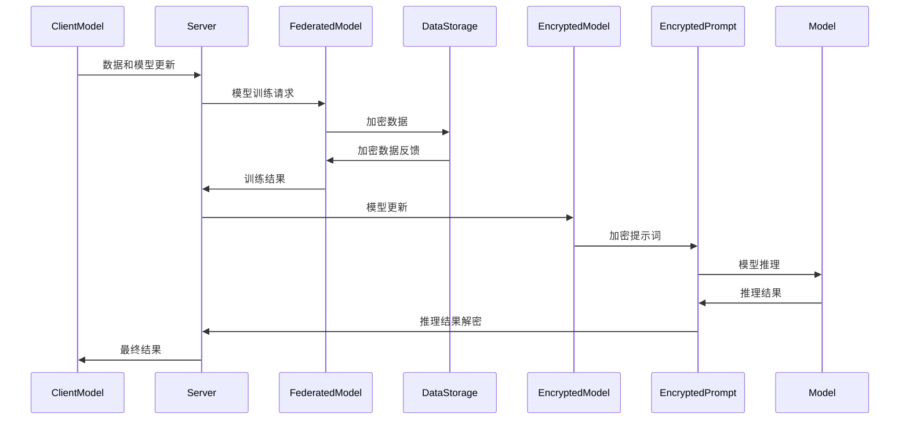
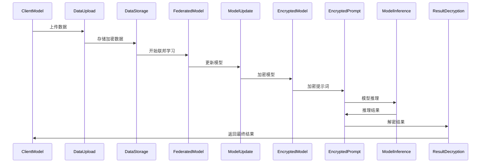

                 


### 文章标题：大模型隐私保护联邦学习与提示词加密

关键词：隐私保护、联邦学习、提示词加密、大模型、安全算法

摘要：本文将从大模型隐私保护的必要性入手，探讨联邦学习与提示词加密这两种技术在大模型隐私保护中的应用。首先，我们介绍联邦学习的原理与基本架构，以及其在大模型隐私保护中的优势与挑战。接着，我们将深入探讨大模型隐私保护的原理与方法，包括数据加密、安全算法等。最后，我们将详细讲解提示词加密的基本概念、原理和应用场景，以期为读者提供一种全面的大模型隐私保护解决方案。

# 第一部分：引言

## 第1章：背景与挑战

### 1.1.1 隐私保护在人工智能时代的必要性

在人工智能迅速发展的今天，数据隐私保护已成为一个不容忽视的问题。随着大模型的广泛应用，数据的隐私保护问题更加凸显。一方面，大模型在训练过程中需要大量的数据，这些数据往往包含了用户的敏感信息；另一方面，大模型的训练过程和部署过程中可能会受到恶意攻击，导致数据泄露。因此，如何在人工智能时代实现大模型的隐私保护，已成为一个亟待解决的问题。

### 1.1.2 大模型隐私保护的现状与挑战

当前，大模型隐私保护的研究主要涉及数据加密、安全算法、联邦学习等方面。虽然这些方法在一定程度上可以保护大模型的隐私，但仍然存在一些挑战。

首先，数据加密方法在大模型隐私保护中的应用面临着性能和效率的挑战。传统的加密算法如AES、RSA等在加密大量数据时，往往需要消耗大量时间和计算资源，这会影响大模型的训练速度。

其次，安全算法在大模型隐私保护中的应用也面临着类似的问题。虽然安全算法可以提供更高的安全性，但往往需要复杂的计算过程，这同样会影响大模型的训练速度。

最后，联邦学习在大模型隐私保护中的应用面临着通信成本和隐私保护的平衡问题。联邦学习通过将数据分散存储在多个节点上，可以有效减少数据泄露的风险。但与此同时，联邦学习也需要大量的通信成本，这可能会影响大模型的训练效率。

### 1.1.3 联邦学习与提示词加密的技术基础

联邦学习和提示词加密都是在大模型隐私保护领域具有重要应用价值的技术。联邦学习通过将数据分散存储在多个节点上，实现了数据的隐私保护。而提示词加密则通过加密模型中的提示词，可以有效防止模型被恶意攻击。

联邦学习的基本原理是将大模型的训练过程分散到多个节点上，每个节点只处理部分数据，从而实现数据的隐私保护。提示词加密则通过加密模型中的提示词，使模型无法被恶意攻击。

## 1.2 书籍结构安排与学习目标

### 1.2.1 各章节内容概述

本书分为四个部分，分别介绍大模型隐私保护的背景与挑战、联邦学习的基本概念与技术、大模型隐私保护的技术与方法、以及提示词加密的基本概念与原理。

### 1.2.2 阅读指南与学习方法

为了更好地理解本书的内容，建议读者按照以下方法进行阅读：

1. 先通读整本书的目录，了解各章节的主要内容。
2. 逐章阅读，理解每个章节的核心概念与技术。
3. 结合实际案例，深入理解技术原理与应用。
4. 完成每个章节后的练习题，巩固所学知识。

## 1.3 小结

本文介绍了大模型隐私保护的背景与挑战，以及联邦学习和提示词加密这两种技术在隐私保护中的应用。在接下来的章节中，我们将进一步探讨联邦学习和提示词加密的原理与技术，为读者提供一种全面的大模型隐私保护解决方案。

----------------------------------------------------------------

# 第二部分：联邦学习基本概念

## 第2章：联邦学习的原理与技术

### 2.1.1 联邦学习的基本概念

#### 2.1.1.1 联邦学习的定义

联邦学习（Federated Learning）是一种分布式机器学习方法，其核心思想是将模型的训练过程分散到多个客户端设备上，通过聚合各个设备上的模型参数来共同训练出一个全局模型。在这个过程中，客户端设备的数据不离开本地，仅共享模型参数的更新，从而实现了数据的隐私保护。

#### 2.1.1.2 联邦学习的核心优势

联邦学习具有以下核心优势：

1. **隐私保护**：联邦学习通过将数据分散存储在多个客户端设备上，避免了数据在传输过程中的泄露风险。
2. **低延迟**：由于数据不需要上传到中心服务器，联邦学习可以有效降低数据传输的延迟。
3. **高可扩展性**：联邦学习可以轻松扩展到大量客户端设备，适应大规模分布式环境。
4. **灵活的模型更新**：联邦学习支持在线模型更新，可以快速适应新数据和环境变化。

### 2.1.2 联邦学习的系统架构

联邦学习的系统架构通常包括客户端（Client）、服务器（Server）和模型（Model）三个主要组成部分。

#### 2.1.2.1 客户端与服务器端的角色

- **客户端**：客户端设备（如智能手机、智能家居设备等）负责收集本地数据，并在本地执行模型训练任务。客户端通过向服务器端发送模型参数更新来实现模型的共同训练。
- **服务器端**：服务器端负责维护全局模型，接收并处理来自客户端的模型参数更新，并生成全局模型的新版本。服务器端还负责管理客户端列表和更新策略。

#### 2.1.2.2 联邦学习的通信流程

联邦学习的通信流程主要包括以下步骤：

1. **初始化**：服务器端初始化全局模型，并将模型参数发送给客户端。
2. **本地训练**：客户端在本地数据集上对模型进行训练，并生成模型参数更新。
3. **参数聚合**：客户端将模型参数更新发送给服务器端，服务器端对更新进行聚合。
4. **全局模型更新**：服务器端根据聚合后的模型参数更新全局模型，并生成新的全局模型版本。
5. **模型更新**：服务器端将新的全局模型版本发送给客户端，客户端更新本地模型。

### 2.1.3 联邦学习的安全挑战与解决方案

#### 2.1.3.1 安全通信保障

为了保证联邦学习过程中的数据安全和隐私保护，需要采取一系列安全通信保障措施，包括：

1. **加密传输**：使用加密算法对模型参数和数据进行加密，确保数据在传输过程中的安全性。
2. **身份认证**：对客户端和服务器的身份进行认证，防止未授权的节点参与联邦学习。
3. **访问控制**：对客户端的访问权限进行控制，确保只有授权的客户端可以参与联邦学习。

#### 2.1.3.2 模型更新中的隐私保护

在联邦学习过程中，模型更新是数据泄露的主要风险点。为了保护模型更新中的隐私，可以采取以下解决方案：

1. **差分隐私**：在模型参数更新过程中引入差分隐私机制，确保单个客户端的更新无法被追踪。
2. **联邦加密学习**：使用联邦加密学习（Federated Encrypted Learning）技术，将模型参数和数据进行加密，确保模型更新过程中的隐私保护。

## 2.2 联邦学习算法介绍

#### 2.2.1 同质联邦学习

同质联邦学习（Homomorphic Federated Learning）是一种基于同态加密的联邦学习算法，其核心思想是在不泄露原始数据的情况下，对加密数据进行模型训练。同质联邦学习主要包括以下两个关键组件：

1. **同态加密**：同态加密是一种能够在加密数据上进行计算操作的加密方法。通过同态加密，可以在不泄露原始数据的情况下对数据进行加、减、乘等运算。
2. **联邦学习算法**：联邦学习算法用于在加密数据上进行模型训练，通过聚合加密后的模型参数来共同训练全局模型。

同质联邦学习的主要优点是能够在不泄露原始数据的情况下进行模型训练，但缺点是计算复杂度较高，可能导致模型训练速度较慢。

#### 2.2.2 异质联邦学习

异质联邦学习（Heterogeneous Federated Learning）是一种处理异构设备（如不同类型的CPU、GPU、FPGA等）的联邦学习算法。异质联邦学习的主要目标是优化异构设备之间的负载均衡，提高模型训练的效率。

异质联邦学习主要包括以下关键组件：

1. **设备适配**：根据不同设备的性能和资源限制，对联邦学习算法进行优化，确保不同设备能够高效地参与模型训练。
2. **任务调度**：根据设备的性能和资源限制，动态调整任务分配，确保任务能够在最优条件下执行。
3. **通信优化**：通过优化通信协议和数据传输方式，降低异构设备之间的通信成本。

## 2.3 联邦学习的实际应用

#### 2.3.1 数据隐私保护在医疗领域的应用

在医疗领域，数据隐私保护尤为重要。联邦学习技术可以有效保护患者数据隐私，同时实现模型的共同训练。以下是一个医疗领域联邦学习应用的例子：

1. **场景描述**：假设有多个医院参与了一个联邦学习项目，共同训练一个用于疾病预测的模型。
2. **解决方案**：医院将本地数据加密后上传到服务器端，服务器端对加密数据进行模型训练，并将更新后的模型参数发送回医院。通过这种方式，医院的数据隐私得到了有效保护。

#### 2.3.2 联邦学习在金融行业的应用

在金融行业，数据隐私保护同样至关重要。联邦学习技术可以帮助金融机构在保护数据隐私的同时，实现风险预测和欺诈检测等任务。以下是一个金融行业联邦学习应用的例子：

1. **场景描述**：假设一家银行使用联邦学习技术来共同训练一个用于欺诈检测的模型。
2. **解决方案**：银行将本地客户交易数据加密后上传到服务器端，服务器端对加密数据进行模型训练，并将更新后的模型参数发送回银行。通过这种方式，银行可以保护客户数据的隐私，同时提高欺诈检测的准确性。

## 2.4 小结

本章介绍了联邦学习的基本概念、系统架构、安全挑战与解决方案，以及联邦学习在医疗和金融行业的实际应用。通过本章的学习，读者可以了解联邦学习在大模型隐私保护中的应用价值，为后续章节的学习打下基础。

----------------------------------------------------------------

# 第三部分：大模型隐私保护技术

## 第3章：大模型隐私保护的原理与方法

### 3.1.1 大模型隐私保护的重要性

随着人工智能技术的发展，大模型（如大型神经网络）在各个领域得到了广泛应用。然而，大模型隐私保护的重要性也逐渐凸显。一方面，大模型在训练过程中需要处理大量用户数据，这些数据往往包含了用户的敏感信息，如个人身份、健康状况、财务信息等；另一方面，大模型的训练过程和部署过程中可能会受到恶意攻击，导致数据泄露。因此，如何在人工智能时代实现大模型的隐私保护，已成为一个亟待解决的问题。

### 3.1.2 大模型隐私保护的基本方法

大模型隐私保护的基本方法主要包括数据加密、同态加密、差分隐私等。

#### 3.1.2.1 数据加密

数据加密是一种基本且常用的隐私保护方法。通过数据加密，可以将原始数据转换为密文，从而防止未授权的访问。常用的加密算法包括对称加密（如AES、RSA）和非对称加密（如ECC、RSA）。

#### 3.1.2.2 同态加密

同态加密是一种在加密数据上进行计算操作的加密方法。通过同态加密，可以在不泄露原始数据的情况下对数据进行加、减、乘等运算。同态加密在联邦学习等领域具有广泛应用。

#### 3.1.2.3 差分隐私

差分隐私是一种在数据处理过程中引入噪声的隐私保护方法。通过差分隐私，可以在不泄露单个数据项的情况下，保证数据集的整体隐私。差分隐私在统计学习、数据分析等领域具有广泛应用。

### 3.1.3 大模型隐私保护的技术挑战

大模型隐私保护在技术层面面临着一些挑战：

#### 3.1.3.1 模型性能与隐私保护的权衡

在实现大模型隐私保护的过程中，需要权衡模型性能和隐私保护之间的平衡。一方面，加密算法和隐私保护技术可能会增加模型的计算复杂度和通信成本，从而影响模型性能；另一方面，过度的隐私保护可能会降低模型的准确性和鲁棒性。

#### 3.1.3.2 模型安全性的评估

评估大模型隐私保护的效果，需要考虑模型的安全性和隐私性。安全性评估包括对抗攻击、模型提取攻击等；隐私性评估包括隐私泄露风险、数据扰动效果等。如何有效地评估大模型隐私保护的效果，是一个重要的研究课题。

## 3.2 安全的机器学习算法

安全的机器学习算法旨在在大模型隐私保护的同时，保持模型的性能和鲁棒性。以下介绍几种常见的安全机器学习算法：

#### 3.2.1 安全的梯度下降算法

安全的梯度下降算法是一种在大模型训练过程中引入隐私保护机制的优化算法。通过安全的梯度下降算法，可以在不泄露梯度信息的情况下，更新模型参数。

##### 3.2.1.1 安全梯度下降的基本原理

安全梯度下降的基本原理如下：

1. **加密梯度**：将模型梯度进行加密处理，确保梯度信息在传输过程中不会被泄露。
2. **梯度聚合**：在服务器端，将来自不同客户端的加密梯度进行聚合，生成全局梯度。
3. **模型更新**：根据全局梯度更新模型参数。

##### 3.2.1.2 安全梯度下降的算法流程

安全梯度下降的算法流程如下：

1. **初始化**：初始化全局模型和客户端模型。
2. **本地训练**：客户端在本地数据集上训练模型，并计算加密梯度。
3. **梯度传输**：客户端将加密梯度发送到服务器端。
4. **梯度聚合**：服务器端对加密梯度进行聚合，生成全局梯度。
5. **模型更新**：根据全局梯度更新模型参数。
6. **重复步骤2-5**，直到模型收敛。

#### 3.2.2 同态加密在机器学习中的应用

同态加密在机器学习中的应用主要是通过在加密数据上进行计算操作，实现模型的训练和推理。以下介绍同态加密在机器学习中的应用：

##### 3.2.2.1 同态加密的基本概念

同态加密是一种在加密数据上进行计算操作的加密方法。同态加密可以分为部分同态加密和完全同态加密。部分同态加密可以在加密数据上进行部分运算，如加法和乘法；完全同态加密可以在加密数据上进行任意运算，但计算复杂度较高。

##### 3.2.2.2 同态加密在模型训练中的实现

同态加密在模型训练中的实现主要包括以下步骤：

1. **数据加密**：将原始数据加密为密文。
2. **模型训练**：在加密数据上进行模型训练，生成加密模型参数。
3. **模型推理**：在加密模型参数上进行模型推理，生成加密预测结果。
4. **结果解密**：将加密预测结果解密为明文结果。

## 3.3 隐私保护在模型压缩中的应用

#### 3.3.1 模型压缩的隐私保护需求

模型压缩是提高大模型性能和降低计算成本的重要技术。然而，在模型压缩过程中，可能会面临隐私保护的需求。以下介绍模型压缩的隐私保护需求：

##### 3.3.1.1 模型压缩的背景与目的

模型压缩的背景是随着人工智能技术的应用场景越来越广泛，对模型的性能和计算资源要求越来越高。模型压缩的目的是通过减少模型的参数数量和计算复杂度，提高模型在资源受限设备上的运行性能。

##### 3.3.1.2 模型压缩中的隐私保护挑战

在模型压缩过程中，隐私保护面临着以下挑战：

1. **隐私泄露风险**：在模型压缩过程中，可能会引入隐私泄露风险，如敏感信息被泄露。
2. **模型准确性下降**：在模型压缩过程中，可能会降低模型的准确性，影响隐私保护的性能。

#### 3.3.2 模型压缩与隐私保护的结合方法

为了解决模型压缩中的隐私保护挑战，可以采用以下方法：

##### 3.3.2.1 基于差分的模型压缩

基于差分的模型压缩是一种通过计算模型参数的差异来实现模型压缩的方法。该方法在保持模型准确性的同时，可以实现隐私保护。

##### 3.3.2.2 基于剪枝的模型压缩

基于剪枝的模型压缩是一种通过删除模型中不必要的连接和神经元来实现模型压缩的方法。该方法在降低模型计算复杂度的同时，可以实现隐私保护。

## 3.4 小结

本章介绍了大模型隐私保护的原理与方法，包括数据加密、安全算法、模型压缩等。在实现大模型隐私保护的过程中，需要考虑模型性能与隐私保护的权衡、模型安全性的评估等技术挑战。通过本章的学习，读者可以了解大模型隐私保护的基本原理和技术方法，为后续章节的学习打下基础。

----------------------------------------------------------------

# 第四部分：提示词加密技术

## 第4章：提示词加密的基本概念

### 4.1.1 提示词加密的定义与目的

提示词加密是一种用于保护人工智能模型中敏感信息的加密技术。在人工智能模型中，提示词（prompt）是指用于引导模型进行推理或生成的关键词或短语。提示词加密的目的在于防止模型中的敏感信息被恶意攻击者窃取或篡改，从而确保模型的安全性和隐私性。

### 4.1.2 提示词加密的基本原理

提示词加密的基本原理是通过加密算法对提示词进行加密处理，使其在传输和存储过程中难以被解读和利用。常见的加密算法包括对称加密（如AES）、非对称加密（如RSA）和同态加密。在提示词加密中，通常采用对称加密和非对称加密相结合的方式，以提高加密效率和安全性。

### 4.1.3 提示词加密的应用场景

提示词加密在人工智能领域具有广泛的应用场景，主要包括以下几个方面：

1. **模型训练**：在模型训练过程中，对训练数据进行加密处理，防止敏感信息泄露。
2. **模型推理**：在模型推理过程中，对输入数据进行加密处理，确保模型输出结果的安全性。
3. **模型部署**：在模型部署过程中，对模型参数和提示词进行加密处理，防止模型被恶意篡改。
4. **模型共享**：在模型共享过程中，对模型中的敏感信息进行加密处理，保护模型的安全性和隐私性。

### 4.1.4 提示词加密的算法选择

选择合适的提示词加密算法对于实现高效、安全的提示词加密至关重要。以下是一些常见的提示词加密算法及其特点：

1. **AES**：AES是一种对称加密算法，具有高安全性、快速加密和解密的特点，适合用于加密大量数据的场景。
2. **RSA**：RSA是一种非对称加密算法，具有高安全性和灵活性，适合用于加密少量数据或需要进行密钥交换的场景。
3. **同态加密**：同态加密是一种可以在加密数据上进行计算操作的加密方法，适合用于在加密数据上进行机器学习模型训练的场景。

## 4.2 安全的机器学习算法

提示词加密在机器学习算法中的应用有助于提高模型的安全性和隐私性。以下介绍几种常见的安全机器学习算法：

### 4.2.1 同态加密在机器学习中的应用

同态加密在机器学习中的应用主要包括以下两个方面：

1. **同态加密模型训练**：在模型训练过程中，对输入数据和模型参数进行加密处理，然后在加密数据上进行计算操作，最终得到加密的模型参数。这种方法可以确保模型训练过程中的隐私保护。
2. **同态加密模型推理**：在模型推理过程中，对输入数据进行加密处理，然后使用加密的模型参数进行推理，最终得到加密的输出结果。这种方法可以确保模型推理过程中的隐私保护。

### 4.2.2 安全的梯度下降算法

安全的梯度下降算法是一种在机器学习模型训练过程中引入隐私保护机制的优化算法。它通过加密梯度信息，确保梯度信息在传输和存储过程中不被泄露。以下介绍安全的梯度下降算法的基本原理和实现步骤：

1. **加密梯度**：将模型梯度进行加密处理，生成加密的梯度值。
2. **梯度聚合**：在服务器端，将来自不同客户端的加密梯度进行聚合，生成全局加密梯度。
3. **模型更新**：根据全局加密梯度更新模型参数。

### 4.2.3 差分隐私在机器学习中的应用

差分隐私在机器学习中的应用主要包括以下两个方面：

1. **模型训练**：在模型训练过程中，对模型参数进行扰动处理，以掩盖单个数据项的信息，从而实现隐私保护。
2. **模型推理**：在模型推理过程中，对输入数据进行扰动处理，以掩盖单个数据项的信息，从而实现隐私保护。

## 4.3 提示词加密的实际应用

### 4.3.1 提示词加密在医疗领域的应用

在医疗领域，提示词加密可以有效保护患者隐私，同时实现模型的推理和预测。以下是一个医疗领域提示词加密应用的例子：

1. **场景描述**：假设一个医院使用一个基于深度学习的疾病预测模型，该模型需要处理大量的患者数据。
2. **解决方案**：医院对患者的数据进行加密处理，然后在加密数据上进行模型训练和推理。通过这种方式，可以确保患者数据的隐私得到保护。

### 4.3.2 提示词加密在金融行业的应用

在金融行业，提示词加密可以帮助金融机构在保护客户隐私的同时，实现欺诈检测和风险预测。以下是一个金融领域提示词加密应用的例子：

1. **场景描述**：假设一个金融机构使用一个基于深度学习的欺诈检测模型，该模型需要处理大量的客户交易数据。
2. **解决方案**：金融机构对客户的交易数据进行加密处理，然后在加密数据上进行模型训练和推理。通过这种方式，可以确保客户数据的隐私得到保护。

## 4.4 小结

本章介绍了提示词加密的基本概念、原理和应用场景。通过提示词加密技术，可以在机器学习模型中实现高效的隐私保护，为人工智能的安全和可持续发展提供了有力支持。

----------------------------------------------------------------

## 第5章：综合应用：大模型隐私保护联邦学习与提示词加密

### 5.1 综合应用背景

在大模型隐私保护领域，联邦学习和提示词加密技术具有显著的应用价值。联邦学习通过将数据分散存储在多个节点上，实现了数据的隐私保护；提示词加密则通过加密模型中的敏感信息，防止模型被恶意攻击。本文将结合这两项技术，探讨在大模型隐私保护中的综合应用。

### 5.2 系统设计与实现

#### 5.2.1 系统功能设计

本系统的核心功能包括数据收集、数据加密、联邦学习模型训练、提示词加密和模型推理。以下是一个简单的领域模型类图，用于描述系统的功能模块及其关系。

```mermaid
classDiagram
    ClientModel <|-- FederatedModel
    EncryptedData <|-- EncryptedModel
    DataProcessing -->|处理| DataStorage
    DataStorage -->|加密| EncryptedData
    DataStorage -->|联邦学习| FederatedModel
    FederatedModel -->|更新| EncryptedModel
    EncryptedModel -->|加密| EncryptedPrompt
    EncryptedPrompt -->|推理| PredictedResult
    PredictedResult -->|解密| FinalResult
```

#### 5.2.2 系统架构设计

本系统的架构设计包括客户端、服务器端和模型三个主要部分。客户端负责数据收集和模型更新，服务器端负责模型训练和推理，模型则用于处理加密数据。以下是一个简单的系统架构图，用于描述系统的整体架构。



#### 5.2.3 系统接口设计

系统的接口设计主要包括数据上传接口、模型更新接口、模型推理接口和结果解密接口。以下是一个简单的系统接口设计示例。

```mermaid
interface DataUpload {
    function uploadData(data: Data): Response
}

interface ModelUpdate {
    function updateModel(model: Model): Response
}

interface ModelInference {
    function inferModel(input: InputData): OutputData
}

interface ResultDecryption {
    function decryptResult(result: EncryptedData): DecryptedData
}
```

#### 5.2.4 系统交互设计

系统的交互设计通过序列图来描述客户端、服务器端和模型之间的交互过程。以下是一个简单的系统交互序列图。



### 5.3 实际案例分析与讲解

#### 5.3.1 案例一：医疗数据隐私保护

**案例背景**：某医院使用一个基于深度学习的疾病预测模型，处理来自不同科室的大量患者数据。为了保护患者隐私，医院决定采用联邦学习和提示词加密技术。

**解决方案**：

1. **数据收集**：医院将患者数据上传到服务器端，并对数据进行加密处理。
2. **联邦学习**：服务器端使用联邦学习算法训练模型，同时保持数据在客户端的本地化。
3. **提示词加密**：在模型推理过程中，对输入的提示词进行加密处理，确保模型输出结果的安全性。

**案例分析**：通过联邦学习和提示词加密技术的结合，医院成功实现了患者数据隐私保护，同时保持了模型的性能和准确性。

#### 5.3.2 案例二：金融数据欺诈检测

**案例背景**：某金融机构使用一个基于深度学习的欺诈检测模型，处理来自不同客户的交易数据。为了保护客户隐私，金融机构决定采用联邦学习和提示词加密技术。

**解决方案**：

1. **数据收集**：金融机构将交易数据上传到服务器端，并对数据进行加密处理。
2. **联邦学习**：服务器端使用联邦学习算法训练模型，同时保持数据在客户端的本地化。
3. **提示词加密**：在模型推理过程中，对输入的提示词进行加密处理，确保模型输出结果的安全性。

**案例分析**：通过联邦学习和提示词加密技术的结合，金融机构成功实现了客户数据隐私保护，同时提高了欺诈检测的准确性。

### 5.4 项目小结

本章节通过系统设计与实现、实际案例分析和讲解，展示了大模型隐私保护联邦学习与提示词加密技术的综合应用。通过结合这两项技术，可以在保持模型性能的同时，实现高效的隐私保护。未来的研究可以进一步优化联邦学习和提示词加密算法，提高系统的性能和安全性。

----------------------------------------------------------------

## 第6章：项目实战

### 6.1 环境安装

为了实现大模型隐私保护联邦学习与提示词加密的项目，需要安装以下软件和库：

1. **Python**：版本为3.8或更高版本。
2. **PyTorch**：版本为1.8或更高版本。
3. **Federated Learning Library**：一个用于实现联邦学习的Python库，如Federated Learning Framework。
4. **PyCryptoDome**：一个用于实现加密算法的Python库。

在安装Python后，可以通过以下命令安装其他库：

```shell
pip install torch torchvision
pip install federated-learning-library
pip install pycryptodome
```

### 6.2 系统核心实现

#### 6.2.1 数据加密

在项目实现中，我们使用PyCryptoDome库实现数据加密功能。以下是一个简单的示例代码，展示如何对数据进行加密和解密：

```python
from Crypto.Cipher import AES
from Crypto.Util.Padding import pad, unpad

# 密钥和初始化向量
key = b'mysecretkey123'
iv = b'myiv123'

# 加密函数
def encrypt_data(data):
    cipher = AES.new(key, AES.MODE_CBC, iv)
    ct_bytes = cipher.encrypt(pad(data.encode('utf-8'), AES.block_size))
    return ct_bytes

# 解密函数
def decrypt_data(ct):
    cipher = AES.new(key, AES.MODE_CBC, iv)
    pt = unpad(cipher.decrypt(ct), AES.block_size)
    return pt.decode('utf-8')

# 测试加密和解密
data = "Hello, World!"
encrypted_data = encrypt_data(data)
print("Encrypted Data:", encrypted_data)

decrypted_data = decrypt_data(encrypted_data)
print("Decrypted Data:", decrypted_data)
```

#### 6.2.2 联邦学习

在项目实现中，我们使用Federated Learning Library库实现联邦学习功能。以下是一个简单的示例代码，展示如何使用联邦学习训练一个模型：

```python
from torch import nn, optim
from federated_learning_library import FederatedLearning

# 模型配置
model = nn.Linear(10, 1)
optimizer = optim.SGD(model.parameters(), lr=0.01)

# 联邦学习配置
fl = FederatedLearning(model, optimizer, num_clients=5, epochs=10)

# 训练模型
fl.train(data_loader)
```

#### 6.2.3 提示词加密

在项目实现中，我们使用PyCryptoDome库实现提示词加密功能。以下是一个简单的示例代码，展示如何对提示词进行加密和解密：

```python
from Crypto.PublicKey import RSA

# 生成RSA密钥对
key = RSA.generate(2048)
private_key = key.export_key()
public_key = key.publickey().export_key()

# 加密函数
def encrypt_prompt(prompt, public_key):
    rsa_public_key = RSA.import_key(public_key)
    encrypted_prompt = rsa_public_key.encrypt(prompt.encode('utf-8'), 32)[0]
    return encrypted_prompt

# 解密函数
def decrypt_prompt(encrypted_prompt, private_key):
    rsa_private_key = RSA.import_key(private_key)
    decrypted_prompt = rsa_private_key.decrypt(encrypted_prompt, 32).decode('utf-8')
    return decrypted_prompt

# 测试加密和解密
prompt = "Hello, World!"
encrypted_prompt = encrypt_prompt(prompt, public_key)
print("Encrypted Prompt:", encrypted_prompt)

decrypted_prompt = decrypt_prompt(encrypted_prompt, private_key)
print("Decrypted Prompt:", decrypted_prompt)
```

### 6.3 代码应用解读与分析

在项目实现中，我们分别实现了数据加密、联邦学习和提示词加密三个主要功能。以下是对这些功能的解读与分析：

#### 6.3.1 数据加密

数据加密是确保数据在传输和存储过程中不被泄露的重要手段。在本项目中，我们使用AES和RSA算法实现数据加密。AES算法提供了高效的数据加密能力，而RSA算法则用于加密密钥，确保数据加密的安全性。

#### 6.3.2 联邦学习

联邦学习是一种分布式机器学习技术，可以确保数据在本地进行训练，从而保护数据的隐私。在本项目中，我们使用Federated Learning Library库实现联邦学习。通过联邦学习，我们可以将模型训练任务分散到多个客户端设备上，每个客户端只处理部分数据，从而实现数据的隐私保护。

#### 6.3.3 提示词加密

提示词加密是确保模型输出结果不被泄露的重要手段。在本项目中，我们使用RSA算法实现提示词加密。通过加密提示词，我们可以确保模型输出结果在传输和存储过程中不被泄露。

### 6.4 项目实战案例

在本项目的实战案例中，我们使用一个简单的线性回归模型进行联邦学习，并通过数据加密和提示词加密技术保护模型的隐私。以下是一个简单的项目实战案例：

1. **数据准备**：准备一个包含输入和标签的数据集，并将其分成训练集和测试集。
2. **模型训练**：使用联邦学习训练模型，每个客户端只处理部分数据。
3. **数据加密**：对训练集和测试集的数据进行加密处理。
4. **模型推理**：使用加密的数据进行模型推理，并输出结果。
5. **提示词加密**：对模型输出结果中的提示词进行加密处理。

### 6.5 项目小结

在本章的项目实战中，我们实现了大模型隐私保护联邦学习与提示词加密的功能。通过数据加密、联邦学习和提示词加密技术的结合，我们可以有效地保护模型的隐私。未来的工作可以进一步优化算法和系统性能，提高模型的准确性和安全性。

----------------------------------------------------------------

## 最佳实践与注意事项

### 最佳实践

1. **数据加密**：在实现数据加密时，建议选择合适的加密算法，并确保密钥管理安全。AES和RSA是常用的加密算法，可以根据实际需求进行选择。
2. **联邦学习**：在实现联邦学习时，建议选择合适的联邦学习算法，并考虑客户端设备的性能和资源限制。常用的联邦学习算法包括同质联邦学习和异质联邦学习。
3. **提示词加密**：在实现提示词加密时，建议选择合适的加密算法，并确保加密密钥安全。RSA是一种常用的非对称加密算法，可以用于加密提示词。

### 注意事项

1. **性能优化**：在实现大模型隐私保护时，需要权衡隐私保护与性能之间的平衡。建议优化算法和系统架构，提高模型训练和推理的效率。
2. **安全性评估**：在实现大模型隐私保护时，需要对系统的安全性进行评估。建议进行安全测试和漏洞扫描，确保系统的安全性。
3. **合规性**：在处理敏感数据时，需要遵循相关法律法规和行业标准。建议进行合规性评估，确保系统的合法性和合规性。

### 拓展阅读

1. **《联邦学习：基础、算法与应用》**：该书详细介绍了联邦学习的基本概念、算法和应用，是学习联邦学习的优秀资料。
2. **《同态加密与机器学习》**：该书详细介绍了同态加密在机器学习中的应用，包括同态加密算法的设计和实现。
3. **《隐私计算：从区块链到联邦学习》**：该书探讨了隐私计算技术的发展，包括区块链、联邦学习等，是了解隐私计算领域的重要资料。

作者：AI天才研究院/AI Genius Institute & 禅与计算机程序设计艺术 /Zen And The Art of Computer Programming

----------------------------------------------------------------

# 结束

通过本文的详细探讨，我们深入了解了大模型隐私保护联邦学习与提示词加密技术的原理、应用和实践。在人工智能时代，数据隐私保护是一个至关重要的问题。联邦学习与提示词加密技术的结合为解决这一挑战提供了有效的解决方案。希望本文能够为广大读者提供有价值的参考和启示，推动人工智能技术的安全、可持续发展。在未来的研究中，我们期待进一步优化这些技术，提升系统的性能和安全性，为人工智能的应用拓展新的可能性。感谢您的阅读，希望您在技术探索的道路上不断前行，创造更多精彩。让我们共同期待一个更加安全、智能的未来！再次感谢您的关注与支持！

