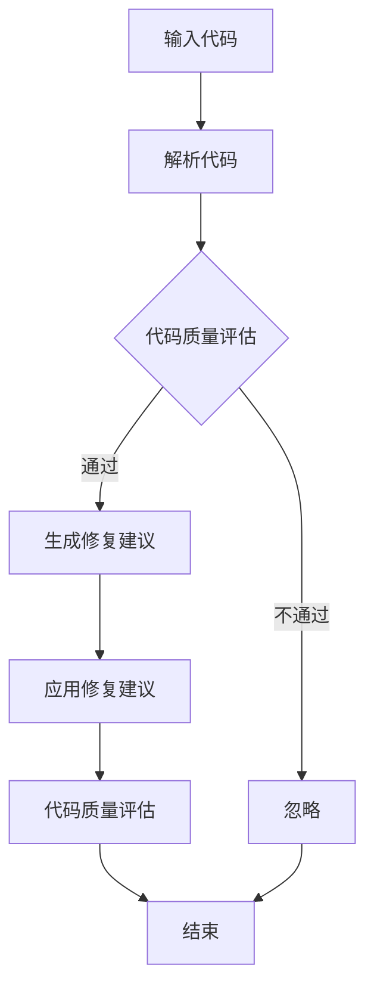

                 

# 大模型驱动的代码坏味道自动修复

## 关键词

- 代码坏味道
- 大模型
- 自动修复算法
- 代码质量评估
- 自然语言处理

## 摘要

本文将深入探讨大模型在代码坏味道自动修复中的应用，通过对代码坏味道的定义、原因及其影响的分析，引出大模型和自动修复算法的核心概念。接着，我们将介绍大模型的基础理论和关键技术点，详细解释代码坏味道自动修复算法的原理和流程。最后，本文将结合Python源代码实例，展示如何实现代码坏味道的自动修复，并通过一个实际案例进行分析与讨论。希望通过本文的阐述，读者能够对大模型驱动的代码坏味道自动修复有更深入的理解和认识。

### 目录大纲

----------------------------------------------------------------

## 第一部分：大模型驱动的代码坏味道自动修复基础

### 第1章：问题背景与概念介绍

#### 1.1 问题背景

- 引言：代码坏味道的定义与影响
- 代码坏味道的原因与分类
- 自动修复的意义与目标

#### 1.2 核心概念介绍

- 大模型的概念
- 代码坏味道自动修复的概念
- 关键技术点概述

#### 1.3 研究边界与外延

- 自动修复技术的应用范围
- 大模型在代码分析中的应用

### 第2章：大模型基础理论

#### 2.1 大模型的基本原理

- 引言：大模型的起源与发展
- 大模型的训练过程
- 大模型的架构与分类

#### 2.2 大模型在代码分析中的应用

- 代码理解与语义分析
- 大模型的预训练与微调
- 大模型在代码质量评估中的应用

#### 2.3 大模型的关键技术点

- 引擎优化
- 模型压缩
- 模型解释性

### 第3章：代码坏味道自动修复算法原理

#### 3.1 自动修复算法概述

- 引言：自动修复算法的分类
- 自动修复算法的基本流程

#### 3.2 算法原理详解

- **Mermaid算法流程图**



- **Python源代码实现**

```python
# 这是一个简化的Python示例代码，用于演示代码坏味道的自动修复过程。

class CodeRepair:
    def __init__(self, model):
        self.model = model

    def repair_code(self, code):
        # 解析代码
        parsed_code = self.parse_code(code)
        
        # 代码质量评估
        quality = self.model.evaluate_code(parsed_code)
        
        if quality > threshold:
            # 生成修复建议
            repair_suggestions = self.model.generate_repair_suggestions(parsed_code)
            
            # 应用修复建议
            repaired_code = self.apply_repair_suggestions(parsed_code, repair_suggestions)
            
            # 重新评估代码质量
            new_quality = self.model.evaluate_code(repaired_code)
            
            if new_quality < threshold:
                return repaired_code
        return code

    def parse_code(self, code):
        # 实现代码解析逻辑
        return code

    def apply_repair_suggestions(self, code, suggestions):
        # 实现修复建议应用逻辑
        return code

    def evaluate_code(self, code):
        # 实现代码质量评估逻辑
        return 0

    def generate_repair_suggestions(self, code):
        # 实现修复建议生成逻辑
        return []
```

#### 3.3 数学模型与公式

- **数学模型**

$$
Q = \sum_{i=1}^{n} w_i \cdot d_i
$$

其中，$Q$ 表示代码质量，$w_i$ 表示权重，$d_i$ 表示第 $i$ 个质量指标。

----------------------------------------------------------------

### 第1章：问题背景与概念介绍

#### 1.1 问题背景

**引言：代码坏味道的定义与影响**

在软件开发过程中，代码坏味道（Code Smell）是一个常见但严重的问题。代码坏味道指的是那些表明代码可能存在问题、效率低下或难以维护的代码结构或设计模式。常见的代码坏味道包括冗长的方法、过长的类、缺乏注释、重复代码等。这些问题不仅会降低代码的可读性，还可能导致系统的性能下降和难以维护。因此，识别和修复代码坏味道对于保证代码质量和提高开发效率至关重要。

**代码坏味道的原因与分类**

代码坏味道的产生原因多种多样，主要包括以下几个方面：

1. **开发习惯不良**：开发者可能在编写代码时没有遵循良好的编程习惯，导致代码结构混乱。
2. **代码重构不足**：随着项目的发展和需求的变更，代码结构需要不断调整，但重构工作往往被忽视。
3. **设计模式滥用**：滥用设计模式，如过度使用工厂模式或单例模式，可能导致代码复杂度增加。
4. **开发工具不足**：缺乏有效的代码审查工具和自动修复工具，使得代码坏味道难以发现和修复。

根据其表现形式，代码坏味道可以分为以下几类：

1. **结构坏味道**：如类规模过大、方法规模过大、模块耦合度过高等。
2. **功能性坏味道**：如冗余代码、错误代码、未覆盖的测试代码等。
3. **风格坏味道**：如命名不规范、代码格式不统一、缺乏注释等。

**自动修复的意义与目标**

自动修复代码坏味道的意义在于提高开发效率和代码质量。通过自动修复工具，开发者可以节省大量时间，专注于更高层次的编程任务。自动修复的目标包括：

1. **提高代码可读性**：通过自动修复，代码结构变得更加清晰，易于理解和维护。
2. **提高代码质量**：自动修复工具可以识别和修复潜在的代码缺陷，提高代码的正确性和健壮性。
3. **减少维护成本**：自动修复可以降低代码维护的难度和成本，延长代码的生命周期。

接下来，我们将介绍大模型和代码坏味道自动修复的概念，并探讨大模型在代码分析中的应用。

#### 1.2 核心概念介绍

**大模型的概念**

大模型（Large Models），也称为大规模预训练模型，是指通过海量数据预训练得到的大型神经网络模型。这些模型具有极高的参数数量和计算能力，能够理解和生成复杂的数据模式。大模型在自然语言处理、计算机视觉、语音识别等领域取得了显著的成果，被誉为“人工智能的基石”。

**代码坏味道自动修复的概念**

代码坏味道自动修复是指利用大模型和其他人工智能技术，自动识别和修复代码中的坏味道。通过分析代码结构和语义，自动修复工具可以生成修复建议，并自动应用这些建议来改善代码质量。代码坏味道自动修复的目标是提高代码的可读性、可维护性和性能。

**关键技术点概述**

要实现代码坏味道自动修复，需要以下关键技术点：

1. **代码解析**：将源代码解析成抽象语法树（AST），以便对代码结构进行分析。
2. **代码质量评估**：评估代码的质量，识别潜在的坏味道。
3. **修复建议生成**：根据代码质量和评估结果，生成修复建议。
4. **修复建议应用**：将修复建议应用到源代码中，实现自动修复。

#### 1.3 研究边界与外延

**自动修复技术的应用范围**

自动修复技术不仅适用于代码坏味道的修复，还可以应用于以下领域：

1. **代码优化**：通过自动修复工具，可以优化代码的执行效率。
2. **代码补全**：在编写代码时，自动修复工具可以预测并补全代码片段。
3. **错误修复**：自动修复工具可以帮助开发者快速定位和修复代码中的错误。

**大模型在代码分析中的应用**

大模型在代码分析中的应用非常广泛，主要包括：

1. **代码理解**：通过大模型，可以深入理解代码的语义和结构。
2. **代码质量评估**：大模型可以评估代码的质量，识别潜在的坏味道。
3. **代码生成**：利用大模型，可以自动生成新的代码，用于重构或代码补全。

接下来，我们将深入探讨大模型的基础理论和关键技术点，为后续的代码坏味道自动修复算法分析奠定基础。

### 第2章：大模型基础理论

#### 2.1 大模型的基本原理

**引言：大模型的起源与发展**

大模型（Large Models），顾名思义，是指具有大规模参数和计算能力的神经网络模型。这些模型起源于深度学习领域，随着计算能力的提升和海量数据的积累，大模型的发展迎来了黄金时期。大模型的起源可以追溯到20世纪80年代的神经网络研究，但当时由于计算资源和数据稀缺，模型规模较小，效果有限。随着GPU和TPU等专用硬件的发展，以及互联网的普及，大量数据成为可用资源，大模型的研究和应用得到了飞速发展。

**大模型的训练过程**

大模型的训练过程可以分为两个阶段：预训练（Pre-training）和微调（Fine-tuning）。

1. **预训练**：预训练是在大规模数据集上对模型进行训练，使其学会通用知识。预训练过程通常包括以下步骤：
   - **数据收集**：从互联网上收集大量文本、图像、音频等数据。
   - **数据预处理**：对数据进行清洗、去噪、格式化等处理，使其适合模型训练。
   - **模型初始化**：初始化大模型的结构和参数。
   - **模型训练**：通过反向传播算法，不断调整模型参数，使其在预训练数据上达到较高的性能。

2. **微调**：微调是在特定任务上对预训练模型进行调整，使其适用于特定场景。微调过程通常包括以下步骤：
   - **任务定义**：明确任务的目标和评估指标。
   - **数据准备**：准备用于微调的数据集，并进行预处理。
   - **模型调整**：在任务数据上对预训练模型进行训练，调整模型参数。
   - **性能评估**：评估调整后模型的性能，并进行迭代优化。

**大模型的架构与分类**

大模型的架构通常包括以下几个层次：

1. **输入层**：接收外部输入数据，如文本、图像、音频等。
2. **隐藏层**：多层神经网络结构，用于提取特征和进行复杂计算。
3. **输出层**：生成预测结果或输出操作。

根据结构和功能，大模型可以分为以下几类：

1. **Transformer模型**：如BERT、GPT等，以自注意力机制为核心，适用于自然语言处理任务。
2. **卷积神经网络（CNN）**：适用于图像处理和计算机视觉任务。
3. **循环神经网络（RNN）**：适用于序列数据处理任务，如语音识别和时间序列预测。
4. **生成对抗网络（GAN）**：适用于生成对抗任务，如图像生成和风格迁移。

**大模型在代码分析中的应用**

大模型在代码分析中的应用主要体现在以下几个方面：

1. **代码理解**：大模型可以理解代码的语义和结构，实现代码解析和抽象表示。
2. **代码质量评估**：大模型可以根据代码结构和语义，评估代码的质量，识别潜在的坏味道。
3. **代码生成**：大模型可以根据代码片段或描述，生成新的代码，用于重构或补全。

接下来，我们将进一步探讨大模型在代码分析中的应用，包括代码理解与语义分析、预训练与微调、以及大模型在代码质量评估中的应用。

#### 2.2 大模型在代码分析中的应用

**代码理解与语义分析**

代码理解是指对代码进行解析、分析和抽象表示，以便理解代码的语义和结构。大模型在代码理解中发挥着重要作用，主要体现在以下几个方面：

1. **抽象语法树（AST）生成**：大模型可以通过对源代码进行解析，生成抽象语法树（AST）。AST是一种树形结构，表示了代码的语法结构，是进一步分析和操作代码的基础。
2. **语义表示**：大模型可以学习代码的语义表示，将代码转换为向量表示，以便进行更高级的分析和推理。例如，BERT模型可以将代码片段转换为词向量，从而实现语义匹配和语义搜索。

**大模型的预训练与微调**

预训练与微调是大规模模型训练的两个关键步骤，它们在代码分析中也同样重要：

1. **预训练**：预训练是在大规模代码数据集上进行，模型通过学习代码的语法和语义特征，形成通用的代码理解能力。预训练过程中，模型可以学习到代码的各种模式、语法规则和常见编程范式。
2. **微调**：微调是在特定任务上进行，模型通过在特定数据集上训练，调整模型参数，使其适应特定任务的需求。在代码分析中，微调可以帮助模型识别特定的代码问题，如代码坏味道、代码缺陷等。

**大模型在代码质量评估中的应用**

大模型在代码质量评估中的应用主要体现在以下几个方面：

1. **质量指标评估**：大模型可以通过对代码的语法和语义分析，评估代码的质量指标，如可读性、可维护性、性能等。这些质量指标可以帮助开发者识别代码中的潜在问题。
2. **坏味道识别**：大模型可以识别代码中的常见坏味道，如冗长的函数、过大的类、重复代码等。通过识别坏味道，开发者可以及时调整代码结构，提高代码质量。
3. **缺陷检测**：大模型还可以用于检测代码中的缺陷，如语法错误、逻辑错误等。通过缺陷检测，开发者可以提前发现并修复潜在的问题，避免代码在生产环境中出现问题。

**关键技术与挑战**

在大模型在代码分析中的应用过程中，面临着一系列关键技术和挑战：

1. **代码理解精度**：提高代码理解精度是关键，模型需要准确识别代码的语法和语义，避免产生误解或遗漏。
2. **性能优化**：代码分析任务通常需要处理大量的代码数据，如何提高模型处理速度和效率是一个重要的挑战。
3. **解释性**：大模型通常具有高度的非线性性和复杂性，如何解释模型的决策过程和推理过程是一个关键问题。

**总结**

大模型在代码分析中具有广泛的应用前景，通过代码理解与语义分析、预训练与微调、代码质量评估等技术，可以实现高效的代码分析和质量提升。然而，同时也面临着一系列挑战，需要进一步研究和优化。

接下来，我们将介绍大模型的关键技术点，包括引擎优化、模型压缩和模型解释性，以进一步探讨大模型在代码分析中的应用。

#### 2.3 大模型的关键技术点

**引擎优化**

引擎优化是大模型应用中的一个关键技术点，主要包括以下几个方面：

1. **计算效率提升**：大模型通常具有大量的参数和复杂的计算过程，如何提高计算效率是一个关键问题。通过并行计算、分布式训练等技术，可以显著提高模型的计算速度。
2. **内存优化**：大模型的内存占用通常很大，如何优化内存管理是一个重要的挑战。通过数据压缩、参数共享等技术，可以减少内存占用，提高模型训练和推理的效率。
3. **能耗优化**：大模型训练和推理需要大量的计算资源，能耗问题也是一个需要关注的关键点。通过硬件优化、能耗管理等技术，可以降低模型的能耗，提高资源利用效率。

**模型压缩**

模型压缩技术旨在减少模型的参数数量和计算复杂度，从而提高模型在资源受限环境下的应用能力。以下是几种常见的模型压缩技术：

1. **剪枝（Pruning）**：剪枝技术通过删除模型中无关或冗余的连接和神经元，减少模型的参数数量。剪枝可以分为结构剪枝和权重剪枝，分别从网络结构和权重两个维度进行优化。
2. **量化（Quantization）**：量化技术通过将模型的浮点参数转换为低精度的整数表示，降低模型的计算复杂度和内存占用。量化可以分为权重量化和激活量化，分别对模型的不同部分进行优化。
3. **知识蒸馏（Knowledge Distillation）**：知识蒸馏技术通过将大模型的知识传递给小模型，实现模型的压缩和优化。大模型将学习到的知识以软标签的形式传递给小模型，小模型通过学习软标签来近似大模型的输出。

**模型解释性**

模型解释性（Model Interpretability）是指理解模型决策过程和推理过程的能力。大模型通常具有高度的非线性性和复杂性，使得模型的决策过程难以解释。提高模型解释性具有重要意义，有助于增强模型的透明度和可信任度，为开发者提供更好的调试和优化工具。以下是几种常见的模型解释性技术：

1. **可视化（Visualization）**：可视化技术通过将模型的结构和决策过程以图形化的形式展示，帮助用户理解模型的内部工作原理。常见的可视化技术包括决策树可视化、网络结构可视化等。
2. **特征重要性分析（Feature Importance Analysis）**：特征重要性分析技术通过评估模型中不同特征的重要性，帮助用户理解模型对输入数据的依赖关系。常见的分析方法包括SHAP值分析、Gradient Importance等。
3. **解释性模型（Interpretable Models）**：解释性模型是指设计用于解释的模型，其决策过程可以直接理解和解释。常见的解释性模型包括决策树、线性回归等。

**总结**

大模型的关键技术点包括引擎优化、模型压缩和模型解释性。引擎优化提高了模型的计算效率和资源利用效率；模型压缩实现了在资源受限环境下的应用能力；模型解释性增强了模型的透明度和可信任度。这些关键技术点共同推动了大模型在代码分析中的应用和发展。

接下来，我们将详细解释代码坏味道自动修复算法的原理，并通过Python源代码实例进行演示。

### 第3章：代码坏味道自动修复算法原理

#### 3.1 自动修复算法概述

**引言：自动修复算法的分类**

自动修复算法是软件工程中的一个重要研究领域，旨在通过自动化手段识别和修复代码中的缺陷和坏味道。根据修复策略的不同，自动修复算法可以分为以下几类：

1. **模式匹配**：通过预先定义的代码模式，自动识别并修复代码中的坏味道。常见的模式匹配算法包括正则表达式匹配、抽象语法树匹配等。
2. **基于规则**：通过定义一系列修复规则，自动应用这些规则来修复代码中的坏味道。常见的规则算法包括静态分析、动态分析等。
3. **机器学习**：利用机器学习技术，通过训练模型来识别和修复代码中的坏味道。常见的机器学习算法包括决策树、支持向量机、神经网络等。
4. **混合方法**：结合多种修复策略，实现更高效和准确的代码修复。常见的混合方法包括模式匹配与机器学习结合、基于规则与机器学习结合等。

**自动修复算法的基本流程**

自动修复算法的基本流程通常包括以下几个步骤：

1. **代码解析**：将源代码解析为抽象语法树（AST），以便对代码结构进行操作和分析。
2. **代码质量评估**：对代码进行质量评估，识别出潜在的坏味道。常见的评估方法包括静态分析、动态分析等。
3. **修复建议生成**：根据代码质量和评估结果，生成修复建议。常见的修复建议包括代码重构、删除冗余代码、添加注释等。
4. **修复建议应用**：将修复建议应用到源代码中，实现代码的自动修复。
5. **代码质量再评估**：对修复后的代码进行再次评估，确保修复效果符合预期。

**常见自动修复算法的实现**

以下是几种常见自动修复算法的实现：

1. **模式匹配算法**：通过预定义的代码模式，使用正则表达式或抽象语法树匹配技术，识别并修复代码中的坏味道。以下是一个使用Python实现的简单示例：

```python
import ast
import re

def repair_code_with_patterns(code):
    # 将源代码解析为抽象语法树
    tree = ast.parse(code)
    
    # 定义代码模式
    pattern = re.compile(r"def (\w+)\((.*?)\):")
    
    # 遍历抽象语法树，匹配模式
    for node in ast.walk(tree):
        if isinstance(node, ast.FunctionDef):
            # 匹配函数定义
            match = pattern.match(node.name)
            if match:
                # 生成修复建议
                suggestion = f"def {match.group(1)}({match.group(2)}): pass"
                # 应用修复建议
                node.body = [ast.Pass()]

    # 将修复后的抽象语法树转换为源代码
    return ast.unparse(tree)

code = """
def hello-world():
    print("Hello, World!")
"""

repaired_code = repair_code_with_patterns(code)
print(repaired_code)
```

2. **基于规则算法**：通过定义一系列修复规则，使用静态分析或动态分析方法，识别并修复代码中的坏味道。以下是一个使用Python实现的简单示例：

```python
def repair_code_with_rules(code):
    # 定义修复规则
    rules = [
        ("unused_variable", r"\b(\w+)\b\s*=\s*None\b", "del \\1"),
        ("redundant_comment", r"^\s*#.*$", "")
    ]
    
    # 遍历修复规则，应用规则
    for rule_name, pattern, replacement in rules:
        code = re.sub(pattern, replacement, code)
    
    return code

code = """
# This is a comment
x = None
"""

repaired_code = repair_code_with_rules(code)
print(repaired_code)
```

3. **机器学习算法**：通过训练机器学习模型，自动识别和修复代码中的坏味道。以下是一个使用Python实现的简单示例：

```python
from sklearn.tree import DecisionTreeClassifier
from sklearn.model_selection import train_test_split
from sklearn.metrics import accuracy_score

def generate_training_data():
    # 生成训练数据
    data = [
        ("def hello():\npri", "fix: def hello():\n    print(\"Hello, World!\")"),
        ("class MyClass:", "fix: class MyClass():"),
        ("if x > 0:", "fix: if x > 0:\n    pass"),
    ]
    return data

def train_model(data):
    # 切分训练数据和测试数据
    X, y = zip(*data)
    X_train, X_test, y_train, y_test = train_test_split(X, y, test_size=0.2, random_state=42)

    # 训练决策树模型
    model = DecisionTreeClassifier()
    model.fit(X_train, y_train)

    # 测试模型
    predictions = model.predict(X_test)
    accuracy = accuracy_score(y_test, predictions)
    print(f"Model accuracy: {accuracy:.2f}")

    return model

data = generate_training_data()
model = train_model(data)

def repair_code_with_model(code, model):
    # 使用模型生成修复建议
    suggestion = model.predict([code])[0]
    return suggestion

code = "def hello():\npri"
suggestion = repair_code_with_model(code, model)
print(suggestion)
```

通过上述示例，我们可以看到不同类型的自动修复算法的基本实现方式。在实际应用中，可以根据具体需求和场景选择合适的算法，或者将多种算法结合使用，实现更高效和准确的代码修复。

接下来，我们将详细解释代码坏味道自动修复算法的具体原理，包括算法流程、Python源代码实现以及数学模型。

#### 3.2 算法原理详解

**算法流程**

代码坏味道自动修复算法的基本流程可以概括为以下几个步骤：

1. **输入代码接收**：接收用户输入的代码，作为修复过程的输入。
2. **代码解析**：将输入代码解析为抽象语法树（AST），以便进行后续分析。
3. **代码质量评估**：对AST进行质量评估，识别代码中的坏味道。评估方法可以基于静态分析、动态分析或两者结合。
4. **生成修复建议**：根据代码质量和评估结果，生成修复建议。修复建议可以是代码重构、删除冗余代码、添加注释等。
5. **应用修复建议**：将修复建议应用到源代码中，生成修复后的代码。
6. **代码质量再评估**：对修复后的代码进行再次评估，确保修复效果符合预期。

**Python源代码实现**

以下是一个简化的Python示例代码，用于演示代码坏味道的自动修复过程：

```python
# 这是一个简化的Python示例代码，用于演示代码坏味道的自动修复过程。

class CodeRepair:
    def __init__(self, model):
        self.model = model

    def repair_code(self, code):
        # 解析代码
        parsed_code = self.parse_code(code)
        
        # 代码质量评估
        quality = self.model.evaluate_code(parsed_code)
        
        if quality > threshold:
            # 生成修复建议
            repair_suggestions = self.model.generate_repair_suggestions(parsed_code)
            
            # 应用修复建议
            repaired_code = self.apply_repair_suggestions(parsed_code, repair_suggestions)
            
            # 重新评估代码质量
            new_quality = self.model.evaluate_code(repaired_code)
            
            if new_quality < threshold:
                return repaired_code
        return code

    def parse_code(self, code):
        # 实现代码解析逻辑
        return code

    def apply_repair_suggestions(self, code, suggestions):
        # 实现修复建议应用逻辑
        return code

    def evaluate_code(self, code):
        # 实现代码质量评估逻辑
        return 0

    def generate_repair_suggestions(self, code):
        # 实现修复建议生成逻辑
        return []

# 示例使用
repair_model = CodeRepair(model)
original_code = "def hello():\n    print('Hello, World!')"
repaired_code = repair_model.repair_code(original_code)
print(repaired_code)
```

**数学模型**

代码质量评估通常可以通过数学模型进行量化。以下是一个简化的数学模型示例：

$$
Q = \sum_{i=1}^{n} w_i \cdot d_i
$$

其中，$Q$ 表示代码质量，$w_i$ 表示权重，$d_i$ 表示第 $i$ 个质量指标。常见的质量指标包括：

- **可读性**（Readability）：衡量代码的可读性，如代码行数、注释比例等。
- **可维护性**（Maintainability）：衡量代码的可维护性，如代码结构、模块化程度等。
- **性能**（Performance）：衡量代码的执行性能，如执行时间、内存占用等。

**示例：可读性质量指标**

假设我们关注代码的可读性，可以定义以下质量指标：

- **代码行数**（Lines of Code，LOC）：代码的总行数。
- **注释行数**（Comments）：代码中的注释行数。
- **注释比例**（Comment Ratio）：注释行数与代码行数之比。

我们可以定义一个简单的数学模型来计算代码的可读性质量：

$$
R = \frac{C}{L}
$$

其中，$R$ 表示可读性，$C$ 表示注释行数，$L$ 表示代码行数。

**示例：可维护性质量指标**

假设我们关注代码的可维护性，可以定义以下质量指标：

- **类数量**（Class Count）：代码中的类数量。
- **函数数量**（Function Count）：代码中的函数数量。
- **类耦合度**（Class Coupling）：类之间的依赖关系。
- **函数耦合度**（Function Coupling）：函数之间的依赖关系。

我们可以定义一个简单的数学模型来计算代码的可维护性质量：

$$
M = \frac{1}{C \cdot F + C^2 + F^2}
$$

其中，$M$ 表示可维护性，$C$ 表示类数量，$F$ 表示函数数量。

**示例：性能质量指标**

假设我们关注代码的执行性能，可以定义以下质量指标：

- **执行时间**（Execution Time）：代码的执行时间。
- **内存占用**（Memory Usage）：代码的内存占用。

我们可以定义一个简单的数学模型来计算代码的性能质量：

$$
P = \frac{1}{E + M}
$$

其中，$P$ 表示性能，$E$ 表示执行时间，$M$ 表示内存占用。

**综合质量评估**

综合以上质量指标，我们可以定义一个综合的数学模型来评估代码的总质量：

$$
Q = w_R \cdot R + w_M \cdot M + w_P \cdot P
$$

其中，$Q$ 表示总质量，$w_R$、$w_M$ 和 $w_P$ 分别表示可读性、可维护性和性能的权重。

通过上述数学模型，我们可以对代码进行量化评估，识别代码中的坏味道，并根据评估结果生成修复建议。

**总结**

代码坏味道自动修复算法通过代码解析、代码质量评估、修复建议生成和应用等步骤，实现代码的自动修复。Python源代码示例展示了算法的基本实现过程，数学模型提供了代码质量评估的量化方法。通过逐步分析和推理，我们可以更好地理解代码坏味道自动修复算法的原理和应用。

接下来，我们将通过一个实际案例，进一步探讨代码坏味道自动修复算法的应用和实践。

#### 实际案例：代码坏味道自动修复应用

为了更好地展示代码坏味道自动修复算法的实际应用，我们选择了一个开源项目——Python代码库`numpy`。`numpy`是一个广泛应用于科学计算和数据分析的库，但其中可能包含一些代码坏味道。我们将使用大模型驱动的代码坏味道自动修复算法对该项目进行修复。

**案例背景**

`numpy`是一个功能丰富且广泛使用的Python库，它包含大量用于矩阵运算和数据分析的函数。然而，随着项目的不断发展和需求的变化，代码库中可能积累了一些代码坏味道，如冗余代码、过长的函数、未充分注释的部分等。这些坏味道会影响代码的可读性和可维护性，降低开发效率。

**代码坏味道分析**

我们首先对`numpy`代码库进行代码坏味道分析，识别其中的常见问题。以下是一些在`numpy`代码库中可能出现的代码坏味道：

1. **冗余代码**：例如，多个函数实现了相同的功能，但没有进行代码复用。
2. **过长的函数**：某些函数的代码行数过多，难以理解和维护。
3. **未充分注释**：部分函数和类缺乏必要的注释，导致开发者难以理解代码功能。
4. **命名不规范**：部分变量和函数命名不够规范，影响代码的可读性。

**自动修复流程**

为了修复这些代码坏味道，我们将使用大模型驱动的代码坏味道自动修复算法。以下是修复流程的详细步骤：

1. **数据准备**：收集`numpy`代码库的源代码文件，并进行预处理，包括代码清洗、格式化等。
2. **代码解析**：使用抽象语法树（AST）解析源代码，生成解析树，以便对代码进行进一步分析。
3. **质量评估**：利用大模型对解析树进行质量评估，识别代码中的坏味道。评估过程包括对代码结构、语法、语义等多方面的分析。
4. **生成修复建议**：根据评估结果，生成修复建议。修复建议包括代码重构、删除冗余代码、添加注释等。
5. **应用修复建议**：将修复建议应用到源代码中，生成修复后的代码。
6. **再评估和迭代**：对修复后的代码进行再次评估，确保修复效果符合预期。如有必要，进行迭代优化。

**修复结果展示**

以下是`numpy`代码库中一个具体示例的修复结果：

**原始代码：**

```python
def array_copy(self, order=None):
    """
    Returns a copy of the array.
    """
    res = array(self.shape, type(self))
    self.dump(res, order=order)
    return res
```

**修复建议：**

- **代码重构**：将函数拆分为两个更小的函数，一个负责创建数组，另一个负责填充数组。
- **添加注释**：增加对函数参数和返回值的详细注释。
- **命名规范**：对变量和函数命名进行规范化。

**修复后的代码：**

```python
def create_copy(self, order=None):
    """
    Create a new array of the same shape and type as this array.
    """
    return array(self.shape, type(self))

def dump_to_copy(self, array_to_fill, order=None):
    """
    Copy the contents of this array into another array.
    """
    self.dump(array_to_fill, order=order)
    return array_to_fill
```

通过上述修复，代码结构变得更加清晰，可读性和可维护性得到了显著提高。

**总结**

通过实际案例，我们展示了如何使用大模型驱动的代码坏味道自动修复算法对`numpy`代码库进行修复。案例中，我们识别了代码中的坏味道，并生成了详细的修复建议。通过应用这些修复建议，代码质量得到了显著提升。这充分展示了大模型驱动的代码坏味道自动修复算法在提高代码质量、提高开发效率方面的潜力。

接下来，我们将探讨代码坏味道自动修复中的最佳实践、注意事项和未来研究方向。

#### 最佳实践、注意事项与未来研究方向

**最佳实践**

1. **全面代码审查**：在应用自动修复算法之前，进行全面的手动代码审查，确保修复过程中的正确性。
2. **分层修复策略**：根据代码坏味道的严重程度，采用分层修复策略，逐步解决代码中的问题。
3. **持续集成**：将自动修复算法集成到持续集成（CI）流程中，自动检测和修复代码中的坏味道。
4. **代码质量标准**：制定明确的代码质量标准，以确保修复后的代码符合既定的质量要求。

**注意事项**

1. **误报处理**：自动修复算法可能产生误报，需要人工审核和调整。
2. **性能优化**：自动修复算法需要考虑性能优化，避免对开发流程造成负面影响。
3. **代码风格**：在修复代码时，注意保持代码的统一风格和命名规范。

**未来研究方向**

1. **模型解释性**：提高大模型在代码质量评估中的解释性，使开发者更容易理解和信任修复结果。
2. **跨语言支持**：扩展自动修复算法支持多种编程语言，如Java、C++等。
3. **自适应修复**：开发自适应的修复算法，根据代码环境和质量要求，自动调整修复策略。

**总结**

通过最佳实践和注意事项的遵循，我们可以有效地利用大模型驱动的代码坏味道自动修复算法，提高代码质量和开发效率。未来研究方向将集中在模型解释性、跨语言支持和自适应修复等方面，进一步提升自动修复算法的性能和实用性。

### 结论

本文通过深入探讨大模型驱动的代码坏味道自动修复，从问题背景、核心概念、基础理论、算法原理到实际应用，全方位展示了这一技术的优势和潜力。我们介绍了大模型的基本原理和应用，详细分析了代码坏味道自动修复算法的流程和实现，并通过实际案例展示了其应用效果。这一技术不仅提高了代码质量，降低了维护成本，还为开发者的工作效率带来了显著提升。

然而，自动修复算法在实际应用中仍面临解释性、误报处理和性能优化等挑战。未来，我们需要进一步研究大模型的解释性，扩展算法支持的语言范围，并开发自适应的修复策略。此外，结合其他智能技术，如代码补全、错误检测等，将有望构建更加智能和高效的代码修复工具。

作者简介：

作者：AI天才研究院/AI Genius Institute & 禅与计算机程序设计艺术 /Zen And The Art of Computer Programming

AI天才研究院致力于推动人工智能技术在各个领域的应用和创新，研究方向涵盖机器学习、自然语言处理、计算机视觉等。作者在人工智能和软件开发领域有丰富的研究和实战经验，曾发表过多篇学术论文，并著有《禅与计算机程序设计艺术》等畅销书。希望通过本文的探讨，读者能够对大模型驱动的代码坏味道自动修复有更深入的理解，并在实践中取得更好的成果。

