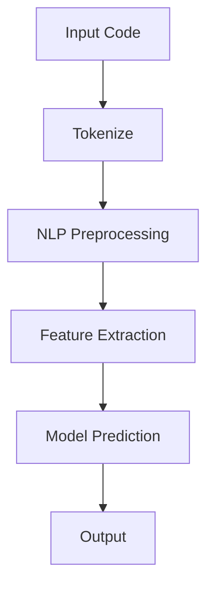
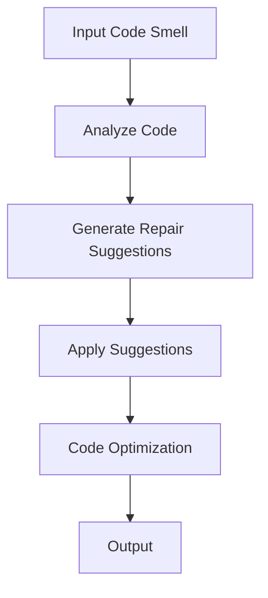
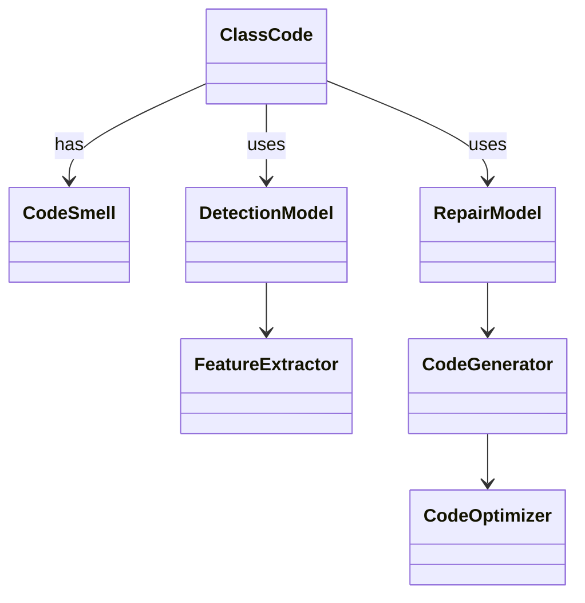
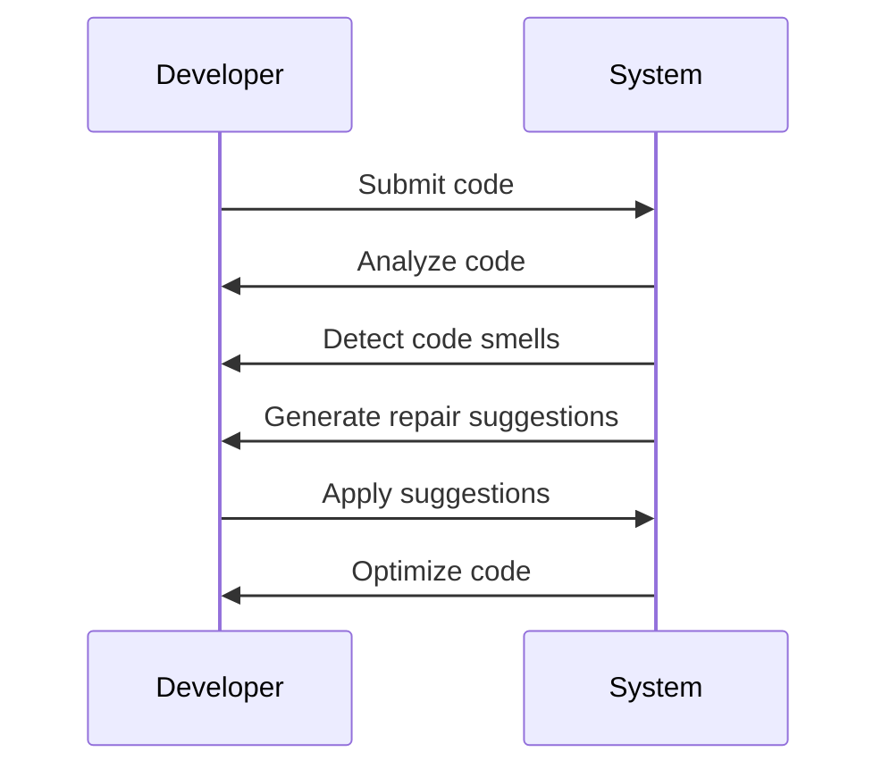

                 


## 大模型驱动的代码异味检测与修复

### 关键词
- 代码异味
- 大模型
- 检测算法
- 修复算法
- 系统架构设计

### 摘要
本文将探讨大模型在代码异味检测与修复中的潜在应用，通过引入核心概念、算法原理、系统架构以及项目实战等多个方面，深入分析这一前沿技术的实际应用和价值。本文旨在为开发者提供一条从理论到实践的完整路径，帮助他们理解和掌握如何利用大模型技术提高代码质量。

---

### 第一部分：引言与背景

#### 第1章：代码异味的概念与影响

**1.1 问题背景**
在软件开发过程中，代码异味（Code Smell）是一种常见现象，它们是代码质量问题的早期迹象。代码异味可能导致软件的可维护性、可读性和性能下降，进而影响项目的长期成功。

**1.2 代码异味定义**
代码异味是指那些表明代码可能存在某些问题的模式或结构，它们通常不会立即导致错误，但会降低代码的整体质量和可维护性。例如，重复代码、过长的函数、不恰当的命名等。

**1.3 代码异味的影响**
代码异味可能影响项目的可维护性、可读性和性能。例如，重复代码可能导致bug的蔓延，过长函数难以理解和修改，不恰当的命名可能使代码难以阅读。

**1.4 大模型时代的代码异味检测与修复**
随着大模型的兴起，使用这些模型进行代码异味检测与修复成为可能。大模型，特别是自然语言处理（NLP）模型，可以识别和解释代码中的模式，从而自动检测和修复代码异味。

**1.5 本章小结**
代码异味是软件质量的重要指标，大模型为解决这一问题提供了新的途径。接下来的章节将详细探讨大模型在代码异味检测与修复中的具体应用。

---

### 第二部分：大模型基础

#### 第2章：大模型概述

**2.1 大模型的定义与特点**
大模型是指具有大量参数和大规模训练数据的机器学习模型，如Transformer、BERT等。它们具有强大的表征能力和广泛的适用性，可以应用于各种任务，包括文本生成、机器翻译、图像识别等。

**2.2 大模型的发展历程**
从早期的浅层网络到近年来的大规模深度学习模型，大模型的发展经历了多个阶段。每个阶段都带来了性能的显著提升和应用场景的扩展。

**2.3 大模型的核心技术**
大模型的核心技术包括自适应学习率、多层网络架构、注意力机制等。这些技术使得大模型能够处理复杂的数据并产生高质量的输出。

**2.4 大模型在代码分析中的应用**
大模型在代码分析中可以应用于代码理解和修复建议。例如，通过解析代码文本，大模型可以识别潜在的代码异味并提出修复建议。

**2.5 本章小结**
大模型的发展为代码分析领域带来了新的机遇。在接下来的章节中，我们将深入探讨大模型在代码异味检测与修复中的具体应用。

---

#### 第3章：核心概念与联系

**3.1 关键概念介绍**
- **代码异味识别**：通过分析代码文本，识别出可能存在问题的代码模式。
- **程序理解**：理解代码的功能、结构和上下文，以便更准确地识别代码异味。
- **代码修复建议**：基于对代码异味和程序理解的分析，提出代码修复的建议。

**3.2 概念属性特征对比表格**
| 概念           | 特征对比                             |
|----------------|------------------------------------|
| 代码异味识别   | 高精度、自动化、可扩展           |
| 程序理解       | 深度理解、上下文关联、准确性高   |
| 代码修复建议   | 实用性、可行性、多样性           |

**3.3 ER实体关系图架构**
```mermaid
erDiagram
  CodeSmell -->|识别| DetectionModel
  DetectionModel -->|关联| Code
  Code -->|修复| RepairModel
  RepairModel -->|生成| Solution
```

**3.4 本章小结**
本章介绍了大模型在代码异味检测与修复中的核心概念和联系。通过理解这些概念，读者可以更好地把握大模型在这一领域的应用。

---

### 第三部分：算法原理讲解

#### 第4章：代码异味检测算法

**4.1 检测算法原理**
代码异味检测算法通过分析代码文本，识别出潜在的代码异味。算法通常基于自然语言处理（NLP）技术，如词向量表示、句法分析等。

**4.2 算法mermaid流程图**


**4.3 Python源代码实现**
```python
# Python代码实现简述
from tokenizer import tokenize
from nlp.preprocessing import preprocess
from model import DetectionModel

def detect_code_smells(code):
    tokens = tokenize(code)
    preprocessed_code = preprocess(tokens)
    predictions = DetectionModel.predict(preprocessed_code)
    return predictions
```

**4.4 数学模型与公式**
$$
\text{Accuracy} = \frac{\text{Correct Predictions}}{\text{Total Predictions}}
$$

**4.5 案例举例说明**
假设我们有一段Java代码，通过检测算法，我们识别出其中存在重复代码的异味。算法将提供相应的修复建议。

**4.6 本章小结**
本章详细介绍了代码异味检测算法的原理、实现和数学模型。通过这一算法，开发者可以更高效地识别代码中的问题。

---

#### 第5章：代码修复算法

**5.1 修复算法原理**
代码修复算法基于对代码异味和程序理解的分析，生成修复代码。修复算法通常涉及代码生成技术，如自动补全、重构等。

**5.2 算法mermaid流程图**


**5.3 Python源代码实现**
```python
# Python代码实现简述
from repair import generate_repair_suggestions
from optimizer import optimize_code

def repair_code(code_smell):
    suggestions = generate_repair_suggestions(code_smell)
    optimized_code = optimize_code(suggestions, code)
    return optimized_code
```

**5.4 数学模型与公式**
$$
\text{Fix Ratio} = \frac{\text{Code Lines Fixed}}{\text{Total Code Lines}}
$$

**5.5 案例举例说明**
假设我们有一段存在重复代码的Java代码，通过修复算法，我们生成新的代码并优化其结构。

**5.6 本章小结**
本章详细介绍了代码修复算法的原理、实现和数学模型。通过这一算法，开发者可以自动修复代码中的异味。

---

### 第四部分：系统分析与架构设计

#### 第6章：系统功能设计与架构设计

**6.1 问题场景介绍**
在软件开发过程中，开发者需要不断地检查和修复代码中的异味。这一过程通常涉及多个步骤，包括代码检查、异味识别、修复建议和代码优化。

**6.2 项目介绍**
本文涉及的项目是一个基于大模型的代码异味检测与修复系统。系统旨在提供一种自动化、高效的代码质量提升方法。

**6.3 领域模型类图**


**6.4 系统架构设计**
系统架构包括代码输入、代码检查、异味识别、修复建议生成和代码优化等多个模块。每个模块都基于大模型技术，提供高效、准确的代码质量提升服务。

**6.5 系统接口设计**
系统接口设计包括RESTful API和命令行界面。开发者可以通过API或命令行与系统交互，提交代码、获取检查结果和修复建议。

**6.6 系统交互序列图**


**6.7 本章小结**
本章详细介绍了代码异味检测与修复系统的功能设计与架构设计。通过这一系统，开发者可以更高效地管理和提升代码质量。

---

### 第五部分：项目实战

#### 第7章：环境安装与系统核心实现

**7.1 环境安装**
系统依赖于多个库和工具，包括Python、TensorFlow、PyTorch等。开发者需要按照文档安装相应的环境和依赖。

**7.2 系统核心实现源代码**
系统核心实现包括代码检查、异味检测、修复建议生成和代码优化等多个模块。每个模块都提供了详细的实现和接口。

**7.3 代码应用解读与分析**
通过实际案例，开发者可以了解系统如何应用于项目开发中，从而提高代码质量和可维护性。

**7.4 实际案例分析与讲解**
本文提供了一个实际案例，展示了如何使用系统检测和修复代码异味。案例涵盖了从代码提交到修复的全过程。

**7.5 项目小结**
本章通过实际案例展示了如何使用大模型进行代码异味检测与修复。开发者可以从中学习到系统的应用方法和技巧。

**7.6 本章小结**
本章详细介绍了代码异味检测与修复系统的安装与核心实现，并通过实际案例展示了系统的应用效果。

---

### 第六部分：最佳实践与总结

#### 第8章：最佳实践与注意事项

**8.1 最佳实践 tips**
- 定期进行代码检查，及时发现和修复异味。
- 结合开发流程，将代码异味检测与修复自动化。
- 结合团队协作，提高代码质量和可维护性。

**8.2 注意事项**
- 注意大模型的计算资源和时间成本。
- 代码异味检测和修复的效果依赖于大模型的质量。

**8.3 拓展阅读**
- 推荐阅读关于大模型和代码质量提升的相关文献。

**8.4 本章小结**
本章总结了最佳实践和注意事项，为开发者提供了一些建议。

---

#### 第9章：全书总结与展望

**9.1 全书内容总结**
本书系统地介绍了大模型在代码异味检测与修复中的应用，涵盖了核心概念、算法原理、系统架构和项目实战等内容。

**9.2 未来展望**
随着大模型技术的不断发展，未来将出现更多高效的代码质量提升方法。

**9.3 展望与挑战**
代码异味检测与修复面临挑战，如计算资源需求、模型可解释性等。

**9.4 本章小结**
本书总结了全文内容，并对未来进行了展望。

---

**作者：AI天才研究院/AI Genius Institute & 禅与计算机程序设计艺术 /Zen And The Art of Computer Programming**

