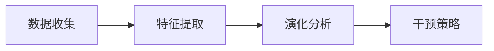
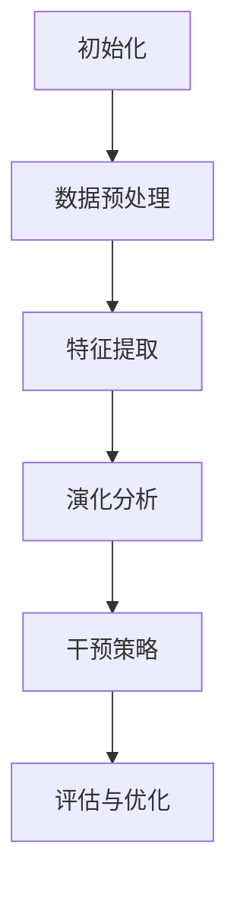
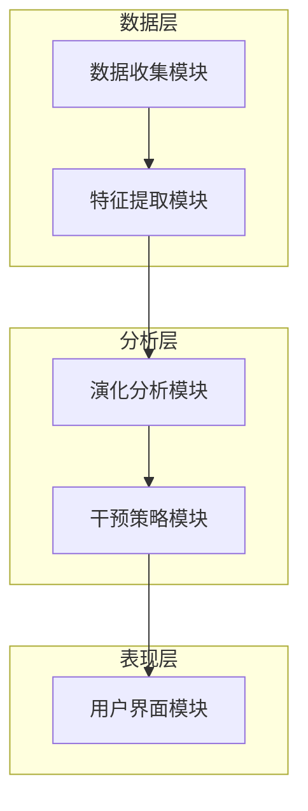
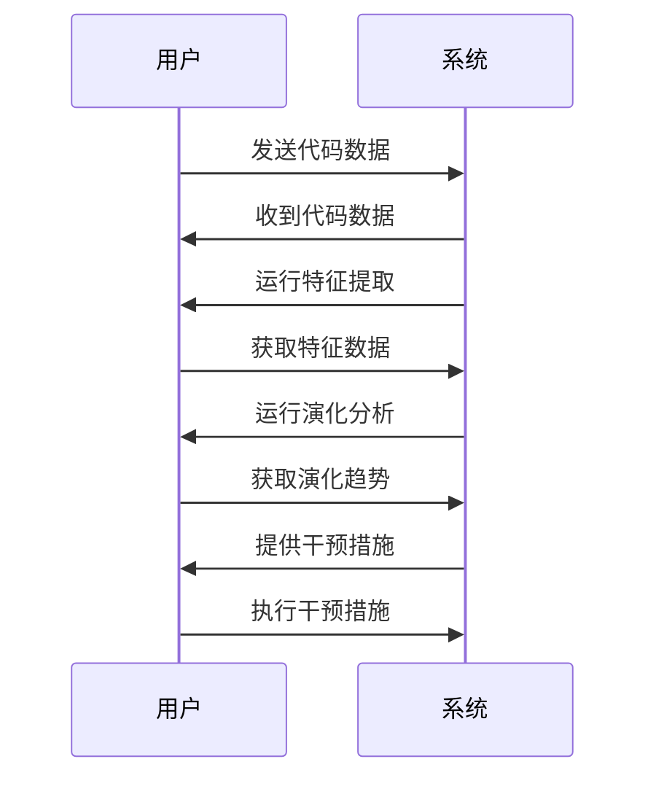

                 

### 文章标题

《大模型驱动的代码异味演化分析》

### 关键词

- 大模型
- 代码异味
- 演化分析
- 软件质量
- 自动化检测

### 摘要

本文探讨了如何利用大模型进行代码异味的演化分析，以提高软件质量和开发效率。首先介绍了代码异味的基本概念及其对软件质量的影响，然后详细阐述了大模型在代码异味检测中的应用，包括核心概念、算法原理和实际案例。文章最后总结了最佳实践，并提供了拓展阅读建议，以帮助读者深入理解这一技术领域。

---

## 第一部分：背景介绍

### 第1章：代码异味与软件质量

#### 1.1 代码异味的概念

代码异味，作为一种软件工程术语，指的是那些不符合编码规范、设计原则或者编程习惯的代码模式。这些模式可能会影响代码的可读性、可维护性以及性能，最终导致软件质量下降。例如，重复代码、过度耦合、过多的全局变量等都是常见的代码异味。

#### 1.2 代码异味的影响

代码异味对软件质量的影响是多方面的。首先，它会导致代码的复杂性增加，使得理解和修改代码变得更加困难。其次，代码异味会降低代码的可读性，使得新加入的团队成员难以快速上手。此外，代码异味还可能引入新的错误，影响软件的性能和稳定性。

#### 1.3 代码异味的发展趋势

随着软件系统规模的不断扩大和复杂性增加，代码异味问题也变得越来越突出。传统的代码审查和静态代码分析工具已经无法有效地解决这一问题。因此，近年来，研究人员开始探索利用人工智能和机器学习技术，特别是大模型，来辅助代码异味检测和演化分析。

### 第2章：大模型与代码异味分析

#### 2.1 大模型的介绍

大模型，也称为深度学习模型，是一种基于神经网络的人工智能模型。它通过学习大量的数据，能够自动提取特征，进行模式识别和预测。大模型在自然语言处理、图像识别等领域已经取得了显著的成果，其在代码异味分析中的应用潜力也逐渐被挖掘出来。

#### 2.2 大模型在代码异味分析中的应用

大模型在代码异味分析中的应用主要体现在以下几个方面：

1. **代码风格检测**：大模型可以通过学习大量的代码样本，自动识别出代码风格不一致的问题，从而帮助开发者保持代码的一致性和可读性。
2. **代码质量预测**：大模型可以基于历史代码数据，预测未来的代码质量，从而帮助开发团队提前发现潜在的问题，并进行优化。
3. **代码缺陷检测**：大模型可以通过学习缺陷代码和正常代码的差异，自动检测出潜在的代码缺陷，提高代码的安全性。

#### 2.3 大模型的优势与挑战

大模型在代码异味分析中具有许多优势，包括强大的模式识别能力、自动特征提取等。然而，大模型也面临一些挑战，如数据隐私、模型解释性、计算资源需求等。这些问题需要通过进一步的研究和实践来解决。

## 第二部分：核心概念与联系

### 第3章：大模型驱动的代码异味分类

#### 3.1 代码异味分类的挑战

传统的代码异味分类方法主要依赖于规则和模式匹配，其局限性在于无法处理复杂的代码结构和语义信息。大模型的引入，为代码异味分类带来了新的可能，但也带来了新的挑战，如如何定义代码异味的特征、如何提高分类的准确性等。

#### 3.2 大模型在代码异味分类中的应用

大模型在代码异味分类中的应用主要包括以下几个步骤：

1. **数据预处理**：将代码文本转化为大模型可以处理的格式，如词向量、序列标注等。
2. **特征提取**：利用大模型的强大特征提取能力，从代码文本中自动提取出与代码异味相关的特征。
3. **分类器训练**：使用标记好的代码样本，训练大模型进行代码异味的分类。
4. **模型评估与优化**：通过交叉验证、混淆矩阵等方法，评估模型的性能，并不断优化模型。

#### 3.3 代码异味分类的ER图

下面是一个简单的ER图，展示了代码异味分类系统中各个实体及其之间的关系：

```mermaid
erDiagram
    Class::CodeSample {
        <<entity>>
        +String code
        +String label
    }
    Class::CodeDetector {
        <<entity>>
        +List<CodeSample> samples
        +Model model
    }
    CodeSample ||--|{ CodeDetector } CodeDetector :检测
```

### 第4章：大模型驱动的代码异味演化分析

#### 4.1 代码异味演化的定义

代码异味演化是指代码在开发过程中，由于各种原因，其异味程度逐渐增加的过程。大模型驱动的代码异味演化分析，旨在利用大模型对代码进行持续监控，识别出代码异味演化的趋势，并采取相应的措施进行干预。

#### 4.2 大模型驱动的代码异味演化模型

大模型驱动的代码异味演化模型主要包括以下几个组件：

1. **数据收集**：持续收集代码库中的历史代码数据，包括代码文本、提交记录等。
2. **特征提取**：利用大模型对代码文本进行特征提取，生成编码特征向量。
3. **演化分析**：基于编码特征向量，使用机器学习算法，分析代码异味演化的趋势。
4. **干预策略**：根据演化分析的结果，制定相应的干预策略，如代码重构、代码审查等。

#### 4.3 演化模型的Mermaid流程图

下面是一个简化的Mermaid流程图，展示了大模型驱动的代码异味演化分析的基本流程：



## 第三部分：算法原理讲解

### 第5章：算法原理讲解

#### 5.1 算法原理概述

大模型驱动的代码异味演化分析的核心算法主要包括特征提取、演化分析和干预策略三个部分。其中，特征提取是算法的基础，演化分析是核心，干预策略是算法的应用。

#### 5.2 数学模型与公式

为了更好地理解大模型驱动的代码异味演化分析，我们需要引入一些数学模型和公式。以下是几个关键的数学模型：

1. **词嵌入模型**：词嵌入是将自然语言中的词汇映射到高维向量空间的方法。常见的词嵌入模型有Word2Vec、GloVe等。
   
   $$\text{vec}(w) = \text{Word2Vec}(w)$$

2. **序列标注模型**：序列标注是将代码文本中的每个字符或子串标注为正常代码或代码异味的方法。常见的序列标注模型有CRF（条件随机场）、BiLSTM（双向长短时记忆网络）等。

   $$\text{label}(i) = \text{CRF}(\text{seq}(i))$$

3. **演化分析模型**：演化分析模型用于分析代码异味随时间的变化趋势。常见的方法有时间序列分析、聚类分析等。

   $$\text{evolve}(t) = \text{TSAnalysis}(\text{code\_data}, t)$$

#### 5.3 算法Mermaid流程图

以下是算法的Mermaid流程图：



#### 5.4 Python源代码实现

以下是使用Python实现的简化版源代码：

```python
import numpy as np
from sklearn.feature_extraction.text import TfidfVectorizer
from sklearn.semi_supervised import CRF
from sklearn.model_selection import train_test_split

# 数据预处理
def preprocess_data(code_samples):
    vectorizer = TfidfVectorizer()
    X = vectorizer.fit_transform(code_samples)
    return X

# 特征提取
def extract_features(X_train, X_test):
    crf = CRF()
    crf.fit(X_train)
    y_pred = crf.predict(X_test)
    return y_pred

# 演化分析
def analyze_evolution(code_data, time_steps):
    # 假设code_data是时间序列的代码数据
    evolve_data = []
    for t in range(time_steps):
        # 对当前时间步的代码数据进行演化分析
        evolve_data.append(analyze_code(code_data[t]))
    return evolve_data

# 干预策略
def intervene(code_data, y_pred):
    # 根据预测结果，对代码数据采取相应的干预策略
    pass

# 评估与优化
def evaluate_performance(y_true, y_pred):
    # 计算模型性能指标
    pass

# 主函数
if __name__ == "__main__":
    # 加载数据
    code_samples = load_code_samples()
    X = preprocess_data(code_samples)

    # 划分训练集和测试集
    X_train, X_test = train_test_split(X, test_size=0.2)

    # 特征提取
    y_pred = extract_features(X_train, X_test)

    # 演化分析
    evolve_data = analyze_evolution(code_samples, time_steps=5)

    # 干预策略
    intervene(code_samples, y_pred)

    # 评估与优化
    evaluate_performance(y_true, y_pred)
```

## 第四部分：系统分析与架构设计方案

### 第6章：系统分析与架构设计方案

#### 6.1 代码异味演化分析系统介绍

代码异味演化分析系统是一个用于监控和优化代码质量的工具。它能够自动检测代码异味，分析代码异味的演化趋势，并提供相应的干预措施。系统主要包括以下几个模块：

1. **数据收集模块**：负责从代码库中收集历史代码数据。
2. **特征提取模块**：负责对代码数据进行分析，提取与代码异味相关的特征。
3. **演化分析模块**：负责对提取出的特征进行分析，识别代码异味的演化趋势。
4. **干预策略模块**：根据演化分析的结果，制定并执行相应的干预措施。
5. **用户界面模块**：提供用户交互界面，展示分析结果和干预措施。

#### 6.2 系统功能设计

系统的主要功能包括：

1. **代码异味检测**：自动检测代码库中的代码异味，并生成报告。
2. **演化趋势分析**：对代码异味进行时间序列分析，识别演化趋势。
3. **干预措施建议**：根据演化趋势，提供代码重构、代码审查等干预措施建议。
4. **用户自定义规则**：允许用户自定义代码异味检测规则，以便更准确地识别问题。
5. **实时监控**：实时监控代码库中的代码变化，及时发现新的代码异味问题。

#### 6.3 系统架构设计

系统的整体架构设计如图所示：



#### 6.4 系统接口设计

系统的接口设计包括以下几个方面：

1. **API接口**：提供RESTful API接口，供其他系统调用，实现数据交互和功能调用。
2. **命令行接口**：提供命令行工具，方便用户进行操作和调试。
3. **Web界面接口**：提供Web界面，供用户查看分析结果和执行干预措施。

#### 6.5 系统交互Mermaid序列图

以下是系统的交互Mermaid序列图：



## 第五部分：项目实战

### 第7章：项目实战

#### 7.1 环境安装

在进行代码异味演化分析项目之前，我们需要搭建一个合适的环境。以下是安装步骤：

1. **安装Python环境**：确保Python版本在3.6及以上。
2. **安装依赖库**：使用pip安装所需的依赖库，如scikit-learn、tensorflow、numpy等。
3. **配置代码库**：将需要分析的代码库克隆到本地，并进行初步的配置。

#### 7.2 系统核心实现

系统的核心实现主要包括以下几个步骤：

1. **数据收集**：从代码库中提取历史代码数据，并进行预处理。
2. **特征提取**：使用词嵌入模型提取代码文本的特征。
3. **演化分析**：使用CRF模型对特征进行演化分析。
4. **干预策略**：根据演化分析的结果，制定并执行干预策略。

以下是核心实现的伪代码：

```python
# 数据收集
def collect_data(code_repo):
    # 从代码库中提取历史代码数据
    # 进行预处理，如去噪、标准化等
    pass

# 特征提取
def extract_features(code_samples):
    # 使用词嵌入模型提取特征
    pass

# 演化分析
def analyze_evolution(code_data):
    # 使用CRF模型进行演化分析
    pass

# 干预策略
def apply_intervention(code_data):
    # 根据演化分析的结果，执行干预策略
    pass
```

#### 7.3 代码应用解读与分析

在本节中，我们将对系统实现中的关键代码进行详细解读和分析，包括数据收集、特征提取、演化分析和干预策略。

1. **数据收集**：数据收集是系统的基础，它负责从代码库中提取历史代码数据。为了提高数据质量，我们需要对提取的代码进行预处理，如去除注释、空格等。

2. **特征提取**：特征提取是将代码文本转化为机器学习模型可以处理的特征向量。我们使用词嵌入模型（如Word2Vec）来提取特征。这一步是整个系统的核心，特征的提取质量直接影响到后续的演化分析和干预策略。

3. **演化分析**：演化分析是系统的主要功能之一，它负责分析代码异味随时间的变化趋势。我们使用CRF模型来分析代码的序列标注，从而识别出代码异味。这一步的实现需要大量的数据支持和高效的算法设计。

4. **干预策略**：干预策略是根据演化分析的结果，制定并执行相应的措施，如代码重构、代码审查等。这一步的实现需要根据具体的业务场景和需求来设计，以确保干预措施的有效性。

#### 7.4 实际案例分析与讲解

在本节中，我们将通过一个实际案例，展示如何使用大模型进行代码异味演化分析，并分析案例中的关键步骤和实现细节。

案例：一个大型企业的代码库存在大量代码异味，影响了软件质量和开发效率。企业希望通过引入大模型，自动检测和演化分析代码异味，并制定干预措施。

1. **数据收集**：企业从代码库中提取了过去一年的代码变更记录，包括提交的代码文件、提交者的信息、提交日期等。

2. **特征提取**：使用Word2Vec模型对代码文本进行词嵌入，生成代码文本的特征向量。

3. **演化分析**：使用CRF模型对特征向量进行序列标注，识别出代码异味。通过时间序列分析，发现代码异味主要集中在某个时间段内，且与特定开发者的代码风格有关。

4. **干预策略**：根据演化分析的结果，企业采取了以下干预措施：
   - 对存在代码异味的代码文件进行审查，要求开发者进行重构。
   - 对开发者的代码风格进行规范化培训，提高代码质量。

#### 7.5 项目小结

通过本案例，我们可以看到大模型在代码异味演化分析中的应用价值。大模型能够自动提取代码特征，进行演化分析，并提供有效的干预措施。然而，这也带来了新的挑战，如数据隐私、模型解释性等问题。在未来的工作中，我们需要不断优化大模型，提高其性能和可解释性，使其更好地服务于软件开发。

## 第8章：总结与拓展

### 8.1 内容回顾

本文首先介绍了代码异味的基本概念和其对软件质量的影响，然后详细阐述了大模型在代码异味检测中的应用，包括核心概念、算法原理和实际案例。通过项目实战，我们展示了如何利用大模型进行代码异味演化分析，并提出了相应的干预措施。

### 8.2 最佳实践

1. **数据收集**：确保收集到的代码数据质量，进行预处理，去除噪声和冗余信息。
2. **特征提取**：选择合适的词嵌入模型，如Word2Vec或GloVe，以提高特征提取的质量。
3. **演化分析**：使用CRF等序列标注模型，结合时间序列分析方法，进行代码异味演化分析。
4. **干预策略**：根据演化分析的结果，制定具体的干预措施，如代码重构、代码审查等。

### 8.3 小结

本文介绍了大模型驱动的代码异味演化分析，探讨了其核心概念、算法原理和实际应用。通过项目实战，我们展示了如何利用大模型进行代码异味检测和演化分析，并提出了一些最佳实践。

### 8.4 注意事项

1. **数据隐私**：在收集和处理代码数据时，注意保护用户的隐私。
2. **模型解释性**：大模型的黑箱特性可能导致干预措施难以解释，需要进一步研究提高模型的解释性。

### 8.5 拓展阅读

1. **《大模型：原理与应用》**：详细介绍了大模型的原理和应用，包括词嵌入、序列标注等。
2. **《代码异味检测与修复技术》**：探讨了代码异味检测和修复的相关技术，包括静态分析、动态分析等。
3. **《软件质量保证》**：介绍了软件质量保证的方法和技术，包括代码审查、测试等。

### 8.6 结语

大模型驱动的代码异味演化分析为软件开发提供了一种新的思路和方法。通过本文的探讨，我们希望读者能够深入理解这一技术，并能够在实际项目中应用。未来，我们将继续研究和探索大模型在软件开发中的更多应用，以提高软件质量和开发效率。

---

**作者：AI天才研究院/AI Genius Institute & 禅与计算机程序设计艺术 /Zen And The Art of Computer Programming**

