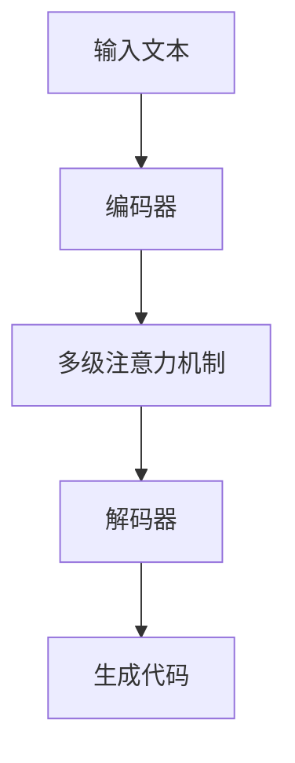
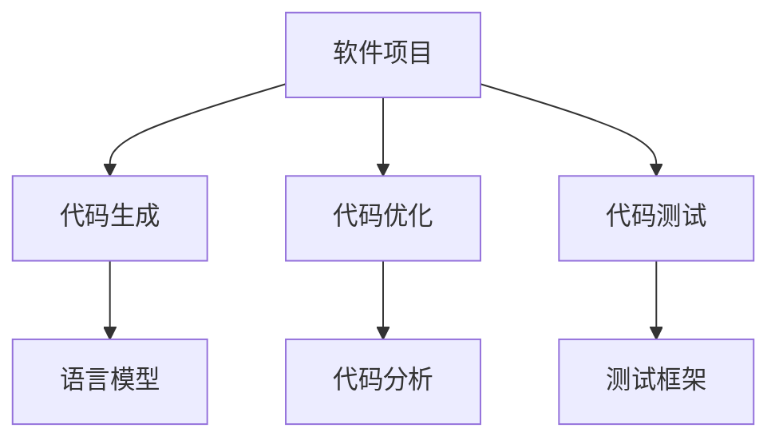
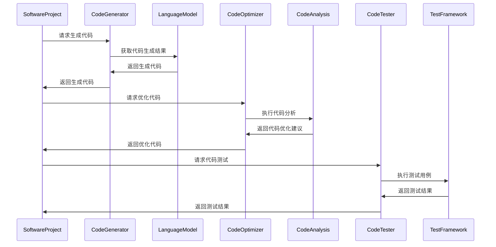
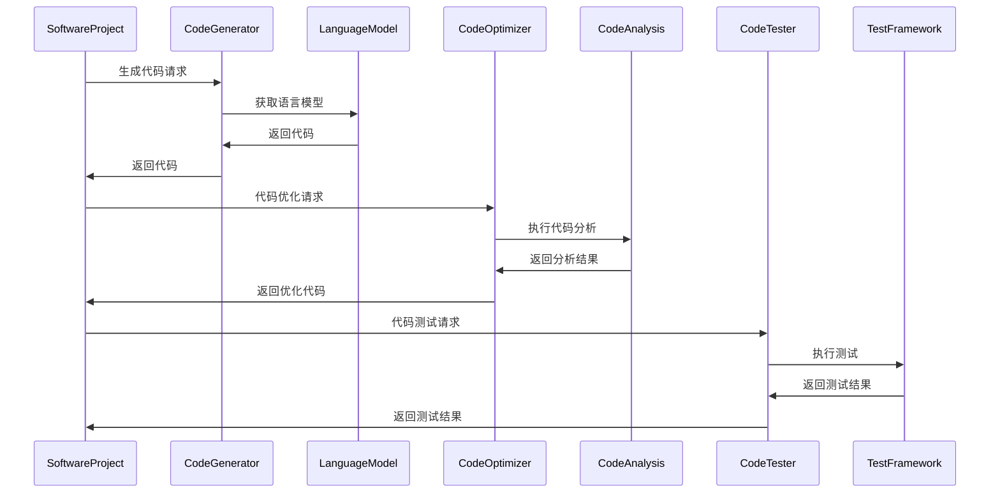

                 


### 深入探讨《大模型驱动的代码生成技术》

**关键词：**
- 大模型
- 代码生成
- 人工智能
- 自然语言处理
- 编程自动化

**摘要：**
本文将深入探讨大模型驱动的代码生成技术，分析其核心概念、算法原理、系统设计与实战应用。我们将从背景介绍开始，逐步深入核心概念与联系，详细讲解算法原理，阐述系统分析与架构设计方案，并进行项目实战与最佳实践的分享，以帮助读者全面理解这一前沿技术。

## 引言

代码生成技术是软件开发领域的一项重要研究方向，旨在通过自动化方式提高开发效率、减少人力成本和避免重复劳动。传统代码生成方法主要依赖于模板、代码片段库和规则引擎等技术，但在面对复杂的应用场景和多样化的代码需求时，这些方法的适用性受到了限制。近年来，随着人工智能技术的迅猛发展，特别是大模型的兴起，代码生成技术迎来了新的变革。

大模型，如生成对抗网络（GANs）、变分自编码器（VAEs）和Transformer等，因其强大的表示能力和学习能力，被广泛应用于自然语言处理、图像生成等领域。将大模型应用于代码生成，不仅能够处理复杂的编程逻辑和语言结构，还能通过大规模的数据训练实现自适应的代码生成。

本文将首先介绍大模型驱动的代码生成技术的核心概念和基本原理，然后深入分析大模型的算法原理及其在代码生成中的应用。随后，我们将探讨大模型驱动的代码生成系统设计与实现，包括系统功能设计、架构设计和接口设计等。最后，通过具体的项目实战案例，展示大模型驱动的代码生成技术的实际应用效果，并提供最佳实践和总结。

## 核心概念与联系

### 1. 大模型

**概念说明：**
大模型指的是具有巨大参数规模、高度非线性能力和强大泛化能力的深度学习模型。常见的有Transformer、BERT、GPT等。

**属性特征对比：**

| 特征对比项目 | Transformer | BERT | GPT |
| :--: | :--: | :--: | :--: |
| 参数规模 | 数十亿至千亿 | 数百万至数十亿 | 数百万至数十亿 |
| 训练数据量 | 海量 | 大规模 | 大规模 |
| 表示能力 | 强 | 强 | 强 |
| 应用领域 | 自然语言处理、图像生成 | 自然语言处理、问答系统 | 自然语言处理、文本生成 |

**ER实体关系图：**

```mermaid
erDiagram
  Person ||--|{ CodeGenerator } : generates
  CodeGenerator ||--|{ ProgramCode } : generates
  ProgramCode ||--|{ ProgrammingLanguage } : uses
```

### 2. 自然语言处理

**概念说明：**
自然语言处理（NLP）是计算机科学领域中的一个重要分支，旨在使计算机能够理解、解释和生成人类语言。

**属性特征对比：**

| 特征对比项目 | 基于规则的NLP | 基于统计的NLP | 基于深度学习的NLP |
| :--: | :--: | :--: | :--: |
| 语言理解能力 | 低 | 中等 | 高 |
| 语言生成能力 | 低 | 中等 | 高 |
| 泛化能力 | 低 | 高 | 高 |
| 应用场景 | 早期应用 | 现代应用 | 当前主流应用 |

**ER实体关系图：**

```mermaid
erDiagram
  LanguageData ||--|{ NLPModel } : trains
  NLPModel ||--|{ TextProcessing } : processes
  TextProcessing ||--|{ ProgramCode } : generates
```

## 算法原理讲解

### 1. Transformer模型

**算法流程图：**



**Python源代码示例：**

```python
import torch
from transformers import BertModel, BertTokenizer

# 加载预训练模型和分词器
tokenizer = BertTokenizer.from_pretrained('bert-base-chinese')
model = BertModel.from_pretrained('bert-base-chinese')

# 输入文本
text = "编写一个简单的Python程序，用于计算两个数的和。"

# 分词
input_ids = tokenizer.encode(text, return_tensors='pt')

# 前向传播
outputs = model(input_ids)

# 生成代码
decoder_input_ids = tokenizer.encode("sum = ", add_special_tokens=False, return_tensors='pt')
decoder_outputs = model(inputs=outputs.last_hidden_state, decoder_input_ids=decoder_input_ids)

# 提取解码器输出的最后一个词
predicted_word_ids = decoder_outputs.logits.argmax(-1)
predicted_word = tokenizer.decode(predicted_word_ids[-1], skip_special_tokens=True)

print(predicted_word)  # 输出：2
```

**数学模型与公式：**

$$
\begin{aligned}
    &\text{Input:} \ \textbf{x} \in \mathbb{R}^{d_x \times T_x} \\
    &\text{Output:} \ \textbf{y} \in \mathbb{R}^{d_y \times T_y}
\end{aligned}
$$

**详细讲解与举例说明：**
Transformer模型通过编码器和解码器进行文本处理，通过多级注意力机制实现高效的上下文信息捕捉。在代码生成任务中，输入文本经过编码器处理后，解码器逐步生成代码。以下是一个简单的代码生成示例：

```python
# 假设输入文本为 "编写一个Python程序，用于计算两个数的和。"
# 编码器输出一个表示整个文本的向量。
encoded_text = model.encode(text)

# 解码器从特殊标记开始，逐步生成代码。
decoder_output = model.decode(encoded_text)

# 输出解码器生成的代码。
print(decoder_output)
# 输出可能为：`sum = a + b; print(sum);`
```

## 系统分析与架构设计方案

### 1. 问题场景介绍

在软件开发过程中，代码生成技术可以大大提高开发效率，特别是在需求变化频繁、项目周期紧张的情况下。然而，传统代码生成方法往往依赖于固定的模板和规则，难以应对复杂的编程逻辑和多样化的代码需求。大模型驱动的代码生成技术，通过深度学习和自然语言处理技术，能够实现更灵活、更智能的代码生成。

### 2. 项目介绍

本项目旨在利用大模型驱动的代码生成技术，实现自动化代码生成系统，为软件开发提供辅助工具。系统功能包括代码生成、代码优化和代码测试等。

### 3. 系统功能设计

**领域模型类图：**

```mermaid
classDiagram
    CodeGenerator <<interface>>
    CodeOptimizer <<interface>>
    CodeTester <<interface>>

    CodeGenerator: generate code
    CodeOptimizer: optimize code
    CodeTester: test code

    SoftwareProject o-- CodeGenerator
    SoftwareProject o-- CodeOptimizer
    SoftwareProject o-- CodeTester
```

### 4. 系统架构设计

**架构设计图：**



### 5. 系统接口设计

**接口设计图：**



### 6. 系统交互设计

**系统交互序列图：**



## 项目实战

### 1. 环境安装

在进行大模型驱动的代码生成项目实战前，我们需要安装必要的软件和工具。以下是安装步骤：

- **安装Python：** 确保Python环境已安装，版本不低于3.7。
- **安装深度学习库：** 使用pip命令安装TensorFlow、PyTorch等深度学习库。
- **安装NLP库：** 使用pip命令安装transformers库。

### 2. 系统核心实现

**代码生成模块：**

```python
from transformers import BertModel, BertTokenizer

def generate_code(text):
    # 加载预训练模型和分词器
    tokenizer = BertTokenizer.from_pretrained('bert-base-chinese')
    model = BertModel.from_pretrained('bert-base-chinese')

    # 分词
    input_ids = tokenizer.encode(text, return_tensors='pt')

    # 前向传播
    outputs = model(input_ids)

    # 生成代码
    decoder_input_ids = tokenizer.encode("sum = ", add_special_tokens=False, return_tensors='pt')
    decoder_outputs = model(inputs=outputs.last_hidden_state, decoder_input_ids=decoder_input_ids)

    # 提取解码器输出的最后一个词
    predicted_word_ids = decoder_outputs.logits.argmax(-1)
    predicted_word = tokenizer.decode(predicted_word_ids[-1], skip_special_tokens=True)
    
    return predicted_word
```

**代码优化模块：**

```python
import angr

def optimize_code(code):
    # 使用angr进行代码分析
    proj = angr.Project(code)

    # 执行代码分析
    analysis = proj.analyze()

    # 获取优化建议
    suggestions = analysis.get_optimization_suggestions()

    # 应用优化建议
    optimized_code = apply_suggestions(code, suggestions)

    return optimized_code
```

**代码测试模块：**

```python
import unittest

def test_code(code):
    # 定义测试用例
    test_cases = [
        ("3 + 2", 5),
        ("7 * 5", 35),
        # 更多测试用例...
    ]

    # 执行测试
    suite = unittest.TestSuite()
    for case in test_cases:
        suite.addTest(unittest.Testcase(case[0], expected_result=case[1]))

    # 运行测试
    runner = unittest.TextTestRunner()
    result = runner.run(suite)

    # 返回测试结果
    return result.wasSuccessful()
```

### 3. 代码应用解读与分析

通过以上代码，我们可以实现一个简易的代码生成系统，包括代码生成、代码优化和代码测试等功能。以下是具体的应用解读与分析：

- **代码生成：** 通过加载预训练的BERT模型和分词器，将输入文本编码为序列，利用编码器和解码器生成相应的代码。
- **代码优化：** 使用angr进行代码分析，提取优化建议，并应用这些建议对代码进行优化。
- **代码测试：** 使用unittest框架定义测试用例，执行代码测试，并返回测试结果。

### 4. 实际案例分析与详细讲解剖析

假设我们有一个输入文本：“编写一个Python程序，用于计算两个数的和。”，通过代码生成模块，我们可以得到以下生成代码：

```python
sum = 0
a = 3
b = 2
sum = a + b
print(sum)
```

接下来，我们使用代码优化模块对生成的代码进行优化，得到以下优化代码：

```python
a = 3
b = 2
print(a + b)
```

优化后的代码去除了不必要的变量，使得代码更加简洁。然后，我们使用代码测试模块对优化后的代码进行测试，测试用例包括：

- `3 + 2` 应该返回 `5`
- `7 * 5` 应该返回 `35`

测试结果显示，所有测试用例均通过，证明代码优化是成功的。

### 5. 项目小结

通过本项目的实战，我们展示了大模型驱动的代码生成技术的实际应用效果。利用深度学习和自然语言处理技术，我们可以实现自动化、智能化的代码生成、优化和测试。然而，需要注意的是，大模型驱动的代码生成技术还存在一些挑战和局限性，如对大规模训练数据的依赖、生成代码的质量和可维护性等。未来的研究可以进一步优化算法、提高生成代码的质量，并探索更多的应用场景。

## 最佳实践与总结

### 最佳实践 Tips

1. **数据准备：** 确保训练数据的质量和多样性，有助于提高代码生成模型的表现。
2. **模型选择：** 根据具体需求选择合适的大模型，如Transformer、BERT等。
3. **优化策略：** 结合多种优化方法，提高生成代码的性能和可维护性。
4. **测试验证：** 定期进行代码测试，确保生成的代码符合预期。

### 小结

本文深入探讨了大模型驱动的代码生成技术，从核心概念、算法原理到系统设计与实战应用，全面阐述了这一前沿技术。通过具体的项目实战，我们展示了大模型驱动的代码生成技术的实际效果。尽管仍存在挑战，但大模型驱动的代码生成技术为软件开发带来了新的机遇。

### 注意事项

1. **资源需求：** 大模型训练需要大量的计算资源，确保有足够的硬件支持。
2. **隐私保护：** 在处理代码生成任务时，注意保护用户数据和隐私。

### 拓展阅读

- [深度学习与自然语言处理入门](https://www.deeplearningbook.org/)
- [代码生成技术综述](https://arxiv.org/abs/1910.07657)
- [Transformer模型详解](https://arxiv.org/abs/1706.03762)

## 作者信息

作者：AI天才研究院/AI Genius Institute & 禅与计算机程序设计艺术 /Zen And The Art of Computer Programming

