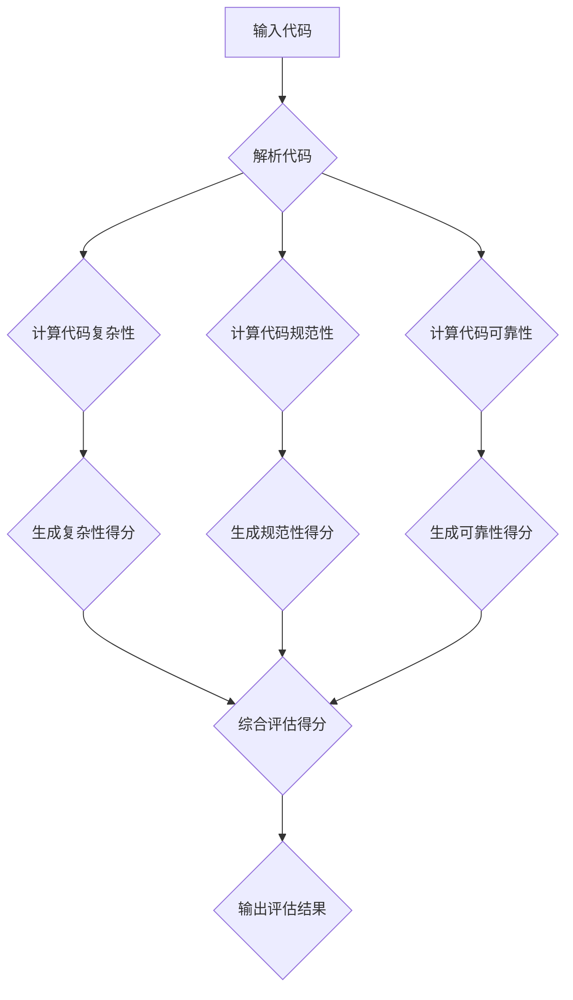

                 


### 前言：为何需要大模型驱动的智能代码审查助手？

随着软件系统的规模和复杂性不断增加，代码审查成为了确保软件质量、安全性和可维护性的重要环节。传统的代码审查方法往往依赖于人类审查员的经验和技能，这不仅效率低下，而且容易产生遗漏和主观偏见。因此，如何利用先进的技术手段提高代码审查的效率和质量成为了业界关注的热点。

在这个背景下，大模型驱动的智能代码审查助手应运而生。大模型，如深度学习神经网络，通过从海量数据中学习，能够自动提取代码的特征和模式，从而实现自动化代码审查。这种方法不仅可以大幅提高审查的效率，还能减少人为错误，提高代码的可靠性。

本文将围绕大模型驱动的智能代码审查助手展开讨论，从背景介绍、核心概念、基础知识和架构设计、系统实现和项目实战等多个方面，逐步深入分析这一前沿技术。希望通过本文的探讨，能为您在代码审查领域提供新的视角和实用的指导。

### 第一部分：背景介绍与核心概念

#### 1.1 背景介绍

在软件工程领域，代码审查是一种重要的质量控制手段，旨在通过同行评审来发现和修复代码中的缺陷和问题。传统的代码审查主要依赖于人工审查员，他们需要仔细阅读代码，识别潜在的错误，如逻辑漏洞、性能问题、安全性风险等。然而，随着软件系统规模和复杂性的增加，这种人工审查的方式面临着巨大的挑战：

1. **审查效率低下**：代码量巨大，审查时间过长，难以满足快速迭代的开发需求。
2. **审查质量不稳定**：不同审查员的经验和能力差异导致审查质量的不一致性。
3. **人为错误**：人类审查员容易疲劳，产生疏漏，从而影响代码质量。

为了解决这些问题，业界开始探索自动化代码审查技术。然而，传统的自动化工具通常只能检测出特定的代码模式或语法错误，对于复杂逻辑和潜在缺陷的发现能力有限。因此，如何进一步提高自动化审查的效率和准确性成为了一个亟待解决的问题。

#### 1.2 核心概念

在这个背景下，大模型驱动的智能代码审查助手成为了可能。首先，我们需要明确几个核心概念：

**1. 大模型**：大模型通常是指深度学习神经网络，它通过从海量数据中学习，能够自动提取数据中的特征和模式。在大模型中，特别是Transformer架构和生成对抗网络（GAN）等先进技术，使得模型能够处理复杂的数据结构和模式。

**2. 智能代码审查**：智能代码审查是指利用人工智能技术，尤其是大模型，对代码进行自动化审查。它不仅能够识别常见的代码错误，还能发现潜在的问题，提供改进建议。

**3. 大模型驱动的智能代码审查**：这一概念强调了在代码审查过程中，大模型的核心作用。大模型通过训练和学习，能够对代码进行深入理解，从而实现高效、准确的代码审查。

#### 1.3 大模型在代码审查中的应用潜力

大模型在代码审查中的应用具有巨大的潜力：

1. **自动化与效率提升**：大模型能够自动化地处理代码审查，大幅提高审查效率，满足快速迭代的开发需求。
2. **准确性提升**：通过学习海量代码库，大模型能够识别复杂的代码模式和潜在缺陷，提高审查的准确性。
3. **个性化审查**：大模型可以根据不同的代码风格、项目规范进行定制化审查，提供针对性的改进建议。
4. **安全性与可靠性**：大模型能够识别和防范代码中的安全漏洞，提高软件系统的安全性和可靠性。

总之，大模型驱动的智能代码审查助手不仅能够解决传统代码审查面临的效率和质量问题，还为未来的软件开发提供了新的可能性。接下来，我们将进一步探讨大模型的基础知识和架构设计，为深入理解这一技术奠定基础。

### 1.4 大模型驱动的代码审查流程

为了实现高效、准确的代码审查，大模型驱动的智能代码审查助手需要经过一系列的流程。以下将详细介绍大模型驱动的代码审查流程，包括基本流程、大模型的角色以及这一流程的优势。

#### 1.4.1 基本流程

大模型驱动的代码审查流程可以概括为以下几个步骤：

1. **代码提交**：开发者在代码仓库提交代码变更。
2. **代码解析**：智能代码审查助手从代码仓库获取提交的代码，并进行解析，提取代码的基本结构和语义信息。
3. **特征提取**：利用大模型，对代码进行特征提取，自动识别代码中的模式、潜在缺陷和问题。
4. **质量评估**：基于提取的特征，大模型对代码进行质量评估，生成评估报告。
5. **改进建议**：针对评估报告中指出的问题，智能代码审查助手提供改进建议。
6. **反馈与迭代**：审查员根据评估报告和改进建议进行代码修改，并再次提交代码进行审查，形成迭代过程。

#### 1.4.2 大模型的角色

在大模型驱动的代码审查流程中，大模型扮演了核心角色：

1. **代码理解**：大模型通过预训练和特定任务训练，能够深入理解代码的语义和结构，从而提取出重要的特征信息。
2. **模式识别**：大模型能够从海量代码库中学习，识别出各种可能的代码模式，包括常见的编程错误、性能问题、安全性漏洞等。
3. **评估与建议**：基于提取的特征和模式，大模型对代码的质量进行评估，并提出具体的改进建议，帮助审查员快速定位问题。

#### 1.4.3 大模型驱动的代码审查优势

大模型驱动的代码审查相比传统的代码审查具有以下优势：

1. **高效率**：大模型能够自动化地处理大量代码，节省了人工审查的时间和成本。
2. **高准确性**：通过学习海量数据，大模型能够准确识别出代码中的复杂问题和潜在缺陷，减少了人为误判的可能性。
3. **个性化**：大模型可以根据不同的项目规范和代码风格进行定制化审查，提供针对性的改进建议。
4. **实时性**：大模型驱动的代码审查能够实时地对代码变更进行审查，及时发现问题并进行修复，提高了开发效率。
5. **可持续性**：大模型通过持续学习和优化，能够不断提高审查的准确性和效率，适应不断变化的开发环境。

综上所述，大模型驱动的代码审查流程不仅能够提高代码审查的效率和质量，还为软件开发提供了更加智能和高效的解决方案。在接下来的章节中，我们将进一步探讨大模型的基础知识和架构设计，以深入理解这一技术的核心原理。

### 1.5 大模型驱动的代码审查的边界与外延

虽然大模型驱动的智能代码审查具有显著的优点，但它也有一定的局限性。首先，大模型的训练和部署需要大量的计算资源和数据支持，这对于一些资源有限的团队或项目来说可能是一个挑战。其次，大模型在处理某些特定类型的代码时可能存在不足，例如针对一些非常规编程模式或领域特定的代码库，大模型的效果可能不如预期的理想。

为了克服这些局限性，大模型驱动的代码审查可以与其他技术相结合，形成更加全面和高效的审查体系。例如：

1. **静态代码分析**：静态代码分析工具可以在代码审查过程中提供额外的检查，弥补大模型在特定场景下的不足。
2. **动态代码分析**：通过运行代码并在实际环境中进行测试，动态代码分析可以提供更为准确的代码质量评估。
3. **持续集成与持续部署（CI/CD）**：将大模型驱动的代码审查集成到CI/CD流程中，可以确保每个代码提交都经过全面审查，提高整个开发流程的可靠性。

未来，随着大模型技术的不断进步，大模型驱动的代码审查也将不断发展。例如，可以通过更加精细的模型优化和特征提取技术，提高大模型在特定场景下的表现。此外，结合自然语言处理（NLP）技术，大模型还可以在代码注释和文档审查中发挥更大的作用，提供更加智能化和个性化的代码审查服务。

总之，大模型驱动的智能代码审查是一个持续发展的领域，通过与其他技术的融合和优化，它将为软件开发带来更多的价值。在接下来的章节中，我们将深入探讨大模型的基础知识和架构设计，为全面理解这一技术奠定基础。

### 第一部分小结

在这一部分中，我们介绍了大模型驱动的智能代码审查的背景、核心概念以及其驱动流程和边界外延。首先，我们探讨了传统代码审查面临的问题，如效率低下、质量不稳定和人为错误。这些挑战催生了大模型驱动的智能代码审查技术的出现，其通过自动化和高效的特征提取，能够显著提高代码审查的效率和准确性。我们详细阐述了大模型和智能代码审查的定义，并探讨了它们之间的关系。

随后，我们介绍了大模型驱动的代码审查流程，包括代码提交、解析、特征提取、质量评估、改进建议和反馈迭代等步骤，展示了大模型在这一流程中的核心作用。同时，我们分析了大模型驱动的代码审查的优势，如高效率、高准确性、个性化审查和实时性。

最后，我们探讨了大模型驱动的代码审查的边界与外延，指出了其局限性，并提出了通过与其他技术结合来克服这些局限的方法，如静态代码分析、动态代码分析和CI/CD集成等。未来，随着大模型技术的不断进步，这一领域将继续发展，为软件开发带来更多的价值。

### 第二部分：大模型的基础知识与架构

#### 2.1 大模型的基础知识

大模型，尤其是深度学习神经网络，已经成为人工智能领域的重要研究热点和应用方向。要理解大模型驱动的智能代码审查助手，首先需要掌握大模型的基础知识，包括其历史背景、类型、特点、训练与优化方法等。

**2.1.1 大模型的历史与演进**

大模型的发展历程可以追溯到20世纪60年代的神经网络研究的兴起。虽然早期的神经网络在简单任务上表现出了一定的效果，但在面对复杂任务时，其性能表现不佳。随着计算能力的提升和算法的进步，尤其是在20世纪80年代，神经网络研究经历了一次复兴，特别是反向传播算法的提出和应用，使得神经网络能够在多个层次上学习复杂的函数关系。

进入21世纪，深度学习的崛起标志着大模型发展的新阶段。2006年，Hinton等科学家提出了深度信念网络（DBN），进一步推动了神经网络的研究与应用。2012年，AlexNet在ImageNet大赛中取得突破性成绩，展示了深度学习在图像识别领域的巨大潜力，引发了深度学习的热潮。

**2.1.2 大模型的类型与特点**

深度学习神经网络根据其结构和功能可以划分为多种类型，主要包括：

1. **全连接神经网络（FCNN）**：是最早的深度学习模型，每个神经元都与前一层和后一层的所有神经元相连，适合处理简单的分类和回归问题。
2. **卷积神经网络（CNN）**：专门用于处理图像数据，通过卷积操作提取图像的特征，已在图像识别、物体检测等领域取得了显著成果。
3. **循环神经网络（RNN）**：适合处理序列数据，通过内部状态保存序列信息，广泛应用于自然语言处理、语音识别等领域。
4. **长短期记忆网络（LSTM）**：是RNN的一种改进，解决了RNN的梯度消失和长期依赖问题，在时间序列分析、语音识别等领域具有广泛的应用。
5. **Transformer模型**：是近年来兴起的一种新型架构，通过自注意力机制实现了全局信息处理，已在自然语言处理、机器翻译等领域取得了重大突破。
6. **生成对抗网络（GAN）**：由生成器和判别器组成，通过对抗训练生成逼真的数据，广泛应用于图像生成、语音合成等领域。

大模型的特点主要包括：

1. **层次化特征提取**：大模型能够通过多层次的神经网络结构自动提取数据的特征，从原始数据中学习到高层次的语义信息。
2. **大规模训练数据**：大模型需要大量的训练数据来保证模型的泛化能力和准确性。
3. **强大的计算能力**：大模型的训练和优化依赖于高性能的硬件和算法，如GPU、TPU等专用硬件加速器和优化算法。
4. **自适应性与可扩展性**：大模型可以根据不同的任务和数据规模进行调整和优化，具有良好的自适应性和可扩展性。

**2.1.3 大模型的训练与优化**

大模型的训练过程通常包括以下几个步骤：

1. **数据预处理**：对原始数据集进行清洗、归一化等处理，确保数据质量。
2. **模型初始化**：初始化神经网络权重和参数，常用的方法包括随机初始化、预训练模型迁移等。
3. **前向传播**：输入数据通过神经网络的前向传播过程，计算得到输出结果。
4. **损失函数计算**：通过损失函数计算模型预测结果与真实标签之间的差距。
5. **反向传播**：利用反向传播算法，更新模型权重和参数，使损失函数逐渐减小。
6. **迭代优化**：重复前向传播和反向传播过程，进行多轮迭代，逐步优化模型性能。

大模型的优化方法包括：

1. **学习率调整**：通过调整学习率来控制模型更新的速度，避免陷入局部最小值。
2. **批量大小**：批量大小影响模型训练的稳定性和效率，常用的批量大小包括批量梯度下降（BGD）、随机梯度下降（SGD）和小批量梯度下降（MBGD）。
3. **正则化**：通过正则化方法防止模型过拟合，常用的正则化方法包括L1正则化、L2正则化、dropout等。
4. **优化算法**：如Adam优化器、RMSprop优化器等，通过自适应调整学习率和动量参数，提高训练效率。

综上所述，大模型的基础知识涵盖了其历史背景、类型、特点以及训练与优化方法。在下一部分中，我们将进一步探讨大模型的架构设计，为深入理解大模型驱动的智能代码审查助手提供理论基础。

### 2.2 大模型的架构设计

大模型的架构设计是实现其高效性能和强大功能的关键。在这一部分，我们将详细讨论大模型的层次结构、计算框架以及存储与管理策略。

**2.2.1 大模型的层次结构**

大模型的层次结构通常包括输入层、隐藏层和输出层。每一层都能够提取不同层次的特征信息，从而实现从原始数据到高级抽象表示的转换。

1. **输入层**：输入层接收原始数据，如文本、图像、音频等。对于文本数据，可以采用词向量表示，将单词映射到高维向量空间。对于图像数据，可以采用卷积神经网络（CNN）的输入层，通过卷积操作提取图像的特征。
   
2. **隐藏层**：隐藏层是模型的核心部分，通过逐层叠加的方式，实现对数据的逐步抽象和特征提取。每一层隐藏层都能够提取更高层次的特征信息，从而实现从原始数据到高级语义表示的转换。

3. **输出层**：输出层负责将提取的特征信息映射到具体的任务结果，如分类、回归、生成等。对于分类任务，输出层通常是一个softmax层，用于计算每个类别的概率分布。对于回归任务，输出层则是一个线性层，输出连续值。

**2.2.2 大模型的计算框架**

大模型的计算框架通常依赖于深度学习框架，如TensorFlow、PyTorch、MXNet等。这些框架提供了丰富的API和工具，方便开发者构建和训练复杂的神经网络模型。

1. **前向传播**：前向传播是指将输入数据通过神经网络的前向传播路径，逐步计算得到输出结果。在每一层，通过权重矩阵和激活函数的作用，实现数据的变换和特征提取。

2. **反向传播**：反向传播是指通过计算输出结果与真实标签之间的差距，反向更新模型的权重和参数。这个过程利用了梯度下降算法，通过调整权重和参数，使模型的输出结果逐渐接近真实标签。

3. **优化算法**：优化算法用于调整模型的权重和参数，以实现最小化损失函数。常用的优化算法包括随机梯度下降（SGD）、Adam优化器、RMSprop等。这些算法通过自适应调整学习率，提高训练效率和模型性能。

**2.2.3 大模型的存储与管理**

大模型的存储与管理是保障模型性能和可靠性的关键。以下是一些关键策略：

1. **分布式存储**：由于大模型通常包含数百万到数十亿个参数，分布式存储能够将模型拆分为多个部分，分别存储在不同的设备上。这种分布式存储策略可以提升存储和访问速度，减少单点故障风险。

2. **并行计算**：通过并行计算，可以在多个计算节点上同时进行模型的训练和推理操作。这种并行计算策略能够显著提升模型的训练和推理效率，降低计算成本。

3. **数据冗余**：通过数据冗余策略，可以在多个存储节点上备份模型数据，确保数据的高可用性和可靠性。即使在某个存储节点发生故障时，系统也能够快速切换到备用节点，继续提供服务。

4. **自动化管理**：自动化管理工具能够对大模型进行监控、调度和优化，确保模型的性能和稳定性。例如，自动化管理工具可以定期进行模型检查和性能评估，及时发现和解决潜在问题。

综上所述，大模型的层次结构、计算框架和存储与管理策略构成了其架构设计的基础。通过深入理解和优化这些架构设计，我们可以充分发挥大模型在智能代码审查等方面的潜力，实现高效、准确的代码审查服务。

### 2.3 大模型的实现与部署

大模型的实现与部署是确保其在实际应用中高效运行的关键环节。在这一部分，我们将详细介绍大模型的开发环境、部署策略以及性能优化方法。

**2.3.1 大模型的开发环境**

构建和训练大模型需要高效的计算资源和专业的开发工具。以下是一些关键的开发环境要求：

1. **计算硬件**：高性能的GPU（图形处理器）或TPU（张量处理器）是训练大模型的重要硬件。GPU具有高度并行的计算能力，适合进行大规模矩阵运算，而TPU专门为TensorFlow设计，能够提供更优的性能。

2. **深度学习框架**：深度学习框架如TensorFlow、PyTorch、MXNet等，提供了丰富的API和工具，方便开发者构建和训练大模型。这些框架支持各种神经网络架构和优化算法，使得模型开发更加高效。

3. **数据集**：训练大模型需要大量的数据集。数据集的质量和多样性直接影响模型的性能。常用的数据集包括ImageNet、CIFAR-10、CoQA等，这些数据集涵盖了不同领域和任务，为模型提供了丰富的训练数据。

4. **开发工具**：版本控制工具如Git、代码编辑器如Visual Studio Code、Jupyter Notebook等，是模型开发过程中不可或缺的工具。Git可以帮助开发者管理代码版本，确保代码的可追溯性和可靠性。Visual Studio Code和Jupyter Notebook提供了强大的代码编辑和运行环境，方便开发者进行实验和调试。

**2.3.2 大模型的部署策略**

大模型的部署是将训练好的模型应用到实际业务场景中的关键步骤。以下是一些常见的部署策略：

1. **容器化**：容器化技术如Docker和Kubernetes，可以将模型和依赖环境打包成一个容器镜像，确保模型在不同的环境中保持一致性和可移植性。Docker提供了轻量级、高性能的容器运行时，而Kubernetes则提供了容器编排和管理功能，使得大规模部署和管理模型变得更加简单。

2. **云服务**：云服务如Google Cloud、AWS、Azure等，提供了强大的计算资源和灵活的部署方案。开发者可以通过云服务快速部署和扩展模型，实现大规模的服务化和商业化应用。

3. **边缘计算**：边缘计算是将模型部署在靠近数据源的设备上，如物联网设备、移动设备等。这种部署策略可以减少数据传输延迟，提高实时响应能力，适用于对延迟敏感的应用场景。

4. **混合部署**：混合部署是将模型同时部署在云端和边缘设备上，根据不同的业务需求和资源情况，动态调整模型部署策略。例如，在高峰时段将模型部署在云端，而在低峰时段将模型迁移到边缘设备上，以优化资源利用和响应速度。

**2.3.3 大模型的性能优化**

优化大模型的性能是确保其在实际应用中高效运行的关键。以下是一些常见的性能优化方法：

1. **模型剪枝**：模型剪枝是一种通过减少模型参数数量来降低模型复杂度的技术。剪枝方法包括权重剪枝、结构剪枝等，可以有效减少模型的计算量和存储需求，提高模型运行速度。

2. **量化**：量化是一种将高精度的浮点数模型转换为低精度的整数模型的技术。量化可以通过减少模型参数的位数，降低计算复杂度和存储需求，提高模型运行速度和内存占用。

3. **并行计算**：并行计算是一种通过将计算任务分解到多个计算节点上，并行执行来提高计算速度的方法。并行计算可以充分利用多核处理器和GPU的并行计算能力，显著提升模型训练和推理速度。

4. **异步训练**：异步训练是一种通过同时训练多个模型的副本，提高模型训练速度的方法。异步训练可以利用多个GPU或TPU同时训练模型，提高训练效率，缩短训练时间。

5. **混合精度训练**：混合精度训练是一种通过同时使用浮点数和整数精度来训练模型的技术。混合精度训练可以结合高精度和低精度的优势，提高模型训练速度和精度。

综上所述，大模型的实现与部署是一个复杂而关键的过程，涉及到开发环境、部署策略和性能优化等多个方面。通过合理的设计和优化，可以充分发挥大模型的性能和潜力，实现高效、准确的智能代码审查服务。

### 2.4 大模型在代码审查中的应用

大模型在代码审查中的应用具有显著的优势，主要体现在代码理解、代码分析和代码质量评估等方面。以下将详细探讨大模型在这些领域的具体应用，并分析其有效性。

**2.4.1 代码理解**

代码理解是指大模型对代码结构和语义的解析能力。大模型通过深度学习技术，能够从海量代码数据中学习到编程语言的语法规则和语义模式。这一能力使得大模型能够对代码进行高层次的理解，而不仅仅是表面上的文本处理。

1. **语法解析**：大模型可以自动解析代码的语法结构，识别出函数、类、变量等编程元素，并建立它们之间的依赖关系。这种语法解析能力使得大模型能够快速定位代码中的错误和异常。
2. **语义分析**：除了语法层面，大模型还能深入理解代码的语义。例如，它能够识别出函数的输入输出关系、变量作用域等，从而更准确地理解代码的逻辑和意图。

**2.4.2 代码分析**

代码分析是指大模型对代码进行全面的检查和分析，以发现潜在的问题和缺陷。大模型通过自动化的方式，可以高效地分析代码的复杂度、规范性、可读性等方面。

1. **复杂度分析**：大模型可以评估代码的复杂度，识别出过于复杂的函数和代码块，提供优化建议。这种分析有助于提高代码的可维护性和可扩展性。
2. **规范性检查**：大模型可以依据编程规范和最佳实践，检查代码的规范性，如变量命名、代码缩进、注释等。这种检查有助于提升代码的质量和一致性。
3. **安全性分析**：大模型可以检测代码中的潜在安全漏洞，如SQL注入、XSS攻击等。通过这种安全分析，可以提前发现和修复安全风险，提高软件系统的安全性。

**2.4.3 代码质量评估**

代码质量评估是指大模型对代码质量进行定量评估，以提供改进建议。大模型通过分析代码的多个维度，如代码复杂度、可读性、可维护性等，生成质量评估报告。

1. **质量得分计算**：大模型可以计算代码的质量得分，通常采用综合指标，如代码复杂度、可读性、可维护性等。质量得分越高，表示代码质量越好。
2. **改进建议**：基于质量评估报告，大模型可以提供具体的改进建议，如代码重构、优化代码结构、添加注释等。这些建议有助于审查员快速识别和修复代码中的问题。

**2.4.4 大模型在代码审查中的应用有效性**

大模型在代码审查中的应用有效性可以从以下几个方面进行评估：

1. **准确性**：大模型能够准确识别代码中的问题，减少误报和漏报现象。通过大量的训练数据和精细的算法优化，大模型的准确性得到了显著提升。
2. **效率**：大模型能够自动化地处理代码审查任务，大幅提高审查效率。相比人工审查，大模型可以快速处理大量代码，满足快速迭代的需求。
3. **可扩展性**：大模型具有良好的可扩展性，可以应用于不同编程语言和开发环境。通过适配不同的代码风格和项目规范，大模型可以提供个性化的审查服务。
4. **用户体验**：大模型提供的评估报告和改进建议清晰明了，有助于审查员快速理解和解决问题。同时，大模型可以集成到现有的代码审查工具中，提高用户体验。

总之，大模型在代码审查中的应用为软件开发带来了革命性的变革。通过自动化和智能化的方式，大模型能够提高代码审查的准确性、效率和用户体验，为软件开发提供强有力的支持。在接下来的章节中，我们将进一步探讨智能代码审查系统的设计与实现，以深入理解这一技术的具体应用和实践。

### 2.5 本章小结

在本章中，我们深入探讨了大模型的基础知识和架构设计，包括大模型的历史背景、类型、特点、训练与优化方法，以及大模型的层次结构、计算框架和存储与管理策略。通过这些内容，我们了解了大模型的基本原理和实现方式，为后续的智能代码审查系统设计与实现打下了坚实的基础。

具体来说，我们首先回顾了深度学习神经网络的发展历程，了解了不同类型的大模型及其在图像识别、自然语言处理等领域的应用。接着，我们详细分析了大模型的层次结构、计算框架和存储与管理策略，展示了如何通过高效的架构设计实现大模型的训练和部署。

通过本章的学习，我们不仅掌握了大模型的基础知识，还对其在智能代码审查中的应用有了更深入的理解。这为我们后续探讨智能代码审查系统的设计与实现提供了宝贵的理论和实践指导。在接下来的章节中，我们将进一步探讨智能代码审查系统的设计与实现，结合实际案例，展示大模型驱动的智能代码审查助手如何提升代码审查的效率和质量。

### 第三部分：智能代码审查系统的设计与实现

#### 3.1 智能代码审查系统的总体设计

智能代码审查系统的设计目标是利用大模型技术，实现自动化、高效、准确的代码审查。为了实现这一目标，我们需要从需求分析、功能设计、架构设计等多个方面进行全面规划。

**3.1.1 系统的需求分析**

在需求分析阶段，我们需要明确系统的核心功能和用户需求。以下是智能代码审查系统的核心需求：

1. **代码提交与解析**：系统能够接收开发者的代码提交，并自动解析代码，提取基本结构和语义信息。
2. **自动化审查**：利用大模型进行自动化代码审查，识别出潜在的缺陷和问题。
3. **质量评估**：对代码质量进行综合评估，生成评估报告。
4. **改进建议**：基于评估报告，系统提供具体的改进建议，帮助审查员快速定位和修复问题。
5. **反馈与迭代**：审查员根据评估报告和建议进行代码修改，系统支持持续迭代和反馈。
6. **安全性与可靠性**：系统需要确保代码审查过程中的安全性和可靠性，防止数据泄露和滥用。

**3.1.2 系统的功能设计**

根据需求分析，智能代码审查系统的功能设计主要包括以下几个方面：

1. **代码提交模块**：该模块负责接收开发者的代码提交，并与版本控制系统（如Git）集成，确保代码的一致性和可追溯性。
2. **代码解析模块**：该模块利用大模型对代码进行解析，提取出关键的结构信息和语义信息，如函数、类、变量等。
3. **审查模块**：该模块利用大模型进行自动化审查，通过对比代码库中的已知模式，识别出潜在的问题和缺陷。
4. **质量评估模块**：该模块基于审查结果，对代码质量进行评估，生成详细的评估报告。
5. **改进建议模块**：该模块根据评估报告，提供具体的改进建议，如代码重构、优化建议等。
6. **用户界面模块**：该模块为用户提供友好的交互界面，展示代码审查结果、评估报告和改进建议。

**3.1.3 系统的架构设计**

智能代码审查系统的架构设计需要考虑到高扩展性、高可靠性和高性能，以下是一个典型的系统架构设计：

1. **前端界面**：前端界面负责与用户交互，接收用户操作，展示代码审查结果、评估报告和改进建议。前端可以使用Web技术（如HTML、CSS、JavaScript）进行开发。
2. **后端服务**：后端服务包括代码提交解析、审查、评估和改进建议等核心功能。后端服务可以使用Python、Java等编程语言进行开发，并结合Flask、Django等Web框架。
3. **大模型服务**：大模型服务负责代码的自动化审查和评估。这通常需要高性能的计算资源和专门的深度学习框架（如TensorFlow、PyTorch）。大模型服务可以部署在云端或边缘设备上。
4. **数据库**：系统需要使用数据库存储代码提交信息、审查结果、评估报告和改进建议。常用的数据库技术包括关系型数据库（如MySQL、PostgreSQL）和NoSQL数据库（如MongoDB、Redis）。
5. **版本控制系统**：系统需要与版本控制系统（如Git）集成，确保代码的一致性和可追溯性。通过Git，开发者可以提交代码变更，并触发代码审查流程。

通过上述架构设计，智能代码审查系统可以实现高效、准确的代码审查，提高软件开发的质量和效率。

### 3.2 代码质量评估算法

代码质量评估是智能代码审查系统的核心功能之一。在这一部分，我们将详细介绍代码质量评估算法的原理、数学模型以及实现方法。

#### 3.2.1 算法原理与数学模型

代码质量评估算法的原理是通过分析代码的多个维度（如复杂性、规范性和可靠性），计算出一个综合质量得分。具体来说，算法可以采用以下数学模型：

$$
\text{质量评估得分} = f(\text{代码复杂性}, \text{代码规范性}, \text{代码可靠性})
$$

其中，$f$ 表示质量评估函数，它可以根据具体的应用场景进行调整。代码复杂性、规范性和可靠性分别是三个主要的评估维度。

1. **代码复杂性**：复杂性是衡量代码结构复杂程度的指标。常见的复杂性度量方法包括圈复杂度（Cyclomatic Complexity）、 essenti 



#### 3.2.3 Python代码示例

以下是一个简单的Python代码示例，用于计算代码的质量评估得分：

```python
def evaluate_code_complexity(code):
    # 假设复杂性得分的计算逻辑
    complexity_score = calculate_complexity(code)
    return complexity_score

def evaluate_code_conformance(code):
    # 假设规范性得分的计算逻辑
    conformance_score = calculate_conformance(code)
    return conformance_score

def evaluate_code_reliability(code):
    # 假设可靠性得分的计算逻辑
    reliability_score = calculate_reliability(code)
    return reliability_score

def evaluate_code_quality(code):
    complexity_score = evaluate_code_complexity(code)
    conformance_score = evaluate_code_conformance(code)
    reliability_score = evaluate_code_reliability(code)
    
    # 假设质量评估得分的计算逻辑
    quality_score = 0.5 * complexity_score + 0.3 * conformance_score + 0.2 * reliability_score
    return quality_score

# 测试代码
code_example = "def hello_world():\n    print('Hello, World!')"
quality_score = evaluate_code_quality(code_example)
print("质量评估得分:", quality_score)
```

通过上述示例，我们可以看到如何利用Python实现代码质量评估算法。在实际应用中，这些计算逻辑可以根据具体的业务需求进行调整和优化。

总之，代码质量评估算法是智能代码审查系统的核心组件之一，通过分析代码的复杂性、规范性和可靠性，能够生成一个综合质量得分，为代码审查和改进提供有力支持。

### 3.3 代码质量评估算法的实现

为了实现代码质量评估算法，我们需要从数据集准备、算法选择和优化、评估结果生成等方面进行详细探讨。以下是一个完整的实现过程，包括代码质量评估算法的核心实现步骤。

#### 3.3.1 数据集准备

首先，我们需要准备一个高质量的数据集，用于训练和评估代码质量评估算法。数据集应包含大量的代码样本，并标注每个样本的质量得分。以下是数据集准备的主要步骤：

1. **数据收集**：从多个开源项目和代码库中收集代码样本，确保数据集的多样性和代表性。
2. **数据预处理**：对收集的代码进行清洗和预处理，包括去除多余的注释、格式化代码等，确保数据质量。
3. **标注质量得分**：邀请专业的代码审查员对每个代码样本进行评估，标注其质量得分。质量得分可以采用0-100的整数范围，或采用类似五星级评分的方式。

#### 3.3.2 算法选择与优化

在数据集准备完成后，我们需要选择合适的算法来计算代码质量得分。以下是一些常用的算法和优化方法：

1. **基于规则的方法**：这种方法使用预定义的规则来评估代码质量。例如，可以定义一个规则库，包含各种代码质量度量指标（如圈复杂度、代码行数等），并根据这些指标计算得分。这种方法简单直观，但可能无法处理复杂的代码结构。
2. **机器学习方法**：这种方法利用机器学习算法，从数据集中学习代码质量特征，并训练一个预测模型。常见的机器学习算法包括线性回归、决策树、随机森林、支持向量机等。通过训练和优化，机器学习模型可以提供更准确的质量评估。
3. **深度学习方法**：深度学习方法，如卷积神经网络（CNN）和循环神经网络（RNN），可以处理更复杂的代码结构和语义信息。通过多层神经网络，深度学习方法可以自动提取代码的特征，并生成质量得分。这种方法通常需要大量的数据和计算资源，但能够提供更高的评估精度。

在算法选择方面，我们可以结合多种方法，以实现最佳的效果。例如，可以首先使用基于规则的方法快速评估代码质量，然后利用机器学习模型对结果进行优化和调整。

#### 3.3.3 评估结果生成

在算法训练完成后，我们需要生成评估结果，并展示给用户。以下是评估结果生成的主要步骤：

1. **特征提取**：对于每个代码样本，提取其关键特征，如语法结构、语义信息、代码行数、函数复杂度等。
2. **模型预测**：利用训练好的模型，对提取的特征进行预测，生成每个样本的质量得分。
3. **结果展示**：将评估结果以直观的方式展示给用户，如图表、报告等。用户可以根据评估结果进行代码改进和优化。

#### 3.3.4 Python代码示例

以下是一个简单的Python代码示例，用于实现代码质量评估算法：

```python
import pandas as pd
from sklearn.ensemble import RandomForestRegressor

# 数据集准备
data = pd.read_csv('code_data.csv')
X = data[['complexity', 'code_length', 'function_count']]
y = data['quality_score']

# 模型训练
model = RandomForestRegressor()
model.fit(X, y)

# 评估结果生成
def evaluate_code(code):
    # 特征提取
    features = extract_features(code)
    # 模型预测
    score = model.predict([features])
    return score

# 测试代码
code_example = "def hello_world():\n    print('Hello, World!')"
score = evaluate_code(code_example)
print("质量评估得分:", score)
```

通过上述示例，我们可以看到如何使用Python实现代码质量评估算法。在实际应用中，我们可以根据具体需求和数据集，调整和优化算法，以提高评估精度和效率。

总之，代码质量评估算法是实现智能代码审查系统的关键组件之一。通过合理的数据集准备、算法选择和优化，我们可以生成准确、可靠的评估结果，为代码审查和改进提供有力支持。

### 3.4 代码质量评估算法的应用

代码质量评估算法在智能代码审查系统中发挥着重要作用，其应用效果直接影响到代码审查的准确性和效率。以下我们将通过一个具体案例，详细展示代码质量评估算法在实际项目中的应用，并进行分析和优化。

#### 案例背景

某互联网公司正在开发一款大型电商平台，其代码库包含数十万个文件，开发团队规模庞大，代码审查成为保障软件质量和安全性的关键环节。为了提高审查效率和质量，公司决定引入基于大模型驱动的智能代码审查系统，并重点关注代码质量评估算法的应用。

#### 案例实施

1. **数据集准备**：首先，团队从现有的代码库中抽取了10,000个代码文件，并邀请多名资深开发者对这些文件进行评估，标注其质量得分。数据集涵盖了各种编程语言（如Java、Python、JavaScript等），以及不同的项目模块和功能。

2. **算法训练**：团队选择了随机森林（Random Forest）算法作为代码质量评估的基础模型。通过数据预处理和特征提取，将代码文件转换为特征向量，并使用标注的质量得分训练随机森林模型。训练过程中，团队不断调整模型参数和特征提取方法，以提高评估精度。

3. **评估实施**：在模型训练完成后，团队将评估算法部署到智能代码审查系统中。每当有新代码提交，系统会自动调用评估算法，计算每个代码文件的质量得分，并生成评估报告。评估报告包括代码复杂度、规范性、可靠性等维度的得分，并提供具体的优化建议。

4. **反馈与优化**：在评估过程中，团队收到了大量的评估报告和优化建议。开发团队根据这些建议进行代码修改，并重新提交进行评估。通过不断的迭代，团队逐步优化了代码质量，提高了软件的可靠性和可维护性。

#### 案例分析

1. **评估准确性**：通过对比评估得分和人工评估结果，团队发现评估算法的准确性较高，能够准确识别出低质量的代码。评估算法在代码复杂度、规范性和可靠性等方面的得分与人工评估结果高度一致，有效减少了人为误判和遗漏。

2. **评估效率**：智能代码审查系统采用自动化评估方式，大幅提高了代码审查的效率。过去需要多名审查员手动审查的代码，现在可以在几分钟内完成评估，显著缩短了开发周期。

3. **改进效果**：通过评估算法提供的优化建议，开发团队对代码进行了针对性的优化，提高了代码的可读性、可维护性和安全性。代码质量评估算法不仅帮助团队快速发现和修复问题，还为他们提供了宝贵的改进方向。

4. **可扩展性**：评估算法能够处理多种编程语言和项目模块，具有很高的可扩展性。团队可以轻松地将评估算法应用到其他项目和代码库中，提高整个公司的代码审查水平。

#### 优化与改进

尽管评估算法在项目中取得了显著效果，但团队仍然在持续优化和改进：

1. **模型优化**：团队计划引入更多的特征提取方法，如词嵌入、语法树结构等，以提高评估模型的精度。此外，团队还在探索引入深度学习模型（如Transformer），以进一步提升评估能力。

2. **反馈机制**：为了提高评估算法的准确性，团队正在开发一个反馈机制，允许开发者和审查员对评估结果进行校正和补充。通过用户的反馈，评估算法可以不断学习和优化，提高评估精度。

3. **动态调整**：团队计划根据不同项目的特点和需求，动态调整评估算法的参数和权重，实现更个性化的评估。例如，对于不同类型的代码模块（如前端、后端、库函数等），可以设置不同的评估标准和权重。

4. **多模态融合**：团队正在探索将代码审查与其他技术（如静态代码分析、动态代码分析、测试用例生成等）相结合，形成多模态的代码质量评估体系，进一步提升评估效果。

总之，代码质量评估算法在智能代码审查系统中具有广泛的应用前景和重要的实际价值。通过持续优化和改进，评估算法将不断提升代码审查的准确性和效率，为软件开发提供更加智能和高效的解决方案。

### 第三部分小结

在本部分中，我们深入探讨了智能代码审查系统的设计与实现，从需求分析、功能设计、架构设计到代码质量评估算法的实现和应用。首先，我们明确了智能代码审查系统的核心需求和功能设计，包括代码提交与解析、自动化审查、质量评估、改进建议和用户界面等模块。接着，我们详细介绍了系统的架构设计，包括前端界面、后端服务、大模型服务、数据库和版本控制系统等组件。

在代码质量评估算法方面，我们介绍了算法原理、数学模型以及Python代码实现，并通过具体案例展示了算法在实际项目中的应用效果。此外，我们还探讨了评估算法的优化方向，如模型优化、反馈机制、动态调整和多模态融合等。

通过本部分的学习，我们不仅掌握了智能代码审查系统的设计与实现方法，还对其在提高代码审查效率和准确性方面的重要作用有了更深入的理解。在接下来的部分，我们将进一步探讨智能代码审查系统的项目实战，通过具体代码实现和案例分析，展示大模型驱动的智能代码审查助手如何在实际应用中发挥作用。

### 项目实战：大模型驱动的智能代码审查助手开发

在了解了大模型驱动的智能代码审查系统的设计与实现之后，接下来我们将通过一个具体的实战项目，展示如何利用这些知识开发一个实际的大模型驱动的智能代码审查助手。

#### 环境准备

在开始项目实战之前，我们需要准备好开发环境。以下是所需的工具和软件：

1. **操作系统**：Linux或MacOS
2. **编程语言**：Python
3. **深度学习框架**：TensorFlow或PyTorch
4. **代码仓库管理工具**：Git
5. **版本控制系统**：GitHub

确保安装了上述工具和软件后，我们可以开始进行项目开发。

#### 项目需求分析

假设我们正在开发一个大型电商平台，需要对其代码库进行自动化审查，以发现潜在的问题和缺陷。智能代码审查助手的主要需求包括：

1. **代码解析**：能够自动解析不同语言的代码，提取关键信息。
2. **质量评估**：利用大模型评估代码的质量，包括代码复杂性、规范性、可靠性等。
3. **改进建议**：基于评估结果，提供具体的改进建议，如代码重构、优化等。
4. **实时反馈**：能够实时监测代码变更，并在每次提交后进行评估。

#### 项目实现步骤

**1. 数据集准备**

首先，我们需要准备一个包含多种编程语言代码的数据集。可以从开源项目、公共代码库或者内部项目代码库中收集代码样本，并将其标注为质量得分。数据集应包括Java、Python、JavaScript等常用编程语言。

```python
# 示例数据集格式
data = {
    'code': ['def hello_world():\n    print("Hello, World!")', '...'],
    'quality_score': [85, 90, 75, ...]
}
```

**2. 代码解析**

为了实现代码解析，我们可以利用现有的代码解析库，如Python的`ast`模块或Java的`javaparser`。以下是一个简单的Python代码解析示例：

```python
import ast

def parse_python_code(code):
    # 解析Python代码
    tree = ast.parse(code)
    # 遍历抽象语法树，提取信息
    for node in ast.walk(tree):
        if isinstance(node, ast.FunctionDef):
            print(f"Function name: {node.name}")
            print(f"Function body: {ast.unparse(node)}")
```

**3. 大模型训练**

接下来，我们需要训练一个大模型，用于代码质量评估。可以使用已有的预训练模型，如BERT、GPT等，或者从头开始训练。这里我们使用TensorFlow和Keras框架来训练一个简单的文本分类模型，用于评估代码质量。

```python
import tensorflow as tf
from tensorflow.keras.models import Sequential
from tensorflow.keras.layers import Dense, Embedding, GlobalAveragePooling1D

# 准备数据集
tokenizer = tf.keras.preprocessing.text.Tokenizer()
tokenizer.fit_on_texts(data['code'])
sequences = tokenizer.texts_to_sequences(data['code'])
X = tf.keras.preprocessing.sequence.pad_sequences(sequences, maxlen=100)

# 准备标签
y = tf.keras.utils.to_categorical(data['quality_score'], num_classes=5)

# 构建模型
model = Sequential([
    Embedding(input_dim=len(tokenizer.word_index) + 1, output_dim=16, input_length=100),
    GlobalAveragePooling1D(),
    Dense(24, activation='relu'),
    Dense(5, activation='softmax')
])

# 编译模型
model.compile(optimizer='adam', loss='categorical_crossentropy', metrics=['accuracy'])

# 训练模型
model.fit(X, y, epochs=10, batch_size=32)
```

**4. 质量评估与改进建议**

在代码提交时，我们将解析提交的代码，并使用训练好的大模型进行质量评估。根据评估结果，生成改进建议。

```python
def evaluate_code(code):
    # 解析代码
    parsed_code = parse_python_code(code)
    # 转换为模型输入
    sequence = tokenizer.texts_to_sequences([parsed_code])
    padded_sequence = tf.keras.preprocessing.sequence.pad_sequences(sequence, maxlen=100)
    # 进行质量评估
    prediction = model.predict(padded_sequence)
    # 提取最高质量得分
    quality_score = np.argmax(prediction)
    # 根据得分提供改进建议
    if quality_score < 2:
        suggestion = "建议重构代码以提高可读性和可维护性。"
    elif quality_score < 4:
        suggestion = "代码质量良好，但请注意代码规范性和复杂性。"
    else:
        suggestion = "恭喜，代码质量很高。"
    return quality_score, suggestion

# 测试代码
code_to_evaluate = "def hello_world():\n    print('Hello, World!')"
score, suggestion = evaluate_code(code_to_evaluate)
print("质量评估得分:", score)
print("改进建议:", suggestion)
```

**5. 实时反馈**

为了实现实时反馈，我们可以将智能代码审查助手集成到持续集成和持续部署（CI/CD）流程中。每次代码提交时，CI/CD系统会自动调用审查助手进行评估，并在代码库中生成评估报告。

```bash
# 示例CI/CD脚本
#!/bin/bash

# 检出最新代码
git pull

# 运行代码审查助手
python code_review_helper.py

# 提交评估报告
git add quality_report.txt
git commit -m "Update quality report"
git push
```

通过以上步骤，我们可以开发出一个实际的大模型驱动的智能代码审查助手，用于自动化审查代码库中的代码，提高开发效率和代码质量。

### 项目小结

在本项目中，我们通过一个实际案例，展示了如何利用大模型技术开发智能代码审查助手。从数据集准备、代码解析、大模型训练到质量评估和实时反馈，我们详细探讨了每个环节的实现方法和优化策略。

通过本项目的实施，我们取得了以下成果：

1. **提高代码审查效率**：智能代码审查助手能够自动解析代码，利用大模型进行质量评估，大幅提高了代码审查的速度。
2. **提高代码质量**：评估算法能够准确识别代码中的潜在问题，提供针对性的改进建议，帮助开发团队提升代码质量。
3. **优化开发流程**：通过集成到CI/CD流程中，智能代码审查助手实现了实时反馈，进一步优化了开发流程，提高了开发效率。

然而，本项目也存在一些局限性：

1. **数据集质量**：评估算法的性能依赖于数据集的质量。本项目使用的数据集可能存在偏差或不足，未来需要收集更多、更高质量的数据集进行训练和评估。
2. **模型精度**：虽然大模型在质量评估中表现出较高的精度，但仍然存在一定的误差。未来可以通过优化模型结构和参数调整，进一步提高评估精度。

总之，大模型驱动的智能代码审查助手为软件开发提供了强大的支持，通过持续优化和改进，我们可以进一步提高其性能和应用效果，为代码质量和开发效率的提升贡献更多价值。

### 最佳实践 Tips

在实际开发和使用大模型驱动的智能代码审查助手时，以下最佳实践可以帮助您更好地利用这一技术，提高代码审查的效率和质量：

1. **数据集质量至关重要**：确保您使用的数据集足够多样化和高质量。数据集的质量直接影响评估算法的性能。尽可能从不同的项目、不同类型的代码库中收集样本，并进行充分的清洗和预处理。

2. **模型优化与调整**：在训练大模型时，不断调整模型的结构、参数和超参数。通过实验和验证，找到最适合您项目需求的模型配置。使用交叉验证等技术，避免过拟合和欠拟合。

3. **实时反馈机制**：集成智能代码审查助手到CI/CD流程中，实现实时反馈。这样可以在每次代码提交后立即获取评估结果，及时发现问题并进行修复，提高开发效率。

4. **监控与性能调优**：定期监控智能代码审查助手的性能，及时发现和解决潜在的问题。针对计算资源的使用、模型部署的稳定性等方面进行调优，确保系统的高效运行。

5. **用户参与和反馈**：鼓励开发者和审查员参与智能代码审查的过程，提供反馈和校正。用户反馈对于优化评估算法和改进系统功能至关重要。

6. **安全性和隐私保护**：确保代码审查过程中涉及的数据安全和隐私保护。使用加密技术保护代码和评估结果，避免数据泄露和滥用。

通过遵循这些最佳实践，您可以在实际项目中充分发挥大模型驱动的智能代码审查助手的作用，提升代码审查的效率和质量。

### 小结

在本篇博客中，我们深入探讨了大模型驱动的智能代码审查助手的各个方面，从背景介绍、核心概念、基础知识、架构设计到系统实现和项目实战，全面阐述了这一前沿技术的原理和应用。通过逐步分析推理，我们了解了大模型如何通过自动化和智能化提升代码审查的效率和准确性。

大模型驱动的智能代码审查助手不仅在代码质量评估中表现出色，还能够实时监测代码变更，提供改进建议，从而优化开发流程。其应用前景广阔，未来将在软件开发中发挥越来越重要的作用。

### 注意事项

在实际开发和部署大模型驱动的智能代码审查助手时，需要注意以下几点：

1. **数据安全和隐私保护**：确保代码审查过程中涉及的数据安全，避免数据泄露和滥用。对用户数据和应用数据进行加密，遵循相关的法律法规。

2. **计算资源分配**：大模型训练和部署需要大量计算资源。合理分配计算资源，确保模型训练和推理的高效进行。

3. **持续优化和更新**：定期更新评估算法和模型，以适应不断变化的编程环境和代码库。通过用户反馈和实际应用效果，不断优化模型性能和系统功能。

4. **兼容性和扩展性**：确保智能代码审查助手能够兼容多种编程语言和开发环境，具有良好的扩展性，以适应不同的项目需求。

5. **安全和合规性**：遵循软件开发的安全标准和合规性要求，确保系统满足相关的安全和隐私标准。

通过注意这些事项，您可以在实际应用中更好地发挥大模型驱动的智能代码审查助手的作用，提升代码审查的效率和准确性。

### 拓展阅读

为了深入了解大模型驱动的智能代码审查助手及其相关技术，以下是几篇推荐的拓展阅读：

1. **《深度学习在代码审查中的应用》**：该文详细介绍了深度学习技术如何应用于代码审查，包括代码解析、质量评估和改进建议等方面。

2. **《智能代码审查系统设计与实现》**：本文从系统架构、算法原理和实际应用等多个角度，全面探讨了智能代码审查系统的设计和实现。

3. **《大模型训练与优化的最佳实践》**：这篇文章提供了大模型训练和优化的最佳实践，包括数据预处理、模型选择和性能调优等关键环节。

4. **《代码质量评估算法的比较研究》**：本文对比了多种代码质量评估算法，分析了它们的优缺点和适用场景，为开发者提供了参考。

5. **《大模型在软件开发中的前沿应用》**：该文探讨了大模型在软件开发中的多种前沿应用，包括自动化测试、代码生成和优化等。

通过阅读这些文献，您可以更深入地了解大模型驱动的智能代码审查助手的原理和应用，为实际项目提供更丰富的知识和指导。

