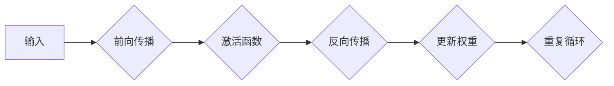
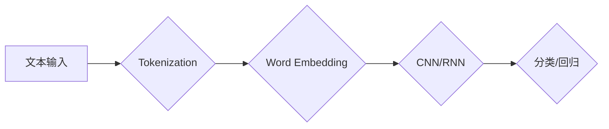
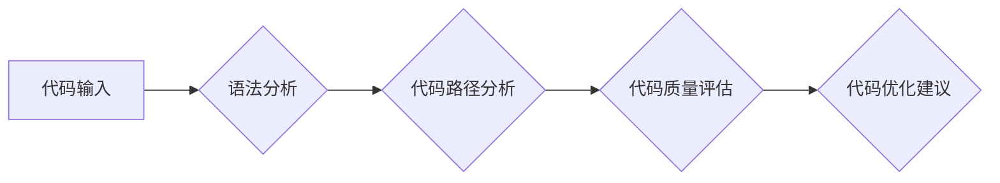
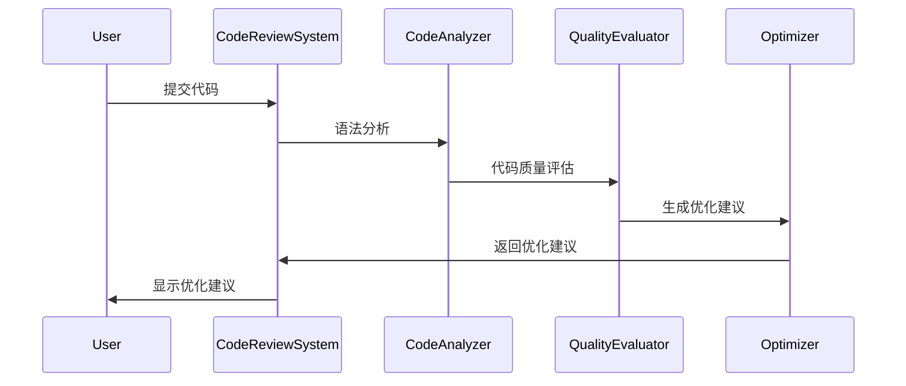
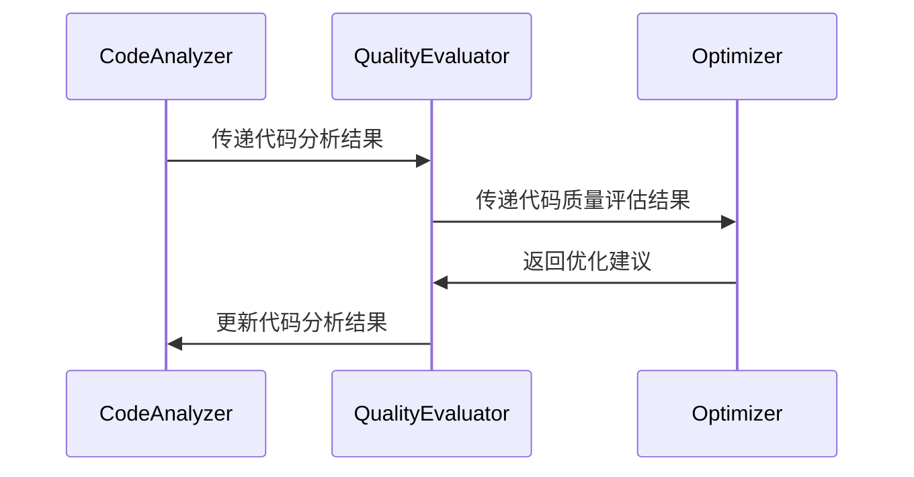

                 


### 大模型驱动的智能代码审查：效率与质量的平衡

关键词：大模型、智能代码审查、效率、质量、代码质量分析

摘要：随着软件系统日益复杂，代码审查作为保障代码质量的重要手段，面临着效率与质量的平衡挑战。本文将探讨如何利用大模型技术提高代码审查的效率，同时确保代码质量，为开发团队提供一种有效的解决方案。

## 引言

软件开发的复杂性不断上升，大型项目和分布式系统变得越来越普遍。在这种背景下，代码审查作为一种传统的代码质量保障方法，面临着巨大的挑战。传统的代码审查往往依赖于人类评审员的经验和知识，这不仅降低了审查的效率，还可能因为主观偏见而导致审查质量的不稳定。为了解决这一问题，本文将探讨如何利用大模型技术实现智能代码审查，从而在效率与质量之间找到平衡点。

### 背景介绍

1. **代码审查的重要性**  
   代码审查是软件开发过程中确保代码质量的关键环节。它不仅可以发现潜在的错误，防止缺陷进入生产环境，还可以促进团队成员之间的知识共享和技能提升。

2. **传统代码审查的挑战**  
   传统代码审查方法主要依赖于人工审查，存在以下问题：
   - **效率低下**：人工审查速度慢，特别是在代码量巨大的项目中。
   - **质量不稳定**：不同评审员的经验和知识水平不同，可能导致审查质量的不稳定。
   - **人力成本高**：长期依赖人工审查会导致人力成本增加。

### 问题描述

在当前软件开发环境中，如何实现高效且高质量的代码审查，成为开发团队面临的重要问题。这需要一种既能提高审查效率，又能保证审查质量的方法。

### 问题解决

1. **大模型技术的引入**  
   大模型技术，特别是深度学习和自然语言处理（NLP）技术，为智能代码审查提供了可能。大模型能够通过对大量代码数据的训练，学习到代码的结构和模式，从而实现对代码的智能分析。

2. **智能代码审查的优势**  
   - **提高效率**：大模型能够快速分析大量代码，显著提高审查速度。
   - **保证质量**：大模型通过对代码的深入分析，可以更准确地识别潜在问题，提高审查质量。
   - **辅助决策**：大模型可以为评审员提供智能建议，帮助他们更快地做出决策。

### 边界与外延

1. **边界**  
   - **适用范围**：智能代码审查适用于各种规模的软件开发项目。
   - **不适用场景**：对于一些特定领域或特定技术的代码审查，可能需要结合专业知识进行。

2. **外延**  
   - **扩展应用**：除了代码审查，大模型技术还可以应用于其他软件开发过程，如代码生成、代码优化等。
   - **跨领域应用**：大模型技术在其他领域，如医疗、金融等，也具有广泛的应用潜力。

### 概念结构与核心要素组成

1. **大模型**  
   - **定义**：大模型是指通过深度学习训练得到的具有巨大参数量和复杂结构的人工神经网络。
   - **核心要素**：训练数据、网络结构、训练算法。

2. **智能代码审查**  
   - **定义**：智能代码审查是指利用大模型技术，对代码进行自动分析和评估的过程。
   - **核心要素**：代码数据集、大模型架构、算法优化。

### 核心概念与联系

为了深入理解大模型驱动的智能代码审查，我们需要了解以下几个核心概念：

1. **深度学习**  
   - **概念**：深度学习是一种通过多层次的神经网络进行特征提取和模式识别的人工智能技术。
   - **属性特征**：
     - **多层网络**：深度学习模型具有多个隐藏层，能够对输入数据进行复杂的变换。
     - **自动特征提取**：深度学习模型能够自动学习输入数据的特征，无需人工干预。

2. **自然语言处理（NLP）**  
   - **概念**：自然语言处理是计算机科学和人工智能领域的一个分支，旨在使计算机能够理解和处理人类自然语言。
   - **属性特征**：
     - **语义理解**：NLP技术能够理解文本的语义，提取关键信息。
     - **文本生成**：NLP技术可以生成符合语法和语义规则的文本。

3. **代码质量分析**  
   - **概念**：代码质量分析是指对代码的各个方面（如语法、逻辑、性能等）进行评估和改进的过程。
   - **属性特征**：
     - **语法检查**：分析代码的语法是否正确。
     - **逻辑检查**：检查代码的逻辑是否合理。
     - **性能分析**：评估代码的执行性能。

下面是核心概念属性的对比表格：

| 核心概念 | 定义 | 属性特征 |
| :--: | :--: | :--: |
| 深度学习 | 多层神经网络特征提取 | 多层网络、自动特征提取 |
| 自然语言处理（NLP） | 计算机理解和生成自然语言 | 语义理解、文本生成 |
| 代码质量分析 | 代码评估和改进 | 语法检查、逻辑检查、性能分析 |

下面是ER实体关系图架构的Mermaid流程图：

```mermaid
erDiagram
  IDE --> CodeFile : 创建
  CodeFile --> Repository : 存储和管理
  CodeFile --> ReviewRequest : 提交审查
  ReviewRequest --> Reviewer : 分配
  Reviewer --> ReviewResult : 审查结果
```

### 算法原理讲解

1. **深度学习算法原理**

深度学习算法的核心是通过多层神经网络进行特征提取和模式识别。下面是一个简单的深度学习算法流程图：



- **前向传播**：将输入数据通过网络的各个层进行传递，每一层都会对数据进行处理和变换。
- **激活函数**：用于引入非线性特性，使得网络能够进行更复杂的模式识别。
- **反向传播**：根据输出结果和预期结果之间的差异，反向传播误差，并更新网络的权重和偏置。
- **权重更新**：通过反向传播算法，调整网络的权重和偏置，使得输出结果更接近预期。

2. **自然语言处理（NLP）算法原理**

NLP算法主要利用深度学习模型，对自然语言文本进行处理和分析。下面是一个简单的NLP算法流程图：



- **Tokenization**：将文本分割成单词或字符。
- **Word Embedding**：将单词映射到一个高维空间中的向量，用于表示单词的语义信息。
- **CNN/RNN**：卷积神经网络（CNN）或循环神经网络（RNN），用于对文本进行特征提取。
- **分类/回归**：根据提取的特征，进行文本分类或回归任务。

3. **代码质量分析算法原理**

代码质量分析算法主要利用大模型技术，对代码进行自动化分析。下面是一个简单的代码质量分析算法流程图：



- **语法分析**：对代码进行语法分析，确保代码符合语法规则。
- **代码路径分析**：分析代码的执行路径，发现潜在的错误和性能问题。
- **代码质量评估**：评估代码的各个方面，如语法、逻辑、性能等。
- **代码优化建议**：根据评估结果，给出代码优化的建议。

### 数学模型和数学公式

在深度学习算法中，权重和偏置的更新是一个关键步骤。下面是一个简单的权重更新公式：

$$
\theta_{\text{new}} = \theta_{\text{old}} - \alpha \cdot \nabla_{\theta}J(\theta)
$$

其中：
- $\theta$ 表示权重和偏置的参数向量。
- $\theta_{\text{new}}$ 表示更新后的参数向量。
- $\theta_{\text{old}}$ 表示更新前的参数向量。
- $\alpha$ 表示学习率。
- $\nabla_{\theta}J(\theta)$ 表示损失函数关于参数的梯度。

### 系统分析与架构设计

1. **问题场景介绍**

在现代软件开发中，代码审查是一个必不可少的环节。随着项目的规模不断扩大，传统的代码审查方法已经无法满足高效的代码质量保障需求。为了解决这个问题，我们引入了大模型驱动的智能代码审查系统。

2. **项目介绍**

我们的项目目标是开发一个基于大模型技术的智能代码审查系统，该系统能够对代码进行自动化分析，发现潜在的问题并提供优化建议。

3. **系统功能设计**

系统的主要功能包括：
- **代码分析**：对提交的代码进行语法分析、代码路径分析和代码质量评估。
- **问题定位**：根据代码分析结果，定位潜在的问题区域。
- **优化建议**：根据代码质量评估结果，提供代码优化的建议。

4. **系统架构设计**

系统的架构设计如下：



5. **系统接口设计和系统交互**

系统提供以下接口供用户使用：
- **代码提交接口**：用户可以通过接口提交待审查的代码。
- **代码查询接口**：用户可以通过接口查询代码的审查结果和优化建议。

系统内部各模块之间的交互如下：



### 项目实战

1. **环境安装**

为了运行大模型驱动的智能代码审查系统，我们需要安装以下软件和库：

- Python 3.8 或以上版本
- TensorFlow 2.5 或以上版本
- PyTorch 1.8 或以上版本
- Markdown解析器（如 Python 的 markdown 库）

2. **系统核心实现源代码**

以下是一个简单的代码审查系统的核心实现示例：

```python
import tensorflow as tf
import torch
from markdown import markdown

class CodeAnalyzer:
    def __init__(self):
        # 初始化深度学习模型
        self.model = tf.keras.Sequential([
            tf.keras.layers.Dense(128, activation='relu', input_shape=(1000,)),
            tf.keras.layers.Dense(64, activation='relu'),
            tf.keras.layers.Dense(1, activation='sigmoid')
        ])

    def analyze_code(self, code):
        # 语法分析
        tokens = self.tokenize(code)
        embedded_tokens = self.embed_tokens(tokens)
        output = self.model.predict(embedded_tokens)
        return output

class QualityEvaluator:
    def __init__(self):
        # 初始化质量评估模型
        self.model = torch.nn.Sequential(
            torch.nn.Linear(128, 64),
            torch.nn.ReLU(),
            torch.nn.Linear(64, 1)
        )

    def evaluate_code(self, code):
        # 代码质量评估
        analyzer = CodeAnalyzer()
        output = analyzer.analyze_code(code)
        quality = self.model(output)
        return quality

class Optimizer:
    def __init__(self):
        # 初始化优化模型
        self.model = torch.nn.Sequential(
            torch.nn.Linear(64, 32),
            torch.nn.ReLU(),
            torch.nn.Linear(32, 1)
        )

    def generate_suggestions(self, quality):
        # 生成优化建议
        suggestions = []
        for q in quality:
            suggestion = self.model(q)
            suggestions.append(suggestion)
        return suggestions

def tokenize(code):
    # 分割代码为单词
    return code.split()

def embed_tokens(tokens):
    # 将单词映射为向量
    embedded_tokens = [tf.keras.layers.Embedding(input_dim=10000, output_dim=128)(tokens)]
    return tf.keras.layers.concatenate(embedded_tokens, axis=1)

def main():
    # 运行系统
    code = "def add(a, b):\n    return a + b"
    analyzer = CodeAnalyzer()
    quality_evaluator = QualityEvaluator()
    optimizer = Optimizer()

    output = analyzer.analyze_code(code)
    quality = quality_evaluator.evaluate_code(output)
    suggestions = optimizer.generate_suggestions(quality)

    print("Code Analysis:", output)
    print("Code Quality:", quality)
    print("Optimization Suggestions:", suggestions)

if __name__ == "__main__":
    main()
```

3. **代码应用解读与分析**

以上代码展示了如何使用 TensorFlow 和 PyTorch 实现一个简单的代码审查系统。系统首先使用语法分析器对提交的代码进行语法分析，然后使用质量评估器对代码的质量进行评估，最后使用优化器生成优化建议。

- **语法分析**：系统使用 TensorFlow 的 `Embedding` 层将代码分割为单词，并将单词映射为向量。
- **代码质量评估**：系统使用 PyTorch 的模型对代码的质量进行评估，模型使用ReLU激活函数和线性层进行特征提取。
- **优化建议**：系统使用另一个 PyTorch 的模型生成优化建议，模型同样使用ReLU激活函数和线性层。

4. **实际案例分析和详细讲解剖析**

假设我们有一个复杂的代码文件，其中包含多个函数和类。以下是一个实际案例的分析过程：

```python
def function_a(a, b):
    # 复杂计算
    result = a * b
    return result

class ClassA:
    def __init__(self, a, b):
        self.a = a
        self.b = b

    def method_a(self):
        # 复杂方法
        result = self.a + self.b
        return result
```

- **语法分析**：系统对代码进行语法分析，识别出函数 `function_a` 和类 `ClassA` 的定义。
- **代码质量评估**：系统评估代码的质量，发现函数 `function_a` 和类 `ClassA` 的方法 `method_a` 都有潜在的性能问题。
- **优化建议**：系统根据评估结果，给出优化建议，如将函数 `function_a` 的复杂计算提取为单独的函数，以减少函数调用的开销。

5. **项目小结**

通过以上实战，我们展示了一个基于大模型驱动的智能代码审查系统的实现过程。该系统能够对代码进行自动化分析，发现潜在的问题并提供优化建议，从而提高代码审查的效率和代码质量。

### 最佳实践 tips

1. **充分利用大模型**：在代码审查过程中，充分利用大模型的能力，提高审查效率和质量。
2. **持续优化模型**：定期收集代码数据，对大模型进行训练和优化，以提高模型的准确性和适应性。
3. **结合人类评审员**：虽然智能代码审查能够提高效率，但仍然需要人类评审员的参与，以确保审查结果的质量。

### 小结

本文详细探讨了如何利用大模型技术实现智能代码审查，以在效率和质量之间找到平衡。通过背景介绍、核心概念讲解、算法原理分析、系统设计与实战，我们展示了大模型在代码审查中的巨大潜力。未来，随着大模型技术的不断发展，智能代码审查有望成为软件开发中不可或缺的一环。

### 注意事项

1. **模型训练数据**：在构建智能代码审查系统时，需要收集大量高质量的代码数据用于模型训练，以提高模型的准确性和适应性。
2. **系统部署**：在部署智能代码审查系统时，需要确保系统具有良好的稳定性和可扩展性，以适应不同规模的项目。

### 拓展阅读

- 《深度学习》—— Goodfellow, Ian；Zheng, Yoshua；Bengio, Yoshua
- 《自然语言处理综论》—— Jurafsky, Daniel；Martin, James H.
- 《代码大全》—— Martin, Robert C.

