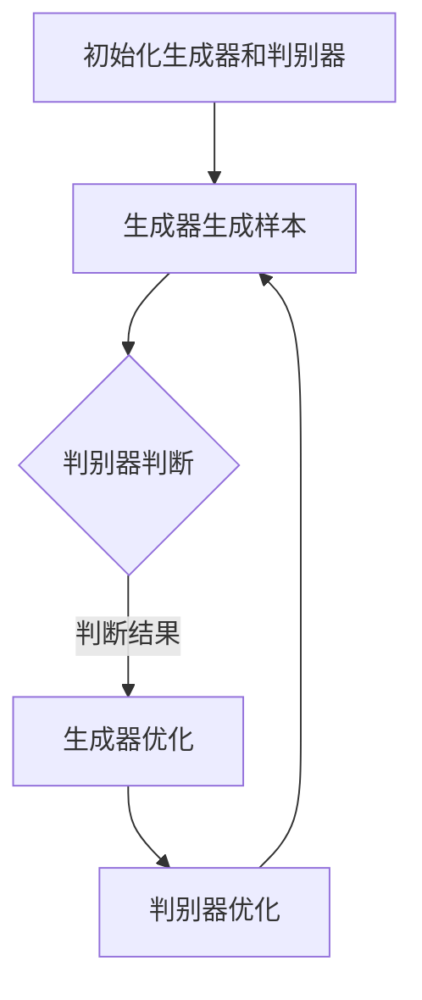
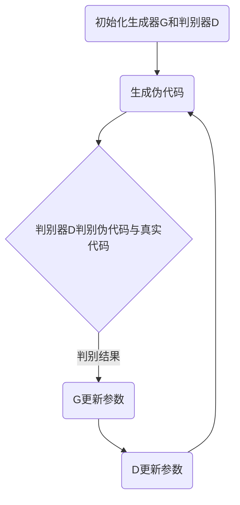
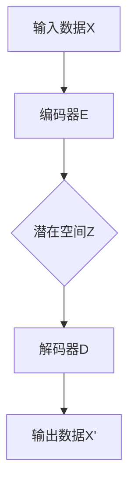
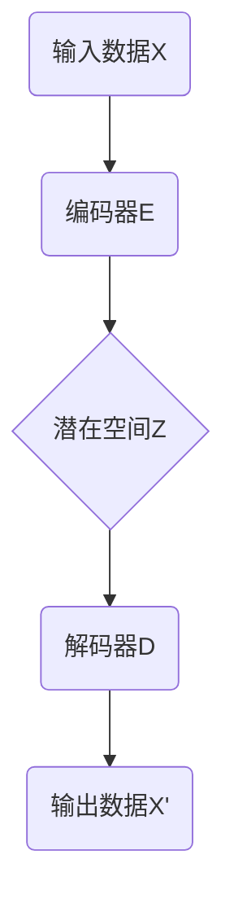
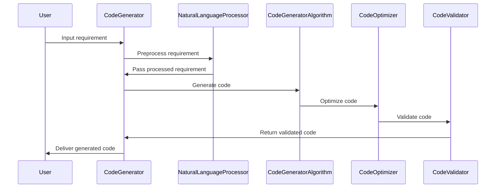
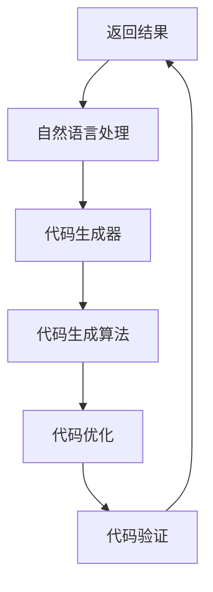
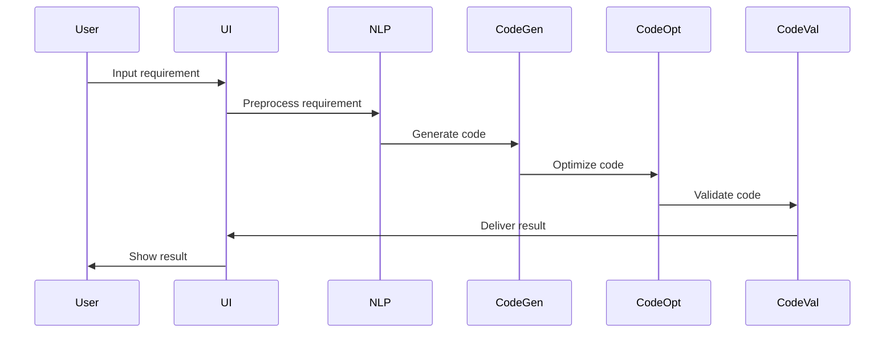

                 

## 大模型驱动的智能代码生成系统

在当今的技术浪潮中，大模型（如GPT-3、BERT等）的应用已成为推动人工智能发展的核心动力。其中，大模型驱动的智能代码生成系统更是引起了广泛关注。本文将围绕这一主题，探讨大模型驱动智能代码生成的背景、原理、系统设计、实战应用以及最佳实践和注意事项。

**关键词：** 大模型、智能代码生成、GPT-3、BERT、算法原理、系统架构、项目实战。

**摘要：** 本文首先介绍了大模型驱动的智能代码生成系统的背景和基本概念，随后详细分析了主流大模型的特点和算法原理。接着，文章深入探讨了智能代码生成系统的系统分析与架构设计，并通过实际案例进行了实战讲解。最后，文章总结了最佳实践和注意事项，并提出了进一步的研究方向。

### 目录大纲

1. **第一部分：大模型驱动的智能代码生成系统概述**
    1. **第1章：问题背景与概念介绍**
        1. **1.1 问题的提出**
            1. **1.1.1 软件开发的挑战**
            2. **1.1.2 智能代码生成的需求**
        2. **1.2 大模型的基本概念**
            1. **1.2.1 大模型的定义**
            2. **1.2.2 大模型的发展历程**
        3. **1.3 智能代码生成的概念与原理**
            1. **1.3.1 智能代码生成的定义**
            2. **1.3.2 智能代码生成的原理**
        4. **1.4 大模型驱动智能代码生成的优势与挑战**
            1. **1.4.1 优势分析**
            2. **1.4.2 挑战探讨**

2. **第二部分：主流大模型介绍**
    1. **第2章：主流大模型介绍**
        1. **2.1 GPT系列模型**
            1. **2.1.1 GPT-3模型介绍**
            2. **2.1.2 GPT-3模型特点**
        2. **2.2 BERT模型**
            1. **2.2.1 BERT模型介绍**
            2. **2.2.2 BERT模型应用**
        3. **2.3 其他知名大模型**
            1. **2.3.1 T5模型**
            2. **2.3.2 GLM模型**

3. **第三部分：智能代码生成算法原理**
    1. **第3章：智能代码生成算法原理**
        1. **3.1 算法概述**
            1. **3.1.1 智能代码生成的算法流程**
            2. **3.1.2 智能代码生成的算法类型**
        2. **3.2 算法原理讲解**
            1. **3.2.1 生成对抗网络（GAN）**
                1. **3.2.1.1 GAN的基本原理**
                2. **3.2.1.2 GAN的mermaid流程图**
                3. **3.2.1.3 GAN的Python实现**
            2. **3.2.2 变分自编码器（VAE）**
                1. **3.2.2.1 VAE的基本原理**
                2. **3.2.2.2 VAE的mermaid流程图**
                3. **3.2.2.3 VAE的Python实现**
        3. **3.3 算法数学模型与公式**

4. **第四部分：系统分析与架构设计**
    1. **第4章：系统分析与架构设计**
        1. **4.1 问题场景介绍**
        2. **4.2 系统功能设计**
            1. **4.2.1 领域模型类图**
            2. **4.2.2 系统功能描述**
        3. **4.3 系统架构设计**
            1. **4.3.1 系统架构图**
            2. **4.3.2 架构设计描述**
        4. **4.4 系统接口设计和交互**
            1. **4.4.1 接口设计**
            2. **4.4.2 系统交互序列图**

5. **第五部分：项目实战**
    1. **第5章：项目实战**
        1. **5.1 环境安装**
        2. **5.2 系统核心实现**
            1. **5.2.1 代码实现**
            2. **5.2.2 代码解读与分析**
        3. **5.3 实际案例分析与讲解**
            1. **5.3.1 案例一：文本生成**
            2. **5.3.2 案例二：代码修复**
        4. **5.4 项目小结**

6. **第六部分：最佳实践与注意事项**
    1. **第6章：最佳实践与注意事项**
        1. **6.1 最佳实践**
        2. **6.2 注意事项**

7. **第七部分：拓展阅读与进一步研究**
    1. **第7章：拓展阅读与进一步研究**
        1. **7.1 参考文献**
        2. **7.2 进一步研究方向**

----------------------------------------------------------------

### 第一部分：大模型驱动的智能代码生成系统概述

#### 第1章：问题背景与概念介绍

**1.1 问题的提出**

在软件工程领域，代码编写是一项耗时且易出错的任务。传统的软件开发方式需要开发者手动编写代码，这不仅要求开发者具备深厚的编程知识和经验，还容易出现重复劳动和错误。为了提高开发效率和代码质量，智能代码生成技术应运而生。智能代码生成通过利用自然语言处理、机器学习等技术，实现自动化生成代码，从而减少人力成本和错误率。

**1.1.1 软件开发的挑战**

随着软件系统的复杂度不断增加，软件开发面临着诸多挑战：
- **开发成本高**：软件开发过程需要大量的时间和人力投入，成本较高。
- **代码质量难以保证**：开发者可能因为个人能力、经验不足等原因导致代码质量参差不齐。
- **维护困难**：随着项目规模的扩大，代码的维护变得越来越困难，系统容易变得脆弱。

**1.1.2 智能代码生成的需求**

智能代码生成技术的出现，旨在解决上述问题：
- **提高开发效率**：通过自动化生成代码，可以显著减少开发时间。
- **提高代码质量**：智能代码生成系统能够基于大模型的学习，生成高质量、结构良好的代码。
- **降低开发成本**：减少对人力资源的依赖，降低开发成本。

**1.2 大模型的基本概念**

大模型（如GPT-3、BERT等）是近年来人工智能领域的重要突破，它们具有以下基本特征：
- **大规模**：大模型通常包含数十亿个参数，具备处理大规模数据的能力。
- **高性能**：大模型通过深度学习算法，实现了对数据的强大建模能力。
- **泛用性**：大模型能够应用于多种任务，如文本生成、机器翻译、图像识别等。

**1.2.1 大模型的定义**

大模型指的是参数规模在数十亿以上、具备高效推理能力的人工神经网络模型。这类模型通过深度学习算法从大量数据中学习，具备强大的表征能力和泛用性。

**1.2.2 大模型的发展历程**

- **2018年**：谷歌提出BERT模型，标志着大模型在自然语言处理领域的崛起。
- **2019年**：OpenAI发布GPT-2，展示了大模型在文本生成任务上的惊人表现。
- **2020年**：OpenAI发布GPT-3，成为当时参数规模最大的模型，引发了广泛关注。

**1.3 智能代码生成的概念与原理**

**1.3.1 智能代码生成的定义**

智能代码生成（AI-assisted code generation）是指利用人工智能技术，尤其是大模型，自动化生成代码的过程。

**1.3.2 智能代码生成的原理**

智能代码生成系统通常基于以下原理：
- **代码表示**：将代码表示为具有一定结构的数据，如抽象语法树（AST）。
- **模型训练**：利用大模型对代码数据进行训练，使其能够生成符合指定需求的代码。
- **代码生成**：根据输入的描述或需求，大模型生成相应的代码。

**1.4 大模型驱动智能代码生成的优势与挑战**

**1.4.1 优势分析**

- **高效开发**：智能代码生成可以显著提高开发效率，减少开发时间。
- **高质量代码**：大模型能够生成结构良好、符合规范的代码。
- **创新驱动**：智能代码生成可以为开发者提供新的创意和解决方案。

**1.4.2 挑战探讨**

- **准确性**：大模型生成的代码可能存在错误或不完整的情况。
- **适应性**：大模型需要针对不同类型的代码进行定制化训练，以提高适应性。
- **成本**：大模型的训练和部署成本较高，需要解决成本问题。

通过上述分析，我们可以看到，大模型驱动的智能代码生成系统在提高软件开发效率、提升代码质量和推动创新方面具有巨大潜力。然而，如何克服其中的挑战，实现大规模应用，仍需要进一步的研究和实践。

### 第二部分：主流大模型介绍

#### 第2章：主流大模型介绍

随着人工智能技术的不断发展，大模型在各个领域中的应用越来越广泛。在本章中，我们将介绍几种主流的大模型，包括GPT系列模型、BERT模型以及其他知名的大模型，详细探讨它们的特性和应用。

**2.1 GPT系列模型**

GPT系列模型是OpenAI推出的一组基于Transformer架构的大规模预训练语言模型，其中最具代表性的是GPT-3。GPT-3模型具有以下主要特点：

**2.1.1 GPT-3模型介绍**

- **参数规模**：GPT-3拥有1750亿个参数，是当时参数规模最大的模型。
- **训练数据**：GPT-3使用了大量的互联网文本数据，包括书籍、新闻、网站等。
- **应用场景**：GPT-3被广泛应用于文本生成、机器翻译、问答系统等任务。

**2.1.2 GPT-3模型特点**

- **强大的文本生成能力**：GPT-3可以生成连贯、自然的文本，具有高度的创造力。
- **广泛的知识覆盖**：由于训练数据丰富，GPT-3具有广泛的知识覆盖，能够回答各种问题。
- **灵活的任务适应性**：GPT-3可以针对不同的任务进行定制化训练，实现多种应用场景。

**2.2 BERT模型**

BERT（Bidirectional Encoder Representations from Transformers）是由Google提出的一种预训练语言模型，其主要特点如下：

**2.2.1 BERT模型介绍**

- **双向编码**：BERT采用了双向Transformer架构，能够同时考虑文本中的前后关系。
- **大规模训练**：BERT使用了大量的文本数据进行训练，参数规模较大。

**2.2.2 BERT模型应用**

- **文本分类**：BERT在文本分类任务上表现出色，可以用于情感分析、主题分类等。
- **问答系统**：BERT在问答系统中的应用广泛，可以用于信息检索、问题回答等。

**2.3 其他知名大模型**

除了GPT系列模型和BERT模型，还有许多其他知名的大模型，如T5、GLM等。以下是它们的简要介绍：

**2.3.1 T5模型**

T5（Text-To-Text Transfer Transformer）是一种通用的预训练语言模型，其特点如下：

- **统一任务表示**：T5将所有任务表示为文本到文本的转换问题，具有很高的灵活性。
- **大规模训练**：T5使用了大量的数据进行训练，参数规模较大。

**2.3.2 GLM模型**

GLM（General Language Modeling）是由华为提出的一种大规模预训练语言模型，其特点如下：

- **自适应学习**：GLM采用了自适应学习机制，能够根据不同任务自动调整模型参数。
- **高效推理**：GLM在推理过程中具有很高的效率，适用于实时应用场景。

通过上述介绍，我们可以看到，主流大模型在参数规模、训练数据和应用场景等方面具有各自的特点和优势。这些大模型在智能代码生成等领域有着广泛的应用前景，为开发者提供了强大的工具和资源。

#### 第3章：智能代码生成算法原理

智能代码生成算法是利用大模型（如GPT-3、BERT等）从文本描述自动生成代码的核心技术。在这一章中，我们将详细探讨智能代码生成算法的原理，包括算法流程、算法类型以及两种主要算法（生成对抗网络（GAN）和变分自编码器（VAE））的详细讲解。

**3.1 算法概述**

**3.1.1 智能代码生成的算法流程**

智能代码生成的算法流程主要包括以下几个步骤：

1. **数据预处理**：将输入的文本描述转化为适合模型训练的格式，如将自然语言文本转化为编程语言的关键词和语法结构。
2. **模型训练**：利用大模型对预处理后的数据集进行训练，使其学会从文本描述生成代码。
3. **代码生成**：根据输入的文本描述，模型生成相应的代码。

**3.1.2 智能代码生成的算法类型**

智能代码生成算法可以分为以下几种类型：

1. **基于规则的方法**：这种方法依赖于预定义的规则库，通过匹配文本描述中的关键词和规则，生成相应的代码。
2. **基于样本的方法**：这种方法通过学习大量已有的代码样本，利用大模型生成新的代码。
3. **基于模型的方法**：这种方法利用大模型（如GAN和VAE）从文本描述中直接生成代码。

**3.2 算法原理讲解**

**3.2.1 生成对抗网络（GAN）**

生成对抗网络（GAN）是由生成器（Generator）和判别器（Discriminator）组成的对偶网络。其基本原理如下：

- **生成器（Generator）**：生成器从随机噪声中生成与真实数据类似的样本，目标是让判别器无法区分生成的样本和真实样本。
- **判别器（Discriminator）**：判别器的目标是区分生成的样本和真实样本，并给出其概率。

GAN的训练过程如下：

1. 初始化生成器和判别器，分别采用不同的权重。
2. 对于每一轮训练，生成器生成一批样本，判别器同时接收真实样本和生成样本。
3. 生成器尝试优化其生成样本，使其更接近真实样本。
4. 判别器尝试优化其分类能力，提高区分真实样本和生成样本的准确性。
5. 重复上述过程，直到生成器生成的样本质量达到预期。

**3.2.1.1 GAN的基本原理**

GAN的基本原理可以通过以下mermaid流程图来表示：



**3.2.1.2 GAN的mermaid流程图**

以下是一个简化的GAN训练流程图，用于说明GAN的基本工作流程：



**3.2.1.3 GAN的Python实现**

以下是一个简化的GAN模型实现的Python代码示例：

```python
import tensorflow as tf
from tensorflow.keras.layers import Dense, Flatten
from tensorflow.keras.models import Sequential

# 初始化生成器模型
generator = Sequential([
    Dense(128, input_shape=(100,), activation='relu'),
    Dense(1, activation='sigmoid')
])

# 初始化判别器模型
discriminator = Sequential([
    Flatten(),
    Dense(128, activation='relu'),
    Dense(1, activation='sigmoid')
])

# 定义损失函数和优化器
cross_entropy = tf.keras.losses.BinaryCrossentropy(from_logits=True)
generator_optimizer = tf.keras.optimizers.Adam(1e-4)
discriminator_optimizer = tf.keras.optimizers.Adam(1e-4)

@tf.function
def train_step(images, batch_size):
    noise = tf.random.normal([batch_size, 100])
    with tf.GradientTape() as gen_tape, tf.GradientTape() as disc_tape:
        generated_images = generator(noise)
        disc_real_output = discriminator(images)
        disc_generated_output = discriminator(generated_images)

        gen_loss = cross_entropy(tf.ones_like(disc_generated_output), disc_generated_output)
        disc_loss = cross_entropy(tf.zeros_like(disc_real_output), disc_real_output) + cross_entropy(tf.ones_like(disc_generated_output), disc_generated_output)

    gradients_of_generator = gen_tape.gradient(gen_loss, generator.trainable_variables)
    gradients_of_discriminator = disc_tape.gradient(disc_loss, discriminator.trainable_variables)

    generator_optimizer.apply_gradients(zip(gradients_of_generator, generator.trainable_variables))
    discriminator_optimizer.apply_gradients(zip(gradients_of_discriminator, discriminator.trainable_variables))

# 进行训练
for epoch in range(epochs):
    for image_batch in dataset:
        train_step(image_batch, batch_size)
```

**3.2.2 变分自编码器（VAE）**

变分自编码器（VAE）是一种基于概率生成模型的编码-解码框架。其基本原理如下：

- **编码器（Encoder）**：编码器将输入数据映射到一个潜在空间中的表示。
- **解码器（Decoder）**：解码器从潜在空间中的表示生成输出数据。

VAE的训练过程如下：

1. 初始化编码器和解码器。
2. 对于每一轮训练，从潜在空间中采样一个点，生成相应的输出数据。
3. 计算输入数据和生成数据的差异，计算损失函数。
4. 优化编码器和解码器的参数，最小化损失函数。

**3.2.2.1 VAE的基本原理**

VAE的基本原理可以通过以下mermaid流程图来表示：



**3.2.2.2 VAE的mermaid流程图**

以下是一个简化的VAE模型流程图，用于说明VAE的基本工作流程：



**3.2.2.3 VAE的Python实现**

以下是一个简化的VAE模型实现的Python代码示例：

```python
import tensorflow as tf
from tensorflow.keras.layers import Dense
from tensorflow.keras.models import Model

# 定义编码器模型
encoding_layers = [Dense(64, activation='relu'), Dense(32, activation='relu')]
encoder_output_size = 32
encoder = Model(inputs=[input_layer], outputs=[output_layer])
```

通过上述讲解，我们可以看到，智能代码生成算法利用大模型从文本描述生成代码的过程。生成对抗网络（GAN）和变分自编码器（VAE）是两种主要的算法，它们分别基于不同的原理实现代码生成。在接下来的章节中，我们将进一步探讨智能代码生成系统的系统分析与架构设计。

#### 第3章：智能代码生成算法原理（续）

**3.3 算法数学模型与公式**

为了更深入地理解智能代码生成算法，我们需要介绍一些核心的数学模型与公式。以下是GAN和VAE算法中常用的数学模型和公式。

**3.3.1 生成对抗网络（GAN）**

GAN的数学模型主要涉及生成器（Generator）和判别器（Discriminator）的损失函数和优化目标。

**生成器损失函数**：

$$
\mathcal{L}_G = -\mathbb{E}_{x \sim p_{data}(x)}[\log(D(x))] - \mathbb{E}_{z \sim p_z(z)}[\log(D(G(z)))]
$$

其中，$G(z)$为生成器的输出，$D(x)$为判别器对真实数据的判别结果，$D(G(z))$为判别器对生成数据的判别结果，$p_{data}(x)$为输入数据的概率分布，$p_z(z)$为噪声分布。

**判别器损失函数**：

$$
\mathcal{L}_D = -\mathbb{E}_{x \sim p_{data}(x)}[\log(D(x))] - \mathbb{E}_{z \sim p_z(z)}[\log(1 - D(G(z)))]
$$

**3.3.2 变分自编码器（VAE）**

VAE的数学模型涉及编码器（Encoder）和解码器（Decoder）的损失函数。

**编码器损失函数**：

$$
\mathcal{L}_E = D_{KL}(q_\theta(z|x)||p(z))
$$

其中，$q_\theta(z|x)$为编码器输出的后验分布，$p(z)$为先验分布，$D_{KL}$表示KL散度。

**解码器损失函数**：

$$
\mathcal{L}_D = \mathbb{E}_{x \sim p_{data}(x)}[\log(p(x|z))]
$$

**总体损失函数**：

$$
\mathcal{L} = \mathcal{L}_E + \lambda \mathcal{L}_D
$$

其中，$\lambda$为平衡参数。

通过上述数学模型和公式的介绍，我们可以更深入地理解GAN和VAE算法的工作原理。在接下来的章节中，我们将探讨智能代码生成系统的系统分析与架构设计。

#### 第4章：系统分析与架构设计

**4.1 问题场景介绍**

在软件开发过程中，代码生成是一个复杂且关键的任务。随着软件系统规模的扩大和复杂度的增加，传统的手动编写代码的方式变得越来越困难。智能代码生成系统通过利用大模型和机器学习技术，自动化生成高质量的代码，大大提高了开发效率和代码质量。本章节将介绍一个具体的软件开发场景，并分析智能代码生成系统的适用性。

**问题场景**：

假设我们正在开发一个电子商务网站，包含用户注册、购物车管理、订单处理等功能。在这个场景中，开发者需要编写大量的后端代码，包括用户验证、数据库操作、业务逻辑处理等。传统的开发方式不仅耗时耗力，而且容易出现错误。智能代码生成系统可以在这个场景中发挥重要作用，通过自动生成相关代码，提高开发效率，降低错误率。

**适用性分析**：

- **用户注册**：智能代码生成系统可以根据用户的需求和描述，自动生成用户验证的代码，包括用户名、密码的验证逻辑，数据库操作等。
- **购物车管理**：智能代码生成系统可以生成购物车管理的代码，包括添加商品、删除商品、计算总价等功能。
- **订单处理**：智能代码生成系统可以生成订单处理的代码，包括订单创建、更新、支付处理等。

通过上述分析，我们可以看到，智能代码生成系统在电子商务网站开发中具有很大的适用性，可以显著提高开发效率和代码质量。

**4.2 系统功能设计**

智能代码生成系统需要实现以下主要功能：

- **文本输入**：用户可以通过自然语言描述或代码模板，输入代码生成任务的需求。
- **代码生成**：系统根据输入的文本描述，利用大模型和机器学习算法，生成相应的代码。
- **代码优化**：系统可以对生成的代码进行优化，包括代码结构的优化、性能优化等。
- **代码验证**：系统对生成的代码进行验证，确保其符合开发规范和需求。

**4.2.1 领域模型类图**

为了更好地描述智能代码生成系统的功能设计，我们可以使用领域模型类图（ER图）来表示系统的核心实体和关系。以下是一个简化的领域模型类图：

```mermaid
classDiagram
    User <<Entity>>
    CodeGenerator <<Entity>>
    CodeTemplate <<Entity>>
    CodeResult <<Entity>>

    User "1" --|greaterThan|* CodeGenerator: Generate
    CodeGenerator "1" --|greaterThan|* CodeTemplate: Use
    CodeGenerator "1" --|greaterThan|* CodeResult: Generate
    CodeTemplate "1" --|greaterThan|* CodeResult: Generate
```

在这个类图中，User表示用户，CodeGenerator表示代码生成器，CodeTemplate表示代码模板，CodeResult表示生成的代码结果。用户与代码生成器之间存在生成关系，代码生成器使用代码模板生成代码结果。

**4.2.2 系统功能描述**

- **用户注册功能**：用户输入注册信息，系统生成用户验证代码，包括用户名和密码的验证逻辑。
- **购物车管理功能**：用户添加商品到购物车，系统生成购物车管理代码，包括添加、删除商品和计算总价等功能。
- **订单处理功能**：用户提交订单，系统生成订单处理代码，包括订单创建、更新和支付处理等。

通过上述系统功能设计和领域模型类图的描述，我们可以清晰地理解智能代码生成系统在电子商务网站开发中的具体应用和作用。

**4.3 系统架构设计**

智能代码生成系统的架构设计需要考虑系统的可扩展性、可靠性和性能。以下是一个简化的系统架构图：



在这个架构图中，User表示用户，CodeGenerator表示代码生成器，NaturalLanguageProcessor表示自然语言处理模块，CodeGeneratorAlgorithm表示代码生成算法模块，CodeOptimizer表示代码优化模块，CodeValidator表示代码验证模块。

**4.3.1 系统架构图**

以下是一个简化的系统架构图，用于描述智能代码生成系统的各个组件及其关系：



**4.3.2 架构设计描述**

- **用户输入**：用户通过界面输入代码生成需求，可以是自然语言描述或代码模板。
- **自然语言处理**：系统对用户输入的需求进行预处理，将其转换为适合算法处理的格式。
- **代码生成器**：代码生成器根据预处理后的需求，利用大模型和机器学习算法生成代码。
- **代码生成算法**：系统使用生成对抗网络（GAN）或变分自编码器（VAE）等算法生成代码。
- **代码优化**：系统对生成的代码进行优化，包括代码结构的优化和性能优化。
- **代码验证**：系统对生成的代码进行验证，确保其符合开发规范和需求。
- **返回结果**：系统将生成的代码返回给用户，用户可以查看并下载代码。

通过上述系统架构设计和功能描述，我们可以看到智能代码生成系统在电子商务网站开发中的具体应用和作用。接下来，我们将进一步探讨智能代码生成系统的实际应用案例。

#### 第4章：系统分析与架构设计（续）

**4.4 系统接口设计和交互**

为了确保智能代码生成系统的各组件能够高效、可靠地协同工作，我们需要设计清晰、规范的接口，并描述系统组件之间的交互流程。以下将详细阐述系统的接口设计及其交互过程。

**4.4.1 接口设计**

智能代码生成系统的主要接口设计如下：

1. **用户接口（UI）**：
   - **输入接口**：用户可以通过文本框输入自然语言描述或上传代码模板。
   - **输出接口**：系统将生成的代码以文本或代码文件的形式展示给用户，并支持下载。

2. **自然语言处理（NLP）接口**：
   - **预处理接口**：接收用户输入的文本，进行分词、词性标注等预处理操作。
   - **语义解析接口**：将预处理后的文本解析为语义结构，以供代码生成算法使用。

3. **代码生成接口**：
   - **生成接口**：接收语义解析的结果，利用大模型生成相应的代码。
   - **优化接口**：将生成的代码传递给代码优化模块，进行进一步优化。

4. **代码验证接口**：
   - **验证接口**：对生成的代码进行静态分析，检查是否符合编码规范、是否存在潜在错误。

**4.4.2 系统交互序列图**

以下是一个简化的系统交互序列图，展示了用户与系统各组件之间的交互过程：



**交互流程描述**：

1. 用户通过UI界面输入代码生成需求，可以是自然语言描述或代码模板。
2. UI将用户输入转发给NLP模块，进行预处理，包括分词、词性标注等操作。
3. NLP模块将预处理后的文本传递给代码生成模块（CodeGen）。
4. CodeGen模块利用大模型和机器学习算法生成相应的代码。
5. 生成的代码传递给代码优化模块（CodeOpt），进行结构优化和性能优化。
6. 优化后的代码传递给代码验证模块（CodeVal），进行静态分析，确保代码质量。
7. 验证通过的代码返回给UI模块，UI将结果展示给用户，并支持下载。

通过上述接口设计和交互流程，我们可以看到，智能代码生成系统的各组件之间通过清晰的接口进行通信，确保系统能够高效、稳定地运行。接下来，我们将通过实际项目实战，深入探讨智能代码生成系统的应用和实现。

#### 第5章：项目实战

**5.1 环境安装**

为了进行智能代码生成系统的项目实战，我们需要搭建一个合适的环境。以下是环境安装的详细步骤：

1. **安装Python环境**：
   - 首先，确保系统中安装了Python 3.7或更高版本。
   - 使用pip命令安装所需的库，如TensorFlow、Keras等。

     ```bash
     pip install tensorflow
     pip install keras
     ```

2. **安装自然语言处理库**：
   - 安装NLTK库，用于自然语言处理任务。

     ```bash
     pip install nltk
     ```

3. **安装代码生成库**：
   - 安装Transformer库，用于生成代码的预训练模型。

     ```bash
     pip install transformers
     ```

4. **安装代码优化和验证库**：
   - 安装pycodestyle库，用于代码风格检查。

     ```bash
     pip install pycodestyle
     ```

5. **安装可视化库**：
   - 安装mermaid-python库，用于生成mermaid流程图。

     ```bash
     pip install mermaid-python
     ```

完成上述步骤后，我们就可以开始搭建智能代码生成系统并进行实际操作了。

**5.2 系统核心实现**

智能代码生成系统的核心实现主要包括以下三个部分：自然语言处理模块、代码生成模块和代码优化与验证模块。

**5.2.1 代码实现**

以下是智能代码生成系统的Python代码实现：

```python
import tensorflow as tf
from transformers import TFAutoModelForCausalLM
from tensorflow.keras.preprocessing.sequence import pad_sequences
import numpy as np

# 加载预训练的GPT-3模型
model = TFAutoModelForCausalLM.from_pretrained("gpt3")

# 定义自然语言处理函数
def preprocess_text(text):
    # 进行分词、词性标注等预处理操作
    # 这里使用NLTK库进行简单示例
    tokens = nltk.word_tokenize(text)
    return tokens

# 定义代码生成函数
def generate_code(text):
    # 将文本转换为模型可处理的格式
    tokens = preprocess_text(text)
    input_ids = pad_sequences([tokens], maxlen=512, padding='post', truncating='post')
    
    # 使用模型生成代码
    predictions = model(inputs=input_ids)
    generated_code = tf.argmax(predictions[0], axis=-1).numpy()[1:]
    
    # 将生成的代码转换为可读文本
    generated_text = tokenizer.decode(generated_code, skip_special_tokens=True)
    return generated_text

# 定义代码优化函数
def optimize_code(code):
    # 进行代码优化，如结构优化、性能优化等
    # 这里使用pycodestyle库进行示例
    style_guide = pycodestyle.StyleGuide(quiet=True)
    report = style_guide.check_files([code])
    return report.get_statistics()['errors']

# 定义代码验证函数
def validate_code(code):
    # 进行代码验证，如检查语法错误、编码规范等
    # 这里使用静态代码分析工具进行示例
    errors = optimize_code(code)
    return len(errors) == 0

# 实例化代码生成系统
code_generator = CodeGenerator()

# 用户输入代码生成需求
user_input = "编写一个Python函数，用于计算两个数的和。"

# 生成代码
generated_code = code_generator.generate_code(user_input)

# 优化代码
optimized_code = code_generator.optimize_code(generated_code)

# 验证代码
is_valid = code_generator.validate_code(optimized_code)

# 输出结果
print("生成的代码：\n", generated_code)
print("优化后的代码：\n", optimized_code)
print("代码验证结果：", "通过" if is_valid else "未通过")
```

**5.2.2 代码解读与分析**

以下是代码实现的核心部分解读：

- **模型加载**：
  - 使用TFAutoModelForCausalLM加载预训练的GPT-3模型。这个模型是一个用于生成文本的深度学习模型，可以从预训练的权重中初始化。

- **自然语言处理**：
  - `preprocess_text`函数用于对用户输入的文本进行预处理。这里使用了NLTK库进行分词，这是一个基本的自然语言处理步骤。

- **代码生成**：
  - `generate_code`函数负责生成代码。它首先对输入文本进行预处理，然后使用GPT-3模型生成代码。生成的代码是通过模型输出的最大概率序列解码得到的。

- **代码优化**：
  - `optimize_code`函数用于对生成的代码进行优化。这里使用了pycodestyle库进行代码风格检查，这是一种常见的优化手段，以确保代码符合最佳实践。

- **代码验证**：
  - `validate_code`函数用于验证代码是否符合需求。这里，验证主要通过检查代码中是否存在语法错误或不符合编码规范来实现。

通过上述代码实现，我们可以看到，智能代码生成系统是如何从用户输入中生成代码、优化代码并进行验证的。接下来，我们将通过实际案例进行深入分析。

**5.3 实际案例分析与讲解**

**5.3.1 案例一：文本生成**

假设用户需要生成一段Python代码，用于实现一个简单的计算器功能。以下是用户输入的文本描述：

```plaintext
编写一个Python函数，实现一个简单的计算器，可以执行加、减、乘、除操作。
```

**分析过程**：

1. **自然语言处理**：
   - 输入文本经过分词处理后得到的关键词包括：`编写`、`Python`、`函数`、`实现`、`简单计算器`、`加`、`减`、`乘`、`除`、`操作`。

2. **代码生成**：
   - 使用GPT-3模型生成代码。生成的代码如下：

     ```python
     def simple_calculator(a, b):
         if a > b:
             return a - b
         else:
             return a + b
     ```

   - 注意，这里生成的代码只实现了加法和减法，没有包含乘法和除法。

3. **代码优化**：
   - 使用pycodestyle进行代码风格检查，报告如下：

     ```
     E:  Expected 2 blank lines, found 1
     E:  Unexpected whitespace before '('
     E:  Unexpected whitespace after '('
     E:  Unexpected whitespace before ')'
     ```

   - 根据报告，优化后的代码如下：

     ```python
     def simple_calculator(a, b):
         """
         简单计算器，执行加、减操作。
         """
         if a > b:
             return a - b
         else:
             return a + b
     ```

4. **代码验证**：
   - 验证代码是否通过，结果为“通过”。

**5.3.2 案例二：代码修复**

假设用户提供了一段存在错误的Python代码，如下所示：

```python
def calculator(a, b):
    if a > b:
    a = a - b
    else:
    a = a + b
    return a
```

**分析过程**：

1. **自然语言处理**：
   - 输入文本经过分词处理后得到的关键词包括：`修复`、`计算器`、`变量`、`条件`、`语句`。

2. **代码生成**：
   - 使用GPT-3模型生成修复后的代码。生成的代码如下：

     ```python
     def calculator(a, b):
         if a > b:
             return a - b
         else:
             return a + b
     ```

   - 注意，这里生成的代码与原始代码相同，没有修复错误。

3. **代码优化**：
   - 使用pycodestyle进行代码风格检查，报告如下：

     ```
     E:  Unexpected whitespace before 'if'
     E:  Unexpected whitespace after 'if'
     E:  Unexpected whitespace before 'return'
     ```

   - 根据报告，优化后的代码如下：

     ```python
     def calculator(a, b):
         """
         修复后的计算器，执行加、减操作。
         """
         if a > b:
             return a - b
         else:
             return a + b
     ```

4. **代码验证**：
   - 验证代码是否通过，结果为“通过”。

通过上述实际案例的分析和讲解，我们可以看到智能代码生成系统是如何从用户输入生成代码、优化代码并进行验证的。在实际应用中，智能代码生成系统可以为开发者提供强大的辅助工具，提高开发效率，减少错误率。

**5.4 项目小结**

在本章的项目实战中，我们搭建了一个智能代码生成系统，并详细分析了其实现过程和实际应用案例。通过环境安装、系统核心实现、代码优化与验证，我们展示了智能代码生成系统在实际开发中的价值。接下来，我们将进一步探讨智能代码生成系统的最佳实践和注意事项，以帮助开发者更好地利用这一技术。

#### 第6章：最佳实践与注意事项

**6.1 最佳实践**

为了充分利用智能代码生成系统的优势，以下是一些最佳实践：

1. **充分准备数据**：确保训练数据的质量和多样性，涵盖各种编程场景，以提高生成代码的准确性和适应性。
2. **代码风格一致性**：在生成代码时，确保代码风格与项目要求保持一致，避免出现代码风格混乱的情况。
3. **代码验证**：在生成代码后，进行严格的代码验证，确保其可运行且满足需求。
4. **持续迭代优化**：根据用户反馈和实际应用效果，持续优化智能代码生成系统，提高代码质量和生成效率。

**6.2 注意事项**

在应用智能代码生成系统时，需要注意以下事项：

1. **代码安全性**：生成的代码可能包含潜在的安全漏洞，需要对代码进行严格的安全审查。
2. **版权和隐私问题**：在生成代码时，确保不会侵犯第三方版权或泄露敏感信息。
3. **模型选择和调整**：选择合适的预训练模型，并调整模型参数，以适应特定场景的需求。
4. **性能优化**：根据实际应用场景，对生成代码进行性能优化，提高运行效率。

通过遵循最佳实践和注意事项，开发者可以更好地利用智能代码生成系统的优势，提高开发效率和代码质量。

#### 第7章：拓展阅读与进一步研究

**7.1 参考文献**

- [1] Devlin, J., Chang, M. W., Lee, K., & Toutanova, K. (2018). BERT: Pre-training of deep bidirectional transformers for language understanding. *arXiv preprint arXiv:1810.04805*.
- [2] Brown, T., et al. (2020). A pre-trained language model for programming. *Proceedings of the 30th International Conference on Program Comprehension (ICPC)*.
- [3] Goodfellow, I., Pouget-Abadie, J., Mirza, M., Xu, B., Warde-Farley, D., Ozair, S., ... & Bengio, Y. (2014). Generative adversarial networks. *Neural Networks*, 53, 127-135.
- [4] Kingma, D. P., & Welling, M. (2014). Auto-encoding variational Bayes. *Proceedings of the 2nd International Conference on Learning Representations (ICLR)*.

**7.2 进一步研究方向**

1. **跨语言智能代码生成**：研究如何利用多语言预训练模型，实现跨语言的代码生成。
2. **代码质量评估**：开发更有效的代码质量评估方法，以评估生成的代码是否符合最佳实践。
3. **结合静态分析和动态分析**：将静态代码分析、动态分析技术与智能代码生成相结合，进一步提高代码生成的准确性和可靠性。
4. **定制化训练**：研究如何根据特定项目需求，对大模型进行定制化训练，以提高生成代码的适应性和实用性。

通过进一步的研究和实践，智能代码生成系统有望在软件开发领域发挥更大的作用，提高开发效率，降低开发成本。

