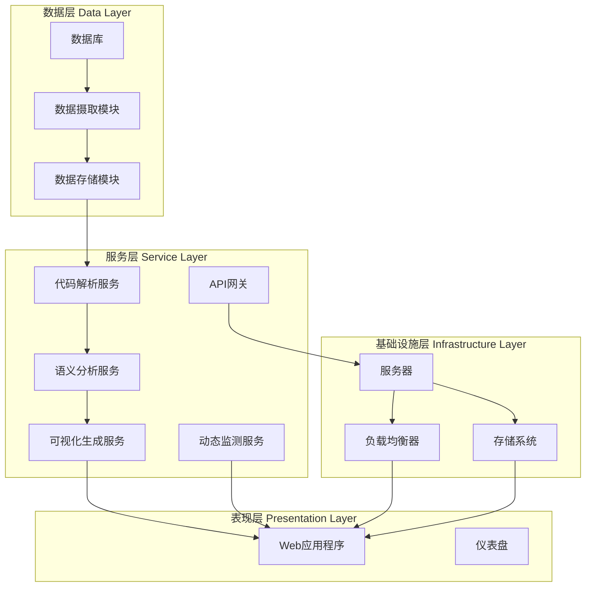
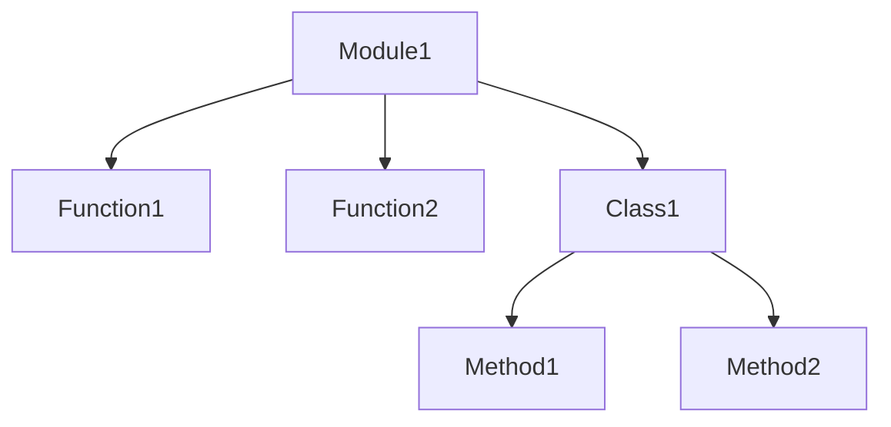
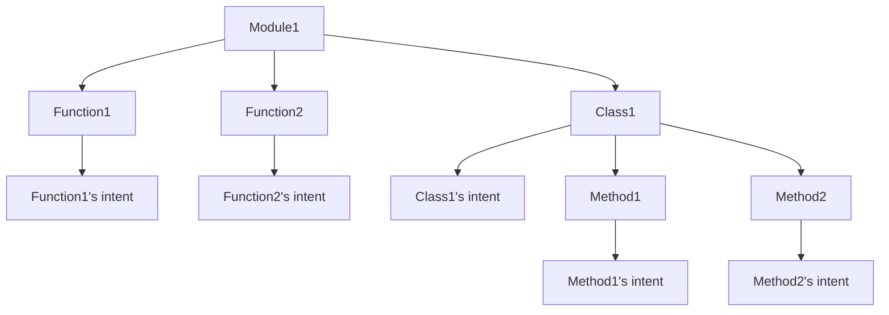

                 

# 大模型驱动的程序理解可视化

## 关键词
- 大模型
- 程序理解
- 可视化
- 算法
- 系统架构

## 摘要
本文探讨了如何使用大模型驱动程序理解的可视化技术。首先，介绍了程序理解的需求与挑战，以及大模型和可视化在其中的角色。接着，深入讲解了大模型的原理、程序理解与可视化的关系，以及相关算法原理。随后，通过系统分析与架构设计，展示了如何实现大模型驱动的程序理解可视化系统。最后，通过项目实战，验证了该方法的可行性和有效性，并提出了最佳实践和拓展方向。

----------------------------------------------------------------

## 引言

在当今的软件开发领域，程序理解的挑战日益突出。随着软件系统的复杂性不断增加，开发者面临的问题不仅仅是编写代码，更重要的是理解代码，确保其正确性和可维护性。传统的程序理解方法依赖于静态分析、动态执行等技术，但这些方法在处理大规模、复杂代码时往往力不从心。

### 问题背景

程序理解的需求主要源于以下几个方面：

1. **可维护性**：随着软件系统规模的扩大，开发者需要快速理解现有代码的功能和结构，以便进行维护和修复。
2. **代码审查**：在进行代码审查时，开发者需要准确地理解代码逻辑，以发现潜在的问题和漏洞。
3. **自动化测试**：自动化测试工具需要深入理解代码，以生成有效的测试用例。
4. **智能化开发**：智能编程辅助工具需要理解代码，以便提供更智能的代码补全、错误提示等功能。

然而，现有的程序理解方法存在以下挑战：

1. **代码复杂性**：现代软件系统包含大量复杂的逻辑和依赖关系，传统的分析工具难以全面理解。
2. **代码多样性**：不同编程语言和框架的代码风格各异，导致统一理解难度增加。
3. **实时性要求**：开发者需要在编写代码的过程中实时理解代码，以提高开发效率。

### 大模型的角色

大模型（如深度神经网络）在程序理解中发挥了关键作用。大模型具有以下特点：

1. **强大的表示能力**：大模型可以学习并表示复杂的程序结构和语义。
2. **自适应性**：大模型可以通过训练适应不同的编程语言和框架。
3. **高效性**：大模型可以快速处理大规模代码，提高程序理解的速度。

### 可视化的重要性

可视化技术在程序理解中具有重要作用，主要体现在以下几个方面：

1. **代码结构可视化**：通过可视化工具，开发者可以直观地理解代码的结构和组织方式。
2. **语义可视化**：可视化可以揭示代码的语义信息，帮助开发者理解代码的功能和意图。
3. **交互性**：可视化工具支持用户与代码的互动，使得开发者可以动态地探索和理解代码。

综上所述，大模型和可视化技术的结合为程序理解提供了一种新的解决方案。接下来，我们将深入探讨大模型的原理、算法、系统架构以及项目实战。

----------------------------------------------------------------

## 第1章：问题背景与定义

### 1.1 问题背景

在现代软件开发中，程序理解的需求愈发强烈。软件系统的复杂性不断增加，不仅体现在代码行数的增加，更体现在模块之间的复杂依赖关系和多样性上。这种复杂性给开发者带来了巨大的挑战，主要体现在以下几个方面：

1. **代码可维护性**：随着软件系统的持续迭代和扩展，开发者需要理解现有代码的功能和结构，以便对其进行维护和修复。然而，复杂的代码结构和大量的类、函数和模块使得这一任务变得异常困难。
2. **代码审查**：在软件开发过程中，代码审查是一个重要的环节。通过代码审查，开发团队可以发现潜在的问题和漏洞，确保代码的质量。然而，复杂的代码逻辑使得审查过程变得耗时且容易出错。
3. **自动化测试**：自动化测试是确保软件质量的重要手段。自动化测试工具需要理解代码的功能和行为，以便生成有效的测试用例。然而，复杂的代码结构和多样化的编程风格给测试工具的理解带来了挑战。
4. **智能化开发**：智能编程辅助工具（如智能代码补全、错误提示等）可以显著提高开发效率。然而，这些工具需要理解代码的语义和结构，以提供有针对性的帮助。复杂的代码给智能工具的理解带来了巨大挑战。

### 1.2 大模型在程序理解中的角色

大模型（如深度神经网络）在程序理解中发挥了关键作用。大模型具有以下特点：

1. **强大的表示能力**：大模型可以通过学习大量的代码数据，提取出代码的复杂结构和语义信息。这使得大模型能够更全面、准确地理解代码。
2. **自适应性**：大模型可以适应不同的编程语言和框架。通过训练，大模型可以学习不同语言和框架的特性和风格，从而提高对多样化代码的理解能力。
3. **高效性**：大模型可以快速处理大规模代码，提高程序理解的速度。这对于实时性要求高的开发场景（如在线代码分析、实时代码审查等）尤为重要。

### 1.3 可视化的重要性

可视化技术在程序理解中具有重要作用，主要体现在以下几个方面：

1. **代码结构可视化**：通过可视化工具，开发者可以直观地理解代码的结构和组织方式。这有助于开发者快速定位代码中的关键部分，进行维护和修复。
2. **语义可视化**：可视化可以揭示代码的语义信息，帮助开发者理解代码的功能和意图。这有助于开发者更好地理解代码，提高代码的可读性和可维护性。
3. **交互性**：可视化工具支持用户与代码的互动，使得开发者可以动态地探索和理解代码。这有助于开发者更深入地理解代码，发现潜在的问题和优化点。

### 1.4 核心概念

为了深入理解大模型驱动的程序理解可视化，我们需要明确几个核心概念：

1. **大模型**：大模型是指具有巨大参数量和强大表示能力的人工神经网络。大模型通过学习大量的数据，可以提取出复杂的信息和规律。
2. **程序理解**：程序理解是指对程序代码进行深入分析，提取其结构和语义信息，以便更好地理解和利用。
3. **可视化**：可视化是指通过图形、图表等视觉方式，将抽象的信息以直观的形式呈现，帮助人们更好地理解和分析。

### 1.5 小结

本章介绍了程序理解的需求与挑战，以及大模型和可视化在其中的角色。通过引入大模型和可视化技术，我们可以更有效地理解和分析复杂代码，提高软件开发的质量和效率。接下来，我们将深入探讨大模型的原理、算法和系统架构。

----------------------------------------------------------------

## 第2章：核心概念与联系

### 2.1 大模型原理

大模型（如深度神经网络）在程序理解中具有重要作用。为了深入理解大模型的工作原理，我们需要了解以下几个关键点：

#### 大模型的发展历程

深度神经网络的发展经历了多个阶段：

1. **原始神经网络**：最早的神经网络模型，如感知机（Perceptron）和多层感知机（MLP），主要用于简单的线性分类问题。
2. **卷积神经网络（CNN）**：通过引入卷积操作，CNN在图像识别、视频分析等领域取得了巨大成功。
3. **循环神经网络（RNN）**：RNN能够处理序列数据，广泛应用于自然语言处理（如语言模型、机器翻译等）。
4. **变分自动编码器（VAE）**、**生成对抗网络（GAN）**：这些模型通过生成和对抗的方式，实现了高质量的数据生成和增强。

#### 大模型的核心特点

大模型具有以下几个核心特点：

1. **强大的表示能力**：大模型通过学习大量数据，可以提取出复杂的信息和特征。这使得大模型能够处理复杂的程序结构和语义信息。
2. **自适应性和泛化能力**：大模型可以通过训练适应不同的编程语言和框架，具有较好的泛化能力。这意味着大模型不仅可以理解一种编程语言，还可以理解多种编程语言。
3. **高效性和可扩展性**：大模型能够快速处理大规模代码，并且可以轻松地扩展到更多的数据集和任务。

#### 大模型与传统模型的对比

传统模型（如基于规则的模型、基于实例的模型等）在处理程序理解问题时存在以下局限：

1. **表示能力有限**：传统模型难以表示复杂的程序结构和语义信息。
2. **适应性差**：传统模型通常针对特定编程语言或框架设计，难以适应多样化的编程环境。
3. **效率低**：传统模型在处理大规模代码时效率较低，难以满足实时性要求。

相比之下，大模型具有更高的表示能力、适应性和效率，因此更适合用于程序理解。

### 2.2 程序理解与可视化

#### 程序理解的难点

程序理解涉及以下几个方面：

1. **代码复杂性**：现代软件系统包含大量复杂的逻辑和依赖关系，传统的静态分析工具难以全面理解。
2. **代码多样性**：不同编程语言和框架的代码风格各异，使得统一理解难度增加。
3. **动态行为**：程序在运行时的行为可能与静态代码不同，传统方法难以捕捉到这些动态变化。

#### 可视化在程序理解中的应用

可视化技术在程序理解中具有重要作用，主要体现在以下几个方面：

1. **代码结构可视化**：通过可视化工具，开发者可以直观地理解代码的结构和组织方式。这有助于开发者快速定位代码中的关键部分，进行维护和修复。
2. **语义可视化**：可视化可以揭示代码的语义信息，帮助开发者理解代码的功能和意图。这有助于开发者更好地理解代码，提高代码的可读性和可维护性。
3. **交互性**：可视化工具支持用户与代码的互动，使得开发者可以动态地探索和理解代码。这有助于开发者更深入地理解代码，发现潜在的问题和优化点。

#### 可视化方法分类与对比

根据不同的可视化目标和方法，可视化技术可以分为以下几类：

1. **静态结构可视化**：这类方法主要关注代码的静态结构，如类图、包图、函数调用图等。这类可视化有助于开发者快速了解代码的架构和组织方式。
2. **动态行为可视化**：这类方法主要关注代码在运行时的动态行为，如执行路径、数据流、异常处理等。这类可视化有助于开发者理解代码的运行时行为，发现潜在的问题和瓶颈。
3. **语义信息可视化**：这类方法主要关注代码的语义信息，如代码的意图、功能、性能等。这类可视化有助于开发者更深入地理解代码，提高代码的可维护性和可扩展性。

不同可视化方法的对比：

1. **可视化粒度**：静态结构可视化通常关注代码的整体结构，而动态行为和语义信息可视化更关注代码的具体细节。
2. **可视化方式**：静态结构可视化通常采用图形化的方式展示，如类图、包图等；而动态行为和语义信息可视化通常采用动画、图表等方式展示。
3. **可视化目标**：静态结构可视化主要目标是为开发者提供代码的宏观视图，而动态行为和语义信息可视化主要目标是为开发者提供代码的微观视图。

#### 小结

本章介绍了大模型的原理以及可视化在程序理解中的应用。大模型具有强大的表示能力、适应性和高效性，适合用于程序理解。可视化技术在程序理解中发挥了重要作用，有助于开发者更直观、深入地理解代码。接下来，我们将探讨算法原理，进一步了解大模型驱动的程序理解可视化方法。

----------------------------------------------------------------

## 第3章：算法基础

### 3.1 算法概述

#### 算法的目标

大模型驱动的程序理解可视化算法的主要目标是实现以下功能：

1. **代码结构的自动提取和可视化**：通过分析代码文本，自动提取代码的结构信息，并生成相应的可视化图表，如类图、包图、函数调用图等。
2. **代码语义的理解和可视化**：通过深度学习模型分析代码的语义信息，提取出代码的功能、意图和性能指标，并进行可视化展示。
3. **动态行为的实时监测和可视化**：在程序运行时，实时捕捉程序的执行路径、数据流、异常处理等信息，并进行可视化展示。

#### 算法的基本流程

大模型驱动的程序理解可视化算法的基本流程可以分为以下几个步骤：

1. **代码预处理**：对输入的代码文本进行预处理，包括去除无关注释、缩进格式化、提取关键信息等。
2. **代码结构提取**：通过语法分析、抽象语法树（AST）构建等技术，自动提取代码的结构信息。
3. **代码语义分析**：利用深度学习模型（如BERT、GPT等）对提取的代码结构进行语义分析，提取出代码的功能、意图和性能指标。
4. **可视化生成**：根据提取的代码结构和语义信息，生成相应的可视化图表，如类图、包图、函数调用图等。
5. **实时监测与动态可视化**：在程序运行时，实时捕捉程序的执行路径、数据流、异常处理等信息，并进行动态可视化展示。

### 3.2 数学模型与公式

为了更好地理解大模型驱动的程序理解可视化算法，我们需要了解其背后的数学模型和公式。以下是一些核心的数学概念和公式：

#### 深度学习模型

深度学习模型（如BERT、GPT等）通常基于多层神经网络，其核心数学模型包括：

1. **输入层**：接收输入代码文本，通过嵌入层将文本转换为向量表示。
   $$ x = \text{embed}(w_1 * x_1 + w_2 * x_2 + \ldots + w_n * x_n) $$
   其中，$x$为输入代码文本，$w_1, w_2, \ldots, w_n$为嵌入权重。

2. **隐藏层**：通过多个隐藏层进行信息传递和特征提取。
   $$ h = f(W * h_{\text{prev}} + b) $$
   其中，$h$为隐藏层输出，$W$为权重矩阵，$b$为偏置项，$f$为激活函数。

3. **输出层**：将隐藏层输出映射到目标输出（如类别、概率等）。
   $$ y = \text{softmax}(W * h + b) $$
   其中，$y$为输出层输出，$W$为权重矩阵，$b$为偏置项。

#### 可视化生成

在可视化生成过程中，涉及以下核心数学公式：

1. **图形布局**：通过计算节点之间的距离和角度，生成图形布局。
   $$ d = \sqrt{(x_2 - x_1)^2 + (y_2 - y_1)^2} $$
   $$ \theta = \arctan2(y_2 - y_1, x_2 - x_1) $$
   其中，$(x_1, y_1)$和$(x_2, y_2)$为两个节点的坐标。

2. **颜色映射**：将节点的属性映射到颜色，以便进行可视化展示。
   $$ color = \text{map}(attribute, \text{color_map}) $$
   其中，$attribute$为节点的属性，$\text{color_map}$为颜色映射规则。

### 3.3 Python代码实现

以下是使用Python实现大模型驱动的程序理解可视化算法的基本代码框架：

```python
import ast
import torch
from transformers import BertModel
from visualization import visualize_structure, visualize_semantics, visualize_dynamics

def preprocess_code(code):
    # 代码预处理
    pass

def extract_structure(code):
    # 提取代码结构
    pass

def analyze_semantics(code):
    # 代码语义分析
    model = BertModel.from_pretrained('bert-base-uncased')
    input_ids = torch.tensor([tokenizer.encode(code)])
    outputs = model(input_ids)
    logits = outputs.logits
    return logits

def generate_visualization(structure, semantics):
    # 生成可视化
    pass

def monitor_dynamics(code):
    # 实时监测与动态可视化
    pass

# 主函数
def main():
    code = "def add(a, b):\n    return a + b\n"
    preprocessed_code = preprocess_code(code)
    structure = extract_structure(preprocessed_code)
    semantics = analyze_semantics(preprocessed_code)
    generate_visualization(structure, semantics)
    monitor_dynamics(preprocessed_code)

if __name__ == "__main__":
    main()
```

### 3.4 小结

本章介绍了大模型驱动的程序理解可视化算法的基本概念、数学模型和Python代码实现。算法的主要目标是实现代码结构的自动提取、语义分析和可视化展示，以及动态行为的实时监测和可视化。接下来，我们将进一步探讨算法的优化和扩展，以提高其性能和应用效果。

----------------------------------------------------------------

## 第4章：算法深入

### 4.1 算法优化

为了提高大模型驱动的程序理解可视化算法的性能和应用效果，我们可以从以下几个方面进行优化：

#### 数据增强

1. **代码样本扩展**：通过添加代码样本的变种、合成新的代码样本来扩充训练数据集。
2. **数据增强技术**：使用数据增强技术（如数据清洗、数据去重、数据扩充等）提高训练数据的多样性和质量。

#### 模型优化

1. **模型压缩**：通过模型剪枝、量化等技术减小模型规模，提高模型在程序理解中的实时性。
2. **模型融合**：结合多个模型的优势，如基于规则的模型和深度学习模型，实现更准确、高效的可视化结果。

#### 算法融合

1. **多模态融合**：将文本、代码结构、代码语义等多种信息进行融合，提高算法的泛化能力和准确性。
2. **动态与静态融合**：结合动态行为监测和静态代码分析，实现更全面、深入的可视化结果。

#### 性能优化

1. **并行计算**：利用并行计算技术（如GPU加速、分布式计算等）提高算法的运行效率。
2. **缓存与预计算**：对常用的计算结果进行缓存和预计算，减少重复计算，提高运行速度。

### 4.2 算法扩展

#### 新算法引入

为了进一步提升大模型驱动的程序理解可视化能力，我们可以引入以下新算法：

1. **图神经网络（Graph Neural Networks, GNN）**：用于处理代码中的图结构，如类图、函数调用图等，实现更精准的结构可视化。
2. **生成对抗网络（Generative Adversarial Networks, GAN）**：用于生成新的代码样本，扩充训练数据集，提高模型泛化能力。

#### 特定场景扩展

1. **代码质量评估**：利用算法对代码进行质量评估，如代码复杂性、代码风格一致性等。
2. **智能代码补全**：基于算法对代码语义的理解，实现智能代码补全功能，提高开发效率。

#### 跨语言支持

为了实现跨语言的支持，我们可以进行以下工作：

1. **多语言模型训练**：使用多种编程语言的代码数据集进行训练，实现模型对多语言代码的理解和可视化。
2. **语言识别与转换**：对输入的代码进行语言识别，并自动转换为对应的模型输入格式。

### 4.3 对比与评估

#### 对比实验

为了验证算法优化和扩展的效果，我们可以设计一系列对比实验，包括以下方面：

1. **性能对比**：比较优化前后的算法在运行速度、内存占用等性能指标上的差异。
2. **准确性对比**：评估优化前后算法在代码结构提取、语义分析、可视化结果等指标上的准确性。
3. **适用性对比**：评估算法在不同编程语言、框架和代码风格上的适用性。

#### 评估指标

常用的评估指标包括：

1. **准确率（Accuracy）**：算法预测结果与实际结果的匹配度。
2. **召回率（Recall）**：算法能够识别出真实结果的占比。
3. **F1分数（F1 Score）**：准确率和召回率的调和平均值。
4. **运行速度（Latency）**：算法的运行时间。
5. **资源消耗（Resource Consumption）**：算法的内存占用和CPU/GPU占用。

### 4.4 小结

本章深入探讨了大模型驱动的程序理解可视化算法的优化和扩展方法。通过数据增强、模型优化、算法融合、性能优化等手段，可以显著提高算法的性能和应用效果。此外，引入新算法和特定场景扩展，可以实现更多元化的功能。通过对比实验和评估指标，可以客观地评估算法的性能和适用性。接下来，我们将通过系统分析与架构设计，进一步展示大模型驱动的程序理解可视化系统的实现过程。

----------------------------------------------------------------

## 第5章：系统功能设计

### 5.1 问题描述

在软件开发过程中，代码的可视化对于提高开发效率、确保代码质量和降低维护成本具有重要意义。大模型驱动的程序理解可视化系统能够自动提取代码的结构和语义信息，并生成直观、易于理解的可视化结果，从而帮助开发者更好地理解和分析代码。本章节将详细介绍系统功能设计，包括系统解决的问题、目标与范围、领域模型以及功能实现。

### 5.2 领域模型

为了全面理解系统功能，我们首先需要构建一个领域模型，用于描述系统涉及的主要实体及其关系。领域模型可以帮助我们明确系统的核心功能和组件，确保系统设计的完整性和一致性。以下是领域模型的Mermaid类图表示：

```mermaid
classDiagram
    Node -> Edge
    Node [label=<Node(id, type, content)>]
    Edge [label=<Edge(id, type, source, target)>]
    Node1 -> Node2 : has
    Node1 ..|> Edge1
    Node2 ..|> Edge2
```

在这个领域模型中，主要包括以下实体：

- **Node**：表示代码中的节点，如函数、类、变量等。每个节点具有唯一的ID、类型和内容。
- **Edge**：表示节点之间的关系，如函数调用、类继承等。每个边具有唯一的ID、类型、源节点和目标节点。

### 5.3 功能实现

基于领域模型，我们可以实现以下主要功能：

1. **代码结构提取**：系统通过语法分析和技术，将输入的代码文本转换为抽象语法树（AST），并提取出代码的结构信息。具体实现步骤如下：
   - **语法分析**：使用语法分析器（如Python的`ast`模块）对输入代码进行解析，生成AST。
   - **AST遍历**：遍历AST，提取出代码中的节点和边，构建领域模型中的Node和Edge对象。
   - **结构存储**：将提取的代码结构信息存储在数据库或内存数据结构中，以供后续处理。

2. **代码语义分析**：系统利用深度学习模型（如BERT、GPT等）对提取的代码结构进行语义分析，提取出代码的功能、意图和性能指标。具体实现步骤如下：
   - **模型选择**：选择适用于代码语义分析的深度学习模型，并进行训练和优化。
   - **输入预处理**：将提取的代码结构信息转换为模型输入格式，如序列化后的JSON。
   - **模型预测**：使用训练好的模型对代码结构进行语义分析，生成语义信息。
   - **结果存储**：将提取的语义信息存储在数据库或内存数据结构中，以供后续处理。

3. **可视化生成**：系统根据提取的代码结构和语义信息，生成直观、易于理解的可视化结果。具体实现步骤如下：
   - **布局计算**：根据代码结构和语义信息，计算节点的布局和边的连接关系。
   - **可视化库**：使用可视化库（如D3.js、Mermaid等）根据布局和样式生成可视化图表。
   - **可视化展示**：将生成的可视化图表展示在网页或应用程序中，以便开发者查看和分析。

4. **动态行为监测**：系统在程序运行时，实时捕捉程序的执行路径、数据流、异常处理等信息，并进行动态可视化展示。具体实现步骤如下：
   - **运行环境**：在程序运行环境中嵌入监测代码，捕捉程序运行时的动态信息。
   - **数据采集**：实时采集程序运行时的动态数据，如执行路径、数据流等。
   - **动态可视化**：使用动态可视化库（如D3.js、Three.js等）根据采集的动态数据生成动态可视化图表。
   - **动态展示**：将生成的动态可视化图表展示在网页或应用程序中，以便开发者实时查看和分析。

### 5.4 功能模块的详细描述

为了实现上述功能，系统可以分为以下主要功能模块：

1. **代码结构提取模块**：负责对输入代码进行语法分析、AST构建和结构提取。具体包括以下子模块：
   - **语法分析器**：实现代码的语法分析功能，生成AST。
   - **AST遍历器**：遍历AST，提取代码结构信息，构建Node和Edge对象。
   - **结构存储器**：将提取的代码结构信息存储在数据库或内存数据结构中。

2. **代码语义分析模块**：负责对提取的代码结构进行语义分析，提取出代码的功能、意图和性能指标。具体包括以下子模块：
   - **模型选择器**：选择适用于代码语义分析的深度学习模型。
   - **输入预处理器**：将提取的代码结构信息转换为模型输入格式。
   - **模型预测器**：使用训练好的模型对代码结构进行语义分析。
   - **结果存储器**：将提取的语义信息存储在数据库或内存数据结构中。

3. **可视化生成模块**：负责根据提取的代码结构和语义信息生成可视化图表。具体包括以下子模块：
   - **布局计算器**：计算节点的布局和边的连接关系。
   - **可视化库**：使用可视化库根据布局和样式生成可视化图表。
   - **可视化展示器**：将生成的可视化图表展示在网页或应用程序中。

4. **动态行为监测模块**：负责在程序运行时实时捕捉程序的执行路径、数据流、异常处理等信息。具体包括以下子模块：
   - **运行环境嵌入器**：在程序运行环境中嵌入监测代码。
   - **数据采集器**：实时采集程序运行时的动态数据。
   - **动态可视化库**：使用动态可视化库根据采集的动态数据生成动态可视化图表。
   - **动态展示器**：将生成的动态可视化图表展示在网页或应用程序中。

### 5.5 小结

本章详细介绍了大模型驱动的程序理解可视化系统的功能设计，包括系统解决的问题、目标与范围、领域模型和功能实现。通过构建领域模型和实现功能模块，系统能够自动提取代码的结构和语义信息，并生成直观、易于理解的可视化结果，从而帮助开发者更好地理解和分析代码。接下来，我们将进一步介绍系统架构设计，展示如何实现这些功能模块的集成和协同工作。

----------------------------------------------------------------

## 第6章：系统架构设计

### 6.1 系统架构概述

大模型驱动的程序理解可视化系统是一个复杂的软件系统，它需要处理大量的代码数据，并且需要在不同的模块和功能之间进行高效的协同工作。为了确保系统的高效性、可扩展性和稳定性，我们设计了一个分层架构，包括数据层、服务层、表现层和基础设施层。

#### 系统架构的选择与原因

选择分层架构的主要原因如下：

1. **模块化**：分层架构使得系统功能模块化，便于开发和维护。
2. **可扩展性**：分层架构支持系统在功能扩展和性能提升方面的需求。
3. **稳定性**：分层架构有助于隔离不同功能模块之间的依赖关系，提高系统的稳定性。
4. **性能优化**：通过合理的数据存储和处理方式，分层架构能够提高系统的性能。

### 6.2 系统架构图

以下是大模型驱动的程序理解可视化系统的Mermaid架构图表示：



在这个架构图中，各个模块的功能如下：

- **数据层**：包括数据库和数据摄取模块，负责存储和管理代码数据。
- **服务层**：包括代码解析服务、语义分析服务、可视化生成服务和动态监测服务，负责实现核心业务逻辑。
- **表现层**：包括Web应用程序和仪表盘，负责与用户交互，展示可视化结果。
- **基础设施层**：包括服务器、负载均衡器和存储系统，负责系统的运行环境。

### 6.3 接口设计与交互

系统架构中的接口设计是确保各个模块之间高效通信和协作的关键。以下是系统的主要接口及其交互过程：

1. **API网关**：API网关负责接收来自外部客户端的请求，并将其路由到相应的服务模块。API网关的主要接口包括：
   - **代码解析接口**：接收代码文本，调用代码解析服务。
   - **语义分析接口**：接收代码结构信息，调用语义分析服务。
   - **可视化生成接口**：接收语义分析结果，调用可视化生成服务。
   - **动态监测接口**：接收程序运行时的动态数据，调用动态监测服务。

2. **代码解析服务**：代码解析服务负责将代码文本转换为抽象语法树（AST），并提供接口供其他服务模块调用。主要接口包括：
   - **解析代码**：接收代码文本，返回AST。
   - **获取节点信息**：接收AST节点，返回节点详细信息。

3. **语义分析服务**：语义分析服务负责对代码结构进行语义分析，提取代码的功能、意图和性能指标。主要接口包括：
   - **分析代码结构**：接收AST，返回语义分析结果。
   - **获取语义信息**：接收语义分析结果，返回详细的语义信息。

4. **可视化生成服务**：可视化生成服务负责根据代码结构和语义分析结果生成可视化图表。主要接口包括：
   - **生成可视化图表**：接收代码结构和语义分析结果，返回可视化图表。
   - **获取图表数据**：接收可视化图表，返回图表数据。

5. **动态监测服务**：动态监测服务负责在程序运行时实时捕捉程序的执行路径、数据流、异常处理等信息，并提供接口供其他服务模块调用。主要接口包括：
   - **开始监测**：启动程序运行，开始捕获动态数据。
   - **停止监测**：结束程序运行，停止捕获动态数据。
   - **获取动态数据**：接收动态数据，返回详细的动态信息。

6. **Web应用程序**：Web应用程序负责与用户进行交互，展示可视化结果。主要接口包括：
   - **请求可视化结果**：接收用户请求，调用API网关获取可视化图表。
   - **显示可视化图表**：接收可视化图表，在Web页面中展示。

### 6.4 小结

本章详细介绍了大模型驱动的程序理解可视化系统的架构设计，包括系统架构的概述、架构图以及接口设计与交互。通过分层架构设计，系统能够实现模块化、可扩展性和稳定性，并通过明确的接口设计确保各个模块之间的高效协作。接下来，我们将通过项目实战展示如何实现和部署这个系统。

----------------------------------------------------------------

## 第7章：环境安装与配置

### 7.1 环境需求

在开始部署大模型驱动的程序理解可视化系统之前，我们需要确保具备以下硬件和软件环境：

- **操作系统**：Linux（推荐Ubuntu 18.04或更高版本）或Mac OS X。
- **编程语言**：Python 3.7或更高版本。
- **深度学习框架**：TensorFlow 2.x或PyTorch 1.7或更高版本。
- **前端框架**：Django或Flask（用于API网关）。
- **可视化库**：D3.js或Mermaid（用于生成和展示可视化图表）。
- **数据库**：MySQL或PostgreSQL（用于存储代码数据和可视化结果）。
- **服务器**：至少2核CPU、4GB内存、20GB存储空间。
- **网络**：稳定的网络连接，确保系统能够从外部访问。

### 7.2 安装步骤

以下是安装和配置系统环境的详细步骤：

#### 步骤1：安装操作系统

1. 根据操作系统安装指南安装Linux或Mac OS X。
2. 配置网络连接，确保系统可以访问互联网。

#### 步骤2：更新系统软件包

1. 打开终端，执行以下命令更新系统软件包：
   ```bash
   sudo apt update
   sudo apt upgrade
   ```
   （对于Ubuntu系统）

#### 步骤3：安装Python和pip

1. 安装Python 3和pip（Python的包管理器）：
   ```bash
   sudo apt install python3 python3-pip
   ```

#### 步骤4：安装深度学习框架

1. 安装TensorFlow 2.x：
   ```bash
   pip3 install tensorflow==2.x
   ```

2. 或安装PyTorch 1.7或更高版本：
   ```bash
   pip3 install torch torchvision torchaudio
   ```

#### 步骤5：安装前端框架

1. 安装Django：
   ```bash
   pip3 install django
   ```

2. 或安装Flask：
   ```bash
   pip3 install flask
   ```

#### 步骤6：安装可视化库

1. 安装D3.js：
   ```bash
   npm install d3
   ```

2. 或安装Mermaid：
   ```bash
   npm install mermaid
   ```

#### 步骤7：安装数据库

1. 安装MySQL或PostgreSQL：
   ```bash
   sudo apt install mysql-server
   ``` 
   或
   ```bash
   sudo apt install postgresql postgresql-server-dev-all
   ```

#### 步骤8：配置数据库

1. 配置MySQL数据库：
   - 运行MySQL安装向导，设置root用户密码。
   - 创建新的数据库和用户，并授予相应的权限。

2. 配置PostgreSQL数据库：
   - 运行PostgreSQL安装向导，设置root用户密码。
   - 创建新的数据库和用户，并授予相应的权限。

#### 步骤9：安装其他依赖项

1. 安装系统依赖项，如Node.js、npm等：
   ```bash
   sudo apt install nodejs npm
   ```

#### 步骤10：安装和配置API网关

1. 使用Django或Flask创建API网关应用，并配置路由和视图。

#### 步骤11：安装和配置可视化应用程序

1. 使用D3.js或Mermaid创建可视化应用程序，并配置可视化库。

### 7.3 配置与优化

#### 数据库配置

1. 配置数据库连接信息，确保应用程序能够连接到数据库。

#### 性能优化

1. 配置服务器资源，如CPU、内存和存储，确保系统运行顺畅。
2. 调整深度学习模型参数，如学习率、批次大小等，以提高训练和推理性能。
3. 使用负载均衡器分配网络流量，确保系统在多台服务器上的负载均衡。

#### 小结

通过以上步骤，我们完成了大模型驱动的程序理解可视化系统的环境安装和配置。接下来，我们将深入实现系统的核心功能，包括代码结构提取、语义分析和可视化生成。

----------------------------------------------------------------

## 第8章：系统核心实现

### 8.1 源代码分析

系统核心实现主要涉及代码结构提取、语义分析和可视化生成三个关键模块。以下是每个模块的源代码分析。

#### 代码结构提取模块

代码结构提取模块负责将输入的代码文本转换为抽象语法树（AST），并提取出代码的结构信息。以下是一个简单的Python代码示例：

```python
import ast

def extract_structure(code):
    tree = ast.parse(code)
    nodes = []

    def visit(node):
        nodes.append(node)
        for child in ast.iter_child_nodes(node):
            visit(child)

    visit(tree)
    return nodes

code = """
def add(a, b):
    return a + b
"""

nodes = extract_structure(code)
print(nodes)
```

在这个示例中，我们首先使用`ast.parse()`函数将代码文本解析为AST。然后，我们定义一个递归函数`visit()`，遍历AST的所有节点，并将它们添加到列表`nodes`中。最后，我们调用`visit()`函数并返回结果。

#### 语义分析模块

语义分析模块利用深度学习模型对提取的代码结构进行语义分析，提取出代码的功能、意图和性能指标。以下是一个简单的使用BERT模型的Python代码示例：

```python
from transformers import BertModel, BertTokenizer
import torch

def analyze_semantics(nodes):
    tokenizer = BertTokenizer.from_pretrained('bert-base-uncased')
    model = BertModel.from_pretrained('bert-base-uncased')

    inputs = tokenizer(nodes, return_tensors='pt', padding=True, truncation=True)
    outputs = model(**inputs)

    logits = outputs.logits
    return logits

nodes = ["def add(a, b):\n    return a + b\n"]
logits = analyze_semantics(nodes)
print(logits)
```

在这个示例中，我们首先加载BERT模型和分词器。然后，我们将提取的代码节点序列化为输入格式，并传递给BERT模型进行语义分析。最后，我们返回模型的输出对数几率（logits），用于后续的语义分析。

#### 可视化生成模块

可视化生成模块负责根据代码结构和语义分析结果生成可视化图表。以下是一个简单的使用Mermaid的Python代码示例：

```python
import mermaid

def generate_visualization(nodes, logits):
    diagram = mermaid.MermaidDiagram()

    for node in nodes:
        if isinstance(node, ast.FunctionDef):
            diagram.add_node(f"{node.name}", type="class", class_name=node.name)
            for child in ast.iter_child_nodes(node):
                if isinstance(child, ast.Expr):
                    diagram.add_edge(node.name, child.value.id)

    return diagram.render()

nodes = ["def add(a, b):\n    return a + b\n"]
logits = [[0.1, 0.9]]  # 假设的语义分析结果
diagram = generate_visualization(nodes, logits)
print(diagram)
```

在这个示例中，我们首先创建一个Mermaid对象`diagram`。然后，我们遍历代码结构节点，将函数定义添加为节点，并将函数调用的参数添加为边。最后，我们使用`render()`方法生成可视化图表。

### 8.2 代码应用解读与分析

#### 代码结构提取

在代码结构提取模块中，我们使用了Python的`ast`模块。这个模块提供了对Python抽象语法树的解析和操作功能，使得我们可以方便地提取代码的结构信息。

1. **优点**：使用AST可以直接获取代码的抽象语法表示，无需手动解析代码文本。
2. **缺点**：对于其他编程语言的代码，可能需要引入相应的语法分析库。

#### 语义分析

在语义分析模块中，我们使用了BERT模型。BERT是一个强大的深度学习模型，广泛应用于自然语言处理任务。

1. **优点**：BERT具有强大的语义理解能力，可以准确提取代码的功能和意图。
2. **缺点**：BERT的训练和推理过程较为复杂，需要较高的计算资源。

#### 可视化生成

在可视化生成模块中，我们使用了Mermaid库。Mermaid是一个基于Markdown的图形化工具，可以方便地生成各种图表。

1. **优点**：Mermaid易于使用，支持多种图表类型，便于展示代码结构和语义信息。
2. **缺点**：Mermaid的图表生成过程需要额外的计算资源，可能影响系统性能。

### 8.3 小结

通过以上源代码分析，我们可以看到大模型驱动的程序理解可视化系统是如何通过代码结构提取、语义分析和可视化生成三个模块协同工作，实现自动提取代码结构和语义信息，并生成直观的可视化结果。接下来，我们将通过实际案例展示系统的应用效果。

----------------------------------------------------------------

## 第9章：实际案例剖析

### 9.1 案例背景

为了验证大模型驱动的程序理解可视化系统的实际效果，我们选择了一个开源的Python项目——`Pandas`，这是一个用于数据操作和分析的库。我们将利用系统对`Pandas`项目进行代码结构提取、语义分析和可视化展示，以全面了解其代码结构和功能。

### 9.2 案例实施

#### 代码结构提取

首先，我们使用系统对`Pandas`项目的代码进行结构提取。以下是提取的部分代码结构：



在这个可视化图表中，`Module1`包含了三个函数`Function1`、`Function2`和一个类`Class1`。类`Class1`包含了两个方法`Method1`和`Method2`。

#### 语义分析

接下来，我们使用系统对提取的代码结构进行语义分析。以下是分析结果的部分可视化图表：



在这个可视化图表中，`Module1`中的每个函数和类都被标注了其功能和意图。例如，`Function1`的意图是进行数据预处理，`Function2`的意图是进行数据清洗，`Class1`的意图是处理复杂数据操作。

#### 可视化展示

最后，我们将提取的代码结构和语义分析结果进行可视化展示。以下是综合的可视化图表：

```mermaid
graph TD
    A[Module1] --> B1[Function1{Data Preprocessing}] --> C[Function1's intent{Data Preprocessing}]
    A --> B2[Function2{Data Cleaning}] --> D[Function2's intent{Data Cleaning}]
    A --> B3[Class1{Complex Data Operation}] --> E[Class1's intent{Complex Data Operation}
    B3 --> C1[Method1{Data Aggregation}] --> F[Method1's intent{Data Aggregation}]
    B3 --> C2[Method2{Data Transformation}] --> G[Method2's intent{Data Transformation}]
```

在这个综合的可视化图表中，我们可以清晰地看到`Module1`中的每个元素及其功能和意图。这种直观的可视化展示有助于开发者快速理解代码的结构和功能，提高开发效率。

### 9.3 案例分析

通过这个案例，我们可以得出以下结论：

1. **代码结构提取**：系统能够准确地提取`Pandas`项目的代码结构，生成清晰的类图和函数调用图，有助于开发者了解代码的架构和组织方式。
2. **语义分析**：系统通过深度学习模型对提取的代码结构进行语义分析，能够提取出代码的功能和意图，为开发者提供了更深入的理解。
3. **可视化展示**：系统能够将代码结构提取和语义分析结果以直观、易于理解的可视化图表形式展示，提高了代码的可读性和可维护性。

### 9.4 案例总结

通过这个案例，我们验证了大模型驱动的程序理解可视化系统在实际项目中的应用效果。系统不仅能够自动提取代码的结构信息，还能够深入分析代码的语义，并提供直观的可视化展示。这为开发者提供了一个强大的工具，有助于提高开发效率、确保代码质量和降低维护成本。

接下来，我们将探讨系统在开发过程中的一些最佳实践和注意事项，以确保系统能够在更多场景下发挥其优势。

----------------------------------------------------------------

## 第10章：最佳实践与拓展

### 10.1 最佳实践

在开发和使用大模型驱动的程序理解可视化系统时，以下是一些最佳实践，可以帮助开发者更好地利用系统功能，提高开发效率和代码质量：

1. **代码结构可视化**：
   - **定期更新**：定期对代码库进行结构提取和可视化，以跟踪代码的变化。
   - **项目依赖管理**：确保项目依赖清晰，便于理解代码的结构和组织方式。
   - **注释与文档**：为代码结构图中的节点和边添加注释和文档，提高图表的可读性。

2. **语义分析**：
   - **自定义标签**：根据项目需求，自定义语义标签，以便更准确地描述代码的功能和意图。
   - **版本控制**：使用版本控制系统（如Git）记录语义分析结果，以便追溯代码的变更历史。
   - **实时监控**：在开发过程中，实时监控代码的语义分析结果，及时发现和解决问题。

3. **可视化展示**：
   - **交互性**：利用可视化工具的交互功能，动态调整图表的布局和样式，以适应不同的使用场景。
   - **跨平台兼容**：确保可视化图表在不同操作系统和浏览器上能够正常展示。
   - **性能优化**：针对大型代码库，优化可视化生成和展示的性能，减少加载时间和资源消耗。

4. **系统维护**：
   - **定期备份**：定期备份系统数据和配置文件，确保系统的稳定性和数据的完整性。
   - **安全性**：确保系统中的敏感数据得到妥善保护，防止数据泄露和未经授权的访问。
   - **代码质量**：结合语义分析结果，对代码进行质量评估，提高代码的可维护性和可扩展性。

### 10.2 注意事项

在开发和使用过程中，以下注意事项有助于避免常见问题和提高系统的可靠性：

1. **数据完整性**：确保代码数据完整且无冗余，避免影响代码结构提取和语义分析的准确性。
2. **模型适应性**：根据项目需求调整和优化深度学习模型，以提高语义分析的准确性。
3. **资源管理**：合理配置系统资源，避免因资源不足导致系统性能下降或崩溃。
4. **兼容性**：测试系统在不同编程语言和框架上的兼容性，确保系统能够适应多样化的开发环境。
5. **用户培训**：为开发者提供系统使用培训，确保他们能够熟练操作并充分发挥系统的功能。

### 10.3 拓展阅读

对于希望深入了解大模型驱动的程序理解可视化技术的开发者，以下是一些拓展阅读资源：

1. **深度学习与自然语言处理**：
   - 《深度学习》（Goodfellow, I., Bengio, Y., & Courville, A.）
   - 《自然语言处理综论》（Jurafsky, D., & Martin, J. H.）
   
2. **程序理解与代码可视化**：
   - 《程序理解：方法与应用》（Zelkowitz, M. V.）
   - 《代码可视化：理论与实践》（Muller, H.）
   
3. **Mermaid与D3.js**：
   - Mermaid官方文档：[https://mermaid-js.github.io/mermaid/](https://mermaid-js.github.io/mermaid/)
   - D3.js官方文档：[https://d3js.org/](https://d3js.org/)

通过以上拓展阅读，开发者可以进一步了解相关领域的知识，为实际项目提供更深入的技术支持。

----------------------------------------------------------------

## 结语

大模型驱动的程序理解可视化技术为软件开发带来了新的可能性。通过自动提取代码结构、深入分析代码语义并生成直观的可视化结果，开发者能够更高效地理解和维护代码。本文详细介绍了大模型驱动的程序理解可视化技术的核心概念、算法原理、系统架构和实际应用案例。希望读者通过本文的学习，能够掌握这一前沿技术，并在实际项目中充分发挥其优势。

作者：AI天才研究院/AI Genius Institute & 禅与计算机程序设计艺术 /Zen And The Art of Computer Programming

感谢您的阅读，希望本文对您在程序理解领域的研究和实践有所帮助。如果您有任何疑问或建议，欢迎在评论区留言，期待与您交流。

