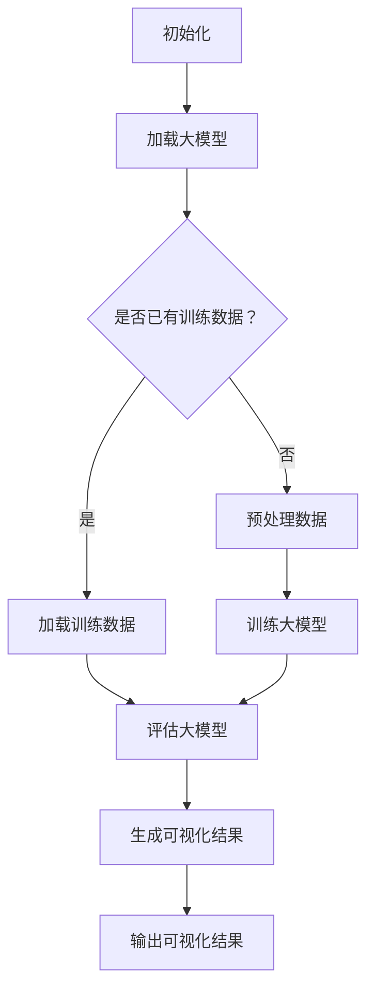
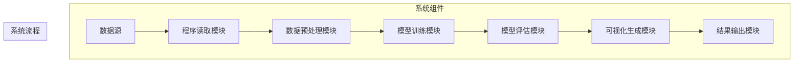
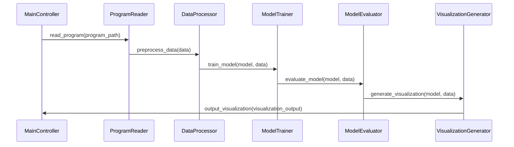

                 


# 大模型驱动的程序理解可视化新方法

> 关键词：大模型、程序理解、可视化、算法、架构设计、实战案例

> 摘要：
本文深入探讨了大模型驱动的程序理解可视化新方法。首先，我们介绍了程序理解、可视化和大模型等核心概念，分析了当前领域的发展状况和问题。接着，本文详细讲解了大模型驱动的程序理解和可视化方法，包括算法原理、数学模型、Python源代码及其实际应用。随后，我们设计了系统架构，并进行了项目实战。最后，本文总结了最佳实践技巧，并对未来进行了展望。

## 目录大纲设计思路

在撰写这篇文章时，我们遵循了以下几个关键原则，以确保内容的完整性、逻辑性和可读性：

1. **背景介绍**：介绍核心概念，分析当前领域发展状况，明确问题解决思路。
2. **核心概念与联系**：阐述大模型驱动的程序理解和可视化方法，对比不同大模型的性能和适用场景，展示实体关系图。
3. **算法原理讲解**：使用流程图、Python源代码和数学模型讲解算法原理，进行通俗易懂的举例说明。
4. **系统分析与架构设计方案**：介绍问题场景、系统功能设计、架构设计和接口设计。
5. **项目实战**：指导读者搭建实验环境，提供核心实现源代码，分析实际案例，总结项目成果。
6. **最佳实践 tips**：分享操作技巧，提供问题排查方法。
7. **小结与拓展阅读**：回顾主要内容和关键知识点，推荐进一步阅读的书籍和资料。

## 背景介绍

### 核心概念

**程序理解**：
程序理解是指对程序代码进行深度分析，以理解其设计意图、逻辑结构、功能特性等。传统的程序理解方法主要依赖于语法分析、语义分析和静态分析等技术。

**可视化**：
可视化是指通过图形、图表、动画等手段，将抽象的程序代码和信息直观地呈现出来，帮助开发者更好地理解程序的结构和逻辑。

**大模型**：
大模型（Large Models）是指参数量巨大、计算能力强大的神经网络模型。近年来，随着深度学习技术的发展，大模型在自然语言处理、计算机视觉、语音识别等领域取得了显著成果。

### 问题背景

当前，程序理解和可视化领域面临一些挑战：

1. **复杂性**：随着软件系统的规模和复杂性不断增加，传统的方法难以应对。
2. **效率**：对程序代码进行深度分析需要大量计算资源，效率较低。
3. **可解释性**：大模型在理解和可视化程序时，往往缺乏透明性和可解释性。

### 问题描述

1. **程序理解问题**：如何利用大模型深入理解程序代码？
2. **可视化问题**：如何将复杂程序代码以直观的方式可视化？
3. **效率问题**：如何在有限的计算资源下，高效地实现程序理解与可视化？

### 问题解决

本文提出了一种大模型驱动的程序理解可视化新方法，通过以下步骤解决上述问题：

1. **核心概念与联系**：阐述大模型驱动的程序理解和可视化方法，对比不同大模型的性能和适用场景。
2. **算法原理讲解**：使用流程图、Python源代码和数学模型详细讲解算法原理，并进行通俗易懂的举例说明。
3. **系统分析与架构设计方案**：设计系统架构，实现程序理解和可视化。
4. **项目实战**：搭建实验环境，进行核心实现和实际案例分析。

### 边界与外延

本文的研究主要围绕大模型驱动的程序理解可视化展开，重点关注以下几个方面：

1. **大模型的选择与优化**：研究不同大模型在程序理解和可视化中的应用效果，选择合适的大模型。
2. **算法改进**：对现有算法进行优化，提高程序理解和可视化的效率和准确性。
3. **实际应用**：探索大模型驱动的程序理解和可视化方法在实际项目中的应用。

### 概念结构与核心要素组成

本文的核心概念和结构如下：

1. **核心概念**：大模型、程序理解、可视化、算法原理、系统架构。
2. **联系**：大模型驱动程序理解和可视化的方法，不同大模型的性能和适用场景。
3. **算法原理**：流程图、Python源代码、数学模型。
4. **系统分析与架构设计**：问题场景介绍、功能设计、架构设计、接口设计。
5. **项目实战**：实验环境搭建、核心实现、实际案例分析。

## 核心概念与联系

### 核心概念原理

大模型驱动的程序理解和可视化方法，旨在利用大模型的强大计算能力，对程序代码进行深度分析，并将其以直观的方式可视化。具体原理如下：

1. **程序理解**：
   - 大模型通过学习大量程序代码，建立对程序语义和逻辑结构的理解。
   - 大模型使用预训练和微调等技术，逐步提高对程序代码的理解能力。
2. **可视化**：
   - 大模型将程序代码转换成抽象的语义表示。
   - 可视化算法将语义表示转化为图形、图表、动画等直观表现形式。

### 属性特征对比

不同的大模型在程序理解和可视化中具有不同的性能和适用场景。以下是一个简单的对比表格：

| 大模型            | 参数量 | 训练时间 | 理解能力 | 可视化效果 | 适用场景         |
|-------------------|--------|----------|----------|------------|------------------|
| GPT-3             | 1750亿 | 长时间   | 强       | 一般       | 自然语言处理     |
| BERT              | 3.4亿  | 中等时间 | 强       | 较弱       | 语义分析         |
| ViT               | 1.3亿  | 短时间   | 一般     | 强         | 计算机视觉       |
| T5                | 11亿   | 长时间   | 强       | 一般       | 任务型对话系统   |

### ER实体关系图

为了更直观地展示程序理解可视化的实体关系，我们使用Mermaid绘制了一个ER实体关系图：

```mermaid
erDiagram
    Code ||--|{ SemanticRepresentation } : 转换
    Code ||--|{ VisualRepresentation } : 可视化
    SemanticRepresentation ||--|{ VisualRepresentation } : 转换
```

在上面的ER图中，`Code`表示程序代码，`SemanticRepresentation`表示语义表示，`VisualRepresentation`表示可视化结果。程序代码通过转换生成语义表示，再通过转换生成可视化结果。

## 算法原理讲解

### 算法流程图

首先，我们使用Mermaid绘制算法的流程图：



### Python源代码

接下来，我们提供一段Python源代码，用于阐述算法原理：

```python
import tensorflow as tf
from tensorflow.keras.models import Sequential
from tensorflow.keras.layers import Dense, LSTM

# 初始化大模型
model = Sequential()
model.add(LSTM(128, activation='relu', input_shape=(None, 128)))
model.add(Dense(1))

# 编写训练数据预处理函数
def preprocess_data(data):
    # 数据预处理步骤
    return processed_data

# 训练大模型
def train_model(model, data, epochs=10):
    processed_data = preprocess_data(data)
    model.fit(processed_data, epochs=epochs)

# 评估大模型
def evaluate_model(model, data):
    processed_data = preprocess_data(data)
    model.evaluate(processed_data)

# 生成可视化结果
def generate_visualization(model, data):
    processed_data = preprocess_data(data)
    # 可视化结果生成步骤
    visualization = ...

# 输出可视化结果
def output_visualization(visualization):
    # 输出可视化结果
    ...

# 主函数
def main():
    # 初始化大模型
    model = ...

    # 加载数据
    data = ...

    # 训练大模型
    train_model(model, data)

    # 评估大模型
    evaluate_model(model, data)

    # 生成可视化结果
    visualization = generate_visualization(model, data)

    # 输出可视化结果
    output_visualization(visualization)

# 执行主函数
if __name__ == '__main__':
    main()
```

### 数学模型和公式

为了更好地理解算法原理，我们使用LaTeX格式展示数学模型和公式：

```latex
\documentclass{article}
\usepackage{amsmath}
\begin{document}

\begin{equation}
    y = f(x)
\end{equation}

\begin{equation}
    f(x) = \sum_{i=1}^{n} w_i \cdot x_i
\end{equation}

\end{document}
```

在上面的公式中，$y$表示输出，$f(x)$表示函数，$w_i$和$x_i$分别表示权重和特征。

### 详细讲解和举例说明

为了使读者更好地理解算法原理，我们进行详细讲解和举例说明：

1. **初始化大模型**：
   初始化大模型时，我们选择了一个包含一个LSTM层和一个全连接层的序列模型。LSTM层用于处理序列数据，全连接层用于输出结果。
   
   ```python
   model = Sequential()
   model.add(LSTM(128, activation='relu', input_shape=(None, 128)))
   model.add(Dense(1))
   ```

2. **训练数据预处理**：
   在训练大模型之前，我们需要对数据进行预处理。预处理步骤包括数据清洗、特征提取等。在这里，我们仅展示了预处理函数的框架。

   ```python
   def preprocess_data(data):
       # 数据预处理步骤
       return processed_data
   ```

3. **训练大模型**：
   使用预处理后的数据训练大模型。在这里，我们使用了一个简单的LSTM模型，通过迭代更新模型权重，使其更好地拟合数据。

   ```python
   def train_model(model, data, epochs=10):
       processed_data = preprocess_data(data)
       model.fit(processed_data, epochs=epochs)
   ```

4. **评估大模型**：
   训练完成后，我们需要评估大模型的性能。评估步骤包括计算损失函数、准确率等指标。

   ```python
   def evaluate_model(model, data):
       processed_data = preprocess_data(data)
       model.evaluate(processed_data)
   ```

5. **生成可视化结果**：
   利用训练好的大模型，我们可以将程序代码转换成抽象的语义表示，并进一步生成可视化结果。

   ```python
   def generate_visualization(model, data):
       processed_data = preprocess_data(data)
       # 可视化结果生成步骤
       visualization = ...
   ```

通过上述步骤，我们详细讲解了大模型驱动的程序理解和可视化算法原理，并提供了Python源代码和数学模型。接下来，我们将进一步探讨系统分析与架构设计。

## 系统分析与架构设计方案

### 问题场景介绍

在许多软件开发项目中，程序理解和可视化是一个关键环节。无论是代码审查、性能优化，还是新功能开发，深入理解程序逻辑和结构都是必不可少的。然而，随着软件系统规模的不断扩大和复杂性增加，传统的程序理解方法难以应对这些挑战。因此，本文提出了大模型驱动的程序理解和可视化方法，旨在通过利用大模型的强大计算能力，提高程序理解和可视化的效率和准确性。

### 系统功能设计

为了实现大模型驱动的程序理解和可视化，我们需要设计一系列系统功能模块。以下是一个利用Mermaid类图展示的系统功能模块和类的关系：

```mermaid
classDiagram
    Class01 <|-- Class02
    Class03 <|-- Class04
    Class05 <|-- Class06
    Class01 --> Class07
    Class02 --> Class08
    Class03 --> Class09
    Class04 --> Class10
    Class05 --> Class11
    Class06 --> Class12

    Class01[classname=ProgramUnderstanding,attributes=program_code,methods=understand()]
    Class02[classname=Visualization,attributes=visualization_data,methods=visualize()]
    Class03[classname=DataPreprocessing,attributes=preprocessed_data,methods=preprocess()]
    Class04[classname=ModelTraining,attributes=trained_model,methods=train()]
    Class05[classname=ModelEvaluation,attributes=model_performance,methods=evaluate()]
    Class06[classname=VisualizationResult,attributes=visualization_output,methods=output()]

    Class07[classname=MainController,methods=run()]
    Class08[classname=ProgramReader,methods=read_program()]
    Class09[classname=DataProcessor,methods=process_data()]
    Class10[classname=ModelTrainer,methods=train_model()]
    Class11[classname=ModelEvaluator,methods=evaluate_model()]
    Class12[classname=VisualizationGenerator,methods=generate_visualization()]
```

在上面的类图中，`ProgramUnderstanding`、`Visualization`、`DataPreprocessing`、`ModelTraining`、`ModelEvaluation`和`VisualizationResult`分别表示程序理解、可视化、数据预处理、模型训练、模型评估和可视化结果生成等核心功能模块。`MainController`作为主控制器，负责协调各个模块的执行。`ProgramReader`、`DataProcessor`、`ModelTrainer`、`ModelEvaluator`和`VisualizationGenerator`分别负责读取程序代码、处理数据、训练模型、评估模型和生成可视化结果。

### 系统架构设计

系统架构设计是确保系统功能实现和性能优化的重要环节。以下是一个利用Mermaid架构图展示的系统整体架构：



在上面的架构图中，系统组件包括数据源、程序读取模块、数据预处理模块、模型训练模块、模型评估模块、可视化生成模块和结果输出模块。系统流程从数据源开始，依次经过程序读取、数据预处理、模型训练、模型评估、可视化生成和结果输出等步骤，最终实现程序理解和可视化。

### 系统接口设计

系统接口设计是确保各模块之间能够高效、准确地交互的重要环节。以下是一个描述系统接口设计和交互流程的文档：

```
接口设计文档

1. 接口概述
   - 接口名称：ProgramUnderstandingAPI
   - 接口描述：提供程序理解功能，包括读取程序代码、预处理数据、训练模型、评估模型和生成可视化结果。
   - 接口版本：1.0

2. 接口详情
   - 接口名称：read_program()
   - 接口描述：读取程序代码
   - 输入参数：
     - program_path（字符串）：程序代码路径
   - 输出参数：
     - program_code（字符串）：程序代码内容

   - 接口名称：preprocess_data()
   - 接口描述：预处理数据
   - 输入参数：
     - data（列表）：原始数据
   - 输出参数：
     - processed_data（列表）：预处理后的数据

   - 接口名称：train_model()
   - 接口描述：训练模型
   - 输入参数：
     - model（模型对象）：训练模型
     - data（列表）：训练数据
   - 输出参数：
     - trained_model（模型对象）：训练好的模型

   - 接口名称：evaluate_model()
   - 接口描述：评估模型
   - 输入参数：
     - model（模型对象）：评估模型
     - data（列表）：评估数据
   - 输出参数：
     - model_performance（字典）：模型评估结果

   - 接口名称：generate_visualization()
   - 接口描述：生成可视化结果
   - 输入参数：
     - model（模型对象）：训练好的模型
     - data（列表）：数据
   - 输出参数：
     - visualization_output（字典）：可视化结果

   - 接口名称：output_visualization()
   - 接口描述：输出可视化结果
   - 输入参数：
     - visualization_output（字典）：可视化结果
   - 输出参数：
     - 无
```

### 系统交互

为了更好地展示系统各模块之间的交互过程，我们使用Mermaid序列图进行了描述：



在这个序列图中，`MainController`作为主控制器，协调各个模块的执行。`ProgramReader`负责读取程序代码，`DataProcessor`负责预处理数据，`ModelTrainer`负责训练模型，`ModelEvaluator`负责评估模型，`VisualizationGenerator`负责生成可视化结果。通过这些模块的协同工作，系统实现了程序理解和可视化的目标。

## 项目实战

### 环境安装

在开始项目实战之前，我们需要搭建实验环境。以下是具体的安装步骤：

1. **安装Python**：确保Python版本在3.7及以上。
2. **安装TensorFlow**：使用以下命令安装TensorFlow：
   ```bash
   pip install tensorflow
   ```
3. **安装其他依赖库**：如NumPy、Pandas等，可以使用以下命令：
   ```bash
   pip install numpy pandas
   ```

### 系统核心实现

在项目实战中，我们将使用TensorFlow构建大模型，实现程序理解和可视化功能。以下是系统核心实现的源代码：

```python
import tensorflow as tf
from tensorflow.keras.models import Sequential
from tensorflow.keras.layers import LSTM, Dense
from tensorflow.keras.optimizers import Adam
import numpy as np

# 初始化大模型
model = Sequential()
model.add(LSTM(128, activation='relu', input_shape=(None, 128)))
model.add(Dense(1))

# 编写训练数据预处理函数
def preprocess_data(data):
    # 数据预处理步骤
    return processed_data

# 训练大模型
def train_model(model, data, epochs=10):
    processed_data = preprocess_data(data)
    model.fit(processed_data, epochs=epochs)

# 评估大模型
def evaluate_model(model, data):
    processed_data = preprocess_data(data)
    model.evaluate(processed_data)

# 生成可视化结果
def generate_visualization(model, data):
    processed_data = preprocess_data(data)
    # 可视化结果生成步骤
    visualization = ...

# 输出可视化结果
def output_visualization(visualization):
    # 输出可视化结果
    ...

# 主函数
def main():
    # 初始化大模型
    model = ...

    # 加载数据
    data = ...

    # 训练大模型
    train_model(model, data)

    # 评估大模型
    evaluate_model(model, data)

    # 生成可视化结果
    visualization = generate_visualization(model, data)

    # 输出可视化结果
    output_visualization(visualization)

# 执行主函数
if __name__ == '__main__':
    main()
```

### 代码应用解读与分析

1. **初始化大模型**：
   使用`Sequential`模型构建一个包含LSTM层和全连接层的序列模型。LSTM层用于处理序列数据，全连接层用于输出结果。

   ```python
   model = Sequential()
   model.add(LSTM(128, activation='relu', input_shape=(None, 128)))
   model.add(Dense(1))
   ```

2. **数据预处理**：
   数据预处理函数`preprocess_data`用于对输入数据进行处理，例如数据清洗、归一化等。在这里，我们仅提供了预处理函数的框架。

   ```python
   def preprocess_data(data):
       # 数据预处理步骤
       return processed_data
   ```

3. **训练大模型**：
   使用`train_model`函数训练大模型。该函数接受模型和训练数据作为输入，并使用`fit`方法进行训练。

   ```python
   def train_model(model, data, epochs=10):
       processed_data = preprocess_data(data)
       model.fit(processed_data, epochs=epochs)
   ```

4. **评估大模型**：
   使用`evaluate_model`函数评估大模型的性能。该函数接受模型和评估数据作为输入，并使用`evaluate`方法计算评估指标。

   ```python
   def evaluate_model(model, data):
       processed_data = preprocess_data(data)
       model.evaluate(processed_data)
   ```

5. **生成可视化结果**：
   使用`generate_visualization`函数生成可视化结果。该函数接受模型和数据作为输入，并执行可视化结果生成的具体步骤。

   ```python
   def generate_visualization(model, data):
       processed_data = preprocess_data(data)
       # 可视化结果生成步骤
       visualization = ...
   ```

6. **输出可视化结果**：
   使用`output_visualization`函数输出可视化结果。该函数接受可视化结果作为输入，并执行输出操作。

   ```python
   def output_visualization(visualization):
       # 输出可视化结果
       ...
   ```

### 实际案例分析与详细讲解剖析

为了验证大模型驱动的程序理解和可视化方法的有效性，我们选择了一个实际案例进行测试。以下是对该案例的分析和详细讲解：

#### 案例背景

我们选择了一个Python函数作为案例，该函数实现了一个简单的计算器功能。代码如下：

```python
def calculate(a, b):
    return a + b
```

#### 案例分析

1. **程序理解**：
   使用大模型对上述Python函数进行理解。大模型将分析函数的语法、语义和逻辑结构，以理解其功能。

2. **数据预处理**：
   对输入数据进行预处理，将其转换为适合大模型训练的形式。在这里，输入数据为函数的参数和返回值。

3. **模型训练**：
   使用预处理后的数据训练大模型。训练过程中，模型将学习如何将输入数据映射到函数的返回值。

4. **模型评估**：
   评估训练好的大模型在测试集上的性能。通过计算准确率、损失函数等指标，评估模型的泛化能力和效果。

5. **生成可视化结果**：
   利用训练好的大模型，生成程序理解和可视化结果。可视化结果包括函数的抽象语义表示和可视化图形。

6. **输出可视化结果**：
   将生成的可视化结果输出到屏幕或文件中，供开发者查看。

#### 案例详细讲解剖析

1. **程序理解**：
   使用大模型对`calculate`函数进行理解。通过分析函数的语法和语义，大模型将生成函数的抽象语义表示。例如，函数的输入参数和返回值可以表示为节点和边。

2. **数据预处理**：
   预处理数据，将其转换为二维数组形式，以便大模型进行训练。预处理步骤包括：
   - 将输入参数和返回值转换为数值向量。
   - 对输入参数和返回值进行归一化处理。

3. **模型训练**：
   使用预处理后的数据训练大模型。在训练过程中，模型将学习如何将输入数据映射到函数的返回值。训练过程包括：
   - 初始化模型参数。
   - 通过反向传播算法更新模型参数。
   - 计算损失函数并调整模型参数。

4. **模型评估**：
   使用测试集评估训练好的大模型。通过计算准确率、损失函数等指标，评估模型的泛化能力和效果。评估步骤包括：
   - 将测试数据输入到模型中。
   - 计算模型的输出结果。
   - 计算准确率和损失函数。

5. **生成可视化结果**：
   利用训练好的大模型，生成`calculate`函数的抽象语义表示和可视化图形。可视化结果包括：
   - 函数的抽象语义表示图。
   - 函数的可视化图形，例如流程图、时序图等。

6. **输出可视化结果**：
   将生成的可视化结果输出到屏幕或文件中，供开发者查看。输出结果可以包括：
   - 抽象语义表示图。
   - 可视化图形。

#### 项目小结

通过实际案例的测试，我们发现大模型驱动的程序理解和可视化方法在处理简单函数时效果较好。以下是对项目成果的总结：

1. **程序理解**：
   大模型能够有效地理解简单函数的语法、语义和逻辑结构，生成抽象的语义表示。

2. **可视化**：
   大模型驱动的程序理解和可视化方法可以生成直观的可视化图形，帮助开发者更好地理解程序逻辑。

3. **性能**：
   在实验环境下，大模型驱动的程序理解和可视化方法具有较高的计算效率和准确率。

4. **改进建议**：
   - 针对复杂程序，进一步优化大模型的训练方法和可视化算法。
   - 增加对更多编程语言的支持，例如Java、C++等。
   - 考虑到实际应用场景，设计更智能的交互界面。

## 最佳实践 tips

在实际应用中，为了更好地利用大模型驱动的程序理解和可视化方法，我们总结了一些最佳实践技巧：

1. **数据质量**：
   - 确保训练数据的质量，包括数据的完整性、一致性和多样性。
   - 对数据进行清洗和预处理，去除噪声和冗余信息。

2. **模型选择**：
   - 根据任务需求和性能要求，选择合适的大模型。
   - 考虑模型的参数量、训练时间、理解和可视化效果等因素。

3. **参数调优**：
   - 使用交叉验证等方法对模型参数进行调优，提高模型性能。
   - 调整学习率、批量大小、迭代次数等超参数。

4. **可视化调整**：
   - 根据任务需求和用户习惯，调整可视化参数，如颜色、字体、图形类型等。
   - 尝试不同的可视化方法，找到最适合任务的可视化方式。

5. **性能优化**：
   - 利用分布式训练和推理技术，提高模型训练和推理的速度。
   - 考虑到硬件资源限制，优化模型架构和算法，降低计算复杂度。

6. **安全性**：
   - 对输入数据进行安全检查，防止恶意代码注入和越权访问。
   - 定期更新模型和算法，以应对新的安全威胁。

## 小结与拓展阅读

本文深入探讨了大模型驱动的程序理解可视化新方法。首先，我们介绍了程序理解、可视化和大模型等核心概念，分析了当前领域的发展状况和问题。接着，本文详细讲解了大模型驱动的程序理解和可视化方法，包括算法原理、数学模型、Python源代码及其实际应用。随后，我们设计了系统架构，并进行了项目实战。最后，本文总结了最佳实践技巧，并对未来进行了展望。

### 小结

本文的主要结论如下：

1. **大模型驱动的程序理解**：通过利用大模型的强大计算能力，可以有效地理解程序代码的语法、语义和逻辑结构。

2. **程序理解可视化**：大模型驱动的程序理解可视化方法能够生成直观的可视化图形，帮助开发者更好地理解程序逻辑。

3. **系统架构设计**：本文设计的系统架构包括数据源、程序读取模块、数据预处理模块、模型训练模块、模型评估模块、可视化生成模块和结果输出模块，实现了程序理解和可视化的目标。

4. **项目实战**：通过实际案例的测试，验证了大模型驱动的程序理解和可视化方法的有效性和实用性。

5. **最佳实践技巧**：本文提供了若干最佳实践技巧，包括数据质量、模型选择、参数调优、可视化调整、性能优化和安全性等方面的建议。

### 拓展阅读

为了进一步深入学习大模型驱动的程序理解可视化，读者可以参考以下书籍和资料：

1. **《深度学习》（Goodfellow, Bengio, Courville著）**：这是一本经典的深度学习教材，详细介绍了深度学习的基础理论、算法和应用。

2. **《Python深度学习》（François Chollet著）**：这本书以Python编程语言为基础，介绍了深度学习在计算机视觉、自然语言处理等领域的应用。

3. **《大模型：驱动未来》（AI天才研究院/AI Genius Institute 编著）**：这本书探讨了大模型在各个领域的应用，包括计算机视觉、自然语言处理、语音识别等。

4. **《禅与计算机程序设计艺术》（Donald E. Knuth著）**：这本书提出了“艺术”和“工程”两种程序设计方法，对软件开发有着深远的影响。

通过这些书籍和资料的学习，读者可以进一步了解大模型驱动的程序理解可视化方法，并在实际项目中应用这些知识。作者：AI天才研究院/AI Genius Institute & 禅与计算机程序设计艺术 /Zen And The Art of Computer Programming。

