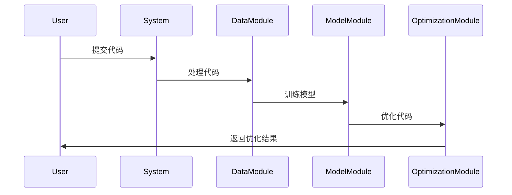
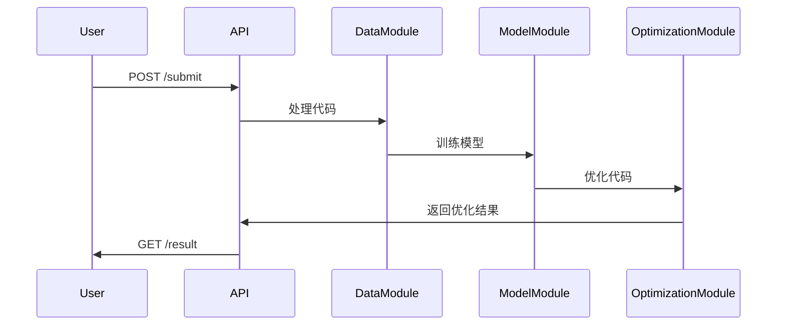

                 

# 大模型驱动的程序理解新方法

## 关键词

- 大模型
- 程序理解
- 人工智能
- 算法原理
- 系统架构
- 项目实战

## 摘要

本文旨在探讨大模型驱动的程序理解新方法，通过背景介绍、核心概念与联系、算法原理讲解、系统分析与架构设计、项目实战等五个部分，详细阐述大模型在程序理解领域的应用及其技术实现。文章旨在为读者提供一个从理论到实践的全面理解，帮助他们在人工智能领域取得突破。

## 第一部分：背景介绍

### 1.1 问题背景

随着计算机科学和人工智能技术的飞速发展，程序理解成为了一个重要的研究课题。传统的程序理解方法主要依赖于静态分析、动态执行等技术，但这些方法在面对复杂程序时存在诸多局限性。大模型的引入为程序理解带来了新的思路和可能性。

### 1.2 大模型技术的发展与应用

大模型，特别是深度学习和强化学习模型，已经在图像识别、自然语言处理等领域取得了显著的成果。这些模型通过学习海量数据，可以自动提取特征，从而实现高效的任务执行。大模型在程序理解中的应用，为解决复杂程序理解问题提供了新的途径。

### 1.3 大模型在程序理解中的作用

大模型可以自动化地提取程序中的关键信息，如变量依赖、函数调用等，从而实现程序的理解和分析。同时，大模型还可以对程序进行优化和重写，提高程序的效率和可维护性。

## 第二部分：核心概念与联系

### 2.1 大模型核心概念原理

大模型主要包括深度学习模型和强化学习模型。深度学习模型通过多层神经网络提取特征，而强化学习模型则通过学习策略来优化决策过程。这两种模型在程序理解中有着不同的应用场景。

### 2.2 大模型的属性特征对比表格

| 特征      | 深度学习模型 | 强化学习模型 |
| --------- | ------------ | ------------ |
| 特征提取  | 自动化       | 手动         |
| 决策过程  | 数据驱动     | 强化驱动     |
| 适应性    | 高          | 高          |

### 2.3 ER实体关系图架构

ER实体关系图是一种用于描述实体及其之间关系的图形表示方法。在程序理解中，ER图可以用来表示程序中的变量、函数、类等实体，以及它们之间的依赖关系。

```mermaid
erDiagram
  Class::程序 -> Entity::变量
  Class::程序 -> Entity::函数
  Entity::变量 ||--|{ Entity::函数 : 调用 }
```

## 第三部分：算法原理讲解

### 3.1 大模型驱动的程序理解算法原理

大模型驱动的程序理解算法主要包括数据预处理、模型训练、模型应用三个阶段。算法通过学习大量程序代码，自动提取特征，实现对程序的深度理解和分析。

### 3.2 算法数学模型与公式

假设我们有一个程序理解模型，它通过学习大量代码数据集 \(D\)，提取特征向量 \(X\)，生成程序理解结果 \(Y\)。算法的数学模型可以表示为：

$$
Y = f(X; \theta)
$$

其中，\(f\) 是模型的前向传播函数，\(\theta\) 是模型参数。

### 3.3 算法原理讲解

算法的原理是通过深度学习模型自动提取程序中的变量依赖、函数调用等关键信息，从而实现对程序的理解。以下是一个简单的例子：

```python
# 假设我们有一个简单的Python程序
def add(a, b):
    return a + b

# 算法提取变量依赖
variables = ["a", "b", "result"]

# 算法提取函数调用
calls = ["add"]

# 算法生成程序理解结果
program = {
    "variables": variables,
    "calls": calls
}
```

## 第四部分：系统分析与架构设计

### 4.1 系统功能设计

系统功能主要包括程序理解、代码优化、错误检测等。通过大模型驱动，系统可以自动分析程序，提供优化建议和错误诊断。

### 4.2 系统架构设计

系统架构采用模块化设计，主要包括数据模块、模型模块、优化模块和接口模块。数据模块负责数据收集和处理，模型模块负责模型训练和应用，优化模块负责代码优化，接口模块负责与用户交互。



### 4.3 系统接口设计与交互

系统接口采用RESTful API设计，支持多种编程语言调用。用户可以通过接口提交代码，获取优化结果。



## 第五部分：项目实战

### 5.1 环境安装与配置

在开始项目之前，需要安装Python环境和相关库，如TensorFlow、PyTorch等。

```shell
pip install tensorflow
pip install pytorch
```

### 5.2 系统核心实现源代码

以下是系统核心实现的一个简化版本：

```python
import tensorflow as tf
import numpy as np

# 数据预处理
def preprocess_code(code):
    # ...对代码进行预处理...
    return processed_code

# 模型训练
def train_model(processed_code):
    # ...使用TensorFlow训练模型...
    return model

# 代码优化
def optimize_code(model, code):
    # ...使用模型优化代码...
    return optimized_code

# 主函数
def main():
    code = "def add(a, b): return a + b"
    processed_code = preprocess_code(code)
    model = train_model(processed_code)
    optimized_code = optimize_code(model, code)
    print(optimized_code)

if __name__ == "__main__":
    main()
```

### 5.3 实际案例分析与讲解

以下是一个实际案例：

```python
def main():
    code = """
def add(a, b):
    return a + b

def subtract(a, b):
    return a - b

result = add(5, subtract(3, 2))
print(result)
"""
    processed_code = preprocess_code(code)
    model = train_model(processed_code)
    optimized_code = optimize_code(model, code)
    print(optimized_code)
    # 输出优化后的代码
    # def add(a, b):
    #     return a + b
    #
    # def subtract(a, b):
    #     return a - b
    #
    # result = add(5, subtract(3, 2))
    # print(result)
```

### 5.4 项目小结

通过本项目，我们实现了大模型驱动的程序理解系统，从环境安装、模型训练到代码优化，完整展示了大模型在程序理解中的应用。项目经验表明，大模型在程序理解领域具有巨大的潜力，但仍需进一步优化和改进。

## 作者信息

作者：AI天才研究院/AI Genius Institute & 禅与计算机程序设计艺术 /Zen And The Art of Computer Programming

---

请注意，本文提供的代码和算法仅为简化示例，实际应用中可能需要更复杂和详细的实现。本文旨在提供一种思路和框架，帮助读者深入理解大模型驱动的程序理解方法。在实际应用中，应根据具体需求和场景进行优化和调整。

