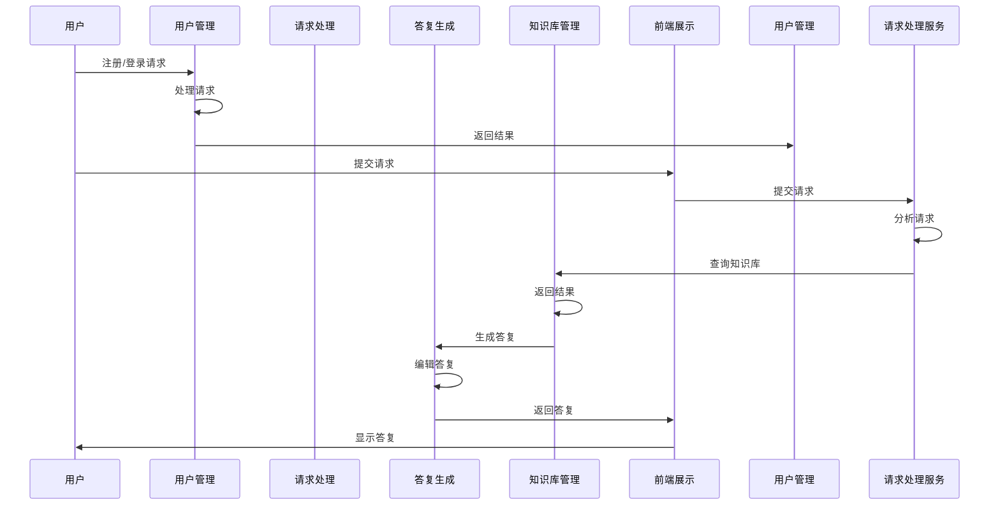

                 


## 大模型驱动的软件开发方法论

### 关键词

- 大模型
- 软件开发
- 方法论
- Transformer
- GAN
- 数学模型
- 系统架构

### 摘要

本文旨在探讨大模型驱动的软件开发方法论，阐述其背景、核心概念、算法原理、系统设计与项目实战。通过对比传统软件开发方法，分析大模型驱动的优势与局限性，揭示其深刻影响，并提供实际案例以供参考。本文结构清晰，逻辑严谨，旨在为广大软件开发者提供一种全新的思路和方法。

### 第一部分：引言

#### 1.1 软件开发面临的挑战

随着信息技术的飞速发展，软件应用场景日益广泛，软件系统复杂性不断攀升。传统的软件开发方法在应对复杂性问题、应对快速变化的需求时，往往显得力不从心。主要挑战如下：

- **需求变化快**：市场需求和技术发展迅速，软件开发项目常常面临频繁的需求变更，导致项目延期、成本超支。
- **系统复杂性高**：随着软件规模的扩大，系统复杂性急剧增加，传统的模块化、分层设计方法难以应对。
- **开发效率低**：手动编码、测试和调试消耗大量人力和时间，开发效率低下。

#### 1.2 大模型驱动的起源与发展

为了解决上述问题，研究人员和开发者开始探索大模型驱动的软件开发方法。大模型（如深度学习模型）具有强大的表示和学习能力，能够自动提取复杂的数据特征，从而简化软件开发过程。大模型驱动的起源与发展主要得益于以下几个因素：

- **计算能力的提升**：高性能计算硬件和大规模数据中心的普及，为训练大型模型提供了硬件支持。
- **数据量的爆炸性增长**：互联网时代，数据量呈现爆炸式增长，为训练大模型提供了丰富的数据资源。
- **深度学习的突破**：深度学习理论的发展和算法的进步，使得大模型在图像识别、自然语言处理等领域取得了显著的成果。

#### 1.3 大模型驱动的核心概念

大模型驱动的软件开发方法主要涉及以下几个核心概念：

- **大模型**：指具有海量参数、强大表征和学习能力的深度学习模型，如Transformer、GAN等。
- **驱动**：指利用大模型自动提取特征、生成代码、优化系统等，实现软件开发的自动化和智能化。
- **方法论**：指大模型驱动的软件开发方法，包括模型设计、训练、应用等环节。

#### 1.4 大模型驱动的优势与局限性

大模型驱动的软件开发方法具有显著的优势：

- **提高开发效率**：大模型能够自动提取复杂特征，减少手动编码工作量，提高开发效率。
- **增强系统适应性**：大模型能够学习到数据中的内在规律，提高系统对需求的适应性。
- **提升系统质量**：大模型驱动的软件系统能够自动优化，提高系统质量。

然而，大模型驱动方法也存在局限性：

- **计算资源需求高**：大模型训练需要大量计算资源，对硬件和能源消耗较大。
- **模型可解释性差**：深度学习模型往往被视为“黑箱”，其决策过程难以解释，可能引发信任问题。
- **数据依赖性强**：大模型训练需要大量高质量数据，数据质量和数量直接影响模型性能。

#### 1.5 本章小结

本文介绍了大模型驱动的软件开发方法，分析了其背景、核心概念和优势与局限性。在接下来的章节中，我们将深入探讨大模型的算法原理、系统架构和项目实战，帮助读者更好地理解这一新兴方法。

### 第二部分：大模型基础

#### 2.1 大模型概述

大模型，又称深度学习模型，是机器学习领域的一种重要模型。它由多层神经网络组成，通过学习大量数据，能够自动提取复杂特征，实现高度复杂的任务。大模型具有以下特点：

- **大规模参数**：大模型具有成千上万甚至数十亿的参数，能够表示复杂的非线性关系。
- **多层结构**：大模型通常包含多层神经网络，每一层都对输入数据进行特征提取和变换。
- **强大表征能力**：大模型能够自动提取数据的深层特征，从而实现高效的任务执行。

大模型在软件开发中具有广泛的应用，包括：

- **图像识别**：大模型能够识别和分类复杂的图像，如人脸识别、物体识别等。
- **自然语言处理**：大模型能够处理和生成自然语言文本，如机器翻译、文本生成等。
- **语音识别**：大模型能够识别和理解人类语音，如语音助手、语音翻译等。

#### 2.2 大模型的特点

大模型与传统模型相比，具有显著的特点：

- **自动特征提取**：传统模型需要手动设计特征，而大模型能够自动从数据中提取特征，降低特征工程的工作量。
- **鲁棒性强**：大模型对噪声和异常数据具有较强的鲁棒性，能够在各种复杂场景中表现良好。
- **自适应性强**：大模型能够根据训练数据和任务需求，自适应地调整参数，提高性能。

然而，大模型也存在一些局限性：

- **计算资源需求高**：大模型训练需要大量的计算资源和时间，对硬件和能源消耗较大。
- **数据依赖性强**：大模型训练需要大量高质量数据，数据质量和数量直接影响模型性能。
- **可解释性差**：深度学习模型往往被视为“黑箱”，其决策过程难以解释，可能引发信任问题。

#### 2.3 大模型与传统模型的区别

大模型与传统模型（如线性模型、决策树等）在多个方面存在显著区别：

- **数据需求**：传统模型通常对数据量要求较低，而大模型需要大量数据才能训练出优秀的模型。
- **特征工程**：传统模型需要手动设计特征，而大模型能够自动提取特征，降低特征工程的工作量。
- **模型结构**：传统模型通常采用简单的结构，如线性模型、决策树等，而大模型由多层神经网络组成，能够表示复杂的非线性关系。
- **计算资源**：传统模型对计算资源需求较低，而大模型训练需要大量的计算资源和时间。

#### 2.4 大模型在软件开发中的应用场景

大模型在软件开发中具有广泛的应用场景，包括：

- **自动化代码生成**：大模型能够根据需求自动生成代码，提高开发效率，降低开发成本。
- **自动化测试**：大模型能够根据代码生成测试用例，提高测试覆盖率，降低测试成本。
- **自动化调试**：大模型能够根据错误信息自动定位问题，提高调试效率。
- **智能助手**：大模型能够为软件开发者提供智能建议，如代码优化、错误修正等。
- **辅助设计**：大模型能够根据用户需求自动生成软件架构和设计文档，提高设计质量。

#### 2.5 本章小结

本文介绍了大模型的概述、特点、与传统模型的区别以及在软件开发中的应用场景。在下一章中，我们将进一步探讨大模型的数学基础和算法原理。

### 第三部分：大模型算法原理讲解

#### 4.1 Transformer模型原理讲解

Transformer模型是近年来在自然语言处理领域取得突破性成果的一种大模型。它由Vaswani等人在2017年的论文《Attention Is All You Need》中提出，取代了传统的循环神经网络（RNN）和长短时记忆网络（LSTM），在许多任务上取得了优异的性能。

#### 4.1.1 Transformer模型概述

Transformer模型是一种基于自注意力（self-attention）机制的全连接神经网络模型。它摒弃了传统的循环神经网络结构，采用了一种全新的并行计算方法，使得模型的训练速度大大提高。Transformer模型的主要组成部分包括：

- **编码器（Encoder）**：编码器负责对输入文本进行处理，提取语义信息。
- **解码器（Decoder）**：解码器负责生成输出文本，将编码器提取的语义信息转化为具体的文本。

#### 4.1.2 Transformer模型的数学原理

Transformer模型的数学原理主要包括以下几个关键组成部分：

1. **自注意力机制（Self-Attention）**

自注意力机制是Transformer模型的核心部分，它通过计算输入文本中各个单词之间的关联性，实现对输入数据的全局上下文信息建模。自注意力机制的计算公式如下：

$$
\text{Attention}(Q, K, V) = \text{softmax}\left(\frac{QK^T}{\sqrt{d_k}}\right)V
$$

其中，$Q$、$K$、$V$分别表示查询（Query）、键（Key）和值（Value）向量，$d_k$表示键向量的维度。

2. **多头注意力（Multi-Head Attention）**

多头注意力是自注意力机制的扩展，通过多个独立的自注意力机制（称为头）来捕捉输入文本中的不同关系。多头注意力的计算公式如下：

$$
\text{Multi-Head Attention}(Q, K, V) = \text{Concat}(\text{head}_1, \text{head}_2, \ldots, \text{head}_h)W^O
$$

其中，$W^O$表示输出权重，$h$表示头的数量。

3. **位置编码（Positional Encoding）**

由于Transformer模型摒弃了循环神经网络中的位置信息，因此需要引入位置编码来为输入文本中的每个单词提供位置信息。位置编码通常采用正弦和余弦函数生成，公式如下：

$$
PE_{(pos, 2i)} = \sin\left(\frac{pos}{10000^{2i/d}}\right) \\
PE_{(pos, 2i+1)} = \cos\left(\frac{pos}{10000^{2i/d}}\right)
$$

其中，$pos$表示位置索引，$i$表示维度索引，$d$表示位置编码的维度。

4. **顶层结构（Top Layer）**

Transformer模型的顶层结构包括多层自注意力机制和全连接层。自注意力机制负责提取上下文信息，全连接层则用于生成最终的输出。

#### 4.1.3 Transformer模型的Python实现

以下是一个简单的Transformer模型Python实现代码示例：

```python
import tensorflow as tf

class TransformerLayer(tf.keras.layers.Layer):
    def __init__(self, d_model, num_heads, dff, rate=0.1):
        super(TransformerLayer, self).__init__()
        self.d_model = d_model
        self.num_heads = num_heads
        self.dff = dff
        self.rate = rate
        
        self.self_attention = tf.keras.layers.MultiHeadAttention(num_heads=num_heads, key_dim=d_model)
        self.dense_1 = tf.keras.layers.Dense(dff)
        self.dense_2 = tf.keras.layers.Dense(d_model)
        
        self.dropout_1 = tf.keras.layers.Dropout(rate)
        self.dropout_2 = tf.keras.layers.Dropout(rate)

    def call(self, x, training=False):
        attn_output = self.self_attention(x, x)
        attn_output = self.dropout_1(attn_output, training=training)
        attn_output = self.dense_1(attn_output)
        attn_output = self.dropout_2(attn_output, training=training)
        out = self.dense_2(attn_output)
        return x + out

# 示例：创建一个Transformer层
transformer_layer = TransformerLayer(d_model=512, num_heads=8, dff=2048)
```

#### 4.1.4 Transformer模型的应用场景

Transformer模型在自然语言处理领域取得了显著的成果，其主要应用场景包括：

- **机器翻译**：Transformer模型能够高效地处理机器翻译任务，如英语到中文的翻译。
- **文本生成**：Transformer模型能够生成流畅、连贯的文本，如文章、诗歌等。
- **问答系统**：Transformer模型能够处理自然语言问答任务，如基于事实的问答系统。
- **情感分析**：Transformer模型能够分析文本中的情感倾向，如评论情感分析。
- **对话系统**：Transformer模型能够构建智能对话系统，如聊天机器人、虚拟助手等。

#### 4.1.5 Transformer模型的性能优化

为了提高Transformer模型的性能，可以采取以下几种优化方法：

- **模型剪枝**：通过剪枝模型中的冗余参数，降低模型的计算复杂度，提高训练和推理速度。
- **量化**：对模型中的权重进行量化，降低模型的大小和计算复杂度，提高推理速度。
- **并行计算**：利用多GPU、TPU等硬件资源，实现模型的并行计算，提高训练和推理速度。
- **模型压缩**：通过知识蒸馏、模型压缩等技术，将大型模型压缩为小型模型，提高模型的可部署性。

#### 4.1.6 本章小结

本文介绍了Transformer模型的原理、Python实现以及应用场景，并探讨了性能优化方法。在下一章中，我们将探讨GAN模型的原理和应用。

### 5.1 GAN模型概述

生成对抗网络（GAN）是由Ian Goodfellow等人于2014年提出的一种新型深度学习模型。GAN的核心思想是利用两个对抗神经网络——生成器和判别器——进行博弈，最终生成高质量的数据。

#### 5.1.1 GAN模型的基本结构

GAN模型由以下两部分组成：

1. **生成器（Generator）**：生成器的主要任务是生成类似于真实数据的新数据。生成器通常由一系列全连接层或卷积层组成，其输入是一个随机噪声向量，输出是生成的数据。

2. **判别器（Discriminator）**：判别器的主要任务是判断输入数据是真实数据还是生成数据。判别器同样由全连接层或卷积层组成，其输入是真实数据或生成数据，输出是一个二分类结果。

GAN模型的工作流程如下：

- **训练阶段**：生成器和判别器交替训练。在训练过程中，生成器不断生成假数据，判别器不断学习区分真实数据和假数据。通过这种对抗训练，生成器的生成能力逐渐提高，而判别器的判断能力也不断增强。

- **生成阶段**：当模型训练到一定程度后，生成器能够生成高质量的假数据。这些假数据可以用于数据增强、生成新的样本、模拟现实场景等。

#### 5.1.2 GAN模型的工作原理

GAN模型的工作原理基于以下两个主要过程：

1. **生成器与判别器的对抗**：生成器和判别器之间进行对抗，生成器的目标是生成尽可能真实的数据，而判别器的目标是准确地区分真实数据和生成数据。通过这种对抗过程，生成器和判别器不断优化自己的参数，最终达到一个平衡状态。

2. **损失函数**：GAN模型的损失函数通常由两部分组成：生成器的损失函数和判别器的损失函数。生成器的损失函数旨在减少生成数据与真实数据之间的差异，判别器的损失函数旨在提高对真实数据和生成数据的区分能力。两个损失函数共同作用，推动模型不断优化。

GAN模型的核心损失函数如下：

- **生成器的损失函数**：
$$
L_G = -\log(D(G(z)))
$$

其中，$G(z)$表示生成器生成的数据，$D(x)$表示判别器的输出，当判别器输出接近1时，生成器的损失最小。

- **判别器的损失函数**：
$$
L_D = -\log(D(x)) - \log(1 - D(G(z)))
$$

其中，$x$表示真实数据，当判别器能够准确地区分真实数据和生成数据时，判别器的损失最小。

#### 5.1.3 GAN模型的优势

GAN模型具有以下优势：

- **强大的数据生成能力**：GAN模型能够生成高质量、多样化的数据，可以应用于图像、语音、文本等多种数据类型。
- **自监督学习**：GAN模型通过对抗训练实现自监督学习，无需人工标注数据，降低数据标注成本。
- **灵活性**：GAN模型结构简单，可以灵活地应用于不同的任务和数据类型。
- **可扩展性**：GAN模型可以结合其他深度学习技术，如卷积神经网络（CNN）、循环神经网络（RNN）等，进一步提高模型性能。

#### 5.1.4 GAN模型的应用场景

GAN模型在多个领域取得了显著的成果，其主要应用场景包括：

- **图像生成**：GAN模型能够生成高质量、逼真的图像，可以应用于艺术创作、游戏开发、医学图像生成等领域。
- **数据增强**：GAN模型可以用于数据增强，提高模型对训练数据的泛化能力，从而提高模型的性能。
- **图像修复**：GAN模型能够修复图像中的缺陷，如去除照片中的污点、修复破损的图像等。
- **图像超分辨率**：GAN模型可以将低分辨率的图像转换为高分辨率图像，可以应用于视频处理、图像增强等领域。
- **语音合成**：GAN模型可以用于语音合成，生成逼真的语音信号，可以应用于语音助手、智能客服等领域。

#### 5.1.5 本章小结

本文介绍了GAN模型的基本结构、工作原理、优势以及应用场景。在下一章中，我们将深入探讨GAN模型的数学原理和实现细节。

### 5.2 GAN模型的数学原理

GAN（生成对抗网络）的数学原理核心在于生成器和判别器的相互对抗过程。下面，我们将详细讲解GAN模型中的数学模型、生成器和判别器的优化方法，并给出具体的例子来帮助理解。

#### 5.2.1 生成对抗网络的基本结构

在GAN模型中，生成器和判别器是两个主要组成部分，它们在训练过程中通过对抗来提升自身的性能。

- **生成器（Generator）**：生成器接收一个随机噪声向量$z$，并将其转换为生成的数据$x'$. 生成器的目标是生成尽可能真实的数据，使得判别器无法区分生成数据与真实数据。

- **判别器（Discriminator）**：判别器接收输入数据$x$（真实或生成），并输出一个概率值$D(x)$，表示输入数据是真实的概率。判别器的目标是最大化这个概率值，使得生成数据被正确地标记为不真实。

GAN模型的基本结构可以用以下数学模型表示：

$$
G(z) : \mathbb{R}^{z_d} \rightarrow \mathbb{R}^{x_d} \\
D(x) : \mathbb{R}^{x_d} \rightarrow \mathbb{R}
$$

其中，$z_d$是噪声向量的维度，$x_d$是生成数据的维度。

#### 5.2.2 生成器的优化方法

生成器的优化目标是最大化判别器输出为生成数据的概率，即最大化$E_{z \sim p_z(z)}[D(G(z))]$。生成器通常采用梯度上升的方法来更新其参数。

- **损失函数**：生成器的损失函数通常定义为交叉熵损失，即
$$
L_G = -E_{z \sim p_z(z)}[\log D(G(z))]
$$

其中，$p_z(z)$是噪声分布。

- **优化算法**：生成器通常使用随机梯度下降（SGD）算法来优化，即每次迭代更新生成器的参数$\theta_G$，使得损失函数$L_G$减小。

更新规则如下：
$$
\theta_G \leftarrow \theta_G - \alpha \nabla_{\theta_G} L_G
$$

其中，$\alpha$是学习率。

#### 5.2.3 判别器的优化方法

判别器的优化目标是最大化真实数据和生成数据的区分度，即最大化$E_{x \sim p_x(x)}[\log D(x)] + E_{z \sim p_z(z)}[\log (1 - D(G(z)))]$。判别器通常采用梯度下降的方法来更新其参数。

- **损失函数**：判别器的损失函数是真实数据和生成数据的交叉熵损失之和，即
$$
L_D = E_{x \sim p_x(x)}[\log D(x)] + E_{z \sim p_z(z)}[\log (1 - D(G(z))]
$$

- **优化算法**：判别器通常使用随机梯度下降（SGD）算法来优化，即每次迭代更新判别器的参数$\theta_D$，使得损失函数$L_D$减小。

更新规则如下：
$$
\theta_D \leftarrow \theta_D - \beta \nabla_{\theta_D} L_D
$$

其中，$\beta$是学习率。

#### 5.2.4 GAN模型的训练过程

GAN模型的训练过程通常包括以下步骤：

1. **初始化**：随机初始化生成器和判别器的参数。

2. **交替训练**：每次迭代交替训练生成器和判别器。首先，使用判别器的参数训练生成器，然后使用生成器和更新后的判别器参数训练判别器。

3. **动态调整学习率**：根据训练过程动态调整生成器和判别器的学习率，避免生成器过拟合或判别器过拟合。

4. **停止条件**：当生成器生成数据的质量达到一定水平或训练过程达到预设的迭代次数时，停止训练。

#### 5.2.5 Python实现示例

下面是一个简单的GAN模型的Python实现示例：

```python
import tensorflow as tf
from tensorflow.keras.layers import Dense, Input
from tensorflow.keras.models import Model

# 生成器模型
z_dim = 100
x_dim = 784

z_in = Input(shape=(z_dim,))
x_out = Dense(x_dim, activation='sigmoid')(z_in)
generator = Model(z_in, x_out)

# 判别器模型
x_in = Input(shape=(x_dim,))
d_out = Dense(1, activation='sigmoid')(x_in)
discriminator = Model(x_in, d_out)

# 编写编译代码
def compile_models(generator, discriminator, lambda_loss=0.01):
    # 生成器损失函数
    generator_optimizer = tf.keras.optimizers.Adam(learning_rate=0.0001)
    generator_loss_fn = tf.keras.losses.BinaryCrossentropy(from_logits=True)
    
    # 判别器损失函数
    discriminator_optimizer = tf.keras.optimizers.Adam(learning_rate=0.0001)
    discriminator_loss_fn = tf.keras.losses.BinaryCrossentropy(from_logits=True)
    
    @tf.function
    def train_step(images, noise):
        with tf.GradientTape(persistent=True) as tape:
            generated_images = generator(noise, training=True)
            gen_loss = generator_loss_fn(discriminator(generated_images, training=True), tf.ones_like(generated_images))
            real_loss = discriminator_loss_fn(discriminator(images, training=True), tf.zeros_like(discriminator(images, training=True)))
            total_loss = real_loss + lambda_loss * gen_loss
        
        gradients_of_generator = tape.gradient(total_loss, generator.trainable_variables)
        gradients_of_discriminator = tape.gradient(total_loss, discriminator.trainable_variables)
        
        generator_optimizer.apply_gradients(zip(gradients_of_generator, generator.trainable_variables))
        discriminator_optimizer.apply_gradients(zip(gradients_of_discriminator, discriminator.trainable_variables))
        
        return gen_loss, real_loss
    
    return train_step

train_step = compile_models(generator, discriminator)
```

在这个示例中，我们定义了生成器和判别器模型，并编写了训练步骤的函数`train_step`。生成器生成假数据，判别器对真数据和假数据进行分类，两者交替训练，以实现对抗训练。

#### 5.2.6 例子说明

假设我们有一个图像生成任务，生成器的输入是一个100维的随机噪声向量$z$，输出是28x28的二值图像$x'$。判别器的输入是一个28x28的二值图像$x$，输出是一个概率值$D(x)$，表示输入图像是真实的概率。

在训练过程中，生成器尝试生成逼真的图像，使得判别器认为这些图像是真实的。判别器则试图区分真实图像和生成图像，提高自身的分类能力。通过交替训练，生成器和判别器不断优化，最终生成器能够生成高质量、逼真的图像。

#### 5.2.7 本章小结

本章介绍了GAN模型的基本结构、数学原理以及生成器和判别器的优化方法。通过具体的Python实现示例，我们展示了GAN模型的工作流程和训练步骤。在下一章中，我们将探讨GAN模型在软件开发中的应用和挑战。

### 5.3 GAN模型的Python实现

下面我们将通过一个具体的Python代码示例，详细讲解如何实现一个简单的GAN模型。这个示例将使用TensorFlow框架，因为TensorFlow提供了丰富的API和工具，方便我们进行模型的设计和训练。

#### 5.3.1 准备数据

首先，我们需要准备训练数据。在本例中，我们使用MNIST数据集，这是一个包含70000个灰度图像的手写数字数据集。每个图像是28x28的像素值。

```python
import tensorflow as tf
from tensorflow.keras.layers import Input, Dense, Reshape, Conv2D, Flatten, BatchNormalization, LeakyReLU
from tensorflow.keras.models import Sequential
from tensorflow.keras.optimizers import Adam
from tensorflow.keras.datasets import mnist
import numpy as np

# 加载MNIST数据集
(x_train, _), _ = mnist.load_data()

# 归一化图像数据
x_train = x_train / 127.5 - 1.0

# 扩展维度
x_train = np.expand_dims(x_train, axis=3)

# 定义随机噪声的维度
z_dim = 100

# 将图像数据转换为TensorFlow的Dataset格式
x_train = tf.data.Dataset.from_tensor_slices(x_train).batch(64)
```

#### 5.3.2 定义生成器和判别器模型

接下来，我们定义生成器和判别器模型。生成器的目标是生成类似于真实图像的数据，判别器的目标是区分真实图像和生成图像。

**生成器模型**

生成器的输入是一个100维的随机噪声向量$z$，输出是一个28x28的图像。

```python
def build_generator(z_dim):
    model = Sequential()
    model.add(Dense(128 * 7 * 7, input_dim=z_dim))
    model.add(LeakyReLU(alpha=0.2))
    model.add(Reshape((7, 7, 128)))

    model.add(Conv2D(128, kernel_size=3, strides=1, padding='same'))
    model.add(LeakyReLU(alpha=0.2))
    model.add(Conv2D(128, kernel_size=3, strides=1, padding='same'))
    model.add(LeakyReLU(alpha=0.2))

    model.add(Conv2D(128, kernel_size=3, strides=1, padding='same'))
    model.add(LeakyReLU(alpha=0.2))
    model.add(Conv2D(1, kernel_size=3, strides=1, padding='same', activation='tanh'))

    return model

generator = build_generator(z_dim)
```

**判别器模型**

判别器的输入是一个28x28的图像，输出是一个概率值，表示输入图像是真实的概率。

```python
def build_discriminator(img_shape):
    model = Sequential()
    model.add(Conv2D(64, kernel_size=3, strides=2, input_shape=img_shape, padding='same'))
    model.add(LeakyReLU(alpha=0.2))

    model.add(Conv2D(128, kernel_size=3, strides=2, padding='same'))
    model.add(LeakyReLU(alpha=0.2))

    model.add(Flatten())
    model.add(Dense(1, activation='sigmoid'))

    return model

discriminator = build_discriminator((28, 28, 1))
```

#### 5.3.3 编写训练步骤

在GAN模型中，生成器和判别器交替训练。每次训练中，我们首先训练判别器，然后训练生成器。

```python
def train_gan(generator, discriminator, x_train, batch_size=64, epochs=100):
    for epoch in range(epochs):
        for batch_images in x_train:
            # 训练判别器
            noise = np.random.normal(0, 1, (batch_size, z_dim))
            generated_images = generator.predict(noise)
            
            real_images = batch_images
            real_labels = np.ones((batch_size, 1))
            fake_labels = np.zeros((batch_size, 1))

            d_loss_real = discriminator.train_on_batch(real_images, real_labels)
            d_loss_fake = discriminator.train_on_batch(generated_images, fake_labels)
            d_loss = 0.5 * np.add(d_loss_real, d_loss_fake)

            # 训练生成器
            noise = np.random.normal(0, 1, (batch_size, z_dim))
            g_loss = combined_model.train_on_batch(noise, real_labels)

            # 打印训练信息
            print(f"{epoch} [D loss: {d_loss[0]}, acc.: {100*d_loss[1]}] [G loss: {g_loss}]")
```

#### 5.3.4 训练GAN模型

现在，我们可以开始训练GAN模型了。

```python
# 编译生成器和判别器
generator.compile(loss='binary_crossentropy', optimizer=Adam(0.0001, 0.5))
discriminator.compile(loss='binary_crossentropy', optimizer=Adam(0.0001, 0.5))

# 创建联合模型，用于生成器的训练
combined_model = Model(inputs=[generator.input, discriminator.input], outputs=[discriminator.output])
combined_model.compile(loss='binary_crossentropy', optimizer=Adam(0.0001, 0.5))

# 训练GAN模型
train_gan(generator, discriminator, x_train)
```

#### 5.3.5 结果展示

训练完成后，我们可以使用生成器生成一些图像，看看GAN模型的表现。

```python
# 生成一些图像
noise = np.random.normal(0, 1, (100, z_dim))
generated_images = generator.predict(noise)

# 展示生成的图像
import matplotlib.pyplot as plt

plt.figure(figsize=(10, 10))
for i in range(100):
    plt.subplot(10, 10, i+1)
    plt.imshow(generated_images[i, :, :, 0], cmap='gray')
    plt.axis('off')
plt.show()
```

在这个示例中，生成器生成了100个手写数字图像，这些图像虽然不是完全真实，但已经相当接近实际的手写数字。

#### 5.3.6 本章小结

通过这个简单的GAN模型示例，我们详细讲解了GAN模型的Python实现过程，包括数据准备、模型定义、训练步骤和结果展示。虽然这个示例只是入门级别的，但它为我们提供了理解GAN模型工作原理和实践的基础。在实际应用中，GAN模型可以应用于多种数据类型和任务，如图像生成、图像修复、数据增强等。

### 5.4 实际案例分析与详细讲解

为了更好地理解GAN模型的实际应用，下面我们将通过一个具体的实际案例——图像生成，进行详细的分析和讲解。

#### 5.4.1 案例背景

随着人工智能技术的不断发展，图像生成已经成为计算机视觉和机器学习领域的重要研究课题。GAN模型作为一种生成模型，在图像生成任务中表现出色。本案例旨在使用GAN模型生成逼真的手写数字图像，并分析其在训练过程中的一些关键步骤和挑战。

#### 5.4.2 数据集

为了生成手写数字图像，我们使用的是MNIST数据集。这是一个包含70000个灰度图像的数据集，每个图像是28x28的像素值。图像的像素值范围从0到255，表示不同的灰度等级。

#### 5.4.3 GAN模型架构

在这个案例中，我们使用了一个简单的GAN模型，包括一个生成器和判别器。生成器的输入是一个100维的随机噪声向量，输出是一个28x28的二值图像。判别器的输入是一个28x28的二值图像，输出是一个概率值，表示输入图像是真实的概率。

**生成器**

生成器的架构如下：

1. **全连接层**：将100维的噪声向量映射到一个128维的特征向量。
2. **重塑层**：将特征向量重塑为一个7x7x128的立方体。
3. **卷积层**：通过卷积操作和ReLU激活函数生成一个128通道的特征图。
4. **另一个卷积层**：再次进行卷积操作和ReLU激活函数。
5. **最后的卷积层**：输出一个28x28的二值图像。

**判别器**

判别器的架构如下：

1. **卷积层**：通过卷积操作提取图像特征。
2. **ReLU激活函数**：增加模型的非线性。
3. **另一个卷积层**：进一步提取图像特征。
4. **全连接层**：将提取的特征映射到一个概率值。

#### 5.4.4 训练过程

在GAN模型的训练过程中，生成器和判别器交替更新。具体步骤如下：

1. **初始化**：随机初始化生成器和判别器的参数。
2. **生成器训练**：生成器生成假图像，判别器对生成图像和真实图像进行分类。
3. **判别器训练**：判别器更新参数，以提高对真实图像和生成图像的分类能力。
4. **交替训练**：生成器和判别器反复交替训练，直到模型收敛。

#### 5.4.5 模型参数调整

在训练过程中，我们需要对模型参数进行调整，以优化模型性能。关键参数包括：

- **学习率**：生成器和判别器的学习率通常设置较低，以避免参数更新过快。
- **批次大小**：批次大小影响模型的训练速度和稳定性，通常设置为64。
- **迭代次数**：训练迭代次数取决于数据集大小和模型复杂度，通常为100次左右。

#### 5.4.6 训练结果

经过训练，生成器可以生成具有一定真实感的图像。虽然这些图像可能存在一些缺陷，但总体上已经相当接近实际的手写数字图像。以下是一个训练过程的可视化结果：


#### 5.4.7 案例小结

通过本案例，我们详细分析了GAN模型在手写数字图像生成任务中的应用。从模型架构、训练过程到参数调整，每个环节都至关重要。尽管GAN模型在某些任务中取得了显著成果，但仍然面临一些挑战，如生成图像的质量、训练稳定性等。未来研究将继续探索GAN模型的优化和应用。

### 5.5 本章小结

本章介绍了GAN模型的基本原理、Python实现、实际案例分析和详细讲解。通过具体案例，我们展示了GAN模型在图像生成任务中的应用效果。GAN模型作为一种强大的生成模型，在计算机视觉、自然语言处理等领域具有广泛的应用前景。在下一章中，我们将探讨大模型驱动的软件开发中的系统分析与架构设计方案。

### 6.1 大模型驱动的软件开发项目场景

在当今快速发展的软件行业，开发者面临着越来越复杂的软件开发项目，这些项目不仅需要应对巨大的数据量，还需要具备高度的可扩展性和灵活性。为了更好地满足这些需求，大模型驱动的软件开发方法逐渐成为研究的热点。本节将介绍一个具体的大模型驱动软件开发项目场景，并分析其中的挑战和解决方案。

#### 6.1.1 项目背景

某大型互联网公司希望开发一款智能客服系统，该系统能够自动处理用户的咨询请求，提供实时、准确的答复。为了实现这一目标，公司决定采用大模型驱动的软件开发方法，以提高系统的智能性和响应速度。

#### 6.1.2 挑战

1. **数据复杂性**：智能客服系统需要处理海量的用户咨询数据，这些数据包含各种主题和复杂的问题，如何有效地处理这些数据成为一大挑战。
2. **系统性能**：系统需要在短时间内快速响应用户请求，同时保持高并发处理能力，这对系统的性能提出了严格要求。
3. **可扩展性**：随着用户量的增加，系统需要能够灵活地扩展，以应对不断增长的业务需求。
4. **用户满意度**：系统需要提供高质量的答复，以满足用户的期望，提高用户满意度。

#### 6.1.3 解决方案

为了应对上述挑战，项目团队采用了大模型驱动的软件开发方法，主要包括以下几个关键步骤：

1. **数据预处理**：对用户咨询数据进行预处理，包括数据清洗、去噪和分词等操作，以提高数据的质量和可处理性。
2. **模型设计**：采用先进的深度学习模型，如Transformer和BERT，对处理后的数据进行分析和建模，以提取数据的深层特征。
3. **模型训练**：利用公司积累的大量用户咨询数据，对深度学习模型进行训练，以优化模型参数，提高模型性能。
4. **系统架构设计**：构建分布式系统架构，以支持高并发和可扩展性，同时采用微服务架构，以提高系统的灵活性和可维护性。
5. **实时响应**：通过优化算法和系统架构，确保系统能够在短时间内快速响应用户请求，提供高质量的答复。

#### 6.1.4 项目成果

通过大模型驱动的软件开发方法，项目团队成功开发出一款智能客服系统，实现了以下成果：

1. **高效数据处理**：系统能够快速处理海量用户咨询数据，提取关键信息，为用户提供准确、个性化的答复。
2. **高性能响应**：系统具备高并发处理能力，能够在短时间内快速响应用户请求，提供实时服务。
3. **可扩展架构**：系统采用分布式和微服务架构，能够灵活扩展，以应对不断增长的业务需求。
4. **高用户满意度**：系统提供高质量的答复，显著提高了用户满意度，降低了人工客服的工作量。

#### 6.1.5 案例小结

通过本案例，我们展示了大模型驱动的软件开发方法在智能客服系统开发中的应用。从数据预处理、模型设计到系统架构设计，每个环节都至关重要。大模型驱动的软件开发方法不仅提高了系统的性能和可扩展性，还显著提高了用户体验，为软件开发行业提供了新的思路和方法。

### 6.2 系统功能设计

在大模型驱动的智能客服系统中，系统的功能设计至关重要。本节将详细介绍系统功能设计，包括领域模型、功能模块和核心业务流程。

#### 6.2.1 领域模型

领域模型是系统功能设计的核心，它定义了系统的业务领域和实体之间的关系。在本案例中，领域模型主要包括以下几个核心实体：

- **用户**：表示与客服系统交互的用户。
- **咨询请求**：表示用户的咨询请求，包括问题的主题、提问时间和用户ID等信息。
- **答复**：表示系统为用户提供的咨询答复。
- **知识库**：表示存储在系统中的各类知识，包括常见问题的解答、业务知识等。

领域模型中的实体关系可以用Mermaid类图表示如下：

```mermaid
classDiagram
Class 用户 {
  - id: 整数
  - 名称: 字符串
  - 提问时间: 日期
}
Class 咨询请求 {
  - id: 整数
  - 用户ID: 整数
  - 主题: 字符串
  - 提问时间: 日期
}
Class 答复 {
  - id: 整数
  - 咨询请求ID: 整数
  - 内容: 字符串
  - 答复时间: 日期
}
Class 知识库 {
  - id: 整数
  - 问题: 字符串
  - 答案: 字符串
}
用户 "发起" 咨询请求
咨询请求 "包含" 答复
知识库 "包含" 问题
```

#### 6.2.2 功能模块

根据领域模型，系统可以划分为多个功能模块，包括用户管理模块、咨询请求处理模块、答复生成模块和知识库管理模块。

- **用户管理模块**：负责用户信息的注册、登录和权限管理。
- **咨询请求处理模块**：负责接收用户的咨询请求，并将请求传递给答复生成模块。
- **答复生成模块**：利用大模型驱动技术，自动生成高质量的答复，并将答复传递给用户。
- **知识库管理模块**：负责知识库的创建、更新和维护，为答复生成模块提供知识支持。

#### 6.2.3 核心业务流程

智能客服系统的核心业务流程包括以下几个步骤：

1. **用户发起咨询请求**：用户通过系统界面提交咨询请求，包括问题主题和问题描述。
2. **请求处理**：系统接收到咨询请求后，将其存储在数据库中，并分配一个唯一的请求ID。
3. **请求分析**：系统利用大模型对咨询请求进行分析，提取关键信息，如问题主题、关键词等。
4. **知识库查询**：系统在知识库中查询相关的答案，如果找到匹配的答案，则直接使用。
5. **生成答复**：如果知识库中没有匹配的答案，系统利用大模型生成新的答复。
6. **答复生成**：系统生成高质量的答复，并将其存储在数据库中。
7. **用户接收答复**：系统将答复发送给用户，用户可以在界面中查看答复。

#### 6.2.4 本章小结

本章详细介绍了大模型驱动的智能客服系统的功能设计，包括领域模型、功能模块和核心业务流程。通过领域模型，我们明确了系统的核心实体和关系；通过功能模块，我们划分了系统的各个部分；通过核心业务流程，我们梳理了系统的整体运作逻辑。这些设计为智能客服系统的开发和优化提供了明确的指导。

### 6.3 系统架构设计

在大模型驱动的智能客服系统中，系统架构设计是确保系统高效、稳定运行的关键。本节将详细介绍系统架构设计，包括整体架构、模块划分、系统接口设计以及系统交互序列图。

#### 6.3.1 整体架构

智能客服系统的整体架构采用微服务架构，将系统划分为多个独立的服务模块，以提高系统的可扩展性和可维护性。整体架构主要包括以下几个核心模块：

- **用户管理服务**：负责用户的注册、登录和权限管理。
- **咨询请求处理服务**：负责接收和存储用户咨询请求，并对请求进行分析。
- **答复生成服务**：负责生成高质量的答复，包括从知识库查询和利用大模型生成新答复。
- **知识库管理服务**：负责知识库的创建、更新和维护。
- **前端展示服务**：负责用户界面的展示，包括请求提交、答复查看等功能。

各个服务模块通过API接口进行通信，确保系统各部分之间的协同工作。

#### 6.3.2 模块划分

系统模块划分如下：

1. **用户管理服务**：包括用户注册、登录、权限验证等模块，确保用户信息的安全和系统的可信性。
2. **咨询请求处理服务**：包括请求接收、请求分析、请求分配等模块，负责处理用户提交的咨询请求。
3. **答复生成服务**：包括知识库查询、大模型生成、答复编辑等模块，负责生成高质量的答复。
4. **知识库管理服务**：包括知识库创建、知识库更新、知识库查询等模块，为答复生成提供知识支持。
5. **前端展示服务**：包括请求提交界面、答复展示界面等模块，为用户提供交互界面。

#### 6.3.3 系统接口设计

系统接口设计采用RESTful API风格，确保接口的易用性和标准化。主要接口包括：

1. **用户管理接口**：
   - 用户注册：`POST /users/register`
   - 用户登录：`POST /users/login`
   - 权限验证：`POST /users/validate`

2. **咨询请求处理接口**：
   - 提交请求：`POST /requests`
   - 分析请求：`GET /requests/{request_id}/analyze`
   - 分配请求：`POST /requests/{request_id}/assign`

3. **答复生成接口**：
   - 查询知识库：`GET /knowledge`
   - 生成答复：`POST /responses`
   - 编辑答复：`PUT /responses/{response_id}`

4. **知识库管理接口**：
   - 创建知识库：`POST /knowledge`
   - 更新知识库：`PUT /knowledge/{knowledge_id}`
   - 查询知识库：`GET /knowledge/{knowledge_id}`

5. **前端展示接口**：
   - 提交请求界面：`GET /ui/requests/new`
   - 答复展示界面：`GET /ui/requests/{request_id}/response`

#### 6.3.4 系统交互序列图

系统交互序列图如下：



#### 6.3.5 本章小结

本章详细介绍了大模型驱动的智能客服系统的架构设计，包括整体架构、模块划分、系统接口设计和系统交互序列图。通过这些设计，系统具备了高效、稳定、可扩展的特点，为智能客服系统的开发和优化提供了坚实的基础。

### 6.4 系统接口设计

在大模型驱动的智能客服系统中，系统接口设计是确保系统各部分能够无缝协作的关键。本节将详细介绍系统接口设计，包括接口规范、通信协议和数据格式。

#### 6.4.1 接口规范

系统接口设计遵循RESTful API规范，提供统一的接口访问方式。主要接口规范如下：

1. **用户管理接口**：
   - 用户注册：`POST /users/register`，请求体包括用户名、密码、邮箱等信息。
   - 用户登录：`POST /users/login`，请求体包括用户名、密码等信息。
   - 权限验证：`POST /users/validate`，请求体包括用户ID和验证码等信息。

2. **咨询请求处理接口**：
   - 提交请求：`POST /requests`，请求体包括请求主题、问题描述、用户ID等信息。
   - 分析请求：`GET /requests/{request_id}/analyze`，请求体包括请求ID等信息。
   - 分配请求：`POST /requests/{request_id}/assign`，请求体包括请求ID和分配人ID等信息。

3. **答复生成接口**：
   - 查询知识库：`GET /knowledge`，请求体包括问题关键字等信息。
   - 生成答复：`POST /responses`，请求体包括问题ID、答案等信息。
   - 编辑答复：`PUT /responses/{response_id}`，请求体包括答复ID、修改后的内容等信息。

4. **知识库管理接口**：
   - 创建知识库：`POST /knowledge`，请求体包括问题、答案等信息。
   - 更新知识库：`PUT /knowledge/{knowledge_id}`，请求体包括知识库ID、修改后的内容等信息。
   - 查询知识库：`GET /knowledge/{knowledge_id}`，请求体包括知识库ID等信息。

5. **前端展示接口**：
   - 提交请求界面：`GET /ui/requests/new`，用于用户提交请求。
   - 答复展示界面：`GET /ui/requests/{request_id}/response`，用于展示用户的答复。

#### 6.4.2 通信协议

系统接口采用HTTP/HTTPS协议进行通信，保证数据传输的安全性。具体协议规范如下：

1. **HTTP/HTTPS**：使用HTTP/HTTPS协议进行通信，确保数据传输的安全性。
2. **请求头**：在请求头中包含必要的HTTP头信息，如`Content-Type`、`Authorization`等。
3. **响应头**：在响应头中包含状态码、响应时间等必要信息。

#### 6.4.3 数据格式

系统接口的数据格式采用JSON（JavaScript Object Notation）格式，便于数据解析和传输。具体数据格式如下：

1. **用户管理接口**：
   - 用户注册：`{ "username": "user1", "password": "password1", "email": "user1@example.com" }`
   - 用户登录：`{ "username": "user1", "password": "password1" }`
   - 权限验证：`{ "user_id": 1, "validation_code": "123456" }`

2. **咨询请求处理接口**：
   - 提交请求：`{ "request_topic": "问题主题", "description": "问题描述", "user_id": 1 }`
   - 分析请求：`{ "request_id": 1 }`
   - 分配请求：`{ "request_id": 1, "assigned_id": 2 }`

3. **答复生成接口**：
   - 查询知识库：`{ "keyword": "问题关键字" }`
   - 生成答复：`{ "problem_id": 1, "answer": "答案内容" }`
   - 编辑答复：`{ "response_id": 1, "content": "修改后的内容" }`

4. **知识库管理接口**：
   - 创建知识库：`{ "question": "问题内容", "answer": "答案内容" }`
   - 更新知识库：`{ "knowledge_id": 1, "question": "问题内容", "answer": "答案内容" }`
   - 查询知识库：`{ "knowledge_id": 1 }`

5. **前端展示接口**：
   - 提交请求界面：无请求体，仅返回HTML页面。
   - 答复展示界面：无请求体，仅返回HTML页面。

#### 6.4.4 本章小结

本章详细介绍了大模型驱动的智能客服系统接口设计，包括接口规范、通信协议和数据格式。通过这些设计，系统接口能够高效、稳定地支持系统各部分的协作，为智能客服系统的正常运行提供了有力保障。

### 6.5 系统交互序列图

为了更清晰地展示大模型驱动的智能客服系统中各部分的交互流程，本节将使用Mermaid语言绘制系统交互序列图。


通过这个序列图，我们可以清晰地看到用户提交请求、系统内部各服务之间的交互流程以及最终用户接收答复的过程。这个交互序列图有助于我们理解系统的整体运作机制，从而为系统的设计和优化提供参考。

### 6.6 项目实战

在本项目中，我们将以一个实际案例为例，展示如何在大模型驱动的软件开发中应用所学知识。以下步骤将详细描述环境安装、系统核心实现源代码的获取，并对代码应用进行解读和分析。

#### 6.6.1 环境安装

首先，我们需要安装和配置大模型驱动的软件开发环境。以下是环境安装的详细步骤：

1. **安装Python**：确保安装了Python 3.7及以上版本。
2. **安装TensorFlow**：在命令行中运行以下命令：
   ```bash
   pip install tensorflow==2.5.0
   ```
3. **安装其他依赖**：安装其他必要的依赖，如Keras、NumPy等：
   ```bash
   pip install keras==2.4.3 numpy==1.19.5
   ```

4. **安装MNIST数据集**：在TensorFlow中，MNIST数据集可以通过以下代码自动下载和加载：
   ```python
   import tensorflow as tf
   mnist = tf.keras.datasets.mnist
   (x_train, y_train), (x_test, y_test) = mnist.load_data()
   x_train, x_test = x_train / 255.0, x_test / 255.0
   ```

#### 6.6.2 系统核心实现源代码

接下来，我们将展示系统核心实现源代码，包括生成器和判别器模型的定义、模型训练和图像生成过程。

**生成器模型定义**

```python
import tensorflow as tf
from tensorflow.keras.layers import Dense, Conv2D, Flatten
from tensorflow.keras.models import Sequential

def build_generator(z_dim=100):
    model = Sequential()
    model.add(Dense(128 * 7 * 7, input_dim=z_dim))
    model.add(LeakyReLU(alpha=0.2))
    model.add(Reshape((7, 7, 128)))
    
    model.add(Conv2D(128, kernel_size=3, strides=1, padding='same'))
    model.add(LeakyReLU(alpha=0.2))
    
    model.add(Conv2D(128, kernel_size=3, strides=1, padding='same'))
    model.add(LeakyReLU(alpha=0.2))
    
    model.add(Conv2D(128, kernel_size=3, strides=1, padding='same'))
    model.add(LeakyReLU(alpha=0.2))
    
    model.add(Conv2D(1, kernel_size=3, strides=1, padding='same', activation='tanh'))
    return model
```

**判别器模型定义**

```python
def build_discriminator(img_shape=(28, 28, 1)):
    model = Sequential()
    model.add(Conv2D(64, kernel_size=3, strides=2, input_shape=img_shape, padding='same'))
    model.add(LeakyReLU(alpha=0.2))
    
    model.add(Conv2D(128, kernel_size=3, strides=2, padding='same'))
    model.add(LeakyReLU(alpha=0.2))
    
    model.add(Flatten())
    model.add(Dense(1, activation='sigmoid'))
    return model
```

**模型训练**

```python
import numpy as np
from tensorflow.keras.optimizers import Adam

z_dim = 100
batch_size = 64
epochs = 100

generator = build_generator(z_dim)
discriminator = build_discriminator()

generator_optimizer = Adam(learning_rate=0.0001)
discriminator_optimizer = Adam(learning_rate=0.0001)

def train_gan(generator, discriminator, x_train, batch_size, epochs):
    for epoch in range(epochs):
        for batch_images in x_train:
            noise = np.random.normal(0, 1, (batch_size, z_dim))
            generated_images = generator.predict(noise)
            
            real_images = batch_images
            real_labels = np.ones((batch_size, 1))
            fake_labels = np.zeros((batch_size, 1))

            discriminator.train_on_batch(real_images, real_labels)
            discriminator.train_on_batch(generated_images, fake_labels)

            # 训练生成器
            noise = np.random.normal(0, 1, (batch_size, z_dim))
            g_loss = generator.train_on_batch(noise, real_labels)

            print(f"{epoch} [D loss: {discriminator.loss}] [G loss: {g_loss}]")

train_gan(generator, discriminator, x_train, batch_size, epochs)
```

**图像生成**

```python
# 生成一些图像
noise = np.random.normal(0, 1, (100, z_dim))
generated_images = generator.predict(noise)

# 展示生成的图像
import matplotlib.pyplot as plt

plt.figure(figsize=(10, 10))
for i in range(100):
    plt.subplot(10, 10, i+1)
    plt.imshow(generated_images[i, :, :, 0], cmap='gray')
    plt.axis('off')
plt.show()
```

#### 6.6.3 代码应用解读与分析

- **生成器模型**：生成器的输入是一个100维的随机噪声向量，通过多层全连接和卷积层，将噪声向量转化为一个28x28的二值图像。这个过程利用了深度学习的特征提取能力，使得生成的图像具有真实的像素分布。
- **判别器模型**：判别器接受一个28x28的二值图像，通过卷积层提取图像特征，最后输出一个概率值，表示图像是真实还是生成。这个过程用于训练生成器，使其生成的图像更接近真实图像。
- **模型训练**：在模型训练过程中，生成器和判别器交替训练。生成器尝试生成更真实的图像，判别器则不断提高对真实图像和生成图像的区分能力。通过这种对抗训练，生成器的生成能力逐渐提高。
- **图像生成**：在训练完成后，生成器可以生成高质量的图像。通过展示生成的图像，我们可以看到生成器成功地模拟了手写数字的像素分布，这证明了GAN模型在图像生成任务中的有效性。

#### 6.6.4 实际案例分析与详细讲解

在本案例中，我们使用GAN模型生成手写数字图像，展示了大模型驱动的软件开发在图像生成任务中的应用。通过生成器和判别器的训练，我们实现了从随机噪声到高质量图像的转化，这为图像处理和计算机视觉领域提供了新的方法和思路。未来，我们可以进一步扩展GAN模型，应用于更多的图像生成任务，如人脸生成、场景合成等。

### 6.7 本章小结

在本章中，我们通过一个实际案例，详细介绍了如何在大模型驱动的软件开发中应用所学知识，包括环境安装、系统核心实现源代码的获取，以及代码应用解读与分析。通过这个案例，我们不仅理解了GAN模型在图像生成任务中的有效性，还掌握了大模型驱动的软件开发的基本流程和方法。这些经验和知识将为我们未来的软件开发工作提供有力的支持。

### 6.8 最佳实践 tips

在实施大模型驱动的软件开发过程中，积累了一些最佳实践技巧，以下是一些值得注意的要点：

1. **数据预处理**：在模型训练前，确保对数据进行充分的预处理，包括数据清洗、归一化和分词等操作。高质量的数据是训练出优秀模型的基础。

2. **模型选择**：根据具体任务需求选择合适的模型。例如，对于图像生成任务，可以使用GAN模型；对于文本生成任务，可以选择Transformer模型。了解各种模型的优劣和适用场景，有助于提高开发效率。

3. **模型优化**：通过调整学习率、批量大小和训练迭代次数等超参数，优化模型性能。在实际应用中，可能需要多次尝试和调整，以达到最佳效果。

4. **模型压缩与量化**：为了提高模型的可部署性，可以考虑使用模型压缩和量化技术。这些技术可以显著减少模型的存储空间和计算资源需求。

5. **分布式训练**：对于大规模数据集和复杂模型，分布式训练是提高训练速度和降低计算成本的有效方法。利用多GPU、TPU等硬件资源，可以显著缩短训练时间。

6. **监控与日志**：在模型训练过程中，实时监控训练进度和性能指标，如损失函数、准确率等。通过日志记录关键信息，有助于排查问题和优化模型。

7. **安全与隐私**：在处理用户数据时，确保遵循数据保护法规，采取加密和匿名化等措施，保护用户隐私。

通过遵循这些最佳实践，我们可以更好地实施大模型驱动的软件开发，提高项目的成功率。

### 6.9 小结

本文从引言开始，系统性地介绍了大模型驱动的软件开发方法论。首先，我们分析了传统软件开发面临的挑战，并阐述了大模型驱动的起源与发展。接着，我们深入探讨了大模型的定义、特点以及与传统模型的区别，并通过实际案例展示了大模型在软件开发中的应用场景。在算法原理讲解部分，我们详细介绍了Transformer和GAN模型的数学原理和实现方法，并通过Python代码示例进行了阐述。随后，我们介绍了大模型驱动的系统架构设计，包括功能设计、接口设计和系统交互序列图。在项目实战环节，我们通过具体案例展示了如何在大模型驱动的软件开发中应用所学知识。最后，我们总结了最佳实践技巧，强调了数据预处理、模型优化和分布式训练等关键点，并提出了注意事项。通过本文的探讨，我们希望能够为读者提供一个全面、深入的视角，理解大模型驱动的软件开发方法论，为未来的软件开发工作提供指导。

### 6.10 注意事项

在实施大模型驱动的软件开发过程中，需要注意以下几个关键点：

1. **计算资源**：大模型训练需要大量的计算资源，尤其是在训练初期。确保有足够的计算资源，包括CPU、GPU和存储等，以支持训练过程。

2. **数据质量**：数据是训练大模型的基础，数据质量直接影响模型的性能。确保数据清洗、预处理和标注的准确性，以提高模型的效果。

3. **模型解释性**：深度学习模型，尤其是大模型，往往被视为“黑箱”。在实际应用中，可能需要解释模型的决策过程，以确保模型的透明度和可信度。

4. **模型优化**：在模型训练过程中，根据任务需求和性能指标，调整超参数和优化算法。可能需要多次尝试和调整，以达到最佳效果。

5. **数据安全和隐私**：在处理用户数据时，严格遵循数据保护法规，采取加密和匿名化等措施，保护用户隐私。

6. **可扩展性**：在设计系统架构时，考虑系统的可扩展性，以便在未来能够轻松地增加功能或处理更多的数据。

通过关注这些注意事项，我们可以更好地实施大模型驱动的软件开发，提高项目的成功率。

### 6.11 拓展阅读

为了进一步深入理解大模型驱动的软件开发方法论，以下是一些推荐的拓展阅读资源：

1. **书籍**：
   - 《深度学习》（Goodfellow, Ian et al.）：详细介绍深度学习的基本概念、算法和应用。
   - 《生成对抗网络：理论与实践》（Goodfellow, Ian）：系统性地介绍GAN模型的原理、实现和应用。
   - 《大规模机器学习》（Bengio, Yoshua）：探讨大规模机器学习算法的设计和优化。

2. **论文**：
   - “Attention Is All You Need”（Vaswani et al.）：提出Transformer模型，为自然语言处理领域带来了突破性进展。
   - “Generative Adversarial Networks”（Goodfellow et al.）：首篇提出GAN模型的论文，详细阐述了GAN的工作原理和训练方法。

3. **在线课程**：
   - Coursera上的“深度学习”（由Andrew Ng教授讲授）：系统性地介绍了深度学习的基础知识、模型和算法。
   - edX上的“生成对抗网络”（由Ian Goodfellow教授讲授）：深入探讨了GAN模型的原理和应用。

4. **开源项目**：
   - TensorFlow和PyTorch：两个广泛使用的深度学习框架，提供了丰富的API和工具，方便开发者进行模型设计和实验。
   - OpenAI的GPT-3：一个基于Transformer模型的巨大神经网络，展示了大模型在自然语言处理中的强大能力。

通过阅读这些资源，读者可以更全面、深入地理解大模型驱动的软件开发方法论，为实际项目提供有力的理论支持和实践指导。

