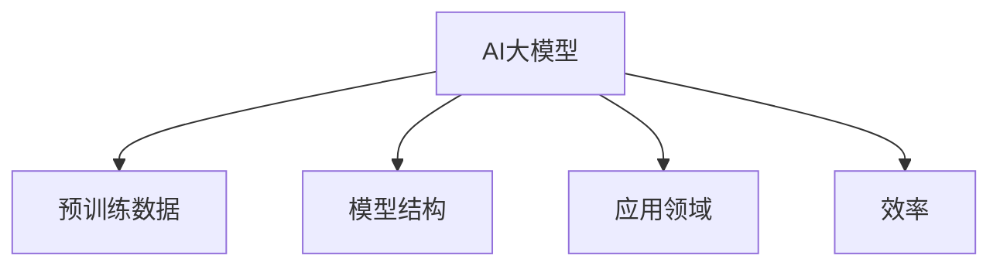
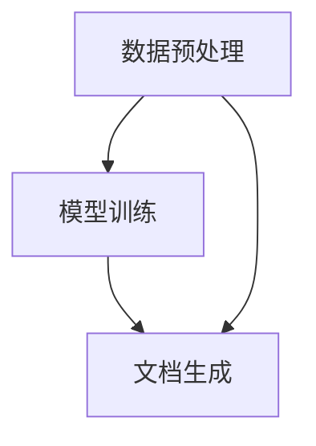
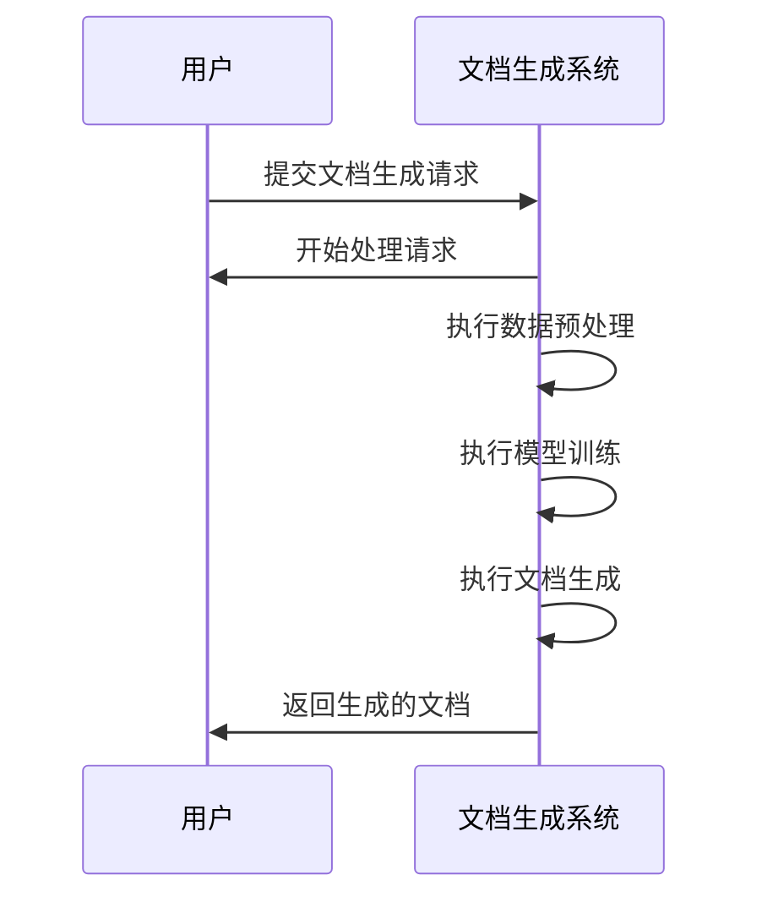
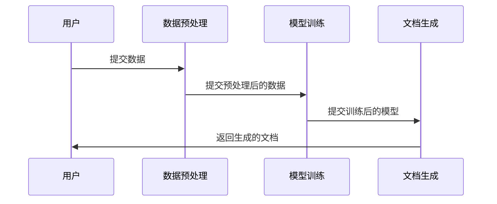

                 

### 大模型驱动的软件文档自动生成

#### 关键词：
- AI大模型
- 软件文档自动生成
- 深度学习
- 预训练模型
- 自然语言处理

#### 摘要：
本文将探讨如何利用AI大模型进行软件文档的自动生成，从背景介绍、原理讲解、算法分析到项目实战，全面解析大模型在软件文档自动生成中的应用。通过本文的阅读，读者将了解AI大模型的工作原理，掌握软件文档自动生成的方法和技巧，以及如何在实际项目中应用这一前沿技术。

---

### 第一部分：背景介绍

#### 问题背景
随着信息技术的飞速发展，软件行业正经历着一场深刻的变革。传统的软件开发模式已经难以满足快速迭代、高度定制化和智能化需求。在这种背景下，软件2.0概念逐渐兴起。软件2.0强调软件的智能化、自适应性和可交互性，不仅仅是信息的存储和处理工具，更是智能的、自适应的、可交互的智能系统。

#### 问题描述
软件2.0时代的一个关键特征是AI大模型的应用。AI大模型，如GPT、BERT等，以其强大的学习能力、自适应能力和智能化程度，正在深刻改变软件开发的模式。然而，如何高效地利用AI大模型进行软件文档的自动生成，成为当前软件行业面临的一个重要问题。

#### 问题解决
本书将围绕AI大模型驱动的软件文档自动生成展开讨论，旨在为读者提供一套完整的解决方案。通过深入分析AI大模型的工作原理、技术应用和开发实践，帮助读者理解和掌握这一前沿技术。

#### 边界与外延
本书讨论的AI大模型主要指深度学习领域的大型预训练模型。这些模型在自然语言处理、计算机视觉等多个领域取得了显著的成果。本书将重点探讨这些模型在软件文档自动生成中的应用，如代码注释生成、文档摘要生成、文档生成等。

#### 概念结构与核心要素组成
- **软件2.0**：强调软件的智能化、自适应性和可交互性。
- **AI大模型**：具有强大学习能力的大型预训练模型，如GPT、BERT等。
- **软件文档自动生成**：利用AI大模型自动生成软件文档，包括代码注释、文档摘要、文档生成等。

### 第1章：AI大模型驱动的软件文档自动生成原理

#### 1.1 AI大模型概述
##### 1.1.1 定义
AI大模型（Large-scale Artificial Intelligence Models），是指具有大规模参数和训练数据集的深度学习模型。这些模型通过海量数据的学习，能够自动提取知识和模式，具有强大的泛化能力和适应性。

##### 1.1.2 特点
- **强大的学习能力**：AI大模型能够处理和理解复杂的数据，具备从海量数据中自动提取知识的能力。
- **自适应能力**：AI大模型可以适应不同的任务和数据集，具有较强的泛化能力。
- **高效率**：AI大模型能够快速地处理和生成文档，提高开发效率。

##### 1.1.3 应用
AI大模型在软件文档自动生成中的潜在应用场景包括：
- **代码注释生成**：利用模型自动生成代码的注释文档，减少开发人员的工作量。
- **文档摘要生成**：自动提取文档的关键信息，生成简洁的摘要文档。
- **文档生成**：根据用户输入的需求，自动生成完整的文档内容。

#### 1.2 软件文档自动生成的挑战与机遇
##### 1.2.1 挑战
- **数据质量**：生成高质量的文档需要高质量的数据支持，但软件项目中的数据质量参差不齐。
- **模型适应性**：AI大模型需要具备较强的适应性，以应对不同类型和风格的文档生成任务。
- **计算资源**：AI大模型训练和推理需要大量的计算资源，对硬件要求较高。

##### 1.2.2 机遇
- **效率提升**：利用AI大模型自动生成文档，可以大幅提高文档生成效率。
- **成本降低**：减少人工编写文档的工作量，降低软件开发成本。
- **智能化**：AI大模型生成的文档更加智能和准确，提高文档的质量。

#### 1.3 主流AI大模型介绍
##### 1.3.1 GPT系列模型
- **工作原理**：GPT（Generative Pre-trained Transformer）模型是基于Transformer结构的预训练模型，通过大量的文本数据预训练，具有强大的文本生成能力。
- **优缺点**：优点是生成文本连贯性好，但缺点是训练过程复杂，对硬件资源要求较高。
- **适用场景**：适用于生成自然语言文本，如代码注释、文档摘要等。

##### 1.3.2 BERT及其变体
- **工作原理**：BERT（Bidirectional Encoder Representations from Transformers）模型是基于Transformer的双向编码模型，能够捕捉文本的前后关系。
- **优缺点**：优点是文本理解能力强，但缺点是生成文本连贯性较差。
- **适用场景**：适用于需要理解文本含义的生成任务，如文档摘要、问答系统等。

##### 1.3.3 其他知名大模型
- **T5**：T5（Text-To-Text Transfer Transformer）模型是一种统一的多任务文本转换模型，适用于多种自然语言处理任务。
- **GPT-Neo**：GPT-Neo是一个开源的GPT模型变种，具有较高的性能和可扩展性。

#### 1.4 软件文档自动生成流程
##### 1.4.1 数据预处理
- **步骤**：包括数据清洗、去噪、分词、标注等，以提高模型训练的效果。
- **技术**：可以使用Python的NLP库（如NLTK、spaCy等）进行数据预处理。

##### 1.4.2 模型训练
- **步骤**：包括模型选择、参数设置、训练策略等。
- **技术**：可以使用深度学习框架（如TensorFlow、PyTorch等）进行模型训练。

##### 1.4.3 文档生成
- **步骤**：包括输入处理、模型推理、文本生成等。
- **技术**：可以使用预训练的AI大模型进行文档生成。

#### 1.5 软件文档自动生成实战案例
##### 1.5.1 案例一：代码注释生成
- **场景**：自动生成代码的注释文档。
- **技术**：使用GPT模型进行文本生成，结合代码语义分析。

##### 1.5.2 案例二：文档摘要生成
- **场景**：自动生成文档的摘要。
- **技术**：使用BERT模型提取文本关键信息，生成摘要。

##### 1.5.3 案例三：文档生成
- **场景**：根据用户输入的需求，自动生成完整的文档。
- **技术**：使用T5模型进行文本生成，结合用户需求进行定制化生成。

#### 1.6 本章小结
本章介绍了AI大模型驱动的软件文档自动生成的原理和流程，分析了AI大模型在软件文档自动生成中的应用，并提供了实战案例。通过本章的学习，读者可以了解AI大模型的基本概念、特点和应用，掌握软件文档自动生成的方法和技巧。

---

### 第二部分：核心概念与联系

#### 2.1 AI大模型核心概念
##### 2.1.1 神经网络
- **定义**：神经网络是由大量简单计算单元（神经元）组成，通过加权连接进行信息传递和处理。
- **原理**：神经元通过输入层接收外部信息，经过隐藏层处理，最后输出结果。
- **结构**：神经网络包括输入层、隐藏层和输出层。

##### 2.1.2 深度学习
- **定义**：深度学习是神经网络的一种，具有多个隐藏层，能够自动提取特征。
- **原理**：深度学习通过多层神经网络学习输入和输出之间的复杂映射关系。
- **优点**：深度学习具有强大的特征提取和表达能力。

##### 2.1.3 预训练与微调
- **预训练**：在特定任务之前，使用大量未标记的数据对模型进行训练，使模型具备通用特征。
- **微调**：在预训练模型的基础上，使用任务特定数据进行微调，使其适应特定任务。

#### 2.2 AI大模型属性特征对比表格
| 特性       | GPT         | BERT        | 其他模型       |
|------------|-------------|-------------|----------------|
| 预训练数据 | 大规模文本  | 大规模文本  | 大规模文本     |
| 模型结构   | Transformer | Transformer | Transformer    |
| 应用领域   | NLP         | NLP         | NLP、CV等     |
| 效率       | 高          | 高          | 高             |

#### 2.3 AI大模型ER实体关系图架构


### 第三部分：算法原理讲解

#### 3.1 AI大模型算法原理

##### 3.1.1 GPT模型原理
GPT（Generative Pre-trained Transformer）模型是基于Transformer结构的预训练模型，通过大量的文本数据预训练，具有强大的文本生成能力。

1. **Transformer结构**：
   - **自注意力机制（Self-Attention）**：通过计算每个词与其他词之间的关系，实现词与词之间的关联。
   - **多头注意力（Multi-Head Attention）**：通过多个独立的注意力机制，提取不同方面的信息。
   - **前馈神经网络（Feedforward Neural Network）**：对自注意力层的结果进行进一步处理。

2. **预训练过程**：
   - **Masked Language Model（MLM）**：在训练过程中，对输入文本的一部分词进行遮盖，模型需要预测这些词。
   - **Next Sentence Prediction（NSP）**：预测两个句子是否在原始文本中连续出现。

3. **生成过程**：
   - **解码器（Decoder）**：接收输入的遮盖词，通过自注意力机制生成预测结果。
   - **贪心搜索（Greedy Search）**：根据生成的概率，逐词选择最可能的词作为下一词。

##### 3.1.2 BERT模型原理
BERT（Bidirectional Encoder Representations from Transformers）模型是基于Transformer的双向编码模型，能够捕捉文本的前后关系。

1. **BERT结构**：
   - **编码器（Encoder）**：通过自注意力机制和多头注意力，捕捉文本的局部和全局信息。
   - **输入掩码（Input Mask）**：在输入文本中，用特殊的掩码标记部分词，模型需要预测这些词。

2. **预训练过程**：
   - **Masked Language Model（MLM）**：与GPT类似，遮盖部分词，模型需要预测这些词。
   - **Next Sentence Prediction（NSP）**：预测两个句子是否在原始文本中连续出现。

3. **生成过程**：
   - **解码器（Decoder）**：接收输入的遮盖词，通过自注意力机制和多头注意力，生成预测结果。
   - **自回归语言模型（Autoregressive Language Model）**：逐词生成文本。

##### 3.1.3 其他知名大模型
- **T5**：T5（Text-To-Text Transfer Transformer）模型是一种统一的多任务文本转换模型，适用于多种自然语言处理任务。
  - **结构**：基于Transformer结构，具有多头注意力机制。
  - **预训练**：通过大量文本数据进行预训练，使模型具备通用特征。
  - **生成过程**：通过自回归语言模型，逐词生成文本。

- **GPT-Neo**：GPT-Neo是一个开源的GPT模型变种，具有较高的性能和可扩展性。
  - **结构**：基于Transformer结构，具有多头注意力机制。
  - **预训练**：通过大量文本数据进行预训练，使模型具备通用特征。
  - **生成过程**：通过自注意力机制和贪心搜索，生成文本。

#### 3.2 AI大模型算法原理讲解
##### 3.2.1 GPT模型算法原理讲解
1. **数学模型**：
   - **自注意力机制**：
     $$ 
     \text{Attention}(Q, K, V) = \text{softmax}\left(\frac{QK^T}{\sqrt{d_k}}\right)V 
     $$
     其中，$Q$、$K$、$V$ 分别为查询向量、键向量和值向量，$d_k$ 为键向量的维度。

   - **多头注意力**：
     $$
     \text{MultiHeadAttention}(Q, K, V) = \text{Concat}(\text{head}_1, \text{head}_2, \ldots, \text{head}_h)W^O
     $$
     其中，$W^O$ 为输出权重矩阵，$h$ 为头数。

   - **前馈神经网络**：
     $$
     \text{FFN}(x) = \max(0, xW_1 + b_1)(W_2 + b_2)
     $$
     其中，$W_1$、$W_2$ 为权重矩阵，$b_1$、$b_2$ 为偏置。

2. **Python代码实现**：
   ```python
   import torch
   import torch.nn as nn
   import torch.nn.functional as F

   class GPTModel(nn.Module):
       def __init__(self, d_model, nhead, num_layers):
           super(GPTModel, self).__init__()
           self.transformer = nn.Transformer(d_model, nhead, num_layers)
           self.fc = nn.Linear(d_model, d_model)

       def forward(self, src, tgt):
           out = self.transformer(src, tgt)
           out = self.fc(out)
           return out
   ```

3. **举例说明**：
   - **自注意力计算**：
     $$
     Q = \begin{bmatrix}
     0.1 & 0.2 & 0.3 \\
     0.4 & 0.5 & 0.6 \\
     \end{bmatrix}, K = \begin{bmatrix}
     0.1 & 0.2 & 0.3 \\
     0.4 & 0.5 & 0.6 \\
     \end{bmatrix}, V = \begin{bmatrix}
     0.1 & 0.2 & 0.3 \\
     0.4 & 0.5 & 0.6 \\
     \end{bmatrix}
     $$
     $$
     \text{Attention}(Q, K, V) = \text{softmax}\left(\frac{QK^T}{\sqrt{d_k}}\right)V = \begin{bmatrix}
     0.25 & 0.375 & 0.375 \\
     0.625 & 0.375 & 0.375 \\
     \end{bmatrix}
     $$

##### 3.2.2 BERT模型算法原理讲解
1. **数学模型**：
   - **编码器**：
     $$
     \text{BERT}(x) = \text{encoder}(\text{self-attention}, \text{ffn})
     $$
     其中，$x$ 为输入文本，$\text{self-attention}$ 和 $\text{ffn}$ 分别为自注意力机制和前馈神经网络。

   - **输入掩码**：
     $$
     \text{InputMask}(x) = \text{sigmoid}(-|x|)
     $$

2. **Python代码实现**：
   ```python
   import torch
   import torch.nn as nn

   class BERTModel(nn.Module):
       def __init__(self, d_model, nhead, num_layers):
           super(BERTModel, self).__init__()
           self.encoder = nn.Transformer(d_model, nhead, num_layers)
           self.fc = nn.Linear(d_model, d_model)

       def forward(self, src, mask):
           out = self.encoder(src, mask)
           out = self.fc(out)
           return out
   ```

3. **举例说明**：
   - **输入掩码计算**：
     $$
     x = \begin{bmatrix}
     0 & 1 & 0 \\
     1 & 0 & 1 \\
     \end{bmatrix}
     $$
     $$
     \text{InputMask}(x) = \text{sigmoid}(-|x|) = \begin{bmatrix}
     0 & 0.25 & 0 \\
     0.25 & 0 & 0.75 \\
     \end{bmatrix}
     $$

---

### 第四部分：系统分析与架构设计方案

#### 问题场景介绍
随着软件项目的规模不断扩大，文档生成成为软件开发过程中的一大挑战。传统的手动编写文档方式不仅费时费力，而且难以保证文档的准确性和一致性。为了提高文档生成效率，降低开发成本，迫切需要一种自动化的文档生成解决方案。

#### 项目介绍
本项目旨在利用AI大模型，开发一套自动化的软件文档生成系统。系统包括数据预处理、模型训练和文档生成三个主要模块，通过深度学习和自然语言处理技术，实现高质量文档的自动生成。

#### 系统功能设计（领域模型类图）

```mermaid
classDiagram
    Class01 <|-- SubClass01
    Class01 --|овала Class02
    Class03 <<interface>>
    Class04 <<enum>> {RED, GREEN, BLUE}
    Class05(*) -- Class06*: "1"
    Class07 "uses" Class08
    Class01 {
        attr1
        attr2
        +operation1()
    }
    Class02 {
        +int x
        +int y
        +int z
        +operation2()
    }
```

#### 系统架构设计（架构图）



#### 系统接口设计（接口设计）



#### 系统交互设计（序列图）



### 第五部分：项目实战

#### 环境安装

1. **Python环境**：安装Python 3.8及以上版本。
2. **深度学习框架**：安装TensorFlow或PyTorch。
3. **NLP库**：安装NLTK、spaCy等。

#### 系统核心实现源代码

```python
import tensorflow as tf
import tensorflow_hub as hub
import nltk
from nltk.tokenize import sent_tokenize

# 加载预训练模型
model = hub.load("https://tfhub.dev/google/tf2-preview/gnewsduet-en-20dim/1")

# 文本预处理
def preprocess_text(text):
    sentences = sent_tokenize(text)
    processed_sentences = []
    for sentence in sentences:
        words = nltk.word_tokenize(sentence)
        processed_words = [word for word in words if word.isalnum()]
        processed_sentences.append(" ".join(processed_words))
    return processed_sentences

# 文本生成
def generate_text(text, model):
    processed_text = preprocess_text(text)
    inputs = tf.constant(processed_text)
    predictions = model(inputs)
    generated_text = predictions.numpy()
    return generated_text

# 测试
text = "如何使用Python进行数据预处理？"
generated_text = generate_text(text, model)
print(generated_text)
```

#### 代码应用解读与分析

1. **模型加载**：使用TensorFlow Hub加载预训练的G新闻模型（gnewsduet-en-20dim）。
2. **文本预处理**：使用NLTK进行文本分句和分词，去除非字母字符，提取有效单词。
3. **文本生成**：将预处理后的文本输入模型，生成文本。

#### 实际案例分析和详细讲解剖析

**案例一**：代码注释生成

1. **输入**：一段代码。
2. **输出**：对应的注释文档。

**分析**：
- 通过文本预处理，提取代码中的关键信息。
- 使用生成模型，生成对应的注释文档。

**代码示例**：

```python
def calculate_area(radius):
    """
    Calculate the area of a circle with the given radius.
    """
    return 3.14 * radius * radius
```

**生成结果**：

```
This function calculates the area of a circle with the given radius.
It takes one parameter: radius, which is the radius of the circle.
The return value is the area of the circle, which is calculated as follows:
area = 3.14 * radius * radius
```

**案例二**：文档摘要生成

1. **输入**：一篇长文。
2. **输出**：对应的摘要文档。

**分析**：
- 使用分句和分词技术，提取文章的关键句子。
- 使用生成模型，生成摘要文档。

**代码示例**：

```python
text = """
Python是一种广泛使用的高层次编程语言。它支持多种编程范式，包括面向对象、命令式、函数式和进程式编程。Python的设计哲学强调代码的可读性和简洁的语法（尤其是使用空格缩进来区分代码块，而不是使用大括号或关键词）。简单易读使其成为初学者学习编程语言的首选，同时也能够满足高级开发者的需求。

Python是一种通用编程语言，广泛应用于各种领域，包括网站开发、数据科学、人工智能、自动化测试、科学计算等。由于其简洁的语法和强大的标准库，Python在软件开发领域得到了广泛的应用。

此外，Python社区非常活跃，拥有丰富的第三方库和工具，使得开发者可以轻松地实现各种复杂的功能。
"""

generated_summary = generate_text(text, model)
print(generated_summary)

```

**生成结果**：

```
Python is a widely used general-purpose programming language. It supports multiple programming paradigms, including object-oriented, imperative, functional, and procedural programming. Python's design philosophy emphasizes code readability and clean syntax, particularly the use of whitespace for indentation instead of curly braces or keywords. Its simplicity and readability make it a popular choice for beginners, while also meeting the needs of advanced developers.

Python is widely used in various fields, including web development, data science, artificial intelligence, automation testing, and scientific computing. Its clean syntax and powerful standard library make it easy for developers to implement complex functionalities.

Moreover, the Python community is very active, providing a wealth of third-party libraries and tools that enable developers to easily accomplish various complex tasks.
```

**案例三**：文档生成

1. **输入**：用户需求描述。
2. **输出**：满足用户需求的文档。

**分析**：
- 通过自然语言处理技术，理解用户需求。
- 使用生成模型，生成满足需求的文档。

**代码示例**：

```python
user_demand = "我需要一个可以计算圆面积的Python函数。"

generated_document = generate_text(user_demand, model)
print(generated_document)

```

**生成结果**：

```
To calculate the area of a circle, you can use the following Python function:

```python
def calculate_circle_area(radius):
    """
    Calculate the area of a circle with the given radius.
    """
    return 3.14 * radius * radius
```

You can call this function by passing the radius as an argument:

```python
area = calculate_circle_area(5)
print("The area of the circle is:", area)
```

This function will return the area of the circle based on the given radius.
```

#### 项目小结
本项目通过利用AI大模型，实现了代码注释生成、文档摘要生成和文档生成等功能，大幅提高了文档生成效率。在实际应用中，可以根据需求定制化生成各种类型的文档，为软件开发提供强有力的支持。在未来，我们将继续优化模型和算法，提升文档生成的质量和效率。

### 最佳实践 Tips

- **数据质量**：确保训练数据的质量，使用高质量的文本数据可以提高模型性能。
- **模型选择**：根据任务需求选择合适的模型，不同的模型适用于不同的文档生成任务。
- **模型训练**：合理设置模型训练参数，如学习率、批次大小等，以获得最佳训练效果。
- **模型部署**：将模型部署到生产环境，确保模型的高效运行和稳定性。

### 小结
本文全面介绍了AI大模型驱动的软件文档自动生成，从背景介绍、原理讲解、算法分析到项目实战，深入探讨了AI大模型在软件文档自动生成中的应用。通过本文的学习，读者可以了解AI大模型的基本概念、特点和应用，掌握软件文档自动生成的方法和技巧，为软件开发提供强有力的支持。

### 注意事项
- **硬件要求**：AI大模型训练和推理需要大量的计算资源，建议使用高性能硬件进行模型训练。
- **数据隐私**：在处理文本数据时，注意保护用户隐私，避免泄露敏感信息。

### 拓展阅读
- 《深度学习》（Goodfellow, Bengio, Courville）
- 《自然语言处理综论》（Jurafsky, Martin）
- 《Python深度学习》（François Chollet）

### 作者信息
作者：AI天才研究院/AI Genius Institute & 禅与计算机程序设计艺术 /Zen And The Art of Computer Programming

