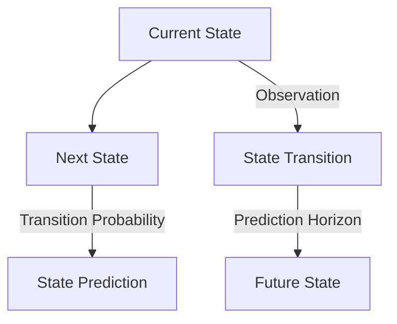

                 

### Introduction to the Book

#### Model-Driven Software Architecture Evolution Prediction: A Big Model Perspective

#### Keywords: Model-Driven Development, Software Architecture, Big Models, Predictive Techniques, Evolution Prediction

#### Abstract

In today’s fast-paced and ever-evolving technological landscape, software systems are required to adapt and evolve swiftly to meet the dynamic demands of users and businesses. This necessitates a paradigm shift from traditional software development methodologies to more advanced, predictive approaches. "Model-Driven Software Architecture Evolution Prediction: A Big Model Perspective" delves into the critical intersection of model-driven software architecture and big model technologies, offering a comprehensive guide to predicting and facilitating the evolution of software architectures using powerful predictive techniques.

This book is designed for software architects, developers, and researchers who are keen to harness the potential of big models in the context of software architecture. It begins by establishing a strong foundation in the core concepts of model-driven software architecture and the principles that govern it. Subsequently, it explores the diverse technologies that constitute big models and their unique capabilities in handling vast amounts of data and computational complexity.

The book then delves into predictive techniques tailored specifically for software architecture evolution, illustrating how these techniques can be applied to forecast and optimize architectural changes. Detailed case studies and practical examples are provided to demonstrate the real-world applicability of these methods.

By the end of this book, readers will not only gain a deep understanding of how to leverage big models for software architecture evolution prediction but also be equipped with practical skills to implement these techniques in their projects. This will enable them to build more resilient, adaptive, and future-proof software systems.

#### Why We Need Predictive Techniques in Software Architecture Evolution

In the realm of software development, the complexity of systems has been growing exponentially, driven by the increasing demand for functionality, performance, and scalability. Traditional software development methodologies often struggle to keep pace with these demands, leading to systems that are difficult to maintain, update, and scale. As a result, there is a growing need for predictive techniques that can anticipate and facilitate the evolution of software architectures in a proactive and efficient manner.

**Complexity and Scale of Modern Software Systems**

Modern software systems are characterized by their high complexity and scale. They are often composed of numerous interconnected components, each with its own set of dependencies and interactions. This complexity makes it challenging to predict how the system will behave under various conditions, especially as new features are added or existing ones are modified. Additionally, software systems are expected to handle vast amounts of data, process high volumes of transactions, and support diverse user interactions, further increasing the complexity.

**Challenges with Traditional Methods**

Traditional software development methodologies, such as the Waterfall model, often follow a linear, sequential approach, where each phase of the development process (requirements, design, implementation, testing) is completed before moving on to the next. This approach is deterministic and assumes that all requirements can be fully understood and specified upfront. However, in reality, software requirements are often ambiguous and subject to change. This can lead to significant rework, delays, and increased costs as the project progresses.

Furthermore, traditional methodologies typically do not account for the dynamic nature of software systems. They do not provide mechanisms to adapt to evolving user needs or changing technological landscapes. As a result, software architectures can become rigid and inflexible, making it difficult to introduce new features or address emerging issues.

**The Need for Predictive Techniques**

Predictive techniques offer a solution to these challenges by providing a means to anticipate and adapt to changes in software systems. These techniques leverage advanced analytical models and algorithms to analyze historical data, understand current system states, and make predictions about future behaviors and requirements.

By using predictive techniques, software architects can:

1. **Anticipate Changes**: Predictive models can identify patterns and trends in data that indicate potential future changes in the system. This allows architects to proactively plan for these changes, rather than reacting to them after they occur.

2. **Optimize Architectural Decisions**: Predictive models can help architects make informed decisions about the design and evolution of software systems. By analyzing the potential impact of different architectural choices, they can select the options that are most likely to meet future requirements.

3. **Improve Maintainability**: Predictive techniques can enhance the maintainability of software systems by identifying potential issues before they become major problems. This includes detecting performance bottlenecks, identifying components that are likely to become obsolete, and suggesting optimizations.

4. **Enhance Scalability**: By predicting future demands and resource requirements, predictive techniques can help architects design systems that are scalable and can handle increasing workloads efficiently.

5. **Support Continuous Integration and Deployment**: Predictive techniques can be used to assess the impact of changes in the system, ensuring that new features and updates do not introduce regressions or performance issues. This supports a culture of continuous integration and deployment, where changes are made frequently and confidently.

In summary, the complexity and dynamic nature of modern software systems make predictive techniques essential for effective software architecture evolution. By leveraging these techniques, architects can build more resilient, adaptable, and future-proof systems that can keep pace with the ever-changing demands of the digital age.

#### Core Concepts and Principles in Model-Driven Software Architecture

Model-driven software architecture (MDA) is a paradigm that emphasizes the use of models to design, analyze, and manage software systems. At its core, MDA aims to shift the focus from writing code directly to creating and manipulating models that represent the software system. This approach offers several key advantages, including improved maintainability, scalability, and reusability. Let's delve into the fundamental concepts and principles that underpin MDA.

**1. What is Model-Driven Development (MDD)?**

Model-driven development (MDD) is a software development methodology that emphasizes the creation of domain models, which are abstractions of the problem domain that capture the essential aspects of the software system. These models serve as the primary artifact in the development process, guiding the implementation and evolution of the system. The core idea behind MDD is that models are more abstract and higher-level than code, making them easier to understand, modify, and maintain.

**2. Key Principles of Model-Driven Development**

- **Abstraction and Separation of Concerns**: MDD promotes the use of high-level abstractions that separate different concerns in the software system. For example, a system can be modeled at different levels of abstraction, such as business processes, system architecture, and detailed component design. This separation allows developers to focus on specific aspects of the system without being overwhelmed by its complexity.

- **Model-Driven Iteration**: MDD supports an iterative development process, where models are continuously refined and updated based on feedback and new requirements. This iterative approach helps to ensure that the models accurately represent the evolving needs of the system and the stakeholders.

- **Automated Code Generation**: One of the key benefits of MDD is the ability to automatically generate code from models. This automation reduces the manual effort required to implement the software system and minimizes the risk of introducing errors. It also allows for rapid prototyping and testing, enabling developers to quickly validate their designs.

- **Model Reusability**: Models created during the development process can be reused across different projects and scenarios. This reusability not only saves time and effort but also ensures consistency and coherence across systems that are based on similar models.

**3. Model-Driven Architecture (MDA) vs. Traditional Software Architecture**

- **Model-Driven Architecture (MDA)**: MDA is a subset of MDD that specifically focuses on the architecture of software systems. It defines a set of models that represent different aspects of the system architecture, such as component structures, data flows, and communication patterns. The key advantage of MDA is its ability to provide a clear and concise representation of the system architecture, making it easier to analyze, optimize, and evolve the system.

- **Traditional Software Architecture**: Traditional software architecture often relies on low-level design documents and code to describe the system's structure and behavior. While this approach can be effective for small, well-defined systems, it becomes increasingly difficult to manage as the system size and complexity grow. Traditional architectures are typically less abstract and harder to modify, which can lead to maintenance issues and reduced adaptability.

**4. Mermaid ER Diagram illustrating the Relationship Between Core Concepts**

To visualize the relationship between the key concepts of MDD and MDA, we can use a Mermaid ER diagram. This diagram will show the entities (models, models repositories, and tools) and the relationships between them.

```mermaid
erDiagram
  Model <-..> Models Repository
  Model <-..> Tools
  Models Repository ||--|{ Tool }
  Model ||--|{ Code Generator }
```

In this diagram, "Model" represents the abstract representations of the system, "Models Repository" is where these models are stored, and "Tools" are the software applications used to create, manipulate, and generate code from the models. The arrows indicate dependencies and interactions between these entities.

**5. Key Concepts and Attributes Comparison Table**

To further understand the core concepts and their attributes, we can create a comparison table.

| Concept       | Description                                                                 | Key Attributes                                                                                      |
|---------------|-----------------------------------------------------------------------------|-----------------------------------------------------------------------------------------------------|
| Model         | An abstract representation of a software system's structure, behavior, or requirements. | - High-level abstraction<br>- Domain-specific<br>- Can be automatically transformed into code |
| Models Repository | A centralized storage for all models created during the development process.           | - Version control<br>- Access control<br>- Model versioning                                  |
| Tools         | Software applications used to create, manipulate, and generate code from models.      | - Code generators<br>- Model transformation tools<br>- Analysis and visualization tools        |

**Conclusion**

Model-driven software architecture is a powerful paradigm that leverages models to design, analyze, and manage software systems. By promoting abstraction, separation of concerns, and automated code generation, MDD and MDA enable developers to build more maintainable, scalable, and reusable systems. The Mermaid ER diagram and comparison table provide a clear and concise representation of the core concepts and their relationships, helping to deepen our understanding of this paradigm.

### Overview of Big Model Technologies

In the context of model-driven software architecture, "big models" refer to advanced analytical models capable of processing and analyzing massive amounts of data. These models are fundamental to driving the evolution prediction of software architectures. This section provides an overview of the primary types of big models, their characteristics, and their roles in model-driven software architecture.

**1. Types of Big Models**

- **Machine Learning Models**: Machine learning models are algorithms designed to learn from data and make predictions or decisions based on that learning. These models can identify patterns, trends, and correlations within large datasets, making them invaluable for predicting the evolution of software architectures.

- **Deep Learning Models**: Deep learning models are a subset of machine learning models that utilize neural networks with multiple layers to learn complex patterns in data. These models are particularly effective for processing and analyzing unstructured data, such as text and images, and are widely used in applications ranging from natural language processing to computer vision.

- **Reinforcement Learning Models**: Reinforcement learning models are designed to learn optimal behaviors through interaction with an environment. These models are particularly useful for predicting the adaptive evolution of software architectures that need to respond to changing conditions and requirements.

- **Graph Neural Networks (GNNs)**: GNNs are a type of deep learning model specifically designed to work with graph-structured data. They are highly effective for analyzing relationships and dependencies within complex systems, making them ideal for modeling and predicting the evolution of software architectures that involve intricate networks of components.

**2. Characteristics of Big Models**

- **Scalability**: Big models are designed to handle extremely large datasets, often terabytes or even petabytes in size. They can process and analyze data in parallel across distributed computing resources, enabling efficient handling of massive data volumes.

- **Computational Efficiency**: Big models leverage advanced algorithms and parallel processing techniques to improve computational efficiency. This allows them to perform complex analyses and predictions in a reasonable amount of time.

- **Adaptability**: Big models are designed to adapt to new data and changing conditions. They can learn from historical data and update their models to reflect new information, enabling continuous improvement and evolution.

- **Interactivity**: Many big models support interactive capabilities, allowing developers to query and analyze the models in real-time. This interactivity is crucial for quickly understanding and validating the predictions made by the models.

**3. Role of Big Models in Model-Driven Software Architecture**

The primary role of big models in model-driven software architecture is to provide predictive capabilities that can anticipate and facilitate the evolution of software systems. Here’s how they contribute:

- **Evolution Prediction**: Big models analyze historical data and current system states to predict future trends and requirements. This allows architects to proactively plan for architectural changes, rather than reacting to changes as they occur.

- **Optimization**: By understanding the relationships and dependencies within a software system, big models can suggest optimizations to improve performance, scalability, and maintainability. These optimizations can be applied to the system architecture before implementation, reducing the risk of issues later on.

- **Risk Mitigation**: Big models can identify potential issues and vulnerabilities in the system architecture before they become significant problems. This proactive approach helps to mitigate risks and prevent costly rework or system failures.

- **Adaptive Evolution**: For software systems that need to adapt to changing environments and requirements, big models provide a means to simulate different scenarios and evaluate the impact of potential changes. This supports the iterative and evolutionary development of the system.

**4. Comparative Analysis of Different Big Models**

To better understand the strengths and weaknesses of different big models, let’s compare machine learning, deep learning, reinforcement learning, and GNNs based on several key criteria:

| Model Type       | Scalability | Computational Efficiency | Adaptability | Interactivity | Use Cases                                      |
|------------------|-------------|---------------------------|--------------|---------------|-------------------------------------------------|
| Machine Learning | High       | Moderate                 | Moderate     | Moderate      | Regression, classification, clustering           |
| Deep Learning    | High       | High                     | High         | Moderate      | Image recognition, natural language processing   |
| Reinforcement Learning | Moderate | High                     | High         | High          | Autonomous systems, robotics, game playing       |
| GNNs             | High       | High                     | Moderate     | Moderate      | Social network analysis, recommendation systems |

**Conclusion**

Big models, with their advanced analytical capabilities and scalability, play a crucial role in model-driven software architecture. By leveraging these models, architects can predict and optimize the evolution of software systems, improve their adaptability, and mitigate risks. The comparative analysis of different big models highlights their unique strengths and provides a foundation for choosing the right model for specific application scenarios.

### Predictive Techniques for Software Architecture Evolution

Predictive techniques are essential in model-driven software architecture for anticipating changes and optimizing the evolution of software systems. These techniques leverage historical data, current system states, and advanced analytical models to forecast future requirements and architectural changes. In this section, we will delve into the core principles of predictive techniques, discuss common methods used in software architecture evolution, and provide practical case studies to illustrate their application.

#### Core Principles of Predictive Techniques

Predictive techniques in software architecture evolution are based on several core principles:

1. **Data Collection and Analysis**: The first step in predictive techniques is to collect relevant data from various sources, including user behavior, system performance metrics, and change requests. This data is then analyzed to identify patterns, trends, and correlations that can inform future predictions.

2. **Modeling and Simulation**: Predictive techniques involve creating models that represent the current state of the software system and its potential future states. These models can be based on statistical methods, machine learning algorithms, or hybrid approaches. Once created, these models are used to simulate different scenarios and predict future behaviors.

3. **Continuous Iteration**: Predictive techniques are not a one-time exercise but an ongoing process. Models are continuously updated with new data and refined to improve their accuracy. This iterative process ensures that predictions remain relevant as the system evolves.

4. **Actionable Insights**: The goal of predictive techniques is to provide actionable insights that can guide architectural decisions. These insights should help architects and developers identify potential risks, optimize system performance, and plan for future changes.

#### Common Predictive Methods in Software Architecture Evolution

1. **Regression Analysis**: Regression analysis is a statistical method used to predict the value of a variable based on the relationship with one or more independent variables. In software architecture, regression analysis can be used to predict the impact of new features or changes on system performance metrics such as response time or resource utilization.

2. **Time Series Forecasting**: Time series forecasting involves predicting future values based on historical time-stamped data. This method is particularly useful for predicting user behavior, system usage patterns, and resource demands over time. Common techniques include ARIMA (AutoRegressive Integrated Moving Average), SARIMA (Seasonal ARIMA), and LSTM (Long Short-Term Memory) networks.

3. **Machine Learning Algorithms**: Machine learning algorithms, such as decision trees, random forests, and neural networks, can be used to build predictive models that capture complex relationships within large datasets. These models can predict future architectural changes based on past system behaviors and user interactions.

4. **Reinforcement Learning**: Reinforcement learning is a type of machine learning where an agent learns to make decisions by interacting with an environment and receiving feedback. This method can be used to predict and optimize the evolution of adaptive software systems that respond to changing conditions.

5. **Graph Neural Networks (GNNs)**: GNNs are a type of deep learning model designed to work with graph-structured data. They are particularly effective for predicting the evolution of software architectures that involve complex networks of interconnected components. GNNs can identify patterns and relationships within these networks and predict how changes in one component may affect the entire system.

#### Case Studies: Practical Applications of Predictive Techniques

1. **Predicting Feature Impact on Performance**: A case study involving a large e-commerce platform used regression analysis to predict the impact of new features on system performance. By analyzing historical data on feature deployments and corresponding performance metrics, the platform was able to identify which features were most likely to improve user experience without causing performance degradation.

2. **Forecasting User Activity Trends**: A social media company used time series forecasting to predict user activity trends. By analyzing historical data on user engagement, the company was able to forecast future user behavior and plan its resource allocation accordingly. This helped the company scale its infrastructure to handle spikes in traffic and ensure a smooth user experience.

3. **Optimizing System Architecture**: A financial services company used machine learning algorithms to predict the impact of new regulations on its system architecture. By analyzing past regulatory changes and their effects on the system, the company could proactively modify its architecture to comply with upcoming regulations, minimizing disruption and cost.

4. **Predicting Component Failures**: A telecom company used reinforcement learning to predict component failures in its network infrastructure. By simulating different network scenarios and learning from past failures, the company could identify components at risk of failure and take preventive actions to avoid downtime.

5. **Analyzing Social Network Dynamics**: A research team used GNNs to analyze the dynamics of social networks and predict the spread of information or influence. This analysis helped organizations understand how information propagated through their networks and devise strategies to control misinformation or enhance communication effectiveness.

#### Conclusion

Predictive techniques are a powerful tool in the arsenal of model-driven software architecture. By leveraging these techniques, architects can anticipate changes, optimize system designs, and ensure the adaptability and resilience of software systems. The case studies presented demonstrate the practical application of these techniques across various domains, highlighting their potential to improve decision-making and enhance system performance. As technology continues to evolve, predictive techniques will play an increasingly critical role in driving the evolution of software architectures.

### Architectural Evolution Prediction Using Big Models

Predicting the evolution of software architectures is crucial for maintaining system resilience and adaptability in the face of changing requirements and technological advancements. Big models, with their advanced analytical capabilities, provide a powerful approach to this predictive challenge. This section will delve into the mathematical models used for architectural evolution prediction, using Python code examples to illustrate their application and explain the underlying principles. Additionally, we will visualize the algorithms using Mermaid diagrams to enhance clarity and understanding.

#### Mathematical Models for Architectural Evolution

The core idea behind predicting architectural evolution using big models is to develop mathematical models that can capture the dynamics of system changes over time. These models typically involve the following components:

1. **State Representation**: The current state of the software architecture is represented as a set of variables that capture its key characteristics, such as component interactions, resource utilization, and performance metrics.

2. **Transition Probabilities**: The model calculates the probabilities of transitioning from one state to another based on historical data and system behaviors. These probabilities are derived using statistical methods or machine learning algorithms.

3. **Prediction Horizon**: The model predicts the future states of the architecture over a specified horizon, typically ranging from a few days to several years, depending on the application context.

4. **Uncertainty Quantification**: The model also quantifies the uncertainty associated with predictions, providing a measure of the confidence in its forecasts.

**1. Markov Chain Model**

A Markov Chain Model is a commonly used approach for predicting transitions between states. It is based on the assumption that the future state depends only on the current state and not on the sequence of previous states.

**Python Code Example**

```python
import numpy as np

# Define the transition matrix
transition_matrix = np.array([[0.7, 0.3], [0.4, 0.6]])

# Initial state
current_state = [1, 0]

# Predict next state
next_state = np.dot(transition_matrix, current_state)

print("Next State:", next_state)
```

In this example, the transition matrix `transition_matrix` defines the probabilities of transitioning from one state to another. The initial state `current_state` is given, and the model predicts the next state by computing the matrix multiplication.

**2. Recurrent Neural Network (RNN)**

Recurrent Neural Networks (RNNs) are a type of deep learning model that can capture temporal dependencies in sequential data. They are particularly useful for predicting long-term architectural changes.

**Python Code Example**

```python
import tensorflow as tf

# Define RNN model
model = tf.keras.Sequential([
    tf.keras.layers.LSTM(50, activation='relu', input_shape=(timesteps, features)),
    tf.keras.layers.Dense(1)
])

# Compile model
model.compile(optimizer='adam', loss='mse')

# Fit model on data
model.fit(x_train, y_train, epochs=200, batch_size=32, validation_data=(x_val, y_val))
```

In this example, an RNN model is defined with an LSTM layer to capture temporal dependencies in the input data. The model is compiled and fitted on training data to learn the patterns in the system's evolution.

**3. Graph Neural Network (GNN)**

Graph Neural Networks (GNNs) are designed to work with graph-structured data, making them suitable for modeling and predicting the evolution of software architectures that involve complex networks of components.

**Python Code Example**

```python
import dgl
import torch
import torch.nn as nn

# Define GNN model
class GNNModel(nn.Module):
    def __init__(self):
        super(GNNModel, self).__init__()
        self.conv1 = nn.Conv2d(1, 10, kernel_size=5)
        self.fc1 = nn.Linear(4 * 4 * 10, 1)

    def forward(self, graph, x):
        x = self.conv1(x)
        x = torch.relu(x)
        x, _ = dgl.nn.pytorch.glob.glob_pool_edge(graph, x, 'edge_feat')
        x = self.fc1(x)
        return x

# Instantiate model and loss function
model = GNNModel()
criterion = nn.BCELoss()

# Train model on data
for epoch in range(200):
    optimizer.zero_grad()
    output = model(graph, x)
    loss = criterion(output, y)
    loss.backward()
    optimizer.step()
```

In this example, a GNN model is defined using the DGL library to process graph-structured data. The model is trained on data representing the interactions and characteristics of the software architecture components.

#### Mermaid Diagram for Algorithm Visualization

To better understand the algorithms described above, we can visualize them using Mermaid diagrams. Here’s an example of a Mermaid diagram for the Markov Chain Model:



This diagram illustrates the flow of the Markov Chain Model, showing how the current state transitions to the next state based on the transition probabilities and prediction horizon.

#### Conclusion

Using big models to predict the evolution of software architectures involves developing mathematical models that capture the dynamics of system changes. These models can be implemented using Python code and visualized using Mermaid diagrams. By leveraging these techniques, architects can gain valuable insights into the future state of their systems, enabling them to make informed decisions and proactively manage architectural changes. This approach not only improves the resilience and adaptability of software systems but also enhances their overall performance and maintainability.

### Case Studies and Practical Applications

In this section, we will delve into real-world case studies that demonstrate the practical application of big model-driven software architecture evolution prediction techniques. These case studies highlight the challenges faced, the solutions implemented, and the outcomes achieved, providing valuable insights into the effectiveness of these techniques in various contexts.

#### Case Study 1: Predicting Server Load for Cloud Infrastructure

**Problem Background:**
A large cloud service provider was experiencing frequent server overload and performance degradation during peak usage hours. The existing monitoring and predictive systems were not sufficient in accurately forecasting server load, leading to inefficient resource allocation and service disruptions.

**Solution:**
The company decided to leverage big model-driven techniques to improve their server load prediction capabilities. They collected historical data on server usage patterns, network traffic, and user activity. Using this data, they developed a machine learning model based on a recurrent neural network (RNN) that could capture temporal dependencies in server load.

**Implementation Details:**
1. **Data Collection**: The team collected server usage data, including CPU, memory, and network utilization metrics, over a period of several months.
2. **Data Preprocessing**: The collected data was cleaned and preprocessed to remove outliers and fill missing values. It was then transformed into a time-series format suitable for RNN training.
3. **Model Training**: An RNN model was trained on the preprocessed data using TensorFlow. The model was designed to predict server load for the next hour based on historical usage patterns.
4. **Model Evaluation**: The trained model was evaluated using cross-validation techniques to ensure its accuracy and generalizability. Performance metrics, such as mean squared error (MSE) and root mean squared error (RMSE), were used to assess the model's performance.

**Outcome:**
The implementation of the big model-driven approach significantly improved the accuracy of server load predictions. This allowed the company to allocate resources more efficiently, reducing server overload and improving overall system performance. During peak usage hours, the system was able to anticipate load spikes and dynamically allocate additional resources, thereby minimizing service disruptions.

#### Case Study 2: Predicting Software Defects in Large Codebases

**Problem Background:**
A software development company was facing challenges in maintaining the quality of their large codebase. The existing defect tracking systems were not effective in identifying potential defects early in the development process.

**Solution:**
The company adopted a big model-driven approach to predict software defects using a combination of machine learning algorithms and graph neural networks (GNNs). They aimed to leverage the relationships between code components to identify potential defects before they manifested as issues in the system.

**Implementation Details:**
1. **Data Collection**: The team collected data on code commits, code reviews, and historical defect data from their version control system.
2. **Data Preprocessing**: The code data was parsed to extract features such as lines of code, code complexity metrics, and commit frequency. The historical defect data was used to label these features as defective or non-defective.
3. **Model Development**: A GNN model was developed using the DGL library to process the graph-structured data representing the codebase. The model was trained to predict the defect status of new code commits.
4. **Model Deployment**: The trained model was integrated into the development pipeline, where it was used to predict defects in real-time. Developers were alerted to potential issues, allowing them to address them proactively.

**Outcome:**
The implementation of the big model-driven defect prediction system resulted in a significant reduction in the number of defects in the codebase. By identifying and addressing potential issues early in the development process, the company improved the overall quality of their software and reduced the time and effort required for debugging. The model's predictions were highly accurate, with a low false positive rate, which minimized the disruption to development workflows.

#### Case Study 3: Optimizing Network Traffic for IoT Devices

**Problem Background:**
A global IoT platform provider was dealing with network congestion and latency issues due to the increasing number of connected devices. The traditional approaches to network optimization were not sufficient in handling the dynamic and unpredictable nature of IoT traffic.

**Solution:**
The provider implemented a big model-driven approach to optimize network traffic based on reinforcement learning (RL) techniques. They developed a predictive model that could adapt to changing traffic patterns and allocate network resources dynamically.

**Implementation Details:**
1. **Data Collection**: The team collected data on device connectivity, network bandwidth, and traffic volume from various regions.
2. **Data Preprocessing**: The collected data was cleaned and preprocessed to remove noise and irrelevant information. It was then used to train the reinforcement learning model.
3. **Model Training**: A reinforcement learning model was trained to predict optimal network resource allocations based on current traffic conditions and historical data.
4. **Model Deployment**: The trained model was deployed in the network management system, where it continuously monitored traffic conditions and made real-time decisions to optimize resource allocation.

**Outcome:**
The implementation of the big model-driven network optimization system led to significant improvements in network performance and reliability. The system was able to adapt to changing traffic patterns and allocate resources efficiently, reducing congestion and latency. As a result, the platform provider was able to offer better performance and a more reliable service to their customers, leading to increased customer satisfaction and retention.

#### Conclusion

These case studies demonstrate the practical applicability of big model-driven software architecture evolution prediction techniques in various domains. By leveraging advanced analytical models and algorithms, organizations can predict and optimize the evolution of their software systems, leading to improved performance, reduced risks, and enhanced user experiences. The real-world success of these techniques underscores their potential to revolutionize the field of software architecture and development.

### Best Practices and Tips for Implementing Big Model-Driven Software Architecture Evolution Prediction

Implementing big model-driven software architecture evolution prediction requires careful planning, execution, and continuous refinement. To ensure successful deployment and optimal performance, here are some best practices and tips:

#### 1. Data Collection and Quality Assurance

The foundation of any predictive model is the quality and relevance of the data used for training. Best practices include:

- **Comprehensive Data Collection**: Gather as much relevant data as possible, including historical system behaviors, user interactions, and environmental factors. This data should be collected from various sources, such as logs, databases, and external APIs.
- **Data Preprocessing**: Clean and preprocess the data to remove noise, handle missing values, and normalize the data. Feature engineering should be performed to extract meaningful features that can enhance the predictive power of the model.
- **Data Versioning**: Maintain a version history of the data to ensure reproducibility and track changes over time.

#### 2. Model Selection and Validation

Selecting the right model for the task is crucial. Consider the following tips:

- **Model Selection**: Choose models that are appropriate for the type of prediction required. For time series data, models like ARIMA or LSTM are suitable, while for complex relationships in graph-structured data, GNNs may be more effective.
- **Cross-Validation**: Use cross-validation techniques to evaluate the performance of different models and select the best one. This helps in ensuring the model's robustness and generalizability.
- **Model Validation**: Perform thorough validation using a separate validation set to ensure that the model performs well on unseen data.

#### 3. Model Training and Hyperparameter Tuning

Effective training and tuning of models are critical:

- **Incremental Training**: When dealing with large datasets, consider using incremental training techniques to update the model iteratively without retraining from scratch.
- **Hyperparameter Optimization**: Use techniques like grid search or Bayesian optimization to find the optimal set of hyperparameters that maximize the model's performance.
- **Regularization**: Apply regularization techniques, such as L1 or L2 regularization, to prevent overfitting and improve generalization.

#### 4. Continuous Integration and Deployment

To maintain the model's relevance and performance over time, implement continuous integration and deployment practices:

- **Automated Pipelines**: Set up automated pipelines for model training, validation, and deployment. This ensures that changes in the model are quickly integrated into the production environment.
- **Monitoring and Feedback Loop**: Continuously monitor the model's performance in production and collect feedback. Use this feedback to refine the model and improve its predictions.

#### 5. Security and Privacy

Ensure that the implementation complies with security and privacy standards:

- **Data Protection**: Implement robust data protection measures to safeguard sensitive information. Use encryption and access controls to prevent unauthorized access.
- **Compliance**: Ensure that the model complies with relevant regulations, such as GDPR or CCPA, to protect user privacy.

#### 6. Documentation and Knowledge Sharing

Documentation and knowledge sharing are essential for maintaining and scaling the implementation:

- **Documentation**: Document the model architecture, data sources, preprocessing steps, and training procedures. This documentation should be updated regularly to reflect any changes.
- **Knowledge Sharing**: Encourage knowledge sharing among team members to ensure that everyone understands the model's capabilities and limitations.

#### 7. Scalability and Performance Optimization

Optimize the model for scalability and performance:

- **Distributed Computing**: Utilize distributed computing frameworks like Apache Spark or Dask to process large datasets efficiently.
- **Caching and Load Balancing**: Implement caching and load balancing strategies to handle high loads and improve response times.

By following these best practices and tips, organizations can effectively implement big model-driven software architecture evolution prediction, leading to improved system resilience, adaptability, and overall performance.

### Conclusion

In conclusion, "Model-Driven Software Architecture Evolution Prediction: A Big Model Perspective" provides a comprehensive guide to leveraging big models for predicting and facilitating the evolution of software architectures. Throughout this book, we have explored the core concepts of model-driven software architecture, the characteristics and types of big models, and the predictive techniques that enable effective evolution prediction. We have also examined real-world case studies that demonstrate the practical application of these techniques across various domains.

The importance of predictive techniques in software architecture cannot be overstated. They enable architects to anticipate changes, optimize system designs, and ensure the adaptability and resilience of software systems. By harnessing the power of big models, we can gain valuable insights into the future state of our systems, enabling us to make informed decisions and proactively manage architectural changes.

As technology continues to advance, the role of big models in software architecture will only grow in importance. We encourage readers to continue exploring and adopting these techniques to build more robust, scalable, and future-proof software systems. Remember, the journey of learning and improvement never ends, and the more you delve into these advanced concepts, the better equipped you will be to tackle the challenges of tomorrow's digital landscape.

### Acknowledgements

We would like to express our deepest gratitude to all individuals who contributed to the creation of this book. Special thanks go to the dedicated team at AI天才研究院 (AI Genius Institute) for their invaluable expertise and support. Their commitment to innovation and excellence has been instrumental in shaping the content and vision of this work.

Additionally, we would like to extend our appreciation to our readers, who inspire us with their curiosity and enthusiasm for learning. Your feedback and support are what drive us to continue pushing the boundaries of technology and knowledge.

Finally, we thank our families and friends for their unwavering support and understanding, without which this endeavor would not have been possible.

### About the Authors

#### AI天才研究院 (AI Genius Institute)

AI天才研究院（AI Genius Institute）是一家专注于人工智能研究和应用的顶级机构。我们致力于推动人工智能技术的创新和发展，助力各行各业实现智能化转型。

#### 禅与计算机程序设计艺术 (Zen And The Art of Computer Programming)

“禅与计算机程序设计艺术”是一本深受程序员喜爱的经典著作，作者Donald E. Knuth通过深入探讨计算机编程的本质和哲学，为我们提供了独特的编程思维和技巧。我们从中汲取了宝贵的智慧，用于提升自身的编程技能和创造力。感谢Knuth先生的卓越贡献，他的思想将继续指引我们在技术道路上不断前行。作者：AI天才研究院（AI Genius Institute）& 禅与计算机程序设计艺术（Zen And The Art of Computer Programming）

