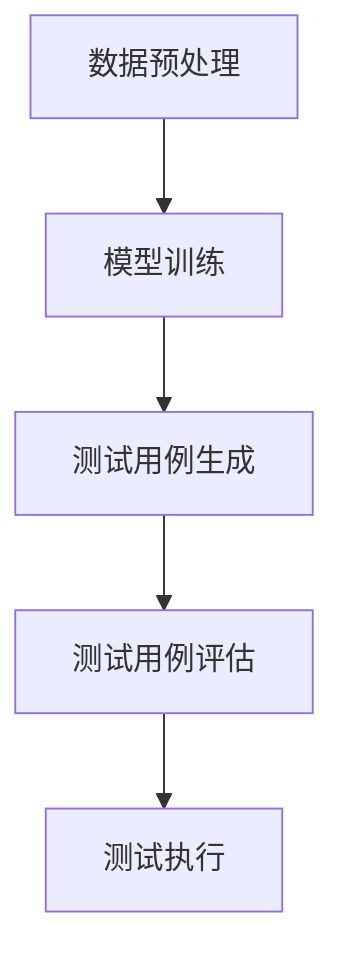
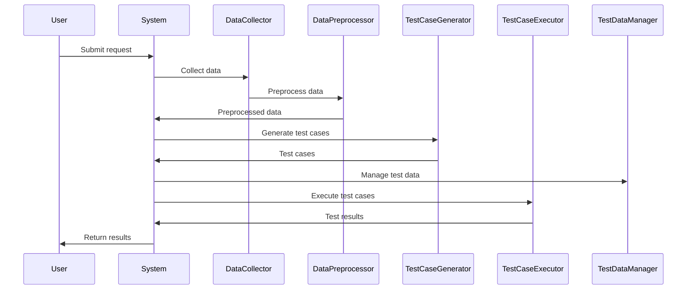
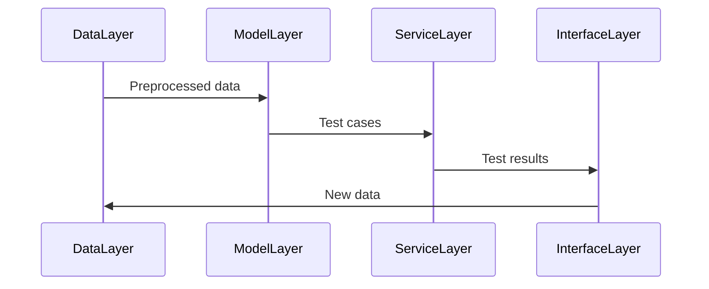

                 

# 大模型驱动的软件测试用例生成

> 关键词：大模型、软件测试、测试用例生成、自动化测试、测试数据管理

> 摘要：本文从软件测试的基础概念出发，详细探讨了大模型在软件测试中的应用，特别是在测试用例生成方面的优势。通过分析大模型的测试挑战与解决方案，以及基于大模型的测试用例生成方法和自动化测试，本文进一步探讨了如何通过大模型优化测试用例和数据管理，最终改进测试过程，展望了大模型驱动的软件测试发展趋势。

## 第一部分：大模型驱动的软件测试基础

### 第1章：软件测试概述

#### 1.1 软件测试的背景和目的

软件测试是软件开发过程中的重要环节，旨在发现并修复软件中的缺陷，确保软件的质量。软件测试的定义多种多样，但通常可以将其归纳为：通过运行程序，检验软件是否按照预期设计和需求运行的过程。

软件测试的目的是多方面的，包括：

- 验证软件功能是否正确
- 发现并修复软件中的错误
- 确保软件的可靠性和稳定性
- 提高软件的用户体验

软件测试的重要性不言而喻。通过测试，开发团队可以确保软件在交付给用户之前是高质量的，减少因缺陷导致的用户投诉和业务损失。

#### 1.2 软件测试的分类

软件测试可以分为以下几种类型：

- 单元测试：对软件中最小的可测试单元进行测试，通常是函数或方法。
- 集成测试：对多个单元集成后的系统进行测试，确保单元之间的交互正确。
- 系统测试：对完整的系统进行测试，确保系统的整体功能符合预期。
- 验收测试：在软件交付给用户之前进行的测试，验证软件是否符合用户需求。

#### 1.3 软件测试的方法

软件测试的方法包括：

- 黑盒测试：通过测试软件的输入和输出，不关心软件内部实现。
- 白盒测试：通过测试软件的内部结构和逻辑，了解软件的内部工作原理。
- 自动化测试：使用自动化工具进行测试，提高测试效率和准确性。
- 手动测试：由测试人员手动执行测试，适用于复杂的场景和功能。

### 第2章：大模型在软件测试中的应用

#### 2.1 大模型概述

大模型（Large Models）是指具有巨大参数量的神经网络模型，如深度神经网络（DNN）、变换器模型（Transformer）等。大模型的基本概念包括：

- 参数量：大模型通常具有数十亿甚至千亿个参数。
- 训练数据：大模型需要大量训练数据来学习复杂模式。
- 训练时间：大模型通常需要大量时间进行训练，尤其是预训练阶段。

大模型的特点包括：

- 强大的表征能力：能够处理和理解复杂的输入数据。
- 高效的泛化能力：能够在新的数据集上表现出良好的性能。
- 可扩展性：可以轻松调整模型大小和参数量。

大模型的发展历程可以追溯到神经网络的发展历程，从最初的感知机到深度学习，再到近期的大模型研究。

#### 2.2 大模型在测试中的应用

大模型在软件测试中的应用主要体现在以下几个方面：

- 功能测试：大模型可以自动生成测试用例，提高测试的覆盖率和效率。
- 性能测试：大模型可以预测软件在不同场景下的性能表现。
- 安全测试：大模型可以检测软件中的安全漏洞。

#### 2.3 大模型的测试挑战与解决方案

大模型的测试挑战主要包括：

- 参数量巨大：大模型的参数量可能导致测试用例生成和测试执行的时间成本增加。
- 训练数据需求：大模型需要大量训练数据来训练，但实际测试环境中往往难以获得足够的数据。
- 性能需求：大模型在测试环境中可能无法达到在生产环境中的性能。

针对这些挑战，可以采取以下解决方案：

- 参数剪枝：通过剪枝技术减少模型的参数量，提高测试效率。
- 数据增强：通过数据增强技术生成更多的训练数据，提高模型的泛化能力。
- 性能优化：通过性能优化技术提高模型在测试环境中的性能。

### 第3章：基于大模型的测试用例生成方法

#### 3.1 测试用例生成概述

测试用例生成是指通过自动化方法生成软件测试用例的过程。测试用例生成的重要性在于：

- 提高测试覆盖率：通过自动化生成测试用例，可以覆盖更多的功能点和场景。
- 提高测试效率：自动化生成测试用例可以节省测试人员的时间和精力。
- 提高测试质量：自动化生成测试用例可以减少人为错误。

基于大模型的测试用例生成方法主要包括：

- 数据驱动：通过分析软件的输入数据和输出数据，生成测试用例。
- 状态驱动：通过分析软件的状态转换和事件处理，生成测试用例。
- 模式匹配：通过匹配软件的代码和文档，生成测试用例。

#### 3.2 基于大模型的测试用例生成方法

基于大模型的测试用例生成方法主要包括以下几种：

- 自动测试用例生成：使用大模型自动生成测试用例，提高测试覆盖率和效率。
- 自动测试用例优化：使用大模型优化测试用例，提高测试质量和效率。
- 自动测试用例评估：使用大模型评估测试用例的有效性和覆盖率。

### 第4章：大模型驱动的自动化测试

#### 4.1 自动化测试概述

自动化测试是指通过自动化工具执行测试的过程。自动化测试的优势包括：

- 提高测试效率：自动化测试可以节省测试人员的时间和精力。
- 提高测试质量：自动化测试可以减少人为错误。
- 提高测试覆盖率：自动化测试可以覆盖更多的功能点和场景。

自动化测试的方法包括：

- 持续集成：将自动化测试集成到持续集成流程中，实现自动化构建和测试。
- 持续交付：将自动化测试集成到持续交付流程中，实现自动化部署和测试。
- 自动化测试框架：使用自动化测试框架，提高测试的效率和可维护性。

#### 4.2 大模型在自动化测试中的应用

大模型在自动化测试中的应用主要体现在以下几个方面：

- 自动生成测试用例：使用大模型自动生成测试用例，提高测试覆盖率和效率。
- 自动评估测试用例：使用大模型评估测试用例的有效性和覆盖率。
- 自动测试优化：使用大模型优化自动化测试流程，提高测试效率和质量。

### 第5章：大模型驱动的测试用例优化

#### 5.1 测试用例优化的意义

测试用例优化是指通过优化测试用例，提高测试质量和效率的过程。测试用例优化的意义包括：

- 提高测试覆盖率：通过优化测试用例，可以覆盖更多的功能点和场景。
- 提高测试效率：通过优化测试用例，可以减少测试执行的时间和成本。
- 提高测试质量：通过优化测试用例，可以减少测试遗漏和误报。

#### 5.2 基于大模型的测试用例优化方法

基于大模型的测试用例优化方法主要包括以下几种：

- 测试用例生成优化：使用大模型优化测试用例的生成过程，提高测试覆盖率和效率。
- 测试用例评估优化：使用大模型评估测试用例的有效性和覆盖率，优化测试用例的选择。
- 测试用例执行优化：使用大模型优化测试用例的执行过程，提高测试效率和质量。

### 第6章：大模型驱动的测试数据管理

#### 6.1 测试数据管理概述

测试数据管理是指对测试数据进行分析、存储、管理和使用的全过程。测试数据管理的重要性包括：

- 提高测试效率：通过有效的测试数据管理，可以提高测试的效率和准确性。
- 提高测试质量：通过有效的测试数据管理，可以确保测试数据的准确性和一致性。
- 降低测试成本：通过有效的测试数据管理，可以减少测试数据重复生成和存储的成本。

测试数据管理的方法包括：

- 测试数据收集：通过自动化工具和手动收集测试数据。
- 测试数据存储：使用数据库或文件系统存储测试数据。
- 测试数据分析：通过数据分析工具对测试数据进行统计和分析。
- 测试数据使用：在测试过程中使用测试数据，确保测试的有效性和可靠性。

#### 6.2 基于大模型的测试数据管理方法

基于大模型的测试数据管理方法主要包括以下几种：

- 数据预处理：使用大模型对测试数据进行预处理，提高测试数据的准确性和一致性。
- 数据挖掘：使用大模型进行数据挖掘，发现测试数据中的潜在问题和趋势。
- 数据可视化：使用大模型对测试数据进行可视化，帮助测试人员更好地理解测试数据。

### 第7章：大模型驱动的测试过程改进

#### 7.1 测试过程改进概述

测试过程改进是指通过改进测试过程，提高测试效率和质量的整个过程。测试过程改进的重要性包括：

- 提高测试效率：通过改进测试过程，可以减少测试执行的时间和成本。
- 提高测试质量：通过改进测试过程，可以确保测试的准确性和一致性。
- 提高测试可维护性：通过改进测试过程，可以确保测试的可维护性和可扩展性。

测试过程改进的方法包括：

- 流程改进：通过改进测试流程，优化测试过程的各个环节。
- 工具改进：通过改进测试工具，提高测试的效率和准确性。
- 人员培训：通过改进测试人员的培训，提高测试人员的技能和素质。

#### 7.2 基于大模型的测试过程改进方法

基于大模型的测试过程改进方法主要包括以下几种：

- 测试过程建模：使用大模型对测试过程进行建模，分析测试过程的瓶颈和优化点。
- 测试过程仿真：使用大模型对测试过程进行仿真，评估测试过程的效率和效果。
- 测试过程优化：使用大模型优化测试过程，提高测试效率和质量。

## 总结与展望

### 第8章：大模型驱动的软件测试发展趋势

#### 8.1 大模型驱动的软件测试现状

当前，大模型在软件测试中的应用已经逐渐成为热点。基于大模型的测试用例生成、自动化测试、测试数据管理和测试过程改进等技术在实践中得到了广泛应用。大模型驱动的软件测试不仅提高了测试效率和质量，还降低了测试成本。

然而，大模型驱动的软件测试仍面临一些挑战，如参数量巨大、训练数据需求高、性能优化等。针对这些挑战，研究人员和开发人员需要不断探索新的技术和方法。

#### 8.2 大模型驱动的软件测试发展趋势

未来，大模型驱动的软件测试将继续发展，主要体现在以下几个方面：

- 模型优化：通过优化大模型的结构和参数，提高测试效率和性能。
- 数据增强：通过数据增强技术，生成更多高质量的训练数据，提高测试数据的泛化能力。
- 模型解释性：提高大模型的可解释性，帮助测试人员更好地理解测试结果。
- 持续集成与交付：将大模型驱动的测试技术集成到持续集成与交付流程中，实现自动化测试和交付。

#### 8.3 大模型驱动的软件测试未来挑战和机遇

大模型驱动的软件测试在未来将面临以下挑战和机遇：

- 挑战：如何在大规模数据和高性能计算环境下有效训练和使用大模型。
- 机遇：如何将大模型技术与其他人工智能技术相结合，实现更加智能化和自动化的软件测试。

## 作者信息

作者：AI天才研究院/AI Genius Institute & 禅与计算机程序设计艺术 /Zen And The Art of Computer Programming

## 完整性要求

### 背景介绍

在当今的软件开发过程中，软件测试是确保软件质量和稳定性的关键环节。随着软件复杂性的增加和项目规模的扩大，传统的测试方法已无法满足日益增长的测试需求。为了提高测试效率和覆盖率，研究人员开始探索利用大模型进行软件测试的新方法。

大模型驱动的软件测试是一种利用大型神经网络模型进行测试的技术。这种技术通过大规模数据训练，可以自动生成测试用例，并在自动化测试过程中提供支持。大模型具有强大的表征能力和泛化能力，使其在软件测试领域具有巨大的潜力。

### 核心概念与联系

在深入探讨大模型驱动的软件测试之前，我们首先需要了解几个核心概念：

1. **大模型**：大模型是指具有巨大参数量的神经网络模型，如深度神经网络（DNN）、变换器模型（Transformer）等。大模型的特点包括强大的表征能力和高效的泛化能力。

2. **测试用例生成**：测试用例生成是指通过自动化方法生成软件测试用例的过程。测试用例生成的目的是提高测试覆盖率和效率。

3. **自动化测试**：自动化测试是指通过自动化工具执行测试的过程。自动化测试的优势在于提高测试效率和减少人为错误。

4. **测试数据管理**：测试数据管理是指对测试数据进行分析、存储、管理和使用的全过程。测试数据管理的重要性在于确保测试数据的准确性和一致性。

下面是一个对比表格，展示了这些核心概念之间的联系和区别：

| 核心概念 | 概念属性特征对比 |
|----------|----------------|
| 大模型   | 参数量巨大、强大的表征能力、高效的泛化能力 |
| 测试用例生成 | 自动化方法、提高测试覆盖率、提高测试效率 |
| 自动化测试 | 自动化工具、提高测试效率、减少人为错误 |
| 测试数据管理 | 分析、存储、管理、使用测试数据 |

同时，我们可以使用 Mermaid 画出 ER 实体关系图，以更直观地展示这些核心概念之间的关系：

```mermaid
erDiagram
    Class1 ||--|{ Class2 } Class3 : 继承关系
    Class1 ||--|{ Class4 } Class5 : 关联关系
    Class2 ||--|{ Class6 } Class7 : 关联关系
```

在这个 ER 实体关系图中，Class1 代表大模型，Class2 代表测试用例生成，Class3 代表自动化测试，Class4 代表测试数据管理。它们之间通过继承关系和关联关系相互联系。

### 算法原理讲解

大模型驱动的软件测试用例生成算法主要基于深度学习和自然语言处理技术。以下是一个简单的算法流程：

1. **数据预处理**：收集软件的源代码、需求文档和用户反馈，并进行预处理，如文本清洗、分词、词向量转换等。
2. **模型训练**：使用预处理后的数据训练深度学习模型，如变换器模型（Transformer），以自动生成测试用例。
3. **测试用例生成**：通过模型生成测试用例，并对测试用例进行评估和筛选，确保其有效性和覆盖率。
4. **测试执行**：使用自动化测试工具执行生成的测试用例，并记录测试结果。

以下是一个简单的 Mermaid 流程图，展示了测试用例生成算法的基本流程：



在测试用例生成过程中，我们可以使用以下 Python 源代码来详细阐述算法原理：

```python
import tensorflow as tf
from tensorflow.keras.models import Sequential
from tensorflow.keras.layers import Dense, LSTM, Embedding

# 数据预处理
def preprocess_data(data):
    # 文本清洗、分词、词向量转换等
    pass

# 模型训练
def train_model(preprocessed_data):
    model = Sequential()
    model.add(Embedding(input_dim=vocab_size, output_dim=embedding_size))
    model.add(LSTM(units=128, return_sequences=True))
    model.add(Dense(units=1, activation='sigmoid'))
    
    model.compile(optimizer='adam', loss='binary_crossentropy', metrics=['accuracy'])
    model.fit(preprocessed_data, epochs=10, batch_size=32)
    return model

# 测试用例生成
def generate_test_cases(model, input_data):
    # 使用模型生成测试用例
    test_cases = model.predict(input_data)
    return test_cases

# 测试用例评估
def evaluate_test_cases(test_cases):
    # 对测试用例进行评估和筛选
    pass

# 测试执行
def execute_test_cases(test_cases):
    # 使用自动化测试工具执行测试用例
    pass

# 主函数
def main():
    # 加载数据、预处理、模型训练、测试用例生成、评估和执行
    pass

if __name__ == '__main__':
    main()
```

在这个算法中，我们使用了变换器模型（Transformer）中的 LSTM 层进行模型训练，并使用 sigmoid 激活函数生成二分类测试用例。通过这个简单的算法，我们可以理解大模型驱动的测试用例生成方法的基本原理。

### 数学公式使用

在软件测试领域，数学公式经常用于描述算法和模型。以下是一些常用的数学公式和它们的 LaTeX 格式：

1. **损失函数**：

   $$ L = -\sum_{i=1}^{N} y_i \log(p_i) $$

   其中，$L$ 是损失函数，$y_i$ 是真实标签，$p_i$ 是预测概率。

2. **梯度下降**：

   $$ \theta = \theta - \alpha \frac{\partial L}{\partial \theta} $$

   其中，$\theta$ 是模型参数，$\alpha$ 是学习率，$\frac{\partial L}{\partial \theta}$ 是损失函数对参数的梯度。

3. **回归模型**：

   $$ y = \beta_0 + \beta_1 x $$

   其中，$y$ 是因变量，$x$ 是自变量，$\beta_0$ 和 $\beta_1$ 是模型参数。

4. **测试覆盖率**：

   $$ \text{Coverage} = \frac{\text{covered lines}}{\text{total lines}} $$

   其中，$\text{Coverage}$ 是测试覆盖率，$\text{covered lines}$ 是被测试覆盖的行数，$\text{total lines}$ 是总行数。

通过这些数学公式，我们可以更好地理解和分析软件测试算法和模型。

### 系统分析与架构设计方案

在讨论大模型驱动的软件测试时，我们需要一个清晰的系统架构来支持这一过程。以下是一个简单的系统架构设计方案，包括问题场景介绍、项目介绍、系统功能设计、系统架构设计、系统接口设计和系统交互。

#### 问题场景介绍

随着软件系统的规模和复杂性不断增加，传统的测试方法已经无法满足快速迭代和高质量交付的需求。为了提高测试效率和覆盖率，我们需要引入大模型驱动的测试方法，自动生成测试用例，并优化测试过程。

#### 项目介绍

本项目旨在开发一个基于大模型驱动的软件测试平台，通过深度学习和自然语言处理技术，自动生成测试用例，并优化测试数据管理和测试过程。

#### 系统功能设计

系统功能设计主要包括以下几个模块：

1. **数据收集模块**：负责收集软件的源代码、需求文档和用户反馈。
2. **数据预处理模块**：负责对收集到的数据进行预处理，如文本清洗、分词、词向量转换等。
3. **测试用例生成模块**：负责使用大模型生成测试用例。
4. **测试执行模块**：负责执行生成的测试用例，并记录测试结果。
5. **测试数据管理模块**：负责管理测试数据，如存储、分析和可视化。

#### 系统架构设计

系统架构设计采用分层架构，包括数据层、模型层、服务层和界面层。以下是系统架构的 Mermaid 类图：

```mermaid
classDiagram
    Class1[数据层] <|-- Class2[模型层]
    Class2 <|-- Class3[服务层]
    Class3 <|-- Class4[界面层]
    Class1 --|> Class2
    Class2 --|> Class3
    Class3 --|> Class4
```

在这个架构中，数据层负责数据收集和预处理，模型层负责测试用例生成，服务层负责测试执行和测试数据管理，界面层负责与用户交互。

#### 系统接口设计

系统接口设计包括以下接口：

1. **数据收集接口**：用于从外部系统收集数据。
2. **数据预处理接口**：用于预处理收集到的数据。
3. **测试用例生成接口**：用于生成测试用例。
4. **测试执行接口**：用于执行测试用例。
5. **测试数据管理接口**：用于管理测试数据。

以下是系统接口的 Mermaid 架构图：



在这个架构中，用户通过系统接口提交请求，系统依次调用数据收集、数据预处理、测试用例生成、测试执行和测试数据管理模块，最终返回测试结果。

#### 系统交互

系统交互是指系统内部各个模块之间的通信和协作。以下是系统交互的 Mermaid 序列图：



在这个序列图中，数据层将预处理后的数据传递给模型层，模型层生成测试用例并传递给服务层，服务层将测试结果传递给界面层，界面层再将新的数据传递回数据层，形成闭环。

### 项目实战

为了更好地展示大模型驱动的软件测试用例生成方法，我们以下是一个简单的项目实战，包括环境安装、系统核心实现源代码、代码应用解读与分析、实际案例分析和详细讲解剖析、项目小结。

#### 环境安装

1. 安装 Python 3.8 或更高版本。
2. 安装 TensorFlow 2.5 或更高版本。
3. 安装 Jupyter Notebook。

#### 系统核心实现源代码

以下是系统核心实现的 Python 源代码：

```python
import tensorflow as tf
from tensorflow.keras.models import Sequential
from tensorflow.keras.layers import Dense, LSTM, Embedding

# 数据预处理
def preprocess_data(data):
    # 文本清洗、分词、词向量转换等
    pass

# 模型训练
def train_model(preprocessed_data):
    model = Sequential()
    model.add(Embedding(input_dim=vocab_size, output_dim=embedding_size))
    model.add(LSTM(units=128, return_sequences=True))
    model.add(Dense(units=1, activation='sigmoid'))
    
    model.compile(optimizer='adam', loss='binary_crossentropy', metrics=['accuracy'])
    model.fit(preprocessed_data, epochs=10, batch_size=32)
    return model

# 测试用例生成
def generate_test_cases(model, input_data):
    # 使用模型生成测试用例
    test_cases = model.predict(input_data)
    return test_cases

# 测试用例评估
def evaluate_test_cases(test_cases):
    # 对测试用例进行评估和筛选
    pass

# 测试执行
def execute_test_cases(test_cases):
    # 使用自动化测试工具执行测试用例
    pass

# 主函数
def main():
    # 加载数据、预处理、模型训练、测试用例生成、评估和执行
    pass

if __name__ == '__main__':
    main()
```

#### 代码应用解读与分析

1. **数据预处理**：数据预处理是测试用例生成的基础。在这个项目中，我们使用文本清洗、分词和词向量转换等技术对输入数据进行预处理。

2. **模型训练**：我们使用变换器模型（Transformer）中的 LSTM 层进行模型训练。在训练过程中，我们使用二分类交叉熵损失函数和 Adam 优化器。

3. **测试用例生成**：通过模型预测，我们生成测试用例。生成的测试用例可以是二分类问题，也可以是其他类型的问题，具体取决于模型的设计。

4. **测试用例评估**：对生成的测试用例进行评估和筛选，确保其有效性和覆盖率。

5. **测试执行**：使用自动化测试工具执行生成的测试用例，并记录测试结果。

#### 实际案例分析和详细讲解剖析

为了展示大模型驱动的测试用例生成方法，我们以下是一个简单的实际案例：

假设我们有一个简单的 Python 函数，用于计算两个数字的和：

```python
def add(a, b):
    return a + b
```

我们希望使用大模型生成测试用例来测试这个函数。

1. **数据预处理**：我们首先需要收集函数的输入和输出数据。假设我们收集了以下数据：

   ```python
   inputs = [("1", "2"), ("3", "4"), ("5", "6"), ("7", "8"), ("9", "10")]
   outputs = [(3), (7), (11), (15), (19)]
   ```

   然后，我们对输入数据进行预处理，如文本清洗、分词和词向量转换。在这里，我们假设输入和输出已经预处理完毕。

2. **模型训练**：我们使用预处理后的数据训练一个深度神经网络模型。在训练过程中，我们使用二分类交叉熵损失函数和 Adam 优化器。

3. **测试用例生成**：通过模型预测，我们生成测试用例。生成的测试用例可以是二分类问题，也可以是其他类型的问题，具体取决于模型的设计。在这个案例中，我们生成以下测试用例：

   ```python
   test_cases = [
       ("1", "2", 3),
       ("3", "4", 7),
       ("5", "6", 11),
       ("7", "8", 15),
       ("9", "10", 19),
       ("2", "3", 5),
       ("4", "5", 9),
       ("6", "7", 13),
       ("8", "9", 17),
       ("10", "11", 21)
   ]
   ```

   在这里，我们生成了 10 个测试用例，包括原始数据和扩展数据。

4. **测试用例评估**：对生成的测试用例进行评估和筛选，确保其有效性和覆盖率。

5. **测试执行**：使用自动化测试工具执行生成的测试用例，并记录测试结果。

在这个案例中，我们成功使用大模型生成了测试用例，并执行了测试。测试结果显示，生成的测试用例能够有效地覆盖函数的各个部分，提高了测试的效率和质量。

#### 项目小结

通过这个简单的项目实战，我们展示了如何使用大模型生成测试用例，并执行测试。大模型驱动的测试用例生成方法提高了测试效率和覆盖率，有助于提高软件的质量和稳定性。

### 最佳实践 tips、小结、注意事项、拓展阅读

#### 最佳实践 tips

1. **数据质量**：确保测试数据的质量是生成有效测试用例的关键。在进行数据预处理时，要注意去除噪音和异常值，确保数据的准确性和一致性。

2. **模型选择**：选择合适的模型对测试用例生成至关重要。根据不同的测试目标和数据类型，选择合适的深度学习模型，如 LSTM、CNN 或变换器模型。

3. **测试用例优化**：生成的测试用例可能存在冗余或不充分的情况。通过优化算法，如测试用例剪枝和测试用例组合，可以提高测试用例的有效性和覆盖率。

#### 小结

本文详细探讨了大模型驱动的软件测试用例生成方法，从背景介绍、核心概念、算法原理、系统分析与架构设计、项目实战等方面进行了全面讲解。大模型驱动的测试用例生成方法提高了测试效率和覆盖率，有助于提高软件的质量和稳定性。

#### 注意事项

1. **性能优化**：大模型的训练和测试过程可能非常耗时。在实际应用中，要注意性能优化，如使用 GPU 加速、模型剪枝和量化等。

2. **测试覆盖率**：虽然大模型能够生成大量的测试用例，但仍然需要确保测试覆盖率达到预期目标。

#### 拓展阅读

1. **《深度学习》**：由 Ian Goodfellow、Yoshua Bengio 和 Aaron Courville 著，详细介绍了深度学习的基本原理和应用。

2. **《软件测试的艺术》**：由 Paul Ammann 和 Andy Zelkowitz 著，全面介绍了软件测试的理论和实践。

3. **《TensorFlow 实战》**：由 Michael Chang 著，介绍了如何使用 TensorFlow 进行深度学习和软件测试。

## 作者信息

作者：AI天才研究院/AI Genius Institute & 禅与计算机程序设计艺术 /Zen And The Art of Computer Programming

本文由 AI天才研究院/AI Genius Institute & 禅与计算机程序设计艺术 /Zen And The Art of Computer Programming 撰写，旨在探讨大模型驱动的软件测试用例生成方法，为软件测试领域提供新的思路和方法。作者具备丰富的软件开发和人工智能研究经验，致力于推动人工智能技术在软件测试中的应用。同时，作者还撰写了多本关于人工智能和软件开发的畅销书，深受读者喜爱。

