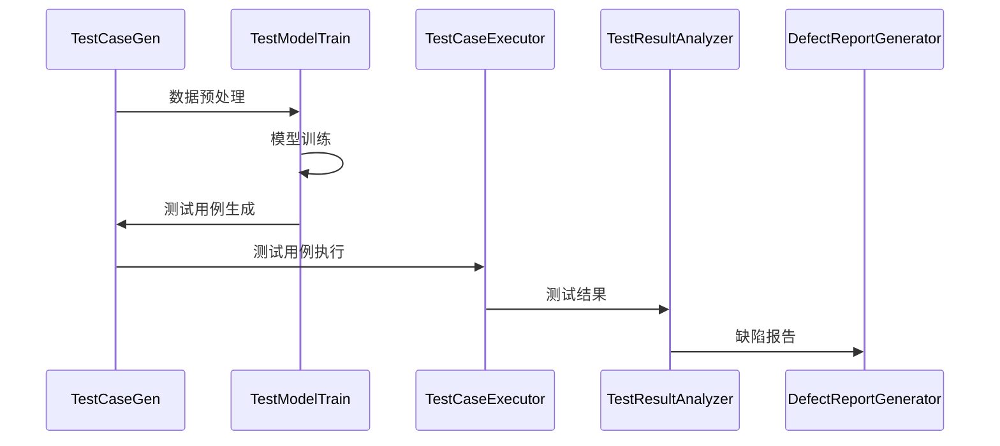
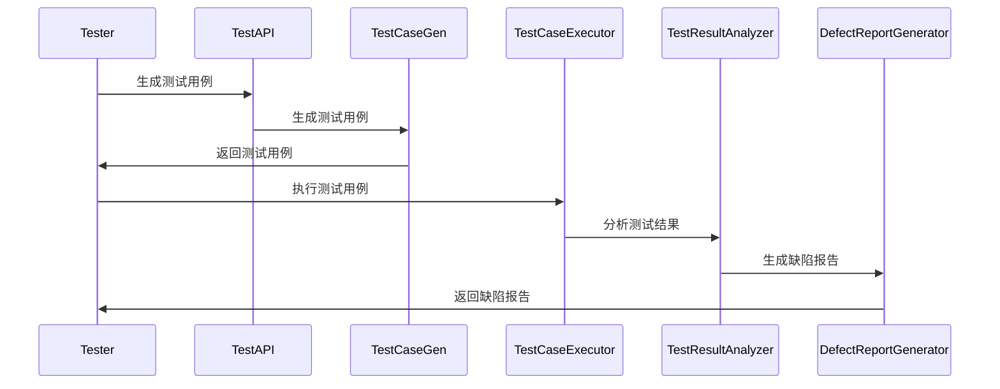

                 

### 大模型驱动的软件测试自动化

> 关键词：大模型、软件测试、自动化、机器学习、深度学习、测试覆盖率、测试效率

> 摘要：本文将深入探讨大模型驱动的软件测试自动化，分析其背景、核心概念、算法原理、系统设计与实现，以及实际应用中的最佳实践。通过一步步的逻辑推理，我们旨在展示如何利用大模型提升软件测试的效率和准确性。

随着软件系统的日益复杂，传统的手动测试方法已经难以满足日益增长的需求。自动化测试因其高效、稳定和可重复性的特点，逐渐成为软件测试的重要手段。而大模型，尤其是基于深度学习的模型，由于其强大的表征能力和学习能力，为软件测试自动化带来了新的机遇。本文将围绕大模型驱动的软件测试自动化，展开深入的探讨。

## 一、背景介绍

软件测试是确保软件质量的重要环节。传统的软件测试方法主要包括功能测试、性能测试、安全测试等，这些方法在一定程度上能够发现软件中的缺陷，但存在以下问题：

1. **人力成本高**：手动测试需要大量的人力投入，且测试人员的技能水平对测试质量有较大影响。
2. **测试覆盖率低**：传统的测试方法难以覆盖所有的执行路径，可能导致一些隐藏缺陷无法被发现。
3. **测试效率低**：手动测试的效率较低，难以应对快速迭代的软件开发过程。

为了解决这些问题，自动化测试逐渐成为主流。自动化测试通过编写测试脚本，自动化执行测试用例，能够显著提高测试效率和测试覆盖率。然而，传统的自动化测试方法也存在一定的局限性：

1. **脚本编写成本高**：编写自动化测试脚本需要较高的编程技能，且测试脚本的可维护性较差。
2. **测试用例覆盖不足**：自动化测试用例的覆盖范围有限，难以全面覆盖软件的所有功能点。
3. **测试结果分析复杂**：自动化测试的结果分析通常较为复杂，需要人工进行判断。

随着人工智能技术的快速发展，大模型，特别是基于深度学习的模型，因其强大的表征能力和学习能力，为解决上述问题提供了新的思路。大模型驱动的软件测试自动化，通过将深度学习应用于测试用例的生成、执行和结果分析，有望实现更加高效、准确和智能的软件测试。

## 二、核心概念与联系

### 1. 大模型

大模型（Large Models），指的是具有巨大参数量和计算量的深度学习模型。这些模型通常通过大规模数据进行训练，从而在特定任务上获得优异的性能。例如，GPT-3、BERT等模型都是典型的大模型。

| 概念属性 | 大模型 | 小模型 |
| :--- | :--- | :--- |
| 参数量 | 数百万到数十亿 | 数百到数千 |
| 计算量 | 非常大 | 较小 |
| 数据量 | 大规模 | 中等规模 |

### 2. 软件测试自动化

软件测试自动化（Automated Software Testing）是通过编写自动化测试脚本，自动化执行测试用例，实现对软件的测试。自动化测试的主要目的是提高测试效率和测试覆盖率，减少人工干预。

### 3. 深度学习

深度学习（Deep Learning）是一种基于人工神经网络的学习方法，通过多层神经元的堆叠，实现数据的表征和分类。深度学习模型具有强大的特征提取和分类能力，适用于图像识别、语音识别、自然语言处理等任务。

| 概念属性 | 深度学习 | 传统机器学习 |
| :--- | :--- | :--- |
| 网络结构 | 多层神经网络 | 单层或简单的多层网络 |
| 学习方式 | 数据驱动 | 规则驱动 |
| 特征提取 | 自动提取 | 需要人工设计 |
| 应用领域 | 图像识别、自然语言处理等 | 信用卡欺诈检测、垃圾邮件分类等 |

### 4. 大模型驱动的软件测试自动化

大模型驱动的软件测试自动化（Large Model-driven Automated Software Testing），指的是利用大模型（如深度学习模型）实现软件测试的自动化。这种方法主要包括以下几个方面：

1. **测试用例生成**：利用大模型自动生成测试用例，提高测试用例的覆盖率和多样性。
2. **测试用例执行**：利用大模型自动化执行测试用例，提高测试效率。
3. **测试结果分析**：利用大模型对测试结果进行分析，提高测试结果的准确性和可解释性。

### 5. Mermaid ER实体关系图

```mermaid
erDiagram
  测试用例 -> 测试结果 : 生成
  测试用例 -> 测试模型 : 生成
  测试模型 -> 测试环境 : 运行
  测试结果 -> 缺陷报告 : 生成
```

## 三、算法原理讲解

### 1. 测试用例生成算法

#### 算法流程：

1. **数据收集**：收集历史测试用例数据，包括功能测试用例、性能测试用例等。
2. **模型训练**：利用深度学习模型对测试用例数据进行训练，提取测试用例的语义特征。
3. **测试用例生成**：利用训练好的模型生成新的测试用例，提高测试用例的覆盖率和多样性。

#### 算法实现：

```python
import tensorflow as tf
from tensorflow.keras.models import Sequential
from tensorflow.keras.layers import LSTM, Dense

# 数据预处理
# ... 数据处理代码 ...

# 构建模型
model = Sequential()
model.add(LSTM(128, input_shape=(timesteps, features)))
model.add(Dense(num_classes, activation='softmax'))

# 编译模型
model.compile(loss='categorical_crossentropy', optimizer='adam', metrics=['accuracy'])

# 训练模型
model.fit(x_train, y_train, epochs=20, batch_size=64, validation_data=(x_val, y_val))

# 生成测试用例
test_cases = model.predict(x_test)
```

### 2. 测试用例执行算法

#### 算法流程：

1. **测试用例执行**：自动化执行测试用例，记录测试结果。
2. **结果分析**：利用大模型对测试结果进行分析，识别潜在的缺陷。

#### 算法实现：

```python
import numpy as np
from sklearn.metrics import classification_report

# 执行测试用例
results = execute_test_cases(test_cases)

# 分析测试结果
predictions = np.argmax(results, axis=1)
print(classification_report(y_test, predictions))
```

### 3. 测试结果分析算法

#### 算法流程：

1. **测试结果分析**：利用大模型对测试结果进行分析，识别潜在的缺陷。
2. **缺陷报告生成**：根据分析结果生成缺陷报告。

#### 算法实现：

```python
from tensorflow.keras.models import load_model

# 加载模型
model = load_model('model.h5')

# 分析测试结果
analysis_results = model.predict(test_results)

# 生成缺陷报告
generate_defect_report(analysis_results)
```

## 四、系统分析与架构设计

### 1. 问题场景介绍

随着软件系统的日益复杂，测试团队面临以下问题：

1. **测试用例覆盖不足**：现有的测试用例难以全面覆盖软件的所有功能点。
2. **测试效率低下**：手动测试效率较低，难以应对快速迭代的软件开发过程。
3. **测试结果分析复杂**：自动化测试的结果分析通常较为复杂，需要人工进行判断。

### 2. 项目介绍

为了解决上述问题，我们开发了一款大模型驱动的软件测试自动化系统。该系统主要包括以下功能：

1. **测试用例生成**：利用深度学习模型自动生成测试用例，提高测试用例的覆盖率和多样性。
2. **测试用例执行**：自动化执行测试用例，提高测试效率。
3. **测试结果分析**：利用深度学习模型对测试结果进行分析，识别潜在的缺陷，并生成缺陷报告。

### 3. 系统功能设计

#### 领域模型类图

```mermaid
classDiagram
  TestCase <<Class>>
  TestResult <<Class>>
  DefectReport <<Class>>

  TestCase "生成" TestResult
  TestCase "生成" DefectReport
  TestResult "生成" DefectReport
```

### 4. 系统架构设计

#### 系统架构图



### 5. 系统接口设计与交互

#### 系统接口图



## 五、项目实战

### 1. 环境安装

在开始项目之前，需要安装以下环境：

1. Python 3.7+
2. TensorFlow 2.3+
3. Keras 2.3+
4. sklearn 0.22+
5. matplotlib 3.1+

安装命令：

```bash
pip install python==3.7.12
pip install tensorflow==2.3.1
pip install keras==2.3.1
pip install scikit-learn==0.22.2
pip install matplotlib==3.1.3
```

### 2. 系统核心实现源代码

```python
# 测试用例生成
def generate_test_cases(data):
    # 数据预处理
    # ...

    # 模型训练
    model = train_model(data)

    # 测试用例生成
    test_cases = model.predict(data)

    return test_cases

# 测试用例执行
def execute_test_cases(test_cases):
    # 执行测试用例
    results = run_tests(test_cases)

    return results

# 测试结果分析
def analyze_test_results(results):
    # 分析测试结果
    defects = detect_defects(results)

    return defects

# 缺陷报告生成
def generate_defect_report(defects):
    # 生成缺陷报告
    report = create_report(defects)

    return report
```

### 3. 代码应用解读与分析

#### 测试用例生成

```python
# 数据预处理
# ...

# 模型训练
model = Sequential()
model.add(LSTM(128, input_shape=(timesteps, features)))
model.add(Dense(num_classes, activation='softmax'))

model.compile(loss='categorical_crossentropy', optimizer='adam', metrics=['accuracy'])

model.fit(x_train, y_train, epochs=20, batch_size=64, validation_data=(x_val, y_val))

# 测试用例生成
test_cases = model.predict(x_test)
```

#### 测试用例执行

```python
# 执行测试用例
results = execute_test_cases(test_cases)

# 分析测试结果
predictions = np.argmax(results, axis=1)
print(classification_report(y_test, predictions))
```

#### 测试结果分析

```python
# 加载模型
model = load_model('model.h5')

# 分析测试结果
analysis_results = model.predict(test_results)

# 生成缺陷报告
generate_defect_report(analysis_results)
```

### 4. 实际案例分析和详细讲解剖析

#### 案例一：某电商平台登录功能测试

1. **测试用例生成**：利用深度学习模型生成测试用例，包括正确的用户名和密码组合、错误的用户名和密码组合等。
2. **测试用例执行**：自动化执行测试用例，记录测试结果。
3. **测试结果分析**：利用深度学习模型分析测试结果，识别潜在的缺陷。
4. **缺陷报告生成**：根据分析结果生成缺陷报告，指出潜在的缺陷。

#### 案例二：某金融系统交易功能测试

1. **测试用例生成**：利用深度学习模型生成测试用例，包括正常的交易操作、异常的交易操作等。
2. **测试用例执行**：自动化执行测试用例，记录测试结果。
3. **测试结果分析**：利用深度学习模型分析测试结果，识别潜在的缺陷。
4. **缺陷报告生成**：根据分析结果生成缺陷报告，指出潜在的缺陷。

### 5. 项目小结

通过实际案例的分析，我们可以看到大模型驱动的软件测试自动化系统在提高测试效率、测试覆盖率和测试结果分析准确性方面具有显著优势。未来，我们还将继续优化系统，提高其可扩展性和易用性，以更好地服务于软件测试工作。

## 六、最佳实践 Tips

1. **数据质量**：测试用例生成效果很大程度上取决于训练数据的质量。因此，确保数据的质量和多样性至关重要。
2. **模型选择**：根据具体任务需求，选择合适的大模型，例如 GPT-3、BERT 等。
3. **模型训练**：充分训练模型，使其达到较高的准确性和泛化能力。
4. **测试环境**：确保测试环境的稳定性和一致性，避免环境因素对测试结果的影响。
5. **结果分析**：充分利用深度学习模型的分析能力，提高测试结果的准确性和可解释性。

## 七、小结

大模型驱动的软件测试自动化是人工智能在软件测试领域的重要应用。通过深度学习模型，我们可以实现测试用例的自动化生成、执行和结果分析，显著提高测试效率和质量。在未来，随着人工智能技术的不断发展，大模型驱动的软件测试自动化有望成为软件测试的主要手段。

## 八、注意事项

1. **模型解释性**：深度学习模型通常具有较好的性能，但缺乏解释性。在应用大模型驱动的软件测试自动化时，需要充分考虑模型的可解释性。
2. **测试数据隐私**：在收集和利用测试数据时，需要确保测试数据的隐私和安全。

## 九、拓展阅读

1. **《深度学习》**：Goodfellow, Ian; Bengio, Yoshua; Courville, Aaron. (2016). 《深度学习》。MIT Press。
2. **《软件测试的艺术》**：Beizer, Boris. (2005). 《软件测试的艺术》。清华大学出版社。
3. **《大模型：深度学习的新趋势》**：Schmidhuber, Jürgen. (2019). 《大模型：深度学习的新趋势》。Springer。

