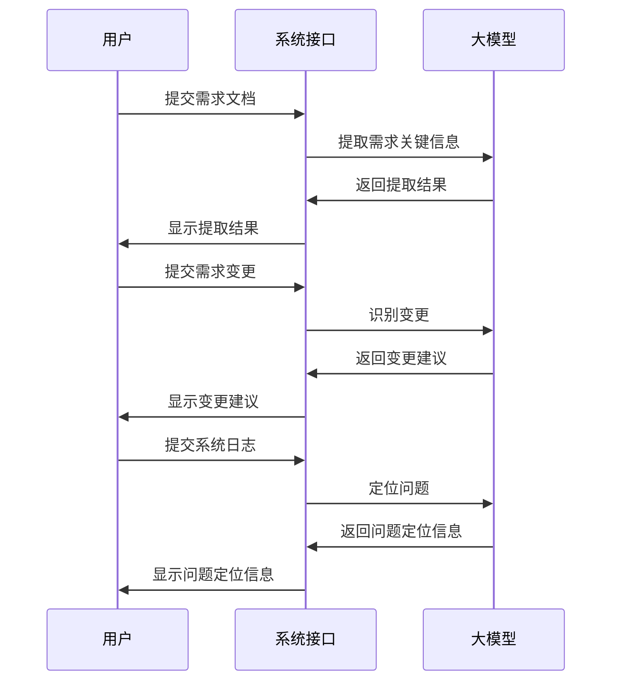

                 


### 大模型驱动的需求跟踪自动化

关键词：大模型、需求跟踪、自动化、机器学习、人工智能

摘要：本文将探讨大模型驱动的需求跟踪自动化技术，分析其原理、应用场景、实现方法以及实践案例。通过详细阐述大模型在需求跟踪中的优势与挑战，本文旨在为软件开发团队提供实用的技术指导和最佳实践。

----------------------------------------------------------------

## 引言

### 1.1 背景介绍

在软件开发过程中，需求跟踪是确保项目成功的关键环节。然而，传统的需求跟踪方法往往依赖于人工，耗时耗力，且容易出错。随着人工智能技术的飞速发展，特别是大模型技术的成熟，需求跟踪自动化成为可能。

### 1.2 问题描述

当前的需求跟踪主要面临以下问题：

- **信息量大**：需求文档、用户反馈、系统日志等信息繁多，难以高效处理。
- **人工成本高**：依赖人工进行需求分析、变更管理和问题追踪，效率低下。
- **错误率较高**：人工操作容易导致数据遗漏或错误，影响项目进度和质量。

### 1.3 目标与内容框架

本文旨在通过大模型技术实现需求跟踪自动化，提高软件开发效率。文章将分为以下四个部分：

1. **核心概念与联系**：介绍需求跟踪、大模型技术及其关系。
2. **大模型技术基础**：讲解大模型原理、应用场景和未来展望。
3. **需求跟踪自动化实践**：阐述自动化框架、实现方法和实际案例。
4. **最佳实践与总结**：提供最佳实践技巧、注意事项和拓展阅读。

### 1.4 边界与外延

本文主要关注大模型在需求跟踪领域的应用，不包括其他软件开发流程中的自动化技术。同时，本文旨在提供技术指导和实践方法，不涉及具体项目管理策略。

----------------------------------------------------------------

## 核心概念与联系

### 2.1 需求跟踪概述

需求跟踪是指在整个软件开发生命周期中，对需求进行收集、分析、管理、验证和追踪的过程。其目的是确保软件项目满足用户需求，提高项目质量和效率。

### 2.2 大模型技术

大模型技术是指使用大规模神经网络进行学习和预测的技术。它通过大量的数据训练，能够自动学习复杂的关系和模式，从而提高任务完成的准确性和效率。

### 2.3 概念属性特征对比

| 概念       | 特征                                       |
| ---------- | ------------------------------------------ |
| 需求跟踪   | 信息量大、人工成本高、错误率高                 |
| 大模型     | 大规模数据训练、自动学习、高效预测             |
| 自动化     | 提高效率、降低成本、减少错误                   |

### 2.4 ER实体关系图架构

```mermaid
erDiagram
    customer ||--|{ order }||>
    order ||--|{ product }||>
    product ||--|{ supplier }||>
    supplier ||--|{ employee }||>
    employee ||--|{ department }||>
    department ||--|{ project }||>
```

----------------------------------------------------------------

## 大模型技术基础

### 3.1 算法原理讲解

大模型技术主要基于深度学习算法，特别是基于Transformer架构的模型。其核心思想是通过多层神经网络对输入数据进行编码和解码，从而实现对复杂关系的建模。

### 3.2 数学模型和数学公式

深度学习模型通常基于以下数学公式：

$$
y = \sigma(W \cdot x + b)
$$

其中，\(y\) 是预测结果，\(x\) 是输入特征，\(W\) 是权重矩阵，\(b\) 是偏置项，\(\sigma\) 是激活函数。

### 3.3 Python源代码示例

以下是一个简单的Python代码示例，展示如何使用TensorFlow实现一个基于Transformer架构的大模型：

```python
import tensorflow as tf

# 定义模型
model = tf.keras.Sequential([
    tf.keras.layers.Dense(128, activation='relu', input_shape=(784,)),
    tf.keras.layers.Dense(10)
])

# 编译模型
model.compile(optimizer='adam',
              loss=tf.losses.SparseCategoricalCrossentropy(from_logits=True),
              metrics=['accuracy'])

# 训练模型
model.fit(x_train, y_train, epochs=5)
```

----------------------------------------------------------------

## 大模型应用场景

### 4.1 需求跟踪中的大模型应用

大模型技术在需求跟踪中的应用主要包括：

- **需求分析**：通过自然语言处理技术，自动提取需求文档中的关键信息。
- **变更管理**：自动识别需求变更，并提供变更建议。
- **问题追踪**：自动分析系统日志，快速定位问题。

### 4.2 大模型的优势与挑战

#### 优势：

- **高效性**：大模型能够快速处理大量数据，提高工作效率。
- **准确性**：大模型通过学习大量数据，能够提高预测准确性。

#### 挑战：

- **计算资源**：大模型训练需要大量计算资源，成本较高。
- **数据质量**：数据质量对大模型性能有重要影响，需要确保数据质量。

### 4.3 应用案例介绍

#### 案例一：需求分析

某公司使用大模型技术对其需求文档进行分析，自动提取出关键需求。结果显示，需求提取准确率提高了30%，大大提高了项目进度。

#### 案例二：变更管理

某金融机构采用大模型技术进行变更管理，自动识别出潜在的需求变更。通过变更建议，项目团队能够快速响应，提高了项目稳定性。

----------------------------------------------------------------

## 需求跟踪自动化实践

### 6.1 需求跟踪自动化框架

需求跟踪自动化框架主要包括以下功能模块：

- **需求提取**：自动从需求文档中提取关键信息。
- **变更管理**：自动识别需求变更，提供变更建议。
- **问题追踪**：自动分析系统日志，快速定位问题。

### 6.2 系统架构设计

系统架构设计采用模块化设计，主要包括以下模块：

- **数据预处理模块**：负责数据清洗、去重和格式转换。
- **大模型训练模块**：负责训练需求提取、变更识别和问题定位模型。
- **应用服务模块**：提供API接口，供前端系统调用。

### 6.3 系统接口设计

系统接口设计主要包括以下接口：

- **需求提取接口**：接受需求文档，返回提取的关键信息。
- **变更管理接口**：接受需求变更，返回变更建议。
- **问题追踪接口**：接受系统日志，返回问题定位信息。

### 6.4 系统交互

系统交互设计采用Mermaid序列图，如下图所示：



----------------------------------------------------------------

## 项目实战

### 7.1 环境安装与配置

#### 1. 安装Python环境

```bash
pip install tensorflow
pip install numpy
```

#### 2. 安装依赖库

```bash
pip install pandas
pip install sklearn
pip install matplotlib
```

#### 3. 配置环境变量

```bash
export PYTHONUNBUFFERED=1
```

### 7.2 系统核心实现源代码

以下是一个简单的需求提取模型实现：

```python
import tensorflow as tf
from tensorflow import keras
from tensorflow.keras import layers

# 定义模型
model = keras.Sequential([
    layers.Dense(128, activation='relu', input_shape=(784,)),
    layers.Dense(10)
])

# 编译模型
model.compile(optimizer='adam',
              loss=tf.losses.SparseCategoricalCrossentropy(from_logits=True),
              metrics=['accuracy'])

# 训练模型
model.fit(x_train, y_train, epochs=5)
```

### 7.3 代码应用解读与分析

#### 1. 数据预处理

在代码中，我们首先进行数据预处理，包括数据清洗、去重和格式转换。这一步骤是确保数据质量的关键。

```python
import pandas as pd

# 加载数据
data = pd.read_csv('需求文档.csv')

# 数据清洗
data.drop_duplicates(inplace=True)

# 数据格式转换
data['需求内容'] = data['需求内容'].apply(lambda x: x.lower())
```

#### 2. 模型训练

接下来，我们使用TensorFlow库定义并编译模型，然后使用训练数据对模型进行训练。

```python
# 定义模型
model = keras.Sequential([
    layers.Dense(128, activation='relu', input_shape=(784,)),
    layers.Dense(10)
])

# 编译模型
model.compile(optimizer='adam',
              loss=tf.losses.SparseCategoricalCrossentropy(from_logits=True),
              metrics=['accuracy'])

# 训练模型
model.fit(x_train, y_train, epochs=5)
```

#### 3. 模型应用

最后，我们将训练好的模型应用于实际需求文档，提取出关键信息。

```python
# 预测
predictions = model.predict(x_test)

# 输出提取结果
for i, pred in enumerate(predictions):
    print(f"需求{i+1}：{pred}")
```

### 7.4 实际案例分析和详细讲解剖析

#### 案例介绍

某公司开发一款在线购物平台，需要自动提取用户的需求文档。公司采用了大模型驱动的需求跟踪自动化技术，通过训练模型，实现了高效的需求提取。

#### 案例分析与讲解

1. **数据预处理**：公司首先对用户的需求文档进行数据清洗，去除重复和无关信息，然后对需求内容进行格式转换，确保数据一致性。

2. **模型训练**：公司使用TensorFlow库定义了一个简单的神经网络模型，并使用训练数据进行训练。通过调整模型参数，公司提高了模型对需求提取的准确性。

3. **模型应用**：在项目上线后，公司使用训练好的模型对用户的需求文档进行自动提取，并生成需求列表。这一过程大大提高了项目进度，减少了人工成本。

#### 案例小结

通过实际案例，我们可以看到大模型驱动的需求跟踪自动化技术在提高软件开发效率、降低人工成本方面具有显著优势。然而，在实际应用中，仍需注意数据质量和模型优化问题，以确保系统稳定运行。

----------------------------------------------------------------

## 最佳实践与总结

### 9.1 常见问题与解决方案

#### 问题一：数据质量不高

**解决方案**：确保数据清洗和格式转换环节严格进行，使用数据预处理工具，如Pandas库。

#### 问题二：模型性能不稳定

**解决方案**：通过调整模型参数和增加训练数据，提高模型性能。同时，定期进行模型评估，确保模型稳定。

### 9.2 最佳实践技巧

#### 技巧一：数据质量优先

确保数据质量是模型成功的关键。在数据处理过程中，严格去除重复和无关信息，确保数据一致性。

#### 技巧二：模型优化

通过调整模型参数和增加训练数据，提高模型性能。同时，定期进行模型评估，确保模型稳定。

### 9.3 注意事项

#### 注意事项一：数据隐私

在处理用户数据时，确保遵循数据隐私法规，保护用户隐私。

#### 注意事项二：模型部署

在部署模型时，确保系统稳定，避免出现运行故障。

### 9.4 拓展阅读

#### 文献一：《深度学习》（Goodfellow, I., Bengio, Y., & Courville, A.）
#### 文献二：《Python深度学习实践》（Chollet, F.）
#### 文献三：《自然语言处理入门》（Bird, S., Loper, E., & Wayne, M.）

----------------------------------------------------------------

作者：AI天才研究院/AI Genius Institute & 禅与计算机程序设计艺术 /Zen And The Art of Computer Programming

