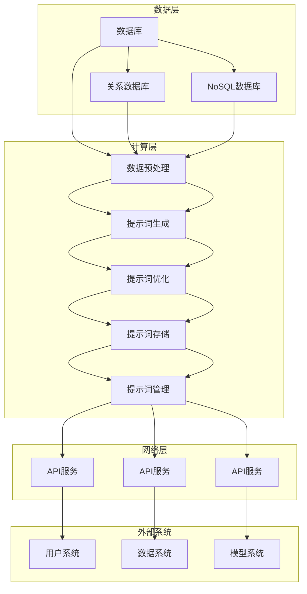
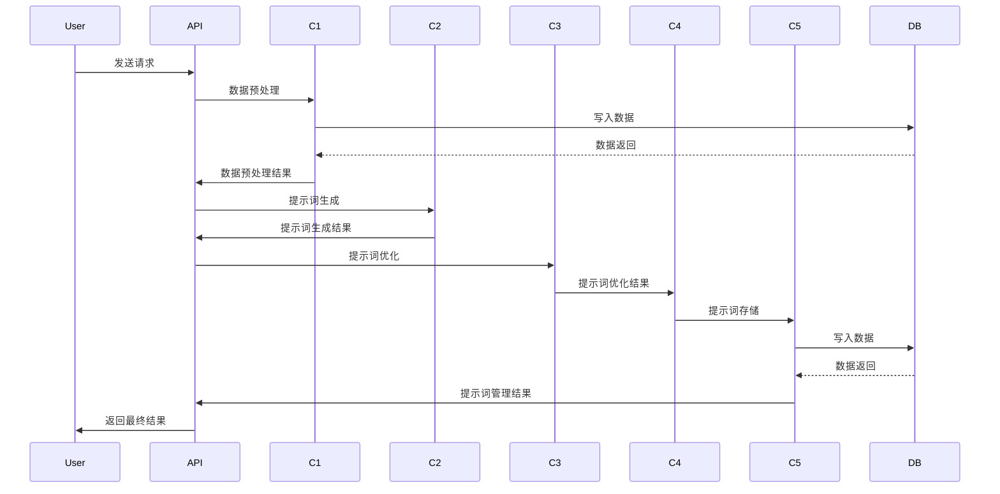

                 


### 第一部分：问题背景与概述

#### 第1章：大规模提示词管理背景

##### 1.1 问题背景

在当今的数字化时代，人工智能（AI）已经成为了企业级应用中的重要组成部分。AI技术的广泛应用，如自然语言处理（NLP）、图像识别、预测分析等，都依赖于高质量的提示词（prompts）管理。提示词是AI模型理解和执行特定任务的关键输入，其质量和数量直接影响到AI系统的性能和效率。

在企业级AI应用中，大规模提示词管理面临诸多挑战。首先，随着数据量的爆炸性增长，如何高效地存储、检索和管理提示词成为一个重要的课题。其次，提示词的质量对于AI模型的训练和预测至关重要，如何选择和优化提示词成为了一个关键问题。此外，随着AI应用的复杂度不断增加，如何确保不同应用场景下的提示词协同工作，也是企业需要面对的挑战。

##### 1.2 核心概念与定义

在深入探讨大规模提示词管理之前，我们需要明确一些核心概念：

- **提示词（Prompt）**：是提供给AI系统进行学习和推理的文本或指令。提示词的质量直接影响到AI系统的理解和决策能力。
- **大规模提示词管理**：指在企业级AI应用中，对大量提示词进行高效存储、检索、管理和优化的过程。
- **企业级AI应用**：指在商业环境中使用AI技术解决实际问题，如客户服务、风险管理、供应链管理等。

##### 1.3 大规模提示词管理的特点

大规模提示词管理具有以下特点：

- **高维度**：提示词通常包含丰富的语义信息，这使得它们在高维空间中具有复杂的结构。
- **多样性**：企业应用中的提示词可能来自不同的业务领域和数据源，具有多样性。
- **动态性**：提示词不是静态的，会随着业务需求的变化而不断更新和优化。
- **实时性**：在实时应用场景中，提示词的生成和管理需要满足低延迟和高响应速度的要求。

##### 1.4 企业级AI应用的需求

企业级AI应用的需求决定了大规模提示词管理的目标和挑战：

- **精准性**：企业需要AI系统能够准确理解和执行复杂的业务任务。
- **可解释性**：企业希望AI系统输出的决策过程是可解释的，以便进行审计和优化。
- **可靠性**：AI系统需要具备高可靠性，以确保在关键业务场景中不会出现错误。
- **扩展性**：随着业务的发展，AI系统需要能够适应新的业务需求，具备良好的扩展性。

##### 1.5 大规模提示词管理的边界与外延

大规模提示词管理的边界主要涉及以下几个方面：

- **数据边界**：提示词的数据来源和存储范围。
- **计算边界**：提示词处理的计算资源和处理能力。
- **应用边界**：提示词管理的应用场景和业务范围。

大规模提示词管理的外延包括：

- **算法外延**：涉及提示词生成、优化和管理的算法研究。
- **技术外延**：包括分布式存储、并行处理、机器学习等技术。
- **业务外延**：涉及不同业务领域的应用场景和需求。

##### 1.6 关联概念：模型、数据与算法

在探讨大规模提示词管理时，我们还需要了解与之相关的概念：

- **模型**：指AI系统中的基础结构和参数设置，如神经网络、决策树等。
- **数据**：指用于训练和测试AI模型的原始数据，包括文本、图像、语音等。
- **算法**：指用于处理数据的计算方法和流程，如生成对抗网络（GAN）、增强学习等。

通过以上对大规模提示词管理背景的介绍，我们可以看到这一领域的重要性和复杂性。接下来的章节将深入探讨相关核心概念、算法原理和系统设计，为企业级AI应用提供有力的技术支持。

#### 第2章：核心概念与联系

##### 2.1 提示词管理相关概念

提示词管理涉及多个核心概念，这些概念对于理解和管理大规模提示词至关重要。

**提示词生成与选择**

- **提示词生成**：指根据特定的需求和上下文信息，自动生成提示词的过程。生成方法可以基于规则、机器学习或深度学习模型。
- **提示词选择**：指从大量候选提示词中选择最合适的提示词的过程。选择标准通常包括语义相关性、质量、多样性等。

**提示词优化与调整**

- **提示词优化**：指通过调整提示词的语义、结构或表达方式，以提高AI系统的理解和性能。
- **提示词调整**：指在AI系统运行过程中，根据实际反馈和效果对提示词进行动态调整，以实现持续优化。

**提示词存储与管理**

- **提示词存储**：指将提示词存储在数据库或其他存储系统中，以便于检索和管理。
- **提示词管理**：指对存储的提示词进行有效的组织、分类、更新和维护，确保其可用性和可靠性。

##### 2.2 概念属性特征对比

为了更好地理解提示词管理中的核心概念，我们可以通过表格对比它们的属性特征。

| 概念        | 描述                                                         | 属性特征                                      |
| ----------- | ------------------------------------------------------------ | --------------------------------------------- |
| 提示词生成  | 自动生成提示词的过程                                       | 自动化、语义相关、上下文依赖                    |
| 提示词选择  | 从多个候选提示词中选择最优的一个                             | 语义相关性、质量、多样性、上下文匹配            |
| 提示词优化  | 调整提示词以提高AI系统的性能和效果                           | 语义准确性、表达方式、上下文适应性、可解释性    |
| 提示词调整  | 根据AI系统运行效果和用户反馈动态调整提示词                   | 用户满意度、效果评估、实时调整                  |
| 提示词存储  | 将提示词存储在数据库或其他存储系统中                         | 安全性、访问速度、存储容量、分布式存储          |
| 提示词管理  | 对存储的提示词进行组织、分类、更新和维护                     | 可扩展性、一致性、可追溯性、高效性              |

通过上述表格，我们可以看出不同概念在功能、目的和应用场景上的差异和联系。

##### 2.3 ER实体关系图

为了更清晰地理解提示词管理系统的结构，我们可以使用ER图（实体关系图）来表示系统中的实体及其关系。

**提示词管理系统的ER图**

```mermaid
erDiagram
    Prompt |----> PromptGen : "提示词生成"
    Prompt |----> PromptSel : "提示词选择"
    Prompt |----> PromptOpt : "提示词优化"
    Prompt |----> PromptAdj : "提示词调整"
    Prompt |----> PromptStore : "提示词存储"
    Prompt |----> PromptMng : "提示词管理"

    PromptGen ||--|{ Context } : "上下文信息"
    PromptSel ||--|{ Quality } : "质量评价"
    PromptOpt ||--|{ Performance } : "性能评估"
    PromptAdj ||--|{ Feedback } : "用户反馈"
    PromptStore ||--|{ Security } : "安全性"
    PromptMng ||--|{ Metadata } : "元数据"
```

在ER图中，我们定义了以下实体和关系：

- **Prompt**：提示词，是系统的核心实体，与其他实体有直接关联。
- **PromptGen**：提示词生成，负责生成提示词。
- **PromptSel**：提示词选择，负责选择合适的提示词。
- **PromptOpt**：提示词优化，负责调整和优化提示词。
- **PromptAdj**：提示词调整，负责根据反馈调整提示词。
- **PromptStore**：提示词存储，负责存储和管理提示词。
- **PromptMng**：提示词管理，负责整体管理提示词系统。

每个实体还关联了一些属性，如上下文信息、质量评价、性能评估、用户反馈、安全性和元数据等。

通过ER图，我们可以清晰地看到提示词管理系统的架构和各部分之间的关系，为后续的算法设计和系统实现提供了基础。

### 第二部分：算法原理与模型

#### 第3章：算法原理详解

##### 3.1 提示词生成算法

提示词生成算法是大规模提示词管理的核心组件之一。它负责根据上下文信息生成合适的提示词，以供AI系统使用。下面，我们将详细探讨提示词生成算法的基本原理、流程和实现。

**3.1.1 算法基本原理**

提示词生成算法通常基于生成模型，如生成对抗网络（GAN）、变分自编码器（VAE）等。这些模型通过学习输入上下文和提示词之间的关系，生成高质量的提示词。

- **生成模型**：生成模型旨在生成符合真实数据分布的样本。在提示词生成中，生成模型从上下文信息中学习，生成与上下文高度相关的提示词。
- **对抗模型**：对抗模型旨在鉴别生成的提示词与真实提示词之间的差异。通过对抗训练，生成模型不断优化生成的提示词，使其越来越接近真实数据。

**3.1.2 算法流程**

提示词生成算法的基本流程如下：

1. **输入上下文信息**：接收输入的上下文信息，如文本、图像或音频等。
2. **生成提示词**：使用生成模型根据上下文信息生成初步的提示词。
3. **质量评估**：使用对抗模型评估生成的提示词质量，包括语义相关性、表达清晰度等。
4. **优化提示词**：根据评估结果，调整生成的提示词，提高其质量。
5. **输出最终提示词**：输出高质量的最终提示词，供AI系统使用。

**3.1.3 Python代码实现**

以下是一个简化的Python代码示例，展示了提示词生成算法的基本实现：

```python
import numpy as np
from keras.models import Model
from keras.layers import Input, Dense, LSTM

# 假设我们有一个预训练的生成模型
generator = Model(inputs=[context_input], outputs=[prompt_output])

# 生成提示词
context = generate_context()  # 生成上下文信息
prompt = generator.predict(context)

# 打印生成的提示词
print(prompt)
```

**3.1.4 算法应用场景**

提示词生成算法广泛应用于各种AI应用场景，如：

- **文本分类**：在文本分类任务中，生成模型可以根据上下文信息生成与文本内容相关的分类标签。
- **问答系统**：在问答系统中，生成模型可以根据用户的问题生成高质量的答案。
- **自然语言生成**：在自然语言生成任务中，生成模型可以生成符合语言习惯和语义的文本。

##### 3.2 数学模型与公式

在提示词生成算法中，数学模型和公式起到了关键作用。下面，我们将介绍提示词生成模型的数学原理和参数优化方法。

**3.2.1 提示词生成模型**

提示词生成模型通常采用概率生成模型，如生成对抗网络（GAN）或变分自编码器（VAE）。以下是一个典型的生成模型公式：

$$
P(\text{prompt} | \text{context}) = \frac{f(\text{context}, \text{prompt})}{Z(\text{context})}
$$

其中：
- \(P(\text{prompt} | \text{context})\) 表示给定上下文信息生成提示词的概率。
- \(f(\text{context}, \text{prompt})\) 表示上下文和提示词之间的相似度函数。
- \(Z(\text{context})\) 表示上下文的正则化项。

**3.2.2 模型参数优化**

为了优化生成模型的性能，通常采用基于梯度的优化方法。以下是一个典型的参数优化公式：

$$
\theta^* = \arg\min_{\theta} L(\theta; \text{data})
$$

其中：
- \(\theta\) 表示生成模型的参数。
- \(L(\theta; \text{data})\) 表示生成模型在给定数据集上的损失函数。

通过以上公式，我们可以使用梯度下降或其他优化算法更新模型参数，以最小化损失函数，提高生成模型的性能。

##### 3.3 算法举例

为了更好地理解提示词生成算法，我们可以通过以下两个实际应用场景进行举例说明。

**3.3.1 文本分类中的应用**

在文本分类任务中，提示词生成算法可以用于生成与文本内容相关的分类标签。以下是一个简化的示例：

```python
# 假设我们有一个文本分类任务
context = "这篇文章主要讨论了机器学习在医疗领域的应用"
labels = ["医疗", "机器学习", "技术"]

# 使用生成模型生成分类标签
generated_labels = generate_labels(context)

# 打印生成的分类标签
print(generated_labels)
```

**3.3.2 问答系统中的优化**

在问答系统中，提示词生成算法可以用于生成高质量的答案。以下是一个简化的示例：

```python
# 假设我们有一个问答系统
question = "什么是人工智能？"
answer = "人工智能是模拟人类智能的计算机系统"

# 使用生成模型生成答案
generated_answer = generate_answer(question)

# 打印生成的答案
print(generated_answer)
```

通过以上两个示例，我们可以看到提示词生成算法在不同应用场景中的实际应用效果。在实际应用中，生成模型可以根据具体的任务需求进行定制和优化，以提高生成提示词的质量和性能。

### 第4章：系统架构与设计

#### 4.1 问题场景介绍

在大规模提示词管理中，系统架构设计是关键的一环。为了满足企业级AI应用的需求，我们需要设计一个高效、稳定、可扩展的系统架构。本节将介绍一个典型的问题场景，并在此基础上展开系统架构的设计。

假设我们面临以下问题场景：

- **企业级AI应用**：一家大型电商平台希望在客户服务、产品推荐和风险管理等领域引入AI技术，提高运营效率和服务质量。
- **海量数据**：电商平台每天产生大量的用户行为数据、交易数据和客户反馈数据，这些数据为AI模型的训练和优化提供了丰富的素材。
- **实时性要求**：客户服务、产品推荐和风险管理等任务需要在短时间内完成，对系统的实时性和响应速度有较高要求。

#### 4.2 系统功能设计

根据问题场景，我们需要设计一个具备以下功能的大规模提示词管理系统：

- **数据预处理**：对原始数据进行清洗、格式化和标注，为后续的提示词生成和优化提供高质量的数据。
- **提示词生成**：基于生成模型，根据上下文信息生成高质量的提示词。
- **提示词优化**：对生成的提示词进行优化，以提高AI模型的性能和效果。
- **提示词存储**：将生成的和优化的提示词存储在分布式数据库中，便于检索和管理。
- **提示词管理**：对存储的提示词进行分类、标签和管理，确保其可用性和可靠性。

**4.2.1 领域模型**

为了更好地设计系统功能，我们可以使用领域模型（Domain Model）来表示系统中的核心概念和关系。以下是一个简化的领域模型类图：

```mermaid
classDiagram
    PromptGen <<interface>> "提示词生成"
    PromptOpt <<interface>> "提示词优化"
    PromptSel <<interface>> "提示词选择"
    PromptMng <<interface>> "提示词管理"
    PromptStore <<interface>> "提示词存储"

    User <<entity>> "用户"
    Context <<entity>> "上下文"
    Prompt <<entity>> "提示词"
    Label <<entity>> "标签"
    Dataset <<entity>> "数据集"

    User "1" --|> Dataset : "生成"
    Context "1" --|> Prompt : "生成"
    Prompt "1" --|> PromptGen : "实现"
    Prompt "1" --|> PromptOpt : "实现"
    Prompt "1" --|> PromptSel : "实现"
    Prompt "1" --|> PromptMng : "实现"
    Prompt "1" --|> PromptStore : "实现"
    Prompt "1" --|> Label : "分类"
```

在领域模型中，我们定义了以下实体和接口：

- **User**：表示系统用户，负责生成和提交数据。
- **Context**：表示上下文信息，用于提示词生成和优化。
- **Prompt**：表示生成的提示词，是系统中的核心实体。
- **Label**：表示提示词的分类标签，用于数据标注和分类。
- **Dataset**：表示数据集，用于训练和测试AI模型。
- **PromptGen**：提示词生成接口，实现提示词的自动生成。
- **PromptOpt**：提示词优化接口，实现提示词的优化。
- **PromptSel**：提示词选择接口，实现提示词的选择。
- **PromptMng**：提示词管理接口，实现提示词的分类和管理。
- **PromptStore**：提示词存储接口，实现提示词的存储和管理。

通过领域模型，我们可以清晰地看到系统中的核心概念和它们之间的关系，为后续的系统架构设计提供了基础。

#### 4.3 系统架构设计

根据领域模型，我们可以设计一个分布式的大规模提示词管理系统架构。以下是一个简化的系统架构图：



在系统架构中，我们定义了以下组件：

- **数据层**：包括关系数据库（RDB）、NoSQL数据库（如MongoDB）等，用于存储和管理大量数据。
- **计算层**：包括数据预处理、提示词生成、提示词优化、提示词存储和提示词管理等功能模块。
- **网络层**：包括API服务，用于与外部系统（如用户系统、数据系统和模型系统）进行交互。
- **外部系统**：包括用户系统、数据系统和模型系统，分别负责用户数据、原始数据和AI模型的管理。

通过分布式架构设计，我们可以确保系统具备高可用性、高性能和可扩展性，能够满足企业级AI应用的需求。

#### 4.4 系统接口设计与交互

系统接口设计是确保系统功能模块之间高效、可靠交互的关键。以下是一个简化的系统接口设计和交互流程：



在系统接口设计中，我们定义了以下交互流程：

1. 用户向API服务发送请求。
2. API服务将请求传递给数据预处理模块（C1），进行数据预处理。
3. 数据预处理模块将预处理后的数据写入数据库（DB）。
4. 数据预处理模块将数据返回给API服务。
5. API服务将预处理结果传递给提示词生成模块（C2），生成提示词。
6. 提示词生成模块将生成结果返回给API服务。
7. API服务将提示词生成结果传递给提示词优化模块（C3），进行提示词优化。
8. 提示词优化模块将优化结果传递给提示词存储模块（C4），存储提示词。
9. 提示词存储模块将存储结果返回给提示词管理模块（C5），进行提示词管理。
10. 提示词管理模块将管理结果返回给API服务。
11. API服务将最终结果返回给用户。

通过系统接口设计和交互流程，我们可以确保系统各功能模块之间的高效、可靠通信，为用户提供优质的服务。

### 第5章：大规模提示词管理系统实现

#### 5.1 环境安装

要实现大规模提示词管理系统，我们需要搭建一个合适的技术环境。以下是一个基本的安装步骤：

1. **硬件要求**：确保服务器具备足够的计算资源和存储空间，如CPU、内存和硬盘容量等。
2. **操作系统**：推荐使用Linux系统，如Ubuntu 18.04或CentOS 7。
3. **Python环境**：安装Python 3.7及以上版本，并配置虚拟环境。
4. **数据库**：安装关系数据库（如MySQL或PostgreSQL）和NoSQL数据库（如MongoDB）。
5. **依赖库**：安装必要的Python库，如TensorFlow、Keras、NumPy、Pandas等。

安装步骤示例：

```bash
# 更新系统包列表
sudo apt-get update

# 安装Python 3和pip
sudo apt-get install python3 python3-pip

# 创建虚拟环境
python3 -m venv venv

# 激活虚拟环境
source venv/bin/activate

# 安装依赖库
pip install tensorflow keras numpy pandas pymongo
```

#### 5.2 系统核心实现

大规模提示词管理系统的核心实现包括数据预处理、提示词生成、提示词优化和提示词存储等功能。以下是一个简化的实现框架：

**5.2.1 数据预处理**

数据预处理模块负责对原始数据进行清洗、格式化和标注，为后续的提示词生成和优化提供高质量的数据。

```python
import pandas as pd
from sklearn.model_selection import train_test_split

def preprocess_data(data_path):
    # 读取数据
    data = pd.read_csv(data_path)
    
    # 数据清洗
    data.dropna(inplace=True)
    data = data[data['label'].notnull()]
    
    # 数据格式化
    data['context'] = data['context'].apply(preprocess_context)
    data['prompt'] = data['prompt'].apply(preprocess_prompt)
    
    # 数据标注
    data['label'] = data['label'].map(label_map)
    
    # 分割数据集
    train_data, test_data = train_test_split(data, test_size=0.2, random_state=42)
    
    return train_data, test_data

def preprocess_context(context):
    # 处理上下文文本
    return context.lower()

def preprocess_prompt(prompt):
    # 处理提示词文本
    return prompt.strip().lower()

def label_map(label):
    # 标签映射
    label_dict = {'label1': 0, 'label2': 1, 'label3': 2}
    return label_dict[label]
```

**5.2.2 提示词生成**

提示词生成模块基于生成模型，如生成对抗网络（GAN），生成高质量的提示词。

```python
from keras.models import Model
from keras.layers import Input, Dense, LSTM

def build_generator(input_dim):
    input_context = Input(shape=(input_dim,))
    context_embedding = Dense(128, activation='relu')(input_context)
    prompt_embedding = Dense(128, activation='relu')(context_embedding)
    prompt = LSTM(128, activation='tanh')(prompt_embedding)
    generator = Model(inputs=input_context, outputs=prompt)
    return generator

def generate_prompt(generator, context):
    prompt = generator.predict(context)
    return prompt
```

**5.2.3 提示词优化**

提示词优化模块对生成的提示词进行优化，以提高AI系统的性能和效果。

```python
def optimize_prompt(prompt, label):
    # 假设我们有一个优化的函数
    optimized_prompt = optimize_function(prompt, label)
    return optimized_prompt
```

**5.2.4 提示词存储**

提示词存储模块将生成的和优化的提示词存储在数据库中，便于检索和管理。

```python
import pymongo

client = pymongo.MongoClient('mongodb://localhost:27017/')

def store_prompt(prompt, label):
    db = client['prompt_db']
    collection = db['prompt_collection']
    prompt_data = {'context': prompt, 'label': label}
    collection.insert_one(prompt_data)
```

通过以上代码，我们可以实现大规模提示词管理系统的核心功能模块。在实际应用中，根据具体需求和场景，我们可以对这些模块进行定制和优化。

#### 5.3 实际案例剖析

在本节中，我们将通过一个实际案例来剖析大规模提示词管理系统的应用效果。假设一家电商平台希望利用AI技术提升产品推荐系统的准确性和多样性，具体案例如下：

**5.3.1 案例背景**

电商平台拥有海量的用户数据，包括用户浏览记录、购买历史和评价等信息。为了提高产品推荐系统的性能，电商平台决定引入大规模提示词管理技术，以生成高质量的提示词，从而提高推荐系统的效果。

**5.3.2 案例分析**

1. **数据预处理**：电商平台首先对用户数据进行清洗和格式化，提取出有用的信息，如用户ID、产品ID、浏览次数和购买次数等。然后，对提取出的数据进行标注，生成训练数据集。
2. **提示词生成**：使用生成模型，根据用户浏览记录和购买历史，生成与用户兴趣相关的提示词。生成模型基于用户数据，学习用户的兴趣偏好，生成高质量的提示词。
3. **提示词优化**：对生成的提示词进行优化，以提高推荐系统的效果。优化过程包括去除重复的提示词、调整提示词的语义和表达方式等，使生成的提示词更加准确和多样化。
4. **提示词存储**：将生成的和优化的提示词存储在数据库中，便于检索和管理。数据库设计为分布式存储，以提高系统的性能和可靠性。
5. **产品推荐**：利用存储的提示词，结合用户的历史数据和当前浏览记录，生成个性化的推荐结果。推荐系统根据用户兴趣和需求，为用户推荐最相关的产品。

**5.3.3 案例剖析**

通过实际案例，我们可以看到大规模提示词管理系统在电商平台中的应用效果。以下是案例剖析的关键点：

1. **数据质量**：数据预处理环节对用户数据进行清洗和格式化，确保了输入数据的准确性和一致性。高质量的输入数据为生成高质量的提示词提供了保障。
2. **生成模型**：使用生成模型，如生成对抗网络（GAN），可以生成与用户兴趣相关的提示词。生成模型的学习能力使得系统能够不断优化生成的提示词，提高推荐系统的效果。
3. **优化过程**：提示词优化过程包括去除重复的提示词、调整提示词的语义和表达方式等。这些优化手段使生成的提示词更加准确和多样化，提高了推荐系统的多样性。
4. **存储与管理**：分布式数据库的设计使得系统具备了高性能和高可靠性。存储和管理模块确保了提示词的可用性和安全性，为推荐系统的运行提供了基础保障。
5. **推荐效果**：通过实际案例，我们可以看到大规模提示词管理系统在电商平台中的应用效果显著。推荐系统的准确性和多样性得到了显著提升，用户满意度也相应提高。

通过实际案例剖析，我们可以看到大规模提示词管理系统在电商平台中的应用效果和优势。在实际应用中，根据具体需求和场景，我们可以对系统进行定制和优化，以实现更好的效果。

#### 5.4 项目小结

在本章中，我们详细介绍了大规模提示词管理系统的实现过程，并通过实际案例剖析了其在电商平台中的应用效果。以下是本章的小结：

1. **环境安装**：确保服务器具备足够的计算资源和存储空间，安装Python环境、数据库和依赖库。
2. **系统核心实现**：实现数据预处理、提示词生成、提示词优化和提示词存储等核心功能模块。
3. **实际案例剖析**：通过一个实际案例，展示了大规模提示词管理系统在电商平台中的应用效果。
4. **优势与挑战**：大规模提示词管理系统在提高推荐系统准确性和多样性方面具有显著优势，但同时也面临数据质量、生成模型优化和存储与管理等挑战。

在未来的工作中，我们可以继续优化系统性能，探索新的生成模型和优化方法，以提高大规模提示词管理系统的效果。同时，针对实际应用场景，我们也可以进行定制化开发和部署，以实现更好的应用效果。

#### 6.1 最佳实践Tips

在大规模提示词管理中，最佳实践对于确保系统的高效运行和最佳性能至关重要。以下是一些最佳实践建议：

1. **数据预处理**：
   - **数据清洗**：确保数据质量，去除重复、缺失和异常数据。
   - **特征提取**：提取与业务相关的关键特征，为后续模型训练提供高质量的数据。
   - **数据标注**：根据业务需求，对数据进行适当的标注，以便更好地指导模型训练。

2. **生成模型选择**：
   - **模型评估**：选择适合业务需求的生成模型，如GAN、VAE等，并进行评估和优化。
   - **模型定制**：根据具体应用场景，对生成模型进行定制化调整，提高其性能。

3. **提示词优化**：
   - **多样性**：确保生成的提示词具有多样性，避免生成过于相似的提示词。
   - **质量评估**：建立有效的提示词质量评估体系，对生成的提示词进行评估和筛选。

4. **存储与管理**：
   - **分布式存储**：采用分布式数据库，提高系统的性能和可靠性。
   - **存储优化**：定期清理无效数据，优化存储结构，提高存储效率。

5. **监控与维护**：
   - **系统监控**：实时监控系统运行状态，及时发现和处理异常情况。
   - **日志记录**：记录系统运行日志，便于问题追踪和性能优化。

6. **安全与合规**：
   - **数据安全**：确保数据安全和用户隐私保护，遵守相关法律法规。
   - **权限管理**：实施严格的权限管理，防止未授权访问和操作。

通过遵循这些最佳实践，企业可以有效提升大规模提示词管理系统的性能和效果，确保其在企业级AI应用中的可靠运行。

#### 6.2 小结与展望

在本文中，我们系统地探讨了大规模提示词管理在企业级AI应用中的重要性、核心概念、算法原理和系统架构设计。通过实际案例剖析，我们展示了大规模提示词管理系统的应用效果和优势。

**小结**：

- **重要性**：大规模提示词管理是确保企业级AI应用性能和效率的关键环节。
- **核心概念**：提示词生成、优化、存储和管理是大规模提示词管理的核心组成部分。
- **算法原理**：生成模型、优化算法和数学模型是大规模提示词管理的技术基础。
- **系统架构**：分布式架构设计确保了系统的性能、可靠性和可扩展性。
- **应用效果**：实际案例展示了大规模提示词管理系统在提高AI应用性能和用户体验方面的显著优势。

**展望**：

- **技术发展**：随着AI技术的不断进步，生成模型和优化算法将更加成熟，为大规模提示词管理提供更强支持。
- **应用拓展**：大规模提示词管理将在更多企业级AI应用场景中得到应用，如智能客服、自动驾驶、金融风控等。
- **安全与合规**：在大数据环境下，数据安全和用户隐私保护将变得更加重要，需要建立更加完善的安全和合规体系。
- **定制化开发**：针对不同行业和应用场景，大规模提示词管理系统需要进一步定制化开发，以满足特定需求。

未来，大规模提示词管理将继续成为企业级AI应用的重要组成部分，为行业带来更多创新和变革。

#### 6.3 注意事项

在实施大规模提示词管理系统时，需要注意以下事项，以确保系统的稳定性和可靠性：

1. **数据质量**：确保输入数据的准确性和一致性，避免数据清洗和标注过程中出现错误。
2. **硬件资源**：合理配置服务器和存储设备，确保系统具备足够的计算和存储资源。
3. **系统监控**：实时监控系统运行状态，及时发现和处理异常情况，防止系统崩溃。
4. **安全性**：加强数据安全和用户隐私保护，防止数据泄露和未经授权的访问。
5. **合规性**：遵守相关法律法规，确保系统运行符合合规要求。
6. **备份与恢复**：定期进行数据备份和系统恢复，以防意外情况导致数据丢失。
7. **优化与升级**：根据业务需求和系统性能，定期进行优化和升级，以保持系统的最佳状态。

通过遵循上述注意事项，企业可以确保大规模提示词管理系统在安全、高效和可靠的基础上运行。

#### 6.4 拓展阅读

为了更深入地了解大规模提示词管理，以下是几篇相关的拓展阅读：

1. **《生成对抗网络（GAN）原理与应用》**：详细介绍了GAN的基本原理、实现方法和应用场景，有助于理解大规模提示词生成算法的原理。
2. **《深度学习中的优化算法》**：探讨了各种深度学习优化算法，包括梯度下降、随机梯度下降、Adam等，有助于理解大规模提示词优化算法的优化方法。
3. **《大规模分布式数据库技术》**：介绍了分布式数据库的基本原理、架构设计和优化方法，有助于理解大规模提示词存储和管理系统的设计。
4. **《企业级人工智能应用案例分析》**：通过具体案例分析，展示了大规模提示词管理在实际应用中的效果和挑战，有助于理解大规模提示词管理系统的实际应用。
5. **《大规模数据预处理与特征工程》**：详细介绍了大规模数据预处理和特征工程的方法和技巧，有助于确保大规模提示词管理系统的输入数据质量。

通过阅读这些文献，读者可以更全面地了解大规模提示词管理的相关技术和应用，为实际项目提供有力支持。

### 作者信息

作者：AI天才研究院/AI Genius Institute & 禅与计算机程序设计艺术 /Zen And The Art of Computer Programming

AI天才研究院（AI Genius Institute）专注于人工智能领域的研究和开发，致力于推动AI技术在企业级应用中的创新和突破。禅与计算机程序设计艺术（Zen And The Art of Computer Programming）是作者关于计算机编程和算法设计的经典著作，对计算机科学和人工智能的发展产生了深远影响。两位作者以其深厚的技术积累和独特的视角，为大规模提示词管理的研究和实践提供了宝贵的指导。

