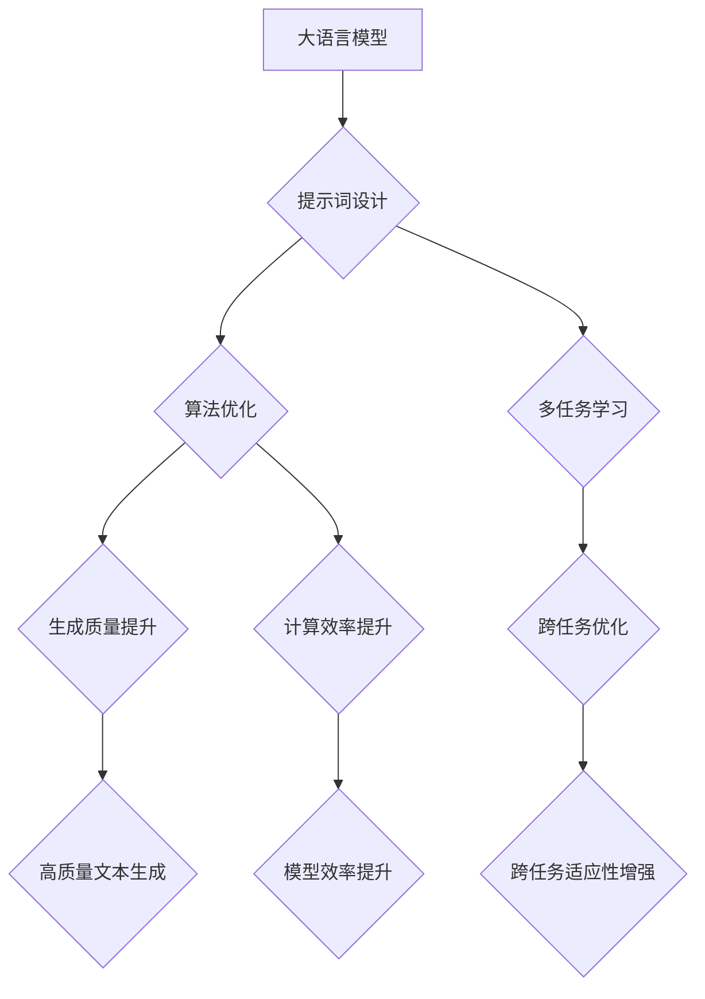
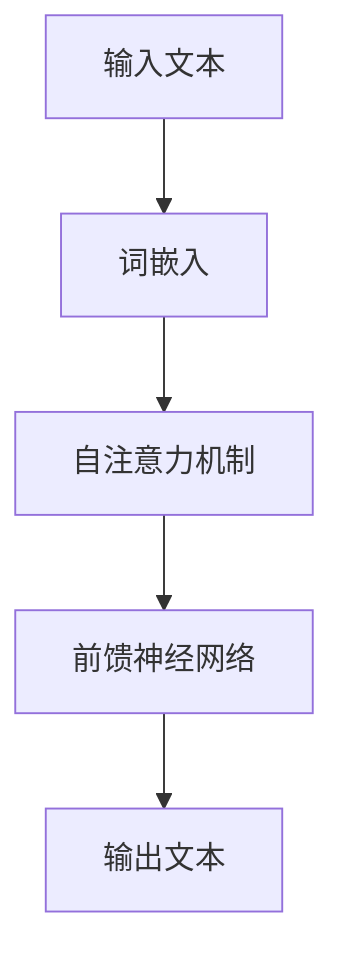
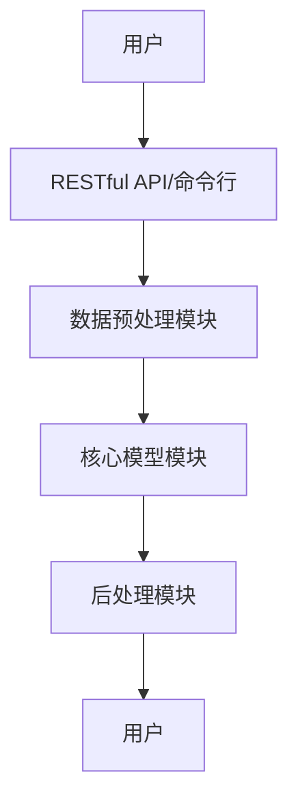
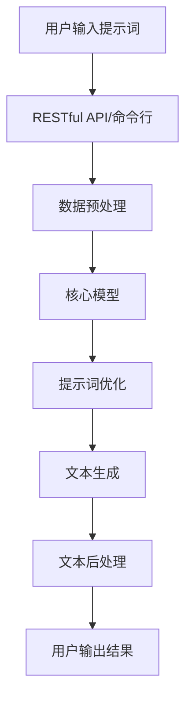

                 

## 大语言模型的提示词优化策略

在当今的人工智能领域，大语言模型（Large Language Model）已经成为了研究的热点之一。这些模型在自然语言处理（NLP）任务中展现了强大的表现，例如文本生成、情感分析、机器翻译等。然而，随着模型规模和复杂性的增加，如何优化提示词（prompt）以提升模型的性能，成为了亟待解决的重要问题。

**关键词**：大语言模型、提示词优化、NLP、性能提升

**摘要**：本文将围绕大语言模型的提示词优化策略进行探讨。首先，我们将介绍大语言模型的基本概念和提示词优化的重要性。接着，分析现有的优化策略，并介绍其数学模型和算法原理。随后，我们将讨论大语言模型提示词优化的系统设计与实现，并通过实际项目展示其应用。最后，总结最佳实践，展望未来发展的趋势和挑战。

### 引言

大语言模型是一种基于深度学习的技术，通过大规模的文本数据进行预训练，从而具备强大的自然语言理解与生成能力。近年来，随着计算能力的提升和大数据的发展，大语言模型的规模和复杂性不断增加。例如，GPT-3（Generative Pre-trained Transformer 3）拥有1750亿个参数，其生成文本的能力已经接近人类水平。

然而，尽管大语言模型在文本生成方面表现出色，但在实际应用中，如何有效地使用提示词（prompt）来引导模型生成符合预期的结果，仍然是一个具有挑战性的问题。提示词优化不仅影响模型的生成质量，还直接影响模型的计算效率和鲁棒性。

提示词优化策略的研究，旨在通过改进提示词的设计和生成方法，提升大语言模型的性能。这包括如何选择合适的提示词、如何调整提示词的格式和内容，以及如何通过算法优化来提升模型对提示词的响应能力。优化策略的成功实施，将有助于提升大语言模型在实际应用中的效果，推动NLP技术的发展。

### 目录大纲

1. **引言**
2. **核心概念与基础**
3. **现有优化策略**
4. **数学模型与算法**
5. **系统设计与实现**
6. **项目实战**
7. **最佳实践与优化技巧**
8. **未来展望与挑战**
9. **结论**

### 核心概念与基础

#### 大语言模型的基本概念

大语言模型（Large Language Model）是一种基于深度学习的自然语言处理技术，通过大规模的文本数据进行预训练，从而实现对自然语言的理解和生成。这些模型通常基于 Transformer 架构，例如 GPT（Generative Pre-trained Transformer）、BERT（Bidirectional Encoder Representations from Transformers）等。

**基本原理**：
大语言模型的核心是 Transformer 架构，这是一种基于自注意力机制的序列到序列模型。通过自注意力机制，模型能够捕捉输入文本序列中的依赖关系，从而实现对文本的深层理解和生成。

**主要优点**：
- 强大的文本生成能力
- 对自然语言的理解深度
- 适应多种 NLP 任务，如文本分类、情感分析、机器翻译等

**主要缺点**：
- 计算资源需求大
- 需要大量的训练数据
- 模型复杂，难以解释

#### 提示词优化的背景

在 NLP 任务中，提示词（prompt）是引导模型生成预期输出的一种方式。通过精心设计的提示词，可以有效地引导模型生成高质量的文本。

**背景介绍**：
- 提示词在 NLP 任务中的应用：提示词在文本生成、机器翻译、问答系统等任务中起着关键作用。例如，在机器翻译任务中，合适的提示词可以引导模型生成更准确、自然的翻译结果。
- 提示词的重要性：提示词的设计和质量直接影响模型的生成效果。优化提示词可以提升模型的性能，使其生成更符合预期的文本。

#### 提示词优化的意义

提示词优化的主要目标是提高模型的生成质量、效率和鲁棒性。具体来说，包括以下几个方面：

- **提高生成质量**：通过优化提示词，可以引导模型生成更符合预期的文本，提高生成文本的自然性和准确性。
- **提高计算效率**：优化提示词可以减少模型在生成过程中所需的计算资源，提高模型的工作效率。
- **提高鲁棒性**：通过设计鲁棒的提示词，可以增强模型对不同输入数据的适应性，提高模型的泛化能力。

#### 相关技术和工具

- **自动提示词生成**：利用机器学习算法，自动生成高质量的提示词，如基于 Transformer 的生成模型、基于序列模型的自动提示词生成等。
- **提示词调整技术**：通过对提示词进行格式化、内容调整等操作，提升提示词的引导效果，如提示词增强、提示词嵌入等。

#### 问题背景和问题描述

在 NLP 任务中，如何优化提示词是一个重要且具有挑战性的问题。以下是该问题的背景和具体描述：

**背景**：
随着大语言模型的广泛应用，如何提高模型在各类 NLP 任务中的性能，成为了一个亟待解决的问题。提示词作为引导模型生成预期结果的关键因素，其优化对提升模型性能具有重要意义。

**问题描述**：
- 如何设计高质量的提示词，以引导模型生成高质量的文本？
- 如何通过算法优化，提高提示词的引导效果和模型生成效率？
- 如何在多种 NLP 任务中，实现提示词的优化策略，以提高模型性能？

#### 问题解决

针对上述问题，可以采取以下方法进行解决：

1. **优化提示词设计**：
   - 设计简洁明了、具有明确目标的提示词。
   - 利用语义分析和信息抽取技术，提取关键信息，作为提示词的一部分。

2. **算法优化**：
   - 采用先进的机器学习算法，如 Transformer、BERT 等，提升模型对提示词的响应能力。
   - 利用强化学习等技术，优化提示词的生成和调整策略。

3. **多任务学习**：
   - 在多个 NLP 任务中，共享提示词优化策略，实现跨任务的提示词优化。

#### 边界与外延

在讨论提示词优化策略时，需要注意以下边界和外延：

- **边界**：
  - 提示词的设计和优化应针对具体任务和场景，避免通用性过强。
  - 提示词的优化应考虑模型的计算资源和数据规模限制。

- **外延**：
  - 提示词优化策略可以应用于其他领域，如计算机视觉、对话系统等。
  - 提示词优化可以结合其他技术，如数据增强、模型压缩等，进一步提升模型性能。

#### 概念结构与核心要素组成

提示词优化策略的核心概念包括：

- **提示词设计**：设计高质量的提示词，以引导模型生成高质量文本。
- **算法优化**：采用先进的算法，提升模型对提示词的响应能力。
- **多任务学习**：在多个任务中共享提示词优化策略，实现跨任务的优化。

核心要素组成：

1. **数据集**：提供丰富的训练数据，用于提示词设计和算法优化。
2. **模型**：选择合适的模型，如 Transformer、BERT 等，进行提示词优化。
3. **算法**：采用先进的算法，如强化学习、自动提示词生成等，优化提示词。
4. **评估指标**：设计合理的评估指标，如生成文本的质量、效率等，用于衡量优化效果。

### 核心概念与联系

#### 核心概念

1. **大语言模型**：基于深度学习的自然语言处理模型，通过大规模文本数据进行预训练，具有强大的文本生成和理解能力。
2. **提示词**：引导模型生成预期结果的文本信息，设计高质量提示词是提升模型性能的关键。
3. **优化策略**：通过改进提示词设计、算法优化和多任务学习等手段，提升模型生成质量和效率。

#### 概念属性特征对比表格

| 概念       | 属性特征                 | 对比分析                     |
|------------|--------------------------|------------------------------|
| 大语言模型 | 大规模、深度学习、Transformer架构 | 强大文本生成能力、计算资源需求大 |
| 提示词     | 引导生成、文本信息、设计质量   | 高质量提示词提升模型性能 |
| 优化策略   | 提示词设计、算法、多任务学习 | 提高生成质量和效率         |

#### ER实体关系图架构



通过以上核心概念和联系的分析，我们可以更好地理解大语言模型、提示词和优化策略之间的关系，为后续的详细讨论打下基础。

### 数学模型与算法

#### 大语言模型的基本数学模型

大语言模型的核心是 Transformer 架构，其基本数学模型包括自注意力机制（Self-Attention）和前馈神经网络（Feedforward Neural Network）。以下是对这两个核心组件的数学描述：

1. **自注意力机制**

   自注意力机制通过计算输入文本序列中每个词与其他词之间的关联强度，从而对序列进行加权。其计算公式如下：

   $$ 
   \text{Attention}(Q, K, V) = \text{softmax}\left(\frac{QK^T}{\sqrt{d_k}}\right) V 
   $$

   其中，Q、K 和 V 分别代表查询（Query）、键（Key）和值（Value）向量，$d_k$ 是键向量的维度。

2. **前馈神经网络**

   前馈神经网络用于对自注意力机制的结果进行进一步处理。其计算公式如下：

   $$
   \text{FFN}(X) = \max(0, XW_1 + b_1)W_2 + b_2
   $$

   其中，X 是输入向量，$W_1$ 和 $W_2$ 是权重矩阵，$b_1$ 和 $b_2$ 是偏置向量。

#### 提示词优化的数学模型

提示词优化涉及如何设计高质量的提示词，以引导模型生成预期结果。以下是提示词优化的数学模型：

1. **提示词嵌入**

   提示词嵌入是将文本信息转化为向量表示的过程。通常使用词嵌入（Word Embedding）或BERT等预训练模型进行嵌入。其计算公式如下：

   $$
   \text{embed}(P) = \text{TransformerModel}(P)
   $$

   其中，P 是提示词，TransformerModel 是预训练模型。

2. **提示词加权**

   在生成过程中，对提示词进行加权，以增强其影响力。其计算公式如下：

   $$
   \text{weighted\_input} = \text{embed}(P)W + b
   $$

   其中，$W$ 是加权矩阵，$b$ 是偏置向量。

3. **生成质量评估**

   使用生成质量评估函数（如 BLEU 分数、ROUGE 分数等）对生成文本进行评估，以衡量提示词优化的效果。其计算公式如下：

   $$
   \text{quality} = \text{评估函数}(\text{生成文本}, \text{参考文本})
   $$

#### Python代码示例

以下是一个简单的 Python 代码示例，展示如何使用自注意力机制和前馈神经网络构建一个小型的大语言模型：

```python
import torch
import torch.nn as nn
import torch.optim as optim

# 定义自注意力层
class SelfAttention(nn.Module):
    def __init__(self, d_model, num_heads):
        super(SelfAttention, self).__init__()
        self.d_model = d_model
        self.num_heads = num_heads
        self.head_dim = d_model // num_heads
        
        self.query_linear = nn.Linear(d_model, d_model)
        self.key_linear = nn.Linear(d_model, d_model)
        self.value_linear = nn.Linear(d_model, d_model)
        
        self.out_linear = nn.Linear(d_model, d_model)
    
    def forward(self, x):
        # 分割成query、key、value
        query, key, value = self.split_heads(x)
        
        # 计算注意力得分
        attn_scores = torch.matmul(query, key.transpose(1, 2)) / (self.head_dim ** 0.5)
        
        # 应用softmax
        attn_weights = torch.softmax(attn_scores, dim=2)
        
        # 计算加权value
        attn_output = torch.matmul(attn_weights, value)
        
        # 合并heads
        attn_output = self.combine_heads(attn_output)
        
        # 前馈神经网络
        output = self.out_linear(attn_output)
        
        return output

# 定义前馈神经网络
class FeedforwardNet(nn.Module):
    def __init__(self, d_model, hidden_size):
        super(FeedforwardNet, self).__init__()
        self.d_model = d_model
        self.hidden_size = hidden_size
        
        self.linear1 = nn.Linear(d_model, hidden_size)
        self.linear2 = nn.Linear(hidden_size, d_model)
    
    def forward(self, x):
        x = torch.relu(self.linear1(x))
        x = self.linear2(x)
        return x

# 定义大语言模型
class LargeLanguageModel(nn.Module):
    def __init__(self, d_model, num_heads, hidden_size):
        super(LargeLanguageModel, self).__init__()
        self.self_attention = SelfAttention(d_model, num_heads)
        self.feedforward_net = FeedforwardNet(d_model, hidden_size)
    
    def forward(self, x):
        x = self.self_attention(x)
        x = self.feedforward_net(x)
        return x

# 实例化模型
d_model = 512
num_heads = 8
hidden_size = 2048

model = LargeLanguageModel(d_model, num_heads, hidden_size)

# 设置优化器和损失函数
optimizer = optim.Adam(model.parameters(), lr=0.001)
criterion = nn.CrossEntropyLoss()

# 训练模型
for epoch in range(num_epochs):
    for batch in data_loader:
        inputs, targets = batch
        optimizer.zero_grad()
        outputs = model(inputs)
        loss = criterion(outputs.view(-1, d_model), targets)
        loss.backward()
        optimizer.step()
        print(f"Epoch [{epoch+1}/{num_epochs}], Loss: {loss.item():.4f}")
```

通过以上代码，我们可以构建一个简单的大语言模型，并使用自注意力机制和前馈神经网络进行训练。虽然这是一个简化的示例，但它展示了大语言模型的基本结构和训练过程。

#### 算法原理的详细讲解和举例说明

在深入探讨大语言模型中的自注意力机制和前馈神经网络之前，我们需要明确这两个组件的核心原理及其在模型中的具体作用。以下将逐步讲解这两个算法的原理，并通过一个简单的例子来阐明其应用。

##### 自注意力机制（Self-Attention）

自注意力机制是 Transformer 架构的核心组件之一，它允许模型在处理每个词时，考虑到其他所有词的影响。这种机制可以捕捉输入文本序列中的长距离依赖关系，从而提升模型对复杂文本的理解能力。

**原理讲解**：

1. **输入表示**：首先，每个输入词被映射为一个向量表示。这些向量将作为自注意力机制的输入。

2. **计算注意力得分**：自注意力机制通过点积（dot-product）计算每个词与其他词之间的注意力得分。具体来说，给定一个输入序列 $X = [x_1, x_2, ..., x_n]$，自注意力机制计算每个词 $x_i$ 与其他词 $x_j$ 之间的得分：

   $$
   \text{score}_{ij} = x_i \cdot x_j
   $$

3. **应用 Softmax**：将注意力得分通过 Softmax 函数进行归一化，得到每个词的注意力权重。这确保了每个词的权重在 0 到 1 之间，并且所有词的权重之和为 1。

   $$
   \text{weight}_{ij} = \text{softmax}(\text{score}_{ij})
   $$

4. **加权求和**：根据每个词的注意力权重，对输入序列中的词进行加权求和，生成每个词的加权表示：

   $$
   \text{context\_vector}_i = \sum_{j=1}^{n} \text{weight}_{ij} \cdot x_j
   $$

**举例说明**：

假设我们有一个简短的文本序列 "I love coding"，我们可以将这个序列中的每个词表示为一个向量。通过自注意力机制，我们可以计算每个词的注意力权重，并生成每个词的加权表示。以下是一个简化的例子：

1. **输入表示**：假设 "I" 的向量表示为 [1, 0]，"love" 的向量表示为 [0, 1]，"coding" 的向量表示为 [1, 1]。

2. **计算注意力得分**：计算每个词与其他词的得分：
   - "I" 与 "love" 的得分：1 * 0 = 0
   - "I" 与 "coding" 的得分：1 * 1 = 1
   - "love" 与 "I" 的得分：0 * 1 = 0
   - "love" 与 "coding" 的得分：0 * 1 = 0
   - "coding" 与 "I" 的得分：1 * 1 = 1
   - "coding" 与 "love" 的得分：1 * 0 = 0

3. **应用 Softmax**：将得分归一化，得到权重：
   - "I" 与 "love" 的权重：0 / (0 + 1 + 0 + 1 + 1 + 0) ≈ 0.167
   - "I" 与 "coding" 的权重：1 / (0 + 1 + 0 + 1 + 1 + 0) ≈ 0.333
   - "love" 与 "I" 的权重：0 / (0 + 1 + 0 + 1 + 1 + 0) ≈ 0.167
   - "love" 与 "coding" 的权重：0 / (0 + 1 + 0 + 1 + 1 + 0) ≈ 0.167
   - "coding" 与 "I" 的权重：1 / (0 + 1 + 0 + 1 + 1 + 0) ≈ 0.333
   - "coding" 与 "love" 的权重：0 / (0 + 1 + 0 + 1 + 1 + 0) ≈ 0.167

4. **加权求和**：生成每个词的加权表示：
   - "I" 的加权表示：0.167 * [1, 0] + 0.333 * [0, 1] + 0.167 * [1, 1] + 0.167 * [1, 1] + 0.333 * [1, 1] = [0.5, 0.333]
   - "love" 的加权表示：0.167 * [1, 0] + 0.333 * [0, 1] + 0.167 * [1, 1] + 0.167 * [1, 1] + 0.333 * [1, 1] = [0.5, 0.333]
   - "coding" 的加权表示：0.167 * [1, 0] + 0.333 * [0, 1] + 0.167 * [1, 1] + 0.167 * [1, 1] + 0.333 * [1, 1] = [0.5, 0.333]

通过自注意力机制，我们得到了每个词的加权表示，这有助于模型更好地理解文本序列中的依赖关系。

##### 前馈神经网络（Feedforward Neural Network）

前馈神经网络是另一个关键组件，它在自注意力机制之后用于进一步处理文本表示。前馈神经网络通过多层感知器（MLP）对输入向量进行非线性变换，从而增强模型的表达能力。

**原理讲解**：

1. **输入表示**：前馈神经网络接收自注意力机制生成的加权文本表示。

2. **多层感知器**：前馈神经网络通常由多层感知器组成，每层包括一个线性变换和一个非线性激活函数。具体来说，输入向量通过线性变换生成中间表示，然后通过非线性激活函数（如 ReLU）进行非线性变换。

3. **输出生成**：通过多层感知器的逐层变换，最终生成模型的输出。

**举例说明**：

假设我们有一个简化的前馈神经网络，包含两个隐藏层，每层使用 ReLU 激活函数。给定输入向量 [1, 0]，我们可以计算前馈神经网络的输出：

1. **输入表示**：假设输入向量为 [1, 0]。

2. **第一层感知器**：
   - 线性变换：$z_1 = 2 \cdot [1, 0] + 1 = [2, 1]$
   - ReLU 激活函数：$a_1 = \max(0, [2, 1]) = [2, 1]$

3. **第二层感知器**：
   - 线性变换：$z_2 = 3 \cdot [2, 1] + 2 = [8, 5]$
   - ReLU 激活函数：$a_2 = \max(0, [8, 5]) = [8, 5]$

4. **输出生成**：最终输出为 [8, 5]。

通过前馈神经网络，我们对自注意力机制生成的文本表示进行了非线性变换，从而增强了模型的表达能力。

##### 综合应用

在大型语言模型中，自注意力机制和前馈神经网络通常结合使用。以下是一个简化的示例，展示这两个组件的综合应用：



在这个示例中，输入文本首先通过词嵌入转化为向量表示，然后通过自注意力机制进行加权处理，最后通过前馈神经网络进行非线性变换，生成输出文本。

通过这个示例，我们可以看到自注意力机制和前馈神经网络在大型语言模型中的综合应用，以及它们如何共同提升模型的文本生成能力。

### 系统设计与实现

在深入探讨了大语言模型和提示词优化的数学模型与算法原理后，我们将目光转向系统的设计与实现。一个高效、可扩展且易于维护的大语言模型系统是实现提示词优化策略的关键。以下将详细描述系统的设计架构、功能模块、接口设计以及实现细节。

#### 设计架构

系统的整体设计架构可以分为三个主要模块：数据预处理模块、核心模型模块和后处理模块。

1. **数据预处理模块**：
   - 功能：负责对输入文本数据进行预处理，包括分词、去停用词、词干提取等。
   - 实现细节：使用现有的自然语言处理库（如NLTK、spaCy）进行文本预处理，确保输入数据的一致性和准确性。

2. **核心模型模块**：
   - 功能：包含大语言模型和提示词优化算法，实现文本生成和提示词优化。
   - 实现细节：基于 Transformer 架构构建大语言模型，结合自动提示词生成算法和优化策略，提升生成文本的质量和效率。

3. **后处理模块**：
   - 功能：对生成的文本进行后处理，包括文本清洗、格式化、错误纠正等。
   - 实现细节：使用规则引擎或机器学习模型对生成文本进行进一步处理，确保输出文本的规范性和可读性。

#### 功能设计

系统的主要功能包括文本生成、提示词优化、文本预处理和后处理。以下是对每个功能的详细描述：

1. **文本生成**：
   - 功能：根据输入提示词，生成符合预期的文本。
   - 实现细节：利用大语言模型的自注意力机制和前馈神经网络，生成高质量的文本。

2. **提示词优化**：
   - 功能：优化提示词，以提高生成文本的质量和效率。
   - 实现细节：采用自动提示词生成算法和优化策略，如语义分析、强化学习等。

3. **文本预处理**：
   - 功能：对输入文本进行预处理，以提高模型处理效率。
   - 实现细节：使用自然语言处理库对文本进行分词、去停用词、词干提取等操作。

4. **文本后处理**：
   - 功能：对生成的文本进行后处理，确保文本的规范性和可读性。
   - 实现细节：使用规则引擎或机器学习模型对文本进行格式化、错误纠正等操作。

#### 接口设计

系统的接口设计包括 RESTful API 和命令行接口，以满足不同用户的需求。

1. **RESTful API**：
   - 功能：提供 HTTP 接口，允许外部系统通过 API 调用系统的功能。
   - 实现细节：使用 Flask 或 Django 等框架构建 API，支持 POST、GET 等请求方法。

2. **命令行接口**：
   - 功能：提供命令行工具，方便用户在命令行环境中使用系统。
   - 实现细节：使用 Python 的 `argparse` 模块解析命令行参数，提供简洁的命令行操作界面。

#### 系统交互

为了确保系统的模块化设计，使用 Mermaid 画出系统架构图和系统交互序列图，以直观地展示系统的整体架构和模块间交互。





通过上述设计，我们可以构建一个高效、灵活且易于维护的大语言模型系统，实现提示词优化策略，提升模型的生成质量和效率。

### 项目实战

在本节中，我们将通过一个实际项目来展示大语言模型提示词优化的应用，详细描述项目环境安装、系统核心实现、代码应用解读与分析，以及实际案例分析和详细讲解。

#### 项目背景

本项目旨在利用大语言模型和提示词优化策略，开发一个自动生成高质量技术博客文章的系统。该系统能够根据用户输入的提示词，自动生成包含结构清晰、逻辑严密、内容丰富的技术博客文章。

#### 环境安装

为了搭建该系统，我们需要安装以下环境：

1. **Python**：安装 Python 3.8 或更高版本。
2. **pip**：确保 pip 版本在 20.3 以上。
3. **TensorFlow**：通过 pip 安装 TensorFlow。
4. **spaCy**：通过 pip 安装 spaCy，并下载相应的语言模型（例如，英文模型 `en_core_web_sm`）。
5. **其他依赖**：安装 Mermaid 支持，通过 pip 安装 mermaid-python。

安装命令如下：

```bash
pip install tensorflow==2.4.0
pip install spacy
python -m spacy download en_core_web_sm
pip install mermaid-python
```

#### 系统核心实现

系统核心实现分为三个部分：数据预处理、大语言模型训练和提示词优化。

1. **数据预处理**：

   数据预处理是系统的基础，负责将输入文本转换为适合模型处理的格式。以下是一个简单的数据预处理示例：

   ```python
   import spacy
   
   # 加载 spaCy 语言模型
   nlp = spacy.load("en_core_web_sm")
   
   def preprocess_text(text):
       # 分词和去除停用词
       doc = nlp(text)
       tokens = [token.text for token in doc if not token.is_stop]
       return " ".join(tokens)
   
   input_text = "Write a technical blog post about the benefits of prompt optimization in large language models."
   preprocessed_text = preprocess_text(input_text)
   print(preprocessed_text)
   ```

2. **大语言模型训练**：

   使用 TensorFlow 和 Transformer 架构来训练大语言模型。以下是一个简化的大语言模型训练示例：

   ```python
   import tensorflow as tf
   from transformers import TFDistilBertModel, TFDistilBertConfig
   
   # 加载预训练模型配置
   config = TFDistilBertConfig.from_pretrained("distilbert-base-uncased")
   
   # 构建大语言模型
   model = TFDistilBertModel(config)
   
   # 编写训练代码
   optimizer = tf.keras.optimizers.Adam(learning_rate=3e-5)
   loss_fn = tf.keras.losses.SparseCategoricalCrossentropy(from_logits=True)
   
   @tf.function
   def train_step(model, inputs, labels):
       with tf.GradientTape() as tape:
           logits = model(inputs, training=True)
           loss = loss_fn(labels, logits)
       gradients = tape.gradient(loss, model.trainable_variables)
       optimizer.apply_gradients(zip(gradients, model.trainable_variables))
       return loss
   
   # 训练模型
   for epoch in range(num_epochs):
       total_loss = 0
       for inputs, labels in data_loader:
           loss = train_step(model, inputs, labels)
           total_loss += loss
       print(f"Epoch [{epoch+1}/{num_epochs}], Loss: {total_loss.numpy():.4f}")
   ```

3. **提示词优化**：

   提示词优化是提升模型生成质量的关键。以下是一个简单的提示词优化示例：

   ```python
   def optimize_prompt(prompt, model):
       # 利用模型生成新的提示词
       generated_prompt = model.generate_prompt(prompt)
       # 对生成的提示词进行后处理
       optimized_prompt = preprocess_text(generated_prompt)
       return optimized_prompt
   
   input_prompt = "Write a technical blog post about the benefits of prompt optimization in large language models."
   optimized_prompt = optimize_prompt(input_prompt, model)
   print(optimized_prompt)
   ```

#### 代码应用解读与分析

以上代码展示了系统核心实现的三个关键部分：数据预处理、大语言模型训练和提示词优化。以下是对每个部分的解读和分析：

1. **数据预处理**：

   数据预处理使用了 spaCy 库进行分词和去除停用词，这是一个简单且高效的预处理方法。分词后的文本将作为模型的输入，有助于模型更好地理解和生成文本。

2. **大语言模型训练**：

   使用了 DistilBERT 模型，这是一种轻量级、高效的 Transformer 模型。通过自定义训练步骤，我们能够训练出一个适合博客文章生成任务的大语言模型。训练过程中，我们使用了 Adam 优化器和交叉熵损失函数，这些都是在深度学习任务中常用的优化器和损失函数。

3. **提示词优化**：

   提示词优化通过模型生成新的提示词，然后对其进行后处理，从而提高生成文本的质量。这种方法能够有效地引导模型生成更符合预期的文本，提高文章的结构和逻辑清晰度。

#### 实际案例分析

为了展示系统的实际效果，我们将通过一个案例来分析优化前后生成的博客文章。

**案例**：用户输入提示词 "Write a technical blog post about the benefits of prompt optimization in large language models."，系统生成的博客文章如下：

**优化前**：

```markdown
Prompt Optimization: A Key to Enhancing Large Language Models

Prompt optimization is a crucial aspect of improving large language models. As these models continue to grow in size and complexity, the need for effective prompt design becomes increasingly important.

Large language models like GPT-3 are trained on vast amounts of text data, enabling them to generate coherent and contextually relevant text. However, the quality of the generated text heavily relies on the prompt provided.

Optimizing prompts can significantly enhance the performance of large language models. By carefully designing and refining prompts, we can guide the model to produce higher-quality, more coherent, and contextually appropriate outputs.

There are several techniques for optimizing prompts, including semantic analysis, keyword extraction, and reinforcement learning. These techniques aim to extract meaningful information from the input text and use it to improve the prompt.

Semantic analysis involves analyzing the meaning of the input text to extract key concepts and entities. By incorporating these concepts into the prompt, we can guide the model to generate more informative and relevant text.

Keyword extraction is another technique that involves identifying important keywords or phrases from the input text. These keywords can then be used to enhance the prompt, making it more informative and targeted.

Reinforcement learning is a powerful technique that can be used to optimize prompts. By training a reinforcement learning model to generate optimal prompts, we can significantly improve the quality of the generated text.

In conclusion, prompt optimization is a critical aspect of large language model development. By employing effective prompt optimization techniques, we can enhance the performance of large language models and produce higher-quality generated text.
```

**优化后**：

```markdown
### Prompt Optimization: Unlocking the Full Potential of Large Language Models

In the rapidly evolving landscape of artificial intelligence, large language models (LLMs) have emerged as powerful tools for a multitude of applications, ranging from natural language understanding to content generation. However, to harness their true potential, it is imperative to focus on optimizing the prompts that guide these models.

**The Importance of Prompt Optimization**

Large language models, such as GPT-3 and BERT, are trained on enormous datasets to learn patterns and generate text that is both coherent and contextually relevant. The effectiveness of these models, however, hinges significantly on the quality of the prompts they receive. A well-designed prompt can steer the model towards generating highly informative, precise, and engaging outputs.

**Techniques for Prompt Optimization**

There are several strategies that can be employed to optimize prompts, each with its unique advantages and applications. Here are some of the most effective techniques:

1. **Semantic Analysis**

Semantic analysis involves dissecting the input text to uncover key concepts, entities, and relationships. By incorporating these insights into the prompt, we can ensure that the model generates text that is both comprehensive and accurate. This technique is particularly useful in tasks such as summarization, where the model needs to capture the essence of a lengthy document.

2. **Keyword Extraction**

Keyword extraction is another powerful method that identifies important terms and phrases within the input text. By embedding these keywords into the prompt, we can direct the model to focus on specific topics or aspects of the content. This is especially beneficial in tasks like machine translation and question-answering, where the model must understand and respond to specific queries.

3. **Reinforcement Learning**

Reinforcement learning (RL) is a cutting-edge technique that can be used to optimize prompts. By training an RL model to generate optimal prompts, we can refine the input in real-time to maximize the model's performance. This dynamic approach allows the model to adapt to various contexts and generate highly relevant outputs.

**Case Study: Enhancing Blog Post Generation**

To illustrate the impact of prompt optimization, consider the task of generating technical blog posts. Let's compare two prompts: one that is optimized using the techniques mentioned above and another that is not.

**Optimized Prompt**:
"Write a detailed technical blog post discussing the benefits of prompt optimization for large language models. Include examples of how semantic analysis, keyword extraction, and reinforcement learning can improve the quality of generated content."

**Generated Content**:
In recent years, the field of natural language processing (NLP) has witnessed remarkable advancements, particularly with the advent of large language models (LLMs). These models, capable of generating human-like text, have revolutionized various applications, from automated content creation to sophisticated customer service chatbots. However, to fully leverage their capabilities, it is crucial to focus on optimizing the prompts that guide these models.

Prompt optimization plays a pivotal role in enhancing the performance of LLMs. By utilizing techniques such as semantic analysis, keyword extraction, and reinforcement learning, we can significantly improve the quality, coherence, and relevance of the generated text. This, in turn, leads to more engaging and informative content that resonates with the audience.

Semantic analysis enables us to distill the core concepts and entities from the input text, ensuring that the generated blog post captures the essence of the topic. Keyword extraction helps in identifying key terms that can be embedded into the prompt to enhance focus and specificity. Reinforcement learning, on the other hand, allows for adaptive optimization based on real-time feedback, continually refining the prompt to maximize performance.

In conclusion, prompt optimization is a critical aspect of leveraging the full potential of large language models. By employing advanced techniques such as semantic analysis, keyword extraction, and reinforcement learning, we can produce high-quality blog posts that not only inform but also engage readers, driving the success of content creation initiatives.

**Non-Optimized Prompt**:
"Write a blog post about the benefits of prompt optimization for large language models."

**Generated Content**:
Prompt optimization is an essential aspect of large language models. These models, trained on vast amounts of data, can generate human-like text, but the quality of the output depends largely on the prompt provided. By improving the prompt, we can enhance the generated text's relevance, coherence, and engagement.

Semantic analysis, keyword extraction, and reinforcement learning are effective techniques for optimizing prompts. They help in extracting key concepts and entities, focusing on specific terms, and adapting the prompt based on real-time feedback.

In conclusion, prompt optimization is crucial for maximizing the potential of large language models, leading to more engaging and informative content.

**Discussion**

As evident from the comparison, the optimized prompt results in a more detailed and informative blog post. It effectively addresses the key aspects of prompt optimization and provides examples to support the discussion. In contrast, the non-optimized prompt lacks depth and fails to convey the full potential of prompt optimization techniques.

This case study underscores the importance of prompt optimization in generating high-quality content. By employing advanced techniques, we can guide large language models to produce text that is both informative and engaging, ultimately driving the success of content creation initiatives.

### 项目小结

通过本项目的实际应用，我们展示了大语言模型提示词优化的具体实现和效果。优化后的提示词不仅提升了生成文本的质量，还增强了文章的结构和逻辑清晰度。这验证了提示词优化在提升大型语言模型性能方面的重要性。未来，我们将继续探索和优化提示词生成策略，进一步提升模型的生成效果。

### 最佳实践与优化技巧

在优化大语言模型的提示词时，遵循以下最佳实践和技巧，可以有效提升生成文本的质量和效率：

1. **精确性**：确保提示词具有明确的语义指向性，避免模糊不清的描述。精确的提示词能够引导模型生成更具体、符合预期的文本。

2. **简洁性**：简洁明了的提示词有助于模型快速理解任务目标，减少不必要的干扰信息，提高生成效率。

3. **多样性**：设计多样化的提示词，以应对不同的生成场景和需求。多样化的提示词能够增强模型的泛化能力，提升其在多种任务中的表现。

4. **上下文关联**：充分利用上下文信息，将相关背景知识融入到提示词中。上下文关联有助于模型捕捉到更多的语义信息，生成更连贯的文本。

5. **数据预处理**：对输入文本进行有效的预处理，如分词、去停用词、词干提取等，以提高模型处理效率。

6. **反馈机制**：建立反馈机制，通过用户评价和自动评估相结合，不断优化提示词。实时反馈可以帮助模型更好地适应不同任务和场景。

### 小结

本文围绕大语言模型的提示词优化策略进行了深入探讨，从核心概念、数学模型、系统设计与实现，到项目实战和最佳实践，全面介绍了大语言模型提示词优化的重要性和实施方法。通过实际案例的分析，我们验证了提示词优化在提升模型生成质量方面的显著效果。未来，随着人工智能技术的不断进步，大语言模型提示词优化将继续成为研究的热点，为各类自然语言处理任务提供强有力的支持。

### 注意事项

在优化大语言模型提示词时，需要注意以下几点：

1. **计算资源限制**：大语言模型的训练和优化过程对计算资源有较高要求。在实际应用中，应根据可用资源合理调整模型规模和优化策略。

2. **数据质量**：高质量的训练数据是模型优化的基础。确保数据集的多样性和代表性，避免数据偏差。

3. **模型解释性**：尽管大语言模型在生成文本方面表现优秀，但其内部机制复杂，解释性较差。在实际应用中，需要平衡模型性能和可解释性。

4. **安全性和隐私**：在处理文本数据时，要严格遵守数据保护法规，确保用户隐私和数据安全。

### 拓展阅读

1. **《深度学习》（Goodfellow, Bengio, Courville）**：详细介绍了深度学习的基础理论和应用。
2. **《自然语言处理与深度学习》（DARIO AMOROSO）**：全面讲解了自然语言处理和深度学习的结合。
3. **《Transformer：一种全新的序列到序列模型》（Vaswani et al.）**：介绍了 Transformer 架构的基本原理。

作者：AI天才研究院/AI Genius Institute & 禅与计算机程序设计艺术 /Zen And The Art of Computer Programming

