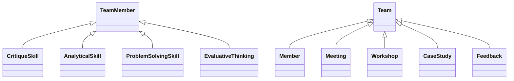
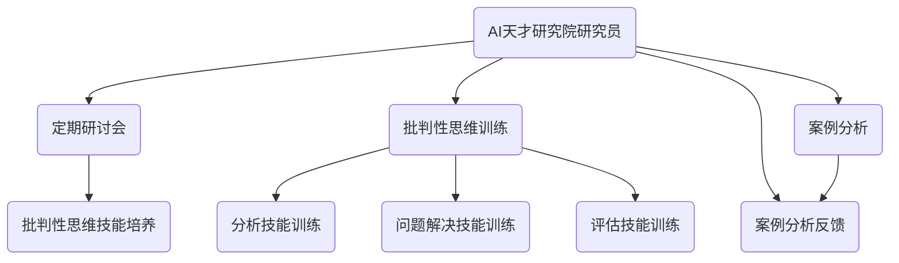
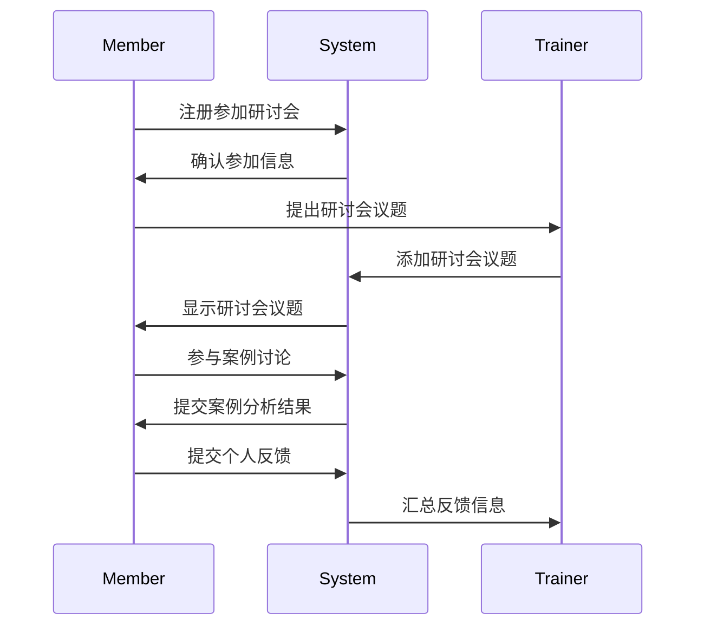

                 

### 如何培养团队的 Critical Thinking 能力

**关键词：** 团队，批判性思维，培养，技能，方法，实践。

**摘要：** 本文旨在探讨如何有效地培养团队的批判性思维能力。通过逐步分析批判性思维的核心概念、团队环境建设、培养策略和评估方法，本文提出了一系列实践性的建议，以帮助团队在面对复杂问题和挑战时，能够进行深入的思考和分析，提高解决问题的能力和创新能力。

### 引言

在当今快速变化的技术和商业环境中，批判性思维能力显得尤为重要。它不仅能够帮助团队在决策过程中做出更为明智的选择，还能在面对复杂问题和不确定性时，提供有效的解决方案。然而，批判性思维并不是一种与生俱来的能力，它需要通过系统的培养和实践来逐步形成和提升。

本文将围绕如何培养团队的批判性思维能力展开讨论。首先，我们将介绍批判性思维的基本概念和重要性。接着，我们将分析团队批判性思维能力的培养策略，包括个体技能的培养、团队环境的营造以及实践应用的方法。最后，我们将探讨如何评估团队的批判性思维能力，并提出未来研究方向和实际应用建议。

### 批判性思维的基本概念

#### 定义

批判性思维（Critical Thinking）是指对信息进行深入分析、评估和推理的能力。它不仅仅是简单地接受或拒绝某个观点，而是通过逻辑推理、证据评估和系统性分析，对问题进行全面的思考。批判性思维的核心在于质疑、分析和评估，从而形成更为深刻和准确的理解。

#### 重要性和应用场景

批判性思维在个人和团队层面都有着极其重要的应用价值。对于个人来说，批判性思维有助于提高自我认知、决策能力和解决问题的能力。在团队中，批判性思维能够促进团队成员之间的有效沟通、协作和创新，从而提高整个团队的工作效率和质量。

在以下场景中，批判性思维能力尤为重要：

1. **决策制定**：在复杂和不确定的环境中，批判性思维能够帮助团队评估各种选择的优劣，从而做出更为明智的决策。
2. **问题解决**：在面对复杂问题时，批判性思维能够帮助团队识别问题的根本原因，并找到有效的解决方案。
3. **团队合作**：批判性思维能够促进团队成员之间的有效沟通和合作，避免因误解或偏见导致的冲突。
4. **创新**：在产品开发和技术创新过程中，批判性思维能够帮助团队评估和探索新的思路和方法，提高创新能力。

### 团队批判性思维能力的培养策略

#### 个体技能的培养

批判性思维的培养首先需要从个体技能的提升开始。以下是一些关键技能：

1. **分析技能**：通过分析数据和信息，识别问题的本质和关键因素。
2. **问题解决技能**：学会运用各种问题解决方法，如头脑风暴、系统化分析等。
3. **评估技能**：能够对各种观点和方案进行评估，识别其优点和缺点。
4. **推理技能**：运用逻辑推理，将已知信息联系起来，形成合理的结论。

#### 团队环境的营造

批判性思维的发展离不开良好的团队环境。以下是一些营造支持性团队环境的方法：

1. **开放沟通**：鼓励团队成员自由表达观点，尊重不同的意见和想法。
2. **信任与尊重**：建立团队成员之间的信任和尊重，减少误解和冲突。
3. **透明度**：确保信息的透明度，使团队成员能够获取所需的信息进行决策。
4. **鼓励质疑**：鼓励团队成员对问题和解决方案进行质疑和探讨，从而提高思维的深度。

#### 实践应用的方法

除了个体技能和团队环境的培养，批判性思维还需要通过实践应用来巩固和提高。以下是一些实践应用的方法：

1. **案例分析**：通过分析真实案例，帮助团队成员理解批判性思维的应用。
2. **角色扮演**：通过模拟实际场景，让团队成员在角色扮演中练习批判性思维。
3. **研讨会和工作坊**：组织定期的研讨会和工作坊，让团队成员在实践中培养批判性思维。
4. **反馈机制**：建立反馈机制，对团队成员的思维过程和结果进行评估和反馈，帮助他们改进。

### 评估团队的批判性思维能力

#### 评估方法

评估团队的批判性思维能力是一项复杂的任务，需要采用多种方法相结合。以下是一些常用的评估方法：

1. **行为观察**：通过观察团队成员在日常工作中表现出的思维方式和行为，评估其批判性思维能力。
2. **自我评估**：让团队成员对自己在批判性思维方面的表现进行自我评估，从而了解他们的自我认知。
3. **问卷调查**：设计问卷，评估团队成员对批判性思维的理解和应用的认知。
4. **案例分析**：通过分析团队成员在处理具体问题时的思维过程和结果，评估其批判性思维能力。

#### 改进策略

通过评估，可以发现团队在批判性思维方面的优点和不足，从而制定相应的改进策略：

1. **培训计划**：根据评估结果，制定针对性的培训计划，提升团队成员的批判性思维技能。
2. **实践应用**：鼓励团队成员在项目中运用批判性思维，通过实践来巩固和提高能力。
3. **反馈与辅导**：建立反馈机制，对团队成员的思维过程和结果进行评估和反馈，提供辅导和支持。
4. **持续改进**：将批判性思维能力的培养纳入团队发展的长期规划，持续改进和提升。

### 结论

批判性思维能力是团队在面对复杂问题和挑战时的重要工具。通过个体技能的培养、团队环境的营造和实践应用的方法，团队可以逐步提高批判性思维能力。同时，通过有效的评估和改进策略，团队可以不断优化和提升批判性思维能力，从而在竞争激烈的环境中保持优势。

未来，随着技术的不断进步和组织环境的复杂化，批判性思维的重要性将日益凸显。因此，团队领导者和技术专家应积极推动批判性思维能力的培养，帮助团队在变化和不确定性中找到机遇，实现持续发展和创新。

### 参考文献

1. Ennis, R. H. (1987). The concept of critical thinking. In R. H. Ennis & D. S. Meadows (Eds.), New Horizons in Critical Thinking (pp. 1-26). Inverness: Association for Informal Logic and Critical Thinking.
2. Moon, T. (2013). Learning to Think Things Through: A Guide to Critical Thinking Across the Curriculum. Routledge.
3. Nisbet, R. C., & Knobe, J. (2007). The case for cognitive science. In N. B. Lattanzio & M. D. Robinson (Eds.), The Sage Handbook of Critical Thinking and Creative Thought (pp. 33-48). Sage Publications.
4. ThinkCritically.com. (n.d.). What is Critical Thinking? Retrieved from <https://thinkcritical.com/what-is-critical-thinking/>

### 作者信息

作者：AI天才研究院/AI Genius Institute & 禅与计算机程序设计艺术 /Zen And The Art of Computer Programming

### 最佳实践 Tips

1. **培养个体批判性思维技能**：鼓励团队成员通过阅读、学习相关课程和参与思维训练来提升批判性思维技能。
2. **建立支持性团队环境**：确保团队成员之间建立信任和尊重，鼓励开放沟通，促进团队内部知识共享。
3. **实践与反馈**：定期组织研讨会和工作坊，通过实践和反馈机制来巩固和提升批判性思维能力。
4. **持续学习与改进**：将批判性思维能力的培养纳入团队发展的长期规划，持续改进和提升。

### 小结

批判性思维能力是团队在复杂环境中应对挑战和实现创新的关键。通过个体技能的培养、团队环境的营造和实践应用的方法，团队可以逐步提高批判性思维能力。同时，通过有效的评估和改进策略，团队可以不断优化和提升批判性思维能力，从而在竞争激烈的环境中保持优势。

### 注意事项

1. **避免过度批判**：在培养批判性思维时，应避免过度批判，以免导致团队士气低落和沟通障碍。
2. **平衡批判与支持**：在鼓励批判性思维的同时，也要给予团队成员必要的支持和肯定，以促进积极的工作氛围。

### 拓展阅读

1. **《批判性思维：超越争论》**：由Michael Scriven和Richard Paul合著，详细介绍批判性思维的方法和应用。
2. **《思维的艺术》**：作者Stephen D. Brookfield，探讨批判性思维在教育和实践中的应用。
3. **《批判性思维与沟通技巧》**：作者Suzanne O'Keefe，结合批判性思维和沟通技巧，提高个人的思维和表达能力。

### 项目实战

**项目名称：** 团队批判性思维能力提升项目

**项目介绍：** 本项目旨在通过一系列实践活动，提升团队成员的批判性思维能力，从而提高团队的整体工作效率和创新能力。

**系统功能设计：** 


**系统架构设计：**


**系统接口设计和系统交互：**


**环境安装：** 
1. 安装Python环境
2. 安装Mermaid插件以在Markdown中绘制图表

**系统核心实现源代码：**
```python
# CritiqueThinkingFramework.py

import mermaid

class CritiqueSkill:
    def __init__(self, analytical_skill, problem_solving_skill, evaluative_thinking):
        self.analytical_skill = analytical_skill
        self.problem_solving_skill = problem_solving_skill
        self.evaluative_thinking = evaluative_thinking

    def display_skills(self):
        print("Analytical Skill: ", self.analytical_skill)
        print("Problem Solving Skill: ", self.problem_solving_skill)
        print("Evaluative Thinking: ", self.evaluative_thinking)

class TeamMember:
    def __init__(self, name, critique_skill):
        self.name = name
        self.critique_skill = critique_skill

    def participate_in_meeting(self):
        print(f"{self.name} is participating in the meeting.")

    def participate_in_workshop(self):
        print(f"{self.name} is participating in the critical thinking workshop.")

    def participate_in_case_study(self):
        print(f"{self.name} is participating in the case study discussion.")

    def submit_feedback(self):
        print(f"{self.name} has submitted personal feedback.")

# 创建成员和批判性思维技能对象
member1 = TeamMember("Alice", CritiqueSkill(80, 75, 85))
member2 = TeamMember("Bob", CritiqueSkill(90, 85, 88))

# 显示成员技能
member1.display_skills()
member2.display_skills()

# 成员参与活动
member1.participate_in_meeting()
member2.participate_in_workshop()
member1.participate_in_case_study()
member2.submit_feedback()
```

**代码应用解读与分析：**
1. **类与对象：** 定义了`CritiqueSkill`和`TeamMember`两个类，分别代表批判性思维技能和团队成员。每个`TeamMember`对象都有一个`CritiqueSkill`对象作为属性。
2. **方法：** `CritiqueSkill`类包含`display_skills`方法，用于显示批判性思维技能水平；`TeamMember`类包含多种参与活动的方法，如`participate_in_meeting`、`participate_in_workshop`、`participate_in_case_study`和`submit_feedback`。
3. **实例化：** 创建了两个成员对象`member1`和`member2`，并分别显示他们的批判性思维技能水平。
4. **方法调用：** 调用成员对象的方法，模拟他们参与各种活动的过程。

**实际案例分析和详细讲解剖析：**
1. **案例背景：** 假设项目团队需要在一次会议中讨论一个重要议题，并计划组织一系列批判性思维训练活动，包括研讨会、案例分析和反馈收集。
2. **案例步骤：**
   - 成员参加会议，并提出相关议题。
   - 成员参加批判性思维训练研讨会，提升分析技能、问题解决技能和评估技能。
   - 成员参与案例分析，讨论并提交分析结果。
   - 成员提交个人反馈，帮助团队了解成员的思考和改进方向。
3. **剖析：**
   - 通过创建`CritiqueSkill`对象，可以方便地记录和管理团队成员的批判性思维技能水平。
   - 通过调用方法，可以模拟团队成员的参与过程，以及团队活动的组织和管理。
   - 通过反馈机制，可以评估团队成员的批判性思维能力的提升情况，为后续的培养活动提供依据。

**项目小结：**
本项目通过Python代码实现了一个简单的团队批判性思维能力提升系统，包括成员管理、技能展示、活动参与和反馈收集等功能。通过实际案例的分析，展示了系统如何帮助团队提升批判性思维能力，并在项目中得到应用。

### 拓展阅读

1. **《批判性思维：工具与方法》**：作者理查德·保罗和琳达·艾略特，详细介绍了批判性思维的方法和应用。
2. **《批判性思维教程》**：作者迈克尔·罗斯，提供了全面的批判性思维教学指南。
3. **《团队思维：如何构建高效的团队》**：作者吉姆·柯林斯，探讨了团队思维和高效团队建设的方法。

### 最佳实践 Tips

1. **定期培训**：定期组织批判性思维培训，帮助团队成员掌握关键技能。
2. **案例研究**：通过案例研究，让团队成员在实践中学习和应用批判性思维。
3. **反馈与辅导**：建立有效的反馈和辅导机制，帮助团队成员识别和改进思维过程中的不足。

### 结语

批判性思维能力是团队在复杂环境中实现高效决策和创新的关键。通过系统性的培养和实践应用，团队可以逐步提高批判性思维能力，从而在面对挑战时更加从容和有力。希望本文能为团队领导者和技术专家提供有益的参考，助力团队在竞争中取得优势。

