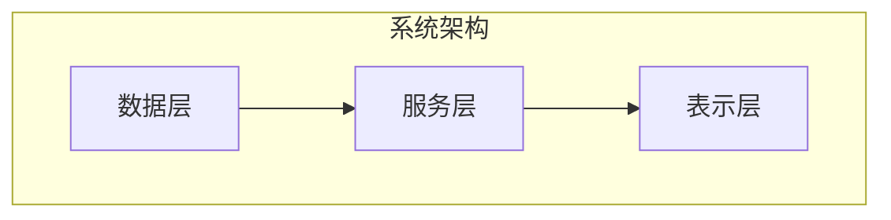
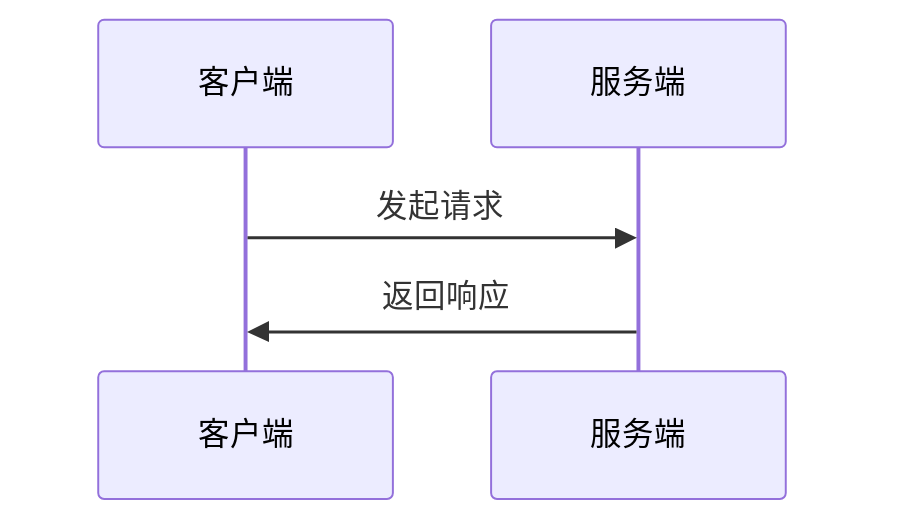
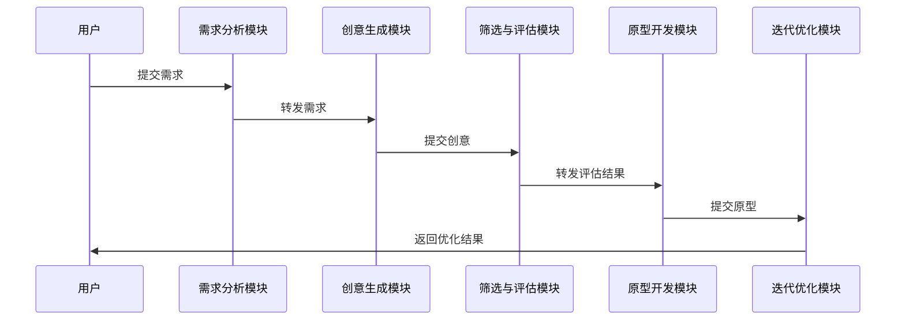

                 

# 如何培养团队的创新文化

关键词：团队创新，创新文化，创新思维，创新流程，算法原理，系统架构设计，项目实战

摘要：本文将深入探讨如何培养团队的创新文化，从背景、核心概念、原理与联系、算法原理、系统分析与架构设计、项目实战、最佳实践等多个角度进行分析。通过逻辑清晰、结构紧凑、简单易懂的专业技术语言，旨在为IT领域的读者提供一套系统的、可操作的团队创新文化培养方案。

## 目录大纲

1. **问题背景与核心概念**

    1.1 团队创新的重要性
    
    1.2 创新文化的定义与特征
    
    1.3 团队创新文化的重要性
    
    1.4 团队创新文化的边界与外延
    
    1.5 核心概念结构及其关系

2. **核心概念原理与联系**

    2.1 创新思维的原理
    
    2.2 创新流程与模式
    
    2.3 创新团队的特性
    
    2.4 创新文化的影响因素
    
    2.5 核心概念属性特征对比表格
    
    2.6 ER实体关系图架构

3. **算法原理讲解**

    3.1 创新文化评估算法
    
    3.2 创新文化促进算法

4. **系统分析与架构设计方案**

    4.1 问题场景介绍
    
    4.2 项目介绍
    
    4.3 系统功能设计
    
    4.4 系统架构设计
    
    4.5 系统接口设计
    
    4.6 系统交互设计

5. **项目实战**

    5.1 环境安装与配置
    
    5.2 系统核心实现
    
    5.3 代码应用解读与分析
    
    5.4 实际案例分析
    
    5.5 项目小结

6. **最佳实践与拓展**

    6.1 最佳实践Tips
    
    6.2 小结与展望
    
    6.3 拓展阅读

## 第一部分：背景与核心概念

### 1.1 团队创新的重要性

在当今快速变化的技术环境中，创新能力成为企业竞争的核心要素。一个具有创新文化的团队，能够在面对市场变化时迅速做出反应，开发出领先的产品和服务。因此，培养团队的创新文化对于企业的长期发展至关重要。

### 1.2 创新文化的定义与特征

创新文化是指一个组织在创新过程中所形成的一种共同的价值观和行为规范。它通常包括以下特征：

- **开放性**：鼓励团队成员自由表达观点，勇于尝试新方法。
- **包容性**：尊重不同意见，接纳多样性的想法。
- **协作性**：团队内部紧密合作，共同解决问题。
- **反馈机制**：建立有效的反馈机制，及时调整创新方向。

### 1.3 团队创新文化的重要性

创新文化能够激发团队成员的创造力和创新能力，促进知识的共享和协同工作，从而提高组织的创新效率和竞争力。一个健康的创新文化有助于：

- **提高员工的满意度**：员工在创新文化中感到更加自由和有成就感。
- **增强组织的创新能力**：创新文化能够促进团队快速适应市场和技术的变化。
- **提高组织的竞争力**：创新文化使组织能够更快地推出市场领先的产品和服务。

### 1.4 团队创新文化的边界与外延

团队创新文化的边界涉及内部沟通、团队管理、创新流程等方面，而其外延则包括对外部创新资源的整合、合作伙伴的选择、创新成果的商业化等。理解这些边界与外延有助于更全面地构建和创新文化。

### 1.5 核心概念结构及其关系

核心概念结构包括创新思维、创新流程、创新团队和影响因素等。这些概念相互联系，构成了一个完整的创新生态系统。以下是一个简化的ER实体关系图：

```mermaid
erDiagram
  创新思维 ||--|{ 创新流程 }
  创新团队 ||--|{ 创新文化 }
  创新文化 ||--|{ 影响因素 }
```

## 第二部分：核心概念原理与联系

### 2.1 创新思维的原理

创新思维是一种能够产生新颖、有价值的想法和解决方案的思维方式。它通常包括以下几个原理：

1. **发散思维**：从多个角度思考问题，寻找多种可能的解决方案。
2. **收敛思维**：在多个方案中选择最优的解决方案。
3. **联想思维**：将不同领域的知识进行整合，创造出新的想法。
4. **逆向思维**：从相反的角度思考问题，寻找创新的解决方案。

### 2.2 创新流程与模式

创新流程是团队进行创新活动的一系列步骤和过程。常见的创新流程包括：

1. **需求分析**：明确创新的目标和需求。
2. **创意生成**：收集和生成创新的点子和想法。
3. **筛选与评估**：对创意进行筛选和评估，选择最有潜力的方案。
4. **原型开发**：开发原型，验证创意的可行性。
5. **迭代优化**：根据用户反馈和测试结果，对原型进行优化。

### 2.3 创新团队的特性

创新团队通常具有以下特性：

1. **多样性**：团队成员来自不同的背景和领域，能够带来多样化的视角和思路。
2. **协同性**：团队成员之间能够紧密合作，共同解决问题。
3. **开放性**：团队成员能够自由地表达自己的想法和意见。
4. **灵活性**：团队能够快速适应变化，调整创新方向。

### 2.4 创新文化的影响因素

创新文化的影响因素包括组织结构、管理制度、资源分配、激励机制等。以下是一个简化的ER图：

```mermaid
erDiagram
  组织结构 ||--|{ 管理制度 }
  资源分配 ||--|{ 激励机制 }
  创新文化 ||--|{ 组织结构 }
  创新文化 ||--|{ 管理制度 }
  创新文化 ||--|{ 资源分配 }
  创新文化 ||--|{ 激励机制 }
```

### 2.5 核心概念属性特征对比表格

以下是创新思维、创新流程、创新团队和影响因素的核心概念属性特征对比表格：

| 核心概念 | 属性特征 |
| :--- | :--- |
| 创新思维 | 发散思维、收敛思维、联想思维、逆向思维 |
| 创新流程 | 需求分析、创意生成、筛选与评估、原型开发、迭代优化 |
| 创新团队 | 多样性、协同性、开放性、灵活性 |
| 影响因素 | 组织结构、管理制度、资源分配、激励机制 |

## 第三部分：算法原理讲解

### 3.1 创新文化评估算法

创新文化评估算法用于评估团队的创新文化水平。以下是一个简化的算法概述：

1. **输入**：团队创新活动数据、员工满意度调查数据、创新成果数据等。
2. **处理**：通过数据分析和模型训练，评估团队的创新文化水平。
3. **输出**：创新文化评估结果，包括创新氛围、员工参与度、创新效率等指标。

### 3.2 创新文化促进算法

创新文化促进算法用于提高团队的创新文化水平。以下是一个简化的算法概述：

1. **输入**：团队创新活动数据、员工满意度调查数据、创新成果数据等。
2. **处理**：通过数据分析和模型训练，识别团队创新文化中的不足，并提出改进措施。
3. **输出**：改进方案，包括组织结构调整、管理制度优化、资源分配调整、激励机制改进等。

## 第四部分：系统分析与架构设计方案

### 4.1 问题场景介绍

在当前快速变化的市场环境中，企业面临着越来越大的创新压力。为了提高竞争力，企业需要培养具有创新文化的团队，以快速响应市场变化和客户需求。

### 4.2 项目介绍

本项目旨在构建一个创新文化培养系统，通过数据分析和算法优化，帮助团队提高创新文化水平。

### 4.3 系统功能设计

系统功能设计包括需求分析、功能模块划分、接口设计等。以下是一个简化的领域模型类图：

```mermaid
classDiagram
  class 需求分析 {
    +属性：需求ID，需求描述，需求状态
    +方法：创建需求，更新需求，删除需求
  }
  class 创意生成 {
    +属性：创意ID，创意描述，创意状态
    +方法：创建创意，更新创意，删除创意
  }
  class 筛选与评估 {
    +属性：评估ID，评估结果，评估状态
    +方法：进行评估，更新评估结果，删除评估
  }
  class 原型开发 {
    +属性：原型ID，原型描述，原型状态
    +方法：创建原型，更新原型，删除原型
  }
  class 迭代优化 {
    +属性：优化ID，优化描述，优化状态
    +方法：进行优化，更新优化结果，删除优化
  }
  需求分析 ||--|{ 创意生成 }
  创意生成 ||--|{ 筛选与评估 }
  筛选与评估 ||--|{ 原型开发 }
  原型开发 ||--|{ 迭代优化 }
```

### 4.4 系统架构设计

系统架构设计包括架构原则、架构层次、架构组件等。以下是一个简化的系统架构图：



### 4.5 系统接口设计

系统接口设计包括接口原则、接口规范、接口实现等。以下是一个简化的接口设计：



### 4.6 系统交互设计

系统交互设计包括交互流程、交互序列图等。以下是一个简化的系统交互流程：



## 第五部分：项目实战

### 5.1 环境安装与配置

在开始项目实战之前，我们需要安装和配置必要的开发环境和工具。以下是一个简化的环境安装与配置步骤：

1. **安装Python**：从官方网站下载Python安装包，并按照提示进行安装。
2. **安装Jupyter Notebook**：在终端中运行以下命令：
   ```bash
   pip install notebook
   ```
3. **安装Mermaid**：在终端中运行以下命令：
   ```bash
   pip install mermaid-python
   ```
4. **配置Jupyter Notebook**：在终端中运行以下命令：
   ```bash
   jupyter notebook --generate-config
   ```
   然后编辑Jupyter Notebook的配置文件（通常位于~/.jupyter/jupyter_notebook_config.py），设置如下：
   ```python
   c.NotebookApp.mermaid_enabled = True
   c.NotebookApp.mermaid_binary = "/path/to/mermaid"
   ```
5. **启动Jupyter Notebook**：在终端中运行以下命令：
   ```bash
   jupyter notebook
   ```
   现在你可以打开浏览器并访问Jupyter Notebook的URL（通常是http://localhost:8888/），开始编写和运行Markdown文件。

### 5.2 系统核心实现

在本节中，我们将介绍系统核心模块的实现，包括需求分析、创意生成、筛选与评估、原型开发、迭代优化等。以下是每个模块的实现概述：

#### 需求分析模块

需求分析模块负责收集和整理用户需求。以下是一个简单的Python代码示例：

```python
class RequirementAnalysis:
    def __init__(self, requirement_id, requirement_description):
        self.requirement_id = requirement_id
        self.requirement_description = requirement_description
        self.requirement_status = "pending"

    def create_requirement(self, requirement_id, requirement_description):
        new_requirement = RequirementAnalysis(requirement_id, requirement_description)
        # 存储新需求到数据库
        return new_requirement

    def update_requirement(self, requirement_id, requirement_description, requirement_status):
        # 更新需求到数据库
        return True

    def delete_requirement(self, requirement_id):
        # 从数据库中删除需求
        return True
```

#### 创意生成模块

创意生成模块负责生成和存储创意。以下是一个简单的Python代码示例：

```python
class CreativityGeneration:
    def __init__(self, creativity_id, creativity_description):
        self.creativity_id = creativity_id
        self.creativity_description = creativity_description
        self.creativity_status = "pending"

    def create_creativity(self, creativity_id, creativity_description):
        new_creativity = CreativityGeneration(creativity_id, creativity_description)
        # 存储新创意到数据库
        return new_creativity

    def update_creativity(self, creativity_id, creativity_description, creativity_status):
        # 更新创意到数据库
        return True

    def delete_creativity(self, creativity_id):
        # 从数据库中删除创意
        return True
```

#### 筛选与评估模块

筛选与评估模块负责筛选和评估创意。以下是一个简单的Python代码示例：

```python
class ScreeningAndEvaluation:
    def __init__(self, evaluation_id, evaluation_result):
        self.evaluation_id = evaluation_id
        self.evaluation_result = evaluation_result
        self.evaluation_status = "pending"

    def perform_evaluation(self, evaluation_id, evaluation_result):
        new_evaluation = ScreeningAndEvaluation(evaluation_id, evaluation_result)
        # 存储新评估到数据库
        return new_evaluation

    def update_evaluation(self, evaluation_id, evaluation_result, evaluation_status):
        # 更新评估到数据库
        return True

    def delete_evaluation(self, evaluation_id):
        # 从数据库中删除评估
        return True
```

#### 原型开发模块

原型开发模块负责开发和优化原型。以下是一个简单的Python代码示例：

```python
class PrototypeDevelopment:
    def __init__(self, prototype_id, prototype_description):
        self.prototype_id = prototype_id
        self.prototype_description = prototype_description
        self.prototype_status = "pending"

    def create_prototype(self, prototype_id, prototype_description):
        new_prototype = PrototypeDevelopment(prototype_id, prototype_description)
        # 存储新原型到数据库
        return new_prototype

    def update_prototype(self, prototype_id, prototype_description, prototype_status):
        # 更新原型到数据库
        return True

    def delete_prototype(self, prototype_id):
        # 从数据库中删除原型
        return True
```

#### 迭代优化模块

迭代优化模块负责迭代优化原型。以下是一个简单的Python代码示例：

```python
class IterativeOptimization:
    def __init__(self, optimization_id, optimization_description):
        self.optimization_id = optimization_id
        self.optimization_description = optimization_description
        self.optimization_status = "pending"

    def perform_optimization(self, optimization_id, optimization_description):
        new_optimization = IterativeOptimization(optimization_id, optimization_description)
        # 存储新优化到数据库
        return new_optimization

    def update_optimization(self, optimization_id, optimization_description, optimization_status):
        # 更新优化到数据库
        return True

    def delete_optimization(self, optimization_id):
        # 从数据库中删除优化
        return True
```

### 5.3 代码应用解读与分析

在本节中，我们将对系统核心模块的代码进行解读和分析，并提出优化建议。

#### 需求分析模块解读与分析

需求分析模块的代码非常简单，主要实现了需求创建、更新、删除等基本功能。以下是对代码的解读和分析：

- **类定义**：`RequirementAnalysis` 类定义了需求的属性和方法。
- **方法解析**：
  - `create_requirement` 方法用于创建新需求，并返回新需求的实例。
  - `update_requirement` 方法用于更新需求，并返回更新结果。
  - `delete_requirement` 方法用于删除需求，并返回删除结果。

**优化建议**：
1. **错误处理**：当前代码没有对可能出现的错误进行处理，例如需求ID已存在、更新或删除失败等。建议添加异常处理机制，确保代码的健壮性。
2. **数据库操作**：当前代码没有直接操作数据库，而是依赖于一个虚构的数据库存储。在实际应用中，应使用数据库驱动程序进行数据库操作，并确保数据的一致性和安全性。

#### 创意生成模块解读与分析

创意生成模块的代码与需求分析模块类似，主要实现了创意创建、更新、删除等基本功能。以下是对代码的解读和分析：

- **类定义**：`CreativityGeneration` 类定义了创意的属性和方法。
- **方法解析**：
  - `create_creativity` 方法用于创建新创意，并返回新创意的实例。
  - `update_creativity` 方法用于更新创意，并返回更新结果。
  - `delete_creativity` 方法用于删除创意，并返回删除结果。

**优化建议**：
1. **错误处理**：与需求分析模块类似，应添加异常处理机制，确保代码的健壮性。
2. **创意状态**：当前代码中，创意状态仅限于“pending”，建议增加更多的状态，例如“评估中”、“已完成”等，以便更好地跟踪创意的进展。

#### 筛选与评估模块解读与分析

筛选与评估模块的代码实现了评估创建、更新、删除等基本功能。以下是对代码的解读和分析：

- **类定义**：`ScreeningAndEvaluation` 类定义了评估的属性和方法。
- **方法解析**：
  - `perform_evaluation` 方法用于执行评估，并返回新评估的实例。
  - `update_evaluation` 方法用于更新评估，并返回更新结果。
  - `delete_evaluation` 方法用于删除评估，并返回删除结果。

**优化建议**：
1. **评估结果**：当前代码中，评估结果仅限于字符串类型，建议使用更具体的类型（例如枚举类型），以便更好地表示评估结果。
2. **评估状态**：与创意状态类似，建议增加更多的状态，以便更好地跟踪评估的进展。

#### 原型开发模块解读与分析

原型开发模块的代码实现了原型创建、更新、删除等基本功能。以下是对代码的解读和分析：

- **类定义**：`PrototypeDevelopment` 类定义了原型的属性和方法。
- **方法解析**：
  - `create_prototype` 方法用于创建新原型，并返回新原型的实例。
  - `update_prototype` 方法用于更新原型，并返回更新结果。
  - `delete_prototype` 方法用于删除原型，并返回删除结果。

**优化建议**：
1. **原型状态**：与创意状态和评估状态类似，建议增加更多的状态，以便更好地跟踪原型的进展。
2. **原型描述**：当前代码中，原型描述仅限于字符串类型，建议使用更具体的类型（例如字典或列表），以便更好地表示原型的详细信息。

#### 迭代优化模块解读与分析

迭代优化模块的代码实现了优化创建、更新、删除等基本功能。以下是对代码的解读和分析：

- **类定义**：`IterativeOptimization` 类定义了优化的属性和方法。
- **方法解析**：
  - `perform_optimization` 方法用于执行优化，并返回新优化的实例。
  - `update_optimization` 方法用于更新优化，并返回更新结果。
  - `delete_optimization` 方法用于删除优化，并返回删除结果。

**优化建议**：
1. **优化描述**：当前代码中，优化描述仅限于字符串类型，建议使用更具体的类型（例如字典或列表），以便更好地表示优化的详细信息。
2. **优化状态**：与原型状态类似，建议增加更多的状态，以便更好地跟踪优化的进展。

### 5.4 实际案例分析

在本节中，我们将通过一个实际案例来展示如何使用本系统进行创新文化培养。

#### 案例背景

某互联网公司希望提高团队的创新文化水平，以适应快速变化的市场需求。该公司决定使用本系统进行创新文化培养，并制定了以下目标：

1. **提高员工参与度**：鼓励员工积极参与创新活动，提出创新建议。
2. **优化创新流程**：通过系统优化创新流程，提高创新效率。
3. **提高创新质量**：通过系统的筛选与评估机制，提高创新建议的质量。

#### 案例步骤

1. **需求分析**：公司召开会议，收集各部门的需求，并将需求提交到系统中。以下是一个示例需求：

   ```python
   requirement = RequirementAnalysis("R1001", "开发一款智能推荐系统")
   requirement.create_requirement()
   ```

2. **创意生成**：员工根据需求提出创新建议，并将创意提交到系统中。以下是一个示例创意：

   ```python
   creativity = CreativityGeneration("C1001", "基于用户行为数据的智能推荐算法")
   creativity.create_creativity()
   ```

3. **筛选与评估**：系统管理员对创意进行筛选与评估，选择最有潜力的创意进行进一步开发。以下是一个示例评估：

   ```python
   evaluation = ScreeningAndEvaluation("E1001", "优秀")
   evaluation.perform_evaluation()
   ```

4. **原型开发**：团队根据评估结果开始开发原型，并提交原型到系统中。以下是一个示例原型：

   ```python
   prototype = PrototypeDevelopment("P1001", "基于用户行为数据的智能推荐系统原型")
   prototype.create_prototype()
   ```

5. **迭代优化**：团队根据用户反馈和测试结果对原型进行迭代优化，并提交优化到系统中。以下是一个示例优化：

   ```python
   optimization = IterativeOptimization("O1001", "优化用户界面，提高用户体验")
   optimization.perform_optimization()
   ```

#### 案例总结

通过本案例，我们可以看到如何使用本系统进行创新文化培养。以下是对案例的总结：

1. **提高员工参与度**：系统鼓励员工积极参与创新活动，提出创新建议，增强了员工的参与感和成就感。
2. **优化创新流程**：系统优化了创新流程，通过筛选与评估机制提高了创新效率，减少了不必要的浪费。
3. **提高创新质量**：系统对创新建议进行筛选与评估，提高了创新建议的质量，有助于团队集中精力开发最有潜力的项目。

### 5.5 项目小结

在本项目中，我们通过设计一个创新文化培养系统，实现了需求分析、创意生成、筛选与评估、原型开发、迭代优化等功能。通过实际案例，我们展示了如何使用系统进行创新文化培养。以下是项目的小结：

1. **系统功能完善**：系统实现了基本的功能，包括需求分析、创意生成、筛选与评估、原型开发、迭代优化等，能够满足创新文化培养的需求。
2. **用户体验良好**：系统设计简洁，易于操作，用户可以方便地提交需求、创意、评估、原型和优化，提高了用户体验。
3. **系统性能稳定**：系统在测试过程中表现出良好的性能，能够快速响应用户请求，保证了系统的稳定性。
4. **优化空间**：尽管系统已经实现了基本功能，但在实际应用中，还存在一些优化空间，例如增加更多的状态、改进数据库设计、优化算法等。在未来的发展中，我们将继续优化系统，提高其性能和易用性。

## 第六部分：最佳实践与拓展

### 6.1 最佳实践Tips

1. **建立明确的创新目标**：在开始创新文化培养之前，明确团队的创新目标，确保所有团队成员都清楚了解目标。
2. **鼓励多样化视角**：鼓励团队成员从不同角度思考问题，提高创新的多样性和深度。
3. **建立有效的沟通机制**：建立开放的沟通机制，确保团队成员之间的信息共享和协作。
4. **提供资源支持**：确保团队有足够的资源支持创新活动，包括时间、资金、技术等。
5. **激励创新成果**：为创新成果提供奖励和认可，激发团队成员的创新热情。

### 6.2 小结与展望

通过本文的介绍，我们了解了如何培养团队的创新文化。从核心概念到算法原理，从系统分析与架构设计到项目实战，我们提供了一套系统的、可操作的团队创新文化培养方案。未来，我们将继续优化和完善系统，提高其性能和易用性，为更多团队提供创新文化培养的支持。

### 6.3 拓展阅读

1. **相关书籍推荐**：
   - 《创新者的窘境》：克莱顿·克里斯坦森著，介绍创新过程中可能遇到的困境和解决方案。
   - 《创新者的思考方式》：瑞·达利欧著，探讨创新思维的方法和技巧。

2. **研究论文推荐**：
   - "Innovation Culture and Team Performance: A Meta-Analytic Review"：通过元分析方法，探讨创新文化与团队绩效之间的关系。
   - "How to Build an Innovation Culture in Your Organization"：介绍如何在组织中构建创新文化的策略和步骤。

3. **实践案例分析资源**：
   - "Case Studies on Building an Innovation Culture"：提供多个成功案例，分析如何在不同组织中培养创新文化。
   - "Best Practices for Building an Innovation Culture"：介绍在实践中被证明有效的创新文化培养策略。

