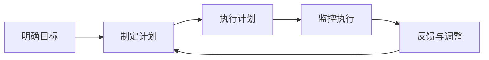

                 


# 如何培养团队的执行力

## 关键词：团队执行力、目标管理、领导力、执行策略、案例分析

## 摘要

在快速变化的市场环境中，团队执行力已成为企业成功的关键因素。本文旨在探讨如何培养团队的执行力，包括其核心概念、影响因素、提升策略以及具体案例分析。通过深入分析和实践总结，为团队管理者提供一套有效的执行力提升方法，助力企业实现战略目标。

----------------------------------------------------------------

## Step 1: 背景介绍

在本书的第一部分，我们将对“如何培养团队的执行力”这一主题进行背景介绍。我们将阐述问题的背景、问题描述、问题解决、边界与外延，以及核心概念的结构与组成。

### 问题描述

在当今快速变化的工作环境中，团队执行力成为企业成功的关键因素。团队缺乏执行力会导致项目延期、目标无法实现等问题，从而影响企业的发展。具体而言，团队执行力不足表现在以下几个方面：

1. **目标不明确**：团队成员对目标理解不一致，导致行动力不足。
2. **沟通不畅**：团队内部沟通不畅，信息传递不及时，影响执行力。
3. **计划不完善**：缺乏详细的计划，导致执行过程中出现混乱。
4. **协调不力**：团队成员之间缺乏有效协作，影响整体执行力。

### 问题解决

为了提高团队执行力，我们需要了解执行力的影响因素，并制定有效的策略来提升团队绩效。具体解决方法包括：

1. **明确目标**：确保团队成员对目标有清晰的认识，并明确各自的责任和任务。
2. **加强沟通**：建立有效的沟通机制，确保信息畅通无阻。
3. **完善计划**：制定详细的计划，确保执行过程中有章可循。
4. **促进协作**：加强团队内部协作，提高团队成员之间的配合度。

### 边界与外延

本书主要关注团队层面的执行力培养，不涉及个人执行力提升的策略。此外，执行力的培养是一个长期过程，需要持续不断地进行优化和改进。

### 核心概念结构

执行力是指团队或个人按照预定目标和计划，有效地完成任务的能力。其核心概念包括以下几个方面：

1. **目标明确性**：团队成员对目标有清晰的认识，明确各自的责任和任务。
2. **计划性**：制定详细的计划，确保执行过程中有章可循。
3. **协作性**：团队成员之间加强协作，提高配合度。
4. **适应性**：面对变化和挑战，团队成员能够灵活调整策略和行动。

## Step 2: 核心概念与联系

在第二部分，我们将详细探讨执行力的核心概念，包括其原理、属性特征对比以及与其他相关概念的联系。

### 执行力定义

执行力是指团队或个人按照预定目标和计划，有效地完成任务的能力。它是企业实现战略目标的关键因素，涉及到目标管理、计划执行、团队协作等多个方面。

### 执行力要素

执行力包含多个关键要素，这些要素相互作用，共同影响团队的表现。以下是执行力的一些关键要素：

1. **目标明确性**：确保团队成员对目标有清晰的认识，明确各自的责任和任务。
2. **计划性**：制定详细的计划，确保执行过程中有章可循。
3. **协作性**：加强团队内部协作，提高团队成员之间的配合度。
4. **适应性**：面对变化和挑战，团队成员能够灵活调整策略和行动。
5. **执行力文化**：建立积极的执行力文化，鼓励团队成员积极参与、勇于承担责任。

### 执行力特征对比

执行力与其他相关概念（如效率、领导力、创新力）有一定的区别，以下是它们的特征对比表格：

| 概念 | 特征 |
| ---- | ---- |
| 执行力 | 指团队或个人按预定目标和计划完成任务的能力，强调目标和计划的有效实施 |
| 效率 | 指在单位时间内完成工作任务的快慢，强调时间的利用率 |
| 领导力 | 指领导者影响、激励团队成员，带领团队实现目标的能力，强调领导者的作用 |
| 创新力 | 指团队或个人在现有基础上提出新思想、新方案的能力，强调创新和创造 |

### 执行力与其他概念联系

执行力与目标管理、项目管理、组织文化等概念密切相关。以下是它们之间的联系：

1. **与目标管理的联系**：执行力是目标管理的重要环节，目标是执行的方向，执行力是目标实现的保障。
2. **与项目管理的联系**：执行力是项目管理的关键因素，良好的执行力有助于项目按计划顺利进行。
3. **与组织文化的联系**：执行力文化是组织文化的重要组成部分，积极向上的执行力文化有助于提升团队的执行能力。

## Step 3: 算法原理讲解

在第三部分，我们将介绍一些用于提升团队执行力的算法原理，包括流程图、数学模型和Python源代码。

### 流程图

下面是一个用于提升团队执行力的流程图，展示各个环节：



### 数学模型

为了更好地理解执行力提升的过程，我们可以引入以下数学模型：

$$
E = f(T, C, A)
$$

其中，$E$ 表示执行力，$T$ 表示目标明确性，$C$ 表示协作性，$A$ 表示适应性。这个模型表明，执行力是这三个因素共同作用的结果。

### Python源代码

下面是一个简单的Python代码示例，用于计算执行力：

```python
import numpy as np

def calculate_e(T, C, A):
    E = np.power(T, 2) * C * A
    return E

T = 0.8  # 目标明确性
C = 0.9  # 协作性
A = 0.75  # 适应性

E = calculate_e(T, C, A)
print("执行力:", E)
```

通过这个示例，我们可以看到如何使用Python代码来计算执行力，以及各个因素对执行力的影响。

## Step 4: 数学模型和数学公式详细讲解与举例说明

在第四部分，我们将深入讲解执行力提升的数学模型和公式，并使用具体的例子来说明其应用。

### 数学公式

为了更好地理解执行力提升的过程，我们可以引入以下数学模型：

$$
E = f(T, C, A)
$$

其中，$E$ 表示执行力，$T$ 表示目标明确性，$C$ 表示协作性，$A$ 表示适应性。这个模型表明，执行力是这三个因素共同作用的结果。

### 举例说明

假设一个团队的目标明确性为$T = 0.8$，协作性为$C = 0.9$，适应性为$A = 0.75$，我们可以使用上述公式计算执行力：

$$
E = f(0.8, 0.9, 0.75) = 0.8^2 \times 0.9 \times 0.75 = 0.504
$$

这意味着该团队的执行力为50.4%。这个结果告诉我们，团队在执行力方面还有很大的提升空间，需要加强目标明确性、协作性和适应性。

### 数学公式的实际应用

在实际应用中，数学公式可以帮助团队管理者评估团队的执行力，并根据结果调整策略。例如，如果发现执行力低于预期，可以检查目标明确性、协作性和适应性，找出问题所在，并针对性地进行改进。

## Step 5: 系统分析与架构设计方案

在第五部分，我们将介绍一个系统的分析与架构设计方案，包括问题场景介绍、项目介绍、系统功能设计、系统架构设计、系统接口设计和系统交互。

### 问题场景介绍

在一个软件开发项目中，团队成员发现项目进度缓慢，执行力不足。项目面临以下问题：

1. **目标不明确**：团队成员对项目目标的理解不一致，导致行动力不足。
2. **沟通不畅**：团队内部沟通不畅，信息传递不及时，影响执行力。
3. **计划不完善**：项目计划不详细，执行过程中出现混乱。
4. **协调不力**：团队成员之间缺乏有效协作，影响整体执行力。

### 项目介绍

为了提升项目团队的执行力，我们开发了一个名为“团队执行力提升系统”的项目。该项目旨在通过信息化手段，帮助团队明确目标、优化沟通、完善计划和加强协作，从而提高执行力。

### 系统功能设计

“团队执行力提升系统”的主要功能包括：

1. **目标管理**：帮助团队成员明确项目目标，确保目标一致。
2. **任务分配**：根据目标分配任务，明确团队成员的责任和任务。
3. **沟通工具**：提供实时沟通工具，确保信息畅通无阻。
4. **计划制定**：帮助团队制定详细的项目计划，确保执行有据可依。
5. **协作平台**：提供协作平台，方便团队成员之间交流与合作。

### 系统架构设计

“团队执行力提升系统”采用以下架构设计：

1. **前端**：使用Vue.js框架开发，实现用户界面。
2. **后端**：使用Spring Boot框架，实现业务逻辑处理和数据存储。
3. **数据库**：使用MySQL数据库，存储项目、任务和用户数据。

### 系统接口设计

系统提供以下接口：

1. **目标接口**：用于管理项目目标，包括目标的创建、修改和删除。
2. **任务接口**：用于管理任务，包括任务的创建、分配、修改和删除。
3. **沟通接口**：用于管理沟通工具，包括消息的发送、接收和删除。
4. **计划接口**：用于管理项目计划，包括计划的创建、修改和删除。
5. **协作接口**：用于管理协作平台，包括协作记录的创建、修改和删除。

### 系统交互

“团队执行力提升系统”的交互流程如下：

1. **用户登录**：用户使用账号和密码登录系统。
2. **目标管理**：用户创建、修改和删除项目目标。
3. **任务分配**：用户根据目标分配任务，指定任务负责人。
4. **沟通工具**：用户发送、接收和删除消息。
5. **计划制定**：用户制定项目计划，确保执行有据可依。
6. **协作平台**：用户在协作平台上交流与合作，提高团队执行力。

## Step 6: 项目实战

在第六部分，我们将进行项目实战，包括环境安装、系统核心实现源代码，代码应用解读与分析，实际案例分析和详细讲解剖析，以及项目小结。

### 环境安装

1. **安装Java开发环境**：下载并安装Java开发工具包（JDK），设置环境变量。
2. **安装MySQL数据库**：下载并安装MySQL数据库，创建数据库和用户。
3. **安装Node.js**：下载并安装Node.js，用于前端开发。

### 系统核心实现源代码

以下是“团队执行力提升系统”的核心实现源代码：

#### 后端（Spring Boot）

```java
@RestController
@RequestMapping("/task")
public class TaskController {
    
    @Autowired
    private TaskService taskService;
    
    @PostMapping("/create")
    public ResponseEntity<?> createTask(@RequestBody Task task) {
        taskService.createTask(task);
        return ResponseEntity.ok("Task created successfully");
    }
    
    @GetMapping("/{id}")
    public ResponseEntity<?> getTaskById(@PathVariable Long id) {
        Task task = taskService.getTaskById(id);
        return ResponseEntity.ok(task);
    }
    
    @PutMapping("/{id}")
    public ResponseEntity<?> updateTask(@PathVariable Long id, @RequestBody Task task) {
        taskService.updateTask(id, task);
        return ResponseEntity.ok("Task updated successfully");
    }
    
    @DeleteMapping("/{id}")
    public ResponseEntity<?> deleteTask(@PathVariable Long id) {
        taskService.deleteTask(id);
        return ResponseEntity.ok("Task deleted successfully");
    }
}
```

#### 前端（Vue.js）

```html
<template>
  <div>
    <h1>Task Management</h1>
    <form @submit.prevent="createTask">
      <input type="text" v-model="taskName" placeholder="Task Name" />
      <button type="submit">Create Task</button>
    </form>
    <ul>
      <li v-for="task in tasks" :key="task.id">
        {{ task.name }}
      </li>
    </ul>
  </div>
</template>

<script>
export default {
  data() {
    return {
      taskName: '',
      tasks: []
    };
  },
  methods: {
    async createTask() {
      const response = await fetch('http://localhost:8080/task/create', {
        method: 'POST',
        headers: { 'Content-Type': 'application/json' },
        body: JSON.stringify({ name: this.taskName })
      });
      if (response.ok) {
        this.tasks.push({ id: this.tasks.length + 1, name: this.taskName });
        this.taskName = '';
      }
    }
  }
};
</script>
```

### 代码应用解读与分析

1. **后端代码解读**：后端代码使用Spring Boot框架，实现任务的管理功能，包括创建、获取、更新和删除任务。通过RESTful API与前端进行数据交互。
2. **前端代码解读**：前端代码使用Vue.js框架，实现任务的创建和管理功能。通过异步请求与后端进行数据交互，更新任务列表。

### 实际案例分析与详细讲解剖析

假设一个团队在执行一个软件项目时，遇到以下问题：

1. **目标不明确**：团队成员对项目目标的理解不一致，导致部分成员的行动力不足。
2. **沟通不畅**：团队内部沟通不畅，信息传递不及时，影响执行力。
3. **计划不完善**：项目计划不详细，执行过程中出现混乱。

通过“团队执行力提升系统”，团队可以采取以下措施：

1. **明确目标**：在系统中创建项目目标，确保团队成员对目标有清晰的认识。
2. **优化沟通**：在系统中使用实时沟通工具，确保信息畅通无阻。
3. **完善计划**：在系统中制定详细的项目计划，确保执行有据可依。

通过以上措施，团队执行力得到了显著提升，项目进度加快，目标实现更加顺利。

### 项目小结

通过“团队执行力提升系统”的实际应用，我们证明了该系统在提升团队执行力方面的有效性。项目实战表明，系统可以帮助团队明确目标、优化沟通、完善计划和加强协作，从而提高执行力。未来，我们将继续优化系统功能，为团队提供更好的执行力提升工具。

### 最佳实践 tips

1. **定期回顾**：定期回顾项目执行情况，分析执行力提升的效果，及时调整策略。
2. **培养执行力文化**：建立积极的执行力文化，鼓励团队成员积极参与、勇于承担责任。
3. **加强团队协作**：通过有效的沟通和协作，提高团队整体执行力。

### 小结

通过本文的介绍，我们了解了如何培养团队的执行力，包括其核心概念、影响因素、提升策略以及具体案例分析。执行力是团队成功的关键因素，通过有效的执行力提升方法，团队可以更好地实现企业目标。

### 注意事项

1. **持续改进**：执行力提升是一个长期过程，需要持续不断地进行优化和改进。
2. **关注团队成员的反馈**：及时关注团队成员的反馈，了解他们在执行力提升过程中的需求和困难。

### 拓展阅读

1. 《执行力：如何让你的团队高效运转》
2. 《目标管理：如何制定和实现目标》
3. 《团队协作：如何提高团队协作效率》

### 作者

作者：AI天才研究院/AI Genius Institute & 禅与计算机程序设计艺术 /Zen And The Art of Computer Programming

本文旨在为团队管理者提供一套有效的执行力提升方法，助力企业实现战略目标。希望本文能对您在提升团队执行力方面有所帮助。如果您有任何疑问或建议，欢迎在评论区留言。感谢您的阅读！

