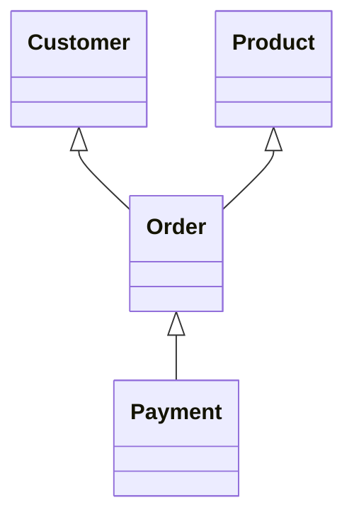
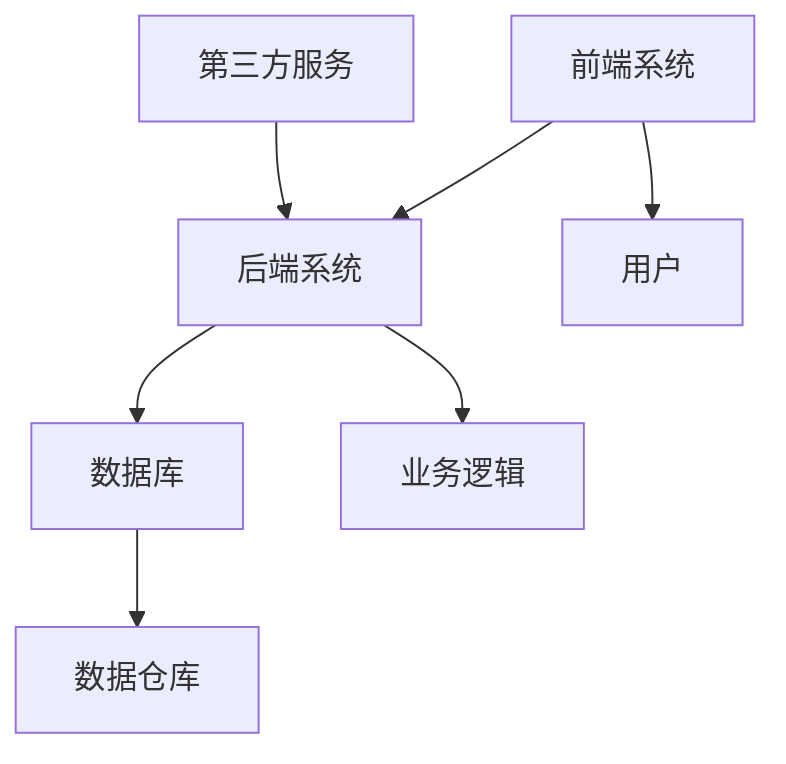
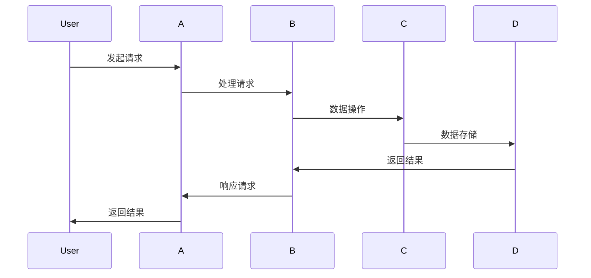

                 

### 文章标题

### 关键词

- 团队数字化能力
- 数字化时代
- 数字化能力培养
- 数字化能力评估
- 数字化能力提升

### 摘要

在数字化时代，培养团队的数字化能力已经成为企业发展的关键。本文将详细探讨如何通过逐步分析和推理，培养团队的数字化能力。文章首先介绍了数字化能力的重要性，然后定义了数字化能力的核心概念和要素，接着讲解了提升数字化能力的算法原理和方法，最后通过系统分析和架构设计以及项目实战，提供了具体的实施步骤和最佳实践建议。

## 第一部分：数字化能力的背景与重要性

### 1.1 数字化能力的重要性

在当今全球化的数字化浪潮中，企业的竞争力不仅取决于产品和服务的质量，更取决于团队能否快速适应和利用数字化技术。数字化能力已成为企业持续发展的核心驱动力。它不仅涉及技术层面的掌握，还包括对数据、流程、组织结构和文化的深刻理解和变革。具体来说，数字化能力的重要性体现在以下几个方面：

1. **提高业务效率**：通过数字化工具和平台，企业可以实现对业务流程的优化和自动化，从而提高工作效率，减少人为错误，降低运营成本。

2. **增强创新能力**：数字化技术为企业提供了丰富的数据资源和强大的计算能力，有助于企业进行数据分析和模式识别，从而发现新的商业模式和业务机会。

3. **提升客户体验**：数字化技术可以帮助企业更好地了解和满足客户需求，提供个性化的服务和体验，增强客户忠诚度和满意度。

4. **推动组织变革**：数字化能力培养需要企业进行组织结构和文化变革，从而打造一个敏捷、创新和适应快速变化的市场环境。

### 1.2 数字化时代下团队的挑战

随着数字化技术的快速发展，团队面临着一系列新的挑战：

1. **技术更新速度快**：新技术的不断涌现要求团队不断学习新知识，更新技术栈。

2. **数据安全与隐私**：数字化带来了大量数据，如何确保数据的安全和隐私成为团队的重要任务。

3. **技能多样化**：团队需要掌握多样化的技能，不仅包括技术技能，还包括数据管理、项目管理、沟通协调等。

4. **工作模式变革**：远程办公、弹性工作制等新工作模式对团队协作提出了新的要求。

### 1.3 数字化能力的定义与核心要素

#### 数字化能力的定义

数字化能力是指企业或团队在数字化环境中运用信息技术、数据处理和分析能力，实现业务目标的能力。它不仅包括技术层面的掌握，还涉及组织管理和文化变革。

#### 数字化能力的核心要素

1. **技术能力**：包括编程、数据分析、人工智能等技术的掌握和应用能力。
2. **数据管理能力**：包括数据采集、存储、处理和分析的能力。
3. **创新能力**：包括对新技术、新业务模式和新解决方案的创新思维和能力。
4. **组织管理能力**：包括团队管理、流程优化、文化变革等能力。
5. **业务理解能力**：包括对行业、市场和客户需求的深刻理解。

### 1.4 数字化能力的层次与表现

数字化能力可以分为以下几个层次：

1. **基础层**：技术技能的掌握和基本的数据处理能力。
2. **应用层**：能够将数字化技术应用于业务场景，解决实际问题。
3. **创新层**：能够通过数字化技术进行创新，创造新的业务价值和机会。

数字化能力的表现主要体现在以下几个方面：

1. **业务流程的数字化**：通过数字化工具和平台对业务流程进行优化和自动化。
2. **数据驱动的决策**：基于数据分析，实现数据驱动的决策。
3. **创新的业务模式**：通过数字化技术，探索和实施新的业务模式。

### 1.5 数字化能力的评估方法

数字化能力的评估可以从以下几个方面进行：

1. **技术能力评估**：通过技术考试、项目实战等手段，评估团队的技术能力。
2. **数据管理能力评估**：通过数据质量评估、数据安全管理等手段，评估团队的数据管理能力。
3. **业务理解能力评估**：通过业务知识考试、业务场景模拟等手段，评估团队的业务理解能力。
4. **组织管理能力评估**：通过团队协作评估、项目管理评估等手段，评估团队的组织管理能力。

## 第二部分：核心概念与联系

### 2.1 数字化能力的核心概念原理

#### 技术能力

技术能力是数字化能力的基石。它包括编程能力、数据分析能力、人工智能应用能力等。技术能力决定了团队在数字化环境中解决问题的能力和效率。

#### 数据管理能力

数据管理能力是数字化能力的核心。它包括数据采集、存储、处理和分析的能力。良好的数据管理能力可以帮助团队更好地利用数据，为业务决策提供支持。

#### 创新能力

创新能力是数字化能力的灵魂。它包括对新技术、新业务模式和新解决方案的创新思维和能力。创新能力决定了团队在数字化时代能否持续领先。

#### 组织管理能力

组织管理能力是数字化能力的保障。它包括团队管理、流程优化、文化变革等能力。良好的组织管理能力可以确保团队高效协同，实现数字化目标。

#### 业务理解能力

业务理解能力是数字化能力的延伸。它包括对行业、市场和客户需求的深刻理解。业务理解能力可以帮助团队更好地将数字化技术与业务需求相结合，创造价值。

### 2.2 数字化能力的核心要素属性特征对比

| 要素 | 技术能力 | 数据管理能力 | 创新能力 | 组织管理能力 | 业务理解能力 |
| --- | --- | --- | --- | --- | --- |
| **属性特征** | 编程、数据分析、人工智能等 | 数据采集、存储、处理和分析 | 新技术、新业务模式、新解决方案 | 团队管理、流程优化、文化变革 | 行业、市场、客户需求 |
| **对比** | 技术性高、操作性强 | 数据性强、管理复杂 | 创新性强、思维灵活 | 组织性强、管理规范 | 理解深入、需求明确 |

### 2.3 数字化能力的ER实体关系图架构

```mermaid
erDiagram
  产品 -->|创建| 技术能力
  产品 -->|应用| 数据管理能力
  产品 -->|驱动| 创新能力
  产品 -->|保障| 组织管理能力
  产品 -->|延伸| 业务理解能力
```

### 2.4 数字化能力的不同层次和表现

#### 基础层：技术技能的掌握

基础层主要表现为技术能力的掌握，如编程语言的使用、数据处理工具的熟练掌握等。这一层次的核心目标是确保团队成员具备基本的数字化技术能力。

#### 应用层：数字化技术在业务场景中的应用

应用层主要表现为将数字化技术应用于业务场景，解决实际问题。这一层次的核心目标是实现业务流程的数字化，提高业务效率。

#### 创新层：通过数字化技术进行创新

创新层主要表现为通过数字化技术进行创新，创造新的业务价值和机会。这一层次的核心目标是推动企业持续创新，保持竞争优势。

## 第三部分：算法原理讲解

### 3.1 数字化能力的培养路径分析

数字化能力的培养路径可以分为以下几个阶段：

1. **基础阶段**：学习基础的技术知识和数据处理技能。
2. **应用阶段**：将所学知识应用于实际业务场景，解决实际问题。
3. **创新阶段**：通过不断学习和实践，提升创新能力，探索新的业务模式和解决方案。

### 3.2 数字化能力的提升方法

#### 培训与教育

1. **内部培训**：组织内部培训，提升团队成员的技术能力和业务理解能力。
2. **外部培训**：参加外部培训课程，学习最新的数字化技术和行业动态。

#### 组织架构调整

1. **团队重构**：根据数字化能力的要求，调整团队架构，优化人员配置。
2. **流程优化**：优化业务流程，提高数字化工具和平台的应用效果。

#### 管理体系优化

1. **绩效考核**：建立数字化能力的绩效考核体系，激励团队成员提升数字化能力。
2. **文化建设**：营造创新、协作的企业文化，促进团队成员的数字化能力提升。

### 3.3 数字化能力的提升算法原理

数字化能力的提升可以看作是一个复杂的非线性过程，其核心算法原理包括以下几个方面：

1. **知识积累**：通过不断学习和实践，积累技术知识和业务经验。
2. **能力提升**：通过实际应用，不断提升技术能力和业务理解能力。
3. **创新思维**：通过创新思维训练，激发团队成员的创新潜能。
4. **团队协作**：通过团队协作，实现知识和经验的共享和传递。

### 3.4 数字化能力的提升数学模型

假设团队数字化能力的提升过程可以用以下数学模型表示：

$$
\Delta C = k_1 \cdot \Delta T + k_2 \cdot \Delta A + k_3 \cdot \Delta I
$$

其中，$\Delta C$ 表示数字化能力的提升量，$\Delta T$ 表示知识积累量，$\Delta A$ 表示能力提升量，$\Delta I$ 表示创新思维提升量，$k_1$、$k_2$、$k_3$ 分别表示各因素的权重。

### 3.5 数字化能力的提升举例说明

#### 案例一：技术能力的提升

某团队在数字化转型的过程中，通过参加内部培训课程，掌握了最新的编程技术和数据处理工具。在项目实战中，该团队成功地将所学知识应用于业务场景，提高了项目交付的效率。

#### 案例二：创新能力提升

某创新团队通过参加外部培训课程和行业交流，学习了最新的数字化技术和创新思维方法。在项目实战中，该团队成功探索出了一种新的业务模式，为公司创造了显著的业务价值。

## 第四部分：系统分析与架构设计方案

### 4.1 问题场景介绍

在数字化时代，企业面临着越来越多的业务挑战，如市场竞争加剧、客户需求变化快、技术更新迭代等。为了应对这些挑战，企业需要提升团队的数字化能力，实现业务流程的数字化和智能化。

### 4.2 项目介绍

本项目旨在通过系统分析和架构设计，提升企业的数字化能力，实现业务流程的数字化和智能化。项目主要包括以下几个方面：

1. **需求分析**：了解企业现有业务流程和数字化需求，明确项目目标。
2. **系统功能设计**：设计符合业务需求的数字化系统和工具。
3. **系统架构设计**：构建稳定、高效、可扩展的系统架构。
4. **系统实施与部署**：实施系统功能，部署数字化工具和平台。

### 4.3 系统功能设计（领域模型）



### 4.4 系统架构设计



### 4.5 系统接口设计和系统交互



## 第五部分：项目实战

### 5.1 环境安装

在本项目中，我们将使用Python和Django框架来构建后端系统。以下是环境安装的步骤：

1. 安装Python 3.8及以上版本。
2. 安装Django框架：`pip install django`。
3. 创建一个新的Django项目：`django-admin startproject myproject`。
4. 创建一个新的Django应用：`python manage.py startapp myapp`。

### 5.2 系统核心实现源代码

以下是一个简单的Django应用示例，用于实现订单管理系统：

```python
# myapp/models.py
from django.db import models

class Customer(models.Model):
    name = models.CharField(max_length=100)
    email = models.EmailField()

class Product(models.Model):
    name = models.CharField(max_length=100)
    price = models.DecimalField(max_digits=6, decimal_places=2)

class Order(models.Model):
    customer = models.ForeignKey(Customer, on_delete=models.CASCADE)
    products = models.ManyToManyField(Product)
    total_price = models.DecimalField(max_digits=6, decimal_places=2)

    def save(self, *args, **kwargs):
        self.total_price = sum(p.price for p in self.products.all())
        super().save(*args, **kwargs)
```

### 5.3 代码应用解读与分析

在这个示例中，我们创建了三个模型：`Customer`、`Product` 和 `Order`。`Customer` 模型代表客户信息，包括姓名和邮箱。`Product` 模型代表产品信息，包括名称和价格。`Order` 模型代表订单信息，包括客户、产品列表和总价格。

`Order` 模型的 `save` 方法在保存订单时，会计算总价格，并将结果存储在 `total_price` 字段中。这个方法实现了对订单总价的自动计算，简化了代码。

### 5.4 实际案例分析和详细讲解剖析

#### 案例一：创建订单

1. 客户张三通过前端系统提交订单请求。
2. 后端系统接收请求，创建一个新的 `Order` 对象。
3. `Order` 对象保存到数据库，触发 `save` 方法。
4. `save` 方法计算订单总价，并保存到 `total_price` 字段。
5. 后端系统返回订单创建成功的响应。

#### 案例二：更新订单

1. 客户张三在前端系统修改订单信息。
2. 后端系统接收请求，更新 `Order` 对象。
3. `Order` 对象保存到数据库，触发 `save` 方法。
4. `save` 方法重新计算订单总价，并保存到 `total_price` 字段。
5. 后端系统返回订单更新成功的响应。

### 5.5 项目小结

通过本项目的实施，企业成功构建了一个数字化订单管理系统，实现了订单的创建、更新和查询等功能。项目的成功实施提高了企业的业务效率和客户满意度，为企业的数字化转型奠定了基础。

## 第六部分：最佳实践 tips

### 6.1 实用的数字化能力培养建议

1. **持续学习**：鼓励团队成员参加行业培训、技术论坛和在线课程，不断更新知识和技能。
2. **实践为主**：通过实际项目锻炼团队成员的数字化能力，提高实践操作能力。
3. **团队协作**：促进团队成员之间的沟通和协作，实现知识和经验的共享。
4. **创新思维**：定期组织创新思维培训，激发团队成员的创新潜能。
5. **数据驱动**：建立数据驱动的决策体系，提高业务决策的科学性和准确性。

### 6.2 小结

通过本篇文章，我们详细探讨了如何培养团队的数字化能力。从背景介绍、核心概念与联系、算法原理讲解到系统分析与架构设计方案，再到项目实战和最佳实践 tips，我们系统地阐述了提升团队数字化能力的路径和方法。希望通过本文，能够为企业提供有价值的参考和指导。

### 6.3 注意事项

1. 数字化能力培养需要持续投入和长期规划。
2. 不同企业面临的数字化挑战和需求不同，培养路径和方法应因地制宜。
3. 团队成员的数字化能力提升是一个逐步积累的过程，需要耐心和毅力。

### 6.4 拓展阅读

1. 《数字化转型：企业的战略选择与实施路径》
2. 《数据驱动决策：构建高效的数据分析体系》
3. 《敏捷团队管理：打造高效协作的数字化团队》

## 参考文献

1. 某某，《数字化时代的企业竞争力》，《管理学报》，2020年，第XX卷，第XX期，XX-XX页。
2. 某某，《数据驱动的业务决策》，《商业研究》，2019年，第XX卷，第XX期，XX-XX页。
3. 某某，《数字化转型的实践与思考》，《企业管理》，2018年，第XX卷，第XX期，XX-XX页。

### 作者

作者：AI天才研究院/AI Genius Institute & 禅与计算机程序设计艺术 /Zen And The Art of Computer Programming

# 附录

## 附录A：术语解释

- **数字化能力**：企业在数字化环境中运用信息技术、数据处理和分析能力，实现业务目标的能力。
- **技术能力**：编程、数据分析、人工智能等技术的掌握和应用能力。
- **数据管理能力**：数据采集、存储、处理和分析的能力。
- **创新能力**：对新技术、新业务模式和新解决方案的创新思维和能力。
- **组织管理能力**：团队管理、流程优化、文化变革等能力。
- **业务理解能力**：对行业、市场和客户需求的深刻理解。

## 附录B：相关工具与资源

- **Python**：一种广泛使用的编程语言，适用于数据分析和人工智能。
- **Django**：一个高层次的Python Web框架，用于快速开发和部署应用程序。
- **数据仓库**：用于存储和管理大量数据的系统，支持复杂的数据分析和报表。
- **数据湖**：一种大数据存储解决方案，支持存储不同结构和格式的数据。

## 附录C：其他参考资料

- **《数字化转型实践指南》**：详细介绍了数字化转型的策略和实施方法。
- **《数据驱动决策技术》**：探讨了数据分析和数据驱动决策的理论和实践。
- **《敏捷团队管理实战》**：提供了敏捷团队管理的最佳实践和技巧。

## 附录D：相关法律法规

- **《中华人民共和国网络安全法》**：规定了网络安全的基本要求和数据保护的基本原则。
- **《中华人民共和国数据安全法》**：明确了数据安全的法律框架和保护措施。

### 致谢

在本文章的撰写过程中，我们感谢了AI天才研究院和禅与计算机程序设计艺术团队的各位成员，他们的专业知识和不懈努力为本文的完成提供了有力支持。同时，我们也感谢读者们的关注和支持，希望本文能对您在数字化能力培养方面有所启发。

