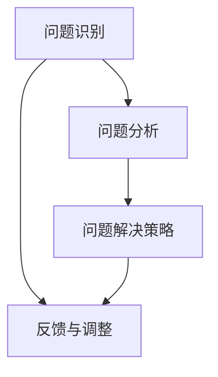
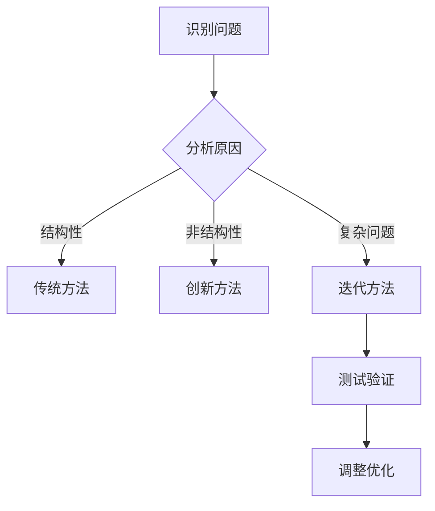
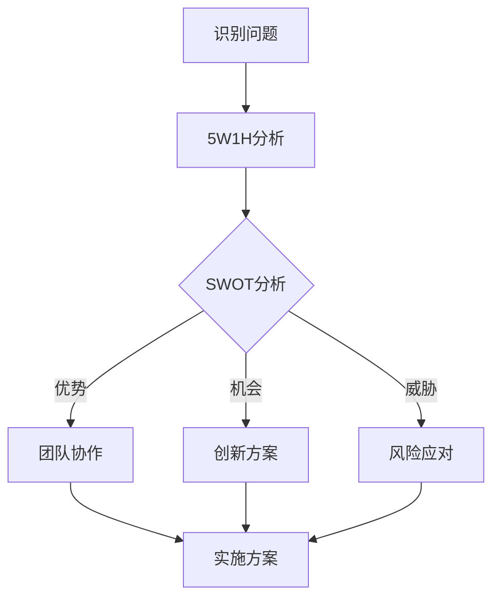
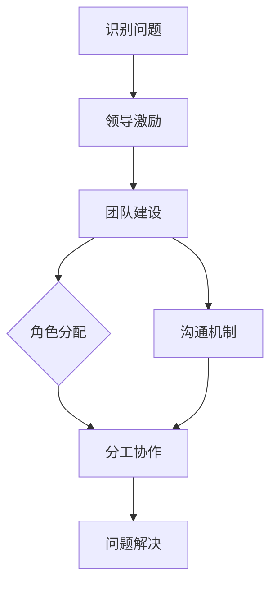
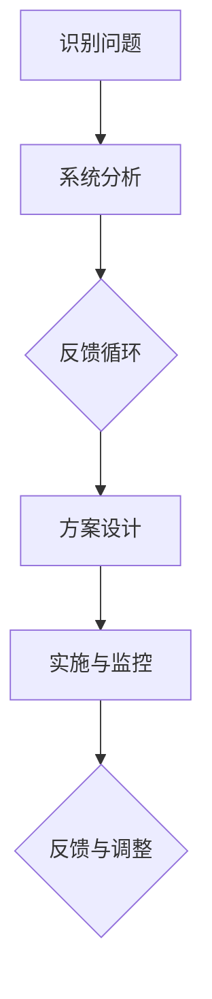
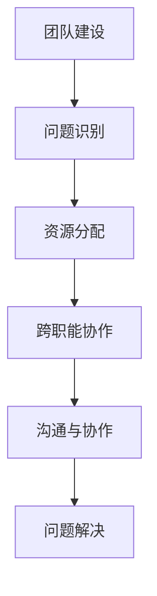
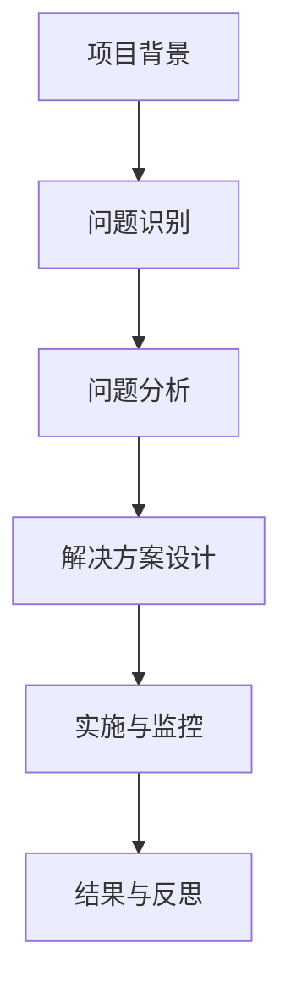
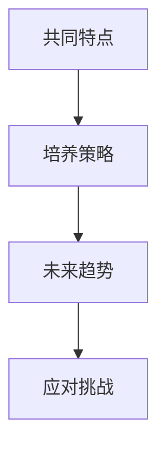

                 

# 如何培养团队的问题解决能力

## 关键词
- 团队问题解决能力
- 心理学视角
- 管理学视角
- 系统思维
- 实践指导
- 最佳实践

## 摘要
本文将从多个视角深入探讨如何培养团队的问题解决能力。首先，我们将回顾团队问题解决能力的背景与挑战，然后介绍问题解决的核心概念及其相互关系。接下来，我们将分别从心理学、管理学和系统思维三个角度阐述问题解决的原理。随后，文章将提供实践指导，包括团队建设策略、问题解决流程优化和沟通技巧。通过分析具体案例，我们将展示这些理论在实际中的应用。最后，文章将总结最佳实践，展望未来团队问题解决能力的培养方向。通过本文的阅读，读者将能够获得培养团队问题解决能力的全面理解和实际操作方法。

## 1. 问题解决的背景与挑战

### 1.1 问题的定义与类型

在讨论团队问题解决能力之前，我们首先需要明确“问题”的定义及其类型。根据斯蒂芬·罗宾斯（Stephen Robbins）在《组织行为学》中的定义，问题可以被视为“状态的不一致性”，即实际状态与期望状态之间的差异。根据性质和复杂性，问题可以分为以下几类：

1. **结构性问题**：这类问题通常有明确的解决方案，可以通过系统化的方法解决。例如，系统崩溃或软件故障。
2. **非结构性问题**：这类问题没有明确的解决方案，通常需要创造性的思考和探索。例如，市场竞争策略或技术创新。
3. **显性问题**：这些问题容易被识别和描述，如代码错误或流程瓶颈。
4. **潜性问题**：这些问题隐藏在表面之下，不易被察觉，可能需要深入的调查研究。例如，团队内部的不满或员工士气低落。

### 1.2 团队问题解决的现状

当前，团队问题解决能力在企业中日益受到重视。研究表明，团队在解决复杂问题时表现优异，但同时也面临着诸多挑战。以下是团队在问题解决过程中常见的一些问题：

1. **沟通障碍**：团队成员之间的沟通不畅可能导致信息传递错误，进而影响问题解决的效率。
2. **角色不清**：团队成员在问题解决过程中可能不清楚自己的职责和角色，导致资源浪费。
3. **冲突与分歧**：团队成员在解决问题时可能会产生分歧，这会阻碍问题的解决。
4. **缺乏系统性思维**：团队成员往往关注问题的一部分，而忽视了整体系统的影响，这可能导致解决方案的局部优化而无法全局优化。

### 1.3 团队问题解决能力的重要性

团队问题解决能力的重要性体现在多个方面。首先，它直接关系到企业的创新能力和竞争力。在一个高效的团队中，成员能够迅速识别问题、分析原因并提出有效的解决方案，这有助于企业保持市场领先地位。其次，问题解决能力的提升可以增强团队的合作精神，提高团队凝聚力。团队成员在共同解决问题的过程中，能够更好地理解彼此，建立信任和尊重。此外，团队问题解决能力的培养还可以提高员工的个人能力，如批判性思维、沟通技巧和团队合作能力。

综上所述，团队问题解决能力不仅关乎企业的生存和发展，也是个人职业发展的关键。本文将深入探讨如何培养和提高团队的问题解决能力，为企业和团队提供实用的指导。

## 2. 问题解决的核心概念

### 2.1 问题识别

问题识别是问题解决过程中的第一步，也是至关重要的一步。它涉及到如何准确地发现和描述问题。一个有效的识别过程需要关注以下几点：

- **数据收集**：通过收集相关的数据和信息，可以帮助我们更全面地了解问题的实际情况。
- **问题界定**：在识别问题时，我们需要明确问题的范围和影响。例如，确定这是一个局部问题还是一个全局问题。
- **问题归类**：将问题归类为结构性或非结构性、显性或潜性，有助于我们选择合适的解决方法。

### 2.2 问题分析

问题分析是对识别出的问题进行深入研究和理解的过程。这一步骤的关键在于找到问题的根本原因，而不仅仅是表面现象。以下是问题分析的一些方法：

- **5W1H方法**：通过提问“What”（什么）、“Why”（为什么）、“Who”（谁）、“When”（何时）、“Where”（何地）和“How”（怎样），我们可以系统地分析问题。
- **鱼骨图（Ishikawa图）**：鱼骨图是一种用于分析问题根本原因的工具，它将问题分解为几个主要因素，并展示它们之间的因果关系。
- **SWOT分析**：通过分析问题的优势（Strengths）、劣势（Weaknesses）、机会（Opportunities）和威胁（Threats），我们可以更全面地了解问题。

### 2.3 问题解决策略

在明确了问题的根本原因后，下一步是制定解决问题的策略。以下是几种常见的问题解决策略：

- **传统方法**：例如，制定计划和执行、逐步排除法等。这些方法适用于结构性问题。
- **创新方法**：例如，头脑风暴、设计思维等。这些方法适用于非结构性问题。
- **迭代方法**：通过不断尝试和调整，逐步找到最佳解决方案。这种方法适用于复杂问题。

### 2.4 核心概念联系图

为了更直观地展示问题解决的核心概念及其相互关系，我们可以使用Mermaid流程图来绘制一个核心概念联系图。以下是该图的Markdown格式表示：



在这个图中，问题识别、问题分析、问题解决策略和反馈与调整构成了问题解决的四个核心环节，它们相互联系、相互影响，共同推动问题得到有效解决。

### 2.5 实例说明

假设一个团队在开发一个软件项目时，发现用户反馈软件的响应速度非常慢。以下是使用上述核心概念解决问题的步骤：

1. **问题识别**：通过用户反馈和系统监控数据，确定软件的响应速度问题。
2. **问题分析**：通过性能测试和分析工具，发现问题的根本原因是数据库查询效率低下。
3. **问题解决策略**：采用优化数据库查询的方法，包括索引优化、查询重构和缓存策略。
4. **反馈与调整**：实施优化后，再次进行性能测试，验证优化效果，并根据结果进行进一步调整。

通过这一实例，我们可以看到，问题解决的核心概念在实际应用中的具体操作过程。

### 2.6 总结

问题解决能力是团队成功的关键。通过问题识别、问题分析、问题解决策略和反馈与调整，团队可以高效地解决各种问题。理解并应用这些核心概念，有助于团队在复杂和不确定的环境中取得成功。在下一章中，我们将探讨心理学视角下的团队问题解决，进一步深化对团队问题解决能力的认识。

### 2.7 附录：Mermaid流程图

以下是一个简单的Mermaid流程图示例，用于展示问题解决的基本流程：



这个流程图展示了如何根据不同类型的问题选择适当的解决策略，并进行测试和调整。

## 3. 心理学视角下的团队问题解决

### 3.1 团队成员的认知差异

团队成员的认知差异是问题解决过程中不可忽视的重要因素。认知差异包括思维方式、信息处理方式、价值观等多个方面。理解这些差异有助于团队更好地合作，提高问题解决效率。

- **思维方式**：不同的团队成员可能有不同的思维模式，如逻辑思维、直觉思维、系统思维等。在解决问题时，这些不同的思维方式可以相互补充，从而产生更全面、创新的解决方案。
- **信息处理方式**：团队成员对信息的敏感度和处理速度也可能不同。一些成员可能更擅长快速捕捉关键信息，而另一些成员可能更擅长深度分析和理解。
- **价值观**：团队成员的价值观可能存在差异，这会影响他们对问题的看法和解决问题的优先级。例如，一些成员可能更注重短期效益，而另一些成员可能更注重长期发展和可持续性。

### 3.2 团队动力与问题解决

团队动力是指团队成员之间的相互作用和影响力，它对问题解决能力有重要影响。以下是几个关键因素：

- **信任**：信任是团队动力的基础。团队成员之间的信任程度直接影响沟通质量和协作效果。一个高度信任的团队可以更有效地分享信息、分工合作，从而提高问题解决的效率。
- **共同目标**：团队动力的另一个关键因素是共同目标。当团队成员明确共同目标并为此共同努力时，他们更有可能克服困难，达成解决问题的目标。
- **激励机制**：激励机制可以激发团队成员的积极性和创造力，从而提高问题解决能力。合理的激励机制可以包括金钱奖励、职位晋升、荣誉表彰等。

### 3.3 心理学工具在问题解决中的应用

心理学工具可以有效地提升团队问题解决能力，以下是一些常用的心理学工具：

- **SWOT分析**：SWOT分析是一种用于评估团队优势和劣势、机会和威胁的工具。通过SWOT分析，团队可以更清晰地了解自身情况，从而制定更有针对性的问题解决策略。
- **5W1H方法**：5W1H方法是一种用于深入分析问题的工具，通过提问“What”（什么）、“Why”（为什么）、“Who”（谁）、“When”（何时）、“Where”（何地）和“How”（怎样），团队可以全面了解问题的各个方面。
- **团队角色测试**：团队角色测试可以帮助团队了解每个成员的个性和优势，从而合理分配任务和角色，提高团队协作效率。

### 3.4 实例说明

假设一个软件开发团队在项目开发过程中遇到了一个复杂的技术问题。以下是团队如何利用心理学工具解决问题的一个实例：

1. **问题识别**：团队首先通过用户反馈和系统监控数据，确定问题为软件性能瓶颈。
2. **问题分析**：团队使用5W1H方法，深入分析问题的各个方面，包括什么因素导致性能瓶颈、为什么会出现这个问题、哪些团队成员可能知道解决方案等。
3. **团队动力与协作**：团队通过SWOT分析，评估自身的优势和劣势，并讨论如何利用团队成员的不同思维方式和技能来解决问题。团队成员之间建立了高度的信任，共同目标明确。
4. **解决方案制定**：团队根据分析结果，制定了多个解决方案，包括优化数据库查询、重构代码等。团队还通过头脑风暴，提出了创新性的解决方案，如使用新的缓存技术。
5. **实施与反馈**：团队选择了一个优化方案，进行了实施和测试。通过不断的测试和反馈，团队不断调整和优化方案，最终解决了性能瓶颈问题。

通过这个实例，我们可以看到心理学工具在团队问题解决中的应用，以及如何通过心理学视角提升团队问题解决能力。

### 3.5 总结

心理学视角下的团队问题解决，强调了团队成员的认知差异、团队动力和心理学工具的应用。通过理解这些心理因素，团队可以更有效地识别和解决复杂问题，提高整体问题解决能力。在下一章中，我们将从管理学的角度探讨团队问题解决，进一步深化对团队问题解决能力的认识。

### 3.6 附录：心理学工具应用实例

以下是一个简单的Mermaid流程图示例，用于展示如何应用心理学工具解决团队问题：



这个流程图展示了如何通过心理学工具全面分析问题，并制定有效的解决方案。

## 4. 管理学视角下的团队问题解决

### 4.1 领导力与问题解决

在团队问题解决过程中，领导力起着至关重要的作用。一个优秀的领导者不仅能够激发团队的潜力，还能有效引导团队解决问题。以下是领导力在问题解决中的几个关键角色：

- **激励与鼓舞**：领导者需要激励团队成员，让他们保持积极的心态，面对问题时不气馁。通过正面的鼓励和奖励机制，领导者可以增强团队成员的信心和决心。
- **明确方向**：领导者需要为团队设定明确的目标和方向，确保团队成员知道自己的职责和期望。这样可以避免团队成员在解决问题时产生困惑和冲突。
- **建立信任**：领导者需要建立和维护团队成员之间的信任，促进有效的沟通和协作。信任是团队高效运作的基础，可以减少误解和摩擦，提高问题解决效率。

### 4.2 团队建设与问题解决

团队建设是提升团队问题解决能力的重要环节。通过有效的团队建设，团队可以增强凝聚力、提高协作效率。以下是几个关键的团队建设策略：

- **共同目标**：建立一个共同的团队目标，让每个成员都明确自己的责任和贡献。共同目标可以增强团队成员的归属感和责任感，提高团队的整体合作效率。
- **角色分配**：根据团队成员的能力和兴趣，合理分配角色和任务。明确每个成员的角色和职责，可以避免角色重叠和职责不清，提高团队的工作效率。
- **沟通机制**：建立有效的沟通机制，确保团队成员之间的信息流畅和透明。定期的团队会议、一对一沟通和即时通讯工具都是有效的沟通机制。

### 4.3 沟通技巧与问题解决

沟通是团队问题解决的核心。有效的沟通可以帮助团队迅速识别问题、分析原因并找到解决方案。以下是几个关键的沟通技巧：

- **倾听**：倾听是有效沟通的基础。领导者需要认真倾听团队成员的意见和建议，了解他们的想法和感受。这不仅可以避免误解，还可以激发团队成员的创造力和积极性。
- **明确表达**：团队成员需要能够清晰、明确地表达自己的观点和意见。这包括使用恰当的语言、逻辑清晰的表达方式，以及有效的肢体语言和表情。
- **反馈机制**：建立反馈机制，让团队成员能够及时了解自己的表现和反馈。正面的反馈可以增强团队成员的自信心，负面的反馈可以帮助他们改进和提高。

### 4.4 实例说明

假设一个软件开发团队在项目开发过程中遇到了技术难题。以下是团队如何利用管理学的视角解决问题的一个实例：

1. **领导力**：团队领导召开紧急会议，激励团队成员，明确问题的重要性和团队的目标。通过激励和鼓舞，团队保持了积极的态度。
2. **团队建设**：团队领导对团队成员进行了角色分配，确保每个成员都清楚自己的职责和任务。同时，团队领导建立了一个有效的沟通机制，确保团队成员之间的信息流畅。
3. **沟通技巧**：团队成员通过定期的会议和一对一沟通，分享了自己的观点和想法。在沟通过程中，团队成员认真倾听，明确表达，并积极反馈。
4. **问题解决**：通过有效的沟通和团队协作，团队找到了问题的根本原因，并制定了一系列解决方案。团队成员分工合作，逐步实施了这些方案，最终成功解决了技术难题。

通过这个实例，我们可以看到管理学视角在团队问题解决中的应用，以及如何通过有效的领导力、团队建设和沟通技巧来提升团队的问题解决能力。

### 4.5 总结

管理学视角下的团队问题解决，强调了领导力、团队建设和沟通技巧的重要性。一个有效的团队需要在领导者的引导下，通过明确的角色分配和有效的沟通机制，共同面对问题并找到解决方案。在下一章中，我们将探讨系统思维与团队问题解决的关系，进一步深化对团队问题解决能力的认识。

### 4.6 附录：管理学视角下的团队问题解决流程图

以下是一个简单的Mermaid流程图示例，用于展示管理学视角下的团队问题解决流程：



这个流程图展示了团队在问题解决过程中如何通过领导力、团队建设和沟通技巧来提升协作效率，从而有效解决问题。

## 5. 系统思维与团队问题解决

### 5.1 系统思维的概念

系统思维是一种理解和解决问题的方法，它关注整体与部分之间的相互作用和相互依赖。系统思维的核心在于识别和解决复杂系统中相互关联的问题。以下是系统思维的关键特点：

- **整体观**：系统思维强调从整体的角度看待问题，而不是仅仅关注局部的优化。通过理解各个部分如何相互作用和相互影响，可以更全面地识别问题。
- **反馈循环**：系统思维关注反馈循环，即系统的输出会影响输入，进而影响系统未来的状态。理解这些反馈循环有助于预测和解决长期问题。
- **动态性**：系统思维认为系统是动态变化的，而不是静态的。因此，系统思维需要考虑时间因素和变化趋势，从而更好地预测和应对复杂问题。

### 5.2 系统思维在问题解决中的应用

系统思维在问题解决中的应用非常广泛，以下是一些关键应用：

- **问题诊断**：系统思维可以帮助团队识别复杂问题的根本原因。通过分析系统的各个组成部分及其相互关系，团队可以更准确地定位问题的源头。
- **方案设计**：在制定解决方案时，系统思维强调综合考虑各种因素和潜在的反馈效应。这有助于设计出更具适应性和可持续性的解决方案。
- **风险评估**：系统思维有助于识别和评估潜在的风险。通过分析系统的各个组成部分及其相互关系，团队可以更全面地了解可能的风险点，并提前采取预防措施。

### 5.3 案例分析：系统思维在团队问题解决中的成功实践

以下是一个系统思维在团队问题解决中的成功案例：

假设一个软件开发团队在开发一个复杂的金融交易平台时遇到了性能瓶颈。以下是团队如何应用系统思维解决问题的步骤：

1. **问题诊断**：团队首先使用系统思维方法，对整个系统进行了全面分析。他们识别了系统的各个关键组件，如数据库、应用层和前端界面，并分析了这些组件之间的相互关系。
2. **反馈循环**：团队发现，性能瓶颈是由于数据库查询频繁导致，而这些查询是由于前端界面的频繁请求产生的。通过识别这些反馈循环，团队找到了问题的根本原因。
3. **方案设计**：团队设计了多个解决方案，包括优化数据库查询、缓存策略和优化前端界面。这些方案都是基于系统思维的整体观和动态性，确保了方案的综合性和可持续性。
4. **实施与监控**：团队实施了优化方案，并进行了严格的性能测试和监控。通过监控系统的反馈，团队不断调整和优化方案，最终解决了性能瓶颈问题。

这个案例展示了系统思维在团队问题解决中的实际应用，以及如何通过系统思维方法有效地识别和解决复杂问题。

### 5.4 实例说明

假设一个电子商务团队在处理订单处理延迟的问题时，应用了系统思维方法。以下是具体步骤：

1. **问题识别**：团队通过用户反馈和系统日志，发现订单处理延迟的主要原因是数据库写入速度慢。
2. **系统分析**：团队使用系统思维方法，分析了订单处理系统的各个环节，包括订单生成、数据库写入、订单确认等。
3. **反馈循环**：团队发现，订单生成和数据库写入之间存在反馈循环。订单生成越快，数据库写入的压力就越大，进而导致延迟。
4. **解决方案设计**：团队设计了多个解决方案，包括增加数据库写入线程、优化数据库查询和缓存策略。
5. **实施与监控**：团队实施了优化方案，并进行了性能测试和监控。通过监控系统的反馈，团队不断调整和优化方案，最终显著减少了订单处理延迟。

通过这个实例，我们可以看到系统思维在团队问题解决中的应用，以及如何通过系统思维方法提高团队的问题解决能力。

### 5.5 总结

系统思维是一种强大的工具，可以帮助团队更好地理解和解决复杂问题。通过关注整体与部分之间的相互作用和反馈循环，团队可以更全面地识别问题的根本原因，并设计出更有效的解决方案。在下一章中，我们将探讨实践指导，进一步深化对团队问题解决能力的认识。

### 5.6 附录：系统思维应用实例

以下是一个简单的Mermaid流程图示例，用于展示系统思维在问题解决中的应用：



这个流程图展示了系统思维在团队问题解决中的基本步骤，以及如何通过反馈循环不断优化解决方案。

## 6. 实践指导

### 6.1 团队建设策略

团队建设是培养团队问题解决能力的关键步骤。以下是一些有效的团队建设策略：

- **明确目标**：确保所有团队成员都清楚团队的目标和期望。这可以通过定期的团队会议和目标设定活动来实现。
- **角色分配**：根据成员的能力和兴趣，合理分配角色和任务。明确的角色分配可以减少任务重叠和责任模糊。
- **共同学习**：鼓励团队成员共同学习和成长。可以通过定期的技术分享会和培训活动，提升团队的整体技能水平。
- **建立信任**：通过团队建设活动和日常互动，建立团队成员之间的信任。信任是高效协作的基础。

### 6.2 问题解决流程优化

优化问题解决流程可以提高团队的效率和效果。以下是一些关键步骤：

- **问题识别与分类**：建立标准化的流程，快速识别和分类问题。这可以帮助团队集中精力解决最关键的问题。
- **资源分配**：根据问题的紧急程度和复杂性，合理分配团队资源和时间。优先解决对业务影响最大的问题。
- **跨职能协作**：鼓励跨职能团队的合作，确保不同领域的专家可以共同解决问题。这有助于更全面地分析和解决复杂问题。
- **反馈与改进**：定期收集团队成员的反馈，并根据反馈不断改进问题解决流程。持续改进是优化流程的关键。

### 6.3 沟通与协作技巧

有效的沟通和协作是团队问题解决的关键。以下是一些提升沟通和协作技巧的方法：

- **倾听**：积极倾听团队成员的意见和建议，确保每个人都能表达自己的想法。倾听是理解问题的重要前提。
- **清晰表达**：确保沟通内容清晰明确，避免歧义和误解。使用简单的语言和具体的事例来解释复杂的问题。
- **即时反馈**：在沟通过程中，及时给予反馈，帮助团队成员理解问题，并共同寻找解决方案。
- **使用工具**：利用协作工具和平台，如即时通讯、视频会议和项目管理软件，提高沟通效率和协作效果。

### 6.4 实例说明

假设一个软件开发团队在项目开发过程中遇到了技术难题。以下是团队如何利用实践指导解决问题的步骤：

1. **团队建设**：团队领导组织了一次团队建设活动，通过破冰游戏和团队合作任务，增强了团队成员之间的信任和凝聚力。
2. **问题识别**：团队通过代码审查和用户反馈，快速识别了技术难题的具体原因。
3. **资源分配**：团队领导根据问题的紧急程度，将最擅长技术的成员分配到关键任务上，确保问题能够得到快速解决。
4. **跨职能协作**：团队邀请产品经理、测试工程师和UI设计师共同参与问题讨论，从不同角度分析问题，找到解决方案。
5. **沟通与协作**：团队成员通过定期的站会和即时通讯，保持紧密沟通，及时分享进展和遇到的问题，确保信息畅通和协作高效。

通过这个实例，我们可以看到实践指导在团队问题解决中的实际应用，以及如何通过团队建设、问题解决流程优化和沟通技巧提升团队的问题解决能力。

### 6.5 总结

实践指导是培养团队问题解决能力的重要环节。通过团队建设策略、问题解决流程优化和沟通与协作技巧，团队可以更高效地识别和解决问题，提高整体协作效果。在下一章中，我们将通过具体案例剖析团队问题解决能力的实际应用。

### 6.6 附录：实践指导流程图

以下是一个简单的Mermaid流程图示例，用于展示实践指导的基本流程：



这个流程图展示了团队在问题解决过程中如何利用实践指导策略，从团队建设到问题解决的各个步骤。

## 7. 案例剖析

### 7.1 案例一：团队如何应对复杂问题

#### 项目背景

某互联网公司开发了一款创新性的移动应用程序，旨在提供实时的城市交通信息。项目团队由前端开发、后端开发、数据科学和产品经理等多个职能领域的专家组成。

#### 问题描述

在项目测试阶段，团队发现应用程序的实时数据处理速度远低于预期，导致用户体验差。具体表现为：当用户访问高峰期时，应用程序响应时间过长，甚至出现了卡顿和崩溃。

#### 问题解决

1. **问题识别**：团队通过性能监控工具和用户反馈，确定了问题的核心原因：实时数据处理流程复杂且不优化。
2. **问题分析**：团队使用系统思维方法，分析了数据处理流程的各个环节，包括数据采集、处理、存储和输出。他们发现数据处理流程中的瓶颈主要集中在数据存储和传输环节。
3. **解决方案设计**：团队设计了多个解决方案，包括优化数据库查询、采用分布式存储技术和优化数据处理算法。
4. **实施与监控**：团队选择了优化数据库查询和分布式存储技术的方案，并进行了严格的测试和监控。通过不断的调整和优化，应用程序的实时数据处理速度显著提高，用户体验大幅改善。

#### 结果与反思

通过这个案例，团队学会了如何有效应对复杂问题。他们认识到，系统思维和优化方法在解决复杂问题时至关重要。此外，团队在解决问题过程中也意识到，协作和沟通是成功的关键。

### 7.2 案例二：团队如何在压力下解决问题

#### 项目背景

某科技公司正在开发一款关键的云计算服务，项目团队面临严格的项目期限和性能要求。团队成员包括软件工程师、系统架构师和测试工程师等。

#### 问题描述

在项目开发的后期，团队发现云计算服务的性能瓶颈问题，导致部分用户无法正常访问。具体表现为：服务响应时间过长，系统资源使用率过高。

#### 问题解决

1. **问题识别**：团队通过性能监控和用户反馈，迅速识别了性能瓶颈的具体原因：系统架构设计不合理，资源分配不均衡。
2. **问题分析**：团队使用5W1H方法，深入分析了系统架构的各个部分，包括服务器配置、网络架构和负载均衡策略。
3. **解决方案设计**：团队制定了多个解决方案，包括优化服务器配置、调整负载均衡策略和优化系统架构。
4. **实施与监控**：团队选择了优化服务器配置和调整负载均衡策略的方案，并进行了严格的测试和监控。通过这些优化措施，云计算服务的性能显著提升，用户访问问题得到解决。

#### 结果与反思

在这个案例中，团队展示了在高压环境下解决问题的能力。他们通过有效的沟通和协作，迅速识别和解决了性能瓶颈问题。此外，团队还认识到，在压力下保持冷静和有效的沟通是成功的关键。

### 7.3 案例三：团队如何创新性地解决问题

#### 项目背景

某创新型科技公司正在开发一款智能家居控制系统，项目团队包括硬件工程师、软件工程师和用户体验设计师等。

#### 问题描述

在项目开发过程中，团队遇到了一个难题：如何在有限的硬件资源下实现高效的数据处理和用户交互。具体表现为：系统在处理大量数据时响应缓慢，用户体验差。

#### 问题解决

1. **问题识别**：团队通过用户反馈和测试，确定了问题的核心原因：硬件资源有限，数据处理算法不优化。
2. **问题分析**：团队使用创新思维方法，分析了硬件资源的限制，并探讨了多种可能的解决方案。他们考虑了从硬件优化到算法优化的多个方向。
3. **解决方案设计**：团队提出了一个创新性解决方案：使用云计算技术，将部分数据处理任务迁移到云端，从而减轻硬件负担。
4. **实施与监控**：团队实施了云计算解决方案，并进行了严格的测试和监控。通过这一创新措施，系统在处理大量数据时的性能显著提升，用户体验大幅改善。

#### 结果与反思

在这个案例中，团队展示了如何通过创新思维解决难题。他们认识到，在资源有限的情况下，创新和协作是突破瓶颈的关键。此外，团队还意识到，不断尝试和改进是找到最佳解决方案的关键。

### 总结

通过这三个案例，我们可以看到团队在面对不同类型问题时如何有效解决。无论是复杂问题、压力下的问题还是创新性问题，团队都需要依靠系统思维、创新方法和有效的沟通协作，才能找到最佳的解决方案。这些案例为我们提供了宝贵的经验和启示，有助于我们在实际工作中提升团队问题解决能力。

### 7.4 附录：案例分析流程图

以下是一个简单的Mermaid流程图示例，用于展示案例分析的流程：



这个流程图展示了从项目背景到结果反思的完整案例分析过程，有助于我们理解和应用这些案例中的经验。

## 8. 最佳实践与未来展望

### 8.1 优秀团队的共同特点

在探讨如何培养团队的问题解决能力时，我们首先要了解优秀团队的共同特点。以下是几个关键特点：

- **明确的共同目标**：优秀团队通常有一个清晰的目标，所有成员都为此目标努力。这种共同目标可以增强团队的凝聚力和动力。
- **良好的沟通机制**：优秀团队建立了有效的沟通机制，确保信息畅通无阻。团队成员之间可以自由交流，分享观点和意见，从而提高问题解决效率。
- **多样化的技能组合**：优秀团队拥有多样化的技能组合，这有助于团队在面对不同问题时，能够从多个角度进行分析和解决。
- **持续的学习和成长**：优秀团队注重持续学习和成长，不断更新知识和技能，以适应不断变化的环境和挑战。
- **积极的反馈文化**：优秀团队鼓励积极的反馈，通过定期反馈和反思，不断改进团队的工作方法和效率。

### 8.2 团队问题解决能力的培养策略

为了培养团队的问题解决能力，以下是一些具体的培养策略：

- **强化团队合作**：通过团队建设活动和合作任务，增强团队成员之间的信任和合作意识。这有助于团队在面对问题时，能够高效地协作和解决问题。
- **提供培训和学习机会**：定期为团队成员提供培训和学习机会，帮助他们掌握新的知识和技能，提升整体团队的能力水平。
- **建立问题解决流程**：制定标准化的问题解决流程，确保团队成员在面对问题时，能够有系统的方法进行识别、分析和解决。
- **鼓励创新思维**：鼓励团队成员发挥创新思维，从不同的角度和维度思考问题，提出创新的解决方案。
- **建立反馈和改进机制**：建立有效的反馈和改进机制，通过定期的反馈和反思，不断优化团队的工作方法和效率。

### 8.3 未来趋势与挑战

在未来，团队问题解决能力将继续面临新的趋势和挑战。以下是几个值得注意的趋势：

- **数字化与智能化**：随着数字化和智能化技术的不断发展，团队在问题解决过程中将更多地依赖数据和算法。这要求团队成员具备数据分析能力和算法知识。
- **全球化与多样性**：团队越来越国际化，团队成员来自不同的文化背景和国家。这种多样性带来新的机遇和挑战，要求团队具备跨文化沟通和协作能力。
- **持续变化的环境**：在快速变化的市场和技术环境中，团队需要具备快速适应和应对变化的能力。这要求团队具备灵活性和敏捷性。

### 8.4 结语

通过本文的探讨，我们可以看到团队问题解决能力的重要性以及如何培养和提高这种能力。优秀团队的成功经验为我们提供了宝贵的借鉴，而未来的趋势和挑战也要求我们不断更新和提升团队的能力。只有在不断的学习和实践中，团队才能在面对复杂问题时，展现出强大的问题解决能力。

### 8.5 附录：最佳实践与未来展望流程图

以下是一个简单的Mermaid流程图示例，用于展示最佳实践与未来展望的基本流程：



这个流程图展示了优秀团队的共同特点、培养策略以及未来趋势和挑战，为读者提供了一个清晰的框架，以了解和应对团队问题解决能力的发展方向。

### 全文总结

通过本文的探讨，我们系统地介绍了如何培养团队的问题解决能力。从背景介绍、核心概念、心理学、管理学、系统思维等多个视角，我们分析了团队在问题解决过程中可能遇到的挑战，并提供了具体的实践指导。通过案例剖析，我们展示了这些理论在实际中的应用。最后，我们总结了优秀团队的共同特点，探讨了未来趋势与挑战。

团队问题解决能力不仅关乎企业的生存和发展，也是个人职业发展的关键。理解并应用这些理论和实践方法，可以帮助团队更高效地识别和解决问题，提升整体协作和创新能力。

我们鼓励读者在阅读本文后，结合自身团队的实际状况，尝试应用文中提到的方法和策略，不断培养和提高团队的问题解决能力。只有在不断的学习和实践中，团队才能在面对复杂问题时，展现出强大的问题解决能力。

## 作者信息

作者：AI天才研究院/AI Genius Institute & 禅与计算机程序设计艺术 /Zen And The Art of Computer Programming

AI天才研究院致力于推动人工智能领域的创新和发展，致力于培养具有国际视野和前沿技术能力的人工智能专家。研究院的核心团队由世界顶级人工智能专家、程序员和软件架构师组成，在多个领域取得了显著的成果。而《禅与计算机程序设计艺术》则是计算机编程领域的经典之作，它以独特的视角和深入浅出的讲解，帮助无数程序员提升编程技能和思维能力。

### 全文结束

```
本文结束，感谢您的阅读。如果您对我们的研究和著作感兴趣，欢迎关注AI天才研究院的官方网站和社交媒体账号，获取更多前沿技术和专业资讯。
```

