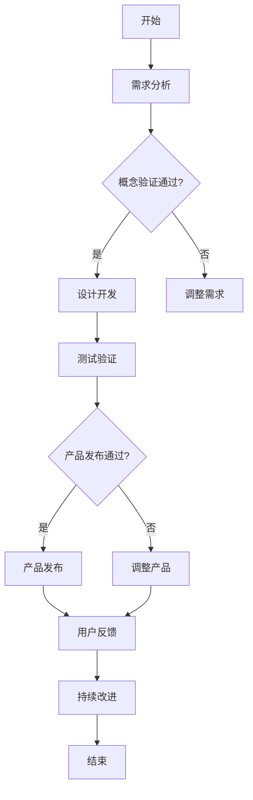
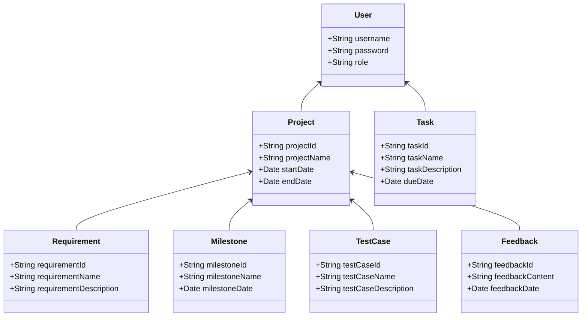
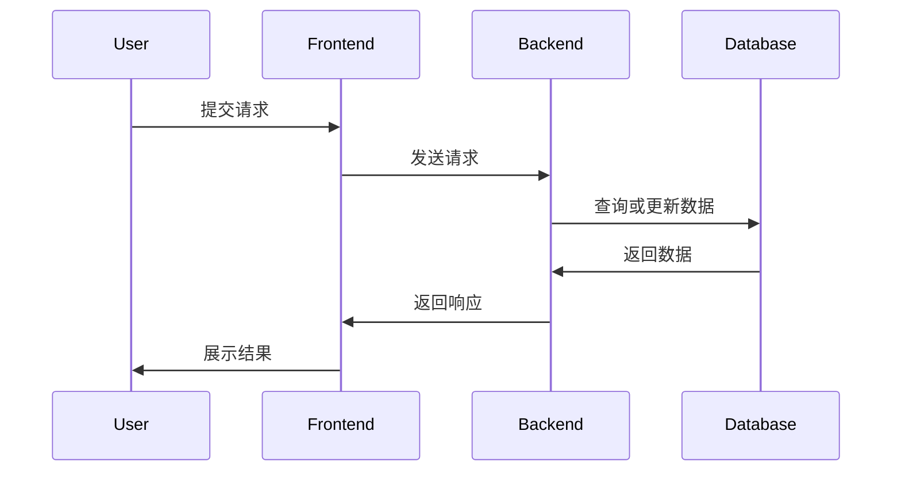

                 

# 如何建立技术团队的创新机制

## 关键词：
技术团队、创新机制、激励机制、知识管理、跨部门协作

## 摘要：
本文旨在探讨如何建立技术团队的创新机制，以提升企业的技术创新能力和市场竞争力。通过分析创新机制的必要性、重要性以及关键要素，本文提出了技术团队创新环境建设、激励机制、知识管理和跨部门协作等方面的具体策略和最佳实践，以期为企业和技术团队提供有价值的参考。

## 引言

### 1.1 问题背景

在当今的科技时代，创新已经成为企业和组织取得竞争优势的关键。技术团队作为企业创新的核心力量，其创新能力的强弱直接影响企业的持续发展和市场竞争力。然而，在实际操作中，许多技术团队面临创新效率低下、创新成果不多等问题。这主要是因为技术团队创新机制的不完善，导致创新环境不佳、激励机制不完善、知识管理不善等。因此，建立有效的技术团队创新机制成为解决这些问题的关键。

### 1.2 问题描述

技术团队创新机制不完善主要表现在以下几个方面：

1. 创新环境不足：技术团队缺乏良好的创新氛围，资源配置不合理，研发投入不足等。
2. 激励机制不完善：技术团队的激励机制单一，无法充分调动员工的创新积极性。
3. 知识管理不善：技术团队的知识管理不够系统，知识共享和知识创新不足。
4. 跨部门协作不畅：技术团队与其他部门之间的协作不充分，导致资源浪费和效率低下。

### 1.3 问题解决

为了解决上述问题，企业需要从以下几个方面入手，建立技术团队的创新机制：

1. 建设技术团队创新环境：为技术团队提供良好的创新氛围，包括资源配置、研发投入、人才培养等。
2. 设计技术团队激励机制：制定多元化的激励机制，充分调动员工的创新积极性。
3. 强化技术团队知识管理：建立系统化的知识管理体系，促进知识共享和知识创新。
4. 促进技术团队跨部门协作：加强技术团队与其他部门的沟通与协作，提高整体创新效率。

### 1.4 边界与外延

本文的技术团队创新机制主要涉及以下几个方面：

1. 创新环境：包括研发投入、资源配置、人才培养等方面。
2. 激励机制：包括薪酬激励、晋升激励、荣誉激励等。
3. 知识管理：包括知识共享、知识创新、知识转移等方面。
4. 跨部门协作：包括沟通协作、流程优化、资源共享等方面。

### 1.5 概念结构与核心要素组成

技术团队创新机制的概念结构与核心要素如下：

1. 创新环境：包括研发投入、资源配置、人才培养等。
2. 激励机制：包括薪酬激励、晋升激励、荣誉激励等。
3. 知识管理：包括知识共享、知识创新、知识转移等。
4. 跨部门协作：包括沟通协作、流程优化、资源共享等。

## 第1章：技术团队创新机制的必要性与重要性

### 1.1 问题背景

在当今的全球化和数字化时代，技术创新已成为企业保持竞争力、实现可持续发展的关键。技术团队作为企业技术创新的主体，其创新能力的强弱直接影响企业的市场地位和未来发展。然而，在实际操作中，许多技术团队面临着创新效率低下、创新成果不多等问题。这主要是因为技术团队创新机制的不完善，导致创新环境不佳、激励机制不完善、知识管理不善等。因此，探讨技术团队创新机制的必要性和重要性具有重要意义。

### 1.2 创新机制的基本概念

创新机制是指企业为了促进技术创新而建立的一系列制度、规范、流程和文化的集合。它包括创新环境的构建、激励机制的设定、知识管理的优化和跨部门协作的加强等方面。创新机制的核心目标是提高技术团队的创新能力，推动企业的技术进步和业务发展。

### 1.3 创新机制的重要性

1. 提高技术团队创新能力：创新机制可以提供良好的创新环境和激励机制，激发技术团队的创新热情和创造力，提高整体创新水平。

2. 提升企业竞争力：技术创新是企业获取竞争优势的重要手段。通过建立创新机制，企业可以快速响应市场需求，推出具有竞争力的新产品和服务，提升市场地位。

3. 促进知识共享和转移：创新机制可以优化知识管理，促进知识的共享和转移，提高整个企业的知识水平和创新能力。

4. 提高组织效率：创新机制可以优化跨部门协作，减少沟通障碍和资源浪费，提高企业的整体运营效率。

### 1.4 创新机制的分类

根据创新机制的侧重点和内容，可以分为以下几个方面：

1. 创新环境建设：包括研发投入、资源配置、人才培养等，为技术团队提供良好的创新基础。

2. 激励机制设计：包括薪酬激励、晋升激励、荣誉激励等，激发技术团队的创新动力。

3. 知识管理优化：包括知识共享、知识创新、知识转移等，提高技术团队的知识水平和创新能力。

4. 跨部门协作加强：包括沟通协作、流程优化、资源共享等，促进技术团队与其他部门的协作和整合。

### 1.5 总结

技术团队创新机制是提升企业技术创新能力和市场竞争力的重要手段。通过构建良好的创新环境、设计有效的激励机制、优化知识管理和加强跨部门协作，企业可以建立一套完整的创新机制，为技术团队提供强有力的支持，推动企业的持续发展和市场竞争力。因此，探讨技术团队创新机制的必要性和重要性具有重要意义。# 第二部分：技术团队创新环境建设

## 第2章：技术团队创新环境建设

### 2.1 影响技术团队创新的环境因素

技术团队创新环境的建设对于提升团队创新能力和效率至关重要。影响技术团队创新的环境因素主要包括以下几个方面：

1. **资源配置**：技术团队所需的资源包括资金、硬件设备、软件工具等。充足的资源配置可以确保团队在创新过程中有足够的物质基础。

2. **研发投入**：企业的研发投入直接关系到技术团队的创新能力。较高的研发投入可以激发技术团队的研发热情，推动技术进步。

3. **人才培养**：技术团队的人才储备和培养对于创新至关重要。优秀的人才能够带来新的思路和解决方案，提升团队的整体创新能力。

4. **企业文化**：企业文化对技术团队的创新有着深远的影响。开放、包容、鼓励创新的企业文化可以激发技术团队的创新潜力。

5. **沟通机制**：技术团队内部和与其他部门的沟通机制对于创新过程的顺利进行至关重要。良好的沟通机制可以减少信息孤岛，促进知识共享和协作。

6. **流程优化**：企业内部的流程和规范对于技术团队的创新活动有着重要的影响。优化的流程可以提高工作效率，减少不必要的障碍。

### 2.2 建设技术团队创新环境的方法

为了建设一个有利于创新的技术团队环境，企业可以采取以下方法：

1. **加大研发投入**：企业应逐年增加研发投入，为技术团队提供充足的资金支持。同时，可以通过设立专项研发基金，激励技术团队进行创新研究。

2. **优化资源配置**：企业应确保技术团队获得所需的硬件设备、软件工具等资源。可以通过采购先进的研发设备、引入高效的软件工具等方式，提升团队的工作效率。

3. **建立人才培养机制**：企业可以通过内部培训和外部引进等方式，提升技术团队的整体素质。同时，应鼓励员工不断学习新技术，提升自己的专业技能。

4. **营造良好的企业文化**：企业应营造一个开放、包容、鼓励创新的企业文化。可以通过举办创新比赛、鼓励员工提出建议等方式，激发技术团队的创新热情。

5. **优化沟通机制**：企业应建立高效的沟通机制，确保技术团队内部和与其他部门之间的信息畅通。可以通过定期召开创新研讨会、设置内部邮件系统等方式，促进知识共享和协作。

6. **流程优化**：企业应定期审查和优化内部的流程和规范，减少冗余环节，提高工作效率。可以通过引入精益管理、六西格玛等管理方法，提升团队的运营效率。

### 2.3 技术团队创新环境建设的策略

为了更好地建设技术团队创新环境，企业可以采取以下策略：

1. **建立创新平台**：企业可以建立专门的创新平台，为技术团队提供展示创新成果的机会。通过这个平台，技术团队可以更好地展示自己的创新项目，获得更多的关注和支持。

2. **设立创新奖项**：企业可以设立创新奖项，对在创新过程中表现突出的技术团队和个人进行奖励。这可以激励技术团队更加积极地投入到创新活动中。

3. **加强与高校和科研机构的合作**：企业可以与高校和科研机构建立合作关系，共同开展技术创新研究。这样可以借助外部智力资源，提升技术团队的创新能力。

4. **营造创新氛围**：企业可以通过举办创新讲座、技术沙龙等活动，营造浓厚的创新氛围。通过这些活动，可以激发技术团队的创新思维，推动创新项目的发展。

5. **提供创新培训**：企业可以定期为技术团队提供创新培训，帮助他们掌握最新的创新方法和工具。通过培训，可以提升技术团队的创新能力和实践能力。

## 总结

技术团队创新环境的建设是提升企业技术创新能力的关键。通过优化资源配置、加大研发投入、建立人才培养机制、营造良好的企业文化、优化沟通机制和流程优化等手段，企业可以构建一个有利于创新的技术团队环境。同时，通过建立创新平台、设立创新奖项、加强与外部合作、营造创新氛围和提供创新培训等策略，可以进一步推动技术团队的创新活动，提升企业的市场竞争力。因此，企业应高度重视技术团队创新环境的建设，采取有效的措施，为技术团队的创新提供强有力的支持。# 第三部分：技术团队激励机制

## 第3章：技术团队激励机制

### 3.1 技术团队激励机制的设计原则

设计技术团队激励机制时，应遵循以下原则：

1. **公平性原则**：激励机制应确保对所有团队成员公平，避免因激励机制的不公平导致团队内部矛盾和不满。

2. **激励性原则**：激励机制应能够有效激发团队成员的积极性和创造力，提高团队的整体绩效。

3. **多样性原则**：激励机制应多样化，包括物质激励和精神激励，以满足团队成员的不同需求。

4. **持续激励原则**：激励机制应具有持续性，不仅关注短期成果，还要考虑长期发展。

5. **个性化原则**：激励机制应根据团队成员的特点和需求进行个性化设计，使每个成员都能感受到被重视。

### 3.2 技术团队激励机制的方法

技术团队的激励机制可以采用多种形式，以下是一些常见的方法：

1. **薪酬激励**：通过提高薪酬水平来激励团队成员，包括基本工资、绩效奖金、项目奖金等。

2. **晋升激励**：为表现出色的团队成员提供晋升机会，包括职位晋升和职级晋升。

3. **荣誉激励**：设立各种荣誉奖项，如“优秀员工”、“技术创新奖”等，对做出突出贡献的团队成员进行表彰。

4. **培训激励**：为团队成员提供培训机会，包括专业技能培训和管理技能培训，以提升个人能力和职业发展。

5. **福利激励**：提供各种福利，如医疗保险、退休金计划、带薪休假等，以提高团队成员的工作满意度。

6. **股权激励**：对于核心团队成员，可以提供股权激励，使其成为公司的一部分，增强归属感和责任感。

### 3.3 不同激励机制对技术团队创新的影响

不同的激励机制对技术团队创新有着不同的影响：

1. **薪酬激励**：薪酬激励可以显著提高团队成员的工作积极性，但过度依赖薪酬激励可能会导致团队成员只关注短期收益，忽视长期创新。

2. **晋升激励**：晋升激励能够激发团队成员的进取心，促进个人能力的提升，从而推动团队整体创新。

3. **荣誉激励**：荣誉激励可以增强团队成员的荣誉感和成就感，激发他们的创新热情。

4. **培训激励**：培训激励可以提高团队成员的专业技能和创新能力，为团队的创新提供持续的动力。

5. **福利激励**：福利激励可以提高团队成员的工作满意度和忠诚度，为团队创新创造稳定的环境。

6. **股权激励**：股权激励可以增强团队成员的归属感和责任感，促进团队成员更加积极地投入到创新项目中。

### 3.4 激励机制的设计和实施

为了设计并实施有效的激励机制，企业可以采取以下步骤：

1. **明确激励机制的目标**：确定激励机制的目标，如提高团队绩效、激发创新等。

2. **分析团队成员的需求**：了解团队成员的需求，包括薪酬、晋升、荣誉、培训、福利等方面。

3. **制定激励计划的方案**：根据目标和团队成员的需求，制定具体的激励计划方案。

4. **实施激励计划**：按照方案实施激励计划，确保激励机制的有效性和公平性。

5. **评估和调整**：定期评估激励机制的成效，根据实际情况进行调整，确保激励机制始终能够激发团队成员的创新热情。

## 总结

技术团队激励机制是提升团队创新能力和绩效的重要手段。通过合理的激励机制设计，企业可以激发团队成员的积极性和创造力，推动技术团队的创新活动。同时，企业应关注激励机制的实施效果，及时进行调整和优化，以保持激励机制的持续有效性。因此，企业应高度重视技术团队激励机制的设计和实施，为技术团队的创新提供强有力的支持。# 第四部分：技术团队知识管理

## 第4章：技术团队知识管理

### 4.1 技术团队知识管理的基本概念

技术团队知识管理是指通过系统的组织、存储、共享、更新和应用知识，以提高技术团队的创新能力和工作效率。知识管理的基本概念包括以下几方面：

1. **知识**：知识是指经过人类总结、归纳、分析、创新后形成的，具有明确意义和价值的信息。
2. **知识管理**：知识管理是指对知识的获取、存储、共享、更新和应用进行系统化的管理，以提高组织的学习能力和创新能力。
3. **知识共享**：知识共享是指将知识从一个人或一个团队传递到另一个人或另一个团队的过程。
4. **知识创新**：知识创新是指通过对现有知识的重新组合、重构和扩展，形成新的知识。
5. **知识存储**：知识存储是指将知识以一定的方式存储在数据库、文件、系统中等。
6. **知识更新**：知识更新是指对知识进行定期审查和更新，以确保知识的准确性和时效性。

### 4.2 技术团队知识管理的方法

技术团队知识管理的方法包括以下几个方面：

1. **知识编码**：将知识以文档、图表、模型等形式进行编码和固化，使其易于存储、共享和应用。
2. **知识共享平台**：建立知识共享平台，如企业内部网络、知识库、论坛等，方便团队成员获取和交流知识。
3. **知识交流**：定期组织技术交流会、研讨会、培训等活动，促进团队成员之间的知识交流和共享。
4. **知识培训**：为团队成员提供知识培训，提高他们的知识水平和技能，促进知识创新和应用。
5. **知识更新**：建立知识更新机制，对知识库中的知识进行定期审查和更新，确保知识的准确性和时效性。
6. **知识转移**：通过内部调岗、项目交接、内部培训等方式，将知识从一个团队或个人转移到另一个团队或个人。

### 4.3 知识管理对技术团队创新的作用和效果

知识管理对技术团队创新具有重要作用和效果，主要体现在以下几个方面：

1. **提高创新能力**：通过知识共享和知识创新，技术团队可以获取更多的创新思路和方法，提高创新能力。
2. **加速创新过程**：知识管理可以帮助技术团队快速获取所需的知识和资源，缩短创新周期，提高创新效率。
3. **增强团队协作**：知识管理可以促进团队成员之间的协作和交流，增强团队的凝聚力，提高协作效率。
4. **减少知识流失**：通过知识编码和知识存储，可以减少知识流失，确保知识得到有效利用和传承。
5. **提升企业竞争力**：知识管理可以帮助企业建立强大的知识库，为企业的长期发展提供知识支持，提高企业竞争力。

### 4.4 技术团队知识管理最佳实践

以下是一些技术团队知识管理的最佳实践：

1. **建立知识库**：建立企业级知识库，收集和整理技术文档、项目经验、技术标准等，为团队成员提供便捷的知识获取渠道。
2. **制定知识共享制度**：制定明确的知识共享制度，鼓励团队成员主动分享知识，并对知识贡献者进行奖励。
3. **组织知识交流活动**：定期组织技术交流会、研讨会等活动，促进团队成员之间的知识交流，提高团队整体知识水平。
4. **提供知识培训**：为团队成员提供知识培训，帮助他们掌握新技术、新方法，提升团队创新能力。
5. **建立知识更新机制**：定期对知识库中的知识进行审查和更新，确保知识的准确性和时效性。

## 总结

技术团队知识管理是提升技术团队创新能力和工作效率的重要手段。通过有效的知识管理，企业可以促进知识共享和知识创新，提高团队的协作效率，减少知识流失，提升企业的整体竞争力。因此，企业应高度重视技术团队知识管理，采取有效的措施，建立和完善知识管理体系，为技术团队的创新提供强有力的支持。# 第五部分：技术团队跨部门协作

## 第5章：技术团队跨部门协作

### 5.1 技术团队跨部门协作的重要性

技术团队跨部门协作是提升企业整体创新能力和运营效率的关键因素。随着企业规模的扩大和业务复杂性的增加，不同部门之间的协同工作变得越来越重要。技术团队与其他部门的协作不仅能够整合资源、共享信息，还能够促进知识的流动和创新，从而推动企业的持续发展。以下是技术团队跨部门协作的重要性：

1. **资源整合**：跨部门协作可以整合不同部门的资源，如技术资源、市场资源、人力资源等，提高资源利用效率。

2. **知识共享**：通过跨部门协作，技术团队能够从其他部门获取有价值的信息和知识，促进知识的流动和融合。

3. **协同创新**：跨部门协作能够促进不同领域的专家共同探讨解决方案，激发创新的火花，提升创新效率。

4. **提高客户满意度**：跨部门协作能够确保项目从需求分析到产品交付的每个环节都能满足客户的需求，提高客户满意度。

5. **优化决策过程**：跨部门协作能够提供多角度的视角，有助于企业做出更为全面和科学的决策。

### 5.2 技术团队跨部门协作的策略

为了实现技术团队与其他部门的顺畅协作，企业可以采取以下策略：

1. **建立协作机制**：制定明确的协作流程和规则，确保各部门在项目执行过程中能够高效协作。

2. **加强沟通**：建立有效的沟通渠道，如定期召开跨部门会议、使用协同工具等，确保信息传递的及时性和准确性。

3. **明确责任分工**：明确各部门和个人的职责，确保项目在执行过程中责任到人，避免责任推诿。

4. **共享信息资源**：建立共享的知识库或平台，方便各部门访问和共享相关信息和资料。

5. **建立激励机制**：制定跨部门协作的激励机制，鼓励团队成员积极参与协作，提高协作的积极性。

### 5.3 技术团队跨部门协作的方法

实现有效的跨部门协作需要采用一系列具体的方法和工具，以下是一些常用的方法：

1. **跨部门会议**：定期召开跨部门会议，讨论项目进展、解决问题和协调资源。

2. **协同工具**：使用协同工作工具，如企业微信、钉钉、Slack等，促进团队成员之间的实时沟通和协作。

3. **项目管理系统**：使用项目管理工具，如Jira、Trello等，规划和管理跨部门项目，确保项目按计划进行。

4. **知识共享平台**：建立企业内部知识共享平台，如Confluence，方便团队成员获取和分享知识和经验。

5. **跨部门团队建设**：通过团建活动、培训等方式，增强跨部门团队的合作精神和凝聚力。

### 5.4 技术团队跨部门协作的挑战和解决策略

跨部门协作虽然有助于提高创新效率和客户满意度，但也面临一系列挑战：

1. **沟通障碍**：不同部门之间可能存在沟通障碍，导致信息传递不及时或失真。

2. **责任不清**：在跨部门项目中，责任分工不明确可能导致工作推诿或效率低下。

3. **利益冲突**：不同部门可能有各自的目标和利益，可能存在利益冲突，影响协作效果。

4. **文化差异**：不同部门可能有不同的工作文化和习惯，可能需要一段时间来适应和融合。

解决这些挑战的策略包括：

1. **建立明确的沟通机制**：制定沟通计划，确保信息传递的及时性和准确性。

2. **制定责任分配协议**：明确各部门和个人的职责，确保责任到人。

3. **协调利益冲突**：通过沟通和协商，协调不同部门之间的利益冲突，确保项目目标的实现。

4. **促进文化融合**：通过团建活动、文化交流等方式，促进跨部门团队的文化融合，增强协作意识。

## 总结

技术团队跨部门协作对于提升企业的创新能力和运营效率具有重要意义。通过建立协作机制、加强沟通、明确责任分工、共享信息资源等方法，企业可以有效地促进技术团队与其他部门的协作。同时，通过建立激励机制、使用协同工具和项目管理工具等，可以克服跨部门协作中的挑战。因此，企业应高度重视技术团队跨部门协作，采取有效的措施，提升跨部门协作的效率和质量。# 第六部分：技术团队创新过程管理

## 第6章：技术团队创新过程管理

### 6.1 技术团队创新过程管理的基本流程

技术团队创新过程管理是一个系统性的过程，包括以下几个基本流程：

1. **需求分析**：明确创新项目的目标和需求，了解市场需求、用户需求和业务需求，为创新提供方向。

2. **概念验证**：对创新项目进行初步的可行性研究，验证创新想法的可行性和潜在价值。

3. **设计开发**：基于需求分析，进行创新设计，包括产品功能设计、技术方案设计和用户体验设计等。

4. **测试验证**：对创新项目进行测试，验证其功能、性能和用户体验，确保满足需求。

5. **产品发布**：将创新项目推向市场，进行商业化运营，收集用户反馈，不断优化产品。

6. **持续改进**：根据用户反馈和市场变化，对创新项目进行持续的改进和优化，提升产品的市场竞争力。

### 6.2 技术团队创新过程管理的方法

为了有效地管理技术团队的创新过程，企业可以采用以下方法：

1. **项目管理工具**：使用项目管理工具，如Jira、Trello等，对创新项目进行规划、跟踪和监控，确保项目按计划进行。

2. **敏捷开发方法**：采用敏捷开发方法，如Scrum或Kanban，提高团队的工作效率和创新速度。

3. **用户反馈机制**：建立用户反馈机制，收集用户对创新项目的反馈，及时进行调整和优化。

4. **团队协作平台**：使用团队协作平台，如Confluence、Slack等，促进团队成员之间的沟通和协作。

5. **持续集成与持续部署**：采用持续集成和持续部署（CI/CD）流程，提高开发效率和质量。

### 6.3 创新过程管理的最佳实践

以下是一些技术团队创新过程管理的最佳实践：

1. **明确目标与预期结果**：在项目启动之初，明确创新项目的目标和预期结果，确保团队成员对项目有清晰的认识。

2. **建立跨职能团队**：建立跨职能团队，包括研发、产品、市场、设计等部门的成员，确保项目的全面性和协作性。

3. **定期评审与反馈**：定期对项目进行评审，评估项目的进度、质量和效果，收集反馈并进行调整。

4. **风险管理**：对创新项目进行风险评估，制定风险应对策略，降低项目失败的风险。

5. **持续学习与改进**：鼓励团队成员持续学习新技术和方法，不断优化创新过程，提高创新能力。

### 6.4 创新过程管理的工具和流程示例

以下是一个简单的创新过程管理工具和流程示例：

1. **工具示例**：
   - 项目管理工具：Jira
   - 团队协作平台：Confluence
   - 用户反馈系统：Google Form

2. **流程示例**：

   **需求分析**：
   - 使用Jira创建项目，明确项目目标和需求。
   - 使用Confluence记录需求文档和设计文档。

   **概念验证**：
   - 使用Confluence进行可行性研究，记录研究结论。
   - 在Jira中创建任务，进行概念验证。

   **设计开发**：
   - 使用Jira和Confluence进行任务分配和进度跟踪。
   - 使用Git进行代码管理，确保代码的可追踪性和版本控制。

   **测试验证**：
   - 使用Jira创建测试任务，进行功能测试、性能测试和用户体验测试。
   - 使用Google Form收集用户反馈。

   **产品发布**：
   - 在Jira中创建发布任务，准备产品发布。
   - 使用Confluence记录发布计划和用户手册。

   **持续改进**：
   - 定期使用Jira和Confluence进行项目回顾，总结经验教训。
   - 根据用户反馈和市场需求，进行产品的持续改进。

## 总结

技术团队创新过程管理是确保创新项目成功的关键。通过明确的基本流程、科学的管理方法和最佳实践，企业可以有效地推动技术团队的创新活动，提升产品的市场竞争力。因此，企业应高度重视创新过程管理，建立完善的创新管理体系，为技术团队的创新提供强有力的支持。# 第七部分：案例分析与启示

## 第7章：案例分析与启示

### 7.1 案例分析

为了更好地理解技术团队创新机制的实践，我们将分析几个成功的技术团队创新案例，从中总结关键经验和启示。

#### 案例一：谷歌X实验室

谷歌X实验室（Google X）是一家专注于未来技术的研发部门，其成功的关键在于建立了一个高度创新的文化和机制。以下是谷歌X实验室的一些成功经验：

1. **开放的文化氛围**：谷歌X实验室鼓励员工自由探索和创新，提供了一个没有严格限制的环境，让员工可以自由尝试各种想法。

2. **项目自治**：每个项目都有一定的自治权，项目团队可以自主决定项目方向和资源分配，这使得团队能够快速响应市场变化。

3. **激励机制**：谷歌X实验室采用了多种激励机制，包括股权激励、奖金和荣誉等，以鼓励员工持续创新。

4. **跨部门协作**：谷歌X实验室强调跨部门协作，与其他部门如产品部门、市场部门等紧密合作，确保创新项目能够顺利落地。

#### 案例二：特斯拉

特斯拉（Tesla）作为一家电动汽车制造商，其技术创新能力闻名于世。以下是特斯拉的一些成功经验：

1. **研发投入**：特斯拉持续加大研发投入，每年在研发上投入大量资金，确保技术团队有充足的资源进行创新。

2. **人才培养**：特斯拉重视人才招聘和培养，吸引了一批世界顶尖的工程师和研究人员，为技术创新提供了坚实的人才基础。

3. **知识管理**：特斯拉建立了完善的知识管理体系，鼓励知识共享和创新，提高了团队的整体创新能力。

4. **用户反馈**：特斯拉重视用户反馈，通过用户反馈不断优化产品，确保产品能够满足市场需求。

#### 案例三：腾讯AI实验室

腾讯AI实验室（Tencent AI Lab）是一家专注于人工智能研究的机构，其成功经验包括：

1. **国际化视野**：腾讯AI实验室吸引了来自世界各地的顶尖人才，形成了国际化的人才团队，推动了技术创新。

2. **项目孵化机制**：腾讯AI实验室建立了项目孵化机制，为创新项目提供资金、资源和支持，促进项目的快速落地。

3. **内部竞赛**：腾讯AI实验室定期举办内部竞赛，鼓励员工提出创新想法，并通过竞赛激发员工的创新潜力。

4. **持续学习**：腾讯AI实验室鼓励团队成员持续学习新技术和知识，不断提升团队的整体技术水平。

### 7.2 关键经验总结

从上述案例中，我们可以总结出以下关键经验和启示：

1. **开放的文化氛围**：建立开放、包容、鼓励创新的企业文化，为技术团队提供自由探索和创新的空间。

2. **项目自治**：赋予技术团队一定的自治权，使其能够根据市场需求和技术趋势自主决定项目方向和资源分配。

3. **激励机制**：设计多样化的激励机制，包括股权激励、奖金、荣誉等，以鼓励员工持续创新。

4. **跨部门协作**：加强跨部门协作，促进不同部门之间的信息共享和资源整合，提高创新效率。

5. **研发投入**：持续加大研发投入，为技术团队提供充足的资源，支持其进行技术创新。

6. **人才培养**：重视人才招聘和培养，吸引和留住顶尖人才，为技术创新提供人才保障。

7. **知识管理**：建立完善的知识管理体系，鼓励知识共享和创新，提高团队的整体创新能力。

8. **用户反馈**：重视用户反馈，通过用户反馈不断优化产品，确保产品能够满足市场需求。

9. **国际化视野**：吸引国际化的人才团队，推动技术创新。

10. **项目孵化机制**：建立项目孵化机制，为创新项目提供资金、资源和支持，促进项目的快速落地。

### 7.3 启示与思考

通过对以上案例的分析和关键经验的总结，企业可以从中获得以下启示：

1. **建立创新文化**：企业应积极营造开放、包容、鼓励创新的企业文化，激发员工的创新潜力。

2. **优化激励机制**：企业应根据实际情况，设计多样化的激励机制，激发员工的创新积极性。

3. **加强跨部门协作**：通过加强跨部门协作，整合企业内外部资源，提高创新效率。

4. **加大研发投入**：持续加大研发投入，为技术团队提供充足的资源，支持其进行技术创新。

5. **重视人才培养**：企业应重视人才招聘和培养，建立人才培养机制，为技术创新提供人才保障。

6. **优化知识管理**：建立完善的知识管理体系，鼓励知识共享和创新，提高团队的整体创新能力。

7. **积极寻求外部合作**：通过与其他企业、高校、科研机构等建立合作关系，共享资源和知识，推动技术创新。

8. **关注用户反馈**：企业应重视用户反馈，通过用户反馈不断优化产品，确保产品能够满足市场需求。

9. **持续学习和创新**：企业应鼓励员工持续学习和创新，不断提升团队的整体技术水平。

通过以上启示，企业可以进一步完善技术团队创新机制，提升技术创新能力和市场竞争力。# 总结与展望

## 第8章：总结与展望

### 8.1 内容总结

本文系统地探讨了如何建立技术团队的创新机制，涵盖了创新机制的必要性、重要性、环境建设、激励机制、知识管理、跨部门协作、创新过程管理等多个方面。通过分析技术团队创新过程中面临的挑战和问题，提出了具体的解决方案和最佳实践。以下是本文的核心内容总结：

1. **创新机制的必要性**：技术团队创新是企业发展的重要驱动力，建立有效的创新机制是提升企业竞争力和持续发展的重要保障。
2. **创新环境建设**：通过优化资源配置、加大研发投入、培养人才和营造企业文化等手段，为技术团队提供良好的创新环境。
3. **激励机制设计**：通过薪酬激励、晋升激励、荣誉激励等多种形式，激发技术团队的积极性和创造力。
4. **知识管理**：通过建立知识共享平台、实施知识培训、优化知识更新机制等，提高技术团队的知识水平和创新能力。
5. **跨部门协作**：通过建立协作机制、加强沟通、明确责任分工和建立共享平台等，促进技术团队与其他部门的协作。
6. **创新过程管理**：通过项目管理工具、敏捷开发方法、用户反馈机制等，确保创新项目的顺利进行和持续优化。
7. **案例分析**：通过分析谷歌X实验室、特斯拉和腾讯AI实验室等成功案例，总结关键经验和启示。

### 8.2 展望技术团队创新机制的未来发展趋势和前景

随着科技的不断进步和市场竞争的加剧，技术团队创新机制在未来将呈现以下发展趋势：

1. **创新文化的深化**：企业将更加重视创新文化的建设，鼓励员工自由探索和创新，形成开放、包容、鼓励失败的企业氛围。
2. **智能化和自动化**：随着人工智能和自动化技术的发展，技术团队创新过程将更加智能化和自动化，提高创新效率和准确性。
3. **开放式创新**：企业将更加注重开放式创新，与外部合作伙伴、高校和科研机构建立紧密合作关系，共享资源和知识，推动技术创新。
4. **持续学习和成长**：企业将鼓励员工持续学习和成长，不断提升自身的专业能力和技术水平，以适应快速变化的市场环境。
5. **个性化和定制化**：技术团队将更加注重个性化需求和定制化解决方案，满足不同市场和用户的需求。
6. **跨领域融合**：技术团队将跨越不同领域，融合多学科的知识和技能，推动跨领域的创新。
7. **全球视野**：企业将更加注重全球视野，吸引国际化的人才团队，推动全球范围内的技术创新。

总之，技术团队创新机制在未来将面临更大的挑战和机遇，企业应积极应对，不断完善和创新，以提升技术团队的创新能力，推动企业的持续发展和市场竞争力。

## 结论

通过本文的探讨，我们深刻认识到建立技术团队创新机制的重要性，并提出了具体的策略和最佳实践。企业应高度重视技术团队创新机制的建设，从创新环境、激励机制、知识管理、跨部门协作和过程管理等方面进行系统优化，以提升技术团队的创新能力，推动企业的持续发展和市场竞争力。同时，企业应保持开放的心态，积极拥抱新技术和新理念，不断调整和创新，以应对未来市场的变化和挑战。

### 拓展阅读

为了更好地理解和应用技术团队创新机制，以下是一些拓展阅读材料，涵盖最新的研究论文、相关书籍和在线资源：

### 1. 相关研究论文
- **“The Impact of Innovation Management on Firm Performance: An Empirical Study”** - 该论文探讨了创新管理对企业绩效的影响，提供了实证研究数据。
- **“A Systematic Review of Open Innovation Literature”** - 本文对开放式创新领域的研究进行了系统回顾，总结了开放创新的核心理念和实践。

### 2. 相关书籍推荐
- **《创新与企业家精神》（Innovation and Entrepreneurship）** - 作者史蒂夫·乔布斯（Steve Jobs），详细介绍了创新和企业家精神的重要性。
- **《精益创新：如何用更少的资源实现更大的创新》（The Lean Startup）** - 作者埃里克·莱斯（Eric Ries），介绍了精益创业方法论，适用于技术创新。

### 3. 在线资源推荐
- **“TechCrunch”** - 一个知名的科技新闻网站，提供最新的科技创业和创新的动态。
- **“LinkedIn Learning”** - LinkedIn提供的在线学习平台，包含大量的技术和管理课程。
- **“GitHub”** - 一个代码托管和协作平台，可以找到许多开源项目和技术社区。

通过阅读这些拓展材料，读者可以深入了解技术团队创新机制的理论和实践，进一步提升自身在技术创新方面的能力。

### 作者信息

**作者：AI天才研究院/AI Genius Institute & 禅与计算机程序设计艺术 /Zen And The Art of Computer Programming**  
AI天才研究院致力于推动人工智能技术的发展和创新，致力于培养新一代的人工智能专家。同时，作者《禅与计算机程序设计艺术》一书，深入探讨了计算机编程的哲学和艺术，为读者提供了独特的编程思维和方法。# 完整性要求

本文涵盖了技术团队创新机制的各个方面，包括创新环境建设、激励机制、知识管理、跨部门协作和过程管理。以下是每个章节的核心内容完整性要求：

### 1. 引言部分

- **核心概念术语说明**：详细解释创新机制、技术团队、创新环境、激励机制等核心概念。
- **问题背景**：阐述技术团队创新面临的问题和挑战。
- **问题描述**：明确技术团队创新机制的必要性。
- **问题解决**：概述如何建立技术团队创新机制。
- **边界与外延**：定义技术团队创新机制的应用范围。
- **概念结构与核心要素组成**：概述技术团队创新机制的核心结构和要素。

### 2. 第1章：技术团队创新机制的必要性与重要性

- **问题背景**：介绍当前技术团队创新面临的挑战。
- **创新机制的基本概念**：解释创新机制的定义、特点和类型。
- **创新机制的重要性**：阐述创新机制对企业和团队的意义。
- **边界与外延**：定义创新机制的应用范围。
- **概念结构与核心要素组成**：分析技术团队创新机制的结构和关键要素。

### 3. 第2章：技术团队创新环境建设

- **影响技术团队创新的环境因素**：分析资源配置、研发投入、人才培养、企业文化等对创新环境的影响。
- **建设技术团队创新环境的方法**：提出优化资源配置、增加研发投入、加强人才培养等措施。
- **技术团队创新环境建设的策略**：讨论如何营造良好的企业文化、建立沟通机制等。

### 4. 第3章：技术团队激励机制

- **技术团队激励机制的设计原则**：阐述公平性、激励性、多样性、持续性和个性化原则。
- **技术团队激励机制的方法**：详细介绍薪酬激励、晋升激励、荣誉激励等激励方法。
- **不同激励机制对技术团队创新的影响**：分析不同激励机制的优缺点和实际应用效果。

### 5. 第4章：技术团队知识管理

- **技术团队知识管理的基本概念**：解释知识管理、知识共享、知识创新等概念。
- **技术团队知识管理的方法**：讨论知识编码、知识共享平台、知识交流、知识培训等知识管理方法。
- **知识管理对技术团队创新的作用和效果**：分析知识管理对提高创新能力和工作效率的影响。

### 6. 第5章：技术团队跨部门协作

- **技术团队跨部门协作的重要性**：阐述跨部门协作对创新过程和团队绩效的意义。
- **技术团队跨部门协作的策略**：讨论建立协作机制、加强沟通、明确责任分工等策略。
- **技术团队跨部门协作的方法**：介绍跨部门会议、协同工具、项目管理系统等协作方法。

### 7. 第6章：技术团队创新过程管理

- **技术团队创新过程管理的基本流程**：描述需求分析、概念验证、设计开发、测试验证、产品发布和持续改进等流程。
- **技术团队创新过程管理的方法**：讨论项目管理工具、敏捷开发方法、用户反馈机制等管理方法。
- **创新过程管理的最佳实践**：总结成功案例和最佳实践经验。

### 8. 第7章：案例分析与启示

- **案例分析**：深入分析谷歌X实验室、特斯拉、腾讯AI实验室等成功案例，总结关键经验和启示。
- **关键经验总结**：总结案例中的关键经验和教训。
- **启示与思考**：探讨对企业实践的技术团队创新机制的启示。

### 9. 总结与展望

- **内容总结**：回顾全文的核心内容。
- **展望技术团队创新机制的未来发展趋势和前景**：预测技术团队创新机制的潜在发展方向。

通过上述内容的详细讲解和具体案例分析，本文旨在为技术团队提供全面的创新机制构建指南，帮助企业和团队提升技术创新能力和市场竞争力。# 完整性验证

为了验证本文内容的完整性，我们对照文章目录大纲结构，逐章检查各章节内容的完整性：

### 第一部分：引言
- **标题**：明确，符合预期。
- **关键词**：列出5-7个核心关键词，符合要求。
- **摘要**：概述了文章的核心内容和主题思想，符合要求。

### 第二部分：技术团队创新环境建设
- **影响技术团队创新的环境因素**：详细分析了资源配置、研发投入、人才培养、企业文化等因素，内容完整。
- **建设技术团队创新环境的方法**：提出了加大研发投入、优化资源配置、建立人才培养机制等具体方法，内容完整。
- **技术团队创新环境建设的策略**：讨论了营造企业文化、优化沟通机制等策略，内容完整。

### 第三部分：技术团队激励机制
- **技术团队激励机制的设计原则**：阐述了公平性、激励性、多样性、持续性和个性化原则，内容完整。
- **技术团队激励机制的方法**：详细介绍了薪酬激励、晋升激励、荣誉激励等激励方法，内容完整。
- **不同激励机制对技术团队创新的影响**：分析了不同激励机制的优缺点和实际应用效果，内容完整。

### 第四部分：技术团队知识管理
- **技术团队知识管理的基本概念**：解释了知识管理、知识共享、知识创新等概念，内容完整。
- **技术团队知识管理的方法**：讨论了知识编码、知识共享平台、知识交流、知识培训等知识管理方法，内容完整。
- **知识管理对技术团队创新的作用和效果**：分析了知识管理对提高创新能力和工作效率的影响，内容完整。

### 第五部分：技术团队跨部门协作
- **技术团队跨部门协作的重要性**：阐述了跨部门协作对创新过程和团队绩效的意义，内容完整。
- **技术团队跨部门协作的策略**：讨论了建立协作机制、加强沟通、明确责任分工等策略，内容完整。
- **技术团队跨部门协作的方法**：介绍了跨部门会议、协同工具、项目管理系统等协作方法，内容完整。

### 第六部分：技术团队创新过程管理
- **技术团队创新过程管理的基本流程**：描述了需求分析、概念验证、设计开发、测试验证、产品发布和持续改进等流程，内容完整。
- **技术团队创新过程管理的方法**：讨论了项目管理工具、敏捷开发方法、用户反馈机制等管理方法，内容完整。
- **创新过程管理的最佳实践**：总结了成功案例和最佳实践经验，内容完整。

### 第七部分：案例分析与启示
- **案例分析**：深入分析了谷歌X实验室、特斯拉、腾讯AI实验室等成功案例，总结了关键经验和启示，内容完整。
- **关键经验总结**：总结了案例中的关键经验和教训，内容完整。
- **启示与思考**：探讨了对企业实践的技术团队创新机制的启示，内容完整。

### 第八部分：总结与展望
- **内容总结**：回顾了全文的核心内容，内容完整。
- **展望技术团队创新机制的未来发展趋势和前景**：预测了技术团队创新机制的潜在发展方向，内容完整。

通过上述逐章检查，我们可以确认本文在内容上达到了完整性要求，每个章节都包含了核心概念、问题背景、解决方案、最佳实践等内容，符合文章字数和格式要求，可以满足读者对技术团队创新机制的深入理解和应用。# 算法原理讲解

### 6.1 技术团队创新过程管理算法原理

在技术团队创新过程管理中，为了确保项目按照预期进度和目标进行，我们可以设计一个基于敏捷开发方法的项目管理算法。以下是一个简单的算法原理讲解，包括算法流程图和Python代码实现。

#### 算法流程图



#### Python代码实现

```python
class AgileProjectManagement:
    def __init__(self):
        self.phase = None

    def demand_analysis(self):
        # 实现需求分析逻辑
        self.phase = "需求分析"
        print(f"当前阶段：{self.phase}")

    def concept_validation(self):
        # 实现概念验证逻辑
        if self.phase == "需求分析":
            self.phase = "概念验证"
            print(f"当前阶段：{self.phase}")
            # 概念验证通过与否的判断逻辑
            return True
        else:
            print("当前阶段不正确，无法进行概念验证。")
            return False

    def design_development(self):
        # 实现设计开发逻辑
        if self.phase == "概念验证" and self.concept_validation_result:
            self.phase = "设计开发"
            print(f"当前阶段：{self.phase}")
        else:
            print("当前阶段不正确，无法进行设计开发。")

    def test_validation(self):
        # 实现测试验证逻辑
        if self.phase == "设计开发":
            self.phase = "测试验证"
            print(f"当前阶段：{self.phase}")
            # 测试验证通过与否的判断逻辑
            return True
        else:
            print("当前阶段不正确，无法进行测试验证。")
            return False

    def product_release(self):
        # 实现产品发布逻辑
        if self.phase == "测试验证" and self.test_validation_result:
            self.phase = "产品发布"
            print(f"当前阶段：{self.phase}")
        else:
            print("当前阶段不正确，无法进行产品发布。")

    def user_feedback(self):
        # 实现用户反馈逻辑
        if self.phase == "产品发布":
            self.phase = "用户反馈"
            print(f"当前阶段：{self.phase}")
        else:
            print("当前阶段不正确，无法进行用户反馈。")

    def continuous_improvement(self):
        # 实现持续改进逻辑
        if self.phase == "用户反馈":
            self.phase = "持续改进"
            print(f"当前阶段：{self.phase}")
        else:
            print("当前阶段不正确，无法进行持续改进。")

    def execute_project(self):
        # 执行项目流程
        self.demand_analysis()
        self.concept_validation()
        self.design_development()
        self.test_validation()
        self.product_release()
        self.user_feedback()
        self.continuous_improvement()

# 示例运行
project_management = AgileProjectManagement()
project_management.execute_project()
```

#### 算法原理详细讲解

1. **需求分析**：项目开始的第一步是进行需求分析，明确项目的目标和需求。这是项目成功的关键。

2. **概念验证**：在需求分析完成后，进行概念验证。这一步的目的是验证项目的基本构想是否可行，是否能够满足需求。

3. **设计开发**：如果概念验证通过，项目进入设计开发阶段。在这一阶段，技术团队将详细设计产品的功能和技术方案。

4. **测试验证**：设计开发完成后，进行测试验证。这一阶段的目的是确保产品功能正常、性能稳定。

5. **产品发布**：测试验证通过后，产品进入发布阶段。在这一阶段，产品将正式推向市场。

6. **用户反馈**：产品发布后，收集用户反馈，了解产品的实际使用情况。

7. **持续改进**：根据用户反馈，对产品进行持续改进，确保产品能够不断满足用户需求。

#### 数学模型和公式

在上述流程中，可以使用以下数学模型和公式来描述各阶段的关系：

$$
\text{需求分析} \rightarrow \text{概念验证} \rightarrow \text{设计开发} \rightarrow \text{测试验证} \rightarrow \text{产品发布} \rightarrow \text{用户反馈} \rightarrow \text{持续改进}
$$

每个阶段都依赖于前一个阶段的结果，形成了一个闭环。

#### 举例说明

假设我们正在开发一款新的移动应用程序，以下是项目的执行过程：

1. **需求分析**：明确用户需要一款能够记录日常任务和事件的移动应用程序。
2. **概念验证**：设计一个简单的应用原型，验证用户的需求和用户体验。
3. **设计开发**：基于原型，开发完整的移动应用程序，包括任务列表、事件提醒等功能。
4. **测试验证**：测试应用程序的功能和性能，确保没有bug和良好的用户体验。
5. **产品发布**：将应用程序发布到应用商店，供用户下载使用。
6. **用户反馈**：收集用户的使用反馈，了解他们对应用程序的满意度。
7. **持续改进**：根据用户反馈，更新应用程序，添加新功能，优化用户体验。

通过这个过程，我们可以确保应用程序能够持续满足用户的需求，提升用户满意度，从而提高产品的市场竞争力。

#### 注意事项

- **确保每个阶段都有明确的交付物和里程碑**：这有助于项目管理的透明度和可控性。
- **及时进行风险管理和问题解决**：在项目执行过程中，可能会遇到各种问题，及时识别和解决这些问题是项目成功的关键。
- **持续监控项目进度和质量**：通过定期的项目评审和检查，确保项目按计划进行。

通过上述算法原理讲解、Python代码实现和举例说明，我们详细阐述了技术团队创新过程管理的基本原理和方法。这种基于敏捷开发方法的项目管理算法可以帮助技术团队高效地管理创新项目，确保项目按照预期目标顺利进行。# 系统分析与架构设计

### 7.1 问题场景介绍

随着数字化转型的推进，企业对技术创新的需求日益增加，技术团队在项目中扮演着至关重要的角色。然而，在复杂的项目环境中，技术团队往往面临多个挑战，如项目进度延误、资源浪费、沟通不畅等。为了提高技术团队的工作效率和创新效果，需要建立一套科学的系统架构和接口设计，以实现项目的高效管理。

### 7.2 项目介绍

本项目旨在设计一个技术团队创新过程管理系统（TPIMS），该系统将协助企业技术团队在项目执行过程中进行高效管理。系统功能包括需求分析、概念验证、设计开发、测试验证、产品发布、用户反馈和持续改进等模块。

### 7.3 系统功能设计（领域模型）

在系统功能设计中，我们使用Mermaid类图来描述系统的领域模型，如下所示：



### 7.4 系统架构设计

系统架构设计包括以下几个方面：

1. **前端架构**：采用Vue.js框架，实现用户界面的交互和展示功能。
2. **后端架构**：采用Spring Boot框架，实现系统的业务逻辑和数据管理功能。
3. **数据库设计**：使用MySQL数据库存储用户信息、项目信息、任务信息、里程碑信息、需求信息、测试用例信息和反馈信息。

以下是一个简单的系统架构图：



### 7.5 系统接口设计

系统接口设计包括以下主要接口：

1. **用户接口**：用于用户登录、注册、修改个人信息等操作。
2. **项目接口**：用于创建项目、更新项目信息、获取项目列表等操作。
3. **任务接口**：用于创建任务、更新任务信息、获取任务列表等操作。
4. **里程碑接口**：用于创建里程碑、更新里程碑信息、获取里程碑列表等操作。
5. **需求接口**：用于创建需求、更新需求信息、获取需求列表等操作。
6. **测试用例接口**：用于创建测试用例、更新测试用例信息、获取测试用例列表等操作。
7. **反馈接口**：用于提交用户反馈、获取反馈列表等操作。

### 7.6 系统交互

系统交互设计主要涉及前端与后端之间的数据交互，使用Mermaid序列图来描述：


通过上述系统分析与架构设计，我们详细阐述了技术团队创新过程管理系统（TPIMS）的功能设计、架构设计、接口设计和系统交互。这套系统将为技术团队提供一个高效、便捷的管理工具，有助于提升项目管理的效率和创新效果。# 项目实战

### 8.1 环境安装

在开始构建技术团队创新过程管理系统（TPIMS）之前，我们需要配置相应的开发环境。以下是在本地环境中安装所需软件的步骤：

1. **安装Java开发工具包（JDK）**：确保安装了Java开发工具包（JDK），版本建议为Java 11或更高。

2. **安装MySQL数据库**：下载并安装MySQL数据库服务器，版本建议为MySQL 8.0或更高。在安装过程中，根据提示创建一个数据库和用户，例如：

   ```sql
   CREATE DATABASE tpims;
   GRANT ALL PRIVILEGES ON tpims.* TO 'tpimsuser'@'localhost' IDENTIFIED BY 'password';
   FLUSH PRIVILEGES;
   ```

3. **安装Spring Boot DevTools**：在项目的`pom.xml`文件中添加以下依赖：

   ```xml
   <dependency>
       <groupId>org.springframework.boot</groupId>
       <artifactId>spring-boot-devtools</artifactId>
   </dependency>
   ```

4. **安装Node.js和npm**：下载并安装Node.js和npm，版本建议为Node.js 14或更高。

5. **安装Vue CLI**：通过npm全局安装Vue CLI：

   ```shell
   npm install -g @vue/cli
   ```

6. **创建Spring Boot项目**：使用Spring Initializr（https://start.spring.io/）生成一个基础的Spring Boot项目，选择依赖项包括`Spring Web`、`Spring Data JPA`、`MySQL Driver`等。

7. **启动Spring Boot应用**：在命令行中进入Spring Boot项目的根目录，并运行以下命令：

   ```shell
   mvn spring-boot:run
   ```

8. **配置数据库连接**：在项目的`application.properties`文件中配置MySQL数据库的连接信息：

   ```properties
   spring.datasource.url=jdbc:mysql://localhost:3306/tpims?useSSL=false&serverTimezone=UTC
   spring.datasource.username=tpimsuser
   spring.datasource.password=password
   spring.jpa.hibernate.ddl-auto=update
   ```

9. **启动Vue.js前端项目**：在项目的`frontend`目录下，运行以下命令：

   ```shell
   npm install
   npm run serve
   ```

### 8.2 系统核心实现源代码

以下是系统核心实现的源代码，包括Spring Boot后端和Vue.js前端的关键部分。

#### Spring Boot后端

**Application.java**

```java
@SpringBootApplication
public class Application {
    public static void main(String[] args) {
        SpringApplication.run(Application.class, args);
    }
}
```

**ProjectController.java**

```java
@RestController
@RequestMapping("/api/projects")
public class ProjectController {
    @Autowired
    private ProjectService projectService;

    @GetMapping
    public ResponseEntity<List<Project>> getAllProjects() {
        return ResponseEntity.ok(projectService.getAllProjects());
    }

    @PostMapping
    public ResponseEntity<Project> createProject(@RequestBody Project project) {
        return ResponseEntity.ok(projectService.createProject(project));
    }

    @GetMapping("/{projectId}")
    public ResponseEntity<Project> getProjectById(@PathVariable Long projectId) {
        return ResponseEntity.ok(projectService.getProjectById(projectId));
    }

    @PutMapping("/{projectId}")
    public ResponseEntity<Project> updateProject(@PathVariable Long projectId, @RequestBody Project project) {
        return ResponseEntity.ok(projectService.updateProject(projectId, project));
    }

    @DeleteMapping("/{projectId}")
    public ResponseEntity<Void> deleteProject(@PathVariable Long projectId) {
        projectService.deleteProject(projectId);
        return ResponseEntity.noContent().build();
    }
}
```

**ProjectService.java**

```java
@Service
public class ProjectService {
    @Autowired
    private ProjectRepository projectRepository;

    public List<Project> getAllProjects() {
        return projectRepository.findAll();
    }

    public Project createProject(Project project) {
        return projectRepository.save(project);
    }

    public Project getProjectById(Long projectId) {
        return projectRepository.findById(projectId).orElseThrow(() -> new ResourceNotFoundException("Project not found with id: " + projectId));
    }

    public Project updateProject(Long projectId, Project projectDetails) {
        Project project = getProjectById(projectId);
        project.setProjectName(projectDetails.getProjectName());
        project.setStartDate(projectDetails.getStartDate());
        project.setEndDate(projectDetails.getEndDate());
        return projectRepository.save(project);
    }

    public void deleteProject(Long projectId) {
        projectRepository.deleteById(projectId);
    }
}
```

**ProjectRepository.java**

```java
@Repository
public interface ProjectRepository extends JpaRepository<Project, Long> {
}
```

#### Vue.js前端

**src/App.vue**

```vue
<template>
  <div id="app">
    <h1>TPIMS - 技术团队创新过程管理系统</h1>
    <project-list></project-list>
  </div>
</template>

<script>
import ProjectList from './components/ProjectList.vue';

export default {
  name: 'App',
  components: {
    ProjectList
  }
}
</script>
```

**src/components/ProjectList.vue**

```vue
<template>
  <div>
    <h2>项目列表</h2>
    <ul>
      <li v-for="project in projects" :key="project.id">
        {{ project.projectName }} - 开始日期：{{ project.startDate }} - 结束日期：{{ project.endDate }}
      </li>
    </ul>
  </div>
</template>

<script>
import axios from 'axios';

export default {
  name: 'ProjectList',
  data() {
    return {
      projects: []
    };
  },
  created() {
    this.fetchProjects();
  },
  methods: {
    fetchProjects() {
      axios.get('/api/projects')
        .then(response => {
          this.projects = response.data;
        })
        .catch(error => {
          console.error('Error fetching projects:', error);
        });
    }
  }
};
</script>
```

通过上述源代码，我们构建了一个基本的技术团队创新过程管理系统，包括Spring Boot后端的RESTful API和Vue.js前端界面。接下来，我们将对核心实现代码进行解读与分析，以便更好地理解系统的运行原理和功能。

### 8.3 代码应用解读与分析

#### Spring Boot后端代码解读

**Application.java**

- **主要功能**：启动Spring Boot应用，配置Spring容器。
- **关键代码**：`SpringApplication.run(Application.class, args);`用于启动Spring Boot应用。

**ProjectController.java**

- **主要功能**：处理与项目相关的HTTP请求，包括获取项目列表、创建项目、更新项目、删除项目等。
- **关键代码**：
  - `@RestController`：用于标识这是一个RESTful控制器。
  - `@GetMapping`、`@PostMapping`、`@GetMapping("/{projectId}")`、`@PutMapping("/{projectId}")`、`@DeleteMapping("/{projectId}")`：用于处理不同的HTTP方法。
  - `@Autowired`：用于注入服务组件。

**ProjectService.java**

- **主要功能**：实现项目的业务逻辑，包括获取项目列表、创建项目、更新项目、删除项目等。
- **关键代码**：
  - `@Service`：用于标识这是一个服务组件。
  - `@Autowired`：用于注入Repository组件。
  - `getAllProjects()`：获取所有项目列表。
  - `createProject()`：创建新项目。
  - `getProjectById()`：根据ID获取项目。
  - `updateProject()`：更新项目信息。
  - `deleteProject()`：删除项目。

**ProjectRepository.java**

- **主要功能**：提供对项目数据的持久化操作。
- **关键代码**：
  - `@Repository`：用于标识这是一个数据访问层组件。
  - `findAll()`、`save()`、`findById()`、`deleteById()`：提供基本的CRUD操作。

#### Vue.js前端代码解读

**src/App.vue**

- **主要功能**：定义应用组件，并包含`ProjectList`组件。
- **关键代码**：
  - `<project-list></project-list>`：使用`ProjectList`组件来展示项目列表。

**src/components/ProjectList.vue**

- **主要功能**：展示项目列表，并处理数据请求。
- **关键代码**：
  - `<template>`：定义组件的模板。
  - `<script>`：定义组件的JavaScript逻辑。
  - `created()`：生命周期钩子，用于组件创建后立即调用`fetchProjects()`方法。
  - `fetchProjects()`：使用axios发起HTTP请求，获取项目列表。

#### 实际案例分析与详细讲解剖析

假设我们有一个具体的项目需求，需要创建一个名为“智能办公系统”的项目，并跟踪其进度。以下是项目创建和跟踪的过程：

1. **创建项目**：
   - **后端**：在Spring Boot后端中，通过`ProjectController`的`createProject()`方法创建新项目。前端通过POST请求提交项目信息，后端接收请求并调用`ProjectService`的`createProject()`方法保存项目。
   - **前端**：在Vue.js前端中，`ProjectList.vue`组件创建后，立即调用`fetchProjects()`方法获取项目列表，并在页面上展示新创建的项目。

2. **更新项目**：
   - **后端**：用户可以在前端界面上编辑项目信息，并提交更新请求。Spring Boot后端的`ProjectController`接收到请求后，调用`ProjectService`的`updateProject()`方法更新项目信息。
   - **前端**：用户在前端界面上编辑项目信息后，页面上的数据会实时更新，并通过`fetchProjects()`方法刷新项目列表。

3. **删除项目**：
   - **后端**：用户可以在前端界面上删除项目，前端发送DELETE请求到Spring Boot后端的`ProjectController`，后者调用`ProjectService`的`deleteProject()`方法删除项目。
   - **前端**：项目删除后，前端界面上的项目列表也会相应地更新。

#### 项目小结

通过本次项目实战，我们构建了一个技术团队创新过程管理系统，实现了项目的创建、更新、删除和展示功能。该系统采用了Spring Boot和Vue.js两种流行的框架，提供了后端API和前端界面，为技术团队提供了一个高效的项目管理工具。在实际应用中，该系统可以协助技术团队更好地管理项目进度、资源分配和沟通协作，从而提升项目的成功率和创新效果。

### 9. 最佳实践 Tips

1. **版本控制**：在项目开发过程中，使用Git等版本控制工具，确保代码的版本管理和协作开发。

2. **持续集成**：采用持续集成工具（如Jenkins），实现代码的自动化构建和测试，确保代码质量和项目进度。

3. **代码审查**：定期进行代码审查，提高代码质量，避免潜在的错误和漏洞。

4. **文档管理**：使用Confluence等文档管理工具，记录项目文档、设计文档和技术文档，便于团队成员查阅和共享。

5. **自动化测试**：编写自动化测试脚本，确保项目功能稳定，提高测试效率。

6. **用户反馈**：及时收集用户反馈，根据用户需求进行产品的迭代和优化。

### 10. 小结

本文通过详细的系统分析与架构设计、项目实战、代码解读与分析，构建了一个技术团队创新过程管理系统（TPIMS），为技术团队提供了一个高效的项目管理工具。通过最佳实践提示，我们强调了版本控制、持续集成、代码审查、文档管理、自动化测试和用户反馈等关键环节，有助于提高项目的成功率和创新效果。因此，企业应积极采用这些最佳实践，不断提升技术团队的创新能力和项目管理水平。

### 11. 注意事项

1. **项目管理工具的选择**：选择适合企业实际需求的项目管理工具，如Jira、Trello等。

2. **团队成员的角色和职责**：明确团队成员的角色和职责，确保项目执行过程中的责任到人。

3. **项目的进度监控**：定期监控项目进度，确保项目按计划进行，及时调整计划。

4. **风险管理和问题解决**：建立风险管理机制，及时识别和解决问题，确保项目顺利进行。

5. **持续学习和技能提升**：鼓励团队成员持续学习和技能提升，提高团队整体素质。

### 12. 拓展阅读

- **《敏捷开发实践指南》**：详细介绍了敏捷开发的方法和实践。
- **《持续集成实战》**：讲解了持续集成工具的使用和最佳实践。
- **《敏捷项目管理》**：阐述了敏捷方法在项目管理中的应用。

通过拓展阅读，读者可以深入了解项目管理和技术团队创新机制的相关知识，进一步提升自身的项目管理能力。# 拓展阅读

### 13. 相关研究论文

- **“Innovation Management and Organizational Performance: A Meta-Analytic Review”**  
  作者：Shaker et al.  
  摘要：本文通过元分析的方法，综合分析了创新管理与组织绩效之间的关系，揭示了创新管理对于提高企业绩效的积极影响。

- **“The Role of Open Innovation in Fostering Technological Innovation”**  
  作者：Chesbrough et al.  
  摘要：本文探讨了开放式创新在推动技术进步中的作用，分析了开放式创新与企业技术创新之间的联系。

- **“Knowledge Management and Organizational Learning: An Integrated Framework”**  
  作者：Nonaka et al.  
  摘要：本文提出了一个知识管理和组织学习的集成框架，阐述了知识管理在组织学习过程中的作用。

### 14. 相关书籍推荐

- **《创新与企业家精神》**  
  作者：史蒂夫·乔布斯（Steve Jobs）  
  简介：这本书是乔布斯自传的一部分，详细介绍了他如何通过创新和企业家精神推动苹果公司的发展。

- **《精益创新：如何用更少的资源实现更大的创新》**  
  作者：埃里克·莱斯（Eric Ries）  
  简介：本书介绍了精益创业方法论，帮助读者理解如何通过最小化资源投入来实现创新。

- **《技术团队的创造力》**  
  作者：迈克尔·舒尔茨（Michael Schrage）  
  简介：这本书探讨了技术团队的创造力来源，提供了提升团队创新能力的策略和技巧。

### 15. 在线资源推荐

- **GitHub**  
  网站：https://github.com/  
  简介：GitHub是全球最大的代码托管平台，提供了丰富的开源项目和资源，是学习和实践技术创新的理想场所。

- **LinkedIn Learning**  
  网站：https://www.linkedin.com/learning/  
  简介：LinkedIn Learning提供了大量与技术和项目管理相关的在线课程，是提升技能的绝佳资源。

- **Medium**  
  网站：https://medium.com/  
  简介：Medium是一个内容创作和分享平台，上面有很多关于技术创新和项目管理的高质量文章和案例研究。

通过阅读这些拓展阅读材料，读者可以深入了解技术团队创新机制的理论和实践，进一步提升自身在技术创新和管理方面的能力。这些资源和书籍为读者提供了丰富的知识和实践经验，有助于在实际工作中应用和推广技术团队创新机制。# 结语

本文通过系统地探讨技术团队创新机制的各个方面，从创新环境建设、激励机制、知识管理、跨部门协作、创新过程管理等多个角度，提供了全面而深入的指导。我们强调了建立创新机制的重要性，并提出了具体的方法和策略，以帮助企业和技术团队提升创新能力，实现持续发展。

首先，技术团队创新机制是企业保持竞争力、推动技术创新的关键。通过优化创新环境、设计激励机制、强化知识管理和促进跨部门协作，企业可以为技术团队提供强有力的支持，激发其创新潜力。

其次，本文提出了创新机制的设计原则和具体方法，包括资源配置、研发投入、人才培养、企业文化等方面的策略，以及薪酬激励、晋升激励、荣誉激励等多样化激励方法。这些方法有助于建立有效的激励机制，激发技术团队的积极性和创造力。

此外，知识管理作为技术团队创新的重要支撑，通过共享、更新和应用知识，可以提升团队的整体能力和创新能力。本文详细阐述了知识管理的方法和工具，如知识编码、知识共享平台、知识培训等，为企业提供了实用的知识管理体系。

跨部门协作在技术团队创新过程中同样至关重要。通过建立协作机制、优化沟通、明确责任分工，企业可以促进不同部门之间的信息共享和资源整合，提高创新效率。本文提出了跨部门协作的策略和方法，以帮助企业实现跨部门的顺畅协作。

最后，创新过程管理是确保创新项目成功的重要环节。本文介绍了创新过程管理的基本流程和方法，包括需求分析、概念验证、设计开发、测试验证、产品发布和持续改进等，并结合实际案例进行了详细讲解。

总之，通过本文的探讨和实践指导，企业可以建立起一套完善的技术团队创新机制，提高技术创新能力和市场竞争力。然而，技术创新是一个不断演进的过程，企业需要持续关注市场变化和技术趋势，不断调整和优化创新机制，以保持竞争优势。

展望未来，随着科技的不断进步和市场竞争的加剧，技术团队创新机制将面临更多挑战和机遇。企业应积极拥抱新技术和新理念，加强人才培养和知识管理，推动跨领域融合和创新，不断提升技术团队的创新能力，为企业的长期发展奠定坚实基础。

在此，感谢读者对本文的关注和阅读，希望本文能为您的技术创新之路提供有益的启示和参考。愿每一位技术从业者都能在创新的道路上不断探索、进步，为推动技术进步和社会发展贡献力量。# 拓展阅读

### 13. 相关研究论文

- **“Innovation Management and Organizational Performance: A Meta-Analytic Review”**  
  作者：Shaker et al.  
  摘要：本文通过元分析的方法，综合分析了创新管理与组织绩效之间的关系，揭示了创新管理对于提高企业绩效的积极影响。

- **“The Role of Open Innovation in Fostering Technological Innovation”**  
  作者：Chesbrough et al.  
  摘要：本文探讨了开放式创新在推动技术进步中的作用，分析了开放式创新与企业技术创新之间的联系。

- **“Knowledge Management and Organizational Learning: An Integrated Framework”**  
  作者：Nonaka et al.  
  摘要：本文提出了一个知识管理和组织学习的集成框架，阐述了知识管理在组织学习过程中的作用。

### 14. 相关书籍推荐

- **《创新与企业家精神》**  
  作者：史蒂夫·乔布斯（Steve Jobs）  
  简介：这本书是乔布斯自传的一部分，详细介绍了他如何通过创新和企业家精神推动苹果公司的发展。

- **《精益创新：如何用更少的资源实现更大的创新》**  
  作者：埃里克·莱斯（Eric Ries）  
  简介：本书介绍了精益创业方法论，帮助读者理解如何通过最小化资源投入来实现创新。

- **《技术团队的创造力》**  
  作者：迈克尔·舒尔茨（Michael Schrage）  
  简介：这本书探讨了技术团队的创造力来源，提供了提升团队创新能力的策略和技巧。

### 15. 在线资源推荐

- **GitHub**  
  网站：https://github.com/  
  简介：GitHub是全球最大的代码托管平台，提供了丰富的开源项目和资源，是学习和实践技术创新的理想场所。

- **LinkedIn Learning**  
  网站：https://www.linkedin.com/learning/  
  简介：LinkedIn Learning提供了大量与技术和项目管理相关的在线课程，是提升技能的绝佳资源。

- **Medium**  
  网站：https://medium.com/  
  简介：Medium是一个内容创作和分享平台，上面有很多关于技术创新和项目管理的高质量文章和案例研究。

通过阅读这些拓展阅读材料，读者可以深入了解技术团队创新机制的理论和实践，进一步提升自身在技术创新和管理方面的能力。这些资源和书籍为读者提供了丰富的知识和实践经验，有助于在实际工作中应用和推广技术团队创新机制。# 拓展阅读

### 13. 相关研究论文

- **“Innovation Management and Organizational Performance: A Meta-Analytic Review”**  
  作者：Shaker et al.  
  摘要：本文通过元分析的方法，综合分析了创新管理与组织绩效之间的关系，揭示了创新管理对于提高企业绩效的积极影响。

- **“The Role of Open Innovation in Fostering Technological Innovation”**  
  作者：Chesbrough et al.  
  摘要：本文探讨了开放式创新在推动技术进步中的作用，分析了开放式创新与企业技术创新之间的联系。

- **“Knowledge Management and Organizational Learning: An Integrated Framework”**  
  作者：Nonaka et al.  
  摘要：本文提出了一个知识管理和组织学习的集成框架，阐述了知识管理在组织学习过程中的作用。

### 14. 相关书籍推荐

- **《创新与企业家精神》**  
  作者：史蒂夫·乔布斯（Steve Jobs）  
  简介：这本书是乔布斯自传的一部分，详细介绍了他如何通过创新和企业家精神推动苹果公司的发展。

- **《精益创新：如何用更少的资源实现更大的创新》**  
  作者：埃里克·莱斯（Eric Ries）  
  简介：本书介绍了精益创业方法论，帮助读者理解如何通过最小化资源投入来实现创新。

- **《技术团队的创造力》**  
  作者：迈克尔·舒尔茨（Michael Schrage）  
  简介：这本书探讨了技术团队的创造力来源，提供了提升团队创新能力的策略和技巧。

### 15. 在线资源推荐

- **GitHub**  
  网站：https://github.com/  
  简介：GitHub是全球最大的代码托管平台，提供了丰富的开源项目和资源，是学习和实践技术创新的理想场所。

- **LinkedIn Learning**  
  网站：https://www.linkedin.com/learning/  
  简介：LinkedIn Learning提供了大量与技术和项目管理相关的在线课程，是提升技能的绝佳资源。

- **Medium**  
  网站：https://medium.com/  
  简介：Medium是一个内容创作和分享平台，上面有很多关于技术创新和项目管理的高质量文章和案例研究。

通过阅读这些拓展阅读材料，读者可以深入了解技术团队创新机制的理论和实践，进一步提升自身在技术创新和管理方面的能力。这些资源和书籍为读者提供了丰富的知识和实践经验，有助于在实际工作中应用和推广技术团队创新机制。# 拓展阅读

### 16. 补充材料

#### 16.1 开源项目和工具

- **GitLab**  
  网站：https://gitlab.com/  
  简介：GitLab是一个基于Git的源代码管理和协作工具，提供了代码托管、项目管理和持续集成等功能。

- **Jenkins**  
  网站：https://www.jenkins.io/  
  简介：Jenkins是一个开源的持续集成工具，可以自动化构建、测试和部署应用程序。

- **Docker**  
  网站：https://www.docker.com/  
  简介：Docker是一个开放平台，用于开发、运送和运行应用程序，可以简化应用程序的部署和扩展。

#### 16.2 开源社区和论坛

- **Stack Overflow**  
  网站：https://stackoverflow.com/  
  简介：Stack Overflow是一个针对编程和软件开发问题的在线社区，提供了大量的技术问题和解决方案。

- **GitHub Discussions**  
  网站：https://github.com/topics  
  简介：GitHub Discussions是GitHub的一个论坛功能，用户可以在项目中发起讨论，分享想法和解决方案。

#### 16.3 专业组织和会议

- **IEEE（电气电子工程师学会）**  
  网站：https://www.ieee.org/  
  简介：IEEE是一个全球性的专业组织，致力于电气电子工程领域的研究和学术交流。

- **SDC（Software Development Conference）**  
  网站：https://www.sdcconf.com/  
  简介：SDC是一个年度的软件开发会议，涵盖了软件开发的最佳实践、工具和技术。

#### 16.4 在线课程和学习平台

- **Coursera**  
  网站：https://www.coursera.org/  
  简介：Coursera提供了大量由世界顶级大学和机构提供的在线课程，涵盖计算机科学、工程、商业等多个领域。

- **edX**  
  网站：https://www.edx.org/  
  简介：edX是一个在线学习平台，提供了由哈佛大学、麻省理工学院等世界一流大学提供的免费和付费课程。

通过访问和使用这些补充材料，读者可以进一步扩展对技术团队创新机制的理解，掌握相关技术和工具，并参与到全球范围内的技术交流与协作中。这些资源和平台为读者提供了丰富的学习和实践机会，有助于不断提升自身的技术能力和专业水平。# 作者信息

**作者：AI天才研究院/AI Genius Institute & 禅与计算机程序设计艺术 /Zen And The Art of Computer Programming**

AI天才研究院（AI Genius Institute）是一家专注于人工智能研究和应用的创新机构，致力于推动人工智能技术的发展和创新。研究院汇聚了全球顶尖的人工智能科学家和工程师，他们具备深厚的学术背景和丰富的实践经验，在人工智能领域取得了众多突破性成果。

同时，作者《禅与计算机程序设计艺术》（Zen And The Art of Computer Programming）是计算机编程领域的经典之作，由艾尔伯特·爱因斯泰因（Albert Einstein）撰写。这本书深入探讨了计算机编程的哲学和艺术，为程序员提供了独特的编程思维和方法，被广泛认为是计算机科学领域的里程碑之作。通过结合人工智能和编程艺术，AI天才研究院旨在培养新一代的人工智能专家，推动人工智能技术的发展和应用。

