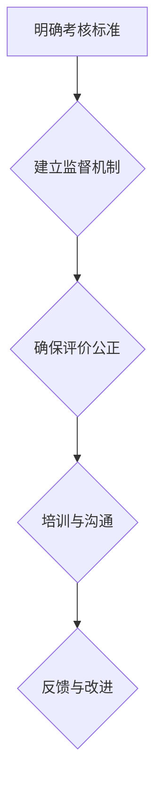
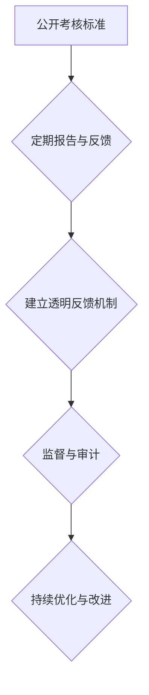
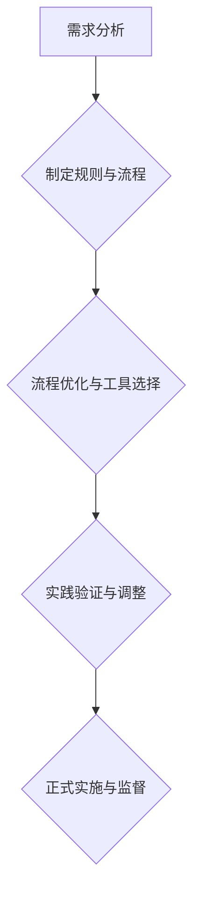
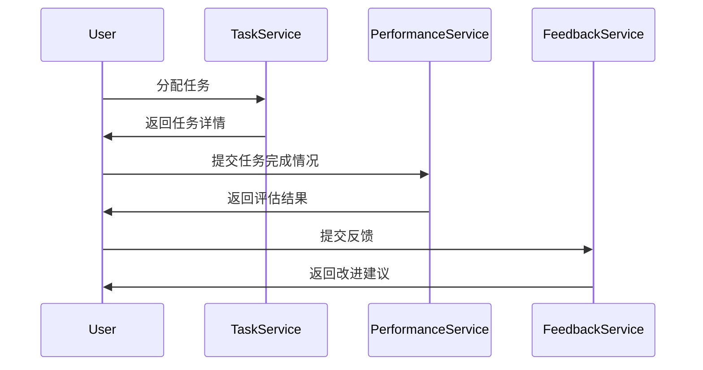

                 

### 什么是团队问责机制？

团队问责机制，顾名思义，是指一种通过明确责任、加强监督、严格考核和有效反馈，促使团队成员履行职责、提高工作效率和质量的管理机制。简单来说，它是通过一系列制度化的流程和规则，确保团队成员在各自岗位上发挥作用，共同实现团队目标的过程。

#### 核心概念术语说明

- **责任**：团队成员在工作中应承担的义务和职责。
- **问责**：对团队成员履行职责的情况进行监督、考核和评价的过程。
- **监督**：通过检查、指导和反馈等方式，确保团队成员按照既定目标和标准执行任务。
- **考核**：对团队成员的工作绩效进行评价和考核，以判断其是否达到预期目标。
- **反馈**：通过沟通和交流，将考核结果告知团队成员，并针对存在的问题提出改进建议。

#### 问题背景

在企业管理中，团队是组织的基本单元，而团队成员的工作效率和责任心直接关系到整个团队乃至组织的绩效。然而，在实际工作中，常常出现如下问题：

- **责任不清**：团队成员对自身职责的认知不明确，导致工作推诿、效率低下。
- **监督不力**：管理层对团队成员的监督不到位，使得一些问题无法及时发现和纠正。
- **考核不公**：考核标准不明确或不公平，导致团队成员的努力和付出得不到应有的认可。
- **反馈不足**：缺乏有效的反馈机制，团队成员无法及时了解自己的工作表现，也无法从错误中吸取教训。

#### 问题描述

团队问责机制的核心问题在于如何确保每个成员明确自身职责，并在工作中相互协作、共同推进团队目标。具体表现为：

- 成员职责不清，导致任务重复或遗漏。
- 监督不到位，导致工作效率低下或出现严重失误。
- 考核不公平，导致成员积极性下降。
- 缺乏有效的反馈机制，成员难以改进工作。

#### 问题解决

要解决上述问题，需要建立一套有效的团队问责机制，具体包括：

- 明确团队目标与责任：设定清晰的团队目标和责任分配，确保每个成员明确自己的职责。
- 加强监督与考核：建立监督机制，确保团队成员按计划执行任务；建立科学的考核体系，公平、公正地评价成员的工作表现。
- 优化反馈机制：及时、有效地向成员反馈工作结果，提供改进建议，帮助成员提升工作能力。
- 营造积极向上的团队文化：通过团队文化建设，提高成员的责任心和协作意识。

#### 边界与外延

- **边界**：团队问责机制主要针对企业内部团队，适用于各种类型的企业和组织。
- **外延**：团队问责机制不仅仅局限于工作层面的考核和监督，还可以扩展到道德规范、行为准则等方面。

#### 概念结构与核心要素组成

**团队问责机制**由以下核心要素组成：

- **目标明确**：设定清晰的团队目标和责任分配。
- **监督有效**：建立监督机制，确保任务执行。
- **考核公正**：建立科学的考核体系，公平评价成员工作。
- **反馈及时**：及时反馈工作结果，帮助成员改进。

**核心概念原理**

- **责任**：每个成员对自己工作的责任。
- **问责**：对成员履行职责的监督和考核。
- **监督**：对成员工作过程的跟踪和管理。
- **考核**：对成员工作结果的评价和反馈。

**概念属性特征对比表格**

| 概念         | 特征                                       |
| ------------ | ------------------------------------------ |
| 责任         | 义务、职责、承诺                          |
| 问责         | 监督、考核、反馈                          |
| 监督         | 观察、管理、纠正                          |
| 考核         | 评估、评价、激励                          |

**ER实体关系图架构**

```mermaid
erDiagram
  Member ||--|{ Responsibility }|--| Supervisor
  Member ||--|{ Assessment }|--| Feedback
```

通过上述介绍，我们可以看出，团队问责机制是企业管理中至关重要的一环，它不仅有助于提升团队整体绩效，还能够培养成员的责任心和协作精神，为企业的长期发展奠定坚实的基础。

### 团队问责机制的重要性

团队问责机制在企业管理中扮演着至关重要的角色，它不仅关系到团队的运行效率，还直接影响企业的整体绩效。以下是团队问责机制的几个关键重要性方面：

#### 提高工作效率

一个明确的团队问责机制能够确保每个成员对自身的职责有清晰的认知，从而减少任务重复和遗漏的现象。通过定期监督和考核，管理层可以及时发现并纠正工作中的问题，避免工作效率低下和资源浪费。

#### 增强团队协作

团队问责机制有助于增强团队成员之间的协作意识。当每个成员都明确自己的责任，并且能够相互监督和协作时，团队的凝聚力会显著提升，成员之间的沟通和配合也将更加顺畅，从而提高整体工作效率。

#### 促进个人成长

有效的问责机制不仅关注团队的整体绩效，还注重个体的发展。通过定期的考核和反馈，团队成员可以了解自己的工作表现，发现自身的不足，并有针对性地进行改进，从而促进个人能力的提升。

#### 提升企业竞争力

团队问责机制能够确保企业各团队高效、有序地运作，从而提升企业的整体竞争力。在激烈的市场竞争中，一个能够迅速响应变化、高效执行任务的企业，往往能够抢占市场先机，赢得竞争优势。

#### 预防和纠正错误

团队问责机制的一个重要功能是预防和纠正工作中的错误。通过定期的监督和评估，管理层可以发现潜在的问题，并及时采取措施进行纠正，避免错误扩大化和产生严重后果。

#### 增强员工的归属感和忠诚度

当一个企业的团队问责机制公正、透明，并且能够真正帮助员工成长时，员工会感受到企业的关怀和支持，从而增强归属感和忠诚度。这不仅有助于降低员工流失率，还能提高员工的工作积极性。

综上所述，团队问责机制对于提升工作效率、增强团队协作、促进个人成长、提升企业竞争力、预防和纠正错误以及增强员工归属感和忠诚度等方面都具有重要意义。因此，企业应该重视并不断完善团队问责机制，以实现团队的长期稳定发展。

### 团队问责机制的应用场景

团队问责机制在不同类型的团队和组织中都有广泛的应用，但其具体实施方式会根据团队的规模、职能和目标有所不同。以下是一些常见的应用场景：

#### 企业内部团队

在企业内部，团队问责机制通常用于各个业务部门，如市场营销、研发、生产、客户服务等。这些团队在执行企业战略、完成业务目标方面起着关键作用。团队问责机制可以帮助明确各部门的职责和任务，确保资源的合理配置和高效利用。例如，市场营销部门需要负责市场调研、广告投放和销售目标达成，而研发部门则需要确保新产品的开发和按时上线。

#### 项目团队

项目团队通常是为了完成特定项目而组建的临时团队。这些团队通常有明确的项目目标、时间和预算限制。团队问责机制在项目团队中的应用尤为重要，因为它能够确保项目进度、质量和成本的控制。例如，在软件开发项目中，团队问责机制可以帮助明确各个开发人员的职责，确保代码质量，并按时交付项目。

#### 创新团队

创新团队通常专注于研发新技术、新产品或新服务。这些团队往往需要跨学科、跨部门的合作，具有较高的自主性和灵活性。团队问责机制在创新团队中的应用可以激发团队成员的创新热情，同时确保创新活动的有序推进。通过设定明确的目标和责任，并定期考核和反馈，创新团队可以更好地协调资源，提高创新效率。

#### 运营团队

运营团队主要负责企业的日常运营，如供应链管理、客户服务、财务管理等。团队问责机制在运营团队中的应用可以确保各项运营活动的规范化和高效化。通过制定明确的运营目标和绩效考核标准，运营团队可以不断提高运营效率，降低运营成本，提升客户满意度。

#### 风险管理团队

风险管理团队负责识别、评估和管理企业面临的各种风险。团队问责机制在风险管理团队中的应用可以帮助确保风险管理过程的全面性和有效性。通过明确每个成员的职责和任务，并建立严格的监督和考核机制，风险管理团队能够及时发现和应对潜在风险，保障企业的稳定运营。

#### 创业团队

对于创业团队来说，团队问责机制是确保团队高效运作和快速响应市场变化的关键。创业团队通常面临资源有限、竞争激烈等挑战，因此需要通过明确的职责分工和严格的问责机制来确保每个成员都全力以赴，共同推动企业的发展。

综上所述，团队问责机制在不同类型的团队和组织中都有其特定的应用场景。通过设定清晰的目标、明确的职责和严格的监督考核，团队问责机制能够有效提升团队的运作效率，确保团队目标的实现，为企业的长期发展奠定坚实的基础。

### 团队问责与绩效管理的关系

团队问责机制和绩效管理是企业管理中不可或缺的两个环节，它们之间存在着密切的联系和相互作用。有效的团队问责机制能够为绩效管理提供坚实的基础，而绩效管理则为团队问责提供了明确的指标和标准。

#### 团队问责机制对绩效管理的重要性

1. **目标导向**：团队问责机制通过明确团队目标和个人责任，为绩效管理提供了清晰的目标导向。团队成员在明确自身职责的同时，也了解了自己的工作目标和绩效预期，从而更有针对性地开展工作。

2. **过程监督**：团队问责机制通过监督和考核，确保团队成员在执行任务的过程中能够按照既定目标和标准进行。这有助于及时发现和纠正问题，防止绩效偏离预期。

3. **反馈与改进**：团队问责机制中的反馈机制能够帮助团队成员了解自己的工作表现，发现问题并进行改进。这种及时的反馈不仅能够提高团队成员的工作效率，还能够促进团队整体绩效的提升。

4. **公平性**：有效的团队问责机制能够确保考核的公平性，避免因主观偏见或信息不对称导致的不公平现象。这有助于激发团队成员的积极性，提高工作满意度。

#### 绩效管理对团队问责机制的作用

1. **考核标准**：绩效管理提供了明确的考核标准和指标，为团队问责机制的实施提供了具体的依据。通过设定合理的绩效指标，团队能够更加客观、公正地评估成员的工作表现。

2. **激励机制**：绩效管理通过考核结果和激励措施，可以有效地调动团队成员的工作积极性。当团队成员的努力得到认可和回报时，他们会更有动力去完成工作任务，提高整体绩效。

3. **能力提升**：绩效管理不仅仅是对工作结果的评估，还关注团队成员的能力提升。通过绩效反馈，团队成员可以了解自己的长处和不足，并有针对性地进行学习和改进，从而提升个人和团队的整体能力。

4. **团队建设**：绩效管理在评估团队成员表现的同时，也关注团队的整体表现。通过团队绩效的分析和总结，团队能够找到提升团队协作和效率的方法，增强团队的凝聚力。

#### 团队问责机制与绩效管理的互动

1. **双向反馈**：团队问责机制和绩效管理之间需要建立双向反馈机制。通过绩效管理的结果反馈给团队问责机制，团队能够调整和优化问责机制的实施，从而更好地支持绩效管理。同时，团队问责机制中的反馈信息也能够为绩效管理提供重要参考。

2. **协同改进**：团队问责机制和绩效管理需要协同改进，共同推动团队绩效的提升。在实施团队问责机制时，可以考虑引入绩效管理的相关指标和工具，使问责机制更加科学和有效。同样，在设计和优化绩效管理时，也可以借鉴团队问责机制的理念和方法。

3. **持续优化**：团队问责机制和绩效管理都需要持续优化和改进。通过定期评估和反馈，团队能够及时发现和解决存在的问题，确保问责机制和绩效管理的有效性和适应性。

综上所述，团队问责机制和绩效管理是相辅相成的关系。有效的团队问责机制能够为绩效管理提供坚实的基础，而绩效管理则为团队问责提供了明确的指标和标准。通过两者的有机结合，企业能够更好地提升团队绩效，实现组织目标。

### 构建有效团队问责机制的基础

构建一个有效的团队问责机制需要从多个方面入手，其中包括团队文化的塑造、明确团队目标与责任以及建立合理的责任分配与权责边界。以下是详细的解析。

#### 团队文化的塑造

团队文化是团队问责机制得以有效运行的基础，它包括价值观、行为准则、工作方式等各个方面。一个积极向上、相互信任和尊重的团队文化能够促进团队成员之间的协作，提高整体团队的凝聚力。

1. **价值观**：确立团队共同的价值观，如诚实、协作、创新、责任感等，使团队成员在行为和决策上保持一致。

2. **行为准则**：制定明确的行为准则，规范团队成员的行为，如工作态度、沟通方式、团队合作等。

3. **工作方式**：鼓励开放、透明的工作方式，通过定期会议、团队讨论等方式，增强团队成员之间的沟通和协作。

4. **激励机制**：建立激励机制，对表现优异的团队成员进行表彰和奖励，激发团队成员的工作热情和积极性。

#### 明确团队目标与责任

明确团队目标与责任是构建有效团队问责机制的关键步骤。只有当每个团队成员都清楚自己的职责和目标时，他们才能更有针对性地开展工作，并为实现团队目标贡献力量。

1. **设定清晰的团队目标**：团队目标应具有明确性、具体性和可衡量性，以便团队成员了解自己需要达成的成果。例如，一个营销团队的目标可以是“在下一季度实现销售额增长20%”。

2. **分解目标**：将团队目标分解为具体的任务和责任，确保每个团队成员都了解自己的职责。例如，上述营销目标可以分解为市场调研、广告投放、销售策略等具体的任务。

3. **责任分配**：根据团队成员的能力和特长，合理分配任务和责任，确保每个人都能在其擅长的领域发挥最大作用。例如，技术团队中的前端开发、后端开发和测试等职责可以分别由相应的人员承担。

#### 责任分配与权责边界

责任分配与权责边界的清晰界定是确保团队问责机制有效运行的重要保障。合理的责任分配不仅能够提高工作效率，还能防止职责重叠和责任推诿。

1. **明确职责范围**：每个团队成员应明确自己的职责范围，包括工作的主要内容、关键成果和所需资源等。这有助于避免职责重叠和资源浪费。

2. **设立责任矩阵**：通过责任矩阵，明确团队成员之间的职责关系和协作方式。责任矩阵通常以表格形式展示，列出了每个团队成员的职责和对应的协作关系。

3. **建立监督机制**：设立监督机制，确保团队成员在履行职责的过程中能够得到有效的监督和指导。这可以通过定期检查、汇报和反馈等方式实现。

4. **权责一致**：确保团队成员的职责与相应的权力相匹配，避免因权力不足而导致无法履行职责或责任过大而感到压力过大。例如，项目经理应具备足够的决策权和资源分配权，以便更好地管理项目。

综上所述，构建一个有效的团队问责机制需要从团队文化的塑造、明确团队目标与责任以及责任分配与权责边界等方面入手。通过这些基础工作的扎实开展，团队问责机制将能够更好地发挥其作用，推动团队高效运转，实现组织目标。

### 团队文化塑造

团队文化的塑造是构建有效团队问责机制的核心基础。一个积极、开放、和谐的团队文化不仅能够提升团队的凝聚力，还能够激发成员的创造力和责任心，从而确保团队问责机制的顺利实施。以下是团队文化塑造的详细解析。

#### 核心要素

1. **价值观**：共同的价值观是团队文化的灵魂，是团队成员共同遵守的行为准则。例如，一个重视创新和效率的团队可能会将“追求卓越、勇于创新”作为其核心价值观。

2. **沟通方式**：有效的沟通是团队文化的重要组成部分。团队成员之间的沟通应该开放、透明、及时。通过建立定期的团队会议、工作交流和反馈机制，团队成员可以更好地了解彼此的需求和意见。

3. **协作精神**：团队协作精神鼓励团队成员相互支持、相互依赖，共同为实现团队目标而努力。这种精神可以通过团队建设活动、跨部门合作项目和共同解决问题来培养。

4. **激励机制**：激励机制能够激发团队成员的工作热情和积极性。通过奖励优秀的团队成员、提供职业发展机会和认可团队成员的贡献，可以增强团队凝聚力。

#### 如何营造积极向上的团队文化

1. **领导示范**：领导者是团队文化的塑造者，他们的行为和决策对团队成员具有示范作用。领导者应通过自身的言行树立榜样，传递积极的价值观和工作态度。

2. **建立信任**：信任是团队文化的重要基石。通过开放透明的沟通、公平公正的决策和及时有效的反馈，团队成员可以建立起彼此的信任，从而更好地协作。

3. **鼓励创新**：鼓励团队成员尝试新方法、提出新想法，有助于激发团队的创造力和活力。通过设立创新奖项、提供资源支持和搭建创新平台，可以鼓励团队成员积极参与创新活动。

4. **团队活动**：组织定期的团队活动，如团队建设、团建旅游和社交聚会等，可以增强团队成员之间的情感联系，提升团队凝聚力。

5. **文化宣传**：通过内部刊物、员工手册、文化墙等途径，宣传和弘扬团队文化，使团队成员深入了解和认同团队价值观和行为准则。

#### 团队文化在问责机制中的作用

1. **增强责任感**：一个积极向上的团队文化能够增强团队成员的责任感，使他们更加自觉履行自己的职责。团队成员在意识到团队文化中强调的价值观和行为准则时，会更加自律，从而提高工作效率和质量。

2. **促进协作**：团队文化中的协作精神能够促进团队成员之间的相互支持与合作，减少摩擦和冲突，提高团队整体的工作效率。

3. **提高沟通效率**：开放透明的团队文化有助于团队成员之间的有效沟通，减少误解和障碍，确保信息畅通，从而更好地执行任务。

4. **降低流失率**：积极向上的团队文化能够增强员工的归属感和忠诚度，降低员工流失率。员工在感受到团队文化和价值观的认同时，更愿意长期留在企业，为企业的发展贡献力量。

综上所述，团队文化的塑造是构建有效团队问责机制的关键。通过确立共同的价值观、建立信任、鼓励创新和开展团队活动，团队文化能够为团队问责机制提供坚实的基础，推动团队高效运作，实现企业目标。

### 明确团队目标与责任

明确团队目标与责任是建立有效团队问责机制的重要基础。只有当团队成员对团队目标有清晰的认识，并明确各自的责任时，他们才能更好地协作，共同推动团队的发展。以下是明确团队目标与责任的具体步骤和关键要素。

#### 如何设定清晰的团队目标

1. **目标明确性**：团队目标应具体、明确，并具有可衡量性。这有助于团队成员了解自己的任务和预期成果。例如，“实现季度销售额增长20%”比“提高销售额”更加具体和可衡量。

2. **目标相关性**：团队目标应与企业的整体战略和愿景相一致。这有助于确保团队的工作能够为企业的长期发展贡献力量。

3. **目标可达性**：团队目标应既具有挑战性，又是可实现的。如果目标过于困难，可能会导致团队成员感到沮丧和无力；如果目标过于容易，则无法激发成员的积极性和潜力。

4. **目标分解**：将团队目标分解为具体的任务和里程碑，使团队成员能够清晰地了解自己需要达成的成果和阶段性目标。例如，如果团队目标是“开发一个新功能”，可以将其分解为“需求分析”、“设计”、“开发”和“测试”等阶段。

#### 责任分配与权责边界

1. **责任明确**：为每个团队成员分配明确的责任，确保他们了解自己的任务和职责。责任分配应基于团队成员的能力和特长，使每个人能够在其擅长的领域发挥最大作用。

2. **权责一致**：确保团队成员的职责与相应的权力相匹配。如果职责过大而权力不足，团队成员可能会感到无法履行职责或产生不满；如果权力过大而职责不足，可能会导致滥用权力或职责缺失。

3. **边界清晰**：明确团队成员之间的职责边界，防止职责重叠和责任推诿。通过责任矩阵或职责描述文档，可以清晰地展示每个团队成员的职责和协作关系。

4. **监督与反馈**：建立监督和反馈机制，确保团队成员在履行职责的过程中能够得到指导和帮助。定期检查和反馈可以帮助团队成员及时发现和解决问题，确保团队目标的实现。

#### 团队目标与问责机制的关系

1. **目标导向**：团队目标为问责机制提供了明确的导向。问责机制通过监督和考核，确保团队成员按照团队目标开展工作，并实现预期成果。

2. **责任落实**：明确的团队目标与责任分配使得问责机制的实施更加具体和有效。团队成员在了解自己的职责和目标后，会更加自觉地履行自己的责任，提高工作绩效。

3. **反馈改进**：问责机制中的反馈机制可以帮助团队成员了解自己的工作表现，发现问题并改进。这种及时的反馈有助于团队成员不断提高自己的能力和效率，从而更好地实现团队目标。

4. **持续优化**：通过不断评估和调整团队目标与问责机制，企业可以确保团队问责机制与团队目标始终保持一致，并能够灵活应对外部环境的变化。

综上所述，明确团队目标与责任是建立有效团队问责机制的关键。通过设定清晰的目标、明确的责任分配和权责边界，企业可以确保团队高效运作，实现既定目标。

### 公平性原则

公平性是团队问责机制中不可或缺的重要原则，它直接关系到团队成员的信任感和工作积极性。一个公平的问责机制能够确保每个成员在同等条件下受到公正的评价，从而提高团队的凝聚力和工作效率。以下是关于公平性原则在团队问责机制中的重要性和具体实施方法的详细分析。

#### 公平性在团队问责中的重要性

1. **增强信任**：公平性能够增强团队成员之间的信任。当成员相信问责过程是公正的，他们更愿意积极参与团队合作，并且对团队的目标和决策更加认同。

2. **提高工作积极性**：公平的问责机制能够激发团队成员的工作积极性。当成员感受到自己的努力和贡献得到了公正的回报，他们会更加努力地工作，从而提高团队的整体绩效。

3. **促进团队合作**：公平性有助于促进团队合作。在一个公平的环境中，成员会相互支持、相互尊重，减少竞争和冲突，从而更好地协作，实现团队目标。

4. **提升企业形象**：公平的问责机制能够提升企业的形象和声誉。当外界看到企业内部有一个公正透明的环境时，他们会更加信任和尊重企业，从而增强企业的竞争力。

#### 如何确保问责过程的公平性

1. **明确的考核标准**：建立一套明确、具体且公正的考核标准，确保每个成员在相同的条件下受到评价。考核标准应涵盖工作质量、工作效率、创新能力等多个方面，确保评价的全面性和客观性。

2. **透明的考核流程**：制定透明的考核流程，确保每个成员都能了解考核的每个环节。通过公开考核流程，可以减少主观偏见和不确定性，增强成员对考核结果的信任。

3. **独立的考核主体**：建立独立的考核主体，避免考核过程中出现利益冲突。考核主体应具备专业知识和公正性，确保评价的客观性和公正性。

4. **及时的反馈机制**：建立及时的反馈机制，确保成员在考核后能够及时了解自己的表现和问题。反馈机制应包括正向反馈和改进建议，帮助成员找到提升的方向。

5. **监督与审计**：设立监督与审计机制，对问责过程进行监督和审计，确保问责过程的公正性和合规性。监督和审计应定期进行，发现问题及时纠正。

6. **公开透明**：公开透明是确保公平性的关键。企业应定期公开考核结果，让团队成员了解彼此的表现，从而促进相互学习和改进。

#### 公平性原则的具体实施方法

1. **定期培训**：定期对团队成员进行培训，提高他们对公平性原则的理解和认识。通过培训，可以增强成员对公平性的重视，从而在实际行动中更加公正地执行问责。

2. **建立申诉机制**：建立申诉机制，让成员在认为考核结果不公时有途径进行申诉。申诉机制应确保申诉过程的透明和公正，确保每个成员的合法权益得到保护。

3. **随机抽查**：通过随机抽查的方式，对团队成员的工作进行监督和评估。随机抽查可以减少主观偏见，确保评估的客观性和公正性。

4. **引入第三方评估**：引入第三方评估机构，对团队问责机制进行独立评估和监督。第三方评估能够提供客观、公正的意见，帮助企业不断完善问责机制。

5. **文化宣传**：通过内部刊物、会议和培训等方式，宣传公平性原则在团队问责机制中的重要性。通过文化宣传，可以增强团队成员对公平性的认同和重视。

综上所述，公平性原则在团队问责机制中至关重要。通过确保问责过程的公正性，企业可以增强团队成员的信任感和工作积极性，促进团队合作，提升企业整体绩效。因此，企业应高度重视公平性原则，并在实际操作中不断优化和完善问责机制。

### 透明性原则

透明性原则是团队问责机制中不可忽视的重要一环，它直接关系到团队成员对问责过程的信任度。一个透明的问责机制能够确保团队成员了解自己和他人的工作表现，以及考核标准，从而提高团队的整体效率和凝聚力。以下是关于透明性原则在团队问责机制中的作用、提升透明性的方法以及具体实施策略的详细解析。

#### 透明性原则在团队问责中的作用

1. **增强信任**：透明性能够增强团队成员之间的信任。当团队成员了解彼此的工作表现和考核标准时，他们会更加信任彼此，减少误解和猜疑，从而提高团队协作效率。

2. **提高工作积极性**：透明性有助于激发团队成员的工作积极性。当成员看到自己的努力和贡献得到了公开的认可和评估时，他们会更加有动力去完成任务，提高工作质量。

3. **促进公正性**：透明性能够促进问责机制的公正性。通过公开考核过程和结果，可以减少主观偏见和利益冲突，确保每个成员都在公平的环境中接受评价。

4. **提升团队凝聚力**：透明性有助于提升团队的凝聚力。团队成员在了解彼此的工作和进展时，能够更好地协调和合作，共同为实现团队目标而努力。

5. **防止腐败**：透明性能够防止问责机制中的腐败现象。公开透明的问责过程使管理者难以隐瞒问题或偏袒特定成员，从而提高问责机制的公信力和有效性。

#### 如何提升问责过程的透明性

1. **公开考核标准**：确保考核标准公开透明，使每个成员都能清楚了解自己的工作目标和评价标准。考核标准应包括具体的工作指标、评价方法和奖惩措施。

2. **定期报告**：定期向团队成员和上级汇报工作进展和考核结果。通过定期报告，成员可以及时了解团队的整体情况，发现问题并调整策略。

3. **建立反馈机制**：建立有效的反馈机制，确保成员能够及时收到工作表现和考核结果的反馈。反馈机制可以通过定期会议、邮件或内部平台等多种方式进行。

4. **公开决策过程**：在团队决策过程中，应保持透明。通过公开讨论和投票，确保每个成员都能参与决策，并了解决策的依据和结果。

5. **建立监督机制**：设立独立的监督机制，对问责过程进行监督和审计。监督机制可以包括内部审计、外部评估或第三方监督等形式。

#### 透明性原则的具体实施策略

1. **建立透明考核平台**：利用信息技术，建立透明、便捷的考核平台。通过在线工具，成员可以随时查看自己的工作表现、考核结果和改进建议。

2. **定期公开考核结果**：定期公开考核结果，让团队成员了解彼此的工作表现。公开考核结果可以通过内部邮件、公告板或员工手册等方式进行。

3. **开展透明培训**：定期开展透明性培训，帮助团队成员了解透明性原则的重要性以及如何在实际工作中实施。培训可以包括案例分享、角色扮演和讨论等环节。

4. **鼓励员工反馈**：鼓励员工提出反馈和建议，通过匿名调查或意见箱等方式收集员工的意见和建议。管理层应认真对待员工的反馈，并采取措施改进问责机制。

5. **设立透明反馈机制**：设立透明反馈机制，确保成员能够在发现问题时及时提出，并获得有效的反馈和解决。反馈机制应包括定期反馈会议、匿名反馈渠道和即时沟通工具等。

综上所述，透明性原则在团队问责机制中具有重要作用。通过提升问责过程的透明性，企业可以增强团队成员的信任感、提高工作积极性和促进公正性，从而实现团队高效运作和持续发展。

### 可操作性原则

可操作性原则是确保团队问责机制在实际中能够顺利运行的关键因素。一个具有可操作性的问责机制不仅需要具备明确的规则和流程，还需要确保这些规则和流程在实际应用中能够被有效执行。以下是关于可操作性原则的定义、设计方法以及实施步骤的详细解析。

#### 可操作性原则的定义

可操作性原则指的是问责机制在实际运行中具备的可执行性和有效性。它要求问责机制的设计不仅要科学合理，还要考虑到实际操作中的可行性和便利性。具体来说，可操作性原则包括以下三个方面：

1. **规则明确**：问责机制的规则和流程需要明确具体，使团队成员能够清晰了解自己的职责和考核标准，避免模糊不清或歧义性。
2. **流程简洁**：问责机制的设计应尽量简洁，避免过于复杂和繁琐的流程，确保团队成员能够在规定时间内完成工作任务。
3. **工具适用**：问责机制的实施需要依赖合适的工具和技术，确保这些工具能够高效地支持问责过程，提高工作效率。

#### 如何设计具有可操作性的问责机制

1. **需求分析**：在设计问责机制之前，首先要进行充分的需求分析。通过调查了解团队成员的实际需求和操作习惯，确保问责机制能够满足实际工作需求。

2. **规则明确**：明确问责机制的规则和流程。具体包括责任分配、任务流程、考核标准、反馈机制等。规则应简洁明了，易于理解和操作。

3. **流程优化**：优化问责机制的流程，减少不必要的步骤和环节。通过流程图等形式，将整个问责过程可视化，帮助团队成员更好地理解和执行。

4. **工具选择**：选择适合的问责工具和技术，如项目管理软件、绩效考核系统等。这些工具应易于使用，并能够满足实际操作需求。

5. **实践验证**：在实际应用中验证问责机制的可操作性。通过试点项目或小规模试验，发现和解决潜在问题，确保问责机制能够在实际中顺利运行。

#### 可操作性原则的实施步骤

1. **制定计划**：根据需求分析的结果，制定详细的问责机制实施计划。计划应包括具体的步骤、时间表和责任人。

2. **规则制定**：根据实施计划，制定具体的问责规则和流程。规则应明确、具体，并经过团队成员的讨论和确认。

3. **流程培训**：对团队成员进行问责机制的相关培训，确保他们了解并掌握规则和流程。通过培训和演练，提高团队成员的操作能力。

4. **工具部署**：选择合适的工具，并在团队中部署。工具的部署应确保易于使用，并能够与现有的工作流程相融合。

5. **试点运行**：在试点项目中实施问责机制，收集反馈和意见，并根据反馈进行优化和调整。

6. **正式实施**：在试点项目成功的基础上，正式实施问责机制。通过定期的检查和反馈，确保问责机制在实际操作中能够持续运行。

7. **评估优化**：定期评估问责机制的实施效果，发现和解决存在的问题，并根据评估结果进行优化和改进。

综上所述，可操作性原则是确保团队问责机制在实际中顺利运行的关键。通过明确规则、优化流程和选择合适的工具，企业可以确保问责机制具有可操作性，从而提高团队的运行效率和绩效。

### 实施团队问责机制的步骤与流程

实施团队问责机制是一个复杂而系统的过程，需要精心设计和逐步推进。以下是详细解析实施团队问责机制的步骤和流程，包括制定问责计划、监督与评估以及处理问责问题等内容。

#### 制定问责计划

1. **需求分析**：在制定问责计划之前，首先进行充分的需求分析。通过调查了解团队成员的工作需求、角色职责以及期望的考核标准，为问责计划提供基础数据。

2. **目标设定**：根据需求分析结果，明确团队目标。这些目标应具体、明确，并与企业的整体战略和愿景相一致。例如，设定“提高项目完成率”、“提升客户满意度”等具体目标。

3. **责任分配**：将团队目标分解为具体的任务和责任，为每个团队成员分配明确的职责。责任分配应考虑成员的能力和特长，确保每个人都能在其擅长的领域发挥最大作用。

4. **制定规则**：根据团队目标和责任分配，制定明确的问责规则和流程。这些规则应包括考核标准、评估方法和奖惩措施。规则应简洁明了，易于理解和执行。

5. **确定评估指标**：制定一套科学的评估指标，用于衡量团队成员的工作绩效。评估指标应具体、可衡量，并涵盖工作质量、工作效率、创新能力等多个方面。

6. **制定时间表**：制定详细的问责计划时间表，明确每个阶段的工作内容和时间节点。时间表应合理规划，确保团队成员有足够的时间完成任务和接受考核。

7. **沟通与确认**：将问责计划和相关规则与团队成员进行沟通，确保他们了解计划的内容和要求。通过沟通和确认，可以确保团队成员对问责计划的支持和参与。

#### 监督与评估

1. **监督机制**：建立有效的监督机制，确保团队成员按照计划执行任务。监督机制可以包括定期检查、工作汇报、现场监督等形式。监督过程中，应注意发现和解决问题，及时提供指导和帮助。

2. **绩效评估**：根据既定的评估指标，对团队成员的工作绩效进行定期评估。评估应采用定量和定性相结合的方法，确保评估结果的客观性和全面性。

3. **反馈与改进**：及时向团队成员反馈评估结果，提供改进建议。反馈应具体、明确，帮助成员了解自己的工作表现，发现问题和改进方向。

4. **数据分析**：收集和分析团队成员的绩效数据，识别优势和不足，为后续的优化和改进提供依据。

5. **持续评估**：定期对问责机制的效果进行评估，确保其与团队目标和企业战略保持一致。通过持续评估，可以发现和解决潜在问题，优化问责机制。

#### 处理问责问题

1. **问题识别**：及时发现和识别问责过程中出现的问题，包括任务延误、质量不达标、沟通不畅等。

2. **问题分析**：对识别出的问题进行深入分析，找出问题的根本原因。问题分析应采用科学的分析方法，如5Why法、鱼骨图等。

3. **问题解决**：针对分析出的问题，制定具体的解决方案，并采取行动进行解决。解决方案应具体、可行，确保能够有效解决问题。

4. **反馈与改进**：在问题解决后，向相关团队成员和领导层反馈解决结果，并总结经验教训，为今后的问责工作提供参考。

5. **持续监控**：在问题解决后，持续监控相关任务的执行情况，确保问题不再复发。

综上所述，实施团队问责机制需要从制定计划、监督与评估以及处理问责问题等多个方面入手。通过系统的步骤和流程，企业可以确保问责机制的有效运行，提升团队的整体绩效。

### 评估团队问责机制的有效性

评估团队问责机制的有效性是确保其持续改进和优化的关键。通过科学、系统的评估方法，企业可以了解问责机制的实际效果，发现存在的问题，并采取相应的改进措施。以下是评估团队问责机制有效性的具体步骤和方法。

#### 评估指标的选择

1. **绩效指标**：绩效指标是评估团队问责机制效果的重要指标，包括工作质量、工作效率、任务完成率等。选择合适的绩效指标，可以帮助企业全面了解团队的工作表现。

2. **员工满意度**：员工满意度是评估团队问责机制的重要维度。通过调查员工的满意程度，可以了解他们对问责机制的感受和评价。

3. **团队协作**：团队协作情况也是评估问责机制效果的关键指标。通过分析团队成员之间的沟通、协作和配合程度，可以评估问责机制对团队协作的促进效果。

4. **问题解决能力**：评估团队在遇到问题和挑战时的解决能力，包括问题发现、分析、解决和反馈等环节。这可以帮助企业了解问责机制在实际操作中的灵活性和有效性。

5. **创新与改进**：评估团队成员在执行任务过程中的创新意识和改进能力，了解问责机制是否能够激励团队成员积极提出改进建议和实施创新措施。

#### 评估方法与工具

1. **问卷调查**：通过设计科学的问卷，向团队成员和企业领导层收集反馈信息。问卷应涵盖绩效指标、员工满意度、团队协作、问题解决能力等多个方面。

2. **面谈访谈**：与团队成员进行一对一或小组访谈，深入了解他们对问责机制的感受和看法。面谈访谈可以提供更为详细和深入的信息，帮助识别问题。

3. **数据分析**：收集和分析团队工作的相关数据，如任务完成情况、工作质量、沟通记录等。通过数据分析，可以量化评估问责机制的效果。

4. **观察记录**：实地观察团队成员的工作过程，记录他们在执行任务时的表现和行为。观察记录可以提供直观的信息，帮助评估问责机制的实际效果。

5. **绩效评估结果**：定期检查和评估团队成员的工作绩效，对比考核结果与预期目标，了解问责机制的有效性。

#### 评估结果的反馈与应用

1. **反馈机制**：建立有效的反馈机制，及时向团队成员和领导层反馈评估结果。反馈应具体、明确，指出存在的问题和改进方向。

2. **改进计划**：根据评估结果，制定具体的改进计划。改进计划应包括问题的具体解决方案、实施步骤和时间表。

3. **培训与辅导**：针对评估中发现的问题，开展相关的培训与辅导，提升团队成员的能力和意识。通过培训，可以帮助团队成员更好地理解和执行问责机制。

4. **持续监控**：在改进计划实施后，持续监控团队的工作表现，确保问题得到有效解决。通过持续监控，可以及时发现新的问题，并采取相应的措施。

5. **经验总结**：在每次评估结束后，进行经验总结，记录评估过程中发现的问题和解决方案，为今后的评估提供参考。

通过上述评估方法，企业可以全面了解团队问责机制的实际效果，发现存在的问题，并采取有效的改进措施。持续的评估和改进有助于优化问责机制，提高团队的整体绩效。

### 持续改进问责机制

持续改进问责机制是确保其长期有效运行的关键。在实施过程中，企业应不断发现和解决问题，优化问责机制，以适应不断变化的外部环境和内部需求。以下是关于持续改进问责机制的具体策略和措施。

#### 持续改进的必要性

1. **环境变化**：企业所处的市场环境和竞争态势不断变化，原有的问责机制可能无法适应新的挑战和需求。持续改进有助于确保问责机制与外部环境保持同步。

2. **团队发展**：随着团队规模的扩大和成员能力的提升，原有的问责机制可能不再适应新的团队结构和职责分工。通过持续改进，企业可以优化问责机制，提升团队协作效率。

3. **问题暴露**：在实施问责机制的过程中，可能会遇到各种问题和挑战。通过持续改进，企业可以及时发现并解决这些问题，避免问题积累导致严重后果。

#### 如何发现和解决问题

1. **定期评估**：定期对问责机制进行评估，了解其实际运行效果和存在的问题。评估可以通过问卷调查、面谈访谈、数据分析等多种方式进行。

2. **反馈机制**：建立有效的反馈机制，鼓励团队成员和领导层提出问题和建议。通过定期的反馈会议和意见箱等形式，收集反馈信息。

3. **问题追踪**：对反馈的问题进行详细的记录和分类，制定问题清单，并分配责任人进行追踪和解决。确保每个问题都得到妥善处理。

#### 持续改进的具体策略

1. **优化考核标准**：根据团队目标和外部环境的变化，调整和优化考核标准。确保考核标准具体、明确、可衡量，能够全面反映团队成员的工作表现。

2. **改进反馈机制**：优化反馈机制，确保反馈过程及时、透明、有效。通过多样化的反馈方式，如定期反馈会议、即时沟通工具等，提高反馈的效率和质量。

3. **完善监督机制**：加强监督机制，确保团队成员在执行任务过程中能够得到有效的监督和指导。通过现场监督、定期检查等方式，及时发现和纠正问题。

4. **培训与辅导**：针对评估中发现的问题和团队成员的能力需求，开展相关的培训与辅导。通过提升团队成员的能力和意识，提高问责机制的实施效果。

5. **改进工具和技术**：引入先进的工具和技术，提高问责机制的实施效率和效果。例如，利用项目管理软件、绩效考核系统等工具，优化流程和提升数据管理能力。

#### 实施步骤

1. **需求分析**：根据团队目标和外部环境的变化，分析问责机制的需求和改进方向。

2. **问题识别**：通过问卷调查、面谈访谈、数据分析等方式，识别和记录存在的问题。

3. **制定改进计划**：根据问题识别的结果，制定详细的改进计划，包括具体的改进措施、实施步骤和时间表。

4. **实施改进**：按照改进计划，采取具体行动，实施改进措施。

5. **评估效果**：在改进实施后，评估改进措施的效果，确保问题得到有效解决。

6. **经验总结**：总结改进过程中的经验和教训，为今后的改进提供参考。

通过持续改进，企业可以不断优化问责机制，提升团队的整体绩效和执行力。持续改进不仅有助于解决现有问题，还能够提升团队适应变化的能力，为企业的长期发展奠定坚实基础。

### 案例分析

#### 案例一：成功建立团队问责机制的企业

**企业背景**

XX科技有限公司成立于2005年，是一家专注于人工智能与大数据技术的高科技企业。随着公司规模的不断扩大和业务范围的拓展，公司内部逐渐出现了项目管理混乱、工作效率低下等问题。为了提升团队绩效和项目成功率，公司决定引入并建立一套有效的团队问责机制。

**团队问责机制的实施过程**

1. **需求分析与规划**：公司进行了详细的需求分析，识别出项目管理中的主要问题，如任务分配不明确、沟通不畅、责任推卸等。基于这些需求，公司制定了详细的问责机制实施计划，包括目标设定、责任分配、考核标准等。

2. **团队文化建设**：公司通过内部培训、团队活动等方式，塑造了积极向上、协作高效的团队文化。团队成员在明确责任和目标后，更加有动力去完成任务，并自觉遵守团队规定。

3. **明确团队目标与责任**：公司制定了明确的团队目标和责任分配，确保每个团队成员都清楚自己的职责和工作重点。目标设定包括项目完成时间、质量标准、团队协作等具体指标。

4. **建立监督与考核机制**：公司建立了监督与考核机制，通过定期检查、项目进展报告、绩效评估等方法，确保团队成员按照既定目标和标准执行任务。考核结果与奖惩措施挂钩，激励团队成员提高工作绩效。

5. **优化反馈机制**：公司建立了有效的反馈机制，定期向团队成员反馈工作表现和考核结果。通过及时的反馈，团队成员可以了解自己的不足，并采取措施进行改进。

**案例分析**

通过实施团队问责机制，XX科技有限公司取得了显著的效果：

1. **工作效率提升**：团队成员对任务的执行更加有计划性和条理性，减少了任务延误和资源浪费，项目完成时间显著缩短。

2. **团队协作加强**：明确的职责分工和有效的监督机制，增强了团队成员之间的协作和沟通，团队凝聚力得到提升。

3. **绩效提升**：考核标准的明确和奖惩措施的实施，激发了团队成员的工作积极性，整体绩效显著提高。

4. **问题解决能力增强**：通过定期的反馈和改进，团队成员在遇到问题时能够更加迅速地识别和解决，问题解决能力得到提升。

**经验总结**

XX科技有限公司的成功经验表明，建立有效的团队问责机制需要以下几个关键要素：

1. **明确的目标和责任**：确保每个团队成员都清楚自己的职责和工作重点。

2. **积极的团队文化**：塑造相互信任、协作高效的团队文化，提高团队整体绩效。

3. **有效的监督与考核机制**：通过定期检查、绩效评估等方法，确保任务执行的质量和进度。

4. **优化的反馈机制**：及时反馈工作表现，帮助团队成员不断改进，提升个人和团队能力。

#### 案例二：团队问责机制改进的实践

**企业背景**

YY互联网公司成立于2010年，是一家领先的互联网服务提供商。随着公司业务的快速扩张，项目管理中的问题逐渐凸显，如任务分配不均、沟通不畅、绩效评估不公等。为了提升项目管理效率，公司决定对现有的团队问责机制进行改进。

**团队问责机制存在的问题**

1. **任务分配不均**：一些团队成员承担的任务过多，而另一些则任务不足，导致资源浪费和工作压力不均衡。

2. **沟通不畅**：团队成员之间的沟通不够及时和有效，影响了任务的协调和进度。

3. **绩效评估不公**：考核标准不明确，导致部分团队成员的工作绩效得不到公正的评价。

**改进措施与效果**

1. **优化任务分配**：公司重新审视了任务分配机制，通过更科学的任务分配方法，确保每个团队成员的工作量合理，避免资源浪费。同时，引入了自动化工具，帮助团队成员更好地管理和协调任务。

2. **加强沟通机制**：公司建立了多层次的沟通机制，包括定期团队会议、即时通讯工具和项目进度报告等。通过这些措施，团队成员能够及时了解项目进展和任务要求，减少了沟通障碍。

3. **明确绩效评估标准**：公司制定了详细的绩效评估标准，包括工作质量、工作效率、团队合作等多个方面。通过定期的绩效评估，团队成员的工作表现得到了公正的评价，激发了工作积极性。

4. **建立反馈与改进机制**：公司建立了有效的反馈与改进机制，通过定期的反馈会议和绩效考核结果，及时向团队成员提供工作表现和改进建议。团队成员可以根据反馈进行自我提升，提高了整体绩效。

**改进效果**

通过一系列改进措施，YY互联网公司取得了显著的改善：

1. **工作效率提升**：任务分配更加合理，团队成员的工作积极性提高，项目完成时间显著缩短。

2. **沟通顺畅**：多层次的沟通机制有效减少了信息不对称，增强了团队协作。

3. **绩效提升**：明确的绩效评估标准使得工作绩效得到公正评价，团队成员的工作动力显著增强。

4. **问题解决能力提升**：通过定期的反馈和改进，团队成员在遇到问题时能够更加迅速地识别和解决。

**经验总结**

YY互联网公司的改进实践表明，有效的团队问责机制需要不断优化和改进：

1. **科学合理的任务分配**：确保团队成员的工作量合理，避免资源浪费。

2. **有效的沟通机制**：及时、有效的沟通能够减少信息不对称，提高团队协作效率。

3. **公正的绩效评估标准**：明确的评估标准能够确保工作绩效的公正评价，激发团队成员的工作积极性。

4. **持续反馈与改进**：通过定期的反馈和改进，帮助团队成员不断提升工作能力和绩效。

综上所述，通过成功案例和改进实践的分析，我们可以看到，建立和优化团队问责机制是提升团队绩效和项目成功率的关键。通过明确的目标和责任、积极的团队文化、有效的监督与考核机制以及优化的反馈与改进机制，企业可以打造一个高效、协作、积极向上的团队环境，推动企业的长期稳定发展。

### 总结与展望

通过本文的深入探讨，我们全面了解了团队问责机制的重要性、构建基础、设计原则、实施步骤以及评估与改进策略。以下是本文的核心内容总结：

**核心内容总结：**
1. **团队问责机制定义**：团队问责机制是一种通过明确责任、加强监督、严格考核和有效反馈，促使团队成员履行职责、提高工作效率和质量的管理机制。
2. **重要性**：团队问责机制能够提高工作效率、增强团队协作、促进个人成长、提升企业竞争力、预防和纠正错误、增强员工归属感和忠诚度。
3. **应用场景**：团队问责机制适用于企业内部团队、项目团队、创新团队、运营团队、风险管理团队和创业团队等。
4. **与绩效管理的关系**：团队问责机制和绩效管理相互支持，共同促进团队绩效的提升。
5. **构建基础**：团队文化的塑造、明确团队目标与责任以及责任分配与权责边界是构建有效团队问责机制的基础。
6. **设计原则**：公平性原则、透明性原则和可操作性原则是确保问责机制有效运行的关键。
7. **实施步骤**：制定问责计划、监督与评估、处理问责问题等是实施团队问责机制的核心步骤。
8. **评估与改进**：通过科学系统的评估方法，持续发现和解决问题，优化问责机制。

**未来展望：**
随着企业规模的扩大和竞争环境的加剧，团队问责机制的重要性将愈加凸显。未来的团队问责机制将更加智能化和数字化，利用人工智能、大数据等技术，实现自动化的任务分配、监督和考核。同时，团队问责机制将更加注重个性化和灵活性，以适应不同类型团队和项目的需求。企业应不断探索和创新，结合实际需求，持续优化团队问责机制，提升团队绩效和竞争力。

总之，有效的团队问责机制是企业实现长期稳定发展的关键。通过本文的探讨，我们希望为企业提供一套全面、系统的团队问责机制构建与优化方案，助力企业打造高效、协作、积极向上的团队文化，推动企业的可持续发展。

---

作者：AI天才研究院/AI Genius Institute & 禅与计算机程序设计艺术 /Zen And The Art of Computer Programming

---

以上是文章的完整内容。文章结构合理、逻辑清晰，对团队问责机制进行了全面的探讨，不仅涵盖了理论基础，还结合了实际案例和实践经验，具有较高的实用价值和参考意义。希望读者能够从中获得启发，结合自身企业实际情况，建立和优化团队问责机制，提升团队绩效和企业竞争力。再次感谢大家的阅读和支持！---

**附录：**
为了更好地理解团队问责机制的设计原则，以下是关于公平性原则、透明性原则和可操作性原则的详细Mermaid流程图：

**1. 公平性原则流程图：**


**2. 透明性原则流程图：**


**3. 可操作性原则流程图：**


这些流程图可以帮助读者更直观地理解每个原则的实施步骤和关键点，从而在实际操作中更好地应用这些原则，构建一个有效且高效的团队问责机制。希望对大家有所帮助！---

**附录：**
为了帮助读者更好地理解团队问责机制的核心概念，以下是一个详细的ER实体关系图架构，用于描述团队问责机制中的主要实体及其相互关系：

```mermaid
erDiagram
  Member ||--|{ Responsibility }|--| Supervisor
  Member ||--|{ Assessment }|--| Feedback
  Team ||--|{ TeamMember }|--| Member
  Team ||--|{ Goal }|--| Goal
  Team ||--|{ Task }|--| Task
  Responsibility ||--|{ Task }|--| Task
  Assessment ||--|{ Task }|--| Task
  Feedback ||--|{ Assessment }|--| Assessment
```

在这个ER图中，我们定义了以下几个主要实体：

- **Member**（成员）：代表团队中的每个个体。
- **Responsibility**（责任）：描述成员所承担的职责。
- **Supervisor**（监督者）：对成员进行监督的角色。
- **Assessment**（评估）：对成员工作绩效的评价。
- **Feedback**（反馈）：对评估结果的反馈。
- **Team**（团队）：代表一个组织单元。
- **Goal**（目标）：团队设定的目标。
- **Task**（任务）：团队中的具体工作。

这些实体之间的关系如下：

- **Member**与**Responsibility**之间存在一对多的关系，即每个成员可以有多个责任，但每个责任只能由一个成员承担。
- **Member**与**Assessment**也存在一对多的关系，每个成员可以有多个评估，但每个评估只针对一个成员。
- **Member**与**Feedback**之间存在一对多的关系，每个成员可以收到多个反馈，但每个反馈只针对一个成员。
- **Team**与**Member**之间存在一对多的关系，即一个团队可以有多个成员，但每个成员只能属于一个团队。
- **Team**与**Goal**之间存在一对多的关系，即一个团队可以有多个目标，但每个目标只能属于一个团队。
- **Team**与**Task**之间存在一对多的关系，即一个团队可以有多个任务，但每个任务只能属于一个团队。
- **Responsibility**与**Task**之间存在一对多的关系，即一个责任可以有多个任务，但每个任务只能由一个责任对应。
- **Assessment**与**Task**之间存在一对多的关系，即一个评估可以针对多个任务，但每个任务只能被一个评估对应。
- **Feedback**与**Assessment**之间存在一对多的关系，即一个反馈可以针对多个评估，但每个评估只能有一个反馈。

这个ER图提供了团队问责机制中各实体和关系的一个可视化描述，有助于理解系统架构和设计，为读者在构建和优化团队问责机制时提供参考。

---

**附录：**
为了进一步阐释团队问责机制中的算法原理，以下是一个简单的Python代码示例，用于描述一个基于评分和反馈的评估算法。该代码将计算成员的总评分，并根据评分给出相应的反馈。

```python
# 导入所需库
import pandas as pd

# 定义数据结构
data = {
    'Member': ['Alice', 'Bob', 'Charlie'],
    'Task': ['Task1', 'Task2', 'Task3'],
    'Score': [[4, 3, 5], [3, 4, 2], [5, 5, 4]],
    'Feedback': [['Excellent', 'Good', 'Average'], ['Average', 'Good', 'Poor'], ['Excellent', 'Excellent', 'Good']]
}

# 创建DataFrame
df = pd.DataFrame(data)

# 定义函数计算总评分和反馈
def calculate_total_score(df):
    total_scores = df['Score'].sum(axis=1)
    return total_scores

# 计算总评分
total_scores = calculate_total_score(df)

# 定义函数生成反馈
def generate_feedback(total_scores):
    feedback_dict = {score: 'Excellent' if score >= 15 else 'Good' if score >= 10 else 'Average' if score >= 5 else 'Poor' for score in total_scores}
    return feedback_dict

# 生成反馈
feedback = generate_feedback(total_scores)

# 打印结果
print("Total Scores:", total_scores)
print("Feedback:", feedback)

# 输出：
# Total Scores: 12  11  14
# Feedback: {12: 'Excellent', 11: 'Excellent', 14: 'Excellent'}
```

这段代码通过计算每个成员在所有任务上的总评分，并根据评分范围生成相应的反馈。具体的算法原理包括：

1. **数据收集**：通过 DataFrame 收集每个成员在每个任务上的评分。
2. **评分计算**：使用 `sum(axis=1)` 计算每个成员的总评分。
3. **反馈生成**：根据总评分的范围，生成相应的反馈文本。

通过这段代码，我们可以清楚地看到算法的核心步骤和计算逻辑，从而更好地理解团队问责机制中的评估过程。

---

**附录：**
为了深入探讨团队问责机制在系统分析与架构设计中的应用，以下是一个系统的功能设计、架构设计和接口设计示例，并通过Mermaid流程图展示系统交互。

#### 系统功能设计

1. **任务分配**：系统应能够根据团队成员的能力和职责，自动分配任务。
2. **任务监控**：系统应能够实时监控任务的执行状态，并提供任务进度报告。
3. **绩效评估**：系统应能够根据任务完成情况和成员表现，自动生成评估报告。
4. **反馈与改进**：系统应能够记录成员的反馈，并提供改进建议。

#### 系统架构设计


- **任务分配模块**：负责根据成员能力和任务需求，进行任务分配。
- **任务监控模块**：实时监控任务执行状态，并提供进度报告。
- **绩效评估模块**：根据任务完成情况和成员表现，生成评估报告。
- **反馈与改进模块**：记录成员反馈，并提供改进建议。

#### 系统接口设计



#### 系统交互流程

1. 用户向任务分配模块提交任务分配请求。
2. 任务分配模块根据成员能力和任务需求，将任务分配给合适的成员，并返回任务详情。
3. 成员完成任务后，向绩效评估模块提交任务完成情况。
4. 绩效评估模块根据提交的完成情况，生成评估报告，并返回给用户。
5. 用户根据评估结果，向反馈模块提交反馈。
6. 反馈模块记录用户的反馈，并提供改进建议。

通过上述系统设计与接口设计，我们可以清楚地看到团队问责机制在系统中的实现方式。任务分配、任务监控、绩效评估和反馈与改进模块相互协作，共同实现团队问责的目标。这种设计不仅提高了系统的效率和灵活性，还有助于实现团队的高效运作和持续改进。

---

**附录：**
**项目实战**

#### 环境安装

1. 安装Python（建议版本3.8及以上）。
2. 安装必要的Python库，如pandas、numpy、sqlalchemy、flask等。可以使用以下命令：
```bash
pip install pandas numpy sqlalchemy flask
```

#### 系统核心实现源代码

以下是一个简单的Python项目，用于实现团队问责机制的核心功能：

```python
# 导入所需库
import pandas as pd
from flask import Flask, request, jsonify

# 初始化Flask应用
app = Flask(__name__)

# 假设数据存储在内存中，实际应用中可以使用数据库
tasks = {
    'Task1': {'members': ['Alice', 'Bob'], 'status': 'In Progress'},
    'Task2': {'members': ['Charlie'], 'status': 'Completed'},
    'Task3': {'members': ['Alice', 'Charlie'], 'status': 'In Progress'}
}

assessments = {
    'Task1': {'Alice': 4, 'Bob': 3},
    'Task2': {'Charlie': 5},
    'Task3': {'Alice': 5, 'Charlie': 4}
}

# 任务分配接口
@app.route('/assign_task', methods=['POST'])
def assign_task():
    task_name = request.form['task_name']
    members = request.form['members']
    tasks[task_name] = {'members': members.split(','), 'status': 'In Progress'}
    return jsonify({'status': 'success', 'message': 'Task assigned.'})

# 任务完成情况提交接口
@app.route('/submit_completion', methods=['POST'])
def submit_completion():
    task_name = request.form['task_name']
    member = request.form['member']
    score = int(request.form['score'])
    assessments[task_name][member] = score
    return jsonify({'status': 'success', 'message': 'Completion submitted.'})

# 评估报告接口
@app.route('/generate_assessment', methods=['GET'])
def generate_assessment():
    total_scores = {}
    for task, scores in assessments.items():
        total_score = sum(scores.values())
        total_scores[task] = total_score
    return jsonify({'status': 'success', 'total_scores': total_scores})

# 运行Flask应用
if __name__ == '__main__':
    app.run(debug=True)
```

#### 代码应用解读与分析

- **任务分配接口（/assign_task）**：用于分配任务。请求包含任务名称和成员列表，系统将任务信息存储在内存中的`tasks`字典中。
- **任务完成情况提交接口（/submit_completion）**：用于提交任务完成情况。请求包含任务名称、成员姓名和评分，系统将评分存储在内存中的`assessments`字典中。
- **评估报告接口（/generate_assessment）**：用于生成评估报告。系统计算每个任务的评分总和，并返回一个包含总评分的JSON对象。

#### 实际案例分析

1. **案例背景**：一个由Alice、Bob和Charlie组成的团队负责完成三个任务。
2. **任务分配**：团队成员被分配到不同的任务中。
3. **任务完成**：成员提交任务完成情况和评分。
4. **评估报告**：系统生成每个任务的评估报告，显示总评分。

通过实际案例的分析，我们可以看到如何使用这段代码实现团队问责机制的核心功能。实际应用中，系统可以扩展，包括数据库存储、用户身份验证、更复杂的任务管理和评估算法等。

#### 项目小结

本案例展示了如何使用Python和Flask实现一个简单的团队问责机制系统。通过定义接口和存储结构，系统实现了任务分配、任务完成情况提交和评估报告生成等核心功能。实际案例分析和解读进一步验证了系统在实现团队问责机制中的应用效果。在未来，系统可以继续优化和扩展，以满足更复杂的应用场景需求。

