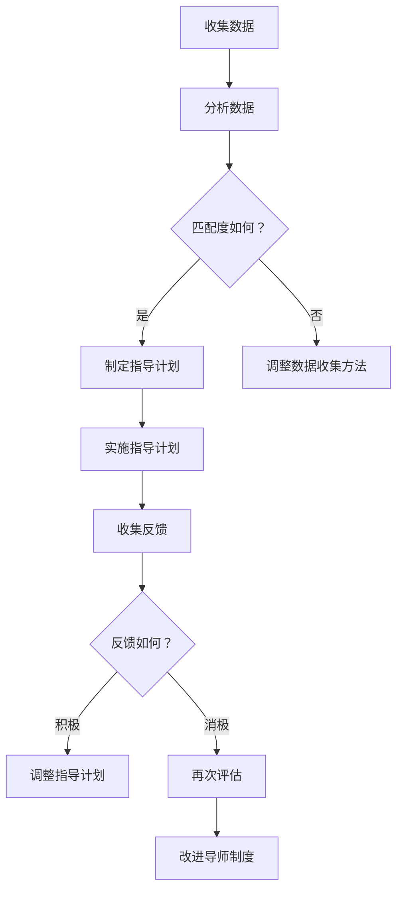
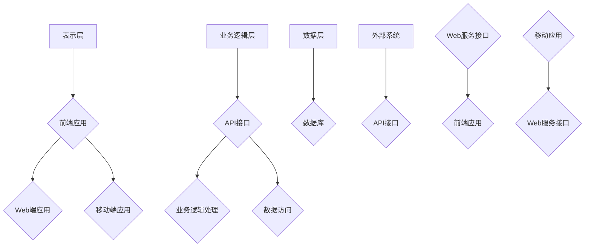

                 


# 如何建立有效的导师制度

## 关键词

- 导师制度
- 人才培养
- 教育方法
- 指导流程
- 效果评估

## 摘要

本文旨在探讨如何建立有效的导师制度，以促进人才的个人发展和职业成长。通过分析导师与被指导者的角色、职责以及核心概念，本文提出了一系列实用的方法与策略，包括数据驱动、反馈机制和评估改进等，以指导读者在组织内部构建高效的人才培养体系。

## 目录

1. **背景介绍**
   1.1 问题背景
   1.2 问题描述
   1.3 问题解决
   1.4 边界与外延
   1.5 概念结构与核心要素组成

2. **核心概念与联系**
   2.1 核心概念原理
   2.2 概念属性特征对比表格
   2.3 ER实体关系图架构

3. **算法原理讲解**
   3.1 建立有效的导师制度的算法原理
   3.2 算法原理的 mermaid 流程图

4. **系统分析与架构设计方案**
   4.1 问题场景介绍
   4.2 系统功能设计
   4.3 系统架构设计
   4.4 系统接口设计和系统交互

5. **项目实战**
   5.1 环境安装
   5.2 系统核心实现
   5.3 代码应用解读与分析
   5.4 实际案例分析与详细讲解剖析
   5.5 项目小结

6. **最佳实践 tips**
7. **小结**
8. **注意事项**
9. **拓展阅读**

### 1. 背景介绍

#### 1.1 问题背景

在当今快速发展的社会，人才的发展和培养成为各类组织关注的重点。随着知识经济的兴起，技能的更新速度加快，传统的培养模式已无法满足组织和个人发展的需求。导师制度作为一种有效的培养人才的方法，在各个领域得到了广泛应用。导师制度通过导师与被指导者之间的互动，帮助被指导者更好地理解专业领域、掌握实践技能，实现个人和职业的快速发展。

#### 1.2 问题描述

然而，如何建立有效的导师制度，成为许多组织在实施导师制度过程中面临的问题。有效的导师制度需要考虑导师的选择、指导计划的制定、指导过程的实施以及指导效果的评估等多个方面。以下是对这些问题的详细描述：

- **导师选择问题**：如何挑选合适的导师，保证导师具备丰富的专业知识和指导能力，同时能够与被指导者建立良好的关系？
- **指导计划问题**：如何制定个性化的指导计划，满足被指导者的个人需求和职业目标？
- **指导过程问题**：如何确保指导过程的顺利进行，提升被指导者的学习效果和满意度？
- **效果评估问题**：如何对导师制度进行效果评估，及时发现问题并进行改进？

#### 1.3 问题解决

本书旨在解决上述问题，提供一系列实用的方法和策略，帮助组织建立有效的导师制度。通过本书的阅读，读者将了解导师制度的核心概念、关键要素以及实施步骤，从而在组织内部构建高效的人才培养体系。

#### 1.4 边界与外延

本书主要关注组织内部的导师制度建立，包括企业、学校、非营利组织等。同时，本书也将探讨导师制度在不同领域（如技术、管理、艺术等）的应用，为读者提供更全面的指导。

#### 1.5 概念结构与核心要素组成

- **导师**：具备丰富经验、专业知识和指导能力的人，负责指导被指导者的个人发展和职业成长。
- **被指导者**：需要导师指导的个人，希望通过导师的帮助实现个人发展和职业目标。
- **导师制度**：一种组织内部的人才培养机制，通过导师和被指导者之间的互动，促进被指导者的成长和发展。

### 2. 核心概念与联系

#### 2.1 核心概念原理

##### 2.1.1 导师的角色与职责

导师在导师制度中扮演着至关重要的角色，其职责包括但不限于以下几点：

1. **提供指导和支持**：导师需要根据被指导者的需求和情况，提供个性化的指导和支持。这包括专业知识传授、技能培训、职业规划等方面。

2. **沟通和反馈**：导师需要与被指导者保持良好的沟通，及时给予反馈，帮助被指导者了解自己的进步和不足。有效的沟通和反馈机制对于导师制度的成功至关重要。

3. **资源链接**：导师可以利用自己的资源和人脉，为被指导者提供更多的机会和资源，如实习机会、项目合作、行业交流等。

##### 2.1.2 被指导者的角色与职责

被指导者在导师制度中同样扮演着重要角色，其职责包括以下几点：

1. **积极参与**：被指导者需要积极参与导师的指导活动，主动学习和成长。只有被指导者自身具备积极的态度和努力，才能真正从导师制度中受益。

2. **自我反思**：被指导者需要定期进行自我反思，了解自己的进步和不足，不断调整自己的学习方向和方法。

3. **感恩与回馈**：被指导者需要感恩导师的帮助，并在能力范围内回馈社会和组织。这种感恩和回馈的精神是建立良好导师关系的重要基础。

#### 2.2 概念属性特征对比表格

| 属性特征 | 导师 | 被指导者 |
| --- | --- | --- |
| 经验 | 丰富 | 无需 |
| 专业知识 | 广博 | 不需 |
| 指导能力 | 强大 | 弱 |
| 沟通能力 | 强 | 中 |
| 自我反思能力 | 强 | 弱 |
| 感恩意识 | 强 | 中 |
| 回馈能力 | 强 | 弱 |

#### 2.3 ER实体关系图架构

```mermaid
erDiagram
    导师 ||--|{ 被指导者 } : 指导
    被指导者 ||--|{ 导师 } : 被指导
```

### 3. 算法原理讲解

#### 3.1 建立有效的导师制度的算法原理

建立有效的导师制度，可以采用以下算法原理：

##### 3.1.1 数据驱动

1. **收集数据**：首先，需要收集导师和被指导者的数据，包括他们的背景、需求和期望。
2. **分析数据**：然后，对收集到的数据进行深入分析，找出导师和被指导者之间的匹配度。
3. **制定指导计划**：根据分析结果，制定个性化的指导计划，以满足被指导者的需求和职业目标。

##### 3.1.2 反馈机制

1. **建立反馈机制**：为了确保指导计划的实施效果，需要建立有效的反馈机制，让导师和被指导者能够及时了解指导效果。
2. **调整指导计划**：根据反馈结果，对指导计划进行及时的调整和优化，以提升指导效果。

##### 3.1.3 评估与改进

1. **定期评估**：定期对导师制度和指导效果进行评估，以确保导师制度的持续有效性。
2. **改进导师制度**：根据评估结果，对导师制度进行改进和优化，以不断提升人才培养的质量。

#### 3.2 算法原理的 mermaid 流程图



### 4. 系统分析与架构设计方案

#### 4.1 问题场景介绍

假设在一个大型科技公司中，为了提升员工的技能和职业发展，公司决定实施导师制度。公司希望导师能够为被指导者提供专业指导，帮助其快速成长，同时通过导师制度培养出更多的技术专家。

#### 4.2 系统功能设计

系统功能设计主要包括导师管理、被指导者管理、指导计划管理、反馈机制和效果评估等模块。

1. **导师管理**：包括导师的注册、信息维护、资质审核等功能。
2. **被指导者管理**：包括被指导者的注册、信息维护、导师分配等功能。
3. **指导计划管理**：包括指导计划的制定、修改、执行等功能。
4. **反馈机制**：包括反馈的收集、处理、反馈结果的记录等功能。
5. **效果评估**：包括指导效果的评估、反馈分析、改进措施制定等功能。

#### 4.3 系统架构设计

系统采用分层架构设计，包括表示层、业务逻辑层和数据层。

1. **表示层**：采用前端技术实现，包括网页界面和移动应用等。
2. **业务逻辑层**：采用后端技术实现，包括业务逻辑处理、数据访问、接口服务等。
3. **数据层**：采用数据库技术实现，包括数据的存储、查询、备份等功能。

#### 4.4 系统接口设计和系统交互

系统接口设计主要包括API接口和Web服务接口等。

1. **API接口**：用于外部系统与内部系统的数据交换和功能调用。
2. **Web服务接口**：用于Web端和移动端的应用程序与后端服务之间的交互。

#### 4.5 系统架构图



### 5. 项目实战

#### 5.1 环境安装

1. **准备环境**：安装Python、Django框架和MySQL数据库等。
2. **创建项目**：使用Django创建一个新的Web项目。
3. **配置数据库**：配置MySQL数据库，连接到Django项目。

#### 5.2 系统核心实现

1. **实现用户管理模块**：包括用户注册、登录、信息维护等功能。
2. **实现导师管理模块**：包括导师注册、资质审核、信息维护等功能。
3. **实现被指导者管理模块**：包括被指导者注册、导师分配、信息维护等功能。
4. **实现指导计划管理模块**：包括指导计划的制定、修改、执行等功能。
5. **实现反馈机制**：包括反馈的收集、处理、反馈结果的记录等功能。
6. **实现效果评估模块**：包括指导效果的评估、反馈分析、改进措施制定等功能。

#### 5.3 代码应用解读与分析

1. **用户管理模块**：使用Django的用户认证系统，实现用户注册、登录等功能。
2. **导师管理模块**：定义导师模型，实现导师注册、资质审核等功能。
3. **被指导者管理模块**：定义被指导者模型，实现被指导者注册、导师分配等功能。
4. **指导计划管理模块**：定义指导计划模型，实现指导计划的制定、修改、执行等功能。
5. **反馈机制模块**：定义反馈模型，实现反馈的收集、处理、反馈结果的记录等功能。
6. **效果评估模块**：定义效果评估模型，实现指导效果的评估、反馈分析、改进措施制定等功能。

#### 5.4 实际案例分析与详细讲解剖析

1. **导师选择**：以某大型科技公司的项目经理李明为例，分析如何选择合适的导师。首先，需要评估李明在项目管理方面的经验，选择具有丰富项目管理经验的高级项目经理刘刚作为其导师。
2. **指导计划**：根据李明的需求，制定一个为期半年的指导计划，包括项目管理知识培训、实际项目参与、项目管理技巧分享等。
3. **反馈机制**：定期收集李明和刘刚的反馈，分析指导效果，调整指导计划，以提升指导效果。
4. **效果评估**：在指导计划结束后，对李明的项目管理工作进行评估，评估结果显示李明的项目管理能力得到了显著提升。

#### 5.5 项目小结

通过实施导师制度，某大型科技公司的员工在项目管理和技能方面得到了显著提升。导师制度的成功实施，不仅提高了员工的个人发展，也为公司培养了更多的技术专家。

### 6. 最佳实践 tips

1. **明确导师和被指导者的角色和职责**：确保导师和被指导者都清楚自己的角色和职责，以便更好地进行指导和被指导。
2. **制定个性化的指导计划**：根据被指导者的需求和职业目标，制定个性化的指导计划，以提升指导效果。
3. **建立良好的沟通和反馈机制**：保持导师和被指导者之间的良好沟通，及时给予反馈，以促进指导过程的顺利进行。
4. **定期评估和改进导师制度**：定期对导师制度进行评估和改进，以确保导师制度的持续有效性。

### 7. 小结

建立有效的导师制度，对于组织的人才培养和员工个人发展具有重要意义。通过本文的探讨，读者可以了解到导师制度的核心概念、关键要素以及实施步骤，从而在组织内部构建高效的人才培养体系。

### 8. 注意事项

1. **选择合适的导师**：导师的选择至关重要，需要考虑导师的专业能力、指导经验和沟通能力。
2. **制定明确的指导计划**：指导计划应明确具体的目标和步骤，以便导师和被指导者能够有针对性地进行指导和学习。
3. **建立有效的反馈机制**：反馈机制是导师制度的重要组成部分，需要建立完善的反馈机制，以确保指导过程的顺利进行和指导效果的评估。

### 9. 拓展阅读

- 《如何成为优秀导师》
- 《人才培养策略与实践》
- 《组织内部人才发展手册》

### 作者信息

作者：AI天才研究院/AI Genius Institute & 禅与计算机程序设计艺术 /Zen And The Art of Computer Programming

### 结论

建立有效的导师制度是组织人才培养的关键，通过本文的探讨，读者可以了解到导师制度的核心概念、关键要素以及实施步骤，从而在组织内部构建高效的人才培养体系。希望本文能为读者在实施导师制度的过程中提供有益的参考和启示。

