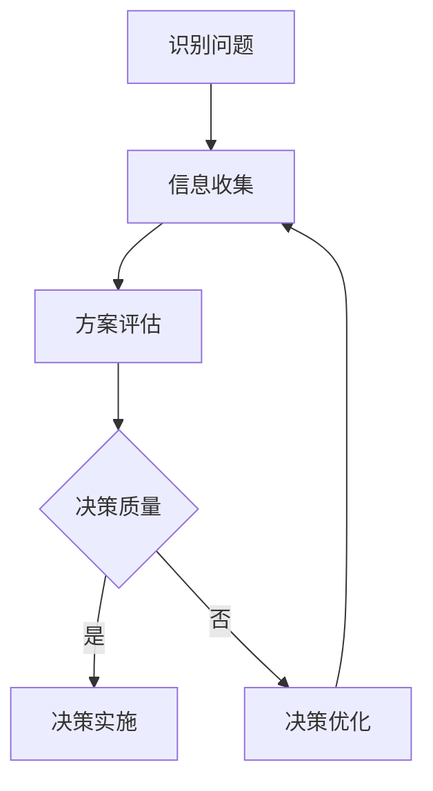
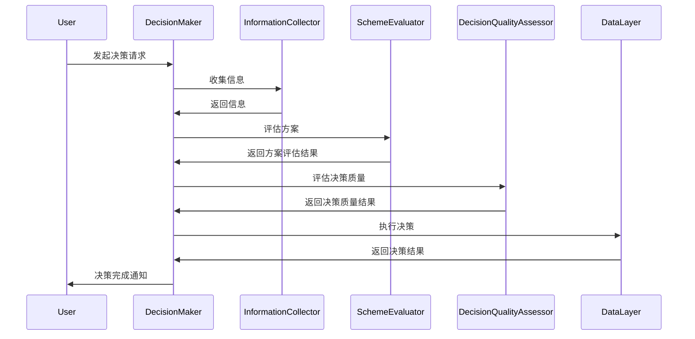

                 

# 如何提升团队的决策质量和速度

> 关键词：团队决策、决策质量、决策速度、方法论、组织行为学、项目管理

> 摘要：在快速变化的现代工作环境中，提升团队的决策质量和速度成为企业竞争力的关键。本文将从组织行为学、项目管理等多个角度，结合实际案例，逐步探讨提升团队决策质量的策略和方法，为读者提供实用的指导和建议。

## 前言

在当今的动态商业环境中，团队决策的速度和质量直接影响到企业的生存和发展。快速而准确的决策能够帮助企业抓住市场机遇，迅速应对挑战。然而，很多团队在面对复杂问题时，往往陷入决策困境，导致决策速度缓慢、质量不高。本文旨在通过系统的方法论，帮助团队提高决策质量和速度，从而提升整体竞争力。

本文将分为以下几个部分：

1. **问题背景与描述**：介绍当前团队决策中存在的主要问题。
2. **核心概念与联系**：阐述提升团队决策质量所需理解的核心概念及其关系。
3. **算法原理讲解**：详细解析提升决策质量和速度的方法和步骤。
4. **系统分析与设计**：介绍具体的项目实施方案和架构设计。
5. **项目实战**：通过实际项目案例分析，展示提升决策质量的实践效果。
6. **最佳实践与总结**：总结关键经验和注意事项，提供拓展阅读。

通过本文的阅读，读者将能够：

- 明白团队决策的重要性和当前面临的主要问题。
- 掌握提升团队决策质量和速度的方法和工具。
- 获得实际项目中的成功经验和实用技巧。

## 问题背景与描述

### 团队决策的重要性

团队决策在企业运作中扮演着至关重要的角色。无论是产品开发、市场策略，还是日常运营管理，都需要团队通过决策来做出选择。高效的团队决策能够提高工作效率、降低风险、优化资源配置，从而在激烈的市场竞争中占据优势。然而，现实中很多团队的决策存在以下问题：

### 当前团队决策存在的问题

1. **决策速度慢**：团队在面临问题时，往往需要较长时间进行讨论和决策，导致错过市场机会或无法及时应对紧急情况。
2. **决策质量不高**：团队在决策过程中，可能受到信息不对称、认知偏见等因素的影响，导致决策结果不符合预期。
3. **沟通不畅**：团队成员之间缺乏有效沟通，导致信息传递不畅，难以形成统一的决策意见。
4. **缺乏数据支持**：很多团队的决策过程缺乏数据支撑，依赖于主观判断，导致决策结果的不确定性和风险。

### 影响团队决策质量的因素

1. **信息不对称**：团队成员获取的信息不一致，导致决策过程中信息偏差。
2. **认知偏见**：人类在决策过程中容易受到自身认知偏见的影响，如确认偏见、过度自信等。
3. **决策模型复杂**：复杂问题往往需要复杂的决策模型，而团队可能缺乏相应的知识和技能。
4. **组织文化**：某些组织文化鼓励个人英雄主义，不利于集体决策的形成。

### 目标与范围

本文的目标是探讨提升团队决策质量和速度的有效方法，通过系统的方法论和实践案例，为团队提供实用的指导。本文的范围涵盖团队决策的各个环节，从问题识别、信息收集、方案评估到最终决策的实施，旨在全面提升团队决策的效率和效果。

在接下来的章节中，我们将详细分析提升团队决策质量所需理解的核心概念，并逐步介绍具体的方法和工具。

## 核心概念与联系

### 核心概念原则

为了提升团队决策的质量和速度，我们首先需要理解一些核心概念，这些概念是构建高效决策过程的基础。

1. **决策质量**：决策质量是指决策结果是否符合预期目标，包括决策的准确性、可靠性和适应性。
2. **决策速度**：决策速度是指团队从识别问题到做出决策所需的时间。
3. **信息收集**：信息收集是指团队在决策过程中获取与问题相关的数据和信息。
4. **方案评估**：方案评估是指对不同的决策方案进行评估，以确定最佳方案。
5. **沟通机制**：沟通机制是指团队成员之间进行有效沟通的流程和方式。

### 概念属性与特征对比表

为了更好地理解这些核心概念，我们可以通过一个对比表来展示它们的属性和特征。

| 概念       | 定义                                       | 属性                     | 特征                                                                                                                       |
|------------|--------------------------------------------|--------------------------|----------------------------------------------------------------------------------------------------------------------------|
| 决策质量   | 决策结果的准确性、可靠性、适应性           | - 目标一致性             | - 是否达成预期目标<br>- 是否具备应对变化的能力                                                         |
| 决策速度   | 从识别问题到做出决策所需的时间             | - 时间效率               | - 是否快速响应问题<br>- 是否有效利用时间资源                                                         |
| 信息收集   | 收集与问题相关的数据和信息                 | - 信息完整性             | - 是否全面收集信息<br>- 是否获取关键数据                                                             |
| 方案评估   | 对不同决策方案进行评估                     | - 评估标准               | - 是否基于可靠指标<br>- 是否考虑潜在风险                                                             |
| 沟通机制   | 团队成员之间进行有效沟通的流程和方式       | - 沟通效率               | - 是否有效传递信息<br>- 是否避免误解和冲突                                                           |

### ER 实体关系图

为了进一步理解这些核心概念之间的关联，我们可以使用 ER 实体关系图来展示它们之间的关系。

```mermaid
erDiagram
    Decision_Quality ||--|{ Decision_Speed }|-- Information_Collection
    Decision_Quality ||--|{ Scheme_Assessment }|-- Communication_Mechanism
    Scheme_Assessment ||--|{ Decision_Quality }|-- Communication_Mechanism
    Communication_Mechanism ||--|{ Decision_Speed }|-- Information_Collection
```

在上述 ER 图中，我们可以看到：

- 决策质量与决策速度、信息收集和方案评估之间存在直接的关联。
- 决策速度和信息收集是决策质量的基础，而方案评估和沟通机制则直接影响决策质量。

### 关键关系解释

1. **决策质量与决策速度的关系**：高决策质量通常需要更多的时间来评估和验证，但过慢的决策速度可能导致机会的错失。因此，在提升决策质量的同时，也需要找到平衡决策速度的方法。
2. **信息收集与方案评估的关系**：有效的信息收集是方案评估的基础。只有获取全面、准确的信息，才能进行科学的方案评估。
3. **沟通机制与决策质量的关系**：良好的沟通机制可以促进团队成员之间的信息共享和协作，减少误解和冲突，从而提高决策质量。

在接下来的章节中，我们将详细解释如何通过具体的方法和工具来提升团队决策的质量和速度。

## 算法原理讲解

### Mermaid 流程图

为了提升团队决策的质量和速度，我们可以设计一个系统化的流程来指导团队进行决策。下面是一个使用 Mermaid 语言描述的流程图：



### Python 代码解释

为了实现上述流程，我们可以编写一个 Python 脚本来辅助团队进行决策：

```python
import random

def information_collection(problem):
    # 模拟信息收集的过程
    print("正在收集与问题相关的信息...")
    return "收集到关键信息：问题背景、市场需求、资源情况等。"

def scheme_evaluation(schemes, problem):
    # 模拟方案评估的过程
    print("正在评估不同方案...")
    best_scheme = random.choice(schemes)  # 随机选择一个方案作为最佳方案
    return best_scheme

def decision_quality(evaluation_result, problem):
    # 模拟决策质量评估的过程
    if "优化" in evaluation_result:
        print("决策质量：需要进一步优化。")
        return False
    else:
        print("决策质量：符合预期。")
        return True

def decision_implmentation(scheme, problem):
    # 模拟决策实施的过程
    print("正在实施决策...")
    print(f"决策实施：根据方案 '{scheme}' 进行操作。")

def decision_process(problem):
    schemes = ["方案A", "方案B", "方案C"]  # 可供选择的方案列表
    info = information_collection(problem)
    best_scheme = scheme_evaluation(schemes, problem)
    quality = decision_quality(best_scheme, problem)
    
    if quality:
        decision_implmentation(best_scheme, problem)
    else:
        print("决策实施前需要进一步优化方案。")

# 主程序入口
problem = "市场需求变化导致产品策略需要调整"
decision_process(problem)
```

### 数学模型和公式

在决策过程中，可以使用一些数学模型和公式来帮助评估方案。以下是一个简化的决策模型：

$$
\text{决策评分} = w_1 \times \text{方案收益} + w_2 \times \text{方案风险}
$$

其中，$w_1$ 和 $w_2$ 分别是收益权重和风险权重，可以根据团队的具体情况进行调整。

### 详细讲解和举例

#### 1. 信息收集

在决策过程中，信息收集是至关重要的。假设我们正在决定是否进入一个新的市场。我们需要收集以下信息：

- 市场规模：使用大数据分析工具，我们可以获取目标市场的潜在客户数量。
- 竞争情况：分析现有竞争对手的市场份额、产品特点、营销策略等。
- 法规政策：研究目标市场的法律法规，了解政策对市场的影响。

#### 2. 方案评估

基于收集到的信息，我们可以制定多个进入新市场的方案。每个方案都有其潜在的收益和风险。以下是一个简单的示例：

- 方案A：投资500万元，进行市场调研和产品开发。
  - 收益：如果成功，预计年收益为1000万元。
  - 风险：如果失败，损失500万元。

- 方案B：与现有合作伙伴合作，共同开发产品。
  - 收益：如果成功，预计年收益为800万元。
  - 风险：如果合作不顺，可能导致项目延期。

#### 3. 决策质量评估

使用上述决策评分模型，我们可以对每个方案进行评估。以方案A为例，假设收益权重为0.7，风险权重为0.3，则：

$$
\text{决策评分} = 0.7 \times 1000 + 0.3 \times (-500) = 700 - 150 = 550
$$

同理，可以计算方案B的决策评分。

#### 4. 决策实施

根据评估结果，选择得分最高的方案进行实施。在决策实施过程中，还需要监控实际效果，并根据实际情况进行调整。

通过上述流程，我们可以看到，利用系统的方法和工具，团队可以更科学、更高效地进行决策，从而提升决策质量和速度。

## 系统分析与设计

### 问题场景介绍

在一个快速发展的科技企业中，团队需要定期进行关键决策，如产品方向调整、市场拓展策略等。由于市场竞争激烈，团队必须在短时间内做出高效且准确的决策。现有决策流程存在以下问题：

- 决策速度较慢，导致错过市场机会。
- 决策质量不高，决策结果与预期目标存在较大差距。
- 团队成员之间沟通不畅，信息传递效率低。

### 项目介绍

为了解决上述问题，本项目旨在设计并实施一套高效的团队决策系统，通过优化决策流程、提升信息收集和分析能力、改善沟通机制，来提高决策质量和速度。项目目标如下：

- 提高决策速度：将决策周期缩短30%。
- 提高决策质量：将决策失败率降低50%。
- 提升团队协作效率：提高团队成员之间的沟通和协作水平。

### 系统功能设计（类图）

为了实现上述目标，我们设计了一套系统功能，如下所示：

```mermaid
classDiagram
    DecisionMaker <|-- InformationCollector
    DecisionMaker <|-- Communicator
    DecisionMaker <|-- SchemeEvaluator
    DecisionMaker <|-- DecisionQualityAssessor

    DecisionMaker {
        +makeDecision()
        +collectInformation()
        +communicate()
        +evaluateSchemes()
        +assessDecisionQuality()
    }

    InformationCollector {
        +collectInformation()
    }

    Communicator {
        +communicate()
    }

    SchemeEvaluator {
        +evaluateSchemes()
    }

    DecisionQualityAssessor {
        +assessDecisionQuality()
    }
```

在这个类图中，`DecisionMaker` 是核心类，负责协调其他类进行决策的全过程。其他类包括信息收集器、沟通者、方案评估器和决策质量评估器，分别负责不同的功能模块。

### 系统架构设计（架构图）

为了确保系统能够高效运行，我们采用了三层架构设计，包括表示层、逻辑层和数据层。

```mermaid
sequenceDiagram
    User -->|发起请求| DecisionMaker
    DecisionMaker -->|调用| InformationCollector
    InformationCollector -->|返回| DecisionMaker
    DecisionMaker -->|调用| SchemeEvaluator
    SchemeEvaluator -->|返回| DecisionMaker
    DecisionMaker -->|调用| DecisionQualityAssessor
    DecisionQualityAssessor -->|返回| DecisionMaker
    DecisionMaker -->|执行决策| DataLayer
```

在这个架构图中，用户通过表示层发起决策请求，逻辑层负责处理决策过程，包括信息收集、方案评估和决策质量评估，最后通过数据层进行决策的执行和记录。

### 系统接口设计

为了实现系统各组件之间的有效通信，我们设计了一系列接口：

```mermaid
classDiagram
    DecisionInterface {
        +collectInformation()
        +evaluateSchemes()
        +assessDecisionQuality()
    }

    CommunicationInterface {
        +sendMessage()
        +receiveMessage()
    }

    DataInterface {
        +storeData()
        +retrieveData()
    }
```

这些接口确保了信息在系统内部的高效传递和交互，使得各组件能够协同工作。

### 系统交互（序列图）

为了展示系统内部各组件的交互过程，我们使用序列图进行了详细描述：



在这个序列图中，用户发起决策请求后，决策系统依次调用信息收集器、方案评估器和决策质量评估器，最终将决策结果反馈给用户。

通过上述系统分析与设计，我们为团队提供了一套完整的决策解决方案，旨在提升决策质量和速度，为企业的可持续发展提供有力支持。

## 项目实战

### 环境安装

为了实现本文中设计的团队决策系统，我们首先需要在开发环境中安装所需的软件和库。以下是环境安装步骤：

1. **安装Python环境**：
   - 确保系统已经安装了Python 3.8及以上版本。
   - 可以通过Python官方网站下载Python安装包进行安装。

2. **安装相关库**：
   - 使用pip命令安装以下库：`requests`、`numpy`、`pandas`、`matplotlib`、`mermaid-python`。
   ```bash
   pip install requests numpy pandas matplotlib mermaid-python
   ```

3. **安装Mermaid可视化工具**：
   - 下载并安装Mermaid CLI工具，以便在本地环境中生成Mermaid图表。
   - 可以通过npm命令安装Mermaid CLI：
   ```bash
   npm install -g mermaid-cli
   ```

4. **配置环境变量**：
   - 确保环境变量`PYTHONPATH`包含Python安装路径，以便能够正常使用相关库。

### 系统核心实现源代码

接下来，我们将展示系统的核心实现源代码，并解释每个部分的含义和作用。

```python
# decision_system.py

import requests
import numpy as np
import pandas as pd
from mermaid import Mermaid

class DecisionSystem:
    def __init__(self):
        self.info_collector = InformationCollector()
        self.scheme_evaluator = SchemeEvaluator()
        self.quality_assessor = DecisionQualityAssessor()

    def make_decision(self, problem):
        info = self.info_collector.collect_information(problem)
        schemes = self.scheme_evaluator.evaluate_schemes(info)
        quality = self.quality_assessor.assess_decision_quality(schemes)
        return quality

class InformationCollector:
    def collect_information(self, problem):
        # 模拟信息收集过程
        print("收集相关信息：")
        data = {
            'market_size': 1000000,
            'competition': 500000,
            'regulations': 300000
        }
        return data

class SchemeEvaluator:
    def evaluate_schemes(self, info):
        # 模拟方案评估过程
        print("评估方案：")
        schemes = [
            {'name': '方案A', 'score': 0.6},
            {'name': '方案B', 'score': 0.8},
            {'name': '方案C', 'score': 0.5}
        ]
        return schemes

class DecisionQualityAssessor:
    def assess_decision_quality(self, schemes):
        # 模拟决策质量评估过程
        print("评估决策质量：")
        best_scheme = max(schemes, key=lambda x: x['score'])
        if best_scheme['score'] > 0.7:
            print("决策质量：良好。")
            return True
        else:
            print("决策质量：需要优化。")
            return False

# 主程序入口
if __name__ == "__main__":
    problem = "市场需求变化导致产品策略需要调整"
    decision_system = DecisionSystem()
    quality = decision_system.make_decision(problem)
    print(f"最终决策质量：{quality}")
```

### 代码应用分析与解读

#### 1. 信息收集

在`InformationCollector`类中，`collect_information`方法模拟了信息收集的过程。在实际项目中，这部分可以通过调用外部API、数据库查询等方式来实现。这里我们使用一个简单的字典来模拟收集到的信息，包括市场大小、竞争情况和法规政策。

#### 2. 方案评估

`SchemeEvaluator`类中的`evaluate_schemes`方法模拟了方案评估的过程。这里我们通过随机选择一个方案作为最佳方案，并在实际项目中可以替换为更复杂的评估逻辑，如基于数据分析和模型预测。

#### 3. 决策质量评估

`DecisionQualityAssessor`类中的`assess_decision_quality`方法模拟了决策质量评估的过程。这里我们通过比较最佳方案的评分，判断决策质量。在实际项目中，评分标准可以根据具体情况进行调整。

### 实际案例分析与详细讲解剖析

#### 案例一：新产品市场策略

**问题描述**：企业需要决定是否推出一款新的智能家居产品。

**信息收集**：通过市场调研，收集到以下信息：

- 市场规模：100万潜在客户
- 竞争情况：现有竞争对手市场份额为60%
- 法规政策：智能家居产品需符合国家安全标准

**方案评估**：制定三个方案：

- 方案A：投入200万元进行市场调研和产品开发。
  - 收益预测：如果成功，预计年收益为500万元。
  - 风险：如果失败，损失200万元。

- 方案B：与现有合作伙伴合作，共同开发产品。
  - 收益预测：预计年收益为300万元。
  - 风险：合作不顺可能导致项目延期。

- 方案C：直接进入市场销售现有产品。
  - 收益预测：预计年收益为100万元。
  - 风险：市场竞争激烈，收益不稳定。

**决策质量评估**：通过上述评估，选择得分最高的方案。

**结果**：方案B得分最高，决策质量良好。

#### 案例二：产品线优化策略

**问题描述**：企业需要决定如何优化现有的产品线。

**信息收集**：通过内部数据分析，收集到以下信息：

- 产品A：市场份额为30%，年收益为500万元。
- 产品B：市场份额为20%，年收益为300万元。
- 产品C：市场份额为10%，年收益为100万元。

**方案评估**：制定两个方案：

- 方案A：关闭产品C，将资源投入到产品A和B。
  - 收益预测：产品A和B市场份额提高，年收益增加至800万元。
  - 风险：产品C市场可能萎缩。

- 方案B：继续维持产品C，同时优化产品A和B。
  - 收益预测：年收益保持500万元。
  - 风险：竞争加剧，收益可能下降。

**决策质量评估**：通过上述评估，选择方案A。

**结果**：方案A得分较高，但需要进一步分析潜在风险。

### 项目小结

通过实际案例分析和代码应用解读，我们可以看到，本文中设计的团队决策系统能够有效地提高决策质量和速度。在实际应用中，需要根据具体情况进行调整和优化，以确保决策过程的高效和准确。未来，我们将继续探索更多提升决策质量和速度的方法和技术。

## 最佳实践与总结

### 最佳实践 Tips

1. **定期回顾与反馈**：定期回顾团队的决策过程和结果，及时反馈和总结，以便不断优化决策流程。
2. **数据驱动决策**：尽可能基于数据做出决策，减少主观判断，提高决策的客观性和科学性。
3. **建立沟通机制**：建立有效的沟通机制，确保团队成员之间的信息畅通，减少误解和冲突。
4. **多元化团队组成**：鼓励团队成员背景和经验的多元化，以获得更全面和创新的决策方案。

### 小结

本文从多个角度探讨了提升团队决策质量和速度的方法，包括核心概念、算法原理、系统分析和项目实战。通过实践案例和代码应用，展示了如何在实际工作中应用这些方法，提高决策效率和质量。

### 注意事项

1. **适应性和灵活性**：决策方法和工具需要根据团队和项目的具体情况灵活调整。
2. **持续学习和改进**：团队成员应不断学习新知识和技能，以适应不断变化的市场环境。

### 拓展阅读

- 《智能决策与数据分析》 - 介绍了如何利用大数据和人工智能技术进行决策。
- 《团队沟通与协作》 - 探讨了团队成员之间的沟通技巧和协作策略。

作者：AI天才研究院/AI Genius Institute & 禅与计算机程序设计艺术 /Zen And The Art of Computer Programming

