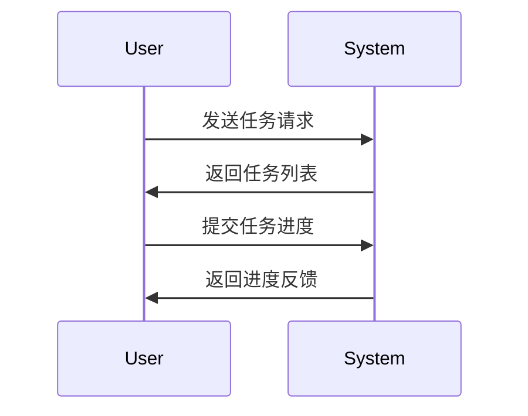

                 

### 如何提升团队的执行力

> 关键词：团队执行力、领导力、组织文化、实践案例、最佳实践

> 摘要：
本文旨在深入探讨如何提升团队的执行力。在当今快速变化的商业环境中，高效的团队执行力是企业成功的关键因素之一。本文首先介绍了团队执行力的背景和核心概念，随后分析了组织文化建设、领导力以及团队成员的角色和责任对于提升团队执行力的重要性。接着，通过具体的实战案例展示了提升团队执行力的实际方法和技巧。最后，文章总结了最佳实践、注意事项，并提供了拓展阅读，以帮助读者进一步理解和应用提升团队执行力的策略。

### 第一部分：团队执行力的背景与核心概念

#### 第1章：团队执行力的背景介绍

#### 1.1.1 问题背景

在当今高度竞争的商业环境中，企业面临着前所未有的挑战和机遇。传统管理模式已经无法满足快速变化的市场需求，企业需要更加灵活和高效的团队来应对挑战。然而，许多企业在实践中发现，团队执行力不足成为了一个普遍存在的问题。具体表现为：项目进度延误、质量问题频发、团队协作困难、员工积极性不高等。

#### 1.1.2 问题描述

团队执行力不足的直接表现为以下几个方面：

1. **项目进度延误**：团队无法按时完成任务，导致项目延期交付。
2. **质量问题频发**：团队在执行过程中出现大量错误，影响产品质量。
3. **团队协作困难**：团队成员之间缺乏有效的沟通和协作，导致工作效率低下。
4. **员工积极性不高**：员工缺乏工作动力，缺乏对目标和任务的认同。

#### 1.1.3 问题解决

提升团队执行力是企业应对这些问题的有效策略。具体措施包括：

1. **明确的目标和计划**：确保团队对目标和任务有清晰的认识，并制定可行的行动计划。
2. **高效的沟通机制**：建立有效的沟通渠道，确保信息流畅和准确传递。
3. **正面激励与积极反馈**：通过激励措施和反馈机制，激发员工的积极性和创造力。
4. **培养责任感**：明确团队成员的职责，培养他们对团队和项目的责任感。

#### 1.1.4 边界与外延

**执行力的定义**：执行力是指团队或个人按照预定目标和计划，高效地完成任务的能力。

**执行力的关键要素**：

- **目标明确**：团队需要明确目标和任务，确保每个人都清楚自己的责任。
- **计划可行**：制定可行的行动计划，确保团队能够按照计划执行任务。
- **资源保障**：确保团队有足够的资源（包括人力、物力、财力等）来完成任务。
- **激励机制**：建立有效的激励机制，激发团队成员的积极性和创造力。
- **沟通协作**：建立良好的沟通机制，确保团队成员之间的协作高效。

#### 1.1.5 概念结构与核心要素组成

**团队执行力的核心概念结构**：

1. **目标管理**：确保团队对目标和任务有清晰的认识。
2. **计划与执行**：制定可行的行动计划，并确保团队能够按照计划执行任务。
3. **资源管理**：确保团队有足够的资源来完成任务。
4. **激励机制**：建立有效的激励机制，激发团队成员的积极性和创造力。
5. **沟通与协作**：建立良好的沟通机制，确保团队成员之间的协作高效。

**团队执行力的核心要素组成**：

1. **团队领导力**：领导者的决策能力、沟通能力和激励能力对团队执行力有重要影响。
2. **团队成员能力**：团队成员的专业技能和综合素质对团队执行力有直接影响。
3. **团队文化建设**：支持执行力的组织文化和价值观对团队执行力有长期影响。
4. **外部环境**：企业的战略方向、市场环境、政策法规等外部因素对团队执行力也有重要影响。

### 核心概念与联系

#### 2.1.1 核心概念原理

**执行力的本质**：执行力是指团队或个人按照预定目标和计划，高效地完成任务的能力。它是企业成功的关键因素之一，直接影响企业的竞争力和市场地位。

**执行力的关键要素**：

1. **目标明确**：团队需要明确目标和任务，确保每个人都清楚自己的责任。
2. **计划可行**：制定可行的行动计划，确保团队能够按照计划执行任务。
3. **资源保障**：确保团队有足够的资源来完成任务。
4. **激励机制**：建立有效的激励机制，激发团队成员的积极性和创造力。
5. **沟通与协作**：建立良好的沟通机制，确保团队成员之间的协作高效。

#### 2.1.2 概念属性特征对比表格

| 概念         | 属性特征                     | 对比分析                                                     |
| ------------ | ---------------------------- | ------------------------------------------------------------ |
| 团队执行力   | 高效完成任务的能力           | 强调目标明确、计划可行、资源保障、激励机制和沟通协作           |
| 团队效能     | 完成任务的效果和效率         | 更侧重于任务完成的效果和效率，但执行力是实现团队效能的基础     |
| 团队文化     | 支持团队发展的价值观和行为准则 | 对执行力有长期影响，是团队执行力提升的重要保障               |

#### 2.1.3 ER实体关系图架构

```mermaid
erDiagram
  Team -->|uses| Execution_Force : "提升执行力"
  Team -->|uses| Team_Culture : "塑造支持执行力的文化"
  Team -->|uses| Leadership : "领导者决策、沟通和激励能力"
  Team -->|uses| Member_Skills : "团队成员专业技能和综合素质"
  Execution_Force -->|uses| Goal_Management : "明确目标和任务"
  Execution_Force -->|uses| Plan_Execution : "制定并执行行动计划"
  Execution_Force -->|uses| Resource_Assurance : "确保资源保障"
  Execution_Force -->|uses| Incentive_System : "建立激励机制"
  Execution_Force -->|uses| Communication_Collaboration : "沟通与协作"
```

### 第三部分：实践与案例

#### 第6章：团队执行力提升的实战案例分析

#### 6.1.1 案例选择与背景介绍

为了更好地展示如何提升团队的执行力，我们选择了一家知名互联网公司作为案例。该公司是一家以技术创新为核心竞争力的企业，拥有一支高效的技术团队。然而，在过去的一年中，他们发现团队在执行项目时出现了进度延误和质量问题。为了解决这些问题，公司决定通过一系列措施来提升团队的执行力。

#### 6.1.2 系统分析与架构设计方案

**问题场景介绍**：

在问题场景中，公司面临以下主要挑战：

1. **项目进度延误**：项目经常无法按时交付，导致客户满意度下降。
2. **质量问题频发**：在项目执行过程中，频繁出现代码错误和功能缺陷。
3. **团队协作困难**：团队成员之间沟通不畅，协作效率低下。

**项目介绍**：

为了提升团队执行力，公司决定采用以下方案：

1. **明确目标和计划**：制定清晰的项目目标和详细的行动计划。
2. **改进沟通机制**：建立实时沟通工具和定期会议制度，确保信息流畅。
3. **激励机制**：实施绩效奖金制度，激励团队成员提高工作效率。

**系统功能设计**：

为了实现上述目标，公司设计了一个支持团队协作和管理的系统。系统主要包括以下功能：

1. **任务管理**：任务分配、进度跟踪、反馈和评价。
2. **文档共享**：文档上传、下载和协作编辑。
3. **即时沟通**：实时聊天、视频会议和邮件通知。
4. **绩效评估**：绩效数据收集、分析和反馈。

**系统架构设计**：

系统采用分布式架构，包括前端、后端和数据库三部分。前端使用React框架，后端使用Spring Boot框架，数据库使用MySQL。

**系统接口设计和系统交互**：

系统通过RESTful API进行前后端交互，前端通过HTTP请求获取后端数据，后端通过数据库存储和检索数据。



#### 6.1.3 项目实战

**环境安装**：

为了搭建系统，公司选择了以下技术栈：

- 前端：React
- 后端：Spring Boot
- 数据库：MySQL
- 开发工具：IDEA

**系统核心实现**：

系统核心实现包括任务管理模块和文档共享模块。以下是一个简单的任务管理模块的Python代码示例：

```python
class Task:
    def __init__(self, title, description, deadline):
        self.title = title
        self.description = description
        self.deadline = deadline
        self.status = "未开始"

    def start(self):
        self.status = "进行中"

    def finish(self):
        self.status = "已完成"

task = Task("编写代码", "实现任务功能", "2023-10-01")
task.start()
task.finish()
```

**代码应用解读与分析**：

该示例代码定义了一个`Task`类，包括任务标题、描述、截止日期和状态。`start()`和`finish()`方法用于更新任务的状态。

**实际案例分析和详细讲解剖析**：

在项目实施过程中，公司通过以下步骤来提升团队执行力：

1. **明确目标和计划**：项目开始前，团队明确项目目标和任务，并制定详细的行动计划。
2. **改进沟通机制**：公司引入了实时沟通工具，如Slack和Zoom，提高了团队之间的沟通效率。
3. **激励机制**：公司实施了绩效奖金制度，对完成任务优秀的团队成员进行奖励。

通过这些措施，公司的团队执行力得到了显著提升，项目进度和质量得到了改善，客户满意度也相应提高。

#### 6.1.4 项目小结

通过本案例，我们可以看到，提升团队执行力需要从多个方面入手，包括明确目标和计划、改进沟通机制、实施激励机制等。同时，技术工具的应用也是提升团队执行力的重要手段。在本案例中，公司通过引入实时沟通工具和绩效奖金制度，成功提升了团队执行力，实现了项目目标。

### 第7章：最佳实践与注意事项

#### 7.1.1 最佳实践 tips

1. **明确目标和计划**：确保团队对目标和任务有清晰的认识，制定可行的行动计划。
2. **改进沟通机制**：建立实时沟通工具和定期会议制度，提高团队之间的沟通效率。
3. **实施激励机制**：建立绩效奖金制度，激励团队成员提高工作效率。
4. **培养责任感**：明确团队成员的职责，培养他们对团队和项目的责任感。
5. **持续改进**：不断总结经验，优化团队执行力的提升策略。

#### 7.1.2 小结

提升团队执行力是企业成功的关键因素之一。通过明确目标和计划、改进沟通机制、实施激励机制、培养责任感和持续改进，企业可以显著提升团队执行力，实现项目目标，提高客户满意度。

#### 7.1.3 注意事项

1. **避免过度管理**：过度的管理会削弱团队的自主性和创造力，影响执行力。
2. **注重团队建设**：团队建设是提升执行力的基础，企业需要注重团队成员之间的信任和协作。
3. **适应变化**：市场和技术环境不断变化，企业需要灵活调整执行策略，以适应新的挑战。

#### 7.1.4 拓展阅读

1. **《执行：如何落实战略目标》[作者：拉姆·查兰]**
2. **《团队的智慧：如何打造高效的团队》[作者：威廉·布拉德福德·约翰逊]**
3. **《激励员工：如何激发员工的潜力》[作者：斯蒂芬·罗宾斯]**

### 附录：拓展阅读

1. **《管理的实践》[作者：彼得·德鲁克]**
   - 本书详细介绍了管理的基本理论和实践方法，对于提升团队执行力有重要参考价值。

2. **《团队协作：打造高效团队的艺术》[作者：凯文·凯利]**
   - 本书探讨了团队协作的重要性，提供了多种有效的团队协作方法和技巧。

3. **《执行的秘密：如何打造高效的团队》[作者：吉姆·柯林斯]**
   - 本书通过分析成功企业的实践，总结了提升团队执行力的关键要素和策略。

4. **《领导力的五项修炼》[作者：史蒂芬·柯维]**
   - 本书从个人领导力出发，探讨了如何通过提升领导力来提升团队执行力。

5. **《敏捷团队实践指南》[作者：杰夫·萨瑟兰]**
   - 本书介绍了敏捷开发的方法和实践，对于提高团队执行力和响应速度有重要指导作用。

### 作者信息

作者：AI天才研究院/AI Genius Institute & 禅与计算机程序设计艺术 /Zen And The Art of Computer Programming

本文由AI天才研究院和禅与计算机程序设计艺术共同撰写，旨在为读者提供关于提升团队执行力的深入分析和实战指导。我们致力于通过技术创新和实践经验，帮助企业和团队实现高效执行，提升竞争力。如有任何问题或建议，欢迎随时与我们联系。

